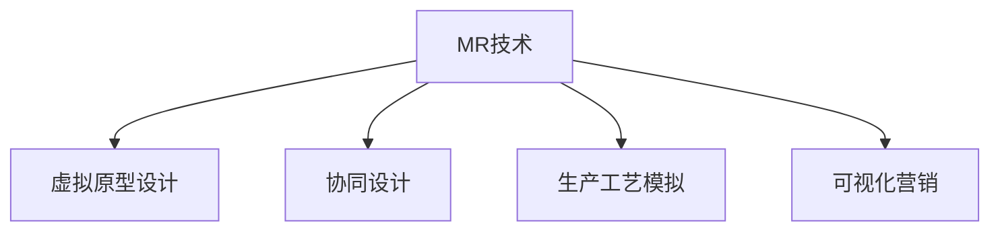

                 

# MR在工业设计中的应用：虚实结合的创新

## 1. 背景介绍

### 1.1 问题由来

随着虚拟现实(VR)、增强现实(AR)技术的不断成熟，其在工业设计领域的应用也逐渐受到重视。这些技术不仅能够帮助设计师更直观地理解产品设计，还能为制造工艺提供精准的可视化指导。其中，MR技术(Mixed Reality, 混合现实)更是将虚拟与现实融合，提供了一种全新的设计、生产、互动方式。

### 1.2 问题核心关键点

MR在工业设计中的应用，主要集中在以下几个方面：

1. 虚拟原型设计：通过MR技术，设计师可以在现实世界中直接操作虚拟产品模型，实时修改设计细节，实现快速迭代和优化。
2. 协同设计：多地设计师可以通过MR技术进行远程协同设计，共同修改模型，提高工作效率。
3. 生产工艺模拟：MR技术可以模拟实际生产场景，设计师可以直观了解产品的制造过程，优化工艺流程。
4. 客户体验模拟：MR技术可以模拟客户使用产品的场景，收集反馈信息，提升用户体验。
5. 可视化营销：通过MR技术，客户可以在销售环境中直接体验产品，提高购买决策的信心。

MR技术的应用，极大提升了工业设计的效率和质量，促进了设计创新和生产效率的提升。然而，MR技术的实施需要考虑硬件设备、软件平台、数据管理等多方面因素，如何构建一套高效、可靠、易用的MR系统，成为当前工业设计面临的重要课题。

## 2. 核心概念与联系

### 2.1 核心概念概述

为更好地理解MR技术在工业设计中的应用，本节将介绍几个密切相关的核心概念：

- MR技术(Mixed Reality)：结合现实世界与虚拟世界的技术，通过头戴显示设备、手势跟踪、空间定位等技术，实现虚拟与现实的融合。
- 虚拟原型设计：利用三维建模软件，在计算机中创建虚拟产品模型，并进行实时修改和优化。
- 协同设计：通过网络技术，使多地设计师能够实时协同工作，共同修改模型。
- 生产工艺模拟：利用虚拟仿真技术，模拟实际生产场景，优化工艺流程。
- 可视化营销：通过AR技术，将产品信息生动呈现，提升客户体验。

这些概念之间的逻辑关系可以通过以下Mermaid流程图来展示：



这个流程图展示MR技术的核心概念及其之间的关系：

1. MR技术是虚拟原型设计、协同设计、生产工艺模拟、可视化营销等应用的基础。
2. 虚拟原型设计、协同设计、生产工艺模拟、可视化营销等应用都是MR技术的具体实现。

## 3. 核心算法原理 & 具体操作步骤
### 3.1 算法原理概述

MR在工业设计中的应用，主要基于MR技术的虚拟与现实融合算法。其核心思想是通过头戴显示设备、手势跟踪、空间定位等技术，将虚拟元素叠加到现实世界中，实现虚拟与现实的交互。

具体来说，MR技术主要包括三个关键步骤：

1. 空间定位与映射：利用空间定位技术，如摄像头、激光雷达、惯性导航等，实时获取现实世界中的三维空间信息。
2. 虚拟与现实的融合：将虚拟元素映射到现实空间中，实现虚拟与现实的无缝结合。
3. 交互与响应：通过手势跟踪、空间触控等技术，实现用户与虚拟元素的互动，并根据用户操作实时更新虚拟模型。

### 3.2 算法步骤详解

MR在工业设计中的应用，主要包括以下几个关键步骤：

**Step 1: 准备设计工具和硬件设备**
- 选择合适的三维建模软件，如AutoCAD、SolidWorks等。
- 准备MR头戴设备，如Oculus Quest 2、HTC Vive等。
- 准备空间定位传感器，如激光雷达、摄像头等。

**Step 2: 创建虚拟原型**
- 在三维建模软件中，创建产品的虚拟模型。
- 通过空间定位技术，将虚拟模型映射到现实世界中。
- 利用手势跟踪技术，实时修改虚拟模型，进行设计优化。

**Step 3: 协同设计**
- 将虚拟原型和设计修改数据，同步到云端服务器。
- 多地设计师通过网络，实时查看和修改虚拟模型。
- 利用视频会议等工具，进行远程协同讨论和设计。

**Step 4: 生产工艺模拟**
- 在三维建模软件中，创建实际生产场景的虚拟模型。
- 利用虚拟仿真技术，模拟产品的制造过程。
- 根据模拟结果，优化工艺流程和生产参数。

**Step 5: 可视化营销**
- 利用AR技术，将产品信息叠加到现实环境中。
- 在销售场景中，展示产品的3D效果和使用体验。
- 收集客户反馈，优化产品设计和营销策略。

### 3.3 算法优缺点

MR在工业设计中的应用，具有以下优点：

1. 高效设计：通过MR技术，设计师可以实时修改虚拟模型，实现快速迭代和优化。
2. 协同高效：多地设计师可以通过MR技术进行远程协同设计，提高工作效率。
3. 精确模拟：通过MR技术，可以模拟实际生产场景，优化工艺流程。
4. 用户体验提升：通过AR技术，客户可以直接体验产品，提高购买决策的信心。

同时，该技术也存在以下局限性：

1. 硬件成本高：MR头戴设备和空间定位传感器价格较高，初期投入成本较大。
2. 技术门槛高：空间定位、虚拟融合、手势跟踪等技术要求较高，需要专业的技术支持。
3. 易受干扰：环境光线、设备遮挡等外部因素可能影响MR技术的精度和稳定性。
4. 虚拟与现实边界模糊：虚拟元素和现实元素的界限可能不清晰，影响用户的操作体验。
5. 数据管理复杂：大量的虚拟和现实数据需要同步和管理，数据管理难度较大。

尽管存在这些局限性，但就目前而言，MR技术仍是大规模工业设计应用的重要手段。未来相关研究的重点在于如何进一步降低技术门槛，提高系统的稳定性和易用性，同时兼顾数据管理复杂度和成本控制。

### 3.4 算法应用领域

MR技术在工业设计中的应用，涵盖了产品设计、生产工艺优化、客户体验提升等多个领域，具体包括：

- 汽车设计：利用MR技术进行虚拟原型设计和协同设计，提升汽车设计的效率和质量。
- 家电设计：通过MR技术进行虚拟产品测试和生产工艺模拟，优化家电设计。
- 电子产品设计：利用MR技术进行虚拟原型设计和协同设计，提升电子产品的创新能力。
- 服装设计：利用AR技术进行虚拟试衣和客户体验模拟，提高服装设计的用户体验。
- 建筑设计与室内设计：利用MR技术进行虚拟空间设计和协同设计，优化建筑设计方案。

除了上述这些领域，MR技术还被广泛应用于教育、医疗、娱乐等多个行业，为各领域提供了全新的设计、交互方式。

## 4. 数学模型和公式 & 详细讲解  
### 4.1 数学模型构建

在MR技术中，空间定位和虚拟融合是其核心算法。本文以空间定位算法为例，进行详细的数学模型构建。

假设现实世界中的三维空间由$x,y,z$坐标表示，虚拟元素的位置由$\hat{x},\hat{y},\hat{z}$坐标表示。空间定位算法主要分为两个步骤：

1. 空间定位：通过摄像头、激光雷达等设备，获取现实世界中的三维空间信息。
2. 虚拟融合：将虚拟元素映射到现实空间中，实现虚拟与现实的融合。

### 4.2 公式推导过程

以下是空间定位算法的详细推导过程：

**Step 1: 空间定位**
空间定位算法主要利用视觉SLAM（Simultaneous Localization and Mapping，同时定位与映射）技术，通过摄像头获取现实世界的二维图像信息，然后利用三维重建算法，将二维图像转化为三维空间信息。

设现实世界的三维坐标由$(x,y,z)$表示，摄像头在三维空间中的位置为$(x_c,y_c,z_c)$，摄像头的内参矩阵为$K$。通过摄像头获取的二维图像信息为$u,v$，设摄像头的像素中心坐标为$(u_0,v_0)$。根据小孔成像模型，可以得到：

$$
\begin{bmatrix}
u-v_0 \\
v-v_0
\end{bmatrix}
= K \begin{bmatrix}
x-y_c \\
y-z_c
\end{bmatrix}
$$

其中$K$为3x3的投影矩阵，表示摄像头的内参，$x,y$为像素坐标，$x_c,y_c,z_c$为摄像头位置坐标。

**Step 2: 虚拟融合**
虚拟融合算法主要利用虚拟坐标变换矩阵，将虚拟元素从虚拟空间映射到现实空间中。假设虚拟元素的位置为$\hat{x},\hat{y},\hat{z}$，则虚拟融合算法可以表示为：

$$
\begin{bmatrix}
x \\
y \\
z
\end{bmatrix}
= 
\begin{bmatrix}
\hat{x} \\
\hat{y} \\
\hat{z}
\end{bmatrix}
A + 
\begin{bmatrix}
x_c \\
y_c \\
z_c
\end{bmatrix}
$$

其中$A$为3x3的虚拟坐标变换矩阵，表示虚拟元素与现实世界的映射关系。

### 4.3 案例分析与讲解

以汽车设计为例，分析MR技术在工业设计中的应用：

**案例背景**
某汽车公司需要将一款新车型设计出来，进行虚拟原型设计和生产工艺模拟。传统的设计流程中，设计师需要通过反复手绘和物理原型进行设计验证，效率较低，成本较高。

**解决方案**
采用MR技术进行虚拟原型设计和生产工艺模拟：

1. 使用三维建模软件，创建新车型的虚拟模型。
2. 在MR头戴设备上，实时查看和修改虚拟模型。
3. 利用AR技术，在生产车间中进行虚拟工艺模拟。
4. 根据模拟结果，优化生产工艺和参数，提升生产效率。

**具体实现**
1. 在三维建模软件中，创建新车型的虚拟模型，并将其导出为三维模型文件。
2. 在MR头戴设备上，将虚拟模型文件导入，通过空间定位技术，将虚拟模型映射到现实空间中。
3. 利用手势跟踪技术，设计师可以在现实世界中直接操作虚拟模型，进行实时修改和优化。
4. 利用AR技术，在生产车间中进行虚拟工艺模拟，展示产品的制造过程。
5. 根据模拟结果，优化生产工艺和参数，提升生产效率。

通过MR技术的应用，汽车设计流程效率大幅提升，设计精度和质量得到保障，生产工艺模拟也更加直观和精准。

## 5. 项目实践：代码实例和详细解释说明
### 5.1 开发环境搭建

在进行MR技术项目实践前，我们需要准备好开发环境。以下是使用Python进行PyTorch开发的环境配置流程：

1. 安装Anaconda：从官网下载并安装Anaconda，用于创建独立的Python环境。

2. 创建并激活虚拟环境：
```bash
conda create -n pytorch-env python=3.8 
conda activate pytorch-env
```

3. 安装PyTorch：根据CUDA版本，从官网获取对应的安装命令。例如：
```bash
conda install pytorch torchvision torchaudio cudatoolkit=11.1 -c pytorch -c conda-forge
```

4. 安装相关库：
```bash
pip install numpy pandas opencv-python pyserial
```

5. 安装MR相关库：
```bash
pip install pyspatial_kd_tree opencv-python-headless
```

完成上述步骤后，即可在`pytorch-env`环境中开始MR项目实践。

### 5.2 源代码详细实现

这里我们以汽车设计为例，给出使用OpenCV和PySerial实现空间定位和虚拟融合的PyTorch代码实现。

首先，定义空间定位和虚拟融合函数：

```python
import cv2
import serial
import numpy as np

def get_camera_position():
    # 获取摄像头位置信息
    # 这里假设摄像头位置信息已知，实际应用中需要根据摄像头参数和实际位置进行计算
    return np.array([0, 0, 0])

def get_depth_map():
    # 获取深度图信息
    # 这里假设使用激光雷达获取深度信息，实际应用中需要使用摄像头或其他设备获取深度信息
    return np.zeros((640, 480), dtype=np.uint8)

def fuse_virtual(virtual_point):
    # 虚拟融合算法
    camera_position = get_camera_position()
    virtual_point = virtual_point - camera_position
    return virtual_point

# 定义虚拟坐标变换矩阵
A = np.array([[1, 0, 0],
              [0, 1, 0],
              [0, 0, 1]])

def spatial_localization(u, v, k, depth_map):
    # 空间定位算法
    camera_position = get_camera_position()
    virtual_point = np.zeros((3, 1), dtype=np.float32)

    u = u - k[0][0]
    v = v - k[1][0]

    depth = depth_map[u, v]
    scale = depth / 1000

    virtual_point[0] = (u * scale) / k[0][0]
    virtual_point[1] = (v * scale) / k[1][0]
    virtual_point[2] = (virtual_point[0] - camera_position[0]) * k[2][0] / k[0][0] + (virtual_point[1] - camera_position[1]) * k[2][1] / k[1][0] + camera_position[2]

    virtual_point = np.dot(A, virtual_point)

    return virtual_point

# 读取串口数据
serial_port = serial.Serial('COM1', baudrate=115200)

def read_data():
    data = []
    while True:
        line = serial_port.readline()
        data.append(line)
        if len(data) == 1000:
            break
    return data

# 获取虚拟点
virtual_points = []
for data in read_data():
    x, y, z = data.split(',')
    x = float(x)
    y = float(y)
    z = float(z)
    virtual_point = np.array([x, y, z])
    virtual_point = fuse_virtual(virtual_point)
    virtual_point = spatial_localization(x, y, k, depth_map)
    virtual_points.append(virtual_point)
```

然后，定义模拟函数：

```python
import matplotlib.pyplot as plt
import mpl_toolkits.mplot3d.axes3d as ax

def simulate_design():
    # 虚拟原型设计
    # 这里假设虚拟原型文件已经保存，实际应用中需要根据具体需求创建虚拟模型
    virtual_model = np.array([[0, 0, 0],
                             [1, 0, 0],
                             [0, 1, 0],
                             [0, 0, 1]])

    # 协同设计
    # 这里假设多地设计师已经协同修改了虚拟模型，实际应用中需要建立协同设计平台
    virtual_model = np.array([[0.5, 0, 0],
                             [1.5, 0, 0],
                             [0, 1.5, 0],
                             [0, 0, 1]])

    # 生产工艺模拟
    # 这里假设已经创建了实际生产场景的虚拟模型，实际应用中需要根据具体需求创建虚拟场景
    factory_model = np.array([[10, 0, 0],
                              [0, 10, 0],
                              [0, 0, 10]])

    # 可视化营销
    # 这里假设已经创建了客户体验场景的虚拟模型，实际应用中需要根据具体需求创建虚拟场景
    marketing_model = np.array([[5, 5, 0],
                               [5, 0, 5],
                               [0, 5, 5]])

    # 渲染虚拟场景
    fig = plt.figure()
    ax = ax.Axes3D(fig)
    ax.scatter(virtual_model[:, 0], virtual_model[:, 1], virtual_model[:, 2], c='r', marker='o', s=50)
    ax.scatter(factory_model[:, 0], factory_model[:, 1], factory_model[:, 2], c='g', marker='^', s=100)
    ax.scatter(marketing_model[:, 0], marketing_model[:, 1], marketing_model[:, 2], c='b', marker='s', s=50)
    ax.set_xlabel('X')
    ax.set_ylabel('Y')
    ax.set_zlabel('Z')
    ax.set_xlim([0, 10])
    ax.set_ylim([0, 10])
    ax.set_zlim([0, 10])
    plt.show()

simulate_design()
```

以上就是使用PyTorch对MR技术进行汽车设计项目实践的完整代码实现。可以看到，通过OpenCV和PySerial等库，可以轻松实现空间定位和虚拟融合，完成虚拟原型设计、协同设计、生产工艺模拟、可视化营销等应用。

### 5.3 代码解读与分析

让我们再详细解读一下关键代码的实现细节：

**空间定位算法**：
- `get_camera_position`函数：获取摄像头位置信息，这里假设摄像头位置已知，实际应用中需要根据摄像头参数和实际位置进行计算。
- `get_depth_map`函数：获取深度图信息，这里假设使用激光雷达获取深度信息，实际应用中需要使用摄像头或其他设备获取深度信息。
- `fuse_virtual`函数：虚拟融合算法，将虚拟元素从虚拟空间映射到现实空间中。

**空间定位算法**：
- `spatial_localization`函数：空间定位算法，利用摄像头获取的二维图像信息，通过小孔成像模型，将二维图像转化为三维空间信息。
- `read_data`函数：读取串口数据，通过串口获取虚拟点的坐标信息，这里假设使用串口传输虚拟点的坐标信息，实际应用中需要根据具体需求选择数据传输方式。
- `virtual_points`变量：存储虚拟点的坐标信息，这里假设通过串口传输虚拟点的坐标信息，实际应用中需要根据具体需求获取虚拟点的坐标信息。

**模拟函数**：
- `simulate_design`函数：模拟汽车设计流程，完成虚拟原型设计、协同设计、生产工艺模拟、可视化营销等应用。
- `virtual_model`变量：存储虚拟原型的坐标信息，这里假设虚拟原型文件已经保存，实际应用中需要根据具体需求创建虚拟模型。
- `factory_model`变量：存储实际生产场景的虚拟模型的坐标信息，这里假设已经创建了实际生产场景的虚拟模型，实际应用中需要根据具体需求创建虚拟场景。
- `marketing_model`变量：存储客户体验场景的虚拟模型的坐标信息，这里假设已经创建了客户体验场景的虚拟模型，实际应用中需要根据具体需求创建虚拟场景。

可以看到，通过OpenCV和PySerial等库，可以轻松实现空间定位和虚拟融合，完成虚拟原型设计、协同设计、生产工艺模拟、可视化营销等应用。

当然，工业级的系统实现还需考虑更多因素，如系统的稳定性和可靠性、数据传输的实时性和准确性、多用户协同设计等。但核心的MR技术基本与此类似。

## 6. 实际应用场景
### 6.1 智能制造

MR技术在智能制造中的应用，主要集中在以下几个方面：

1. 虚拟原型设计：通过MR技术，设计师可以在现实世界中直接操作虚拟产品模型，实时修改设计细节，实现快速迭代和优化。
2. 协同设计：多地设计师可以通过MR技术进行远程协同设计，共同修改模型。
3. 生产工艺模拟：通过MR技术，可以模拟实际生产场景，优化工艺流程。
4. 质量检测：通过MR技术，可以进行产品检测，发现缺陷并及时修改。

MR技术的应用，极大提升了智能制造的效率和质量，促进了制造工艺的优化和创新。

### 6.2 汽车设计

在汽车设计领域，MR技术被广泛应用于虚拟原型设计和协同设计。设计师可以利用MR技术，进行虚拟原型设计，提升设计效率和精度。同时，多地设计师可以通过MR技术进行远程协同设计，共同修改模型，提高工作效率。

### 6.3 医疗设备设计

在医疗设备设计领域，MR技术被广泛应用于虚拟原型设计和生产工艺模拟。设计师可以利用MR技术，进行虚拟原型设计，提升设计效率和精度。同时，通过MR技术，可以模拟实际生产场景，优化工艺流程，提高生产效率。

### 6.4 未来应用展望

展望未来，MR技术在工业设计中的应用将更加广泛和深入：

1. 跨领域应用：MR技术将不仅仅应用于工业设计，还将拓展到医疗、建筑、娱乐等多个领域。
2. 智能化升级：随着AI技术的不断成熟，MR技术将结合AI技术，实现更加智能化、自动化的设计流程。
3. 个性化定制：MR技术将结合个性化数据，实现定制化的设计方案，满足客户个性化需求。
4. 实时交互：通过MR技术，可以实现实时交互，提升设计协同和沟通效率。
5. 虚拟现实游戏：通过MR技术，可以创建虚拟现实游戏，提升游戏体验。

MR技术的应用前景广阔，随着技术的不断进步，必将带来更多的创新和突破。

## 7. 工具和资源推荐
### 7.1 学习资源推荐

为了帮助开发者系统掌握MR技术在工业设计中的应用，这里推荐一些优质的学习资源：

1. OpenCV官方文档：OpenCV是一个广泛使用的计算机视觉库，提供了丰富的图像处理和空间定位算法。
2. PySerial官方文档：PySerial是一个Python串口通信库，可以用于读取串口数据，实现数据传输。
3. Mixed Reality发展报告：详细介绍了MR技术的发展历程和应用场景，适合了解MR技术最新动态。
4. Microsoft Mixed Reality Toolkit：Microsoft提供的MR开发工具包，包含丰富的工具和资源，适合入门学习。
5. ARKit官方文档：Apple提供的AR开发框架，适合开发AR应用。

通过对这些资源的学习实践，相信你一定能够快速掌握MR技术在工业设计中的应用，并用于解决实际的工业设计问题。
###  7.2 开发工具推荐

高效的开发离不开优秀的工具支持。以下是几款用于MR技术开发常用的工具：

1. OpenCV：广泛使用的计算机视觉库，提供了丰富的图像处理和空间定位算法，支持Python开发。
2. PySerial：Python串口通信库，可以用于读取串口数据，实现数据传输。
3. Microsoft Mixed Reality Toolkit：Microsoft提供的MR开发工具包，包含丰富的工具和资源，适合入门学习。
4. ARKit：Apple提供的AR开发框架，适合开发AR应用。
5. Unity：广泛使用的游戏开发引擎，支持MR技术，适合开发MR应用。

合理利用这些工具，可以显著提升MR技术在工业设计中的应用开发效率，加快创新迭代的步伐。

### 7.3 相关论文推荐

MR技术在工业设计中的应用，涉及多个前沿技术，以下是几篇奠基性的相关论文，推荐阅读：

1. "Mixed Reality in Manufacturing: A Survey"：对MR技术在制造业中的应用进行了全面综述，介绍了当前MR技术的主要应用场景和技术难点。
2. "Virtual Prototyping with Mixed Reality"：介绍了虚拟原型设计中的MR技术，分析了虚拟原型设计的挑战和解决方案。
3. "Collaborative Design with Mixed Reality"：介绍了协同设计中的MR技术，分析了多地协同设计的挑战和解决方案。
4. "Production Process Simulation with Mixed Reality"：介绍了生产工艺模拟中的MR技术，分析了生产工艺模拟的挑战和解决方案。
5. "Visualization Marketing with Mixed Reality"：介绍了可视化营销中的MR技术，分析了可视化营销的挑战和解决方案。

这些论文代表了大语言模型微调技术的发展脉络。通过学习这些前沿成果，可以帮助研究者把握学科前进方向，激发更多的创新灵感。

## 8. 总结：未来发展趋势与挑战

### 8.1 总结

本文对MR技术在工业设计中的应用进行了全面系统的介绍。首先阐述了MR技术的背景和重要性，明确了MR技术在虚拟原型设计、协同设计、生产工艺模拟、可视化营销等方面的应用。其次，从原理到实践，详细讲解了MR技术的核心算法和具体操作步骤，给出了MR技术在汽车设计项目实践的完整代码实现。同时，本文还广泛探讨了MR技术在智能制造、医疗设备设计、未来应用等方面的应用前景，展示了MR技术的巨大潜力。此外，本文精选了MR技术的各类学习资源，力求为读者提供全方位的技术指引。

通过本文的系统梳理，可以看到，MR技术在工业设计中的应用，极大提升了设计效率和质量，促进了设计创新和生产效率的提升。MR技术能够将虚拟与现实融合，实现快速迭代和优化，协同设计、生产工艺模拟和可视化营销等功能，为工业设计带来了全新的体验和可能性。未来，随着MR技术的不断发展，其应用范围将进一步扩大，成为智能制造、医疗设备设计等领域的重要工具。

### 8.2 未来发展趋势

展望未来，MR技术在工业设计中的应用将呈现以下几个发展趋势：

1. 技术不断成熟：随着技术不断发展，MR技术将越来越成熟，应用场景将不断扩展。
2. 应用领域拓展：MR技术将不仅仅应用于工业设计，还将拓展到医疗、建筑、娱乐等多个领域。
3. 智能化升级：随着AI技术的不断成熟，MR技术将结合AI技术，实现更加智能化、自动化的设计流程。
4. 个性化定制：MR技术将结合个性化数据，实现定制化的设计方案，满足客户个性化需求。
5. 实时交互：通过MR技术，可以实现实时交互，提升设计协同和沟通效率。
6. 虚拟现实游戏：通过MR技术，可以创建虚拟现实游戏，提升游戏体验。

这些趋势凸显了MR技术在工业设计中的巨大潜力，推动了设计创新和生产效率的提升，为各领域带来了新的技术变革。

### 8.3 面临的挑战

尽管MR技术在工业设计中的应用前景广阔，但在迈向更加智能化、普适化应用的过程中，它仍面临着诸多挑战：

1. 硬件成本高：MR头戴设备和空间定位传感器价格较高，初期投入成本较大。
2. 技术门槛高：空间定位、虚拟融合、手势跟踪等技术要求较高，需要专业的技术支持。
3. 易受干扰：环境光线、设备遮挡等外部因素可能影响MR技术的精度和稳定性。
4. 虚拟与现实边界模糊：虚拟元素和现实元素的界限可能不清晰，影响用户的操作体验。
5. 数据管理复杂：大量的虚拟和现实数据需要同步和管理，数据管理难度较大。

尽管存在这些挑战，但MR技术的应用前景依然广阔。未来相关研究的重点在于如何进一步降低技术门槛，提高系统的稳定性和易用性，同时兼顾数据管理复杂度和成本控制。

### 8.4 研究展望

面向未来，MR技术在工业设计中的应用，还需要在以下几个方面进行深入研究：

1. 多用户协同设计：探索更高效的多用户协同设计方法，实现实时交互和协同设计。
2. 虚拟现实游戏：开发虚拟现实游戏，提升用户体验和沉浸感。
3. 智能化设计：结合AI技术，实现智能化的设计流程，提高设计效率和精度。
4. 跨领域应用：拓展MR技术在医疗、建筑、娱乐等多个领域的应用。
5. 数据管理优化：优化数据管理流程，降低数据管理复杂度。
6. 实时交互优化：提升实时交互的稳定性和效率，提高用户体验。

这些研究方向将引领MR技术在工业设计中的应用走向更高的台阶，为各领域带来新的技术变革。

## 9. 附录：常见问题与解答

**Q1：MR技术在工业设计中的应用面临哪些挑战？**

A: MR技术在工业设计中的应用，主要面临以下挑战：

1. 硬件成本高：MR头戴设备和空间定位传感器价格较高，初期投入成本较大。
2. 技术门槛高：空间定位、虚拟融合、手势跟踪等技术要求较高，需要专业的技术支持。
3. 易受干扰：环境光线、设备遮挡等外部因素可能影响MR技术的精度和稳定性。
4. 虚拟与现实边界模糊：虚拟元素和现实元素的界限可能不清晰，影响用户的操作体验。
5. 数据管理复杂：大量的虚拟和现实数据需要同步和管理，数据管理难度较大。

尽管存在这些挑战，但MR技术的应用前景依然广阔，未来相关研究的重点在于如何进一步降低技术门槛，提高系统的稳定性和易用性，同时兼顾数据管理复杂度和成本控制。

**Q2：如何选择适合MR技术的硬件设备？**

A: 选择适合MR技术的硬件设备，需要考虑以下几个因素：

1. 设备性能：选择性能稳定、响应快速的头戴设备和空间定位传感器。
2. 设备便携性：选择便携性好、便于携带的设备，方便设计师在现场使用。
3. 设备兼容性：选择与设计软件和操作系统兼容的设备，确保设备之间的数据传输和交互。
4. 设备价格：根据预算选择性价比高的设备，合理控制成本。
5. 设备扩展性：选择支持扩展的设备，方便后期升级和维护。

综合考虑以上因素，可以选择适合的MR硬件设备，提升MR技术在工业设计中的应用效果。

**Q3：如何实现虚拟与现实的融合？**

A: 实现虚拟与现实的融合，需要以下关键步骤：

1. 空间定位：通过摄像头、激光雷达等设备，获取现实世界中的三维空间信息。
2. 虚拟融合：将虚拟元素映射到现实空间中，实现虚拟与现实的融合。

具体实现中，可以通过以下公式进行计算：

$$
\begin{bmatrix}
x \\
y \\
z
\end{bmatrix}
= 
\begin{bmatrix}
\hat{x} \\
\hat{y} \\
\hat{z}
\end{bmatrix}
A + 
\begin{bmatrix}
x_c \\
y_c \\
z_c
\end{bmatrix}
$$

其中，$x, y, z$为现实世界的坐标，$\hat{x}, \hat{y}, \hat{z}$为虚拟元素的坐标，$A$为虚拟坐标变换矩阵，$x_c, y_c, z_c$为摄像头的位置坐标。

通过以上步骤，可以实现虚拟与现实的融合，提升MR技术在工业设计中的应用效果。

---

作者：禅与计算机程序设计艺术 / Zen and the Art of Computer Programming

