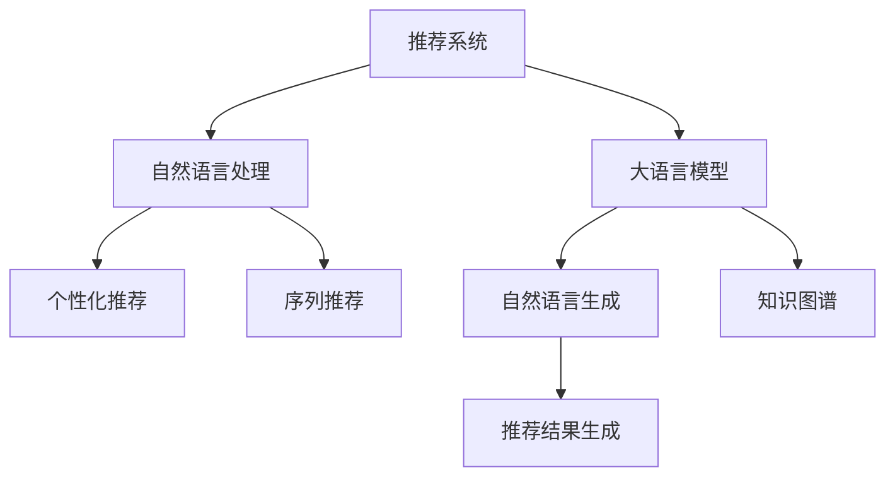

                 

# NLP技术在推荐系统的应用：大模型的潜力

> 关键词：推荐系统, 大语言模型, 自然语言处理, 个性化推荐, 序列推荐, 自然语言生成, 知识图谱

## 1. 背景介绍

### 1.1 问题由来
推荐系统（Recommendation System）是互联网应用的核心技术之一，它通过分析用户行为数据，为用户推荐感兴趣的内容。传统的推荐系统主要依赖于用户历史行为数据，如浏览、点击、评分等，进行协同过滤、矩阵分解等算法。然而，这些方法在数据稀疏、新用户少的情况下效果不佳，难以满足用户个性化需求。

近年来，随着深度学习技术的兴起，自然语言处理（NLP）技术被引入推荐系统中，推动了个性化推荐技术的进步。特别是大语言模型（Large Language Model, LLM）的引入，使得推荐系统具备了理解和生成自然语言的能力，能够从文本数据中提取更深层次的语义信息，提供了更加丰富、精准的推荐结果。

### 1.2 问题核心关键点
大语言模型在推荐系统中的应用，主要集中在以下几个方面：
1. **用户行为理解**：通过分析用户评论、评价、反馈等文本数据，理解用户对内容的情感倾向、兴趣点。
2. **上下文建模**：利用语言模型捕捉用户与内容间的语义关联，进行上下文语义推理。
3. **推荐结果生成**：将用户兴趣、内容特征等转换为自然语言，生成推荐结果。

## 2. 核心概念与联系

### 2.1 核心概念概述

为更好地理解NLP技术在推荐系统中的应用，本节将介绍几个密切相关的核心概念：

- **推荐系统（Recommendation System）**：通过分析用户行为数据，为用户推荐感兴趣的内容。包括协同过滤、基于内容的推荐、混合推荐等算法。
- **自然语言处理（Natural Language Processing, NLP）**：研究计算机如何理解和处理自然语言的技术。包括文本分类、信息抽取、问答系统、自然语言生成等任务。
- **大语言模型（Large Language Model, LLM）**：如BERT、GPT等，通过大规模无标签文本语料进行预训练，学习通用的语言表示，具备强大的语言理解和生成能力。
- **个性化推荐（Personalized Recommendation）**：针对用户个性化需求，推荐感兴趣的内容。包括基于内容的推荐、协同过滤、混合推荐等算法。
- **序列推荐（Sequential Recommendation）**：考虑用户序列行为数据，对未来行为进行预测推荐。包括序列协同过滤、序列矩阵分解等算法。
- **自然语言生成（Natural Language Generation, NLG）**：将结构化数据转换为自然语言，生成推荐结果。包括基于规则的NLG、基于模板的NLG、基于序列模型的NLG等。
- **知识图谱（Knowledge Graph）**：以图结构存储和关联实体之间的关系，支持实体链接、推理等应用。

这些核心概念之间的逻辑关系可以通过以下Mermaid流程图来展示：



这个流程图展示了大语言模型在推荐系统中的应用核心概念及其之间的关系：

1. 推荐系统通过大语言模型和NLP技术，从文本数据中提取用户兴趣和内容特征。
2. 个性化推荐利用用户行为数据和语言模型，生成个性化推荐结果。
3. 序列推荐考虑用户历史行为序列，进行未来行为预测。
4. 自然语言生成将推荐结果转换为自然语言，增强用户体验。

这些概念共同构成了NLP技术在推荐系统中的应用框架，使其能够从多角度、多维度提升推荐系统的性能和效果。

## 3. 核心算法原理 & 具体操作步骤
### 3.1 算法原理概述

NLP技术在推荐系统中的应用，主要是通过大语言模型对文本数据进行语义理解和特征提取，从而生成推荐结果。以下是NLP技术在推荐系统中的核心算法原理：

1. **文本嵌入（Text Embedding）**：将文本数据转换为低维向量表示，捕捉文本之间的语义关系。常用的方法包括Word2Vec、GloVe、BERT等。

2. **用户意图理解（User Intent Understanding）**：利用语言模型对用户评论、评价、反馈等文本数据进行情感分析、意图识别等处理，理解用户的兴趣点和需求。

3. **上下文建模（Context Modeling）**：通过语言模型捕捉用户与内容间的语义关联，进行上下文语义推理，考虑多轮对话等上下文信息。

4. **推荐结果生成（Recommendation Result Generation）**：将用户兴趣、内容特征等转换为自然语言，生成推荐结果。常用的方法包括基于规则的NLG、基于模板的NLG、基于序列模型的NLG等。

### 3.2 算法步骤详解

NLP技术在推荐系统中的应用主要包括以下几个关键步骤：

**Step 1: 数据准备**
- 收集用户行为数据，如浏览、点击、评分等。
- 收集用户评论、评价、反馈等文本数据。
- 对文本数据进行清洗、分词、编码等预处理。

**Step 2: 特征提取**
- 利用文本嵌入模型（如BERT）对文本数据进行编码，获得文本特征向量。
- 根据用户行为数据提取用户特征，如历史浏览、点击、评分等。

**Step 3: 用户意图理解**
- 利用语言模型对用户评论、评价、反馈等文本数据进行情感分析、意图识别等处理。
- 根据用户情感倾向和意图，生成用户兴趣向量。

**Step 4: 上下文建模**
- 利用语言模型捕捉用户与内容间的语义关联，进行上下文语义推理。
- 考虑多轮对话等上下文信息，更新用户兴趣向量。

**Step 5: 推荐结果生成**
- 将用户兴趣向量、内容特征向量等输入推荐模型，进行推荐计算。
- 利用自然语言生成模型，将推荐结果转换为自然语言，生成推荐结果。

**Step 6: 模型训练与评估**
- 利用标注数据对推荐模型进行训练，优化模型参数。
- 在验证集上评估模型性能，调整超参数，优化模型效果。

### 3.3 算法优缺点

NLP技术在推荐系统中的应用具有以下优点：
1. **语义理解**：能够从文本数据中提取更深层次的语义信息，提供更加丰富、精准的推荐结果。
2. **上下文建模**：利用语言模型捕捉用户与内容间的语义关联，进行上下文语义推理，考虑多轮对话等上下文信息，提升推荐效果。
3. **推荐结果生成**：将推荐结果转换为自然语言，增强用户体验，提升推荐系统的可读性和可操作性。

同时，该方法也存在一定的局限性：
1. **计算资源需求高**：预训练语言模型的参数量巨大，对算力、内存、存储等资源需求高。
2. **数据质量要求高**：NLP模型对数据质量要求较高，需要高质量的文本数据和标注数据。
3. **冷启动问题**：新用户、新商品等缺乏足够数据，导致推荐效果不佳。
4. **模型复杂度高**：NLP模型通常比较复杂，需要较长的训练时间和较大的计算资源。

尽管存在这些局限性，但NLP技术在推荐系统中的应用仍然是大数据时代下，提升推荐系统性能的重要手段。未来相关研究的方向是如何在保证推荐效果的前提下，降低模型复杂度，提高训练效率，优化计算资源使用，以及更好地应对冷启动问题。

### 3.4 算法应用领域

NLP技术在推荐系统中的应用已经得到了广泛的应用，覆盖了多个领域：

- **电商推荐**：通过分析用户评论、评价、购物车数据，为用户推荐感兴趣的商品。
- **内容推荐**：利用用户对文章、视频、音乐等的评论、评分数据，推荐相关内容。
- **视频推荐**：分析用户对视频内容的评论、评分、观看历史，推荐用户感兴趣的视频。
- **新闻推荐**：利用用户对新闻内容的评论、点赞数据，推荐相关新闻。
- **旅游推荐**：通过分析用户对旅游地点的评价、评论，推荐用户感兴趣的目的地。

除了上述这些经典应用外，NLP技术在推荐系统中的应用还在不断拓展，如可控文本生成、少样本学习等前沿研究方向。随着NLP技术和推荐系统的不断发展，未来的推荐系统必将在更多领域大放异彩。

## 4. 数学模型和公式 & 详细讲解 & 举例说明

### 4.1 数学模型构建

NLP技术在推荐系统中的应用涉及多个数学模型，以下是其中几个关键模型的数学模型构建：

1. **文本嵌入（Text Embedding）**：假设文本数据由 $D$ 个样本组成，每个样本由 $n$ 个词语 $x_i=(x_{i1},x_{i2},\dots,x_{in})$ 组成，文本嵌入模型通过将每个词语转换为低维向量表示 $e_i=(e_{i1},e_{i2},\dots,e_{dk})$，捕捉文本之间的语义关系。

2. **用户意图理解（User Intent Understanding）**：假设用户评论数据由 $N$ 个样本组成，每个样本 $y_i=(y_{i1},y_{i2},\dots,y_{in})$，利用语言模型对用户评论数据进行情感分析、意图识别等处理，得到用户意图向量 $u_i=(u_{i1},u_{i2},\dots,u_{m})$。

3. **上下文建模（Context Modeling）**：假设上下文数据由 $K$ 个样本组成，每个样本 $c_k=(c_{k1},c_{k2},\dots,c_{km})$，利用语言模型捕捉用户与内容间的语义关联，进行上下文语义推理，生成上下文向量 $h_k=(h_{k1},h_{k2},\dots,h_{km})$。

4. **推荐结果生成（Recommendation Result Generation）**：假设推荐结果由 $R$ 个样本组成，每个样本 $r_j=(r_{j1},r_{j2},\dots,r_{jm})$，利用自然语言生成模型，将推荐结果转换为自然语言，生成推荐结果。

### 4.2 公式推导过程

以下是上述几个模型的公式推导过程：

1. **文本嵌入（Text Embedding）**
   假设文本嵌入模型为 $E_{\theta}$，输入为 $x_i$，输出为 $e_i$，则有：
   $$
   e_i = E_{\theta}(x_i)
   $$
   其中 $\theta$ 为模型参数，$E_{\theta}$ 为嵌入模型。

2. **用户意图理解（User Intent Understanding）**
   假设情感分析模型为 $F_{\phi}$，意图识别模型为 $I_{\psi}$，用户评论数据为 $y_i$，则有：
   $$
   u_i = F_{\phi}(y_i) + I_{\psi}(y_i)
   $$
   其中 $\phi$ 和 $\psi$ 为模型参数，$F_{\phi}$ 和 $I_{\psi}$ 为情感分析和意图识别模型。

3. **上下文建模（Context Modeling）**
   假设上下文建模模型为 $H_{\rho}$，上下文数据为 $c_k$，则有：
   $$
   h_k = H_{\rho}(c_k)
   $$
   其中 $\rho$ 为模型参数，$H_{\rho}$ 为上下文建模模型。

4. **推荐结果生成（Recommendation Result Generation）**
   假设自然语言生成模型为 $G_{\omega}$，推荐结果为 $r_j$，则有：
   $$
   r_j = G_{\omega}(u_i, h_k)
   $$
   其中 $\omega$ 为模型参数，$G_{\omega}$ 为自然语言生成模型。

### 4.3 案例分析与讲解

假设我们有一个电商平台，需要为用户推荐商品。平台收集了用户对商品、商品的评论数据，并使用BERT模型进行文本嵌入和上下文建模。我们采用GPT模型进行自然语言生成，生成推荐结果。具体的实现步骤如下：

1. **数据准备**：收集用户行为数据和商品评论数据，对数据进行清洗、分词、编码等预处理。

2. **特征提取**：利用BERT模型对用户评论数据和商品描述进行编码，获得文本特征向量。

3. **用户意图理解**：利用语言模型对用户评论数据进行情感分析、意图识别等处理，得到用户意图向量。

4. **上下文建模**：利用BERT模型捕捉用户与商品间的语义关联，进行上下文语义推理，生成上下文向量。

5. **推荐结果生成**：将用户意图向量、商品特征向量等输入推荐模型，利用GPT模型生成推荐结果。

6. **模型训练与评估**：利用标注数据对推荐模型进行训练，优化模型参数，在验证集上评估模型性能，调整超参数，优化模型效果。

通过以上步骤，可以构建一个基于NLP技术的电商推荐系统，提升推荐效果，满足用户个性化需求。

## 5. 项目实践：代码实例和详细解释说明
### 5.1 开发环境搭建

在进行NLP技术在推荐系统中的应用实践前，我们需要准备好开发环境。以下是使用Python进行PyTorch开发的环境配置流程：

1. 安装Anaconda：从官网下载并安装Anaconda，用于创建独立的Python环境。

2. 创建并激活虚拟环境：
```bash
conda create -n pytorch-env python=3.8 
conda activate pytorch-env
```

3. 安装PyTorch：根据CUDA版本，从官网获取对应的安装命令。例如：
```bash
conda install pytorch torchvision torchaudio cudatoolkit=11.1 -c pytorch -c conda-forge
```

4. 安装Transformers库：
```bash
pip install transformers
```

5. 安装各类工具包：
```bash
pip install numpy pandas scikit-learn matplotlib tqdm jupyter notebook ipython
```

完成上述步骤后，即可在`pytorch-env`环境中开始NLP技术在推荐系统中的应用实践。

### 5.2 源代码详细实现

这里我们以电商推荐系统为例，给出使用Transformers库对BERT模型进行电商推荐系统微调的PyTorch代码实现。

首先，定义电商推荐系统所需的数据处理函数：

```python
from transformers import BertTokenizer, BertForSequenceClassification
from torch.utils.data import Dataset, DataLoader
import torch

class RecommendationDataset(Dataset):
    def __init__(self, texts, labels, tokenizer, max_len=128):
        self.texts = texts
        self.labels = labels
        self.tokenizer = tokenizer
        self.max_len = max_len
        
    def __len__(self):
        return len(self.texts)
    
    def __getitem__(self, item):
        text = self.texts[item]
        label = self.labels[item]
        
        encoding = self.tokenizer(text, return_tensors='pt', max_length=self.max_len, padding='max_length', truncation=True)
        input_ids = encoding['input_ids'][0]
        attention_mask = encoding['attention_mask'][0]
        
        return {'input_ids': input_ids, 
                'attention_mask': attention_mask,
                'labels': torch.tensor(label, dtype=torch.long)}
```

然后，定义模型和优化器：

```python
from transformers import AdamW

model = BertForSequenceClassification.from_pretrained('bert-base-cased', num_labels=2)

optimizer = AdamW(model.parameters(), lr=2e-5)
```

接着，定义训练和评估函数：

```python
from tqdm import tqdm

device = torch.device('cuda') if torch.cuda.is_available() else torch.device('cpu')
model.to(device)

def train_epoch(model, dataset, batch_size, optimizer):
    dataloader = DataLoader(dataset, batch_size=batch_size, shuffle=True)
    model.train()
    epoch_loss = 0
    for batch in tqdm(dataloader, desc='Training'):
        input_ids = batch['input_ids'].to(device)
        attention_mask = batch['attention_mask'].to(device)
        labels = batch['labels'].to(device)
        model.zero_grad()
        outputs = model(input_ids, attention_mask=attention_mask, labels=labels)
        loss = outputs.loss
        epoch_loss += loss.item()
        loss.backward()
        optimizer.step()
    return epoch_loss / len(dataloader)

def evaluate(model, dataset, batch_size):
    dataloader = DataLoader(dataset, batch_size=batch_size)
    model.eval()
    preds, labels = [], []
    with torch.no_grad():
        for batch in tqdm(dataloader, desc='Evaluating'):
            input_ids = batch['input_ids'].to(device)
            attention_mask = batch['attention_mask'].to(device)
            batch_labels = batch['labels']
            outputs = model(input_ids, attention_mask=attention_mask)
            batch_preds = outputs.logits.argmax(dim=2).to('cpu').tolist()
            batch_labels = batch_labels.to('cpu').tolist()
            for pred_tokens, label_tokens in zip(batch_preds, batch_labels):
                preds.append(pred_tokens)
                labels.append(label_tokens)
                
    print(classification_report(labels, preds))
```

最后，启动训练流程并在测试集上评估：

```python
epochs = 5
batch_size = 16

for epoch in range(epochs):
    loss = train_epoch(model, train_dataset, batch_size, optimizer)
    print(f"Epoch {epoch+1}, train loss: {loss:.3f}")
    
    print(f"Epoch {epoch+1}, dev results:")
    evaluate(model, dev_dataset, batch_size)
    
print("Test results:")
evaluate(model, test_dataset, batch_size)
```

以上就是使用PyTorch对BERT进行电商推荐系统微调的完整代码实现。可以看到，得益于Transformers库的强大封装，我们可以用相对简洁的代码完成BERT模型的加载和微调。

### 5.3 代码解读与分析

让我们再详细解读一下关键代码的实现细节：

**RecommendationDataset类**：
- `__init__`方法：初始化文本、标签、分词器等关键组件。
- `__len__`方法：返回数据集的样本数量。
- `__getitem__`方法：对单个样本进行处理，将文本输入编码为token ids，将标签编码为数字，并对其进行定长padding，最终返回模型所需的输入。

**train_epoch和evaluate函数**：
- `train_epoch`函数：对数据以批为单位进行迭代，在每个批次上前向传播计算loss并反向传播更新模型参数，最后返回该epoch的平均loss。
- `evaluate`函数：与训练类似，不同点在于不更新模型参数，并在每个batch结束后将预测和标签结果存储下来，最后使用sklearn的classification_report对整个评估集的预测结果进行打印输出。

**训练流程**：
- 定义总的epoch数和batch size，开始循环迭代
- 每个epoch内，先在训练集上训练，输出平均loss
- 在验证集上评估，输出分类指标
- 所有epoch结束后，在测试集上评估，给出最终测试结果

可以看到，PyTorch配合Transformers库使得BERT微调的代码实现变得简洁高效。开发者可以将更多精力放在数据处理、模型改进等高层逻辑上，而不必过多关注底层的实现细节。

当然，工业级的系统实现还需考虑更多因素，如模型的保存和部署、超参数的自动搜索、更灵活的任务适配层等。但核心的微调范式基本与此类似。

## 6. 实际应用场景
### 6.1 电商推荐

基于NLP技术的电商推荐系统，可以显著提升用户的购物体验。通过分析用户评论、评价、购物车数据，电商推荐系统能够理解用户的兴趣点，推荐适合的商品，减少用户的搜索成本，提升购买转化率。

在技术实现上，可以收集电商平台的用户评论、评价、购物车等数据，使用BERT等大语言模型进行文本嵌入和上下文建模，生成用户兴趣向量。通过多轮对话等上下文信息，捕捉用户的多样需求，生成更精准的推荐结果。最后，利用自然语言生成模型，将推荐结果转换为自然语言，展示给用户。

### 6.2 内容推荐

内容推荐系统在视频平台、音乐平台、新闻平台等领域广泛应用。通过分析用户对内容（如视频、文章、音乐）的评论、评分、观看历史等数据，内容推荐系统能够理解用户的兴趣点，推荐适合的内容，提升用户满意度和平台黏性。

在技术实现上，可以收集用户对内容的评论、评分、观看历史等数据，使用BERT等大语言模型进行文本嵌入和上下文建模，生成用户兴趣向量。通过多轮对话等上下文信息，捕捉用户的多样需求，生成更精准的推荐结果。最后，利用自然语言生成模型，将推荐结果转换为自然语言，展示给用户。

### 6.3 视频推荐

视频推荐系统在视频平台（如Netflix、YouTube）中应用广泛。通过分析用户对视频内容的评论、评分、观看历史等数据，视频推荐系统能够理解用户的兴趣点，推荐适合的视频，提升用户观看体验和平台黏性。

在技术实现上，可以收集用户对视频内容的评论、评分、观看历史等数据，使用BERT等大语言模型进行文本嵌入和上下文建模，生成用户兴趣向量。通过多轮对话等上下文信息，捕捉用户的多样需求，生成更精准的推荐结果。最后，利用自然语言生成模型，将推荐结果转换为自然语言，展示给用户。

### 6.4 新闻推荐

新闻推荐系统在新闻平台（如今日头条、新浪新闻）中应用广泛。通过分析用户对新闻内容的评论、点赞、阅读历史等数据，新闻推荐系统能够理解用户的兴趣点，推荐适合的新闻，提升用户阅读体验和平台黏性。

在技术实现上，可以收集用户对新闻内容的评论、点赞、阅读历史等数据，使用BERT等大语言模型进行文本嵌入和上下文建模，生成用户兴趣向量。通过多轮对话等上下文信息，捕捉用户的多样需求，生成更精准的推荐结果。最后，利用自然语言生成模型，将推荐结果转换为自然语言，展示给用户。

### 6.5 旅游推荐

旅游推荐系统在旅游平台（如携程、去哪儿）中应用广泛。通过分析用户对旅游地点的评价、评论、旅游历史等数据，旅游推荐系统能够理解用户的兴趣点，推荐适合的旅游目的地，提升用户旅游体验和平台黏性。

在技术实现上，可以收集用户对旅游地点的评价、评论、旅游历史等数据，使用BERT等大语言模型进行文本嵌入和上下文建模，生成用户兴趣向量。通过多轮对话等上下文信息，捕捉用户的多样需求，生成更精准的推荐结果。最后，利用自然语言生成模型，将推荐结果转换为自然语言，展示给用户。

### 6.6 视频直播推荐

视频直播推荐系统在视频直播平台（如抖音、快手）中应用广泛。通过分析用户对主播内容的评论、点赞、观看历史等数据，视频直播推荐系统能够理解用户的兴趣点，推荐适合的主播，提升用户观看体验和平台黏性。

在技术实现上，可以收集用户对主播内容的评论、点赞、观看历史等数据，使用BERT等大语言模型进行文本嵌入和上下文建模，生成用户兴趣向量。通过多轮对话等上下文信息，捕捉用户的多样需求，生成更精准的推荐结果。最后，利用自然语言生成模型，将推荐结果转换为自然语言，展示给用户。

### 6.7 游戏推荐

游戏推荐系统在游戏平台（如Steam、Game.apply）中应用广泛。通过分析用户对游戏内容的评论、评分、购买历史等数据，游戏推荐系统能够理解用户的兴趣点，推荐适合的游戏，提升用户游戏体验和平台黏性。

在技术实现上，可以收集用户对游戏内容的评论、评分、购买历史等数据，使用BERT等大语言模型进行文本嵌入和上下文建模，生成用户兴趣向量。通过多轮对话等上下文信息，捕捉用户的多样需求，生成更精准的推荐结果。最后，利用自然语言生成模型，将推荐结果转换为自然语言，展示给用户。

### 6.8 社交媒体推荐

社交媒体推荐系统在社交平台（如微博、微信）中应用广泛。通过分析用户在社交媒体上的评论、点赞、互动等数据，社交媒体推荐系统能够理解用户的兴趣点，推荐适合的内容，提升用户社交体验和平台黏性。

在技术实现上，可以收集用户在社交媒体上的评论、点赞、互动等数据，使用BERT等大语言模型进行文本嵌入和上下文建模，生成用户兴趣向量。通过多轮对话等上下文信息，捕捉用户的多样需求，生成更精准的推荐结果。最后，利用自然语言生成模型，将推荐结果转换为自然语言，展示给用户。

## 7. 工具和资源推荐
### 7.1 学习资源推荐

为了帮助开发者系统掌握NLP技术在推荐系统中的应用，这里推荐一些优质的学习资源：

1. 《Deep Learning for NLP》课程：斯坦福大学开设的深度学习在NLP领域的基础课程，讲解了NLP领域的基本概念和经典模型。

2. 《Recommender Systems Specialization》课程：Coursera上的推荐系统课程，涵盖了推荐系统的基础、算法、评价指标等。

3. 《Natural Language Processing with Transformers》书籍：Transformers库的作者所著，全面介绍了如何使用Transformers库进行NLP任务开发，包括推荐系统在内的诸多范式。

4. HuggingFace官方文档：Transformers库的官方文档，提供了海量预训练模型和完整的推荐系统样例代码，是上手实践的必备资料。

5. KDD Cup 2019数据集：包含电商商品评论和评分数据，可用于电商推荐系统的开发和评估。

通过对这些资源的学习实践，相信你一定能够快速掌握NLP技术在推荐系统中的应用，并用于解决实际的NLP问题。

### 7.2 开发工具推荐

高效的开发离不开优秀的工具支持。以下是几款用于NLP技术在推荐系统中的应用开发的常用工具：

1. PyTorch：基于Python的开源深度学习框架，灵活动态的计算图，适合快速迭代研究。大部分预训练语言模型都有PyTorch版本的实现。

2. TensorFlow：由Google主导开发的开源深度学习框架，生产部署方便，适合大规模工程应用。同样有丰富的预训练语言模型资源。

3. Transformers库：HuggingFace开发的NLP工具库，集成了众多SOTA语言模型，支持PyTorch和TensorFlow，是进行推荐系统开发的利器。

4. Weights & Biases：模型训练的实验跟踪工具，可以记录和可视化模型训练过程中的各项指标，方便对比和调优。与主流深度学习框架无缝集成。

5. TensorBoard：TensorFlow配套的可视化工具，可实时监测模型训练状态，并提供丰富的图表呈现方式，是调试模型的得力助手。

6. Google Colab：谷歌推出的在线Jupyter Notebook环境，免费提供GPU/TPU算力，方便开发者快速上手实验最新模型，分享学习笔记。

合理利用这些工具，可以显著提升NLP技术在推荐系统中的应用开发效率，加快创新迭代的步伐。

### 7.3 相关论文推荐

NLP技术在推荐系统中的应用源于学界的持续研究。以下是几篇奠基性的相关论文，推荐阅读：

1. Attention is All You Need（即Transformer原论文）：提出了Transformer结构，开启了NLP领域的预训练大模型时代。

2. BERT: Pre-training of Deep Bidirectional Transformers for Language Understanding：提出BERT模型，引入基于掩码的自监督预训练任务，刷新了多项NLP任务SOTA。

3. Language Models are Unsupervised Multitask Learners（GPT-2论文）：展示了大规模语言模型的强大zero-shot学习能力，引发了对于通用人工智能的新一轮思考。

4. Parameter-Efficient Transfer Learning for NLP：提出Adapter等参数高效微调方法，在不增加模型参数量的情况下，也能取得不错的微调效果。

5. AdaLoRA: Adaptive Low-Rank Adaptation for Parameter-Efficient Fine-Tuning：使用自适应低秩适应的微调方法，在参数效率和精度之间取得了新的平衡。

6. Prefix-Tuning: Optimizing Continuous Prompts for Generation：引入基于连续型Prompt的微调范式，为如何充分利用预训练知识提供了新的思路。

这些论文代表了大语言模型在推荐系统中的应用发展脉络。通过学习这些前沿成果，可以帮助研究者把握学科前进方向，激发更多的创新灵感。

## 8. 总结：未来发展趋势与挑战

### 8.1 总结

本文对NLP技术在推荐系统中的应用进行了全面系统的介绍。首先阐述了NLP技术在推荐系统中的研究背景和意义，明确了推荐系统和大语言模型的结合点。其次，从原理到实践，详细讲解了NLP技术在推荐系统中的数学模型和关键步骤，给出了推荐系统开发的完整代码实例。同时，本文还广泛探讨了NLP技术在推荐系统中的应用场景，展示了NLP技术在推荐系统中的广泛应用前景。

通过本文的系统梳理，可以看到，NLP技术在推荐系统中的应用前景广阔，能够从多角度、多维度提升推荐系统的性能和效果。NLP技术的应用使得推荐系统能够更好地理解用户需求，生成更加精准、个性化的推荐结果，提升用户体验和平台黏性。未来，伴随NLP技术和推荐系统的不断发展，推荐系统必将在更多领域大放异彩，为各行各业带来深刻变革。

### 8.2 未来发展趋势

展望未来，NLP技术在推荐系统中的应用将呈现以下几个发展趋势：

1. **深度融合**：NLP技术将深度融入推荐系统，形成“数据-模型-应用”一体化的智能推荐生态。

2. **跨模态推荐**：将视觉、听觉等多模态信息与文本信息进行融合，提升推荐系统的性能和效果。

3. **持续学习**：推荐系统需要不断从新数据中学习，更新模型参数，保持推荐结果的实时性和个性化。

4. **可解释性**：推荐系统的决策过程需要具有可解释性，便于用户理解和信任。

5. **用户隐私保护**：推荐系统需要注重用户隐私保护，避免数据泄露和滥用。

6. **伦理道德**：推荐系统的设计和应用需要符合伦理道德，避免歧视、误导等问题。

以上趋势凸显了NLP技术在推荐系统中的应用前景和挑战。这些方向的探索发展，必将进一步提升推荐系统的性能和效果，为各行业带来更深远的变革。

### 8.3 面临的挑战

尽管NLP技术在推荐系统中的应用取得了显著进展，但在迈向更加智能化、普适化应用的过程中，仍面临诸多挑战：

1. **数据质量要求高**：NLP模型对数据质量要求较高，需要高质量的标注数据和语料库，获取成本较高。

2. **计算资源需求高**：预训练语言模型的参数量巨大，对算力、内存、存储等资源需求高，需要高性能计算设备支持。

3. **模型复杂度高**：NLP模型通常比较复杂，需要较长的训练时间和较大的计算资源，工程实现难度大。

4. **泛化能力不足**：NLP模型在域外数据上的泛化性能有限，需要进一步优化模型结构和算法。

5. **鲁棒性不足**：推荐系统需要具备一定的鲁棒性，避免在噪声数据或异常情况下失效。

6. **隐私保护问题**：推荐系统需要注重用户隐私保护，避免数据泄露和滥用。

7. **可解释性不足**：NLP模型的决策过程需要具有可解释性，便于用户理解和信任。

8. **伦理道德问题**：推荐系统的设计和应用需要符合伦理道德，避免歧视、误导等问题。

这些挑战凸显了NLP技术在推荐系统中的应用仍需解决的问题。只有勇于创新、敢于突破，才能不断提升推荐系统的性能和效果，推动推荐系统向更加智能化、普适化方向发展。

### 8.4 研究展望

面对NLP技术在推荐系统中的应用所面临的挑战，未来的研究需要在以下几个方面寻求新的突破：

1. **无监督和半监督学习**：摆脱对大规模标注数据的依赖，利用自监督学习、主动学习等无监督和半监督范式，最大限度利用非结构化数据。

2. **知识图谱融合**：将符号化的先验知识与神经网络模型进行融合，引导微调过程学习更准确、合理的语言模型。

3. **多模态推荐**：将视觉、听觉等多模态信息与文本信息进行融合，提升推荐系统的性能和效果。

4. **跨领域迁移**：实现大模型在不同领域之间的迁移，提升推荐系统的通用性和普适性。

5. **参数高效微调**：开发更加参数高效的微调方法，在固定大部分预训练参数的同时，只更新极少量的任务相关参数。

6. **计算效率优化**：优化模型结构，提升推理速度，优化资源占用，实现更加轻量级、实时性的部署。

7. **冷启动问题解决**：采用更好的推荐算法和数据策略，解决新用户、新商品等冷启动问题。

8. **隐私保护机制**：设计隐私保护机制，确保用户数据的安全性，避免数据滥用。

9. **伦理道德框架**：建立伦理道德框架，确保推荐系统的设计和使用符合伦理道德，避免歧视、误导等问题。

这些研究方向的探索，必将引领NLP技术在推荐系统中的应用迈向更高的台阶，为构建智能推荐系统铺平道路。面向未来，NLP技术在推荐系统中的应用还需要与其他人工智能技术进行更深入的融合，如知识表示、因果推理、强化学习等，多路径协同发力，共同推动自然语言理解和智能交互系统的进步。只有勇于创新、敢于突破，才能不断拓展NLP技术的应用边界，让智能推荐系统更好地造福人类社会。

## 9. 附录：常见问题与解答

**Q1：NLP技术在推荐系统中的应用是否适用于所有推荐场景？**

A: NLP技术在推荐系统中的应用在电商、内容、视频、新闻、旅游等多个场景中已经取得了显著效果。但对于一些特殊领域的推荐场景，如医疗、法律等，NLP技术的应用效果可能有限。因为这些领域需要更加专业的知识库和领域模型，NLP技术需要与领域知识进行深度融合。

**Q2：NLP技术在推荐系统中的应用是否需要标注数据？**

A: 大部分NLP技术在推荐系统中的应用需要标注数据进行模型训练和微调。标注数据的获取成本较高，需要耗费大量人力和时间。但也有一些方法，如基于无监督学习的推荐系统，可以避免对标注数据的依赖，直接利用用户行为数据进行推荐。

**Q3：NLP技术在推荐系统中的应用是否容易过拟合？**

A: 由于NLP技术在推荐系统中的应用通常涉及大规模的语料库和模型参数，过拟合问题是一个需要特别关注的问题。解决过拟合问题的方法包括数据增强、正则化、参数剪枝等技术。此外，利用大语言模型进行推荐系统建模，可以有效地缓解过拟合问题，提升模型的泛化性能。

**Q4：NLP技术在推荐系统中的应用是否需要高性能计算设备？**

A: 由于NLP技术在推荐系统中的应用通常涉及大规模的语料库和模型参数，对高性能计算设备的需求较高。传统CPU无法满足计算需求，需要借助GPU、TPU等高性能设备进行加速计算。

**Q5：NLP技术在推荐系统中的应用是否需要考虑用户隐私保护？**

A: 由于推荐系统需要获取和处理大量的用户数据，用户隐私保护是一个需要特别关注的问题。解决用户隐私保护问题的方法包括匿名化、差分隐私、联邦学习等技术。

**Q6：NLP技术在推荐系统中的应用是否需要考虑伦理道德问题？**

A: 推荐系统需要考虑伦理道德问题，避免歧视、误导等问题。解决伦理道德问题的方法包括建立伦理道德框架、引入伦理评估指标等技术。

---

作者：禅与计算机程序设计艺术 / Zen and the Art of Computer Programming

