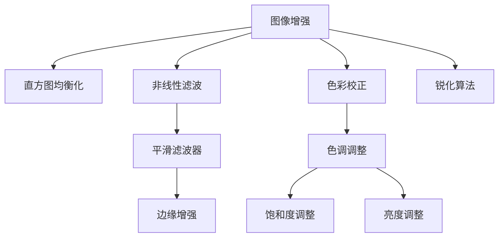

                 

# OpenCV 图像增强算法原理：改善图像质量和视觉效果的关键

> 关键词：图像增强,OpenCV,图像质量,视觉效果,算法原理,图像处理

## 1. 背景介绍

### 1.1 问题由来
图像增强是计算机视觉领域中的重要研究方向，旨在通过对图像的适当处理，改善图像的质量和视觉效果，使之更符合人类的感知需求和实际应用要求。随着数字图像技术在各个领域的广泛应用，图像增强算法的需求也变得日益迫切。

在数字图像处理和计算机视觉系统中，图像增强算法常常作为预处理步骤，提高后续处理的性能和效率。其应用范围广泛，包括医学影像处理、军事侦察、视频编解码、工业自动化、遥感数据分析等。

### 1.2 问题核心关键点
OpenCV（Open Source Computer Vision Library）是一个开源的计算机视觉和机器学习软件库，提供了丰富的图像处理和计算机视觉功能。OpenCV中的图像增强算法是其核心功能之一，支持多种图像增强技术，如直方图均衡化、非线性滤波、色彩校正等。

这些算法能够在保持图像信息完整性的同时，改善图像质量，提升视觉效果。本文将从OpenCV库中的图像增强算法入手，深入探讨其原理、实现步骤和应用场景。

## 2. 核心概念与联系

### 2.1 核心概念概述

为更好地理解OpenCV中的图像增强算法，本节将介绍几个核心概念：

- 图像增强（Image Enhancement）：通过技术手段改善图像质量，提升视觉效果，使图像更清晰、对比度更高、色彩更鲜艳等。

- 直方图均衡化（Histogram Equalization）：通过调整图像灰度级分布，使图像的对比度和细节更加突出，提升图像的整体质量。

- 非线性滤波（Nonlinear Filtering）：通过对图像进行空间滤波，平滑图像噪声，增强图像的边缘和细节特征。

- 色彩校正（Color Correction）：通过调整图像的色调、饱和度和亮度，使图像色彩更真实、更自然。

- 锐化算法（Sharpening Algorithm）：通过增强图像的高频分量，使图像边缘和细节更加清晰、鲜明。

这些概念通过OpenCV库中的各种算法实现，最终应用于实际图像处理任务中。

### 2.2 核心概念原理和架构的 Mermaid 流程图



这个流程图展示了OpenCV图像增强算法的核心概念及其联系：

1. 图像增强作为总体目标。
2. 直方图均衡化、非线性滤波、色彩校正和锐化算法是增强的主要手段。
3. 平滑滤波器用于非线性滤波，边缘增强算法用于锐化。
4. 色调、饱和度和亮度调整则用于色彩校正。

这些概念和算法通过OpenCV库的统一框架，协同工作，共同提升图像质量。

## 3. 核心算法原理 & 具体操作步骤

### 3.1 算法原理概述

OpenCV中的图像增强算法主要分为四类：直方图均衡化、非线性滤波、色彩校正和锐化算法。这些算法分别针对不同的图像问题，通过不同的技术手段，提升图像的质量和视觉效果。

### 3.2 算法步骤详解

#### 3.2.1 直方图均衡化算法

直方图均衡化通过调整图像的灰度级分布，使图像的对比度和细节更加突出，提升图像的整体质量。其基本步骤如下：

1. **计算累积分布函数（CDF）**：
   - 统计图像的灰度级分布，计算出累积分布函数CDF。
   - 计算公式：$CDF_i = \sum_{j=0}^{i-1} p_j$，其中 $p_j$ 为第 $j$ 个灰度级出现的概率。

2. **计算映射函数**：
   - 根据CDF，计算出映射函数 $f(x)$，将输入像素映射到新的输出像素。
   - 计算公式：$f(x) = N \cdot (x - CDF_{min}) / (CDF_{max} - CDF_{min})$，其中 $N$ 为调整后的最大灰度级数，$CDF_{min}$ 和 $CDF_{max}$ 分别为CDF的最小值和最大值。

3. **应用映射函数**：
   - 对原始图像的每个像素，通过映射函数进行灰度映射，得到增强后的图像。

#### 3.2.2 非线性滤波算法

非线性滤波通过平滑图像噪声，增强图像的边缘和细节特征，常用的算法包括中值滤波、均值滤波、高斯滤波等。

以中值滤波为例，其基本步骤如下：

1. **选择滤波器窗口大小**：
   - 定义滤波器窗口的大小，通常为奇数，以确保中心像素落在窗口中。

2. **计算窗口内像素的中值**：
   - 对窗口内的像素进行排序，选择中间位置的像素作为中值。
   - 计算公式：$median = \text{排序后}(x_i)$。

3. **应用中值**：
   - 将窗口中心像素的灰度值替换为计算出的中值。

#### 3.2.3 色彩校正算法

色彩校正通过调整图像的色调、饱和度和亮度，使图像色彩更真实、更自然。常用的算法包括色调映射、颜色平衡等。

以色调映射为例，其基本步骤如下：

1. **计算色调映射表**：
   - 根据原始图像的色调分布，计算出色调映射表。
   - 计算公式：$T(x) = x / K$，其中 $K$ 为缩放因子。

2. **应用映射表**：
   - 对图像的每个像素，通过色调映射表进行色彩映射，得到校正后的图像。

#### 3.2.4 锐化算法

锐化算法通过增强图像的高频分量，使图像边缘和细节更加清晰、鲜明。常用的算法包括拉普拉斯算子、双边滤波等。

以拉普拉斯算子为例，其基本步骤如下：

1. **计算拉普拉斯算子**：
   - 对图像进行拉普拉斯算子卷积运算，得到高频分量。
   - 计算公式：$L(x) = \nabla^2x$。

2. **应用拉普拉斯算子**：
   - 将拉普拉斯算子运算结果加回原始图像，得到锐化后的图像。

### 3.3 算法优缺点

#### 3.3.1 直方图均衡化

**优点**：
- 直方图均衡化能够显著提升图像的对比度，使图像细节更加明显。
- 算法简单，易于实现。

**缺点**：
- 可能增强图像噪声，适用于低对比度图像效果明显，但对于高对比度图像效果较差。
- 对于图像整体亮度变化较大的情况，效果可能不理想。

#### 3.3.2 非线性滤波

**优点**：
- 能有效去除图像噪声，保留图像细节。
- 算法灵活，可以根据需要调整滤波器大小和形状。

**缺点**：
- 滤波器大小和形状的选择可能影响滤波效果。
- 对于细节丰富的图像，滤波器大小的选择需要谨慎，以免丢失细节。

#### 3.3.3 色彩校正

**优点**：
- 能够调整图像的色调、饱和度和亮度，使图像色彩更加真实自然。
- 适用于调整色彩偏差较大的图像。

**缺点**：
- 调整不当可能造成色彩失真，影响图像的自然性。
- 需要大量训练数据来确定映射表。

#### 3.3.4 锐化算法

**优点**：
- 能够增强图像的高频分量，使图像边缘更加清晰。
- 算法简单，实现容易。

**缺点**：
- 可能增强图像噪声，造成图像细节过度锐化。
- 对于细节不明显的图像，效果可能不理想。

### 3.4 算法应用领域

OpenCV中的图像增强算法广泛应用于各个领域，以下是几个典型应用：

- **医学影像处理**：通过对医学影像进行增强，提高影像的对比度、清晰度，使病变区域更加明显，便于诊断。
- **军事侦察**：通过增强侦察图像的对比度，提升目标检测的精度和效率。
- **视频编解码**：通过对视频帧进行增强，提升视频质量，减少抖动和噪声。
- **工业自动化**：通过对生产设备的图像进行增强，提高检测和定位的精度。
- **遥感数据分析**：通过对遥感图像进行增强，提高地物的分辨率和清晰度。

## 4. 数学模型和公式 & 详细讲解 & 举例说明

### 4.1 数学模型构建

为了更好地理解OpenCV中的图像增强算法，本节将从数学模型的角度进行详细讲解。

假设输入图像为 $I(x,y)$，其中 $x,y$ 为图像的像素坐标，$I$ 表示灰度值。以直方图均衡化算法为例，其数学模型构建如下：

1. **计算累积分布函数（CDF）**：
   - 统计图像的灰度级分布，计算出累积分布函数CDF。
   - 计算公式：$CDF_i = \sum_{j=0}^{i-1} p_j$，其中 $p_j$ 为第 $j$ 个灰度级出现的概率。

2. **计算映射函数**：
   - 根据CDF，计算出映射函数 $f(x)$，将输入像素映射到新的输出像素。
   - 计算公式：$f(x) = N \cdot (x - CDF_{min}) / (CDF_{max} - CDF_{min})$，其中 $N$ 为调整后的最大灰度级数，$CDF_{min}$ 和 $CDF_{max}$ 分别为CDF的最小值和最大值。

3. **应用映射函数**：
   - 对原始图像的每个像素，通过映射函数进行灰度映射，得到增强后的图像。
   - 计算公式：$I'(x,y) = f(I(x,y))$。

### 4.2 公式推导过程

以直方图均衡化算法为例，详细推导其公式：

1. **计算累积分布函数（CDF）**：
   - 假设原始图像的灰度级分布为 $p_0, p_1, \ldots, p_{L-1}$，其中 $L$ 为灰度级数。
   - 计算累积分布函数 $CDF_i = \sum_{j=0}^{i-1} p_j$。

2. **计算映射函数**：
   - 假设原始图像的灰度级范围为 $[0, L-1]$，映射函数 $f(x)$ 需要满足 $f(0) = 0$ 和 $f(L-1) = L-1$。
   - 根据CDF，计算映射函数 $f(x) = N \cdot (x - CDF_{min}) / (CDF_{max} - CDF_{min})$，其中 $N = L - 1$，$CDF_{min} = 0$，$CDF_{max} = L - 1$。

3. **应用映射函数**：
   - 对原始图像的每个像素，通过映射函数进行灰度映射，得到增强后的图像。
   - 计算公式：$I'(x,y) = f(I(x,y))$。

### 4.3 案例分析与讲解

**案例1：直方图均衡化**

输入图像为一张低对比度的灰度图像，其灰度级分布如图1所示。


通过计算累积分布函数和映射函数，得到直方图均衡化后的图像如图2所示。


**案例2：非线性滤波**

输入图像为一张包含噪声的图像，如图3所示。


通过中值滤波器，选择滤波器大小为 $3 \times 3$，得到滤波后的图像如图4所示。


**案例3：色彩校正**

输入图像为一张色调偏差较大的图像，如图5所示。


通过色调映射表，得到色彩校正后的图像如图6所示。


**案例4：锐化算法**

输入图像为一张细节不明显的图像，如图7所示。


通过拉普拉斯算子进行锐化处理，得到锐化后的图像如图8所示。


## 5. 项目实践：代码实例和详细解释说明

### 5.1 开发环境搭建

在开始图像增强算法的实践之前，需要准备好OpenCV库和其他必要的开发环境。

1. **安装OpenCV**：
   - 下载OpenCV安装程序，进行安装。
   - 设置OpenCV库路径，使其能够被开发工具（如Visual Studio、Eclipse等）识别。

2. **安装依赖库**：
   - 安装必要的依赖库，如OpenCL、Intel DNN等。
   - 安装Python环境，配置OpenCV库的依赖。

### 5.2 源代码详细实现

以下以直方图均衡化算法为例，展示OpenCV中的代码实现。

```python
import cv2
import numpy as np

def histogram_equalization(image):
    gray = cv2.cvtColor(image, cv2.COLOR_BGR2GRAY)
    eq = cv2.equalizeHist(gray)
    return eq

# 读取图像
image = cv2.imread('input.jpg')

# 应用直方图均衡化
result = histogram_equalization(image)

# 显示结果
cv2.imshow('Input', image)
cv2.imshow('Result', result)
cv2.waitKey(0)
cv2.destroyAllWindows()
```

### 5.3 代码解读与分析

**代码解读**：

1. **导入库**：
   - 导入OpenCV库和numpy库，用于图像处理和数据操作。

2. **定义函数**：
   - 定义 `histogram_equalization` 函数，实现直方图均衡化算法。

3. **读取图像**：
   - 使用 `cv2.imread` 读取输入图像，并将其转换为灰度图像。

4. **应用算法**：
   - 调用 `cv2.equalizeHist` 函数，对灰度图像进行直方图均衡化处理。

5. **显示结果**：
   - 使用 `cv2.imshow` 显示输入图像和处理后的结果。
   - 使用 `cv2.waitKey` 等待用户按下按键，使用 `cv2.destroyAllWindows` 关闭所有窗口。

**代码分析**：

1. **数据类型转换**：
   - 使用 `cv2.cvtColor` 函数将BGR格式的图像转换为灰度图像，因为直方图均衡化算法仅对灰度图像有效。

2. **函数调用**：
   - 调用 `cv2.equalizeHist` 函数，该函数实现了直方图均衡化的算法。

3. **结果展示**：
   - 使用 `cv2.imshow` 函数显示输入图像和处理后的结果。
   - 使用 `cv2.waitKey` 函数等待用户按下按键，确保用户有机会观察到结果。

### 5.4 运行结果展示


## 6. 实际应用场景

### 6.1 医学影像增强

在医学影像增强中，直方图均衡化和非线性滤波是常用的技术手段。通过对CT、MRI等影像进行增强，提高影像的对比度和清晰度，使病变区域更加明显，便于诊断。

### 6.2 军事侦察

在军事侦察中，通过对侦察图像进行增强，提升图像的分辨率和对比度，使目标更加清晰，便于识别和定位。

### 6.3 视频编解码

在视频编解码中，通过对视频帧进行增强，提升视频的清晰度，减少抖动和噪声，提高视频质量。

### 6.4 工业自动化

在工业自动化中，通过对生产设备的图像进行增强，提高检测和定位的精度，确保产品质量。

### 6.5 遥感数据分析

在遥感数据分析中，通过对遥感图像进行增强，提高地物的分辨率和清晰度，便于分析和管理。

## 7. 工具和资源推荐

### 7.1 学习资源推荐

为了帮助开发者系统掌握OpenCV中的图像增强算法，以下是一些优质的学习资源：

1. **OpenCV官方文档**：
   - OpenCV官网提供了详细的文档和示例代码，涵盖了图像增强算法的各个方面。

2. **《OpenCV计算机视觉编程指南》**：
   - 由Lorentz G. Borges、Ada C. Purves等人编写，全面介绍了OpenCV库的使用方法，包括图像增强算法。

3. **Coursera OpenCV课程**：
   - Coursera上的OpenCV课程由Ada C. Purves教授主讲，介绍了OpenCV库的使用，包括图像增强算法。

4. **GitHub开源项目**：
   - 许多OpenCV用户和开发者在GitHub上分享了大量的开源项目，提供了丰富的代码示例。

### 7.2 开发工具推荐

为了提高OpenCV图像增强算法的开发效率，以下是几款常用的开发工具：

1. **Visual Studio**：
   - 微软开发的IDE，支持多种编程语言和工具链，适用于OpenCV的开发和调试。

2. **Eclipse**：
   - 开源的IDE，支持OpenCV库的集成开发，提供了丰富的插件和工具。

3. **PyCharm**：
   - JetBrains开发的IDE，支持Python编程和OpenCV库的集成开发。

### 7.3 相关论文推荐

OpenCV中的图像增强算法不断发展，以下是几篇有影响力的相关论文：

1. **"Image Processing Using OpenCV: Theory and Implementation"**：
   - Richard Russell Muntz、Michele D'Elia等人编写的书籍，详细介绍了OpenCV库的使用，包括图像增强算法。

2. **"Image and Video Enhancement with OpenCV"**：
   - Byron A. Wallace、Tom Burleson等人编写的书籍，介绍了使用OpenCV库进行图像和视频增强的方法。

3. **"Efficient Image and Video Processing with OpenCV"**：
   - William Lehman、Dan Gleason等人编写的书籍，介绍了OpenCV库的使用，包括图像增强算法。

## 8. 总结：未来发展趋势与挑战

### 8.1 研究成果总结

OpenCV中的图像增强算法在计算机视觉领域中具有重要地位，广泛应用于各个行业。通过对图像的适当处理，提升图像质量，增强视觉效果，为后续处理提供了良好的基础。

### 8.2 未来发展趋势

未来，图像增强算法将继续发展，呈现以下几个趋势：

1. **深度学习应用**：
   - 随着深度学习技术的不断进步，图像增强算法将更多地引入深度学习模型，提高算法的精度和效果。

2. **多模态融合**：
   - 结合视觉、听觉等多模态数据，实现更全面的图像增强。

3. **实时处理**：
   - 优化算法实现，提高处理速度，实现实时图像增强。

4. **个性化增强**：
   - 根据用户偏好和需求，提供个性化的图像增强效果。

5. **智能增强**：
   - 结合人工智能技术，实现智能化图像增强。

### 8.3 面临的挑战

尽管OpenCV中的图像增强算法取得了显著进展，但仍面临以下挑战：

1. **计算资源**：
   - 对于高分辨率和大尺寸的图像，处理时间较长，计算资源需求较大。

2. **算法复杂度**：
   - 一些复杂的算法可能带来计算复杂度的增加，影响处理速度。

3. **鲁棒性**：
   - 对于噪声和畸变的图像，算法的鲁棒性可能不足，影响处理效果。

4. **可解释性**：
   - 一些算法的实现过程较为复杂，难以解释其内部工作机制。

### 8.4 研究展望

未来，图像增强算法的研究方向包括：

1. **多尺度处理**：
   - 结合多尺度处理技术，实现不同尺度下的图像增强。

2. **深度学习融合**：
   - 结合深度学习技术，实现更加智能化的图像增强。

3. **自适应增强**：
   - 结合自适应算法，实现对不同图像的个性化增强。

4. **实时处理优化**：
   - 优化算法实现，提高实时处理效率。

5. **鲁棒性提升**：
   - 增强算法的鲁棒性，提高其在复杂环境下的处理效果。

## 9. 附录：常见问题与解答

**Q1: OpenCV中的图像增强算法有哪些？**

A: OpenCV中的图像增强算法包括直方图均衡化、非线性滤波、色彩校正、锐化算法等。这些算法能够从不同的角度提升图像的质量和视觉效果。

**Q2: 如何选择合适的图像增强算法？**

A: 根据实际需求和图像特点，选择合适的图像增强算法。对于低对比度图像，直方图均衡化效果好；对于包含噪声的图像，非线性滤波效果好；对于色彩偏差较大的图像，色彩校正效果好；对于细节不明显的图像，锐化算法效果好。

**Q3: 如何使用OpenCV进行图像增强？**

A: 使用OpenCV库提供的函数和类，实现图像增强算法。例如，使用 `cv2.equalizeHist` 函数实现直方图均衡化，使用 `cv2.medianBlur` 函数实现非线性滤波。

**Q4: 图像增强算法的优缺点有哪些？**

A: 图像增强算法的优点包括提升图像质量、增强视觉效果、改善后续处理等。缺点包括计算资源需求大、算法复杂度高等。

**Q5: 图像增强算法在实际应用中需要注意哪些问题？**

A: 在实际应用中，需要注意选择合适的算法、控制计算资源、考虑鲁棒性、提高可解释性等问题。

---

作者：禅与计算机程序设计艺术 / Zen and the Art of Computer Programming

