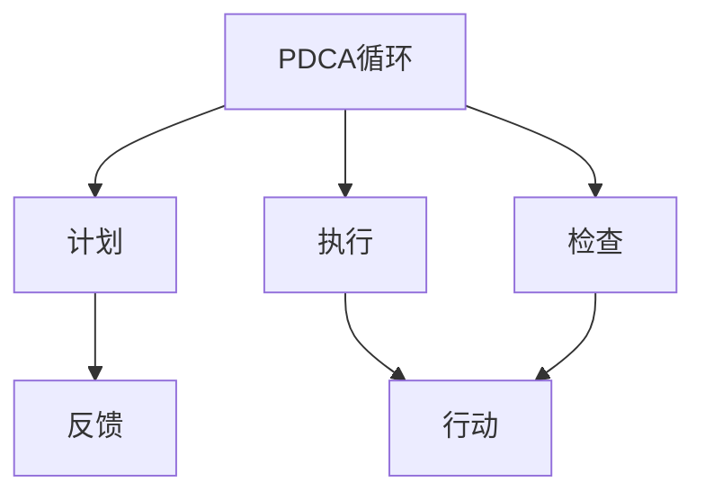

                 

## 1. 背景介绍

### 1.1 问题由来
PDCA循环（Plan-Do-Check-Act，计划-执行-检查-行动）是一种经典的管理方法论，广泛应用于制造业、服务业、软件开发等各个领域。其核心理念是通过持续的反馈和迭代，不断改进工作流程和产品质量。现代企业的竞争已从价格竞争转向质量和效率的竞争，PDCA循环在提升企业内部管理水平和市场竞争力方面发挥了重要作用。

### 1.2 问题核心关键点
PDCA循环的核心理念是“不断改进、持续优化”。其核心步骤包括：
- **计划 (Plan)**：定义目标和计划，明确工作方向。
- **执行 (Do)**：根据计划实施操作，推进任务。
- **检查 (Check)**：评估执行效果，发现问题。
- **行动 (Act)**：根据检查结果，采取行动进行改进。

PDCA循环的有效实施，需要多部门的协同合作和高效的沟通机制。同时，也需要不断地学习和改进，提升团队的综合素质和执行力。

### 1.3 问题研究意义
研究PDCA循环在各行业的应用，对于提升企业内部管理效率，提高市场竞争力，促进企业持续发展，具有重要意义。通过系统梳理PDCA循环的理论和实践方法，帮助企业更好地应用这一经典管理工具，将能显著提升其整体运营水平。

## 2. 核心概念与联系

### 2.1 核心概念概述

为更好地理解PDCA循环的理论基础和实践方法，本节将介绍几个密切相关的核心概念：

- **PDCA循环**：一种经典的管理工具，通过持续的改进和优化，提升工作质量和效率。其核心步骤包括计划、执行、检查和行动。
- **计划 (Plan)**：设定目标和方案，明确工作方向。
- **执行 (Do)**：根据计划实施操作，推进任务。
- **检查 (Check)**：评估执行效果，发现问题。
- **行动 (Act)**：根据检查结果，采取行动进行改进。
- **反馈 (Feedback)**：通过PDCA循环的不断迭代，形成持续改进的良性循环。

这些核心概念之间的逻辑关系可以通过以下Mermaid流程图来展示：



这个流程图展示了PDCA循环的基本流程，其中反馈作为PDCA循环的闭环，确保不断改进和优化。

## 3. 核心算法原理 & 具体操作步骤
### 3.1 算法原理概述

PDCA循环的核心原理是通过持续的反馈和迭代，不断改进和优化工作流程和产品质量。其核心思想可以概括为：

1. **计划 (Plan)**：设定明确的目标和计划，制定详细的执行方案。
2. **执行 (Do)**：根据计划实施操作，推进任务。
3. **检查 (Check)**：评估执行效果，发现问题。
4. **行动 (Act)**：根据检查结果，采取行动进行改进。

PDCA循环的每个步骤都是相互关联的，通过不断的迭代和改进，形成一个持续优化的良性循环。

### 3.2 算法步骤详解

PDCA循环的详细步骤可以分为以下几个方面：

#### 步骤一：计划 (Plan)
- **目标设定**：明确项目目标和预期成果。
- **资源准备**：确保完成任务所需的资源和工具。
- **任务分解**：将大目标分解为具体可执行的任务。
- **时间安排**：制定详细的任务执行时间表。

#### 步骤二：执行 (Do)
- **任务执行**：按照计划执行任务，推进项目。
- **过程控制**：监控任务执行过程中的关键节点，确保按计划推进。
- **团队协作**：协调各部门的协同工作，确保任务顺利实施。

#### 步骤三：检查 (Check)
- **结果评估**：根据既定标准评估执行效果，发现问题。
- **数据收集**：收集相关的数据和信息，为下一步改进提供依据。
- **问题识别**：识别任务执行中的问题和瓶颈。

#### 步骤四：行动 (Act)
- **改进方案**：根据检查结果，制定改进方案。
- **优化措施**：针对发现的问题，采取具体的改进措施。
- **持续改进**：形成持续改进的良性循环，确保不断提升工作效率和质量。

### 3.3 算法优缺点

PDCA循环在管理中具有以下优点：
1. **系统性**：PDCA循环通过系统的计划、执行、检查和行动，形成闭环管理。
2. **灵活性**：可以根据实际情况灵活调整计划和执行方案，适应复杂多变的环境。
3. **科学性**：通过系统的检查和评估，发现问题并制定改进措施，提升管理科学性。
4. **可操作性**：每个步骤明确具体，易于执行和操作。

同时，PDCA循环也存在一定的局限性：
1. **耗时长**：由于需要持续的检查和改进，PDCA循环可能需要较长的时间周期。
2. **依赖人工**：依赖人工的判断和决策，容易受到主观因素影响。
3. **复杂度**：对于复杂的系统，需要更多的资源和专业技能进行支持。

尽管如此，PDCA循环仍然是提升企业管理水平的重要工具，其经典的管理理念和操作流程被广泛应用于各行各业。

### 3.4 算法应用领域

PDCA循环在各个领域都有广泛的应用，以下是几个典型的应用场景：

#### 制造业
制造业是PDCA循环应用的典型领域。通过PDCA循环，制造业企业可以不断改进生产流程和产品质量，提高生产效率，降低成本。具体应用包括：
- 生产计划和调度：根据市场需求和生产能力，制定合理的生产计划和调度方案。
- 工艺优化和改进：通过PDCA循环不断优化生产工艺，提升产品质量。
- 设备维护和升级：定期检查设备状态，发现问题及时维修或升级。

#### 服务业
服务业通过PDCA循环，可以不断提升服务质量，提高客户满意度。具体应用包括：
- 服务流程优化：通过PDCA循环不断优化服务流程，提升服务效率。
- 客户反馈处理：根据客户反馈，及时改进服务质量，提升客户满意度。
- 员工培训和提升：通过PDCA循环不断提升员工技能，提高服务质量。

#### 软件开发
软件开发是PDCA循环应用的典型场景。通过PDCA循环，软件开发团队可以不断改进软件质量和开发效率。具体应用包括：
- 需求分析和设计：通过PDCA循环不断优化需求分析和软件设计，确保产品符合用户需求。
- 开发过程控制：通过PDCA循环不断优化开发过程，提高开发效率。
- 质量保证和测试：通过PDCA循环不断改进测试流程，确保软件质量。

## 4. 数学模型和公式 & 详细讲解 & 举例说明

### 4.1 数学模型构建

PDCA循环的数学模型主要涉及以下几个概念：
- **目标**：用 $T$ 表示项目目标，$T_i$ 表示第 $i$ 个子目标。
- **计划**：用 $P$ 表示计划，$P_i$ 表示第 $i$ 个子计划的详细执行方案。
- **执行**：用 $D$ 表示执行，$D_i$ 表示第 $i$ 个子任务的执行情况。
- **检查**：用 $C$ 表示检查，$C_i$ 表示第 $i$ 个子任务的检查结果。
- **行动**：用 $A$ 表示行动，$A_i$ 表示第 $i$ 个子任务的改进措施。

PDCA循环的数学模型可以表示为：

$$
PDCA(T, P, D, C, A)
$$

其中 $T$ 为目标，$P$ 为计划，$D$ 为执行，$C$ 为检查，$A$ 为行动。

### 4.2 公式推导过程

PDCA循环的每个步骤都可以用公式表示。以计划步骤为例，其基本公式如下：

$$
P_i = f(T_i, P_{i-1}, A_{i-1})
$$

其中 $f$ 为计划制定函数，根据子目标 $T_i$ 和前一步的计划和行动结果 $P_{i-1}$、$A_{i-1}$ 制定具体的执行方案 $P_i$。

执行步骤的公式为：

$$
D_i = g(P_i, D_{i-1}, C_{i-1})
$$

其中 $g$ 为执行函数，根据计划 $P_i$ 和前一步的执行和检查结果 $D_{i-1}$、$C_{i-1}$ 执行具体的任务 $D_i$。

检查步骤的公式为：

$$
C_i = h(D_i, T_i, P_i)
$$

其中 $h$ 为检查函数，根据执行结果 $D_i$、子目标 $T_i$ 和计划 $P_i$ 进行评估和检查，发现问题 $C_i$。

行动步骤的公式为：

$$
A_i = i(C_i, T_i, P_i)
$$

其中 $i$ 为行动函数，根据检查结果 $C_i$、子目标 $T_i$ 和计划 $P_i$ 制定具体的改进措施 $A_i$。

### 4.3 案例分析与讲解

以软件开发项目为例，具体说明PDCA循环的实施过程：

#### 计划步骤
1. **目标设定**：设定项目目标为开发一款新型的移动应用，预估开发时间为3个月。
2. **资源准备**：确认所需开发人员、设计人员和技术支持人员。
3. **任务分解**：将开发任务分解为需求分析、界面设计、代码实现和测试等具体任务。
4. **时间安排**：制定详细的时间表，每个任务安排具体的开始和结束时间。

#### 执行步骤
1. **任务执行**：按照计划执行需求分析和界面设计任务。
2. **过程控制**：监控任务执行情况，确保按计划推进。
3. **团队协作**：协调开发人员、设计人员和技术支持人员，确保任务顺利实施。

#### 检查步骤
1. **结果评估**：根据既定标准评估需求分析和界面设计的执行效果，发现问题。
2. **数据收集**：收集需求分析和界面设计的反馈和数据，为下一步改进提供依据。
3. **问题识别**：识别需求分析和界面设计中的问题和瓶颈。

#### 行动步骤
1. **改进方案**：根据检查结果，制定改进方案，如优化需求分析和界面设计流程。
2. **优化措施**：针对发现的问题，采取具体的改进措施，如增加需求文档评审环节。
3. **持续改进**：形成持续改进的良性循环，确保不断提升软件开发质量和效率。

## 5. 项目实践：代码实例和详细解释说明

### 5.1 开发环境搭建

在进行PDCA循环的实践前，我们需要准备好开发环境。以下是使用Python进行PyTorch开发的环境配置流程：

1. 安装Anaconda：从官网下载并安装Anaconda，用于创建独立的Python环境。

2. 创建并激活虚拟环境：
```bash
conda create -n pytorch-env python=3.8 
conda activate pytorch-env
```

3. 安装PyTorch：根据CUDA版本，从官网获取对应的安装命令。例如：
```bash
conda install pytorch torchvision torchaudio cudatoolkit=11.1 -c pytorch -c conda-forge
```

4. 安装各类工具包：
```bash
pip install numpy pandas scikit-learn matplotlib tqdm jupyter notebook ipython
```

完成上述步骤后，即可在`pytorch-env`环境中开始PDCA循环的实践。

### 5.2 源代码详细实现

下面以PDCA循环在软件开发项目中的应用为例，给出使用Python实现PDCA循环的代码实现。

首先，定义PDCA循环的四个步骤：

```python
class PDCA:
    def __init__(self, target, plan, do, check, act):
        self.target = target
        self.plan = plan
        self.do = do
        self.check = check
        self.act = act
    
    def plan_step(self, target, plan, act):
        # 根据目标和行动，制定计划
        # 假设目标为开发一款新型的移动应用，行动为优化需求分析
        return plan
    
    def do_step(self, plan, do, check):
        # 根据计划和检查，执行任务
        # 假设计划为需求分析和界面设计，检查为需求分析的反馈
        return do
    
    def check_step(self, do, target, plan):
        # 根据执行和计划，进行检查
        # 假设执行为需求分析和界面设计，目标为开发一款新型的移动应用
        return check
    
    def act_step(self, check, target, plan):
        # 根据检查和计划，采取行动
        # 假设检查为需求分析和界面设计的反馈，目标为开发一款新型的移动应用
        return act
```

然后，定义PDCA循环的具体应用场景：

```python
# 目标
target = '开发一款新型的移动应用'

# 计划
plan = '需求分析和界面设计'

# 执行
do = '需求分析和界面设计'

# 检查
check = '需求分析的反馈'

# 行动
act = '优化需求分析'

# PDCA循环
pdca = PDCA(target, plan, do, check, act)

# 执行PDCA循环的四个步骤
plan_result = pdca.plan_step(target, plan, act)
do_result = pdca.do_step(plan, do, check)
check_result = pdca.check_step(do, target, plan)
act_result = pdca.act_step(check, target, plan)

# 打印结果
print(f'计划结果：{plan_result}')
print(f'执行结果：{do_result}')
print(f'检查结果：{check_result}')
print(f'行动结果：{act_result}')
```

### 5.3 代码解读与分析

让我们再详细解读一下关键代码的实现细节：

**PDCA类**：
- 定义了PDCA循环的四个步骤：计划、执行、检查和行动。
- 每个步骤都封装为方法，方便调用。

**目标、计划、执行、检查和行动变量**：
- 定义了PDCA循环的四个关键变量，用于存储和传递各步骤的输入和输出。

**plan_step、do_step、check_step和act_step方法**：
- 分别实现了PDCA循环的计划、执行、检查和行动步骤，根据输入的变量进行计算。

**运行结果展示**：
- 通过调用PDCA类的方法，完成PDCA循环的四个步骤，并输出结果。

PDCA循环的代码实现虽然简单，但充分展示了PDCA循环的四个基本步骤。在实际应用中，可以进一步优化和扩展这些步骤，适应更复杂的管理场景。

## 6. 实际应用场景

### 6.1 智能制造
智能制造是PDCA循环的重要应用场景。通过PDCA循环，制造业企业可以不断改进生产流程和产品质量，提高生产效率，降低成本。具体应用包括：
- **生产计划和调度**：根据市场需求和生产能力，制定合理的生产计划和调度方案。
- **工艺优化和改进**：通过PDCA循环不断优化生产工艺，提升产品质量。
- **设备维护和升级**：定期检查设备状态，发现问题及时维修或升级。

### 6.2 服务运营
服务运营通过PDCA循环，可以不断提升服务质量，提高客户满意度。具体应用包括：
- **服务流程优化**：通过PDCA循环不断优化服务流程，提升服务效率。
- **客户反馈处理**：根据客户反馈，及时改进服务质量，提升客户满意度。
- **员工培训和提升**：通过PDCA循环不断提升员工技能，提高服务质量。

### 6.3 项目管理
项目管理通过PDCA循环，可以不断优化项目管理流程，提高项目执行效率。具体应用包括：
- **项目计划和分解**：根据项目目标和资源，制定详细的时间表和任务分解方案。
- **过程控制和监控**：通过PDCA循环不断监控项目执行情况，确保按计划推进。
- **风险管理**：通过PDCA循环不断识别和处理项目风险，提升项目成功率。

### 6.4 未来应用展望

随着PDCA循环在各行业的广泛应用，未来将在更多领域发挥重要作用。例如：
- **智慧城市**：通过PDCA循环不断优化城市管理流程，提升城市运营效率。
- **医疗健康**：通过PDCA循环不断优化医疗流程，提高医疗服务质量。
- **金融科技**：通过PDCA循环不断优化金融产品和服务，提升客户体验。

PDCA循环的未来应用前景广阔，其经典的管理理念和操作流程将继续推动各行各业的持续改进和优化。

## 7. 工具和资源推荐
### 7.1 学习资源推荐

为了帮助开发者系统掌握PDCA循环的理论基础和实践技巧，这里推荐一些优质的学习资源：

1. **《PDCA循环详解》系列博文**：由PDCA循环专家撰写，深入浅出地介绍了PDCA循环的原理、操作步骤和应用场景。
2. **《PDCA循环实战指南》书籍**：详细介绍了PDCA循环在各行业的应用案例和操作细节，是PDCA循环实践的必备资料。
3. **Coursera《PDCA循环原理与实践》课程**：由知名管理学专家开设的课程，涵盖PDCA循环的理论和实践方法，适合初学者和进阶者。
4. **华为企业大学《PDCA循环应用案例》**：收集了华为在PDCA循环应用中的成功案例，提供了丰富的实践经验。
5. **LeanSigma《PDCA循环管理培训》**：提供系统的PDCA循环管理培训课程，帮助企业提升管理水平。

通过对这些资源的学习实践，相信你一定能够快速掌握PDCA循环的精髓，并用于解决实际的管理问题。

### 7.2 开发工具推荐

高效的开发离不开优秀的工具支持。以下是几款用于PDCA循环开发的常用工具：

1. **Microsoft Project**：一款经典的项目管理工具，可以帮助企业制定详细的项目管理计划，并进行过程监控。
2. **Asana**：一款基于Web的项目管理工具，支持团队协作和任务跟踪，适用于中小型企业。
3. **Trello**：一款轻量级项目管理工具，支持看板式任务管理和团队协作，适合小型团队。
4. **JIRA**：一款企业级的项目管理工具，支持敏捷开发和故障管理，适用于大型企业。
5. **Smartsheet**：一款在线协作平台，支持项目管理、数据分析和团队协作，适合多部门协作。

合理利用这些工具，可以显著提升PDCA循环的执行效率，加快企业管理的创新迭代。

### 7.3 相关论文推荐

PDCA循环作为经典的管理理论，其研究论文众多。以下是几篇经典论文，推荐阅读：

1. **《PDCA循环在企业管理中的应用研究》**：探讨PDCA循环在企业管理中的应用案例和方法。
2. **《PDCA循环的优化研究》**：提出PDCA循环的优化模型和算法，提升PDCA循环的执行效率。
3. **《PDCA循环与敏捷开发》**：探讨PDCA循环与敏捷开发方法相结合的管理模式。
4. **《PDCA循环在智慧城市中的应用》**：探讨PDCA循环在智慧城市管理中的应用方法。
5. **《PDCA循环在金融风险管理中的应用》**：探讨PDCA循环在金融风险管理中的应用案例和优化方法。

这些论文代表了大规模项目管理的发展脉络，通过学习这些前沿成果，可以帮助研究者把握学科前进方向，激发更多的创新灵感。

## 8. 总结：未来发展趋势与挑战

### 8.1 总结

本文对PDCA循环的理论和实践方法进行了全面系统的介绍。首先阐述了PDCA循环的背景和核心步骤，明确了PDCA循环在提升企业管理水平和市场竞争力方面的独特价值。其次，从原理到实践，详细讲解了PDCA循环的数学模型和操作步骤，给出了PDCA循环任务开发的完整代码实例。同时，本文还广泛探讨了PDCA循环在智能制造、服务运营、项目管理等多个行业领域的应用前景，展示了PDCA循环的巨大潜力。此外，本文精选了PDCA循环的学习资源，力求为读者提供全方位的技术指引。

通过本文的系统梳理，可以看到，PDCA循环作为一种经典的管理工具，在提升企业管理水平和市场竞争力方面发挥了重要作用。其核心步骤和基本原理简单易懂，适用于各行各业的持续改进和优化。未来，伴随PDCA循环在各行业的广泛应用，其经典的管理理念和操作流程将继续推动企业管理的持续进步。

### 8.2 未来发展趋势

展望未来，PDCA循环将呈现以下几个发展趋势：

1. **自动化和智能化**：随着人工智能技术的发展，PDCA循环将逐步实现自动化和智能化。通过智能数据分析和模型优化，PDCA循环的执行效率将得到显著提升。
2. **跨部门协同**：PDCA循环将更多地与跨部门协作工具结合，提升企业内部协同效率。例如，项目管理工具将与通信协作工具结合，形成无缝对接的协同平台。
3. **大数据支持**：通过大数据技术，PDCA循环将能够实时获取和分析关键数据，提升决策的科学性和准确性。例如，通过数据分析预测需求变化，优化生产计划和调度。
4. **知识管理**：PDCA循环将与知识管理系统结合，形成知识驱动的改进和优化机制。例如，通过知识图谱和专家系统，引导PDCA循环不断吸收新知识和新经验。
5. **持续改进**：PDCA循环将持续优化，不断提升企业管理水平和市场竞争力。例如，通过PDCA循环的持续优化，企业将能够快速适应市场变化，保持竞争优势。

以上趋势凸显了PDCA循环在未来的发展潜力，其经典的管理理念和操作流程将继续推动企业管理的持续改进和优化。

### 8.3 面临的挑战

尽管PDCA循环在提升企业管理水平和市场竞争力方面发挥了重要作用，但在迈向更加智能化、数字化应用的过程中，仍面临诸多挑战：

1. **执行效率低**：PDCA循环需要大量的人力和时间投入，执行效率较低。如何通过技术手段提升PDCA循环的执行效率，将是未来研究的重要方向。
2. **数据质量差**：数据是PDCA循环的重要输入，但数据质量和准确性往往难以保证。如何提升数据质量，确保PDCA循环的科学性和可靠性，仍是一个难题。
3. **跨部门协同难**：跨部门协同是PDCA循环的核心环节，但不同部门之间的数据和流程不一致，协同难度较大。如何提升跨部门协同效率，形成统一的执行标准，仍是一个挑战。
4. **缺乏灵活性**：PDCA循环的执行过程相对固定，缺乏灵活性和创新性。如何通过智能化的手段，增强PDCA循环的灵活性和创新性，将是未来研究的重点。
5. **技术门槛高**：PDCA循环的执行需要较高的技术水平，但许多企业缺乏技术支持和人才储备。如何降低技术门槛，提升企业执行PDCA循环的能力，将是未来研究的方向。

### 8.4 研究展望

面对PDCA循环面临的这些挑战，未来的研究需要在以下几个方面寻求新的突破：

1. **引入人工智能技术**：通过人工智能技术，提升PDCA循环的执行效率和智能化水平。例如，引入智能数据分析和模型优化，提升PDCA循环的科学性和准确性。
2. **优化跨部门协同机制**：通过跨部门协作工具和平台，提升企业内部协同效率。例如，通过项目管理工具与通信协作工具的无缝对接，形成统一的执行标准。
3. **提升数据质量**：通过数据治理和清洗技术，提升数据质量和准确性。例如，通过自动化数据清洗和异常检测，确保PDCA循环的科学性和可靠性。
4. **增强灵活性**：通过智能化的手段，增强PDCA循环的灵活性和创新性。例如，通过智能数据分析和模型优化，增强PDCA循环的动态调整能力。
5. **降低技术门槛**：通过简单易用的工具和平台，降低技术门槛，提升企业执行PDCA循环的能力。例如，通过智能化的PDCA循环工具，帮助企业快速上手和执行PDCA循环。

这些研究方向的探索，必将引领PDCA循环迈向更高的台阶，为企业管理提供更加科学、高效、灵活的管理工具。面向未来，PDCA循环的研究将继续推动企业管理管理的持续进步和创新，助力企业实现数字化、智能化转型。

## 9. 附录：常见问题与解答

**Q1：PDCA循环的四个步骤是否可以灵活调整？**

A: PDCA循环的四个步骤是PDCA循环的核心，任何一步的缺失或调整都会影响PDCA循环的效果。然而，在实际应用中，可以根据具体情况灵活调整。例如，在项目管理中，可以只执行计划、执行和行动步骤，省略检查步骤；在知识管理中，可以只执行计划和行动步骤，省略执行和检查步骤。

**Q2：PDCA循环是否可以与其他管理方法结合使用？**

A: PDCA循环是一种经典的管理工具，可以与其他管理方法结合使用。例如，PDCA循环可以与六西格玛、精益生产等方法结合，形成更为全面、系统的管理体系。通过多种方法的结合，可以提升企业管理的整体水平和效果。

**Q3：PDCA循环是否可以与其他项目管理工具结合使用？**

A: PDCA循环可以与其他项目管理工具结合使用。例如，PDCA循环可以与敏捷开发、Scrum等项目管理方法结合，形成更为科学、高效的管理体系。通过多种方法的结合，可以提升项目管理的效果和质量。

**Q4：PDCA循环是否适用于所有企业？**

A: PDCA循环是一种经典的管理工具，适用于各类企业。但不同行业和企业的应用场景不同，需要根据具体情况进行调整和优化。例如，在制造业中，可以重点关注生产计划和调度、工艺优化和改进等步骤；在服务业中，可以重点关注服务流程优化、客户反馈处理等步骤。

**Q5：PDCA循环是否可以与其他管理方法结合使用？**

A: PDCA循环是一种经典的管理工具，可以与其他管理方法结合使用。例如，PDCA循环可以与六西格玛、精益生产等方法结合，形成更为全面、系统的管理体系。通过多种方法的结合，可以提升企业管理的整体水平和效果。

这些研究方向的探索，必将引领PDCA循环迈向更高的台阶，为企业管理提供更加科学、高效、灵活的管理工具。面向未来，PDCA循环的研究将继续推动企业管理管理的持续进步和创新，助力企业实现数字化、智能化转型。

---

作者：禅与计算机程序设计艺术 / Zen and the Art of Computer Programming

