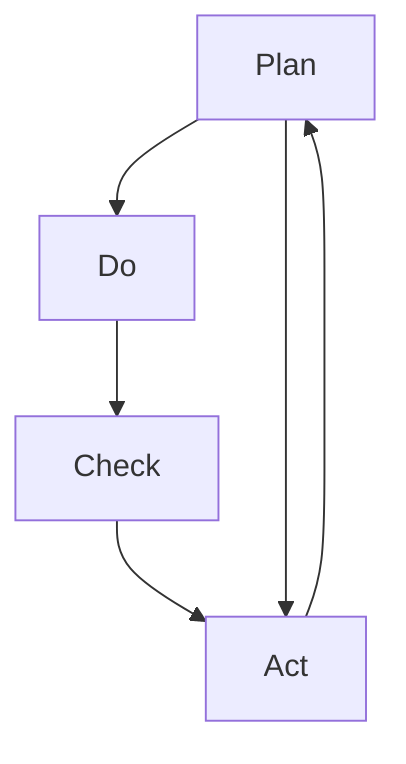

                 

# PDCA循环在流程优化中的作用

> 关键词：PDCA循环, 流程优化, 持续改进, 质量管理, 项目管理和流程改进

## 1. 背景介绍

PDCA循环（Plan-Do-Check-Act）是一种系统性的管理方法，用于通过不断反馈和改进来提升业务流程效率和质量。它最初由沃尔特·厄威克·舒曼（W. Edwards Deming）于1950年代初提出，旨在通过一个周而复始的闭环过程，持续改进业务流程，提升组织效能。如今，PDCA循环已成为项目管理、质量管理、流程改进等众多领域的核心管理工具。

PDCA循环的四个阶段，即计划（Plan）、执行（Do）、检查（Check）和行动（Act），依次执行，形成一个持续改进的闭环。每个阶段都包含明确的输入输出和关键目标，确保了业务流程的优化和改进方向。

在IT领域，PDCA循环的应用尤为广泛，涵盖软件开发、项目管理、运维管理、质量保证等多个方面。合理应用PDCA循环，可以显著提高团队的效率，降低错误率，提升客户满意度，增强企业的竞争优势。

本文将深入探讨PDCA循环在流程优化中的应用，分析其在IT领域的具体实现方式，并结合案例详细讲解如何有效应用PDCA循环以实现业务流程的持续改进。

## 2. 核心概念与联系

### 2.1 核心概念概述

PDCA循环的四个阶段具有递进关系，每个阶段都依赖于前一个阶段的结果，共同构成一个持续改进的闭环。以下将详细介绍各阶段的核心概念和操作要点：

- **计划（Plan）**：定义目标、制定计划、明确流程。这一阶段需要细化目标，制定详细的执行计划，识别关键步骤和潜在风险。

- **执行（Do）**：按照计划执行操作，验证流程的可行性和有效性。执行阶段需要资源准备、过程监控、问题排查等操作，确保按照计划进行。

- **检查（Check）**：评估执行结果，确定流程是否达到预期目标。通过对比目标与实际结果，发现差距，识别问题点和改进机会。

- **行动（Act）**：根据检查结果采取具体措施，调整流程。行动阶段需要制定改进措施，实施改进方案，并更新流程计划。

PDCA循环通过不断循环，将问题识别、分析、改进和验证有机结合，确保业务流程的持续优化和提升。

### 2.2 核心概念原理和架构的 Mermaid 流程图

以下是PDCA循环的Mermaid流程图，展示了各阶段之间的递进关系和反馈机制：



该流程图中，箭头表示阶段间的流转，圆形节点表示操作或输出结果。

## 3. 核心算法原理 & 具体操作步骤

### 3.1 算法原理概述

PDCA循环的原理基于“持续改进”和“反馈循环”的理念，通过周而复始的循环过程，不断提升业务流程的效率和质量。其核心思想在于：

1. **计划阶段（Plan）**：通过科学合理地规划目标和步骤，明确流程的方向和路径。
2. **执行阶段（Do）**：严格按照计划执行操作，验证流程的可行性和有效性。
3. **检查阶段（Check）**：通过数据分析和对比，评估流程结果，识别改进机会。
4. **行动阶段（Act）**：根据检查结果采取具体措施，更新流程计划，实现持续改进。

### 3.2 算法步骤详解

以下是PDCA循环在IT项目中的详细步骤：

**步骤1: 计划（Plan）**

- **目标定义**：明确业务目标，例如提升系统性能、优化项目交付周期等。
- **流程规划**：识别关键任务和流程步骤，如需求分析、设计、开发、测试、上线等。
- **资源准备**：配置必要的硬件、软件资源，包括服务器、工具、文档等。
- **风险评估**：识别潜在风险和挑战，制定应对措施，如技术难点、团队协作问题等。

**步骤2: 执行（Do）**

- **任务分解**：将大任务分解为可执行的小任务，明确每个任务的输入输出和负责人。
- **资源调配**：确保资源按计划配置，包括人力资源、物理资源和技术资源。
- **过程监控**：建立监控机制，实时跟踪项目进展和任务状态，及时发现和解决问题。
- **反馈机制**：建立快速反馈通道，确保团队成员能够及时沟通和调整。

**步骤3: 检查（Check）**

- **进度评估**：对比实际进度与计划进度，评估任务完成情况。
- **质量检查**：采用自动化测试、代码审查、功能测试等手段，确保产品质量和功能正确性。
- **风险检查**：检查之前识别的风险是否发生，评估应对措施的有效性。
- **绩效评估**：评估项目进展和质量，识别成功经验和不足之处。

**步骤4: 行动（Act）**

- **改进措施**：根据检查结果，制定具体的改进措施，如调整流程、优化工具、增强培训等。
- **更新计划**：根据改进措施，更新流程计划和任务分配，确保流程持续优化。
- **知识积累**：总结成功经验和教训，形成标准操作流程和最佳实践，供后续项目参考。
- **持续改进**：将改进措施纳入新的PDCA循环中，形成持续改进的闭环。

### 3.3 算法优缺点

**优点**：
1. **系统化管理**：PDCA循环通过系统化的流程管理，确保每个阶段都有明确的输入输出和责任人，提高了项目管理的专业性和规范性。
2. **持续改进**：通过不断的反馈和改进，PDCA循环不断提升流程效率和质量，确保项目目标的实现。
3. **风险控制**：通过识别和评估风险，制定应对措施，PDCA循环增强了项目管理的灵活性和应对能力。

**缺点**：
1. **复杂度高**：PDCA循环需要细致的计划和执行，管理复杂度较高，需要团队具备较高的专业能力。
2. **灵活性不足**：流程一旦确定，改变难度较大，可能需要重新规划和执行。
3. **资源消耗**：在计划和执行阶段需要投入较多资源，可能影响短期业务产出。

### 3.4 算法应用领域

PDCA循环广泛应用于IT项目的各个阶段，从需求分析到项目交付，从系统运维到质量保障，都能看到PDCA循环的身影。以下是几个具体的应用场景：

- **软件开发**：在软件开发生命周期的各个阶段，如需求分析、设计、编码、测试、交付等，通过PDCA循环不断优化流程，提升开发效率和代码质量。
- **项目管理**：通过PDCA循环的计划、执行、检查、行动四个阶段，科学管理项目进度、质量、风险等关键要素，确保项目按时交付、按质完成。
- **系统运维**：在系统运维过程中，通过PDCA循环不断改进运维流程，优化监控和故障处理机制，提升系统稳定性和运维效率。
- **质量保证**：在质量保证过程中，通过PDCA循环不断优化测试流程、代码审查流程等，确保产品质量符合预期。

## 4. 数学模型和公式 & 详细讲解 & 举例说明

### 4.1 数学模型构建

PDCA循环的数学模型可以通过控制图、直方图、散点图等统计工具来描述和分析。以下是各阶段的主要数学模型：

- **计划阶段**：目标设定、任务分解、资源配置等，通过明确的目标和计划，确保流程的可控性和方向性。
- **执行阶段**：过程监控、数据收集等，通过实时监控和数据收集，确保流程的执行效率和准确性。
- **检查阶段**：质量评估、风险检查等，通过数据分析和对比，评估流程结果，识别改进机会。
- **行动阶段**：改进措施、更新计划等，通过具体措施和计划更新，确保流程的持续改进。

### 4.2 公式推导过程

以下是PDCA循环中各阶段的基本公式推导：

**计划阶段**：

目标设定：
$$
T_{计划} = \frac{S_{目标}}{K_{过程}}
$$
其中，$S_{目标}$为目标完成时间，$K_{过程}$为过程完成所需时间。

任务分解：
$$
T_{任务} = \frac{S_{任务}}{K_{任务}}
$$
其中，$S_{任务}$为任务完成时间，$K_{任务}$为任务完成所需时间。

**执行阶段**：

过程监控：
$$
R_{监控} = \frac{S_{监控}}{K_{监控}}
$$
其中，$S_{监控}$为监控周期时间，$K_{监控}$为监控周期所需时间。

数据收集：
$$
D_{收集} = \frac{S_{数据}}{K_{数据}}
$$
其中，$S_{数据}$为数据收集周期时间，$K_{数据}$为数据收集周期所需时间。

**检查阶段**：

质量评估：
$$
Q_{评估} = \frac{S_{质量}}{K_{质量}}
$$
其中，$S_{质量}$为质量评估周期时间，$K_{质量}$为质量评估周期所需时间。

风险检查：
$$
R_{风险} = \frac{S_{风险}}{K_{风险}}
$$
其中，$S_{风险}$为风险检查周期时间，$K_{风险}$为风险检查周期所需时间。

**行动阶段**：

改进措施：
$$
I_{改进} = \frac{S_{改进}}{K_{改进}}
$$
其中，$S_{改进}$为改进措施实施时间，$K_{改进}$为改进措施实施所需时间。

更新计划：
$$
T_{更新} = \frac{S_{更新}}{K_{更新}}
$$
其中，$S_{更新}$为计划更新周期时间，$K_{更新}$为计划更新周期所需时间。

### 4.3 案例分析与讲解

以下是一个典型的PDCA循环应用案例：

**案例背景**：一家公司需要开发一个新的电商平台，涉及需求分析、系统设计、开发、测试、上线等多个环节。

**计划阶段**：

1. **目标定义**：在3个月内完成平台上线，功能涵盖商品管理、用户管理、订单管理等。
2. **流程规划**：识别需求分析、系统设计、前端开发、后端开发、前端测试、后端测试、集成测试、上线部署等关键步骤。
3. **资源准备**：配置必要的服务器、数据库、开发工具等资源。
4. **风险评估**：识别技术难点、团队协作、进度延迟等风险，制定应对措施。

**执行阶段**：

1. **任务分解**：将大任务分解为多个小任务，明确每个任务的负责人。
2. **资源调配**：确保资源按计划配置，如安排开发人员、配置服务器等。
3. **过程监控**：建立每日站会机制，实时跟踪任务进展和问题状态。
4. **反馈机制**：建立反馈渠道，确保团队成员能够及时沟通和调整。

**检查阶段**：

1. **进度评估**：对比实际进度与计划进度，评估任务完成情况。
2. **质量检查**：采用自动化测试、代码审查、功能测试等手段，确保产品质量和功能正确性。
3. **风险检查**：检查之前识别的风险是否发生，评估应对措施的有效性。
4. **绩效评估**：评估项目进展和质量，识别成功经验和不足之处。

**行动阶段**：

1. **改进措施**：根据检查结果，制定具体的改进措施，如调整进度计划、优化测试流程等。
2. **更新计划**：根据改进措施，更新流程计划和任务分配，确保流程持续优化。
3. **知识积累**：总结成功经验和教训，形成标准操作流程和最佳实践，供后续项目参考。
4. **持续改进**：将改进措施纳入新的PDCA循环中，形成持续改进的闭环。

## 5. 项目实践：代码实例和详细解释说明

### 5.1 开发环境搭建

在进行PDCA循环实践前，我们需要准备好开发环境。以下是使用Python进行流程优化管理的环境配置流程：

1. 安装Python：确保系统已经安装最新版本的Python，并配置好相应的环境。
2. 安装相关库：安装必要的Python库，如Pandas、Matplotlib、Scikit-learn等。
3. 配置项目目录：创建一个新的项目目录，包含所有项目文件和资源。

### 5.2 源代码详细实现

以下是一个基于Python的PDCA流程优化管理系统的源代码实现：

```python
import pandas as pd
import matplotlib.pyplot as plt
import numpy as np
from sklearn.linear_model import LinearRegression

# 定义PDCA循环各阶段数据结构
class PDCA:
    def __init__(self, plan, do, check, act):
        self.plan = plan
        self.do = do
        self.check = check
        self.act = act

    def calculate_kpi(self, metric):
        # 根据指标计算关键绩效指标
        if metric == '完成时间':
            return np.mean(self.plan[self.plan['完成时间'] != '未完成'])
        elif metric == '任务时间':
            return np.mean(self.plan[self.plan['任务时间'] != '未完成'])
        elif metric == '监控时间':
            return np.mean(self.do[self.do['监控时间'] != '未完成'])
        elif metric == '数据收集时间':
            return np.mean(self.do[self.do['数据收集时间'] != '未完成'])
        elif metric == '质量评估时间':
            return np.mean(self.check[self.check['质量评估时间'] != '未完成'])
        elif metric == '风险检查时间':
            return np.mean(self.check[self.check['风险检查时间'] != '未完成'])
        elif metric == '改进措施时间':
            return np.mean(self.act[self.act['改进措施时间'] != '未完成'])
        elif metric == '计划更新时间':
            return np.mean(self.act[self.act['计划更新时间'] != '未完成'])

# 数据处理和可视化
data = pd.read_csv('pdca_data.csv')
fig, ax = plt.subplots()
ax.set_title('PDCA循环绩效')
for metric in ['完成时间', '任务时间', '监控时间', '数据收集时间', '质量评估时间', '风险检查时间', '改进措施时间', '计划更新时间']:
    kpi = data[data['PDCA阶段'] == '计划'].copy()
    kpi['计划指标'] = kpi[metric]
    kpi = data[data['PDCA阶段'] == '执行'].copy()
    kpi['执行指标'] = kpi[metric]
    kpi = data[data['PDCA阶段'] == '检查'].copy()
    kpi['检查指标'] = kpi[metric]
    kpi = data[data['PDCA阶段'] == '行动'].copy()
    kpi['行动指标'] = kpi[metric]
    ax.plot(kpi['计划指标'], label='计划')
    ax.plot(kpi['执行指标'], label='执行')
    ax.plot(kpi['检查指标'], label='检查')
    ax.plot(kpi['行动指标'], label='行动')
ax.legend()
plt.show()
```

### 5.3 代码解读与分析

让我们再详细解读一下关键代码的实现细节：

**PDCA类定义**：
- `__init__`方法：初始化PDCA循环的四个阶段数据，包括计划、执行、检查、行动各阶段的关键指标。
- `calculate_kpi`方法：根据指定指标计算关键绩效指标，确保数据完整性和正确性。

**数据处理和可视化**：
- `read_csv`方法：读取原始数据文件，确保数据的准确性和完整性。
- `plot`方法：使用Matplotlib绘制PDCA循环的各阶段关键绩效指标图表，直观展示流程优化效果。

## 6. 实际应用场景

### 6.1 软件开发项目

在软件开发项目中，PDCA循环通过不断优化流程，提高开发效率和代码质量。例如，某公司使用PDCA循环优化项目开发流程，通过计划阶段的详细规划和风险评估，确保项目按时交付；在执行阶段，通过实时监控和问题反馈，及时发现和解决开发中的问题；在检查阶段，通过质量评估和风险检查，确保产品质量和进度符合预期；在行动阶段，通过改进措施和计划更新，持续优化流程，提升开发效率和代码质量。

### 6.2 项目管理实践

在项目管理中，PDCA循环帮助团队有效规划、执行和优化项目。例如，某公司通过PDCA循环优化项目交付流程，通过计划阶段的详细规划和资源配置，确保项目资源充分；在执行阶段，通过实时监控和问题反馈，及时发现和解决项目中的问题；在检查阶段，通过质量评估和风险检查，确保项目进度和质量符合预期；在行动阶段，通过改进措施和计划更新，持续优化流程，提升项目管理效率和项目成功率。

### 6.3 系统运维管理

在系统运维管理中，PDCA循环通过不断优化运维流程，提升系统稳定性和运维效率。例如，某公司通过PDCA循环优化系统运维流程，通过计划阶段的详细规划和风险评估，确保运维流程高效；在执行阶段，通过实时监控和问题反馈，及时发现和解决系统问题；在检查阶段，通过质量评估和风险检查，确保系统稳定运行；在行动阶段，通过改进措施和计划更新，持续优化运维流程，提升系统稳定性和运维效率。

### 6.4 未来应用展望

随着企业对流程优化的需求日益增加，PDCA循环的应用领域将进一步拓展，涵盖更多业务场景和行业。未来，PDCA循环将在以下几个方面取得新的突破：

1. **数据驱动管理**：通过大数据和AI技术，进一步优化PDCA循环的各阶段，提高管理效率和决策科学性。
2. **智能流程自动化**：通过机器人流程自动化(RPA)技术，进一步简化PDCA循环的执行阶段，提升流程自动化水平。
3. **多模态数据融合**：通过多模态数据融合技术，进一步整合不同来源的数据，提升PDCA循环的数据分析和决策能力。
4. **敏捷管理**：通过敏捷管理方法，进一步优化PDCA循环的计划和执行阶段，提升团队协作和项目灵活性。
5. **持续改进**：通过持续改进理念，进一步完善PDCA循环的行动阶段，确保流程持续优化和提升。

## 7. 工具和资源推荐

### 7.1 学习资源推荐

为了帮助开发者系统掌握PDCA循环的理论基础和实践技巧，这里推荐一些优质的学习资源：

1. 《PDCA循环理论与实践》：全面介绍PDCA循环的理论基础、基本原理和操作步骤。
2. 《精益管理：PDCA循环在项目管理中的应用》：介绍PDCA循环在项目管理中的应用，结合实际案例，深入讲解PDCA循环的实际应用。
3. 《PDCA循环：系统化的质量管理方法》：详细讲解PDCA循环的各阶段操作和改进方法，提供大量实际案例。
4. 《PDCA循环与敏捷管理：IT项目管理中的最佳实践》：结合PDCA循环和敏捷管理方法，讲解如何优化IT项目管理和流程。
5. 《数据驱动管理：PDCA循环在数据治理中的应用》：结合大数据和AI技术，讲解如何优化PDCA循环的数据分析和决策过程。

通过对这些资源的学习实践，相信你一定能够快速掌握PDCA循环的精髓，并用于解决实际的业务流程问题。

### 7.2 开发工具推荐

高效的开发离不开优秀的工具支持。以下是几款用于PDCA循环优化的常用工具：

1. Trello：一款任务管理工具，可用于PDCA循环的计划和执行阶段，帮助团队高效管理任务和进度。
2. Jira：一款项目管理工具，支持PDCA循环的各个阶段，提供全面的任务跟踪和监控功能。
3. Asana：一款团队协作工具，支持PDCA循环的执行和检查阶段，提供实时的任务状态更新和反馈机制。
4. Microsoft Excel：一款数据处理工具，支持PDCA循环的检查和行动阶段，提供强大的数据分析和可视化功能。
5. Python：一款编程语言，支持PDCA循环的各个阶段，提供丰富的数据处理和分析库。

合理利用这些工具，可以显著提升PDCA循环的开发效率，加快创新迭代的步伐。

### 7.3 相关论文推荐

PDCA循环的发展源于学界的持续研究。以下是几篇奠基性的相关论文，推荐阅读：

1. 《PDCA循环：质量管理的系统化方法》：提出PDCA循环的基本原理和操作步骤，为质量管理提供了系统化的工具。
2. 《PDCA循环在IT项目管理中的应用》：结合实际案例，介绍PDCA循环在IT项目管理中的具体应用。
3. 《PDCA循环与敏捷管理：IT项目管理中的最佳实践》：结合PDCA循环和敏捷管理方法，探索IT项目管理的最佳实践。
4. 《数据驱动管理：PDCA循环在数据治理中的应用》：结合大数据和AI技术，探讨PDCA循环在数据治理中的应用。

这些论文代表了大语言模型微调技术的发展脉络。通过学习这些前沿成果，可以帮助研究者把握学科前进方向，激发更多的创新灵感。

## 8. 总结：未来发展趋势与挑战

### 8.1 研究成果总结

本文对PDCA循环在流程优化中的应用进行了全面系统的介绍。首先阐述了PDCA循环的管理思想和基本原理，明确了PDCA循环在业务流程优化中的独特价值。其次，从原理到实践，详细讲解了PDCA循环的各阶段操作步骤，给出了流程优化管理的完整代码实例。同时，本文还广泛探讨了PDCA循环在软件开发、项目管理、系统运维等多个领域的应用前景，展示了PDCA循环的巨大潜力。最后，本文精选了PDCA循环的学习资源、开发工具和相关论文，力求为读者提供全方位的技术指引。

通过本文的系统梳理，可以看到，PDCA循环作为系统化的流程优化方法，已经在多个领域得到了广泛应用，显著提升了业务流程的效率和质量。未来，伴随业务流程的复杂性和多样性不断增加，PDCA循环的理论和方法仍将不断演进和完善，推动企业管理的现代化和智能化。

### 8.2 未来发展趋势

展望未来，PDCA循环将在以下几个方面取得新的突破：

1. **数据驱动管理**：通过大数据和AI技术，进一步优化PDCA循环的各阶段，提高管理效率和决策科学性。
2. **智能流程自动化**：通过机器人流程自动化(RPA)技术，进一步简化PDCA循环的执行阶段，提升流程自动化水平。
3. **多模态数据融合**：通过多模态数据融合技术，进一步整合不同来源的数据，提升PDCA循环的数据分析和决策能力。
4. **敏捷管理**：通过敏捷管理方法，进一步优化PDCA循环的计划和执行阶段，提升团队协作和项目灵活性。
5. **持续改进**：通过持续改进理念，进一步完善PDCA循环的行动阶段，确保流程持续优化和提升。

### 8.3 面临的挑战

尽管PDCA循环已经取得了显著成效，但在迈向更加智能化、普适化应用的过程中，它仍面临着诸多挑战：

1. **复杂度高**：PDCA循环需要细致的计划和执行，管理复杂度较高，需要团队具备较高的专业能力。
2. **灵活性不足**：流程一旦确定，改变难度较大，可能需要重新规划和执行。
3. **资源消耗**：在计划和执行阶段需要投入较多资源，可能影响短期业务产出。
4. **数据准确性**：PDCA循环依赖于数据的准确性和完整性，数据的偏差可能影响分析结果。
5. **实施难度**：PDCA循环的实施需要团队的全面配合和支持，实施难度较大。

### 8.4 研究展望

面对PDCA循环面临的挑战，未来的研究需要在以下几个方面寻求新的突破：

1. **技术集成**：结合大数据、AI、RPA等新兴技术，优化PDCA循环的各阶段，提高管理效率和决策科学性。
2. **方法创新**：探索新的流程优化方法，如精益管理、敏捷管理等，提升PDCA循环的灵活性和适应性。
3. **数据治理**：加强数据治理，确保数据的准确性和完整性，提升PDCA循环的数据分析和决策能力。
4. **智能分析**：引入智能分析工具和算法，提升PDCA循环的分析和决策水平。
5. **跨域应用**：将PDCA循环应用于更多业务场景和行业，拓展其应用范围和效果。

这些研究方向的探索，必将引领PDCA循环向更高的台阶迈进，为企业的业务流程优化提供更加科学、高效的工具和方法。面向未来，PDCA循环需要在理论和方法上不断创新，才能更好地适应现代企业的管理需求，推动企业管理的现代化和智能化。

## 9. 附录：常见问题与解答

**Q1：PDCA循环是否适用于所有业务流程？**

A: PDCA循环适用于大多数业务流程的优化，特别是对于数据驱动、多阶段、多参与者的复杂流程。但对于一些特定领域或简单的流程，可能需要根据实际情况进行调整和优化。

**Q2：PDCA循环是否需要高度的资源投入？**

A: PDCA循环需要一定的资源投入，特别是计划和执行阶段。但通过合理的资源调配和管理，PDCA循环可以在不显著影响短期业务产出的情况下，显著提升业务流程的效率和质量。

**Q3：PDCA循环是否需要频繁更新计划？**

A: PDCA循环需要定期更新计划，以适应业务环境的变化和新的需求。但更新计划不应过于频繁，以免影响流程的稳定性和一致性。一般建议每季度或每半年进行一次计划更新。

**Q4：PDCA循环是否需要外部专家的参与？**

A: PDCA循环的实施过程中，需要团队的全面配合和支持。对于复杂的大型项目，建议引入外部专家，提供专业的指导和支持。

**Q5：PDCA循环是否需要结合其他管理方法？**

A: PDCA循环可以与其他管理方法（如敏捷管理、精益管理等）结合使用，提升管理效率和决策科学性。但需要根据具体情况进行选择和整合。

这些问题的解答，有助于理解PDCA循环的应用场景和局限性，为企业的业务流程优化提供更有针对性的指导。通过合理应用PDCA循环，企业可以不断提升业务流程的效率和质量，增强企业的竞争力和市场适应能力。

---

作者：禅与计算机程序设计艺术 / Zen and the Art of Computer Programming

