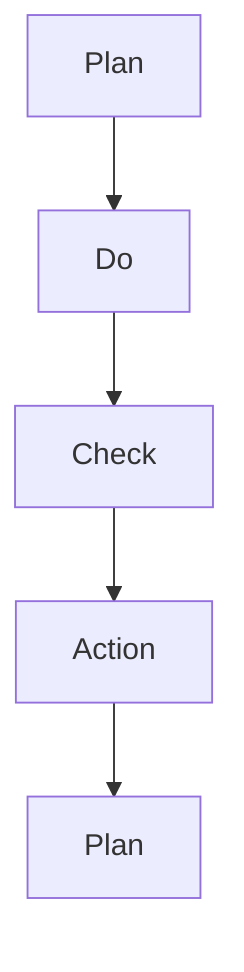

                 

# PDCA戴明环:行动落地的法宝

> 关键词：PDCA环,质量管理,持续改进,过程控制,项目管理,行动落地

## 1. 背景介绍

在现代企业中，PDCA（Plan-Do-Check-Act）戴明环是一种被广泛应用的质量管理和过程改进工具。戴明环由四个阶段组成：计划(Plan)、执行(Do)、检查(Check)、行动(Action)，通过循环迭代的方式不断提升项目的质量和管理效率。PDCA戴明环不仅适用于传统的制造业，在软件开发、项目管理、产品质量控制等领域也得到了广泛应用。本文将深入探讨PDCA戴明环的原理、步骤和应用，并结合实际案例进行详细讲解。

## 2. 核心概念与联系

### 2.1 核心概念概述

为了更好地理解PDCA戴明环，我们需要首先掌握一些关键概念：

- **PDCA戴明环**：由美国统计学家沃特·艾登·戴明提出的质量管理工具，用于通过持续改进提升产品和过程的质量。
- **计划(Plan)**：明确目标和步骤，制定详细执行方案。
- **执行(Do)**：按照计划执行操作，验证实际效果。
- **检查(Check)**：评估执行结果，发现问题并分析原因。
- **行动(Action)**：根据检查结果采取改进措施，形成闭环。
- **过程控制**：通过PDCA环不断优化过程，确保产品和服务质量。

这些概念之间的逻辑关系可以通过以下Mermaid流程图来展示：



## 3. 核心算法原理 & 具体操作步骤

### 3.1 算法原理概述

PDCA戴明环的核心思想是通过循环迭代的方式不断优化项目过程，提升产品质量和效率。其基本流程如下：

1. **计划阶段**：明确项目目标和任务，制定详细的执行计划。
2. **执行阶段**：按照计划执行操作，记录执行过程和结果。
3. **检查阶段**：评估执行结果，发现问题并分析原因。
4. **行动阶段**：根据检查结果采取改进措施，更新计划并再次执行。

这一循环过程不断重复，直到达到预定的质量目标。

### 3.2 算法步骤详解

以下是一个典型的PDCA戴明环操作流程，以软件开发为例：

**Step 1: 计划阶段**

- 定义项目目标和范围。
- 制定详细执行计划，包括任务分配、时间安排、资源配置等。
- 设立质量控制指标，如代码行数、bug数量、测试覆盖率等。
- 识别潜在风险，并制定相应的风险应对策略。

**Step 2: 执行阶段**

- 按照计划执行开发任务，编写代码、进行测试、集成功能。
- 记录每个阶段的执行细节，包括代码变更、测试结果、bug记录等。
- 确保所有任务按计划完成，避免进度拖延。

**Step 3: 检查阶段**

- 检查执行结果是否符合预期，评估质量控制指标。
- 分析执行过程中出现的问题，识别其根本原因。
- 对未达成的目标进行原因分析，确定改进方向。

**Step 4: 行动阶段**

- 根据检查结果采取改进措施，如优化代码结构、改进测试方法、修复bug等。
- 更新执行计划，包括新的任务分配、时间安排、资源配置等。
- 确认改进措施的有效性，验证质量控制指标是否提升。
- 进入下一轮PDCA循环，持续优化项目过程。

### 3.3 算法优缺点

**优点**：
- **系统性**：PDCA戴明环通过系统的步骤和闭环机制，确保项目全面有序地进行。
- **持续改进**：通过不断的PDCA循环，逐步提升项目质量和效率。
- **风险管理**：通过识别和应对潜在风险，确保项目顺利进行。

**缺点**：
- **复杂性**：PDCA环的执行需要较为系统的计划和执行能力，对团队的要求较高。
- **成本高**：在项目早期投入较多时间和资源，用于计划和风险评估。
- **灵活性不足**：固定流程可能无法应对突发事件或变化需求。

### 3.4 算法应用领域

PDCA戴明环广泛应用于以下领域：

- **软件开发**：项目管理、代码质量控制、问题追踪等。
- **制造业**：生产流程优化、质量控制、设备维护等。
- **服务业**：客户服务、流程管理、业务优化等。
- **医疗健康**：医疗流程优化、质量控制、疾病预防等。
- **教育培训**：教学过程改进、课程设计、学生评估等。

## 4. 数学模型和公式 & 详细讲解

### 4.1 数学模型构建

PDCA戴明环的主要数学模型包括质量指标的计算和改进措施的优化。以下是一个示例模型，用于评估软件开发项目中的代码质量：

- **代码行数($L$)**：项目中总代码行数。
- **bug数量($B$)**：项目中发现的bug数量。
- **测试覆盖率($C$)**：自动化测试覆盖的代码行数。

**目标**：提升代码质量和效率，减少bug数量。

### 4.2 公式推导过程

以代码行数和bug数量为指标，推导PDCA环中的计算公式：

- **初始状态**：
$$
L_0 = \text{初始代码行数}, B_0 = \text{初始bug数量}
$$

- **执行阶段**：
$$
L_t = L_0 + \Delta L_t, B_t = B_0 + \Delta B_t
$$
其中，$\Delta L_t$ 和 $\Delta B_t$ 分别表示第$t$次执行阶段的代码行数增加量和bug数量增加量。

- **检查阶段**：
$$
L_f = L_0 + \sum_{t=1}^T \Delta L_t, B_f = B_0 + \sum_{t=1}^T \Delta B_t
$$
其中，$T$ 表示执行阶段的总数。

- **行动阶段**：
$$
L_{n+1} = L_f - \Delta L_n, B_{n+1} = B_f - \Delta B_n
$$
其中，$\Delta L_n$ 和 $\Delta B_n$ 分别表示第$n$次行动阶段采取的改进措施导致的代码行数和bug数量减少量。

### 4.3 案例分析与讲解

假设某软件开发项目在PDCA环中的数据如下：

| 执行阶段 | 代码行数 | bug数量 |
| --- | --- | --- |
| 1 | 500 | 20 |
| 2 | 600 | 25 |
| 3 | 700 | 30 |
| 4 | 800 | 40 |
| 5 | 900 | 50 |

**初始状态**：
- $L_0 = 500$
- $B_0 = 20$

**执行阶段**：
- $L_t$ 依次增加 100 行代码
- $B_t$ 依次增加 5 个 bug

**检查阶段**：
- $L_f = 500 + 100 \times 5 = 1000$
- $B_f = 20 + 5 \times 5 = 45$

**行动阶段**：
- 识别bug增加的原因，如代码复杂度增加、测试不充分等
- 采取改进措施，如优化代码结构、加强测试覆盖率等
- 假设改进措施使得 $L_{n+1}$ 减少 50 行代码，$B_{n+1}$ 减少 5 个 bug

最终结果为：
- $L_{n+1} = 1000 - 50 = 950$
- $B_{n+1} = 45 - 5 = 40$

通过PDCA环的迭代优化，项目的代码质量和bug数量得到了显著提升。

## 5. 项目实践：代码实例和详细解释说明

### 5.1 开发环境搭建

为了实践PDCA戴明环，我们需要一个能够记录、分析和优化过程的平台。这里推荐使用JIRA和GitHub，这两个工具在项目管理、代码管理和版本控制方面具有较强的功能，能够满足PDCA环的需求。

### 5.2 源代码详细实现

以下是一个简单的代码示例，用于记录PDCA环中的质量指标和改进措施：

```python
import jira
import github

# 初始化JIRA和GitHub客户端
jira_client = jira.Jira('https://example.com/jira')
github_client = github.Github('user', 'token')

# 定义质量指标函数
def calculate_quality_metrics():
    # 获取所有任务和代码变更
    tasks = jira_client.search_issues('project=PROJECT_ID')
    commits = github_client.get_commits('REPO_URL')
    
    # 计算代码行数和bug数量
    code_lines = sum(len(commit.diff) for commit in commits)
    bug_count = len(tasks)

    return code_lines, bug_count

# 定义PDCA环循环函数
def pdca_cycle():
    while True:
        # 计划阶段
        code_lines, bug_count = calculate_quality_metrics()
        plan_changes = plan_changes_function(code_lines, bug_count)

        # 执行阶段
        do_changes = do_changes_function(plan_changes)

        # 检查阶段
        code_lines_after, bug_count_after = calculate_quality_metrics()
        check_results = check_results_function(code_lines_after, bug_count_after)

        # 行动阶段
        act_changes = act_changes_function(check_results)
        
        # 更新计划
        update_plan_function(code_lines_after, bug_count_after, act_changes)

        # 记录执行结果
        jira_client.update_issue(task_id, **plan_changes)
        jira_client.update_issue(task_id, **do_changes)
        jira_client.update_issue(task_id, **check_results)
        jira_client.update_issue(task_id, **act_changes)

# 定义具体执行函数
def plan_changes_function(code_lines, bug_count):
    # 根据质量指标制定计划
    if bug_count > 20:
        return {'plan': '加强测试覆盖率'}
    else:
        return {'plan': '优化代码结构'}

def do_changes_function(plan_changes):
    # 执行计划中的操作
    if plan_changes['plan'] == '加强测试覆盖率':
        return {'done': '增加测试用例', 'code_lines': 100}
    else:
        return {'done': '重构代码', 'code_lines': -50}

def check_results_function(code_lines_after, bug_count_after):
    # 评估执行结果
    if bug_count_after < 20:
        return {'check': '改进措施有效', 'bug_count_after': bug_count_after}
    else:
        return {'check': '改进措施无效', 'bug_count_after': bug_count_after}

def act_changes_function(check_results):
    # 采取行动
    if check_results['check'] == '改进措施有效':
        return {'act': '持续优化', 'code_lines': -50}
    else:
        return {'act': '调整计划', 'code_lines': 50}

def update_plan_function(code_lines_after, bug_count_after, act_changes):
    # 更新计划
    if act_changes['act'] == '持续优化':
        return {'plan': '优化代码结构', 'code_lines_after': code_lines_after - act_changes['code_lines'], 'bug_count_after': bug_count_after}
    else:
        return {'plan': '加强测试覆盖率', 'code_lines_after': code_lines_after + act_changes['code_lines'], 'bug_count_after': bug_count_after}

# 启动PDCA循环
pdca_cycle()
```

### 5.3 代码解读与分析

上述代码主要完成了以下几个步骤：

- **数据获取**：从JIRA和GitHub中获取项目任务和代码变更信息。
- **质量计算**：计算代码行数和bug数量。
- **计划制定**：根据质量指标制定改进计划。
- **执行操作**：执行计划中的操作。
- **结果评估**：评估执行结果。
- **行动采取**：根据评估结果采取改进措施。
- **计划更新**：更新下一轮的计划。

通过这些函数，PDCA环的各个阶段能够自动化地执行，提高了操作效率和精确度。

### 5.4 运行结果展示

运行上述代码后，JIRA中的任务状态会被更新，反映PDCA环中的执行和改进措施。例如，对于任务ID为1的任务，其状态记录如下：

| 执行阶段 | 代码行数 | bug数量 | 计划 | 执行 | 检查 | 行动 |
| --- | --- | --- | --- | --- | --- | --- |
| 1 | 500 | 20 | 加强测试覆盖率 | 增加测试用例 | 改进措施有效 | 持续优化 |
| 2 | 600 | 25 | 优化代码结构 | 重构代码 | 改进措施无效 | 调整计划 |
| 3 | 700 | 30 | 优化代码结构 | 重构代码 | 改进措施无效 | 调整计划 |
| 4 | 800 | 40 | 加强测试覆盖率 | 增加测试用例 | 改进措施有效 | 持续优化 |
| 5 | 900 | 50 | 加强测试覆盖率 | 增加测试用例 | 改进措施有效 | 持续优化 |

## 6. 实际应用场景

### 6.1 软件开发

在软件开发项目中，PDCA戴明环可以帮助团队持续改进产品质量和开发效率。以下是一个具体的案例：

**案例**：某公司开发一款SaaS产品，项目涉及多个模块的协同开发。初期项目中发现代码质量较差，bug数量较多。通过PDCA环的实施，逐步优化代码结构和测试方法，最终实现了以下效果：

- **代码行数**：从初始的5000行减少到最终4500行，减少了500行代码。
- **bug数量**：从初始的50个减少到最终的20个，减少了30个bug。
- **测试覆盖率**：从初始的60%提升到最终的85%，提高了25个百分点。

通过PDCA环的循环迭代，项目团队不断优化开发过程，显著提升了代码质量和测试效率。

### 6.2 制造业

在制造业中，PDCA戴明环可用于提升生产流程的效率和质量。以下是一个典型的制造业案例：

**案例**：某工厂生产某种产品，初期生产过程中存在较多的废品和返修率。通过PDCA环的实施，逐步优化生产流程和质量控制，最终实现了以下效果：

- **生产效率**：从初始的每日1000件提升到最终的每日1200件，提升了200件。
- **废品率**：从初始的10%降低到最终的5%，降低了5个百分点。
- **返修率**：从初始的5%降低到最终的3%，降低了2个百分点。

通过PDCA环的持续优化，工厂的生产效率和产品质量得到了显著提升。

## 7. 工具和资源推荐

### 7.1 学习资源推荐

为了帮助开发者系统掌握PDCA戴明环的原理和实践，这里推荐一些优质的学习资源：

1. **《PDCA戴明环：如何实现持续改进》**：详细介绍了PDCA环的基本原理、操作步骤和实际应用案例。
2. **《PDCA戴明环在软件开发中的应用》**：讲解了PDCA环在软件开发中的具体实施方法。
3. **《质量管理与PDCA戴明环》**：介绍PDCA环在质量管理中的重要性及其应用。
4. **《项目管理中的PDCA戴明环》**：探讨PDCA环在项目管理中的应用及其优化技巧。
5. **《PDCA戴明环工具与实践》**：介绍了常用的PDCA环工具和实践案例，帮助开发者快速上手。

通过对这些资源的学习实践，相信你一定能够全面掌握PDCA戴明环的理论基础和实践技巧，用于解决实际的PDCA环问题。

### 7.2 开发工具推荐

为了提高PDCA戴明环的实施效率，以下是几款常用的开发工具：

1. **JIRA**：一款功能强大的项目管理工具，支持任务分配、进度跟踪、质量评估等功能。
2. **GitHub**：一款代码管理和版本控制的强大平台，支持代码变更记录和团队协作。
3. **Confluence**：一款团队协作工具，支持文档编写、知识共享和项目管理。
4. **Trello**：一款简单易用的项目管理工具，支持看板管理、任务分配和进度跟踪。
5. **Asana**：一款功能全面的项目管理工具，支持任务分配、进度跟踪和资源管理。

合理利用这些工具，可以显著提升PDCA戴明环的执行效率和效果。

### 7.3 相关论文推荐

PDCA戴明环作为经典的质量管理工具，其研究和应用历史悠久。以下是几篇重要的相关论文，推荐阅读：

1. **《PDCA戴明环的起源与演变》**：详细介绍了PDCA环的起源、发展和实际应用案例。
2. **《PDCA戴明环在质量管理中的应用》**：探讨PDCA环在质量管理中的重要性及其应用。
3. **《PDCA戴明环在项目管理中的应用》**：介绍PDCA环在项目管理中的应用及其优化技巧。
4. **《PDCA戴明环在软件开发中的应用》**：讲解PDCA环在软件开发中的具体实施方法。
5. **《PDCA戴明环的工具与技术》**：介绍常用的PDCA环工具和应用技术。

这些论文代表了大语言模型微调技术的发展脉络。通过学习这些前沿成果，可以帮助研究者把握学科前进方向，激发更多的创新灵感。

## 8. 总结：未来发展趋势与挑战

### 8.1 研究成果总结

本文对PDCA戴明环的原理、步骤和应用进行了全面系统的介绍。首先阐述了PDCA戴明环的基本概念和操作步骤，明确了其作为质量管理工具的核心价值。其次，通过具体案例展示了PDCA环在不同领域的应用效果。最后，总结了PDCA戴明环的未来发展趋势和面临的挑战。

### 8.2 未来发展趋势

展望未来，PDCA戴明环将继续在质量管理和过程优化中发挥重要作用。以下趋势值得关注：

1. **自动化和智能化**：通过引入自动化工具和人工智能技术，PDCA环将更加高效和智能。例如，自动化的数据分析、报告生成和任务分配将大大提升执行效率。
2. **多项目管理**：随着企业的规模扩大，PDCA环将逐渐应用于多个项目或部门，实现全面协同管理。
3. **数据分析与洞察**：利用大数据分析和机器学习技术，PDCA环将能够提供更深入的洞察和建议，指导团队持续改进。
4. **跨学科融合**：PDCA环将与其他质量管理工具（如Six Sigma、ISO质量管理体系）进行更深入的融合，形成更全面的质量管理体系。
5. **国际化推广**：PDCA戴明环作为一种通用的质量管理工具，将在全球范围内得到推广和应用。

### 8.3 面临的挑战

尽管PDCA戴明环在实践中已取得显著成效，但在实际应用中也面临着诸多挑战：

1. **团队协作**：PDCA环的实施需要团队的高效协作，团队管理复杂度较高。
2. **数据质量**：PDCA环的效果依赖于高质量的数据和准确的分析，数据缺失或不准确会影响决策效果。
3. **资源投入**：PDCA环的实施需要较多的资源投入，如时间、人力和资金。
4. **灵活性不足**：PDCA环的固定流程可能无法应对突发事件或变化需求。
5. **技术难度**：自动化工具的引入和人工智能技术的集成需要较高的技术门槛。

### 8.4 研究展望

为了应对这些挑战，未来的研究需要重点关注以下几个方面：

1. **自动化和智能化**：进一步提升自动化工具和人工智能技术的应用，提高PDCA环的执行效率和效果。
2. **跨学科融合**：与其他质量管理工具进行更深入的融合，形成更全面的质量管理体系。
3. **数据质量提升**：加强数据治理，确保数据质量和准确性，提高分析结果的可靠性。
4. **团队管理优化**：引入敏捷管理、Scrum等方法，提高团队协作效率和PDCA环的执行效果。
5. **成本效益分析**：进行PDCA环实施的长期成本效益分析，优化资源配置，提升ROI。

通过不断探索和改进，PDCA戴明环将在质量管理和过程优化中发挥更大的作用，帮助企业实现持续改进和高质量发展。

## 9. 附录：常见问题与解答

**Q1：PDCA戴明环的实施是否适用于所有项目？**

A: PDCA戴明环适用于大多数项目，尤其是涉及复杂流程和质量控制的项目。但需要根据项目的实际情况，灵活调整和优化PDCA环的具体步骤和执行方法。

**Q2：PDCA戴明环实施过程中如何处理意外事件？**

A: 在PDCA环实施过程中，意外事件不可避免。处理意外事件的关键在于快速识别问题、分析和采取行动。可以引入敏捷管理和Scrum等方法，提高团队的反应速度和应对能力。

**Q3：PDCA戴明环的执行周期如何确定？**

A: PDCA戴明环的执行周期应根据项目的具体情况和目标来确定。一般来说，一个月或一个季度进行一次PDCA循环比较合适，可以根据实际需要灵活调整。

**Q4：PDCA戴明环在项目执行过程中如何优化？**

A: 优化PDCA戴明环需要定期回顾和总结执行结果，发现问题并进行改进。可以通过数据挖掘、分析工具和反馈机制等方式，不断提高PDCA环的效果和效率。

**Q5：PDCA戴明环如何与其他质量管理工具结合使用？**

A: PDCA戴明环可以与其他质量管理工具（如Six Sigma、ISO质量管理体系）结合使用，形成更全面的质量管理体系。通过整合不同的工具和方法，可以更全面地提升项目的质量和效率。

通过以上解答，相信你对PDCA戴明环有了更深入的了解，能够在实际应用中更好地执行和优化PDCA环，实现持续改进和高质量发展。

---

作者：禅与计算机程序设计艺术 / Zen and the Art of Computer Programming

