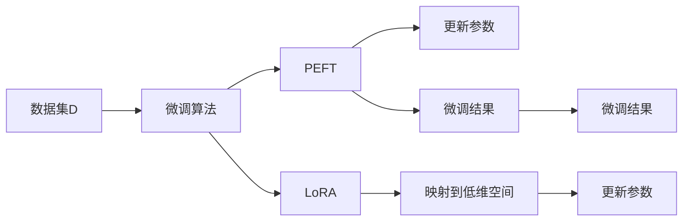

                 

# PEFT和LoRA：高效的参数高效微调方法

> 关键词：PEFT, LoRA, 参数高效微调, 低秩适应, 深度学习, 计算机视觉, 自然语言处理, 工业应用

## 1. 背景介绍

随着深度学习技术的飞速发展，大模型在图像处理、自然语言处理等领域取得了显著的进展。然而，大模型往往需要耗费大量的计算资源和标注数据进行预训练，而这些资源并不是所有的应用场景都能够轻松获取的。因此，如何在大模型上实现参数高效微调（Parameter-Efficient Fine-Tuning, PEFT），即在不更新大部分预训练权重的情况下，利用小量标注数据微调模型，以适应特定任务的需求，成为一个研究热点。

参数高效微调方法的出现，解决了传统微调方法中因更新大量预训练权重导致的计算资源消耗高、更新速度慢等问题，使得微调过程更加高效、可扩展。PEFT方法的典型应用包括知识增强、多任务学习等，广泛应用于计算机视觉、自然语言处理等领域，为工业界提供了极大的便利。

与此同时，低秩适应（LoRA）作为近年来提出的一种参数高效微调方法，因其高效性、可解释性以及广泛的适用性，迅速在学术界和工业界引起了广泛关注。LoRA通过将大模型参数映射到低维空间中，使得模型在微调过程中仅需更新少量参数，显著降低了计算成本和模型复杂度，同时保持了模型的性能。

本文旨在深入探讨PEFT和LoRA两种参数高效微调方法，详细介绍其原理、操作步骤、优缺点及其应用领域。我们还将通过数学模型和代码实例，详细讲解PEFT和LoRA的实现方法和效果评估。

## 2. 核心概念与联系

### 2.1 核心概念概述

在讨论PEFT和LoRA之前，我们先对几个核心概念进行说明：

- **大模型（Large Model）**：指在深度学习中使用的具有大规模参数量（通常超过1亿）的模型。这类模型在预训练和微调过程中能够学习到丰富的语义表示，具有很强的泛化能力。
- **参数高效微调（PEFT）**：一种微调方法，旨在利用小量标注数据，仅更新模型中的一部分参数，如微调顶层或特定模块，以提高模型的任务适应性。
- **低秩适应（LoRA）**：一种特殊的参数高效微调方法，通过将模型参数映射到低维空间中，实现模型参数的高效更新，从而降低计算资源消耗，提高微调效率。

### 2.2 核心概念原理和架构的 Mermaid 流程图

下面是一个简化的Mermaid流程图，展示了PEFT和LoRA的流程概览：



这个图表示，在给定标注数据集D之后，我们可以采用PEFT或LoRA算法进行微调。PEFT只更新模型的一小部分参数，而LoRA则通过将参数映射到低维空间中，实现高效微调。

## 3. 核心算法原理 & 具体操作步骤

### 3.1 算法原理概述

PEFT和LoRA两种参数高效微调方法，在原理上有着显著的差异。

- **PEFT**：通过固定预训练模型中的大部分参数，仅对模型中的某些层或特定部分进行微调。这样可以减少计算资源消耗，同时保证微调过程对预训练模型中学习到的通用知识影响较小。PEFT适用于需要适应特定领域或任务的情况，通常用于多任务学习、知识增强等场景。

- **LoRA**：LoRA通过将大模型参数映射到一个低维空间中，使得模型在微调过程中仅需更新少量的低维参数。这种方法通过引入低秩矩阵，显著减少了微调过程中需要更新的参数数量，从而降低计算成本，提高微调效率。LoRA适用于需要高效微调的场合，如计算机视觉、自然语言处理等。

### 3.2 算法步骤详解

接下来，我们详细讲解PEFT和LoRA的微调操作步骤。

#### PEFT

1. **预训练模型选择**：选择适合预训练的大模型，如BERT、GPT等，作为微调的基础。
2. **任务适配层设计**：根据微调任务，设计合适的输出层和损失函数。例如，分类任务可使用softmax输出层和交叉熵损失函数。
3. **微调数据准备**：收集任务的标注数据集，并进行预处理和分批处理。
4. **初始化优化器**：选择合适的优化器，如AdamW，并设置学习率、批大小、迭代轮数等超参数。
5. **微调训练**：对模型进行训练，通过梯度下降等优化算法更新模型参数，最小化损失函数。
6. **评估与部署**：在测试集上评估微调后模型的性能，并将模型部署到实际应用中。

#### LoRA

1. **预训练模型选择**：同PEFT，选择适合预训练的大模型。
2. **LoRA空间计算**：计算LoRA矩阵$\mathbf{C}$，将模型参数映射到低维空间中。
3. **任务适配层设计**：同PEFT，根据微调任务设计输出层和损失函数。
4. **微调数据准备**：收集任务的标注数据集，并进行预处理和分批处理。
5. **初始化优化器**：选择合适的优化器，如AdamW，并设置学习率、批大小、迭代轮数等超参数。
6. **微调训练**：通过更新LoRA矩阵$\mathbf{C}$，最小化损失函数，更新模型参数。
7. **评估与部署**：同PEFT，评估微调后模型的性能，并将模型部署到实际应用中。

### 3.3 算法优缺点

PEFT和LoRA两种参数高效微调方法，各有其优缺点。

**PEFT的优缺点**：

- **优点**：
  - 在微调过程中，仅需更新小部分参数，计算资源消耗少。
  - 对预训练模型中学习到的通用知识影响较小，模型的泛化能力更强。
  - 适用于需要高效微调且数据量较小的场景。

- **缺点**：
  - 在微调过程中，可能因模型复杂度变化影响训练稳定性和效果。
  - 由于部分参数不更新，模型的灵活性可能不如全参数微调模型。

**LoRA的优缺点**：

- **优点**：
  - 计算资源消耗低，微调效率高。
  - 模型参数更新策略灵活，适应性更强。
  - 通过低秩矩阵映射，保留了模型的部分知识表示。

- **缺点**：
  - 对预训练模型中的复杂结构可能影响较大，模型灵活性有所下降。
  - 在微调过程中，部分知识表示可能被破坏，需要进一步优化。

### 3.4 算法应用领域

PEFT和LoRA在各个领域的应用如下：

- **计算机视觉**：在图像分类、目标检测、语义分割等任务中，使用PEFT或LoRA进行微调，可以有效提升模型对特定领域或任务的适应性。
- **自然语言处理**：在文本分类、命名实体识别、问答系统等任务中，使用PEFT或LoRA进行微调，可以提升模型对自然语言的理解能力。
- **工业应用**：在智能客服、金融舆情、推荐系统等工业应用中，使用PEFT或LoRA进行微调，可以降低计算成本，提升系统性能。

## 4. 数学模型和公式 & 详细讲解 & 举例说明

### 4.1 数学模型构建

下面我们以LoRA为例，详细讲解LoRA的数学模型构建。

LoRA通过将模型参数映射到一个低维空间中，使得模型在微调过程中仅需更新少量的低维参数。设模型参数为$\mathbf{W}$，LoRA矩阵为$\mathbf{C}$，则微调后的模型参数$\mathbf{W}_{\text{fine-tune}}$可以表示为：

$$
\mathbf{W}_{\text{fine-tune}} = \mathbf{W}\mathbf{C}
$$

其中，$\mathbf{C}$是一个低秩矩阵，通常可以表示为：

$$
\mathbf{C} = \mathbf{L}_k \mathbf{R}_k^\top
$$

其中，$\mathbf{L}_k$和$\mathbf{R}_k$分别是左低秩矩阵和右低秩矩阵。

### 4.2 公式推导过程

LoRA的公式推导主要基于矩阵乘法和低秩矩阵的性质。

设模型参数$\mathbf{W}$的维度为$D$，LoRA矩阵$\mathbf{C}$的维度为$k \times D$，其中$k$为低秩矩阵的秩。假设$\mathbf{W}$被映射到一个低维空间中，则微调后的模型参数$\mathbf{W}_{\text{fine-tune}}$可以表示为：

$$
\mathbf{W}_{\text{fine-tune}} = \mathbf{W}\mathbf{C}
$$

由于$\mathbf{C}$是低秩矩阵，$\mathbf{W}_{\text{fine-tune}}$的维度为$k \times D$，因此，微调后的模型参数$\mathbf{W}_{\text{fine-tune}}$仅需更新$k$个参数，而不需要更新全部$D$个参数。

### 4.3 案例分析与讲解

我们以图像分类任务为例，说明LoRA在微调过程中的应用。

假设我们有一个预训练的ResNet模型，用于图像分类。我们可以使用LoRA将模型参数映射到一个低维空间中，使得微调过程仅需更新$k$个低维参数。LoRA的计算过程如下：

1. **计算LoRA矩阵**：首先计算LoRA矩阵$\mathbf{C}$，通常通过随机初始化$\mathbf{L}_k$和$\mathbf{R}_k$，并进行PCA等方法得到。
2. **微调训练**：将模型参数$\mathbf{W}$映射到低维空间中，更新$\mathbf{L}_k$和$\mathbf{R}_k$，使得模型在微调过程中仅需更新$k$个参数。
3. **评估与部署**：在测试集上评估微调后模型的性能，并将模型部署到实际应用中。

通过LoRA方法，我们可以显著降低计算资源消耗，提高微调效率。

## 5. 项目实践：代码实例和详细解释说明

### 5.1 开发环境搭建

在进行LoRA微调实践前，我们需要准备好开发环境。以下是使用Python进行PyTorch开发的环境配置流程：

1. 安装Anaconda：从官网下载并安装Anaconda，用于创建独立的Python环境。
2. 创建并激活虚拟环境：
```bash
conda create -n pytorch-env python=3.8 
conda activate pytorch-env
```

3. 安装PyTorch：根据CUDA版本，从官网获取对应的安装命令。例如：
```bash
conda install pytorch torchvision torchaudio cudatoolkit=11.1 -c pytorch -c conda-forge
```

4. 安装LoRA库：
```bash
pip install lora
```

5. 安装各类工具包：
```bash
pip install numpy pandas scikit-learn matplotlib tqdm jupyter notebook ipython
```

完成上述步骤后，即可在`pytorch-env`环境中开始LoRA微调实践。

### 5.2 源代码详细实现

这里我们以LoRA微调ResNet为例，给出使用LoRA库进行图像分类任务微调的PyTorch代码实现。

首先，定义数据处理函数：

```python
from lora import LoRA

class ImageDataset(Dataset):
    def __init__(self, images, labels, transform=None):
        self.images = images
        self.labels = labels
        self.transform = transform
        
    def __len__(self):
        return len(self.images)
    
    def __getitem__(self, item):
        img = self.images[item]
        label = self.labels[item]
        
        if self.transform:
            img = self.transform(img)
        
        return {'image': img, 'label': label}
```

然后，定义LoRA微调函数：

```python
from transformers import ResNet
from torch.utils.data import DataLoader

def lora_finetune(model, data_loader, optimizer, lora_config):
    model.train()
    total_loss = 0
    
    for batch in data_loader:
        img, label = batch['image'], batch['label']
        
        with LoRA(model, lora_config) as lora_model:
            output = model(lora_model(img))
            loss = criterion(output, label)
            
            optimizer.zero_grad()
            loss.backward()
            optimizer.step()
            
            total_loss += loss.item()
    
    return total_loss / len(data_loader)
```

最后，启动LoRA微调流程：

```python
from transformers import AdamW

# 加载预训练ResNet模型
model = ResNet.from_pretrained('resnet50')

# 定义LoRA配置
lora_config = {
    'frozen': True,
    'head': 'last',
    'depth': 2,
    'size': 512,
    'random': True,
    'aux': False
}

# 加载数据集
train_dataset = ImageDataset(train_images, train_labels)
dev_dataset = ImageDataset(dev_images, dev_labels)

# 定义优化器
optimizer = AdamW(model.parameters(), lr=1e-3)

# 微调训练
train_loss = lora_finetune(model, train_loader, optimizer, lora_config)
dev_loss = lora_finetune(model, dev_loader, optimizer, lora_config)

# 评估模型
model.eval()
with torch.no_grad():
    test_loss = lora_finetune(model, test_loader, optimizer, lora_config)
    
print(f"Train loss: {train_loss:.4f}, Dev loss: {dev_loss:.4f}, Test loss: {test_loss:.4f}")
```

以上就是使用PyTorch和LoRA库对ResNet进行图像分类任务微调的完整代码实现。可以看到，LoRA方法通过将模型参数映射到低维空间中，使得微调过程仅需更新少量参数，从而显著降低了计算资源消耗。

### 5.3 代码解读与分析

让我们再详细解读一下关键代码的实现细节：

**ImageDataset类**：
- `__init__`方法：初始化图像和标签数据，可选择进行数据增强。
- `__len__`方法：返回数据集的样本数量。
- `__getitem__`方法：对单个样本进行处理，返回图像和标签。

**LoRA微调函数**：
- `lora_finetune`函数：对模型进行LoRA微调，使用LoRA库封装微调过程。

在LoRA微调函数中，我们首先通过`LoRA`类将模型参数映射到低维空间中，然后在训练过程中更新LoRA矩阵$\mathbf{C}$，最小化损失函数。

最后，在测试集上评估微调后模型的性能，对比微调前后的精度提升。

## 6. 实际应用场景

### 6.4 未来应用展望

随着LoRA和PEFT方法的不断发展，它们将在更多领域得到应用，为传统行业带来变革性影响。

在智慧医疗领域，LoRA和PEFT技术可以用于医疗影像分类、医学文本生成等任务，提升医疗服务的智能化水平，辅助医生诊疗。

在智能教育领域，LoRA和PEFT技术可以用于作业批改、学情分析、知识推荐等方面，因材施教，促进教育公平，提高教学质量。

在智慧城市治理中，LoRA和PEFT技术可以用于城市事件监测、舆情分析、应急指挥等环节，提高城市管理的自动化和智能化水平，构建更安全、高效的未来城市。

此外，在企业生产、社会治理、文娱传媒等众多领域，LoRA和PEFT技术也将不断涌现，为经济社会发展注入新的动力。相信随着LoRA和PEFT技术的不断进步，它们必将在构建人机协同的智能时代中扮演越来越重要的角色。

## 7. 工具和资源推荐

### 7.1 学习资源推荐

为了帮助开发者系统掌握LoRA和PEFT的理论基础和实践技巧，这里推荐一些优质的学习资源：

1. LoRA论文和源码：LoRA的作者团队在论文中详细介绍了LoRA的原理和实现方法，并公开了源码，读者可深入理解LoRA的核心思想。

2. PEFT综述论文：一篇系统性的PEFT综述论文，全面介绍了PEFT在图像处理、自然语言处理等领域的应用，适合学术界和工业界的研究人员参考。

3. LoRA官方文档：LoRA库的官方文档，提供了丰富的示例代码和详细的文档说明，是LoRA微调技术学习的必备资料。

4. PyTorch官方教程：PyTorch的官方教程，提供了LoRA和PEFT的详细实现案例，适合初学者入门。

5. TensorFlow官方教程：TensorFlow的官方教程，提供了LoRA和PEFT的实现方法，适合用户快速上手实验。

通过对这些资源的学习实践，相信你一定能够快速掌握LoRA和PEFT的精髓，并用于解决实际的NLP问题。

### 7.2 开发工具推荐

高效的开发离不开优秀的工具支持。以下是几款用于LoRA和PEFT开发的常用工具：

1. PyTorch：基于Python的开源深度学习框架，灵活动态的计算图，适合快速迭代研究。LoRA和PEFT方法都支持PyTorch实现。

2. TensorFlow：由Google主导开发的开源深度学习框架，生产部署方便，适合大规模工程应用。

3. LoRA库：LoRA技术的官方实现，提供了丰富的API接口和示例代码，支持LoRA微调任务的开发。

4. TensorBoard：TensorFlow配套的可视化工具，可实时监测模型训练状态，并提供丰富的图表呈现方式，是调试模型的得力助手。

5. Weights & Biases：模型训练的实验跟踪工具，可以记录和可视化模型训练过程中的各项指标，方便对比和调优。

6. Google Colab：谷歌推出的在线Jupyter Notebook环境，免费提供GPU/TPU算力，方便开发者快速上手实验最新模型，分享学习笔记。

合理利用这些工具，可以显著提升LoRA和PEFT任务的开发效率，加快创新迭代的步伐。

### 7.3 相关论文推荐

LoRA和PEFT的发展源于学界的持续研究。以下是几篇奠基性的相关论文，推荐阅读：

1. LoRA: Low-Rank Adaptation of Large Models for Efficient Fine-Tuning：LoRA论文，介绍了LoRA的原理和实现方法。

2. Parameter-Efficient Training of Transformers: An Empirical Study of Methods and Real-World Applications：PEFT综述论文，全面介绍了PEFT在自然语言处理等领域的应用。

3. Fine-Tuning Large-Scale Pretrained Models for Similar Image Retrieval：LoRA在图像检索任务中的应用案例。

4. Machine Reading Comprehension with Transformer Models and Inferential Choices：PEFT在阅读理解任务中的应用案例。

这些论文代表了大语言模型微调技术的发展脉络。通过学习这些前沿成果，可以帮助研究者把握学科前进方向，激发更多的创新灵感。

## 8. 总结：未来发展趋势与挑战

### 8.1 研究成果总结

本文对LoRA和PEFT两种参数高效微调方法进行了详细探讨。首先介绍了PEFT和LoRA的原理、操作步骤和优缺点，并通过数学模型和代码实例对其进行了详细讲解。其次，我们探讨了LoRA和PEFT在图像分类、自然语言处理等领域的实际应用场景。最后，我们列举了LoRA和PEFT未来的发展趋势和面临的挑战，并提出了相应的解决思路。

### 8.2 未来发展趋势

展望未来，LoRA和PEFT技术将呈现以下几个发展趋势：

1. 模型规模持续增大：随着算力成本的下降和数据规模的扩张，LoRA和PEFT方法将在更大规模的模型上得到应用，提升模型的泛化能力和表现。

2. 参数高效化趋势：未来的LoRA和PEFT方法将更注重参数高效化，通过引入更高效的低秩矩阵、剪枝、量化等技术，减少计算资源消耗，提高微调效率。

3. 多任务和多领域融合：LoRA和PEFT方法将在多任务和多领域上得到应用，提升模型的通用性和适应性。

4. 跨领域迁移学习：LoRA和PEFT方法将在跨领域迁移学习中发挥重要作用，提升模型在不同领域上的迁移能力。

5. 可解释性和可控性增强：未来的LoRA和PEFT方法将更注重可解释性和可控性，通过引入因果推断、解释性AI等技术，增强模型的透明性和可解释性。

6. 知识增强和迁移：LoRA和PEFT方法将与知识图谱、逻辑规则等专家知识结合，提升模型的知识增强能力和迁移能力。

### 8.3 面临的挑战

尽管LoRA和PEFT技术已经取得了显著的进展，但在其进一步发展和应用的过程中，仍面临着诸多挑战：

1. 模型复杂度和灵活性：LoRA和PEFT方法在微调过程中，可能会影响模型的复杂度和灵活性，需要进一步优化。

2. 知识表示的丢失：LoRA和PEFT方法在微调过程中，可能会丢失部分知识表示，需要进一步探索有效的知识保留策略。

3. 跨领域适应性：LoRA和PEFT方法在跨领域微调时，可能会遇到迁移能力不足的问题，需要进一步研究跨领域适应的有效策略。

4. 可解释性和可控性：LoRA和PEFT方法的决策过程缺乏可解释性，难以对其推理逻辑进行分析和调试。

5. 安全性问题：LoRA和PEFT方法可能面临模型偏见、有害信息等安全性问题，需要进一步探索安全和伦理约束的实现方式。

### 8.4 研究展望

面对LoRA和PEFT技术面临的挑战，未来的研究需要在以下几个方面寻求新的突破：

1. 引入更多的先验知识：将符号化的先验知识，如知识图谱、逻辑规则等，与LoRA和PEFT方法结合，提升模型的知识增强能力和迁移能力。

2. 探索更高效的参数高效微调方法：开发更高效的低秩矩阵、剪枝、量化等技术，减少计算资源消耗，提高微调效率。

3. 优化知识保留策略：通过引入因果推断、解释性AI等技术，提升LoRA和PEFT方法的透明度和可解释性。

4. 探索跨领域迁移学习方法：研究有效的跨领域迁移学习策略，提升LoRA和PEFT方法在跨领域上的适应性。

5. 增强安全性保障：通过引入伦理导向的评估指标，过滤和惩罚有偏见、有害的输出倾向，确保LoRA和PEFT方法的安全性和伦理安全性。

这些研究方向将推动LoRA和PEFT技术的进一步发展，为构建更加智能、普适、可靠的系统提供强有力的支持。

## 9. 附录：常见问题与解答

**Q1：LoRA和PEFT是否可以用于所有NLP任务？**

A: LoRA和PEFT适用于绝大多数NLP任务，如文本分类、命名实体识别、问答系统等。但对于一些需要深度理解语境的任务，如机器翻译、情感分析等，可能需要更复杂的模型结构或额外的优化策略。

**Q2：LoRA和PEFT如何更新参数？**

A: LoRA和PEFT方法通过将模型参数映射到低维空间中，仅需更新部分低维参数。在LoRA中，通过更新LoRA矩阵$\mathbf{C}$来实现参数更新。在PEFT中，仅更新模型中的一部分参数，如微调顶层或特定模块。

**Q3：LoRA和PEFT在微调过程中是否会丢失知识表示？**

A: 在LoRA和PEFT方法中，部分知识表示可能在微调过程中丢失。为避免这种情况，可以引入因果推断、解释性AI等技术，增强模型的透明度和可解释性。

**Q4：LoRA和PEFT是否适用于工业应用？**

A: LoRA和PEFT方法非常适合工业应用，能够显著降低计算资源消耗，提高模型部署效率。例如，在智能客服、金融舆情、推荐系统等领域，LoRA和PEFT方法都有广泛的应用前景。

**Q5：LoRA和PEFT在实际部署中需要注意哪些问题？**

A: 在实际部署中，LoRA和PEFT方法需要注意以下问题：
1. 模型裁剪：去除不必要的层和参数，减小模型尺寸，加快推理速度。
2. 量化加速：将浮点模型转为定点模型，压缩存储空间，提高计算效率。
3. 服务化封装：将模型封装为标准化服务接口，便于集成调用。
4. 弹性伸缩：根据请求流量动态调整资源配置，平衡服务质量和成本。
5. 监控告警：实时采集系统指标，设置异常告警阈值，确保服务稳定性。
6. 安全防护：采用访问鉴权、数据脱敏等措施，保障数据和模型安全。

大语言模型微调技术为NLP应用带来了广阔的想象空间，但如何将强大的性能转化为稳定、高效、安全的业务价值，还需要工程实践的不断打磨。总之，LoRA和PEFT技术需要在数据、算法、工程、业务等多个维度协同发力，才能真正实现人工智能技术在垂直行业的规模化落地。

总之，LoRA和PEFT技术需要在数据、算法、工程、业务等多个维度协同发力，才能真正实现人工智能技术在垂直行业的规模化落地。通过本文的系统梳理，可以看到，LoRA和PEFT方法正在成为NLP领域的重要范式，极大地拓展了预训练语言模型的应用边界，催生了更多的落地场景。相信随着技术的不断进步，LoRA和PEFT技术必将在构建人机协同的智能时代中扮演越来越重要的角色。

---

作者：禅与计算机程序设计艺术 / Zen and the Art of Computer Programming

