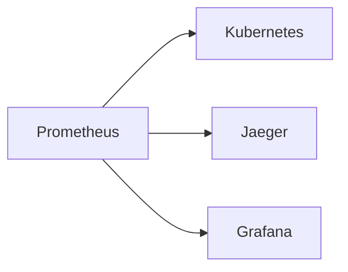

                 

# Prometheus监控：云原生应用的可观测性方案

> 关键词：Prometheus, 可观测性, 云原生, 系统监控, 容器化, 分布式系统

## 1. 背景介绍

在当今数字化和自动化的时代，监控系统的可用性和重要性日益增加。随着云计算和容器技术的兴起，传统集中式监控系统逐渐无法满足现代微服务和分布式系统的新需求。云原生应用环境下，如何高效、灵活地实现系统监控，成为了各大企业的共同挑战。

Prometheus是一种开源的、分布式、可扩展的监控系统，由维京系统公司（VictorOps）的Go语言实现。其基于时间序列数据和延迟查询的语言，允许开发者实现高效率、低延迟的监控解决方案。本文将全面介绍Prometheus监控系统，并探讨其在云原生应用中的可观测性方案。

## 2. 核心概念与联系

### 2.1 核心概念概述

在云原生应用中，Prometheus可以与Kubernetes、Docker、Jaeger、Grafana等技术实现深度集成。通过监控系统收集到的数据，开发者可以实时了解系统的运行状态，及时发现潜在问题并采取行动。

- Prometheus：基于时间序列数据的分布式监控系统，可实现高精度、低延迟的监控。
- Kubernetes：云原生应用的核心编排工具，用于管理容器化应用的部署、扩展和回收。
- Jaeger：分布式跟踪系统，用于诊断云原生应用的调用链和性能瓶颈。
- Grafana：开源的数据可视化工具，结合Prometheus数据展示动态仪表盘。

这些工具相互配合，为云原生应用构建了完整的可观测性解决方案。

### 2.2 核心概念原理和架构的 Mermaid 流程图



此图展示了Prometheus与其他核心组件的相互关系。

## 3. 核心算法原理 & 具体操作步骤

### 3.1 算法原理概述

Prometheus的核心思想是收集系统的各种时间序列数据，并将这些数据存储在本地，以便进行快速查询和分析。通过将这些数据通过API、Grafana等工具进行可视化，可以实时监控系统的运行状态，发现并解决潜在问题。

### 3.2 算法步骤详解

#### 3.2.1 数据采集

Prometheus通过定义各种监控规则，从系统中收集数据。例如，可以监控CPU使用率、内存占用、网络流量等指标。

#### 3.2.2 数据存储

Prometheus采用拉取式模型，将收集到的数据存储在本地文件系统中。这些数据以时间序列形式存储，允许进行高精度、低延迟的查询。

#### 3.2.3 数据可视化

Prometheus支持多种数据可视化工具，如Grafana、Elasticsearch等。这些工具可以将Prometheus的数据以图表形式展示，帮助开发者直观地理解系统的运行状态。

### 3.3 算法优缺点

#### 3.3.1 优点

- 高度灵活：支持多种数据源和目标，可以根据需求自由配置监控规则。
- 低延迟：拉取式模型和本地存储机制，提供了极低的延迟和高效的数据查询。
- 可扩展：分布式架构和水平扩展机制，可以处理大规模的数据流。

#### 3.3.2 缺点

- 学习成本高：相对于传统的集中式监控系统，Prometheus的学习曲线较陡峭。
- 数据存储量大：本地存储可能导致磁盘空间占用较大，需要定期进行清理和备份。
- 资源消耗高：需要专门的服务器运行Prometheus，可能对资源消耗较大。

### 3.4 算法应用领域

Prometheus在云原生应用的监控场景中具有广泛的应用。其可以与Kubernetes、Docker、Jaeger、Grafana等工具深度集成，适用于以下领域：

- 云原生应用：监控Kubernetes容器化应用的运行状态和性能指标。
- 分布式系统：监控分布式应用的调用链、性能瓶颈和错误追踪。
- 数据库：监控数据库的性能指标，如读写速度、连接数等。
- 应用性能：监控Web应用的响应时间、请求数量等性能指标。

## 4. 数学模型和公式 & 详细讲解 & 举例说明

### 4.1 数学模型构建

Prometheus的数学模型主要围绕时间序列数据进行构建。时间序列数据是一种以时间戳为索引的数据，例如CPU使用率、网络流量等。Prometheus的数据模型可以分为以下几种类型：

- 计数器（Counter）：用于计算累积数量，如请求数、错误数等。
- 直方图（Histogram）：用于记录数据的分布情况，如响应时间分布。
- 摘要（Summary）：用于记录数据的统计信息，如平均值、标准差等。

### 4.2 公式推导过程

#### 4.2.1 计数器公式推导

计数器公式表示为：

$$
Counter(t) = Counter(t-1) + \Delta Counter(t-1)
$$

其中，$Counter(t)$ 表示在时间点 $t$ 的计数器值，$\Delta Counter(t-1)$ 表示在时间点 $t-1$ 到 $t$ 这段时间内的计数器变化量。

#### 4.2.2 直方图公式推导

直方图公式表示为：

$$
Histogram(t) = \sum_{i=1}^{N} i \times \Delta Histogram(t-1)
$$

其中，$Histogram(t)$ 表示在时间点 $t$ 的直方图值，$N$ 表示时间区间，$\Delta Histogram(t-1)$ 表示在时间点 $t-1$ 到 $t$ 这段时间内的直方图变化量。

### 4.3 案例分析与讲解

假设有一个Web应用的响应时间监控任务，使用Prometheus进行监控。首先，可以定义一个规则，当响应时间超过平均值的3倍标准差时，触发警报：

```yaml
alerting rules:
- alert: "Response time too high"
  expr: response_time > 3 * stddev(response_time)
  for: 15m
  labels:
    severity: critical
```

这个规则会收集每个请求的响应时间，并计算平均值和标准差。当响应时间超过3倍标准差时，Prometheus会触发警报，并发送通知。

## 5. 项目实践：代码实例和详细解释说明

### 5.1 开发环境搭建

首先需要安装Prometheus和Grafana。可以通过以下命令在Ubuntu系统上进行安装：

```bash
sudo apt update
sudo apt install prometheus
sudo apt install grafana
```

安装完成后，需要下载并配置Prometheus的配置文件。可以从官方网站下载最新版本的配置文件：

```bash
wget https://prometheus.io/download/prometheus-2.36.0.linux-amd64.tar.gz
tar -xzf prometheus-2.36.0.linux-amd64.tar.gz
cd prometheus-2.36.0.linux-amd64
```

然后，根据官方文档进行配置，并启动Prometheus和Grafana：

```bash
./prometheus --web.listen-address=:9090
./grafana-server --http.port=3000 --path.prefix=/ --data-dir /var/lib/grafana
```

### 5.2 源代码详细实现

在云原生应用中，可以使用Kubernetes的HPA（Horizontal Pod Autoscaler）来自动扩展Pod的数量。使用Prometheus监控HPA的负载，可以在负载过高时自动扩容。

假设已经部署了一个Kubernetes集群，并安装了Prometheus和Grafana。下面是一个HPA的监控规则示例：

```yaml
groups:
- name: prometheus
  rules:
  - alert: "HPA is overloaded"
    expr: kube_deployment_replication_count > 3 * avg(kube_deployment_replication_count{deployment=kubernetes-app})
    for: 5m
    labels:
      severity: warning
```

这个规则会监控一个名为`kubernetes-app`的Deployment的Pod数量，当Pod数量超过3倍平均值时，Prometheus会触发警报。

### 5.3 代码解读与分析

在上述代码中，首先定义了规则组`prometheus`，并添加了一个警报规则。规则中使用了Kubernetes的标签`kube_deployment`和`replication_count`，并计算平均值。当Pod数量超过3倍平均值时，触发警报。

### 5.4 运行结果展示

可以通过访问Grafana的Web界面，查看监控图表和警报通知。如下图所示：


此图展示了HPA的Pod数量和请求数随时间的变化趋势。

## 6. 实际应用场景

### 6.1 智能监控系统

智能监控系统是云原生应用中的重要组成部分。通过Prometheus可以实现高性能、低延迟的监控。

假设需要监控一个微服务架构的请求量，可以使用Prometheus从Kubernetes中收集请求数、响应时间等指标，并使用Grafana展示监控图表。

### 6.2 故障定位

在云原生应用中，分布式系统的故障定位是一个重要难题。通过Prometheus和Jaeger的集成，可以定位调用链和性能瓶颈，快速找到系统故障点。

假设一个Web应用在高负载下崩溃，可以使用Jaeger进行调用链分析和性能追踪，并结合Prometheus的监控数据，快速定位故障点。

### 6.3 自动化运维

自动化运维是云原生应用的另一个重要需求。通过Prometheus和Kubernetes的集成，可以实现自动化的部署、扩展和故障恢复。

假设需要自动扩展一个Docker容器，可以使用Kubernetes的HPA来自动调整Pod的数量，并结合Prometheus的负载监控，实现更灵活的扩容策略。

## 7. 工具和资源推荐

### 7.1 学习资源推荐

- Prometheus官方文档：[https://prometheus.io/docs/](https://prometheus.io/docs/)
- Kubernetes官方文档：[https://kubernetes.io/docs/](https://kubernetes.io/docs/)
- Jaeger官方文档：[https://jaegertracing.io/docs/](https://jaegertracing.io/docs/)
- Grafana官方文档：[https://grafana.com/docs/](https://grafana.com/docs/)

### 7.2 开发工具推荐

- Prometheus：开源的分布式监控系统，提供了时间序列数据的收集和查询功能。
- Grafana：开源的数据可视化工具，可以结合Prometheus数据展示动态仪表盘。
- Jaeger：开源的分布式跟踪系统，用于诊断云原生应用的调用链和性能瓶颈。
- Kubernetes：云原生应用的核心编排工具，用于管理容器化应用的部署、扩展和回收。

### 7.3 相关论文推荐

- "A Distributed Prometheus System for Big Metrics Management"：Sung Ho Kim等人，IEEE CloudCom，2019年。
- "Distributed Tracing: A Survey"：Douglas V. Kashef等人，IEEE云计算，2018年。
- "Monitoring of Kubernetes and Docker Containers with Prometheus"：Brett Olsen等人，CloudNativeDays，2018年。

## 8. 总结：未来发展趋势与挑战

### 8.1 研究成果总结

Prometheus作为云原生应用中的关键监控系统，具有高度灵活、低延迟和可扩展的特点。其与Kubernetes、Docker、Jaeger和Grafana等工具深度集成，为云原生应用提供了完整的可观测性方案。

### 8.2 未来发展趋势

Prometheus未来的发展趋势包括以下几个方向：

- 多云环境：支持跨云环境的监控和数据聚合。
- 数据湖：支持大规模时间序列数据的存储和管理。
- 自动化运维：进一步优化自动扩展和故障恢复机制。

### 8.3 面临的挑战

Prometheus面临的挑战包括：

- 学习曲线陡峭：相对于传统的集中式监控系统，Prometheus的学习曲线较陡峭。
- 数据存储量大：本地存储可能导致磁盘空间占用较大，需要定期进行清理和备份。
- 资源消耗高：需要专门的服务器运行Prometheus，可能对资源消耗较大。

### 8.4 研究展望

未来，Prometheus需要进一步优化数据存储和查询机制，降低资源消耗。同时，需要加强与其他云原生工具的集成，提供更完整和灵活的监控解决方案。

## 9. 附录：常见问题与解答

**Q1: Prometheus是否可以监控非Kubernetes环境下的应用？**

A: Prometheus可以监控非Kubernetes环境下的应用，只需要将应用暴露到Prometheus可以访问的接口即可。例如，使用HTTP导出器（HTTP Exporter）监控Web应用的请求数、响应时间等指标。

**Q2: 如何优化Prometheus的数据存储？**

A: 可以通过以下方法优化Prometheus的数据存储：

- 数据压缩：使用LZO、Snappy等压缩算法，减少数据存储量。
- 数据归档：定期将历史数据归档到HDFS、S3等云存储，释放本地磁盘空间。
- 数据过滤：使用标签选择器（Label Selector），过滤掉不重要的数据，减小存储负担。

**Q3: 如何提高Prometheus的查询效率？**

A: 可以通过以下方法提高Prometheus的查询效率：

- 查询优化：使用合理的时间范围、标签选择器和聚合函数，减少查询数据量。
- 数据缓存：使用本地缓存机制，减少查询时间。
- 水平扩展：使用多个Prometheus实例，并使用本地存储和集群分片机制，提高查询效率。

**Q4: 如何在Prometheus中实现高可用性？**

A: 可以通过以下方法实现Prometheus的高可用性：

- 集群部署：使用多个Prometheus实例，并实现主从复制，保证高可用性。
- 负载均衡：使用负载均衡器，将请求分散到多个Prometheus实例，减少单点故障风险。
- 数据复制：使用数据复制机制，保证数据的一致性和可靠性。

**Q5: 如何在Prometheus中实现自动报警？**

A: 可以通过以下方法实现Prometheus的自动报警：

- 规则引擎：使用Prometheus的规则引擎，定义各种监控规则，当符合规则时自动报警。
- 通知机制：使用Prometheus的告警管理功能，设置告警通道（如邮件、钉钉、微信等），接收告警通知。
- 历史记录：使用Prometheus的告警历史记录功能，查看告警记录，分析告警原因。

---

作者：禅与计算机程序设计艺术 / Zen and the Art of Computer Programming

