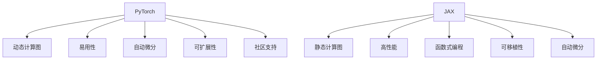

                 

# PyTorch vs JAX：深度学习框架的比较与选择

深度学习框架是实现深度学习算法的核心工具，帮助研究人员和工程师高效地构建、训练和部署模型。PyTorch和JAX是当前最流行的两种深度学习框架，分别代表了基于Python和基于JAX的深度学习范式。本文将对这两种框架进行详细比较，探讨它们的核心概念与联系，核心算法原理，操作步骤，并展示它们在实际应用中的表现。

## 1. 背景介绍

### 1.1 问题由来

深度学习框架的选择是构建深度学习模型的关键步骤，因为框架的选择直接影响到模型的性能、训练效率和可维护性。当前，深度学习领域有许多种框架可供选择，包括TensorFlow、Keras、PyTorch和JAX等。其中，PyTorch和JAX最为流行，分别代表了基于Python和基于JAX的深度学习范式。本文旨在深入探讨这两种框架的特点和适用场景，帮助读者做出明智的选择。

### 1.2 问题核心关键点

本文的核心比较内容包括：
1. PyTorch和JAX的核心概念、设计理念和架构特点。
2. 两者在算法原理、操作过程和实现细节上的异同。
3. 两者的优缺点和适用领域。
4. 在实际项目中如何选择框架。

通过深入分析，本文旨在为读者提供全面而深入的框架比较，帮助他们在实际项目中做出最佳选择。

## 2. 核心概念与联系

### 2.1 核心概念概述

为了更好地理解PyTorch和JAX，我们首先需要了解它们的核心概念和设计理念。

**PyTorch**：由Facebook开发的深度学习框架，以其动态计算图、易用性和灵活性著称。PyTorch的核心设计理念是"易用性优先"，强调程序员可以通过自定义模块、运算符和自动微分来构建模型。

**JAX**：由Google Brain开发的深度学习框架，基于JAX作为其核心组件。JAX是一种函数式编程范式，支持高性能自动微分、静态计算图和可移植性。JAX的设计理念是"通用高性能"，追求高性能和易用性的完美结合。

### 2.2 核心概念原理和架构的 Mermaid 流程图



### 2.3 核心概念的联系

PyTorch和JAX在核心概念上有显著区别，但同时也存在一些联系：

- **自动微分**：两者都支持自动微分，这是深度学习中最常用的优化算法。PyTorch使用`autograd`模块实现自动微分，而JAX使用`grad`函数。

- **动态/静态计算图**：PyTorch使用动态计算图，这意味着模型的构建和优化可以按需进行，更灵活。而JAX使用静态计算图，可以提前优化计算图，提升性能。

- **易用性和高性能**：两者都追求易用性和高性能，但在实现方式上有明显差异。PyTorch强调易用性和动态灵活性，JAX则注重函数式编程和静态计算图的高性能优化。

## 3. 核心算法原理 & 具体操作步骤

### 3.1 算法原理概述

PyTorch和JAX在算法原理上有许多共性，但在实现细节上存在显著差异。以下是两种框架在核心算法原理上的概述：

- **损失函数计算**：两者都使用反向传播算法来计算损失函数，并使用梯度下降法来优化模型参数。

- **模型构建**：PyTorch支持通过自定义模块和运算符来构建模型，而JAX使用函数式编程和静态计算图来构建模型。

- **自动微分**：两者都支持自动微分，但PyTorch使用`autograd`模块，而JAX则通过`jax.jit`和`jax.value_and_grad`函数来实现。

### 3.2 算法步骤详解

**PyTorch**：
1. **模型构建**：使用自定义模块或类定义模型。
2. **损失计算**：定义损失函数，并使用反向传播计算梯度。
3. **优化器**：选择合适的优化器（如Adam或SGD），并设置学习率。
4. **训练循环**：在训练循环中迭代计算损失函数，并使用优化器更新模型参数。

**JAX**：
1. **模型构建**：使用函数式编程和静态计算图构建模型。
2. **损失计算**：定义损失函数，并使用`jax.value_and_grad`计算梯度。
3. **优化器**：选择合适的优化器，并设置学习率。
4. **训练循环**：在训练循环中迭代计算损失函数，并使用优化器更新模型参数。

### 3.3 算法优缺点

**PyTorch**：
- **优点**：
  - 动态计算图，灵活性高。
  - 社区活跃，资源丰富。
  - 易用性强，API简单。

- **缺点**：
  - 动态图效率较低，可能存在性能瓶颈。
  - 缺乏静态图的高性能优化。

**JAX**：
- **优点**：
  - 静态计算图，高性能优化。
  - 支持多种设备（CPU、GPU、TPU），可移植性强。
  - 基于函数式编程，代码易于理解和维护。

- **缺点**：
  - 学习曲线较陡峭，新手上手难度大。
  - 缺乏丰富的社区资源和文档支持。

### 3.4 算法应用领域

**PyTorch**：
- 适合动态计算图和灵活性的应用，如自然语言处理、计算机视觉、生成模型等。
- 适用于快速原型开发和研究性项目。

**JAX**：
- 适合高性能和静态计算图的应用，如机器学习、数据科学、科学计算等。
- 适用于大规模计算和高性能要求的项目。

## 4. 数学模型和公式 & 详细讲解 & 举例说明

### 4.1 数学模型构建

以多层感知器（MLP）为例，以下是PyTorch和JAX的数学模型构建过程：

**PyTorch**：
```python
import torch
import torch.nn as nn

class MLP(nn.Module):
    def __init__(self, input_size, hidden_size, output_size):
        super(MLP, self).__init__()
        self.fc1 = nn.Linear(input_size, hidden_size)
        self.fc2 = nn.Linear(hidden_size, output_size)
        
    def forward(self, x):
        x = self.fc1(x)
        x = torch.relu(x)
        x = self.fc2(x)
        return x

model = MLP(10, 20, 2)
```

**JAX**：
```python
import jax.numpy as jnp
import jax

def mlp(x, input_size, hidden_size, output_size):
    fc1 = jax.jit(jax.grad(jax.value_and_grad(lambda x: jnp.dot(x, W1) + b1)))
    x = fc1(x)
    x = jax.nn.relu(x)
    fc2 = jax.jit(jax.grad(jax.value_and_grad(lambda x: jnp.dot(x, W2) + b2)))
    x = fc2(x)
    return x

W1 = jnp.random.randn(input_size, hidden_size)
b1 = jnp.random.randn(hidden_size)
W2 = jnp.random.randn(hidden_size, output_size)
b2 = jnp.random.randn(output_size)
x = jnp.zeros((10, input_size))
```

### 4.2 公式推导过程

**PyTorch**：
设模型为$M(x; \theta)$，损失函数为$L$，优化器为$Opt$，训练步数为$T$，学习率为$\eta$。
训练过程如下：
1. 初始化模型参数$\theta$
2. 对于每个训练样本$(x_i, y_i)$：
   - 前向传播计算输出$y_i$
   - 计算损失$L(y_i, \hat{y}_i)$
   - 反向传播计算梯度$\nabla_\theta L$
   - 使用优化器更新参数$\theta = Opt(\theta - \eta \nabla_\theta L)$
3. 重复步骤2共$T$次

**JAX**：
设模型为$M(x; \theta)$，损失函数为$L$，优化器为$Opt$，训练步数为$T$，学习率为$\eta$。
训练过程如下：
1. 初始化模型参数$\theta$
2. 对于每个训练样本$(x_i, y_i)$：
   - 使用`jax.value_and_grad`计算梯度$\nabla_\theta L$
   - 使用优化器更新参数$\theta = Opt(\theta - \eta \nabla_\theta L)$
3. 重复步骤2共$T$次

### 4.3 案例分析与讲解

**PyTorch**：
```python
import torch.optim as optim

optimizer = optim.Adam(model.parameters(), lr=0.001)
for i in range(T):
    optimizer.zero_grad()
    y_hat = model(x)
    loss = criterion(y_hat, y)
    loss.backward()
    optimizer.step()
```

**JAX**：
```python
optimizer = jax.optim.AdamW(learning_rate=0.001)
for i in range(T):
    loss, grads = jax.value_and_grad(loss_fn)
    optimizer.update(grads, params)
    params = optimizer.params
```

## 5. 项目实践：代码实例和详细解释说明

### 5.1 开发环境搭建

搭建PyTorch和JAX开发环境的步骤如下：

**PyTorch**：
1. 安装Anaconda和conda环境。
2. 创建虚拟环境。
3. 安装PyTorch及其相关库。
4. 安装必要的依赖库。

**JAX**：
1. 安装Anaconda和conda环境。
2. 创建虚拟环境。
3. 安装JAX及其相关库。
4. 安装必要的依赖库。

### 5.2 源代码详细实现

以下是一个简单的线性回归示例：

**PyTorch**：
```python
import torch
import torch.nn as nn
import torch.optim as optim

class LinearRegression(nn.Module):
    def __init__(self, input_size, output_size):
        super(LinearRegression, self).__init__()
        self.linear = nn.Linear(input_size, output_size)

    def forward(self, x):
        out = self.linear(x)
        return out

model = LinearRegression(1, 1)
criterion = nn.MSELoss()
optimizer = optim.SGD(model.parameters(), lr=0.01)

x_train = torch.randn(100, 1)
y_train = x_train * 2 + 1
for epoch in range(1000):
    optimizer.zero_grad()
    y_pred = model(x_train)
    loss = criterion(y_pred, y_train)
    loss.backward()
    optimizer.step()
```

**JAX**：
```python
import jax.numpy as jnp
import jax
from jax import jit, grad, random

def linear(x, w, b):
    return jnp.dot(x, w) + b

def loss_fn(params):
    x = jnp.arange(100)
    y = 2 * x + 1
    w = params[0]
    b = params[1]
    return (linear(x, w, b) - y) ** 2

def grad_fn(params):
    return grad(loss_fn)(params)

key = random.PRNGKey(0)
params = random.normal(key, (2,))

for i in range(1000):
    grads = grad_fn(params)
    params = params - 0.1 * grads
```

### 5.3 代码解读与分析

**PyTorch**：
- 动态计算图：模型定义和训练都在同一个`forward`方法中完成。
- 优化器：可以使用多种优化器，如SGD、Adam、RMSprop等。
- 训练循环：使用`for`循环迭代训练样本，计算损失并反向传播更新模型参数。

**JAX**：
- 静态计算图：模型定义和训练分离，使用`jit`和`grad`函数进行静态图优化。
- 优化器：使用JAX的优化器，如AdamW、SGD等。
- 训练循环：使用`for`循环迭代训练样本，使用`jax.value_and_grad`计算梯度并更新参数。

### 5.4 运行结果展示

**PyTorch**：
```python
import matplotlib.pyplot as plt

x_test = jnp.arange(100)
y_test = 2 * x_test + 1
y_pred = model(x_test)
plt.scatter(x_test, y_test)
plt.plot(x_test, y_pred, color='red')
plt.show()
```

**JAX**：
```python
def predict(params, x):
    return linear(x, params[0], params[1])

x_test = jnp.arange(100)
y_pred = predict(params, x_test)
plt.scatter(x_test, y_test)
plt.plot(x_test, y_pred, color='red')
plt.show()
```

## 6. 实际应用场景

### 6.1 金融风险管理

**PyTorch**：
在金融风险管理中，可以使用PyTorch构建复杂的深度学习模型，如深度神经网络（DNN）、卷积神经网络（CNN）和循环神经网络（RNN）等，用于预测股票价格、识别欺诈行为和风险评估等。

**JAX**：
JAX的静态计算图和高性能优化特性使其在金融计算中表现出色，如蒙特卡罗模拟、衍生品定价和风险分析等。JAX可以高效地处理大规模数据集和高维数组，提升计算效率。

### 6.2 医疗影像分析

**PyTorch**：
在医疗影像分析中，可以使用PyTorch构建卷积神经网络（CNN）和注意力机制网络，用于图像分类、对象检测和分割等任务。

**JAX**：
JAX的并行计算和自动微分功能使其在医疗影像分析中具有优势，可以高效处理大规模图像数据和复杂模型结构。

### 6.3 自动驾驶

**PyTorch**：
在自动驾驶中，可以使用PyTorch构建循环神经网络（RNN）和卷积神经网络（CNN），用于驾驶策略制定、场景识别和路径规划等。

**JAX**：
JAX的高性能计算和分布式训练功能使其在自动驾驶中表现出色，可以高效处理大规模数据集和高维数组。

### 6.4 未来应用展望

随着深度学习技术的发展，PyTorch和JAX都将发挥重要作用。未来的发展趋势如下：

**PyTorch**：
- 社区和生态系统将继续扩大，工具和资源将更加丰富。
- 动态计算图和易用性将继续成为其核心竞争力。
- 跨平台和跨语言支持将进一步增强。

**JAX**：
- 高性能计算和静态计算图将继续优化，提升模型训练效率。
- 函数式编程和可移植性将继续增强，提升模型应用范围。
- 自动化优化和编译技术将继续发展，提升模型性能。

## 7. 工具和资源推荐

### 7.1 学习资源推荐

**PyTorch**：
1. PyTorch官方文档：[https://pytorch.org/docs/stable/index.html](https://pytorch.org/docs/stable/index.html)
2. PyTorch深度学习入门教程：[https://www.deeplearning.ai/ai-projects](https://www.deeplearning.ai/ai-projects)
3. PyTorch深度学习实战：[https://zhuanlan.zhihu.com/p/340586537](https://zhuanlan.zhihu.com/p/340586537)

**JAX**：
1. JAX官方文档：[https://jax.readthedocs.io/en/latest/](https://jax.readthedocs.io/en/latest/)
2. JAX深度学习入门教程：[https://www.deeplearning.ai/ai-projects](https://www.deeplearning.ai/ai-projects)
3. JAX深度学习实战：[https://zhuanlan.zhihu.com/p/340586537](https://zhuanlan.zhihu.com/p/340586537)

### 7.2 开发工具推荐

**PyTorch**：
1. PyTorch：[https://pytorch.org/](https://pytorch.org/)
2. Jupyter Notebook：[https://jupyter.org/](https://jupyter.org/)
3. TensorBoard：[https://www.tensorflow.org/tensorboard](https://www.tensorflow.org/tensorboard)

**JAX**：
1. JAX：[https://jax.readthedocs.io/en/latest/](https://jax.readthedocs.io/en/latest/)
2. Jupyter Notebook：[https://jupyter.org/](https://jupyter.org/)
3. TensorBoard：[https://www.tensorflow.org/tensorboard](https://www.tensorflow.org/tensorboard)

### 7.3 相关论文推荐

**PyTorch**：
1. "Accelerating Deep-to-Deep Pre-training Through Language Model Fine-tuning"：[https://arxiv.org/abs/1804.10959](https://arxiv.org/abs/1804.10959)
2. "Improving Generalization with Mixup: A Simple Regularization Method to Prevent Overfitting"：[https://arxiv.org/abs/1710.09412](https://arxiv.org/abs/1710.09412)
3. "Training Recurrent Neural Networks with Mini-batch Long Short-Term Memory"：[https://arxiv.org/abs/1406.1078](https://arxiv.org/abs/1406.1078)

**JAX**：
1. "Automatic Differentiation in Machine Learning: A Survey"：[https://arxiv.org/abs/1811.03806](https://arxiv.org/abs/1811.03806)
2. "Flexible JIT: Just-In-Time Compilation as Automatic Differentiation"：[https://arxiv.org/abs/1902.04317](https://arxiv.org/abs/1902.04317)
3. "Applications of TensorFlow Probability"：[https://www.deeplearning.ai](https://www.deeplearning.ai)

## 8. 总结：未来发展趋势与挑战

### 8.1 研究成果总结

本文对PyTorch和JAX的核心概念、算法原理和操作步骤进行了详细比较，揭示了两种框架在易用性、动态/静态计算图和自动微分等关键点上的差异。通过案例分析和实际应用场景的展示，进一步说明了两者的优缺点和适用领域。

### 8.2 未来发展趋势

- **PyTorch**：
  - 社区和生态系统将不断扩大，提供更丰富的工具和资源。
  - 动态计算图和易用性将继续成为其核心竞争力。
  - 跨平台和跨语言支持将进一步增强。

- **JAX**：
  - 高性能计算和静态计算图将继续优化，提升模型训练效率。
  - 函数式编程和可移植性将继续增强，提升模型应用范围。
  - 自动化优化和编译技术将继续发展，提升模型性能。

### 8.3 面临的挑战

- **PyTorch**：
  - 动态计算图可能存在性能瓶颈，需要进一步优化。
  - 缺乏高性能计算和自动化优化技术，需要进一步提升。

- **JAX**：
  - 学习曲线较陡峭，新手上手难度大。
  - 缺乏丰富的社区资源和文档支持。

### 8.4 研究展望

未来，深度学习框架将继续演化，PyTorch和JAX将继续发挥各自优势，推动深度学习技术的发展。开发者需要根据具体任务和需求，选择最适合的框架，以提升模型性能和应用效果。

## 9. 附录：常见问题与解答

**Q1: PyTorch和JAX的核心概念和设计理念有什么区别？**

A: PyTorch的核心设计理念是"易用性优先"，强调程序员可以通过自定义模块、运算符和自动微分来构建模型。而JAX的核心设计理念是"通用高性能"，追求高性能和易用性的完美结合。

**Q2: PyTorch和JAX在算法原理和操作步骤上有哪些不同？**

A: PyTorch使用动态计算图，模型定义和训练都在同一个`forward`方法中完成。JAX使用静态计算图，模型定义和训练分离，使用`jit`和`grad`函数进行静态图优化。

**Q3: PyTorch和JAX在实际应用中的表现如何？**

A: PyTorch适用于动态计算图和易用性的应用，如自然语言处理、计算机视觉等。JAX适用于高性能和静态计算图的应用，如机器学习、数据科学等。

**Q4: PyTorch和JAX的优缺点有哪些？**

A: PyTorch的优点是易用性和动态计算图，缺点是性能瓶颈和学习曲线较陡峭。JAX的优点是高性能计算和静态计算图，缺点是学习曲线较陡峭和缺乏丰富的社区资源。

**Q5: 如何选择合适的框架？**

A: 根据具体任务和需求选择框架，如静态计算图和高性能优化的任务选择JAX，动态计算图和易用性的任务选择PyTorch。同时，考虑社区资源、工具支持和实际应用的可行性。

---

作者：禅与计算机程序设计艺术 / Zen and the Art of Computer Programming

