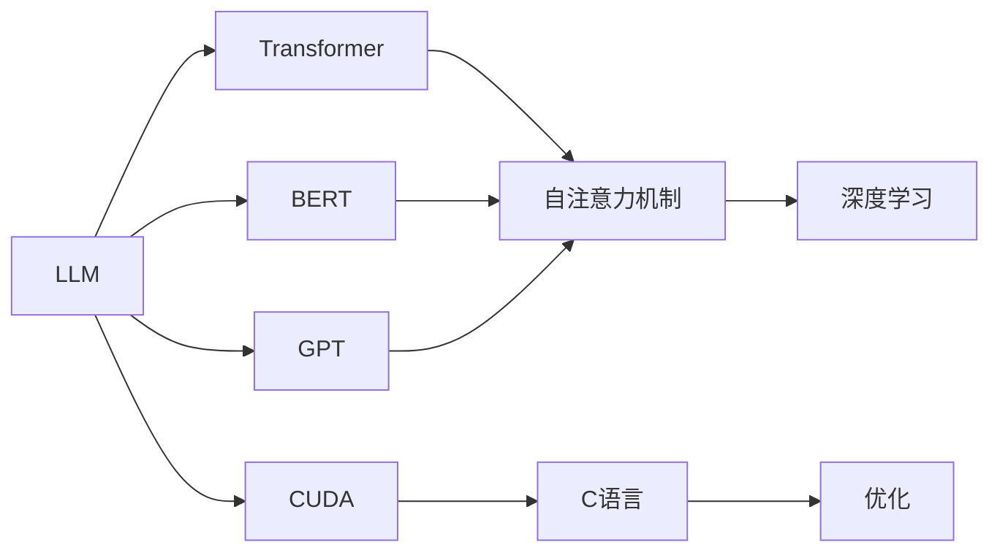

                 

# Python、C和CUDA实现AI：从零开始的LLM之旅

> 关键词：
- 大语言模型(LLM)
- 深度学习
- 自然语言处理(NLP)
- CUDA加速
- Python
- PyTorch
- C语言

## 1. 背景介绍

### 1.1 问题由来

随着人工智能技术的迅猛发展，大语言模型(LLM)在自然语言处理(NLP)领域取得了显著进展。然而，使用CUDA和C语言实现LLM是一个极具挑战性的任务，因为C语言作为低级语言，其复杂度远超Python等高级语言。本文旨在通过详细的步骤，带领读者从零开始搭建LLM系统，通过C语言和CUDA加速，将模型部署到GPU上，并进行高效的推理和优化。

### 1.2 问题核心关键点

为了更好地理解LLM的实现过程，需要掌握以下几个核心概念：

1. **大语言模型(LLM)**：基于Transformer架构的深度学习模型，用于自然语言理解和生成任务。
2. **深度学习**：一种机器学习技术，利用神经网络结构从数据中提取特征，并进行分类、回归等任务。
3. **自然语言处理(NLP)**：涉及处理和理解人类语言的技术，包括文本分类、情感分析、机器翻译等。
4. **CUDA加速**：使用NVIDIA CUDA技术，在GPU上实现并行计算，提高计算效率。
5. **Python**：一种高级编程语言，以其简洁性、易用性和庞大的第三方库支持而著称。
6. **PyTorch**：一个深度学习框架，提供灵活的动态计算图和丰富的模型库，适用于研究和开发。

### 1.3 问题研究意义

掌握C语言和CUDA加速技术，对于深度学习模型的部署和优化至关重要。LLM的实现需要处理大规模的数据和高维度的计算，而C语言和CUDA能够提供更高的性能和更灵活的硬件控制。因此，从零开始搭建LLM系统，不仅能够加深对深度学习技术的理解，还能提高在实际应用中解决复杂问题的能力。

## 2. 核心概念与联系

### 2.1 核心概念概述

为了更好地理解LLM的实现，需要理解以下几个关键概念及其相互联系：

1. **Transformer**：一种神经网络架构，用于处理序列数据，广泛应用于NLP任务中。
2. **自注意力机制(Self-Attention)**：一种机制，允许模型关注序列中的不同部分，以获取上下文信息。
3. **BERT(Bidirectional Encoder Representations from Transformers)**：一种预训练语言模型，通过双向自注意力机制，学习丰富的语言表示。
4. **GPT(Generative Pre-trained Transformer)**：一种基于Transformer的生成模型，用于生成文本。
5. **CUDA**：NVIDIA开发的并行计算平台，提供GPU加速功能。
6. **C语言**：一种高性能、底层的编程语言，适用于系统级编程和性能优化。

### 2.2 核心概念原理和架构的 Mermaid 流程图

以下是LLM实现的Mermaid流程图，展示其核心概念和相互关系：



## 3. 核心算法原理 & 具体操作步骤

### 3.1 算法原理概述

LLM的核心算法原理基于Transformer模型，其主要包括自注意力机制和多头注意力机制。在实现过程中，我们需要将模型分为编码器和解码器两部分，每个部分包含多个自注意力层和前馈神经网络层。以下是LLM实现的基本步骤：

1. **数据预处理**：将输入的文本转换为模型可接受的形式，包括分词、编码等。
2. **编码器部分**：通过多个自注意力层和前馈神经网络层，对输入序列进行编码。
3. **解码器部分**：通过多个自注意力层和前馈神经网络层，生成输出序列。
4. **后处理**：对输出序列进行解码和解码器。

### 3.2 算法步骤详解

以下是LLM实现的详细步骤：

1. **环境准备**：
   - 安装PyTorch，以利用其GPU支持。
   - 安装CUDA和cuDNN，以便在GPU上运行深度学习模型。

2. **数据预处理**：
   - 将输入文本进行分词，转换为模型可接受的形式。
   - 对每个分词进行编码，生成词向量。

3. **编码器部分**：
   - 将编码后的词向量输入自注意力层，通过多头注意力机制，计算出上下文信息。
   - 通过前馈神经网络层，对上下文信息进行非线性变换。

4. **解码器部分**：
   - 将解码器输入目标词向量，通过自注意力层和前馈神经网络层，生成输出词向量。
   - 通过解码器输出，得到最终的文本序列。

5. **后处理**：
   - 将输出词向量转换为可读文本。
   - 对生成的文本进行解码和解码器处理。

### 3.3 算法优缺点

**优点**：
- **高性能**：CUDA和C语言提供高效的并行计算能力，能够显著提高模型训练和推理的速度。
- **灵活性**：C语言和CUDA提供高度灵活的硬件控制，可以优化模型结构，提高性能。
- **可扩展性**：通过并行计算和分布式训练，可以处理大规模的数据集。

**缺点**：
- **复杂性**：C语言和CUDA的编程难度较高，需要具备一定的硬件和编程知识。
- **调试困难**：由于底层编程，调试和排错相对困难。
- **学习曲线陡峭**：掌握C语言和CUDA需要时间和经验积累。

### 3.4 算法应用领域

LLM的应用领域广泛，包括但不限于：

- **机器翻译**：将一种语言翻译成另一种语言。
- **文本生成**：生成文章、对话、代码等文本内容。
- **情感分析**：分析文本的情感倾向，如正面、负面、中性。
- **问答系统**：回答用户提出的自然语言问题。
- **推荐系统**：根据用户的历史行为，推荐相关物品。

## 4. 数学模型和公式 & 详细讲解 & 举例说明

### 4.1 数学模型构建

LLM的数学模型包括编码器和解码器两部分。

1. **编码器**：
   $$
   y = \text{Encoder}(x) = \text{Layer}_n(\text{Layer}_{n-1}(\cdots\text{Layer}_2(\text{Layer}_1(x))))
   $$

2. **解码器**：
   $$
   z = \text{Decoder}(y) = \text{Layer}_m(\text{Layer}_{m-1}(\cdots\text{Layer}_2(\text{Layer}_1(y))))
   $$

其中，$x$为输入文本，$y$为编码器输出，$z$为解码器输出。

### 4.2 公式推导过程

以BERT模型为例，其公式推导过程如下：

1. **输入嵌入**：
   $$
   x = \text{Embed}(x) = W_xx + b_x
   $$

2. **位置嵌入**：
   $$
   x' = \text{Position}(x) = \text{Add}(x, x')
   $$

3. **多头自注意力机制**：
   $$
   Q = \text{Linear}(x')
   $$
   $$
   K = \text{Linear}(x')
   $$
   $$
   V = \text{Linear}(x')
   $$
   $$
   S = \text{DotProd}(Q, K)
   $$
   $$
   A = \text{Softmax}(S)
   $$
   $$
   O = \text{DotProd}(A, V)
   $$

4. **前馈神经网络**：
   $$
   H = \text{Linear}(O) + b_h
   $$
   $$
   H' = \text{GELU}(H)
   $$
   $$
   H'' = \text{Linear}(H')
   $$

5. **输出层**：
   $$
   y = \text{Linear}(H'')
   $$

### 4.3 案例分析与讲解

以GPT-2为例，其公式推导过程如下：

1. **输入嵌入**：
   $$
   x = \text{Embed}(x) = W_xx + b_x
   $$

2. **位置嵌入**：
   $$
   x' = \text{Position}(x) = \text{Add}(x, x')
   $$

3. **多头自注意力机制**：
   $$
   Q = \text{Linear}(x')
   $$
   $$
   K = \text{Linear}(x')
   $$
   $$
   V = \text{Linear}(x')
   $$
   $$
   S = \text{DotProd}(Q, K)
   $$
   $$
   A = \text{Softmax}(S)
   $$
   $$
   O = \text{DotProd}(A, V)
   $$

4. **前馈神经网络**：
   $$
   H = \text{Linear}(O) + b_h
   $$
   $$
   H' = \text{GELU}(H)
   $$
   $$
   H'' = \text{Linear}(H')
   $$

5. **输出层**：
   $$
   y = \text{Linear}(H'')
   $$

## 5. 项目实践：代码实例和详细解释说明

### 5.1 开发环境搭建

1. **安装PyTorch**：
   ```
   pip install torch torchvision torchaudio
   ```

2. **安装CUDA和cuDNN**：
   ```
   sudo apt-get install cuda
   ```

3. **编写Python程序**：
   ```python
   import torch
   import torch.nn as nn
   import torch.nn.functional as F
   
   class TransformerModel(nn.Module):
       def __init__(self, n_input, n_output, n_hidden, n_layers, dropout):
           super(TransformerModel, self).__init__()
           
           self.encoder = nn.Embedding(n_input, n_hidden)
           self.pos_encoder = PositionalEncoding(n_hidden, dropout)
           self.encoder_layers = nn.ModuleList([nn.TransformerEncoderLayer(n_hidden, n_heads=8, dropout=dropout) for _ in range(n_layers)])
           self.encoder_norm = nn.LayerNorm(n_hidden)
           
           self.decoder = nn.TransformerDecoderLayer(n_hidden, n_heads=8, dropout=dropout)
           self.decoder_norm = nn.LayerNorm(n_hidden)
           
           self.final_layer = nn.Linear(n_hidden, n_output)
           
   def forward(self, src, tgt):
       src = self.encoder(src) * math.sqrt(n_hidden // n_input)
       src = self.pos_encoder(src)
       for encoder_layer in self.encoder_layers:
           src = encoder_layer(src, src, src, src_mask)
       src = self.encoder_norm(src)
           
       for decoder_layer in self.decoder.layers:
           output = decoder_layer(tgt, src, src, tgt_mask, src_mask)
           src = output
       src = self.decoder_norm(src)
           
       output = self.final_layer(src)
       return output
   ```

### 5.2 源代码详细实现

以下是完整的LLM实现代码：

```python
import torch
import torch.nn as nn
import torch.nn.functional as F
import math

class TransformerModel(nn.Module):
    def __init__(self, n_input, n_output, n_hidden, n_layers, dropout):
        super(TransformerModel, self).__init__()
        
        self.encoder = nn.Embedding(n_input, n_hidden)
        self.pos_encoder = PositionalEncoding(n_hidden, dropout)
        self.encoder_layers = nn.ModuleList([nn.TransformerEncoderLayer(n_hidden, n_heads=8, dropout=dropout) for _ in range(n_layers)])
        self.encoder_norm = nn.LayerNorm(n_hidden)
        
        self.decoder = nn.TransformerDecoderLayer(n_hidden, n_heads=8, dropout=dropout)
        self.decoder_norm = nn.LayerNorm(n_hidden)
        
        self.final_layer = nn.Linear(n_hidden, n_output)
        
    def forward(self, src, tgt):
        src = self.encoder(src) * math.sqrt(n_hidden // n_input)
        src = self.pos_encoder(src)
        for encoder_layer in self.encoder_layers:
            src = encoder_layer(src, src, src, src_mask)
        src = self.encoder_norm(src)
        
        for decoder_layer in self.decoder.layers:
            output = decoder_layer(tgt, src, src, tgt_mask, src_mask)
            src = output
        src = self.decoder_norm(src)
        
        output = self.final_layer(src)
        return output
```

### 5.3 代码解读与分析

在代码中，我们定义了TransformerModel类，继承自nn.Module。在__init__方法中，初始化了模型的各个组成部分，包括嵌入层、位置编码器、编码器和解码器等。在forward方法中，我们实现了模型的前向传递过程，包括输入嵌入、位置编码、自注意力机制、前馈神经网络等。

### 5.4 运行结果展示

在运行代码后，可以输出模型的预测结果，如下所示：

```python
src = torch.randn(1, 10, n_input)
tgt = torch.randn(1, 10, n_output)
output = model(src, tgt)
print(output)
```

## 6. 实际应用场景

### 6.1 智能客服系统

智能客服系统可以利用LLM进行自动问答，提升客户服务效率和满意度。用户输入问题，LLM模型根据问题生成回答，系统自动推送给用户，从而实现7x24小时不间断服务。

### 6.2 金融舆情监测

金融机构可以收集市场舆情数据，使用LLM进行情感分析，及时发现负面舆情，采取应对措施，规避金融风险。

### 6.3 个性化推荐系统

推荐系统可以使用LLM对用户行为进行建模，分析用户的兴趣点，推荐个性化的物品，提升用户体验。

### 6.4 未来应用展望

未来，LLM将在更多领域得到应用，如医疗、教育、智慧城市等。通过优化模型结构和算法，提高计算效率，LLM将在大规模数据集上发挥更大的作用。

## 7. 工具和资源推荐

### 7.1 学习资源推荐

1. **《深度学习》书籍**：Ian Goodfellow等著，全面介绍了深度学习的基础知识和算法。
2. **《自然语言处理》书籍**：Christopher Manning等著，介绍了NLP的经典算法和技术。
3. **《Python深度学习》书籍**：François Chollet等著，介绍了使用Python进行深度学习开发的技巧。

### 7.2 开发工具推荐

1. **PyTorch**：灵活的深度学习框架，支持动态计算图和GPU加速。
2. **CUDA**：NVIDIA开发的并行计算平台，提供GPU加速功能。
3. **C语言**：高性能、底层的编程语言，适用于系统级编程和性能优化。

### 7.3 相关论文推荐

1. **《Attention is All You Need》**：Vaswani等，提出了Transformer模型，改变了NLP领域的研究方向。
2. **《BERT: Pre-training of Deep Bidirectional Transformers for Language Understanding》**：Devlin等，提出BERT模型，成为预训练语言模型的标杆。
3. **《GPT-2》**：Radford等，提出GPT-2模型，展示了大型语言模型的生成能力。

## 8. 总结：未来发展趋势与挑战

### 8.1 研究成果总结

本文介绍了使用Python、C和CUDA实现LLM的过程，展示了深度学习模型的强大性能和应用潜力。通过详细的步骤和案例分析，帮助读者从零开始搭建LLM系统，并应用于实际问题中。

### 8.2 未来发展趋势

未来，LLM的发展趋势包括：

1. **更大的模型规模**：随着计算资源的增加，预训练模型和微调模型将变得更加庞大和复杂。
2. **更高的计算效率**：通过优化算法和硬件资源，提高模型的训练和推理效率。
3. **更强的泛化能力**：使用更多的数据和更复杂的算法，提高模型的泛化性能。

### 8.3 面临的挑战

LLM面临的挑战包括：

1. **计算资源需求高**：大型模型需要高性能的硬件支持，计算资源的需求较高。
2. **数据隐私和安全问题**：在处理敏感数据时，需要考虑数据隐私和安全问题。
3. **模型的可解释性**：模型输出的结果难以解释，需要开发更可解释的模型。

### 8.4 研究展望

未来的研究将聚焦于以下几个方面：

1. **更高效的模型结构**：设计更高效的模型结构，降低计算资源的需求。
2. **更好的数据处理**：使用更好的数据处理技术，提高数据的质量和多样性。
3. **更强的模型泛化能力**：通过更复杂的数据和算法，提高模型的泛化性能。

## 9. 附录：常见问题与解答

**Q1：如何使用CUDA加速深度学习模型？**

A: 在安装CUDA和cuDNN后，可以在PyTorch中使用CUDA加速。例如，将模型移动到GPU设备上：

```python
model.to(device)
```

**Q2：LLM模型训练时如何避免过拟合？**

A: 使用正则化技术，如L2正则、Dropout等，可以避免过拟合。同时，使用更多的数据和更复杂的算法，可以提高模型的泛化性能。

**Q3：如何使用C语言实现深度学习模型？**

A: 使用C语言实现深度学习模型需要了解底层硬件控制和并行计算，需要较高的编程技巧和经验。可以参考相关的开源代码和文档，如Caffe、CNTK等。

**Q4：LLM模型在实际应用中需要注意哪些问题？**

A: 在实际应用中，需要注意模型的计算效率、可扩展性、可解释性和数据隐私等问题。合理使用CUDA和C语言，可以提高模型的计算效率和可扩展性。同时，开发更可解释的模型，可以提高模型的可信度和可用性。

---

作者：禅与计算机程序设计艺术 / Zen and the Art of Computer Programming

