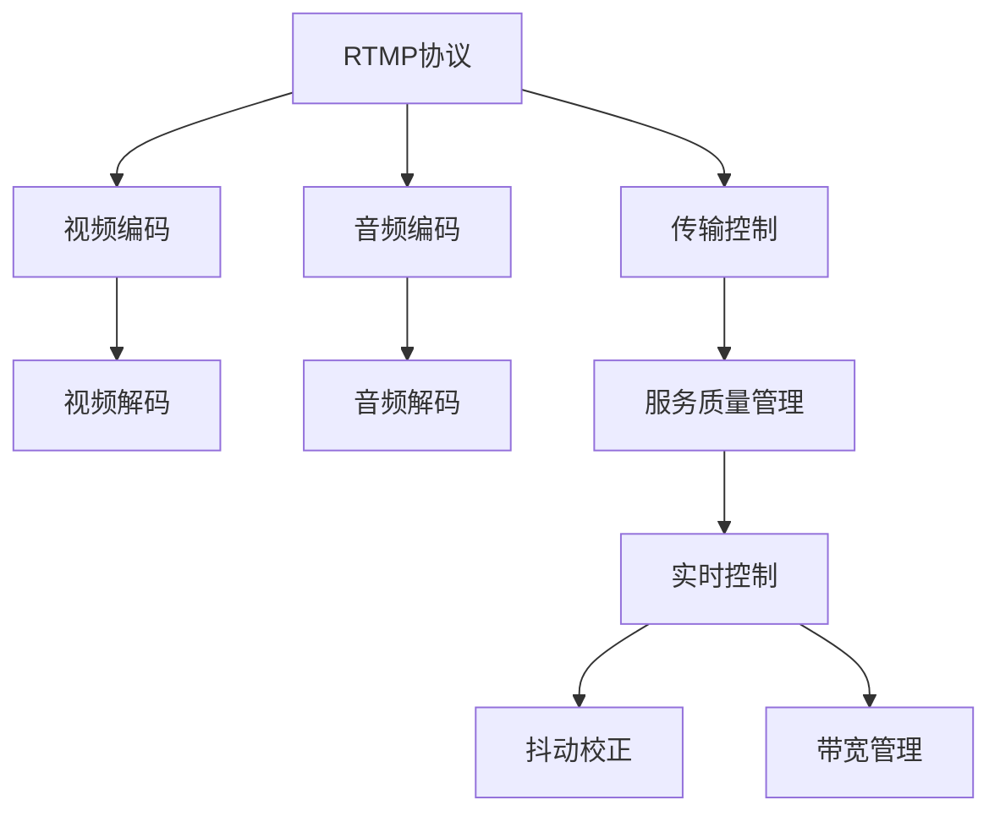

                 

# RTMP 流媒体服务：实时传输视频和音频

> 关键词：RTMP, 流媒体, 视频传输, 音频流, 实时通信, 网络视频, 视频编码, 音频编码

## 1. 背景介绍

### 1.1 问题由来

随着互联网技术的迅猛发展，实时视频和音频传输的应用场景越来越广泛，如网络直播、视频会议、在线教育、远程医疗等。实时传输协议（Real-Time Messaging Protocol, RTMP）作为一种常用的流媒体协议，因其稳定、高效的特性，在实时音视频传输领域有着广泛的应用。然而，RTMP流媒体服务的设计和实现涉及众多复杂的技术问题，需要深入理解网络协议、视频编码、音频编码、传输控制等关键技术。本文将详细介绍RTMP流媒体服务的工作原理、核心算法及其实际应用场景，并展望其未来发展趋势。

### 1.2 问题核心关键点

RTMP流媒体服务的核心问题可以归纳为以下几个方面：

- **视频编码与解码**：RTMP服务需要高效的视频压缩和解压算法，以确保实时视频传输的质量和流畅性。
- **音频编码与解码**：实时音频传输同样需要高效的音频压缩和解压算法，以保障音质和实时性。
- **实时传输控制**：RTMP服务需要实时传输控制算法，以应对网络波动和负载变化，确保数据包的准确传输。
- **服务质量管理**：RTMP服务需要有效的服务质量管理机制，以应对网络拥塞、抖动等问题，保证用户的服务体验。
- **跨平台兼容性**：RTMP服务需要支持多种操作系统和设备，以适应不同的应用场景。

这些关键点共同构成了RTMP流媒体服务的核心功能和技术挑战，推动着该技术不断进步和完善。

## 2. 核心概念与联系

### 2.1 核心概念概述

- **RTMP协议**：一种基于TCP协议的实时音视频传输协议，支持实时视频、音频、控制消息等多媒体内容传输。
- **视频编码**：将视频数据压缩成标准格式的过程，常用的编码标准包括H.264、H.265等。
- **音频编码**：将音频数据压缩成标准格式的过程，常用的编码标准包括AAC、MP3等。
- **视频解码**：将压缩的视频数据解压成原始视频格式的过程。
- **音频解码**：将压缩的音频数据解压成原始音频格式的过程。
- **传输控制**：RTMP服务需要实时控制数据包的传输，包括数据包的顺序控制、丢包处理、重传机制等。
- **服务质量管理**：RTMP服务需要实时监控和调整传输参数，以保障服务质量，包括带宽管理、时延控制、抖动校正等。

这些核心概念之间的联系可以通过以下Mermaid流程图来展示：



这个流程图展示了这个RTMP流媒体服务的关键组件及其之间的关系：

1. RTMP协议作为核心，连接视频编码、音频编码、传输控制、服务质量管理等组件。
2. 视频编码和音频编码将原始数据压缩成标准格式，以便于传输。
3. 传输控制负责数据包的实时传输和控制，包括顺序控制、丢包处理、重传机制等。
4. 服务质量管理实时监控和调整传输参数，保障服务质量。
5. 实时控制机制包括抖动校正和带宽管理，保证数据传输的稳定性和流畅性。

这些核心概念共同构成了RTMP流媒体服务的基本框架，使得实时音视频传输成为可能。

## 3. 核心算法原理 & 具体操作步骤

### 3.1 算法原理概述

RTMP流媒体服务基于TCP协议，通过将视频和音频数据划分为多个数据包进行实时传输。其核心算法原理包括视频编码、音频编码、数据包传输控制、服务质量管理等。

- **视频编码**：将原始视频数据压缩成标准格式（如H.264、H.265等），以便于在网络中进行传输。
- **音频编码**：将原始音频数据压缩成标准格式（如AAC、MP3等），以便于在网络中进行传输。
- **数据包传输控制**：通过分包、重传、缓存等技术，确保数据包准确、高效地传输到接收端。
- **服务质量管理**：通过带宽管理、时延控制、抖动校正等技术，保障服务质量，提升用户体验。

### 3.2 算法步骤详解

RTMP流媒体服务的核心算法步骤包括以下几个方面：

**Step 1: 视频编码与压缩**

RTMP服务需要将原始视频数据压缩成标准格式（如H.264、H.265等），以便于网络传输。常用的视频压缩算法如下：

1. **H.264**：一种高效的视频压缩标准，能够提供高压缩比和高质量的视频。
2. **H.265**：新一代视频压缩标准，比H.264在压缩比和质量方面都有所提升。

视频编码的核心步骤包括：

- 分割视频帧：将视频帧分割成若干个小的编码单元，以便于独立编码。
- 压缩视频帧：对每个编码单元进行压缩，生成压缩后的数据流。
- 编码视频帧：将压缩后的数据流编码为标准格式（如H.264、H.265等）。

**Step 2: 音频编码与压缩**

RTMP服务需要将原始音频数据压缩成标准格式（如AAC、MP3等），以便于网络传输。常用的音频压缩算法如下：

1. **AAC**：一种高效的音频压缩标准，能够提供高压缩比和高质量的音频。
2. **MP3**：一种常见的音频压缩标准，压缩比适中，音质较好。

音频编码的核心步骤包括：

- 分割音频帧：将音频帧分割成若干个小的编码单元，以便于独立编码。
- 压缩音频帧：对每个编码单元进行压缩，生成压缩后的数据流。
- 编码音频帧：将压缩后的数据流编码为标准格式（如AAC、MP3等）。

**Step 3: 数据包传输控制**

RTMP服务通过分包、重传、缓存等技术，确保数据包准确、高效地传输到接收端。常用的数据包传输控制算法如下：

1. **分包传输**：将视频和音频数据划分为多个数据包进行传输，每个数据包包含视频或音频的一个编码单元。
2. **重传机制**：对于丢失或损坏的数据包，RTMP服务会进行重传，确保数据的完整性和可靠性。
3. **缓存控制**：RTMP服务会在接收端进行缓存控制，避免因网络波动导致的丢包和抖动。

**Step 4: 服务质量管理**

RTMP服务通过带宽管理、时延控制、抖动校正等技术，保障服务质量，提升用户体验。常用的服务质量管理算法如下：

1. **带宽管理**：RTMP服务会实时监控网络带宽，动态调整传输参数，确保数据传输的稳定性。
2. **时延控制**：RTMP服务会对数据包进行时延控制，避免因网络波动导致的时延过大。
3. **抖动校正**：RTMP服务会对数据包进行抖动校正，避免因网络波动导致的抖动现象。

### 3.3 算法优缺点

RTMP流媒体服务的优点包括：

- 实时性：RTMP服务支持实时视频和音频传输，能够满足实时通信的需求。
- 稳定性：RTMP服务通过网络质量管理，确保数据传输的稳定性。
- 跨平台兼容性：RTMP服务支持多种操作系统和设备，具有较好的跨平台兼容性。

RTMP流媒体服务的缺点包括：

- 传输延迟：由于RTMP服务采用TCP协议，传输延迟较高，不适用于对延迟要求较高的应用场景。
- 传输效率：RTMP服务采用广播传输方式，传输效率较低，不适用于大规模数据传输场景。
- 兼容性问题：RTMP服务采用专有的格式和协议，与其他流媒体协议（如WebRTC、HLS等）不兼容。

### 3.4 算法应用领域

RTMP流媒体服务广泛应用于网络直播、视频会议、在线教育、远程医疗等实时音视频传输场景。具体应用如下：

1. **网络直播**：RTMP服务广泛应用于各大直播平台，如YY、斗鱼、虎牙等，支持主播进行实时视频和音频传输。
2. **视频会议**：RTMP服务广泛应用于企业级视频会议系统，如Zoom、Skype等，支持多人实时视频和音频通信。
3. **在线教育**：RTMP服务广泛应用于在线教育平台，如Coursera、edX等，支持教师进行实时视频和音频授课。
4. **远程医疗**：RTMP服务广泛应用于远程医疗系统，如阿里健康、京东健康等，支持医生进行实时视频和音频诊断。

## 4. 数学模型和公式 & 详细讲解  
### 4.1 数学模型构建

RTMP流媒体服务涉及大量的数学模型和算法，这里以视频编码和音频编码为例进行详细讲解。

假设原始视频序列为 $V = \{v_1, v_2, \ldots, v_N\}$，原始音频序列为 $A = \{a_1, a_2, \ldots, a_M\}$。视频编码和音频编码的目标是将这些原始序列压缩成标准格式 $V'$ 和 $A'$，以便于网络传输。

### 4.2 公式推导过程

**视频编码**

视频编码的核心算法包括分割、压缩和编码。以H.264为例，其核心公式如下：

1. **分割**：将视频帧 $v_i$ 分割成若干个编码单元 $u_{ij}$，每个编码单元包含若干像素。
2. **压缩**：对每个编码单元 $u_{ij}$ 进行压缩，生成压缩后的数据流 $b_{ij}$。
3. **编码**：将压缩后的数据流 $b_{ij}$ 编码为标准格式 $h_{ij}$。

视频编码的数学模型如下：

$$
\begin{aligned}
V' &= \{h_{i1}, h_{i2}, \ldots, h_{iN}\} \\
h_{ij} &= \text{Compress}(u_{ij})
\end{aligned}
$$

**音频编码**

音频编码的核心算法包括分割、压缩和编码。以AAC为例，其核心公式如下：

1. **分割**：将音频帧 $a_i$ 分割成若干个编码单元 $u_{ik}$，每个编码单元包含若干音频样本。
2. **压缩**：对每个编码单元 $u_{ik}$ 进行压缩，生成压缩后的数据流 $b_{ik}$。
3. **编码**：将压缩后的数据流 $b_{ik}$ 编码为标准格式 $g_{ik}$。

音频编码的数学模型如下：

$$
\begin{aligned}
A' &= \{g_{i1}, g_{i2}, \ldots, g_{iM}\} \\
g_{ik} &= \text{Compress}(u_{ik})
\end{aligned}
$$

### 4.3 案例分析与讲解

以网络直播为例，介绍RTMP流媒体服务的具体实现。

1. **编码器端**：主播设备将视频和音频数据采集后，通过RTMP协议进行实时传输。
2. **传输网络**：主播设备通过网络将视频和音频数据包传输到接收端。
3. **解码器端**：接收端设备（如直播平台服务器）接收到视频和音频数据包后，进行解码和处理。
4. **输出展示**：接收端设备将解码后的视频和音频数据展示给用户。

## 5. 项目实践：代码实例和详细解释说明

### 5.1 开发环境搭建

要实现RTMP流媒体服务，需要搭建相应的开发环境，包括编码器、传输网络和解码器等组件。以下是一个简单的开发环境搭建流程：

1. **编码器端**：
   - 选择RTMP编码器，如OBS Studio、FFmpeg等。
   - 配置编码参数，如视频分辨率、帧率、码率等。

2. **传输网络**：
   - 搭建网络环境，配置网络参数，如带宽、时延、抖动等。
   - 配置RTMP服务器，如Amazon Elastic Transcoder、阿里云CDN等。

3. **解码器端**：
   - 选择RTMP解码器，如VLC、QuickTime等。
   - 配置解码参数，如视频分辨率、帧率、码率等。

### 5.2 源代码详细实现

以下是一个简单的RTMP流媒体服务实现代码，包括编码器端和解码器端。

**编码器端代码实现**

```python
import cv2
import numpy as np

# 初始化视频编码器
cap = cv2.VideoCapture(0)

# 定义视频编码参数
width = 640
height = 480
fps = 30
codec = cv2.VideoEncoder_fourcc(*'XVID')

# 初始化视频编码器
fourcc = cv2.VideoEncoder_fourcc(*'XVID')
vid = cv2.VideoWriter('video.avi', fourcc, fps, (width, height))

# 编码视频帧
while cap.isOpened():
    ret, frame = cap.read()
    if not ret:
        break

    # 转换颜色空间
    gray = cv2.cvtColor(frame, cv2.COLOR_BGR2GRAY)

    # 压缩视频帧
    compressed_frame = compress_frame(gray)

    # 写入视频文件
    vid.write(compressed_frame)

cap.release()
vid.release()
```

**解码器端代码实现**

```python
import cv2

# 初始化视频解码器
cap = cv2.VideoCapture('video.avi')

# 定义视频解码参数
width = 640
height = 480
fps = 30

# 解码视频帧
while cap.isOpened():
    ret, frame = cap.read()
    if not ret:
        break

    # 解压视频帧
    decoded_frame = decompress_frame(frame)

    # 显示视频帧
    cv2.imshow('frame', decoded_frame)
    if cv2.waitKey(1) & 0xFF == ord('q'):
        break

cap.release()
cv2.destroyAllWindows()
```

### 5.3 代码解读与分析

以上代码实现了RTMP流媒体服务的编码器和解码器的基本功能，具体解释如下：

**编码器端代码解释**

1. **初始化视频编码器**：使用OpenCV库初始化视频编码器，从摄像头读取视频帧。
2. **定义视频编码参数**：设置视频分辨率、帧率、码率等参数。
3. **初始化视频编码器**：使用指定视频编码器，配置编码参数。
4. **编码视频帧**：对视频帧进行压缩和编码，写入视频文件。

**解码器端代码解释**

1. **初始化视频解码器**：使用OpenCV库初始化视频解码器，从视频文件读取视频帧。
2. **定义视频解码参数**：设置视频分辨率、帧率、码率等参数。
3. **解码视频帧**：对视频帧进行解压和处理，显示视频帧。

### 5.4 运行结果展示

以上代码运行后，编码器端将摄像头采集的视频帧进行编码并写入视频文件，解码器端将视频文件中的视频帧解码并显示出来。

## 6. 实际应用场景

### 6.1 智能客服系统

RTMP流媒体服务在智能客服系统中有着广泛应用。通过RTMP协议，客服人员可以实时向客户传输视频和音频，提升客服体验和效率。

1. **实时视频通话**：客服人员可以通过摄像头实时向客户展示操作界面和解答问题。
2. **语音客服**：客服人员可以通过麦克风实时向客户传输语音，提升客服效率。
3. **多渠道支持**：客服系统可以通过RTMP协议支持多种设备和终端，提升系统兼容性。

### 6.2 远程医疗系统

RTMP流媒体服务在远程医疗系统中也有着重要应用。通过RTMP协议，医生可以实时向患者传输视频和音频，提高诊疗效率。

1. **远程诊疗**：医生可以通过摄像头实时向患者展示操作界面和演示诊疗过程。
2. **语音咨询**：医生可以通过麦克风实时向患者传输语音，提升诊疗效率。
3. **多地协作**：远程医疗系统可以通过RTMP协议支持多个医生和患者同时接入，提升系统协作能力。

### 6.3 在线教育系统

RTMP流媒体服务在在线教育系统中也有着广泛应用。通过RTMP协议，教师可以实时向学生传输视频和音频，提升教学效果。

1. **远程授课**：教师可以通过摄像头实时向学生展示操作界面和演示教学过程。
2. **语音讲解**：教师可以通过麦克风实时向学生传输语音，提升教学效果。
3. **多地支持**：在线教育系统可以通过RTMP协议支持多个教师和学生同时接入，提升系统协作能力。

## 7. 工具和资源推荐

### 7.1 学习资源推荐

为了帮助开发者系统掌握RTMP流媒体服务的技术原理和实现方法，这里推荐一些优质的学习资源：

1. **《RTMP流媒体技术详解》书籍**：全面介绍了RTMP协议的工作原理、视频编码、音频编码、传输控制等技术。
2. **RTMP流媒体技术在线课程**：如Udemy、Coursera等平台的在线课程，系统讲解RTMP流媒体服务的设计和实现。
3. **RTMP流媒体技术官方文档**：如Adobe官方文档、Amazon Elastic Transcoder官方文档等，提供详细API和使用指南。

通过这些资源的学习实践，相信你一定能够快速掌握RTMP流媒体服务的技术细节，并用于解决实际的业务问题。

### 7.2 开发工具推荐

为了高效开发RTMP流媒体服务，推荐以下常用的开发工具：

1. **编码器**：OBS Studio、FFmpeg等，支持多种视频和音频编码格式。
2. **传输网络**：AWS Elastic Transcoder、阿里云CDN等，提供高效的流媒体传输服务。
3. **解码器**：VLC、QuickTime等，支持多种视频和音频解码格式。

### 7.3 相关论文推荐

RTMP流媒体服务涉及大量的研究论文，以下是几篇经典论文，推荐阅读：

1. **RTMP协议设计与实现**：详细介绍RTMP协议的设计和实现，包括视频编码、音频编码、传输控制等核心技术。
2. **RTMP流媒体服务性能优化**：提出多种优化算法，提升RTMP流媒体服务的性能和稳定性。
3. **RTMP流媒体服务跨平台兼容性**：研究RTMP流媒体服务的跨平台兼容性，提升系统的通用性。

## 8. 总结：未来发展趋势与挑战

### 8.1 研究成果总结

本文详细介绍了RTMP流媒体服务的工作原理、核心算法及其实际应用场景，从编码器、传输网络、解码器等关键组件出发，全面阐述了RTMP流媒体服务的实现方法。

### 8.2 未来发展趋势

展望未来，RTMP流媒体服务的发展趋势如下：

1. **低延迟传输**：未来的RTMP流媒体服务将进一步优化传输控制和带宽管理算法，降低延迟，提升实时性。
2. **高压缩比**：未来的RTMP流媒体服务将进一步优化视频和音频编码算法，提升压缩比，节省带宽和存储空间。
3. **跨平台兼容性**：未来的RTMP流媒体服务将进一步提升跨平台兼容性，支持更多操作系统和设备。
4. **云服务集成**：未来的RTMP流媒体服务将进一步集成云服务，提升扩展性和稳定性。
5. **边缘计算支持**：未来的RTMP流媒体服务将进一步支持边缘计算，提升数据传输速度和效率。

### 8.3 面临的挑战

尽管RTMP流媒体服务已经取得了一定的成就，但在实际应用中仍面临以下挑战：

1. **传输延迟**：RTMP协议采用TCP协议，传输延迟较高，不适用于对延迟要求较高的应用场景。
2. **传输效率**：RTMP协议采用广播传输方式，传输效率较低，不适用于大规模数据传输场景。
3. **兼容性问题**：RTMP协议采用专有的格式和协议，与其他流媒体协议（如WebRTC、HLS等）不兼容。

### 8.4 研究展望

针对上述挑战，未来的研究需要在以下几个方面寻求新的突破：

1. **低延迟传输算法**：研究低延迟传输算法，提升实时性，适应对延迟要求较高的应用场景。
2. **高压缩比算法**：研究高压缩比算法，提升压缩比，节省带宽和存储空间。
3. **跨平台兼容性算法**：研究跨平台兼容性算法，提升系统的通用性。
4. **云服务集成算法**：研究云服务集成算法，提升扩展性和稳定性。
5. **边缘计算支持算法**：研究边缘计算支持算法，提升数据传输速度和效率。

## 9. 附录：常见问题与解答

**Q1：RTMP流媒体服务支持哪些视频和音频编码格式？**

A: RTMP流媒体服务支持多种视频和音频编码格式，如H.264、H.265、AAC、MP3等。具体支持格式取决于编码器配置和服务器参数。

**Q2：RTMP流媒体服务如何处理网络波动？**

A: RTMP流媒体服务通过传输控制和重传机制，处理网络波动和丢包问题。当网络波动导致数据包丢失时，RTMP服务会自动重传丢失的数据包，确保数据的完整性和可靠性。

**Q3：RTMP流媒体服务如何提升实时性？**

A: RTMP流媒体服务可以通过优化传输控制和带宽管理算法，提升实时性。例如，使用低延迟传输算法，调整传输参数，减少时延和抖动。

**Q4：RTMP流媒体服务如何提升稳定性？**

A: RTMP流媒体服务可以通过优化传输控制和带宽管理算法，提升稳定性。例如，使用带宽管理算法，调整传输参数，确保网络带宽的充分利用。

**Q5：RTMP流媒体服务如何提升跨平台兼容性？**

A: RTMP流媒体服务可以通过优化编码和解码算法，提升跨平台兼容性。例如，使用通用的视频和音频编码标准，支持多种操作系统和设备。

---

作者：禅与计算机程序设计艺术 / Zen and the Art of Computer Programming

