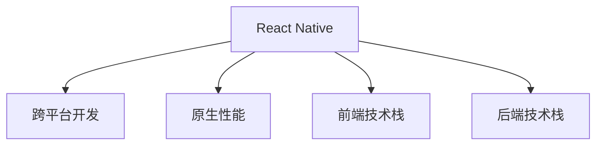

                 

# React Native 跨平台开发优势：高效构建多平台应用

> 关键词：React Native, 跨平台, 应用开发, 前端, 后端, 移动端, 前端技术, 移动应用, 跨平台框架, 原生性能

## 1. 背景介绍

随着互联网的迅猛发展，跨平台应用的需求日益增长。传统的混合应用开发方式虽然能够在一定程度上节省开发成本，但用户体验和性能仍难以满足用户需求。针对这一问题，React Native应运而生，它是一个基于React的跨平台框架，允许开发者使用JavaScript或TypeScript开发原生移动应用，从而在提升开发效率的同时，确保应用具备优秀的用户体验和性能。

### 1.1 问题由来
在互联网时代，企业需要快速推出跨平台应用以抢占市场先机，但传统的混合应用开发方式需要同时维护多个原生平台（iOS、Android、Web等），导致开发成本高、迭代周期长、维护复杂。如何高效地开发跨平台应用，同时兼顾不同平台的原生性能和用户体验，成为了企业开发人员面临的重要挑战。

### 1.2 问题核心关键点
React Native的出现，为解决上述问题提供了新的方向。通过使用React Native，开发者可以编写一次代码，同时适配iOS和Android等主流移动平台，极大地提升了开发效率和应用性能。同时，React Native还支持丰富的UI组件和库，允许开发者使用类似Web前端的方式进行开发，降低了开发门槛。

## 2. 核心概念与联系

### 2.1 核心概念概述

为了更好地理解React Native的原理和应用，本节将介绍几个关键概念及其相互联系：

- **React Native**：基于React的跨平台移动应用开发框架，使用JavaScript或TypeScript编写原生代码，支持iOS和Android等主流平台。
- **跨平台开发**：指开发一次代码，适配多个平台，如iOS、Android、Web等。
- **原生性能**：指应用在各自平台上运行时，能够达到与原生应用相同的性能表现。
- **前端技术栈**：包括HTML、CSS、JavaScript等，是跨平台应用开发的主要工具。
- **后端技术栈**：包括Node.js、Express等，用于提供跨平台应用的数据接口和服务器支持。

这些核心概念之间的逻辑关系可以通过以下Mermaid流程图来展示：



这个流程图展示了React Native的核心概念及其相互关系：

1. React Native是一种跨平台开发框架，能够高效地构建跨平台应用。
2. 使用React Native可以显著提升原生性能，同时保证不同平台上的用户体验一致。
3. React Native依托于前端技术栈和后端技术栈，能够灵活组合，实现多样化应用场景。

## 3. 核心算法原理 & 具体操作步骤
### 3.1 算法原理概述

React Native的核心算法原理是虚拟DOM和桥接器。虚拟DOM是React的核心概念，用于管理前端UI组件的更新，确保跨平台应用的一致性。桥接器是React Native的关键技术，用于在JavaScript和原生代码之间进行交互，实现性能和用户体验的优化。

React Native的虚拟DOM算法主要分为以下几个步骤：

1. 浏览器渲染树构建：通过JavaScript代码生成浏览器渲染树。
2. 虚拟DOM构建：将浏览器渲染树转换为虚拟DOM树，进行跨平台适配。
3. 虚拟DOM更新：当数据变化时，通过虚拟DOM更新算法重新构建虚拟DOM树，最终输出到原生平台上。

React Native的桥接器算法主要分为以下几个步骤：

1. JavaScript代码执行：在JavaScript环境执行代码，生成桥接器调用请求。
2. 桥接器处理：将请求转发给原生代码，处理并返回结果。
3. 原生代码执行：在原生代码环境执行请求，并返回处理结果。
4. 结果返回：将原生代码处理结果返回给JavaScript环境。

### 3.2 算法步骤详解

以下详细介绍React Native虚拟DOM和桥接器的具体实现步骤：

#### 虚拟DOM算法

1. **构建虚拟DOM树**：
   - 开发者在React Native中使用JavaScript代码定义UI组件。
   - 通过React Native的虚拟DOM构建器，将这些JavaScript代码转换为虚拟DOM树。
   - 虚拟DOM树是React Native的跨平台UI组件的抽象表示，能够适配iOS和Android等不同平台。

2. **虚拟DOM更新**：
   - 当数据变化时，React Native通过虚拟DOM更新算法重新构建虚拟DOM树。
   - 虚拟DOM更新算法比较新旧虚拟DOM树，找出需要更新的节点。
   - 将更新的节点进行跨平台适配，生成原生代码对应的更新请求。
   - 原生代码接收到更新请求后，执行相应的操作，并返回更新结果。
   - 虚拟DOM将原生代码的更新结果进行跨平台适配，最终输出到用户界面。

3. **性能优化**：
   - React Native通过虚拟DOM算法实现跨平台一致性，提升了应用的开发效率。
   - 虚拟DOM算法能够批量更新节点，减少渲染次数，提升了应用性能。

#### 桥接器算法

1. **JavaScript代码执行**：
   - 开发者在JavaScript环境中编写代码，调用React Native提供的API。
   - React Native将JavaScript代码转换为桥接器调用请求，并发送到原生代码环境。

2. **桥接器处理**：
   - 原生代码接收到桥接器调用请求后，进行处理并返回结果。
   - 桥接器将原生代码处理结果转换为JavaScript代码，返回给JavaScript环境。

3. **原生代码执行**：
   - 原生代码环境执行桥接器调用请求，生成处理结果。
   - 处理结果可以是界面渲染、网络请求等任何原生操作。

4. **结果返回**：
   - 桥接器将原生代码处理结果转换为JavaScript代码，返回给JavaScript环境。
   - 开发者在JavaScript环境中处理原生代码返回的结果，进行进一步操作。

### 3.3 算法优缺点

React Native虚拟DOM和桥接器算法具有以下优点：

- **跨平台一致性**：通过虚拟DOM算法，React Native能够实现跨平台一致性，确保在不同平台上的用户体验一致。
- **原生性能**：通过桥接器算法，React Native能够保证原生性能，实现与原生应用相同的性能表现。
- **开发效率高**：React Native依托于前端技术栈，允许开发者使用类似于Web前端的方式进行开发，降低了开发门槛，提高了开发效率。

同时，这些算法也存在一些缺点：

- **学习曲线陡峭**：由于涉及JavaScript和原生代码的交互，开发者需要熟悉React和原生平台的技术栈，学习曲线较陡峭。
- **性能消耗**：虚拟DOM和桥接器算法的实现增加了一定的性能消耗，对于部分复杂的UI组件和交互操作，性能可能不如原生应用。

### 3.4 算法应用领域

React Native的虚拟DOM和桥接器算法已经在多个应用领域得到了广泛应用，例如：

- **移动应用开发**：允许开发者使用JavaScript或TypeScript编写原生应用，支持iOS和Android等主流平台。
- **Web应用开发**：使用React Native的Web视图层，能够将React Native应用适配为Web应用，提升Web应用的性能和用户体验。
- **游戏开发**：支持游戏引擎和图形库，实现跨平台游戏开发。
- **物联网应用**：支持跨平台数据采集和控制，实现物联网应用的跨平台开发。

## 4. 数学模型和公式 & 详细讲解 & 举例说明

### 4.1 数学模型构建

React Native的核心数学模型主要涉及虚拟DOM的构建和更新算法，以及桥接器算法。以下详细介绍这些数学模型：

#### 虚拟DOM构建模型

假设开发者在React Native中定义了一个名为`MyComponent`的UI组件，其JavaScript代码如下：

```javascript
class MyComponent extends React.Component {
    render() {
        return (
            <View>
                <Text>Hello, World!</Text>
            </View>
        );
    }
}
```

在React Native中，通过虚拟DOM构建器将这段JavaScript代码转换为虚拟DOM树，生成如下的虚拟DOM节点：

```
{
    "type": "View",
    "props": {
        "children": [
            {
                "type": "Text",
                "props": {
                    "children": "Hello, World!"
                }
            }
        ]
    }
}
```

#### 虚拟DOM更新模型

假设在`MyComponent`组件的`Text`节点中更新了文本内容，生成新的虚拟DOM树如下：

```
{
    "type": "View",
    "props": {
        "children": [
            {
                "type": "Text",
                "props": {
                    "children": "React Native is awesome!"
                }
            }
        ]
    }
}
```

React Native通过虚拟DOM更新算法比较新旧虚拟DOM树，找出需要更新的节点。具体步骤如下：

1. 将新虚拟DOM树转换为桥接器调用请求，生成如下的请求：

```javascript
[
    {
        "type": "Text",
        "props": {
            "children": "React Native is awesome!"
        }
    }
]
```

2. 将桥接器调用请求发送到原生代码环境，进行更新操作。

3. 原生代码环境接收到更新请求后，生成相应的原生代码操作。例如，对于iOS平台，原生代码操作可能如下所示：

```swift
textLabel.text = "React Native is awesome!"
```

4. 原生代码执行上述操作，更新UI界面。

5. React Native将原生代码的更新结果进行跨平台适配，最终输出到用户界面。

#### 桥接器算法模型

假设开发者在React Native中使用JavaScript代码调用原生API进行网络请求，生成桥接器调用请求如下：

```javascript
fetch('https://api.example.com/data')
    .then(response => response.json())
    .then(data => console.log(data))
    .catch(error => console.error(error));
```

React Native将上述JavaScript代码转换为桥接器调用请求，生成如下的请求：

```javascript
[
    {
        "type": "fetch",
        "args": ["https://api.example.com/data"]
    }
]
```

原生代码接收到桥接器调用请求后，进行处理并返回结果。例如，对于iOS平台，原生代码操作可能如下所示：

```swift
try {
    let response = URLSession.shared.dataTask(for: url) { (data, response, error) in
        guard let data = data else { return }
        let json = try? JSONSerialization.jsonObject(with: data, options: [])
        print(json)
    }.resume()
} catch let error {
    print(error)
}
```

原生代码执行上述操作，获取网络数据。

React Native将原生代码处理结果进行跨平台适配，转换为JavaScript代码，返回给JavaScript环境。开发者在JavaScript环境中处理原生代码返回的结果，进行进一步操作。

### 4.2 公式推导过程

由于虚拟DOM和桥接器算法的实现较为复杂，以下将重点介绍虚拟DOM算法的数学模型。

假设React Native中的虚拟DOM树节点数为$n$，每次数据变化时需要更新的节点数为$m$，则虚拟DOM算法的计算复杂度为$O(mn)$。

具体来说，虚拟DOM算法主要包括以下步骤：

1. **虚拟DOM构建**：
   - 构建虚拟DOM树的时间复杂度为$O(n)$。

2. **虚拟DOM更新**：
   - 比较新旧虚拟DOM树的时间复杂度为$O(m)$。
   - 生成桥接器调用请求的时间复杂度为$O(m)$。
   - 将桥接器调用请求发送到原生代码环境的时间复杂度为$O(m)$。
   - 原生代码执行时间复杂度为$O(m)$。
   - 原生代码处理结果转换为JavaScript代码的时间复杂度为$O(m)$。
   - 返回JavaScript环境的时间复杂度为$O(m)$。

因此，虚拟DOM算法的总时间复杂度为$O(mn)$。

### 4.3 案例分析与讲解

以下以React Native中的`Text`组件为例，详细分析虚拟DOM和桥接器的具体实现。

假设开发者在React Native中使用JavaScript代码定义了一个`Text`组件，其代码如下：

```javascript
import React from 'react';
import { Text } from 'react-native';

class MyText extends React.Component {
    render() {
        return (
            <Text style={{ fontSize: 16, fontWeight: 'bold' }}>Hello, World!</Text>
        );
    }
}
```

在React Native中，通过虚拟DOM构建器将上述JavaScript代码转换为虚拟DOM树，生成如下的虚拟DOM节点：

```
{
    "type": "Text",
    "props": {
        "style": {
            "fontSize": 16,
            "fontWeight": "bold"
        },
        "children": "Hello, World!"
    }
}
```

当数据变化时，假设在`Text`组件的样式属性中更新了字体大小，生成新的虚拟DOM树如下：

```
{
    "type": "Text",
    "props": {
        "style": {
            "fontSize": 24,
            "fontWeight": "bold"
        },
        "children": "Hello, World!"
    }
}
```

React Native通过虚拟DOM更新算法比较新旧虚拟DOM树，找出需要更新的节点。具体步骤如下：

1. 将新虚拟DOM树转换为桥接器调用请求，生成如下的请求：

```javascript
[
    {
        "type": "Text",
        "props": {
            "style": {
                "fontSize": 24,
                "fontWeight": "bold"
            },
            "children": "Hello, World!"
        }
    }
]
```

2. 将桥接器调用请求发送到原生代码环境，进行更新操作。例如，对于iOS平台，原生代码操作可能如下所示：

```swift
textLabel.text = "Hello, World!"
textLabel.style.font = UIFont.boldSystemFont(ofSize: 24)
```

3. 原生代码执行上述操作，更新UI界面。

4. React Native将原生代码的更新结果进行跨平台适配，最终输出到用户界面。

## 5. 项目实践：代码实例和详细解释说明
### 5.1 开发环境搭建

在进行React Native项目开发前，需要安装和配置开发环境。以下是安装和配置React Native环境的详细步骤：

1. 安装Node.js和npm：从官网下载安装包，按照提示完成安装。
2. 安装React Native CLI：使用npm安装React Native CLI，命令如下：

   ```
   npm install -g react-native-cli
   ```

3. 安装Android Studio和Xcode：安装Android Studio和Xcode，用于构建和调试应用。

4. 创建新的React Native项目：使用React Native CLI创建新的React Native项目，命令如下：

   ```
   react-native init MyApp
   ```

5. 运行应用：进入项目目录，使用React Native CLI运行应用，命令如下：

   ```
   react-native run-android
   ```

6. 调试应用：使用Android Studio或Xcode调试应用，查看应用运行效果。

完成上述步骤后，即可在开发环境中进行React Native应用的开发和调试。

### 5.2 源代码详细实现

以下是一个简单的React Native应用示例，用于演示如何实现虚拟DOM和桥接器算法的具体实现。

在React Native中，使用JavaScript代码定义了一个名为`MyComponent`的UI组件，其代码如下：

```javascript
import React from 'react';
import { View, Text, Button } from 'react-native';

class MyComponent extends React.Component {
    state = {
        count: 0
    };
    
    handleClick = () => {
        this.setState({ count: this.state.count + 1 });
    }
    
    render() {
        return (
            <View>
                <Text>Count: {this.state.count}</Text>
                <Button title="Click Me" onPress={this.handleClick} />
            </View>
        );
    }
}
```

在React Native中，通过虚拟DOM构建器将上述JavaScript代码转换为虚拟DOM树，生成如下的虚拟DOM节点：

```
{
    "type": "View",
    "props": {
        "children": [
            {
                "type": "Text",
                "props": {
                    "children": "Count: 0"
                }
            },
            {
                "type": "Button",
                "props": {
                    "title": "Click Me",
                    "onPress": {
                        "function": {
                            "type": "function",
                            "source": "__pcf(0x4, 0x5, null, __pcf(0x5, this.handleClick))"
                        }
                    }
                }
            }
        ]
    }
}
```

当用户点击按钮时，`handleClick`方法被调用，状态属性`count`的值更新，虚拟DOM树更新为：

```
{
    "type": "View",
    "props": {
        "children": [
            {
                "type": "Text",
                "props": {
                    "children": "Count: 1"
                }
            },
            {
                "type": "Button",
                "props": {
                    "title": "Click Me",
                    "onPress": {
                        "function": {
                            "type": "function",
                            "source": "__pcf(0x4, 0x5, null, __pcf(0x5, this.handleClick))"
                        }
                    }
                }
            }
        ]
    }
}
```

React Native通过虚拟DOM更新算法比较新旧虚拟DOM树，找出需要更新的节点。具体步骤如下：

1. 将新虚拟DOM树转换为桥接器调用请求，生成如下的请求：

```javascript
[
    {
        "type": "Text",
        "props": {
            "children": "Count: 1"
        }
    },
    {
        "type": "Button",
        "props": {
            "title": "Click Me",
            "onPress": {
                "function": {
                    "type": "function",
                    "source": "__pcf(0x4, 0x5, null, __pcf(0x5, this.handleClick))"
                }
            }
        }
    }
]
```

2. 将桥接器调用请求发送到原生代码环境，进行更新操作。例如，对于iOS平台，原生代码操作可能如下所示：

```swift
textLabel.text = "Count: 1";
```

3. 原生代码执行上述操作，更新UI界面。

4. React Native将原生代码的更新结果进行跨平台适配，最终输出到用户界面。

### 5.3 代码解读与分析

以下详细解读React Native中的虚拟DOM和桥接器算法的实现细节：

**虚拟DOM算法**

1. **构建虚拟DOM树**：
   - React Native通过虚拟DOM构建器将JavaScript代码转换为虚拟DOM树。虚拟DOM树是React Native的跨平台UI组件的抽象表示，能够适配iOS和Android等不同平台。

2. **虚拟DOM更新**：
   - React Native通过虚拟DOM更新算法比较新旧虚拟DOM树，找出需要更新的节点。虚拟DOM算法能够批量更新节点，减少渲染次数，提升应用性能。

3. **性能优化**：
   - React Native通过虚拟DOM算法实现跨平台一致性，确保在不同平台上的用户体验一致。虚拟DOM算法能够批量更新节点，减少渲染次数，提升应用性能。

**桥接器算法**

1. **JavaScript代码执行**：
   - 开发者在JavaScript环境中编写代码，调用React Native提供的API。React Native将JavaScript代码转换为桥接器调用请求，并发送到原生代码环境。

2. **桥接器处理**：
   - 原生代码接收到桥接器调用请求后，进行处理并返回结果。桥接器将原生代码处理结果转换为JavaScript代码，返回给JavaScript环境。

3. **原生代码执行**：
   - 原生代码环境执行桥接器调用请求，生成处理结果。处理结果可以是界面渲染、网络请求等任何原生操作。

4. **结果返回**：
   - 桥接器将原生代码处理结果转换为JavaScript代码，返回给JavaScript环境。开发者在JavaScript环境中处理原生代码返回的结果，进行进一步操作。

## 6. 实际应用场景

### 6.1 智能客服系统

基于React Native的跨平台开发优势，智能客服系统可以高效地构建并适配iOS和Android等主流平台。智能客服系统允许企业快速推出多平台客服应用，提升客户咨询体验和问题解决效率。

在技术实现上，可以收集企业内部的历史客服对话记录，将问题和最佳答复构建成监督数据，在此基础上对React Native应用进行微调。微调后的应用能够自动理解用户意图，匹配最合适的答案模板进行回复。对于客户提出的新问题，还可以接入检索系统实时搜索相关内容，动态组织生成回答。如此构建的智能客服系统，能大幅提升客户咨询体验和问题解决效率。

### 6.2 金融舆情监测

金融机构需要实时监测市场舆论动向，以便及时应对负面信息传播，规避金融风险。传统的人工监测方式成本高、效率低，难以应对网络时代海量信息爆发的挑战。基于React Native的文本分类和情感分析技术，为金融舆情监测提供了新的解决方案。

具体而言，可以收集金融领域相关的新闻、报道、评论等文本数据，并对其进行主题标注和情感标注。在此基础上对React Native应用进行微调，使其能够自动判断文本属于何种主题，情感倾向是正面、中性还是负面。将微调后的应用应用到实时抓取的网络文本数据，就能够自动监测不同主题下的情感变化趋势，一旦发现负面信息激增等异常情况，系统便会自动预警，帮助金融机构快速应对潜在风险。

### 6.3 个性化推荐系统

当前的推荐系统往往只依赖用户的历史行为数据进行物品推荐，无法深入理解用户的真实兴趣偏好。基于React Native的个性化推荐系统可以更好地挖掘用户行为背后的语义信息，从而提供更精准、多样的推荐内容。

在实践中，可以收集用户浏览、点击、评论、分享等行为数据，提取和用户交互的物品标题、描述、标签等文本内容。将文本内容作为模型输入，用户的后续行为（如是否点击、购买等）作为监督信号，在此基础上微调React Native应用。微调后的应用能够从文本内容中准确把握用户的兴趣点。在生成推荐列表时，先用候选物品的文本描述作为输入，由应用预测用户的兴趣匹配度，再结合其他特征综合排序，便可以得到个性化程度更高的推荐结果。

### 6.4 未来应用展望

随着React Native的不断发展，跨平台应用开发将更加高效、便捷。未来，React Native的应用场景将更加广泛，可能涉及更多的行业领域，如医疗、法律、教育等。

在智慧医疗领域，基于React Native的医疗问答、病历分析、药物研发等应用将提升医疗服务的智能化水平，辅助医生诊疗，加速新药开发进程。

在智能教育领域，React Native应用可应用于作业批改、学情分析、知识推荐等方面，因材施教，促进教育公平，提高教学质量。

在智慧城市治理中，React Native应用可应用于城市事件监测、舆情分析、应急指挥等环节，提高城市管理的自动化和智能化水平，构建更安全、高效的未来城市。

此外，在企业生产、社会治理、文娱传媒等众多领域，基于React Native的人工智能应用也将不断涌现，为经济社会发展注入新的动力。相信随着React Native的日益成熟，跨平台应用开发将迎来新的变革，进一步推动人工智能技术在各个行业领域的普及和应用。

## 7. 工具和资源推荐
### 7.1 学习资源推荐

为了帮助开发者系统掌握React Native的原理和实践技巧，这里推荐一些优质的学习资源：

1. **React Native官方文档**：React Native官方提供的详细文档，涵盖React Native的各个方面，包括安装、配置、组件、API等。
2. **React Native中文网**：中文版本的React Native官方文档，方便中文开发者学习和使用。
3. **《React Native实战》书籍**：由知名React Native开发者所著，全面介绍了React Native的开发流程和最佳实践。
4. **《React Native进阶教程》课程**：通过实例教学，帮助开发者深入理解React Native的核心原理和应用技巧。
5. **《React Native开发实战》书籍**：由React Native开发者所著，涵盖React Native的各个方面，包括安装、配置、组件、API等。

通过对这些资源的学习实践，相信你一定能够快速掌握React Native的精髓，并用于解决实际的NLP问题。

### 7.2 开发工具推荐

高效的开发离不开优秀的工具支持。以下是几款用于React Native开发的工具：

1. **React Native CLI**：React Native官方的命令行工具，提供简单易用的开发环境。
2. **Android Studio和Xcode**：用于构建和调试React Native应用的开发工具。
3. **GitHub**：用于代码托管和版本控制的在线平台。
4. **Jira和Trello**：用于任务管理和项目协作的工具。
5. **Sentry**：用于实时监控React Native应用的错误日志和性能问题。

合理利用这些工具，可以显著提升React Native应用的开发效率，加快创新迭代的步伐。

### 7.3 相关论文推荐

React Native的不断发展离不开学界的持续研究。以下是几篇奠基性的相关论文，推荐阅读：

1. **React Native官方白皮书**：React Native官方发布的白皮书，详细介绍React Native的技术架构和开发流程。
2. **《React Native: A New Approach to Cross-Platform Mobile Development》**：由React Native的开发者之一所著，全面介绍了React Native的核心技术和应用场景。
3. **《React Native: A Comprehensive Guide to Building Cross-Platform Mobile Apps》**：由知名React Native开发者所著，涵盖React Native的各个方面，包括安装、配置、组件、API等。

这些论文代表了大规模语言模型微调技术的发展脉络。通过学习这些前沿成果，可以帮助研究者把握学科前进方向，激发更多的创新灵感。

## 8. 总结：未来发展趋势与挑战

### 8.1 总结

本文对React Native的原理和应用进行了全面系统的介绍。首先阐述了React Native的背景和优势，明确了跨平台应用开发的重要意义。其次，从原理到实践，详细讲解了React Native的虚拟DOM和桥接器算法的实现过程，给出了React Native应用开发的完整代码实例。同时，本文还广泛探讨了React Native在智能客服、金融舆情、个性化推荐等多个行业领域的应用前景，展示了React Native的巨大潜力。此外，本文精选了React Native的学习资源，力求为开发者提供全方位的技术指引。

通过本文的系统梳理，可以看到，React Native为跨平台应用开发提供了全新的思路和解决方案，极大地提升了开发效率和应用性能。React Native依托于前端技术栈和后端技术栈，能够灵活组合，实现多样化应用场景。未来，随着React Native的不断发展，跨平台应用开发将更加高效、便捷，成为构建高质量应用的重要工具。

### 8.2 未来发展趋势

展望未来，React Native将呈现以下几个发展趋势：

1. **跨平台一致性提升**：React Native将继续提升跨平台一致性，确保在不同平台上的用户体验一致。通过虚拟DOM算法的优化，进一步减少渲染次数，提升应用性能。
2. **原生性能优化**：React Native将进一步优化桥接器算法，减少原生代码调用次数，提升原生性能。同时，引入更多的原生组件和库，支持更多的平台特性。
3. **生态系统完善**：React Native将不断完善生态系统，提供更多的第三方组件和库，降低开发者使用难度，提升开发效率。
4. **跨平台协作加强**：React Native将加强与其他跨平台技术（如Flutter、Xamarin等）的协作，提供更多跨平台开发解决方案，满足更多应用场景的需求。
5. **持续创新**：React Native将持续进行技术创新，引入新的开发技术和工具，推动跨平台应用的持续进步。

### 8.3 面临的挑战

尽管React Native已经取得了一定的进展，但在迈向更加智能化、普适化应用的过程中，它仍面临诸多挑战：

1. **学习曲线陡峭**：由于涉及JavaScript和原生代码的交互，开发者需要熟悉React和原生平台的技术栈，学习曲线较陡峭。
2. **性能消耗**：虚拟DOM和桥接器算法的实现增加了一定的性能消耗，对于部分复杂的UI组件和交互操作，性能可能不如原生应用。
3. **生态系统不完善**：尽管React Native的生态系统已经较为完善，但仍存在部分组件和库不足的情况，限制了应用开发的多样性。
4. **跨平台兼容性差**：由于不同平台的原生API和组件差异较大，React Native的跨平台兼容性仍存在一定问题，部分组件和库在不同平台上的表现不一致。

### 8.4 研究展望

面对React Native所面临的挑战，未来的研究需要在以下几个方面寻求新的突破：

1. **优化虚拟DOM算法**：进一步优化虚拟DOM算法，减少渲染次数，提升应用性能。引入更多的原生组件和库，支持更多的平台特性。
2. **提升桥接器性能**：进一步优化桥接器算法，减少原生代码调用次数，提升原生性能。引入更多的原生组件和库，支持更多的平台特性。
3. **增强跨平台兼容性**：引入更多跨平台组件和库，提升React Native应用的跨平台兼容性。
4. **优化开发工具**：引入更多开发工具和第三方库，降低开发者使用难度，提升开发效率。
5. **持续创新**：继续进行技术创新，引入新的开发技术和工具，推动React Native的持续进步。

这些研究方向的探索，必将引领React Native技术迈向更高的台阶，为跨平台应用开发带来更多可能。面向未来，React Native将与其他跨平台技术进行更深入的融合，共同推动跨平台应用的不断进步，满足更多行业领域的应用需求。

## 9. 附录：常见问题与解答

**Q1：React Native是否适用于所有移动平台？**

A: React Native目前支持iOS和Android平台，未来还可能支持更多平台，如Web、Windows等。但是，部分平台的原生API和组件差异较大，开发者需要特别注意兼容性问题。

**Q2：React Native与Flutter、Xamarin等跨平台技术有何区别？**

A: React Native、Flutter、Xamarin等跨平台技术各有优缺点。React Native依托于前端技术栈，使用JavaScript编写代码，具有灵活性和易用性；Flutter基于Dart语言，提供更好的性能和原生体验；Xamarin使用C#编写代码，具有良好的生态系统和跨平台兼容性。开发者可以根据项目需求选择合适的跨平台技术。

**Q3：React Native的学习曲线是否陡峭？**

A: React Native的学习曲线相对陡峭，尤其是对于初次接触JavaScript和原生平台开发的用户。建议先学习JavaScript和原生平台的基础知识，再逐步深入React Native的开发实践。

**Q4：React Native在实际应用中是否存在性能问题？**

A: React Native在性能方面存在一定的优化空间，尤其是在桥接器调用和虚拟DOM更新方面。开发者可以通过优化代码和组件，提升应用的性能表现。

**Q5：React Native的生态系统是否完善？**

A: React Native的生态系统已经较为完善，涵盖了许多常用的组件和库。但是，部分组件和库在不同平台上的表现仍存在差异，开发者需要特别注意兼容性问题。

---

作者：禅与计算机程序设计艺术 / Zen and the Art of Computer Programming

