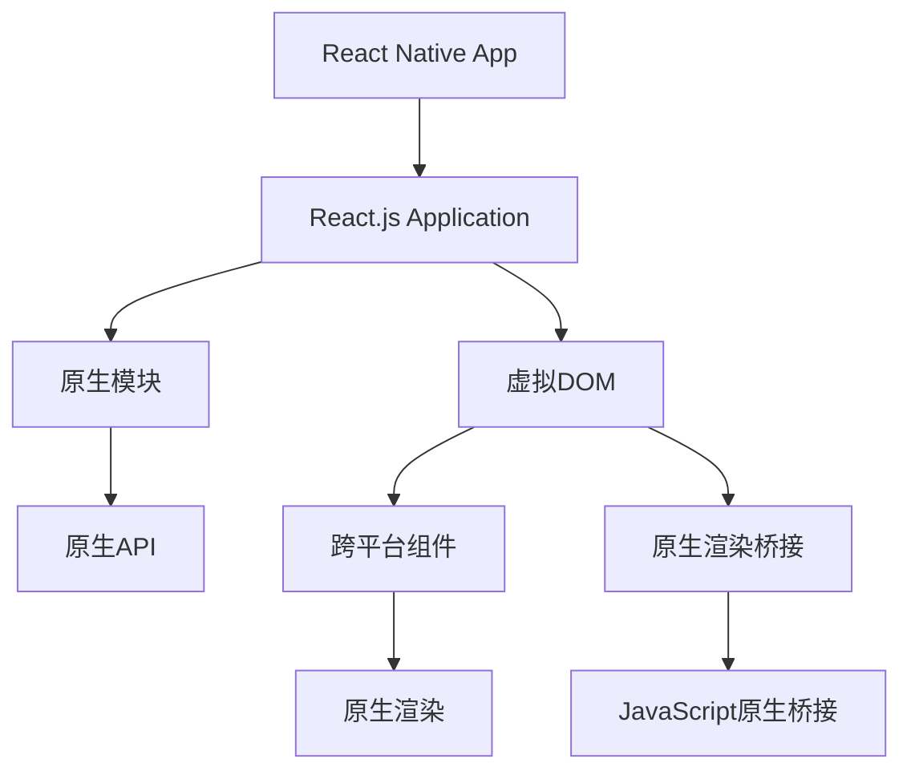

                 

# React Native：JavaScript驱动的原生移动应用开发

> 关键词：React Native, JavaScript, 原生应用开发, 跨平台, 组件化, 热更新, 渐进式 Web 应用

## 1. 背景介绍

### 1.1 问题由来

在移动应用开发领域，传统的原生开发（iOS Swift和Android Kotlin）具有很高的性能和丰富的系统功能，但开发成本高、周期长、维护复杂，且无法跨平台运行。同时，Web技术如HTML5、CSS3等由于性能瓶颈和平台兼容性问题，难以构建高性能的原生应用。为了解决这些难题，React Native（简称RN）应运而生。

React Native是由Facebook开发的一种跨平台移动应用开发框架，它结合了Web技术的优势和原生应用的高性能，允许开发者使用JavaScript和React编写原生应用，并支持iOS和Android平台。React Native的兴起改变了移动应用开发的格局，成为构建跨平台原生应用的主要选择之一。

### 1.2 问题核心关键点

React Native的核心思想是将移动应用开发视为组件化、模块化的过程，通过构建一系列跨平台的组件，使得开发者可以仅用一套代码库，构建不同平台的原生应用。具体来说，核心关键点包括：

- **组件化开发**：React Native的开发基于组件，开发者可以将UI界面拆分为一系列可复用的组件。每个组件都有一个对应的原生模块，可以独立开发和测试。
- **跨平台支持**：RN组件和模块在iOS和Android平台上共享一套代码，减少重复开发的工作量，提高开发效率。
- **热更新**：RN允许开发者在不重新启动应用的情况下，更新代码并热加载，提高开发和测试速度。
- **原生性能**：通过桥接技术，RN可以直接调用原生模块和API，提供接近原生应用的性能表现。
- **丰富的第三方库**：React Native拥有庞大的生态系统，包括各种UI组件、网络请求库、数据库库等，方便开发者快速开发和集成复杂功能。

### 1.3 问题研究意义

React Native的出现，极大地降低了移动应用开发的成本和周期，提高了开发效率和应用性能。其跨平台特性使得开发者能够快速构建跨系统的原生应用，提高了应用的可扩展性和维护性。此外，通过热更新技术，开发者可以在生产环境中快速迭代应用，提高产品质量和用户体验。

在当前移动开发领域，跨平台原生应用已成为重要的发展趋势，React Native正处于快速发展的黄金时期。研究React Native的开发原理、组件化、热更新等核心技术，对于提升开发者的技术水平，推动移动应用开发技术的进步，具有重要意义。

## 2. 核心概念与联系

### 2.1 核心概念概述

为了更好地理解React Native的技术框架和开发流程，本节将介绍几个关键概念：

- **组件**：在RN中，UI界面是由一系列组件构成的，每个组件都有其对应的原生模块和渲染方式。组件可以独立开发和测试，提高开发效率。
- **桥接技术**：React Native通过桥接技术，使得JavaScript代码能够调用原生模块和API，实现跨平台的原生应用开发。桥接技术主要通过React Native提供的一组原生模块库和接口来实现。
- **热更新**：React Native支持热更新，即在不重新启动应用的情况下，更新代码并重新加载模块。热更新大大提高了开发和测试效率，使得开发过程更加灵活和高效。
- **虚拟DOM**：React Native使用虚拟DOM来管理UI界面的变化，减少直接操作原生UI的成本，提高性能和用户体验。
- **原生性能**：尽管RN使用JavaScript和React进行开发，但通过桥接技术，RN可以直接调用原生API和模块，提供接近原生应用的性能表现。

这些概念共同构成了React Native的核心技术框架，使得开发者可以通过一套代码库，构建不同平台的原生应用。

### 2.2 核心概念原理和架构的 Mermaid 流程图

以下是一个简化的React Native架构图，展示了核心组件和桥接技术的关系：



这个架构图展示了React Native的核心组件和桥接技术的关系：

1. 开发者使用React.js构建应用，应用通过虚拟DOM管理UI界面。
2. 虚拟DOM中的组件通过桥接技术，调用原生模块和API，实现原生渲染。
3. 原生模块通过JavaScript原生桥接，将JavaScript代码映射到原生代码，从而实现跨平台的调用。
4. 原生渲染桥接将虚拟DOM渲染到原生UI，实现跨平台的原生渲染。

通过这种架构，React Native实现了JavaScript和原生的深度融合，使得开发者可以仅用一套代码库，构建不同平台的原生应用。

## 3. 核心算法原理 & 具体操作步骤

### 3.1 算法原理概述

React Native的核心算法原理包括组件化开发、桥接技术、热更新等。以下将详细介绍这些核心算法原理：

- **组件化开发**：React Native通过组件化开发，将UI界面拆分为一系列可复用的组件。组件包括视图组件、布局组件、交互组件等，每个组件都有其对应的原生模块和渲染方式。开发者可以通过组合这些组件，构建复杂的原生应用。
- **桥接技术**：桥接技术是React Native实现跨平台原生应用开发的关键。通过桥接技术，RN实现了JavaScript代码与原生模块的相互调用，使得开发者可以访问原生API和模块，同时也能在原生应用中运行JavaScript代码。
- **热更新**：React Native支持热更新，允许开发者在不重新启动应用的情况下，更新代码并重新加载模块。热更新大大提高了开发和测试效率，使得开发过程更加灵活和高效。

### 3.2 算法步骤详解

React Native的核心算法步骤主要包括组件化开发、桥接技术、热更新等。以下将详细介绍这些核心算法步骤：

#### 3.2.1 组件化开发

1. 将UI界面拆分为一系列可复用的组件。每个组件都有其对应的原生模块和渲染方式。
2. 组件可以通过组合，构建复杂的原生应用。开发者可以使用React的组件化开发技术，快速构建UI界面。
3. 组件可以独立开发和测试，提高开发效率和应用性能。

#### 3.2.2 桥接技术

1. React Native通过桥接技术，使得JavaScript代码能够调用原生模块和API。桥接技术主要通过React Native提供的一组原生模块库和接口来实现。
2. 原生模块库包括一组预先编写好的原生模块，开发者可以在代码中直接调用这些模块，实现复杂的原生功能。
3. 原生模块库和接口通过桥接技术，将JavaScript代码映射到原生代码，从而实现跨平台的调用。

#### 3.2.3 热更新

1. React Native支持热更新，允许开发者在不重新启动应用的情况下，更新代码并重新加载模块。
2. 热更新通过在应用内存中保存一份应用状态，使得开发者可以在不重新启动应用的情况下，更新代码并重新加载模块。
3. 热更新提高了开发和测试效率，使得开发过程更加灵活和高效。

### 3.3 算法优缺点

React Native的优势包括：

- **跨平台支持**：通过组件化开发和桥接技术，React Native可以构建iOS和Android平台的原生应用，减少重复开发的工作量，提高开发效率。
- **原生性能**：通过桥接技术，React Native可以直接调用原生模块和API，提供接近原生应用的性能表现。
- **热更新**：React Native支持热更新，允许开发者在不重新启动应用的情况下，更新代码并重新加载模块，提高开发和测试效率。

同时，React Native也存在一些缺点：

- **学习成本高**：React Native的开发需要使用JavaScript和React，开发者需要掌握这些技术，增加了学习成本。
- **性能瓶颈**：尽管React Native提供原生性能，但在某些复杂场景下，仍然存在性能瓶颈。
- **平台兼容性**：尽管React Native支持iOS和Android平台，但在某些平台上，某些组件可能无法正常运行。

### 3.4 算法应用领域

React Native的跨平台原生应用开发，已经在众多领域得到了广泛应用，例如：

- 社交媒体应用：如Facebook、Instagram等，通过React Native可以快速构建跨平台的原生应用，提高应用性能和用户体验。
- 游戏应用：如Gamer Today、NBA应用等，通过React Native可以高效开发和维护跨平台的原生游戏应用。
- 电商应用：如Shopify、Snapdeal等，通过React Native可以快速构建跨平台的原生电商应用，提升用户体验和转化率。
- 教育应用：如Duolingo、Khan Academy等，通过React Native可以构建跨平台的原生教育应用，提供丰富的学习资源和互动体验。
- 金融应用：如PayPal、Square等，通过React Native可以高效开发和维护跨平台的原生金融应用，提高应用的安全性和性能。

这些应用场景展示了React Native的广泛适用性和强大功能，使得开发者可以仅用一套代码库，构建不同平台的原生应用。

## 4. 数学模型和公式 & 详细讲解 & 举例说明

### 4.1 数学模型构建

为了更好地理解React Native的技术原理，本节将介绍其数学模型和公式。

在React Native中，虚拟DOM的构建和更新过程可以通过以下数学模型来描述：

1. 假设虚拟DOM的初始状态为 $\mathbf{x}_0$，对应的原生UI状态为 $\mathbf{y}_0$。
2. 开发者使用React的虚拟DOM库，构建新的虚拟DOM状态 $\mathbf{x}_1$。
3. 通过桥接技术，将虚拟DOM状态 $\mathbf{x}_1$ 映射到原生UI状态 $\mathbf{y}_1$。
4. 通过原生UI的渲染引擎，将原生UI状态 $\mathbf{y}_1$ 更新到原生设备上。
5. 虚拟DOM的构建和更新过程可以用以下公式表示：

$$
\mathbf{y} = f(\mathbf{x}, \mathbf{p}, \mathbf{q})
$$

其中，$\mathbf{x}$ 表示虚拟DOM状态，$\mathbf{y}$ 表示原生UI状态，$\mathbf{p}$ 表示桥接参数，$\mathbf{q}$ 表示原生UI渲染引擎的参数。

### 4.2 公式推导过程

以下推导虚拟DOM的构建和更新过程：

假设虚拟DOM的初始状态为 $\mathbf{x}_0$，对应的原生UI状态为 $\mathbf{y}_0$。开发者使用React的虚拟DOM库，构建新的虚拟DOM状态 $\mathbf{x}_1$。通过桥接技术，将虚拟DOM状态 $\mathbf{x}_1$ 映射到原生UI状态 $\mathbf{y}_1$。通过原生UI的渲染引擎，将原生UI状态 $\mathbf{y}_1$ 更新到原生设备上。

通过以上步骤，虚拟DOM的构建和更新过程可以用以下公式表示：

$$
\mathbf{y} = f(\mathbf{x}, \mathbf{p}, \mathbf{q})
$$

其中，$\mathbf{x}$ 表示虚拟DOM状态，$\mathbf{y}$ 表示原生UI状态，$\mathbf{p}$ 表示桥接参数，$\mathbf{q}$ 表示原生UI渲染引擎的参数。

在实际应用中，虚拟DOM的构建和更新过程是非常复杂的，涉及到多个层次的渲染和桥接。但是通过数学模型的描述，可以更清晰地理解React Native的原理和实现过程。

### 4.3 案例分析与讲解

以下通过一个简单的React Native应用示例，展示虚拟DOM的构建和更新过程：

假设我们构建一个简单的React Native应用，包含一个Text组件和一个TouchableOpacity组件。Text组件用于显示文本，TouchableOpacity组件用于触发点击事件。

```javascript
import React, { Component } from 'react';
import { Text, TouchableOpacity } from 'react-native';

class MyComponent extends Component {
  render() {
    return (
      <TouchableOpacity onPress={() => console.log('Button Pressed')}>
        <Text style={{ fontSize: 24 }}>Hello, World!</Text>
      </TouchableOpacity>
    );
  }
}

export default MyComponent;
```

在React Native中，Text组件和TouchableOpacity组件都是跨平台的组件，对应原生平台上的相应组件。当用户点击TouchableOpacity组件时，React Native会构建一个新的虚拟DOM状态，并通过桥接技术将其映射到原生UI状态，最终触发点击事件。

通过这个简单的示例，可以理解React Native的组件化开发和桥接技术，以及虚拟DOM的构建和更新过程。

## 5. 项目实践：代码实例和详细解释说明

### 5.1 开发环境搭建

在React Native开发过程中，需要搭建一套完整的开发环境。以下是具体的步骤：

1. 安装Node.js：React Native是基于Node.js的开发框架，需要先安装Node.js环境。可以从官网下载并安装完成后，启动Node.js的包管理器npm，安装React Native。
2. 安装React Native CLI：运行命令 `npm install -g react-native-cli` 安装React Native CLI，这是React Native开发必备的工具。
3. 安装模拟器：使用Android Studio或Xcode安装模拟器，用于在模拟器上运行React Native应用。
4. 安装真实设备：连接真实设备，并在模拟器上启动应用，进行调试和测试。

完成上述步骤后，即可在本地搭建React Native开发环境。

### 5.2 源代码详细实现

以下是React Native应用的详细实现步骤：

1. 创建新项目：运行命令 `react-native init MyReactApp` 创建一个新的React Native项目。
2. 编写代码：在App.js文件中编写React Native应用的代码，包括组件、路由、样式等。
3. 运行应用：运行命令 `react-native run-android` 或 `react-native run-ios` 在模拟器或真实设备上运行应用。
4. 调试应用：使用React Native的调试工具，如React Native Debugger、Chrome DevTools等，进行调试和测试。

以下是一个简单的React Native应用示例，展示如何使用TouchableHighlight组件实现点击事件：

```javascript
import React, { Component } from 'react';
import { Text, TouchableHighlight } from 'react-native';

class MyComponent extends Component {
  render() {
    return (
      <TouchableHighlight onPress={() => console.log('Button Pressed')}>
        <Text style={{ fontSize: 24 }}>Hello, World!</Text>
      </TouchableHighlight>
    );
  }
}

export default MyComponent;
```

在React Native中，TouchableHighlight组件用于实现点击事件。当用户点击组件时，React Native会触发 onPress 回调函数，从而执行相应的操作。

### 5.3 代码解读与分析

React Native的源代码非常庞大，但可以通过以下步骤进行解读和分析：

1. 阅读官方文档：React Native官方文档提供了详细的API和使用指南，可以帮助开发者快速上手。
2. 分析源代码：React Native的源代码可以在GitHub上查看，可以通过阅读源代码，理解组件和模块的实现原理。
3. 学习社区资源：React Native社区有大量的教程、博客和视频，可以帮助开发者学习和解决问题。

React Native的源代码主要包含以下几个模块：

- 核心模块：包括React Native的库和框架，如React Native CLI、虚拟DOM、桥接模块等。
- UI组件：React Native提供了一系列的UI组件，如Text、View、Image等，可以用于构建用户界面。
- 网络模块：React Native提供了一系列的API，可以用于网络请求和数据处理。
- 动画模块：React Native提供了一系列的API，可以用于实现动画效果。

### 5.4 运行结果展示

在React Native应用中，可以通过模拟器或真实设备运行应用，展示应用的运行结果。

以下是一个简单的React Native应用示例，展示如何使用RefreshControl组件实现下拉刷新：

```javascript
import React, { Component } from 'react';
import { FlatList, RefreshControl, Text } from 'react-native';

class MyComponent extends Component {
  constructor(props) {
    super(props);
    this.state = { refreshing: false, items: [] };
  }

  componentDidMount() {
    this.getItems();
  }

  getItems() {
    setTimeout(() => {
      this.setState({ refreshing: false, items: ['Item 1', 'Item 2', 'Item 3'] });
    }, 1000);
  }

  onRefresh() {
    this.setState({ refreshing: true });
    this.getItems();
  }

  renderItem({ item }) {
    return <Text>{item}</Text>;
  }

  render() {
    return (
      <FlatList
        data={this.state.items}
        renderItem={this.renderItem}
        refreshControl={
          <RefreshControl refreshing={this.state.refreshing} onRefresh={this.onRefresh} />
        }
      />
    );
  }
}

export default MyComponent;
```

在React Native中，FlatList组件用于实现列表展示，RefreshControl组件用于实现下拉刷新。当用户下拉刷新时，React Native会触发 onRefresh 回调函数，从而执行相应的操作。

## 6. 实际应用场景

### 6.1 智能应用开发

React Native在智能应用开发中得到了广泛应用，例如：

- 智能家居应用：通过React Native可以构建跨平台的智能家居应用，提供语音控制、远程监控等功能。
- 智能穿戴设备应用：通过React Native可以构建跨平台的智能穿戴设备应用，提供健康监测、运动记录等功能。
- 智能教育应用：通过React Native可以构建跨平台的智能教育应用，提供学习计划、智能推荐等功能。

React Native可以高效构建跨平台的智能应用，提供丰富的用户体验和功能，满足用户的各种需求。

### 6.2 移动游戏开发

React Native在移动游戏开发中也有广泛应用，例如：

- 移动游戏应用：通过React Native可以构建跨平台的移动游戏应用，提供丰富的游戏体验和互动性。
- 游戏引擎应用：通过React Native可以构建跨平台的游戏引擎应用，提供更加灵活和高效的游戏开发环境。

React Native可以高效构建跨平台的移动游戏应用，提供丰富的游戏体验和互动性，满足用户的各种需求。

### 6.3 企业应用开发

React Native在企业应用开发中也有广泛应用，例如：

- 企业门户应用：通过React Native可以构建跨平台的企业门户应用，提供员工信息、公司新闻等功能。
- 企业CRM应用：通过React Native可以构建跨平台的企业CRM应用，提供客户管理、销售管理等功能。

React Native可以高效构建跨平台的企业应用，提供丰富的用户体验和功能，满足企业的各种需求。

### 6.4 未来应用展望

随着React Native的不断发展，未来的应用场景将更加广泛，以下是一些未来应用展望：

- 增强现实应用：通过React Native可以构建跨平台的增强现实应用，提供更加丰富和沉浸的虚拟体验。
- 物联网应用：通过React Native可以构建跨平台的物联网应用，提供更加智能和高效的数据交互和控制。
- 混合现实应用：通过React Native可以构建跨平台的混合现实应用，提供更加逼真和互动的虚拟和现实融合体验。

React Native的应用场景将不断扩展，成为构建跨平台应用的重要工具之一。

## 7. 工具和资源推荐

### 7.1 学习资源推荐

为了帮助开发者系统掌握React Native的开发技巧和应用场景，以下是一些优质的学习资源：

1. React Native官方文档：React Native官方文档提供了详细的API和使用指南，是React Native开发必备资源。
2. React Native书籍：如《React Native官方文档》、《React Native实战》等书籍，可以帮助开发者深入理解React Native的核心技术。
3. React Native社区：React Native社区拥有大量的教程、博客和视频，可以帮助开发者学习和解决问题。
4. React Native官方示例：React Native官方提供了许多示例代码，可以帮助开发者快速上手。

通过这些学习资源，可以帮助开发者系统掌握React Native的开发技巧和应用场景，提升开发效率和应用性能。

### 7.2 开发工具推荐

在React Native开发过程中，需要一系列工具支持，以下是一些常用的开发工具：

1. React Native CLI：React Native的命令行工具，用于创建和管理React Native项目。
2. React Native Debugger：React Native的调试工具，可以调试和分析React Native应用。
3. Chrome DevTools：React Native的调试工具，可以调试和分析React Native应用。
4. Visual Studio Code：React Native的IDE，提供了丰富的插件和扩展，可以大大提高开发效率。
5. React Native Elements：React Native的界面组件库，提供了丰富的UI组件和样式。

这些工具可以帮助开发者更加高效地进行React Native开发，提升开发效率和应用性能。

### 7.3 相关论文推荐

React Native的开发和应用得益于学界的持续研究。以下是几篇奠基性的相关论文，推荐阅读：

1. "React Native: A Modern Mobile Application Development Framework"：React Native团队在2015年发表的论文，介绍了React Native的开发原理和核心技术。
2. "React Native: A Cross-Platform Framework for Building Highly Native Mobile Apps with JavaScript"：React Native团队在2015年发表的论文，介绍了React Native的核心组件和桥接技术。
3. "Cross-Platform Development with React Native"：React Native官方博客文章，介绍了React Native的开发流程和最佳实践。
4. "React Native Development with React.js"：React Native官方博客文章，介绍了React和React Native的结合方式和优势。
5. "Performance Optimization in React Native"：React Native官方博客文章，介绍了React Native的性能优化技巧和策略。

这些论文代表了大规模移动应用开发框架的研究方向，可以帮助开发者更好地理解React Native的核心技术和发展趋势。

## 8. 总结：未来发展趋势与挑战

### 8.1 研究成果总结

React Native的开发和应用，极大地降低了移动应用开发的成本和周期，提高了开发效率和应用性能。通过组件化开发、桥接技术和热更新等核心技术，React Native实现了JavaScript和原生的深度融合，使得开发者可以仅用一套代码库，构建不同平台的原生应用。

React Native的成功，源于其跨平台原生的开发理念，以及丰富的组件和生态支持。React Native社区不断壮大，吸引了大量开发者和贡献者，推动了React Native的持续发展和进步。

### 8.2 未来发展趋势

React Native的未来发展趋势将更加广泛和深入，以下是一些未来发展趋势：

- 更加灵活的组件化开发：React Native将提供更加灵活和可复用的组件，支持更多平台和设备。
- 更加高效的性能优化：React Native将提供更加高效的性能优化工具和策略，提升应用性能和用户体验。
- 更加强大的社区支持：React Native社区将不断壮大，提供更多的资源和支持，帮助开发者实现更好的开发体验。
- 更加丰富的第三方库：React Native将提供更多的第三方库和插件，支持更多的功能和应用场景。
- 更加广泛的应用场景：React Native将在更多领域得到应用，推动各行业的数字化转型和升级。

### 8.3 面临的挑战

尽管React Native已经取得了巨大的成功，但在发展过程中仍然面临一些挑战：

- 学习成本高：React Native的开发需要使用JavaScript和React，开发者需要掌握这些技术，增加了学习成本。
- 性能瓶颈：尽管React Native提供原生性能，但在某些复杂场景下，仍然存在性能瓶颈。
- 平台兼容性：尽管React Native支持iOS和Android平台，但在某些平台上，某些组件可能无法正常运行。

### 8.4 研究展望

为了应对这些挑战，未来的研究需要在以下几个方面寻求新的突破：

- 探索更加灵活和可复用的组件化开发方式。
- 开发更加高效的性能优化工具和策略。
- 提供更加广泛和深入的社区支持。
- 引入更加丰富和实用的第三方库和插件。
- 探索更加广泛和深入的应用场景和领域。

这些研究方向将推动React Native的持续发展和进步，使其成为构建跨平台应用的重要工具之一。

## 9. 附录：常见问题与解答

**Q1：React Native是否支持所有原生平台？**

A: React Native支持iOS和Android平台，但不支持Windows、Mac OS、Web平台等原生平台。React Native通过桥接技术，使得JavaScript代码能够调用原生模块和API，实现跨平台的原生应用开发。

**Q2：React Native的性能是否与原生应用相当？**

A: 尽管React Native提供原生性能，但在某些复杂场景下，仍然存在性能瓶颈。React Native通过桥接技术，调用原生模块和API，实现跨平台的原生应用开发。但是，React Native的性能可能受到虚拟DOM渲染、组件渲染等过程的影响，性能表现可能不如原生应用。

**Q3：React Native是否支持热更新？**

A: 是的，React Native支持热更新，允许开发者在不重新启动应用的情况下，更新代码并重新加载模块。热更新大大提高了开发和测试效率，使得开发过程更加灵活和高效。

**Q4：React Native是否支持跨平台的原生组件？**

A: 是的，React Native提供了一系列的跨平台原生组件，如Text、View、Image等，可以用于构建用户界面。通过桥接技术，React Native可以实现跨平台的原生渲染，提供接近原生应用的性能表现。

**Q5：React Native的开发是否需要掌握JavaScript和React？**

A: 是的，React Native的开发需要使用JavaScript和React，开发者需要掌握这些技术，才能实现跨平台的原生应用开发。

总之，React Native的开发和使用需要开发者具备一定的技术基础，但通过学习和实践，可以掌握React Native的开发技巧和应用场景，提升开发效率和应用性能。

