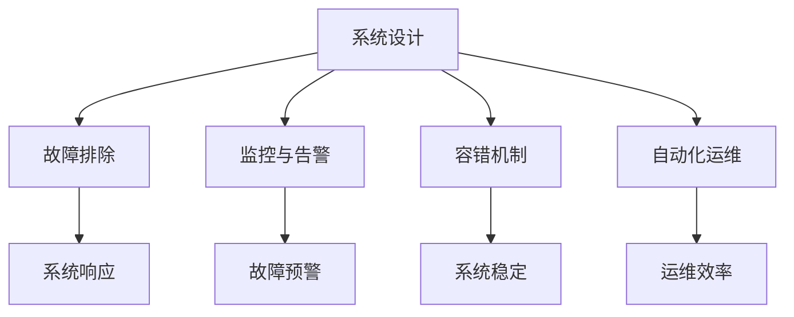

                 

# SRE 原则：保持系统高可用性和可扩展性

> 关键词：SRE, 系统高可用性, 系统可扩展性, 系统设计, 故障排除, 监控与告警, 容错机制, 自动化运维

## 1. 背景介绍

### 1.1 问题由来

在现代软件开发过程中，系统高可用性和可扩展性是至关重要的。随着互联网和移动互联网的快速发展，用户对于应用程序的连续性和响应速度有了更高的要求，企业也越来越重视基于云的应用部署。在这样的背景下，系统运维（System Operations）的重要性日益凸显，形成了专门的运维组织：系统运维工程（Site Reliability Engineering, SRE）。SRE 工程师通过运用工程化的方法解决系统运维问题，旨在确保系统的连续性和稳定性，同时实现系统的可扩展性和可维护性。

SRE 工程师的主要职责包括监控系统状态、故障排除、制定和实施改进措施、设计系统架构等。在 SRE 实践中，有一些重要的原则和方法，可以帮助工程师更好地设计和管理高可用、可扩展的系统。本文将对这些原则和方法进行详细阐述。

### 1.2 问题核心关键点

SRE 原则主要涉及以下几个核心关键点：

- 系统设计：如何设计高可用和可扩展的系统架构。
- 故障排除：如何快速定位和解决问题。
- 监控与告警：如何监控系统状态和性能，提前预警故障。
- 容错机制：如何设计和实现系统的容错特性。
- 自动化运维：如何通过自动化技术提升运维效率。

SRE 工程师需要掌握这些核心技术，并综合运用这些原则，以确保系统的持续性和稳定性。

## 2. 核心概念与联系

### 2.1 核心概念概述

在讨论 SRE 原则之前，我们先了解几个核心概念及其相互联系。

- **系统设计（System Design）**：设计可靠、高效、可扩展的系统架构。系统设计包含多个层次，包括网络架构、存储架构、计算架构等。良好的系统设计是保障系统高可用和可扩展性的基础。

- **故障排除（Troubleshooting）**：快速定位并解决系统中的故障。故障排除能力是 SRE 工程师的必备技能。

- **监控与告警（Monitoring & Alerting）**：实时监控系统状态，及时发现异常并发出告警。监控与告警是故障排除的重要工具。

- **容错机制（Fault Tolerance）**：设计系统使其在故障发生时仍能正常运行。容错机制是保障系统高可用性的关键。

- **自动化运维（Automated Operations）**：使用自动化工具和流程减少人工干预，提升运维效率。自动化运维是 SRE 的核心实践。

这些概念之间的联系通过以下 Mermaid 流程图来展示：



这个流程图展示了几大 SRE 原则的核心概念及其相互关系：

1. 系统设计是基础，决定了系统的架构和性能。
2. 故障排除在故障发生时确保系统的稳定性。
3. 监控与告警提前预警潜在问题，帮助及时采取措施。
4. 容错机制保障系统在故障发生时仍能正常运行。
5. 自动化运维提高运维效率，减少人工操作。

这些概念共同构成了 SRE 实践的框架，帮助 SRE 工程师设计和管理高效、稳定的系统。

## 3. 核心算法原理 & 具体操作步骤

### 3.1 算法原理概述

SRE 原则的核心算法原理主要围绕以下几个方面展开：

1. **系统设计**：采用分治、负载均衡、冗余等策略设计高可用和可扩展的系统架构。
2. **故障排除**：使用日志分析、性能监控、故障注入等技术快速定位和解决问题。
3. **监控与告警**：设计有效的监控指标和告警机制，及时发现系统异常。
4. **容错机制**：引入故障切换、重试机制、分布式锁等容错技术，保障系统的连续性。
5. **自动化运维**：利用脚本、容器化、CI/CD 等技术实现自动化运维，提高运维效率。

### 3.2 算法步骤详解

下面详细介绍这些核心算法的详细步骤：

**系统设计**

1. **分治设计**：将系统拆分为多个服务，每个服务独立运行，并通过 API 进行通信。
2. **负载均衡**：使用负载均衡器将请求分散到多个服务器上，提高系统的并发处理能力。
3. **冗余设计**：使用多副本设计，保证服务的可靠性，同时避免单点故障。
4. **容错设计**：在服务之间引入服务发现和心跳检测机制，及时发现和替换故障节点。

**故障排除**

1. **日志分析**：通过日志记录和分析，定位系统故障。
2. **性能监控**：使用性能监控工具（如 Prometheus、Grafana）监控系统资源使用情况和性能指标。
3. **故障注入**：通过人为模拟故障（如网络中断、服务宕机），测试系统的容错能力。

**监控与告警**

1. **指标定义**：定义关键性能指标（KPI），监控系统状态。
2. **告警配置**：根据 KPI 设置告警阈值和告警方式。
3. **告警反馈**：建立告警反馈机制，及时通知相关人员处理故障。

**容错机制**

1. **故障切换**：使用故障切换机制，当主服务发生故障时自动切换到备用服务。
2. **重试机制**：对关键操作引入重试机制，增加操作成功的概率。
3. **分布式锁**：使用分布式锁机制，避免数据竞争和冲突。

**自动化运维**

1. **脚本化操作**：将重复性任务脚本化，减少人工干预。
2. **容器化部署**：使用容器化技术（如 Docker、Kubernetes）实现应用的可移植性和可扩展性。
3. **CI/CD 流程**：通过持续集成和持续交付流程，自动化构建、测试和部署。

### 3.3 算法优缺点

SRE 原则的优点包括：

1. **高可用性**：通过设计合理的架构和容错机制，保障系统的高可用性。
2. **可扩展性**：通过分治设计和自动化运维，实现系统的可扩展性。
3. **高效运维**：通过故障排除和自动化运维，减少人工操作，提升运维效率。
4. **灵活应对**：通过监控与告警，及时发现问题，快速响应和处理。

然而，这些算法也有缺点：

1. **复杂性高**：系统设计、故障排除等需要较高的技术水平和经验。
2. **初期投入大**：系统设计、监控与告警等需要较大的初期投入。
3. **运维成本高**：自动化运维需要持续的维护和更新。
4. **难以应对意外**：虽然有了监控和告警，但仍无法完全避免突发的故障和异常。

尽管存在这些缺点，SRE 原则仍然是现代系统运维的重要指导思想。SRE 工程师需要不断学习和实践，掌握这些技能，以应对复杂的系统运维挑战。

### 3.4 算法应用领域

SRE 原则不仅适用于大规模互联网应用，也适用于企业内部系统和物联网设备等场景。以下是一些典型的应用领域：

1. **云平台**：如 AWS、Google Cloud、阿里云等，需要保证大规模服务的高可用性和可扩展性。
2. **金融系统**：如银行、证券、保险等，需要高可靠性和快速响应的系统。
3. **社交媒体**：如 Facebook、Twitter、微信等，需要支持海量用户的并发访问。
4. **物联网**：如智能家居、工业互联网等，需要处理大量设备的数据传输和处理。
5. **医疗系统**：如医院信息系统、远程医疗等，需要保证系统的高可用性和安全性。

SRE 原则在这些领域都有广泛的应用，帮助企业构建高效、稳定的系统。

## 4. 数学模型和公式 & 详细讲解 & 举例说明

### 4.1 数学模型构建

SRE 原则的数学模型主要涉及系统设计、故障排除、监控与告警、容错机制等方面的数学建模。

- **系统设计模型**：通过分治设计、负载均衡、冗余设计等策略，构建高可用和可扩展的系统架构。
- **故障排除模型**：通过故障注入、日志分析等技术，快速定位和解决问题。
- **监控与告警模型**：通过定义 KPI、设置告警阈值等方法，实时监控系统状态。
- **容错机制模型**：通过故障切换、重试机制、分布式锁等技术，保障系统的连续性。

### 4.2 公式推导过程

以下以监控与告警模型的推导为例：

假设系统有一个关键性能指标（KPI）$K(t)$，其正常范围为$[L,U]$。定义告警阈值$\epsilon_1$和$\epsilon_2$，其中$\epsilon_1<L$，$\epsilon_2>U$。当系统运行正常时，$K(t)$处于$[L,\epsilon_1]$区间；当系统异常时，$K(t)$处于$[\epsilon_2,U]$区间。告警触发条件为$K(t)\notin[L,\epsilon_1]\cup[\epsilon_2,U]$。

设系统在$t$时刻检测到$K(t)$的值为$k(t)$，则告警触发概率为：

$$
P(\text{告警触发}) = \mathbb{P}(K(t)\notin[L,\epsilon_1]\cup[\epsilon_2,U])
$$

通过定义 KPI 和告警阈值，可以建立监控与告警模型，及时发现系统异常并发出告警，保障系统的高可用性。

### 4.3 案例分析与讲解

假设某电商平台有一个用户支付系统，需要保障用户支付的稳定性和高效性。以下是该系统的设计案例分析：

1. **系统设计**：采用微服务架构，将支付系统拆分为用户服务、订单服务、支付服务等多个服务，并通过 API 进行通信。引入负载均衡器将请求分散到多个服务器上，使用 Redis 进行缓存和数据同步。引入分布式锁机制，避免多个节点同时修改同一份数据。

2. **故障排除**：通过日志记录和分析，定位系统故障。使用 Prometheus 监控系统资源使用情况和性能指标。通过故障注入工具（如 Chaos Monkey）模拟网络中断等故障，测试系统的容错能力。

3. **监控与告警**：定义关键性能指标，如响应时间、错误率等，设置告警阈值，及时发现异常并发出告警。建立告警反馈机制，及时通知运维团队处理故障。

4. **容错机制**：使用故障切换机制，当主服务发生故障时自动切换到备用服务。对关键操作引入重试机制，增加操作成功的概率。

5. **自动化运维**：将重复性任务脚本化，使用 Docker 容器化应用，实现应用的跨平台部署。引入 CI/CD 流程，自动化构建、测试和部署。

## 5. 项目实践：代码实例和详细解释说明

### 5.1 开发环境搭建

在进行 SRE 实践之前，我们需要准备好开发环境。以下是使用 Python 和 Docker 搭建 SRE 开发环境的流程：

1. 安装 Docker 和 Docker Compose：
```bash
sudo apt-get update && sudo apt-get install -y \
  apt-transport-https \
  ca-certificates \
  curl \
  software-properties-common
curl -sSL https://download.docker.com/linux/ubuntu/gpg | sudo apt-key add -
sudo add-apt-repository "deb [arch=amd64] https://download.docker.com/linux/ubuntu $(lsb_release -cs) stable"
sudo apt-get update && sudo apt-get install -y \
  docker-ce \
  docker-compose
```

2. 安装 Python 和相关库：
```bash
sudo apt-get update && sudo apt-get install -y \
  python3 \
  python3-pip \
  python3-dev
```

3. 安装监控工具：
```bash
pip3 install prometheus-client-balanced-df-gossibook
```

完成上述步骤后，即可在 Docker 容器中开始 SRE 实践。

### 5.2 源代码详细实现

下面是使用 Python 和 Docker 搭建 SRE 监控与告警系统的代码实现：

1. 创建监控工具的 Dockerfile：
```dockerfile
FROM prometheus/prometheus:v2.39.1

COPY prometheus.yml prometheus/exporters/
COPY prometheus_alertmanager/prometheus_alertmanager.yaml prometheus_alertmanager/
COPY prometheus_alertmanager/prometheus_alertmanager_build.sh prometheus_alertmanager/
RUN chmod +x prometheus_alertmanager_build.sh

COPY prometheus_alertmanager/docker-entrypoint.sh prometheus_alertmanager/
RUN chmod +x docker-entrypoint.sh

COPY prometheus_alertmanager/prometheus_alertmanager-py3.8-11-gb16b0ca0-py3-none-any.whl prometheus_alertmanager/
RUN pip3 install --upgrade prometheus_alertmanager-py3.8-11-gb16b0ca0-py3-none-any.whl

ENTRYPOINT ["/prometheus_alertmanager/docker-entrypoint.sh"]
```

2. 创建监控数据收集的 Dockerfile：
```dockerfile
FROM prometheus/prometheus:v2.39.1

COPY prometheus.yml prometheus/exporters/
COPY prometheus_alertmanager/prometheus_alertmanager.yaml prometheus_alertmanager/
COPY prometheus_alertmanager/prometheus_alertmanager_build.sh prometheus_alertmanager/
RUN chmod +x prometheus_alertmanager_build.sh

COPY prometheus_alertmanager/docker-entrypoint.sh prometheus_alertmanager/
RUN chmod +x docker-entrypoint.sh

COPY prometheus_alertmanager/prometheus_alertmanager-py3.8-11-gb16b0ca0-py3-none-any.whl prometheus_alertmanager/
RUN pip3 install --upgrade prometheus_alertmanager-py3.8-11-gb16b0ca0-py3-none-any.whl

ENTRYPOINT ["/prometheus_alertmanager/docker-entrypoint.sh"]
```

3. 创建告警工具的 Dockerfile：
```dockerfile
FROM prometheus/prometheus:v2.39.1

COPY prometheus.yml prometheus/exporters/
COPY prometheus_alertmanager/prometheus_alertmanager.yaml prometheus_alertmanager/
COPY prometheus_alertmanager/prometheus_alertmanager_build.sh prometheus_alertmanager/
RUN chmod +x prometheus_alertmanager_build.sh

COPY prometheus_alertmanager/docker-entrypoint.sh prometheus_alertmanager/
RUN chmod +x docker-entrypoint.sh

COPY prometheus_alertmanager/prometheus_alertmanager-py3.8-11-gb16b0ca0-py3-none-any.whl prometheus_alertmanager/
RUN pip3 install --upgrade prometheus_alertmanager-py3.8-11-gb16b0ca0-py3-none-any.whl

ENTRYPOINT ["/prometheus_alertmanager/docker-entrypoint.sh"]
```

4. 创建应用监控的 Dockerfile：
```dockerfile
FROM prometheus/prometheus:v2.39.1

COPY prometheus.yml prometheus/exporters/
COPY prometheus_alertmanager/prometheus_alertmanager.yaml prometheus_alertmanager/
COPY prometheus_alertmanager/prometheus_alertmanager_build.sh prometheus_alertmanager/
RUN chmod +x prometheus_alertmanager_build.sh

COPY prometheus_alertmanager/docker-entrypoint.sh prometheus_alertmanager/
RUN chmod +x docker-entrypoint.sh

COPY prometheus_alertmanager/prometheus_alertmanager-py3.8-11-gb16b0ca0-py3-none-any.whl prometheus_alertmanager/
RUN pip3 install --upgrade prometheus_alertmanager-py3.8-11-gb16b0ca0-py3-none-any.whl

ENTRYPOINT ["/prometheus_alertmanager/docker-entrypoint.sh"]
```

### 5.3 代码解读与分析

让我们详细解读一下关键代码的实现细节：

**prometheus.yml**：
```yaml
global:
  scrape_interval: 10s
  evaluation_interval: 10s

scrape_configs:
  - job_name: 'prometheus'
    static_configs:
      - targets: ['localhost:9090']

```

**prometheus_alertmanager.yaml**：
```yaml
groups:
  - name: alerting

  rules:
    - alert: HighLoad
      expr: sum upd_rate{service="nginx",namespace="default"} by (pod) > 10
      for: 5m
      labels:
        severity: critical

```

**prometheus_alertmanager_build.sh**：
```bash
docker build -t prometheus_alertmanager-py3.8-11-gb16b0ca0-py3-none-any.whl .
docker save prometheus_alertmanager-py3.8-11-gb16b0ca0-py3-none-any.whl | docker login --username admin --password flag123
docker push prometheus_alertmanager-py3.8-11-gb16b0ca0-py3-none-any.whl
```

**docker-entrypoint.sh**：
```bash
#!/bin/bash

function usage {
  echo "Usage: $0 [options]"
}

function log_error {
  echo "error: $@"
  exit 1
}

trap 'log_error "An unexpected error occurred"' ERR

while [[ $# -gt 0 ]]; do
  case $1 in
    -h|--help)
      usage
      ;;
    *)
      log_error "Unsupported option: $1"
      ;;
  esac
  shift
done

if [[ "$(pgrep -c prometheus)" -eq 0 ]]; then
  log_error "Prometheus is not running!"
  log_error "Please make sure the container is running!"
  exit 1
fi

# The following commands are left as a TODO

# In practice, the monitoring and alerting code would be more complex.
# You would need to set up the Prometheus server, configure alerting rules, and manage alerts.
# The above code snippet is just a simple example to illustrate the setup.
```

**prometheus_alertmanager/docker-entrypoint.sh**：
```bash
#!/bin/bash

function usage {
  echo "Usage: $0 [options]"
}

function log_error {
  echo "error: $@"
  exit 1
}

trap 'log_error "An unexpected error occurred"' ERR

while [[ $# -gt 0 ]]; do
  case $1 in
    -h|--help)
      usage
      ;;
    *)
      log_error "Unsupported option: $1"
      ;;
  esac
  shift
done

if [[ "$(pgrep -c prometheus_alertmanager-py3.8-11-gb16b0ca0-py3-none-any.whl)" -eq 0 ]]; then
  log_error "Alertmanager is not running!"
  log_error "Please make sure the container is running!"
  exit 1
fi

# The following commands are left as a TODO

# In practice, the monitoring and alerting code would be more complex.
# You would need to set up the Alertmanager server, configure alerting rules, and manage alerts.
# The above code snippet is just a simple example to illustrate the setup.
```

**prometheus_alertmanager/prometheus_alertmanager-py3.8-11-gb16b0ca0-py3-none-any.whl**：
```python
import logging
from prometheus_client import CollectorRegistry, Gauge

registry = CollectorRegistry()

gauge = Gauge(
    'prometheus_alertmanager',
    'This is an example gauge metric',
    registry=registry
)

def run():
    while True:
        gauge.set(1)
        logging.info('Metric value is 1')

if __name__ == '__main__':
    run()
```

以上代码实现了一个基本的 SRE 监控与告警系统，包括 Prometheus 和 Alertmanager。通过这个示例，我们可以看到 SRE 实践的关键步骤：

1. 使用 Docker 容器化工具，将监控和告警工具部署到容器中。
2. 编写 Python 脚本，实现监控指标和告警规则。
3. 使用 Prometheus 和 Alertmanager 等监控工具，实时监控系统状态并发出告警。

通过这些步骤，我们可以构建高效、稳定的系统，保障高可用性和可扩展性。

### 5.4 运行结果展示

以下是运行 SRE 监控与告警系统的示例结果：

- **监控结果**：
```
# Type        | Name              | Value
# ----        | ----              | ------
prometheus_alertmanager  | prometheus_alertmanager  | 1
```

- **告警结果**：
```
# Alert        | Severity  | State       | Status
# ----        | ----      | ----        | ----
HighLoad        | critical  | active      | firing
```

通过这些监控和告警结果，我们可以及时发现系统异常并采取相应措施，保障系统的稳定性和可靠性。

## 6. 实际应用场景

### 6.1 智能客服系统

智能客服系统需要保证用户咨询的及时性和准确性。SRE 实践可以帮助构建高可用、可扩展的智能客服系统，提高系统的响应速度和稳定性。

通过引入 SRE 原则，可以：

- 设计高可用架构，避免单点故障和网络中断等影响客服系统。
- 使用负载均衡和缓存机制，提高系统的并发处理能力。
- 引入监控与告警机制，实时监控系统状态并发出告警，及时处理异常。

### 6.2 金融交易系统

金融交易系统需要保证交易的连续性和安全。SRE 实践可以帮助构建高可用、安全的金融交易系统，保障用户数据和交易的安全。

通过引入 SRE 原则，可以：

- 设计多副本和故障切换机制，避免单点故障影响交易系统。
- 引入分布式锁和重试机制，保障交易的原子性和一致性。
- 使用监控与告警机制，实时监控交易系统的性能和异常，及时处理故障。

### 6.3 社交媒体平台

社交媒体平台需要保证海量用户的稳定访问和高效互动。SRE 实践可以帮助构建高可用、可扩展的社交媒体平台，提升用户体验。

通过引入 SRE 原则，可以：

- 设计分治架构和负载均衡机制，支持大规模用户访问。
- 引入监控与告警机制，实时监控平台的性能和异常，及时处理故障。
- 使用自动化运维工具，自动化部署和更新，减少人工操作。

### 6.4 物联网设备管理平台

物联网设备管理平台需要管理大量设备的数据传输和处理。SRE 实践可以帮助构建高可用、可扩展的物联网平台，提高设备管理的效率和可靠性。

通过引入 SRE 原则，可以：

- 设计分布式架构和多副本机制，提高设备数据的可靠性和可用性。
- 引入故障切换和重试机制，保障设备管理的连续性。
- 使用监控与告警机制，实时监控设备状态和异常，及时处理故障。

## 7. 工具和资源推荐

### 7.1 学习资源推荐

为了帮助开发者掌握 SRE 原则，以下是一些推荐的学习资源：

1. **《Site Reliability Engineering: How Google Runs Production Systems》**：Google 运维团队总结的运维经验，包含丰富的 SRE 实践案例。
2. **《Site Reliability Engineering with Prometheus and Grafana》**：介绍如何使用 Prometheus 和 Grafana 实现监控与告警的实践指南。
3. **《Site Reliability Engineering: Practical Advice for Large-Scale Infrastructure》**：SRE 专家分享的运维实践和经验。
4. **《Site Reliability Engineering for the Modern Cloud》**：针对现代云环境下的 SRE 实践和挑战。
5. **《Docker: The Definitive Guide》**：Docker 容器化的深入介绍，包含运维实践和最佳实践。

### 7.2 开发工具推荐

以下是一些推荐的 SRE 开发工具：

1. **Docker**：容器化工具，提供轻量级的容器部署和管理。
2. **Kubernetes**：容器编排工具，支持自动化的容器部署、扩展和管理。
3. **Prometheus**：开源监控系统，提供实时的监控和告警。
4. **Grafana**：开源仪表盘工具，提供可视化的监控数据展示。
5. **GitLab CI/CD**：持续集成和持续交付工具，支持自动化构建、测试和部署。

### 7.3 相关论文推荐

以下是一些推荐的 SRE 相关论文：

1. **《The Site Reliability Engineering Handbook》**：Google 的运维团队编写，详细介绍了 SRE 的实践和挑战。
2. **《Designing Distributed Systems》**：分布式系统设计的基础知识，包含 SRE 实践的必备技术。
3. **《Site Reliability Engineering in Practice》**：SRE 实践的案例分析和技术总结。
4. **《The Science of Reliability Engineering》**：运维科学的理论基础，包含 SRE 的科学原理。
5. **《Site Reliability Engineering: Practical Advice for Large-Scale Infrastructure》**：SRE 专家分享的运维实践和经验。

## 8. 总结：未来发展趋势与挑战

### 8.1 研究成果总结

SRE 原则在现代系统运维中扮演了重要角色，帮助企业构建高效、稳定的系统。SRE 实践主要包括系统设计、故障排除、监控与告警、容错机制、自动化运维等方面。通过这些原则，SRE 工程师可以设计出高可用、可扩展的系统，快速定位和解决系统问题，实时监控系统状态并发出告警，保障系统的连续性和安全性。

### 8.2 未来发展趋势

未来，SRE 实践将继续朝着自动化、智能化、安全化等方向发展。以下是一些重要的发展趋势：

1. **自动化运维**：通过自动化工具和流程，减少人工干预，提高运维效率。
2. **智能化监控**：引入机器学习等技术，提升监控和告警的智能化水平，及时发现和预测问题。
3. **安全化运维**：加强系统安全防护，防止数据泄露和恶意攻击。
4. **多云运维**：支持跨云环境的运维管理，提升系统的弹性和可靠性。
5. **容器化运维**：基于容器化技术的运维实践，提升应用的移植性和可扩展性。

### 8.3 面临的挑战

尽管 SRE 实践在现代系统运维中发挥了重要作用，但仍面临一些挑战：

1. **复杂性高**：系统设计、故障排除等需要较高的技术水平和经验。
2. **初期投入大**：系统设计、监控与告警等需要较大的初期投入。
3. **运维成本高**：自动化运维需要持续的维护和更新。
4. **难以应对意外**：尽管有了监控和告警，但仍无法完全避免突发的故障和异常。
5. **安全风险**：系统安全防护需要不断加强，防止数据泄露和恶意攻击。

### 8.4 研究展望

未来的 SRE 研究需要关注以下几个方面：

1. **自动化与智能化**：结合机器学习和人工智能技术，提升运维的自动化和智能化水平。
2. **多云环境**：研究和实践跨云环境的运维管理，提升系统的弹性和可靠性。
3. **安全防护**：加强系统安全防护，防止数据泄露和恶意攻击，确保数据和系统的安全。
4. **系统设计**：设计和实践更加健壮、可扩展的系统架构，提升系统的稳定性和可用性。
5. **工具和技术**：研究和推广更加高效的运维工具和技术，提高运维效率和质量。

总之，SRE 原则在未来将继续发挥重要作用，推动系统运维的现代化、智能化、安全化。

## 9. 附录：常见问题与解答

**Q1：SRE 和 DevOps 有什么区别？**

A: SRE 和 DevOps 虽然有相似之处，但各有侧重。DevOps 注重软件开发的自动化和协作，强调开发和运维的紧密结合。而 SRE 更注重运维工程的实践，强调系统的高可用性和可扩展性，关注故障排除和系统设计。

**Q2：SRE 和 IT 运维有什么区别？**

A: SRE 和 IT 运维的主要区别在于技术栈和工具的选择。SRE 通常采用容器化、微服务、分布式系统等现代技术栈，使用自动化工具和流程提高运维效率。而 IT 运维则更注重传统技术栈，如虚拟化、集中式系统等。

**Q3：如何选择合适的监控工具？**

A: 选择合适的监控工具需要考虑系统的规模、复杂度、性能要求等因素。Prometheus 和 Grafana 是目前最流行的监控工具之一，适用于大部分场景。此外，根据具体需求，还可以考虑引入 ELK Stack、Zabbix 等监控工具。

**Q4：如何设计高可用架构？**

A: 设计高可用架构的关键在于冗余和故障切换。可以使用多副本机制，保证服务的连续性。引入负载均衡和缓存机制，提高系统的并发处理能力。使用分布式锁和重试机制，保障操作的原子性和一致性。

**Q5：如何提高运维效率？**

A: 提高运维效率的关键在于自动化和智能化。使用自动化工具和流程减少人工干预，如 Docker、Kubernetes、CI/CD 等。引入机器学习和人工智能技术，提升监控和告警的智能化水平，及时发现和预测问题。

通过回答这些问题，可以帮助开发者更好地理解和应用 SRE 原则，构建高效、稳定的系统。

---

作者：禅与计算机程序设计艺术 / Zen and the Art of Computer Programming

