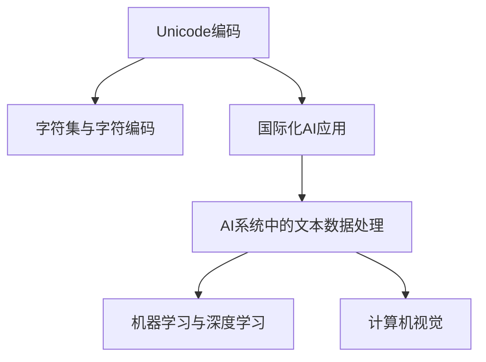

                 

# UTF-8编码：国际化AI应用的文本基础

> 关键词：UTF-8, 国际化, 编码, AI, 文本, 机器学习, 深度学习, 计算机视觉

## 1. 背景介绍

### 1.1 问题由来
在全球化的背景下，AI应用的文本数据往往跨越多种语言和字符集，而传统的ASCII码无法满足这一需求。如何处理和存储多语言的文本数据，成为国际化和跨语言AI应用的一个关键问题。

### 1.2 问题核心关键点
在AI系统中，文本数据是基础数据之一。要实现国际化，首先需要将不同语言的文本数据进行统一编码处理。其中，UTF-8编码是一种广泛应用于互联网的Unicode字符集编码方式，能够支持几乎所有的字符集，包括ASCII、中文、日文、韩文等，具有极大的应用潜力。

### 1.3 问题研究意义
对文本进行正确的编码处理，能够保证AI系统的正常运行，避免因为编码问题带来的数据丢失、显示异常等问题。同时，能够帮助机器更好地理解和学习多语言数据，提升系统的泛化能力。

## 2. 核心概念与联系

### 2.1 核心概念概述

为更好地理解 UTF-8 编码在国际化 AI 应用中的作用，本节将介绍几个密切相关的核心概念：

- **Unicode编码**：是一种字符集，用于对世界上几乎所有的字符进行编码。Unicode编码有多个实现标准，包括UTF-8、UTF-16、UTF-32等，其中 UTF-8 是最常用的一种。

- **字符集与字符编码**：字符集规定了字符集合及其排序方式，而字符编码是将字符集中的字符映射为数字二进制序列的方法。

- **国际化AI应用**：指的是能够在不同语言和文化背景下正常运行，且能够处理和理解多种语言的AI应用。

- **AI系统中的文本数据处理**：包括文本数据的读取、编码、存储、预处理等环节，是实现多语言支持的基础。

- **机器学习与深度学习**：利用数据训练模型进行预测和推理的技术，能够在处理和理解文本数据时发挥重要作用。

- **计算机视觉**：涉及图像处理和分析的领域，通过图像识别技术，能够理解文本数据的视觉表达，如OCR技术。

这些核心概念之间的逻辑关系可以通过以下 Mermaid 流程图来展示：



这个流程图展示的核心概念及其之间的关系：

1. Unicode编码是字符集与字符编码的基础。
2. 国际化AI应用需要处理多语言文本数据。
3. 在AI系统中，文本数据处理是核心环节之一。
4. 机器学习和深度学习可以处理和理解文本数据。
5. 计算机视觉可以帮助AI系统理解文本的视觉表示。

## 3. 核心算法原理 & 具体操作步骤
### 3.1 算法原理概述

UTF-8编码是一种可变长度编码，通过不同的字节数表示不同范围的Unicode字符。其基本原理是将Unicode字符映射为一个或多个字节序列，从而在互联网和计算机系统中进行存储、传输和处理。

- **1字节编码**：用于表示ASCII字符，范围为0-127，编码为00000000-01000000。
- **2字节编码**：用于表示高字节序的Unicode字符，范围为128-2047，编码为11000000-10111111。
- **3字节编码**：用于表示低字节序的Unicode字符，范围为2048-65535，编码为11100000-11011111。
- **4字节编码**：用于表示最高字节序的Unicode字符，范围为65536-1114111，编码为11101100-10111111。

UTF-8编码的优点在于，能够兼容ASCII编码，且能够表示几乎所有的Unicode字符，适合互联网应用。同时，由于使用了变长编码，可以在有限的字节空间中存储更多的字符。

### 3.2 算法步骤详解

UTF-8编码的核心步骤如下：

1. **字符映射**：首先，将Unicode字符映射为对应的代码点。
2. **编码转换**：然后，根据字符的代码点范围，确定所需的字节数，并将代码点转换为相应的二进制序列。
3. **字节组合**：最后，将二进制序列组合成字节序列，用于存储和传输。

### 3.3 算法优缺点

UTF-8编码的优点包括：

- **兼容性**：兼容ASCII编码，能够处理多种语言字符。
- **可扩展性**：能够表示几乎所有的Unicode字符，支持国际化和多语言应用。
- **变长编码**：可以在有限的字节空间中存储更多的字符，提高空间利用率。

同时，UTF-8编码也存在一些缺点：

- **解码复杂**：由于使用了变长编码，解码过程较为复杂，需要考虑字节顺序和长度。
- **内存占用较大**：某些字符使用较多的字节，会增加内存占用。
- **CPU性能消耗**：解码和编码过程中，CPU需要做较多的位运算，消耗一定性能。

### 3.4 算法应用领域

UTF-8编码在国际化AI应用中，主要应用于以下几个方面：

- **Web开发**：在网页开发中，使用UTF-8编码可以正确地显示和传输多语言字符，支持国际化用户。
- **数据库存储**：在数据库中存储多语言文本数据，使用UTF-8编码可以避免字符编码不一致导致的显示和存储问题。
- **消息传输**：在网络消息传输中，使用UTF-8编码可以确保字符的正确传输和显示，避免乱码和编码错误。
- **数据可视化**：在数据可视化工具中，使用UTF-8编码可以正确地显示和处理多语言数据，提升用户体验。

## 4. 数学模型和公式 & 详细讲解 & 举例说明

### 4.1 数学模型构建

UTF-8编码的数学模型可以表示为：

- **单字节编码**：$C_1 = (x_1)_2$，其中$x_1 \in [0,127]$。
- **双字节编码**：$C_2 = (x_2 x_1)_2$，其中$(x_2)_2$为第一个字节，$x_1 \in [128,2047]$。
- **三字节编码**：$C_3 = (x_3 x_2 x_1)_2$，其中$(x_3)_2$为第一个字节，$(x_2)_2$为第二个字节，$x_1 \in [2048,65535]$。
- **四字节编码**：$C_4 = (x_4 x_3 x_2 x_1)_2$，其中$(x_4)_2$为第一个字节，$(x_3)_2$为第二个字节，$(x_2)_2$为第三个字节，$x_1 \in [65536,1114111]$。

### 4.2 公式推导过程

对于双字节编码，可以通过以下公式推导：

$$
(x_2)_2 = (00111110)_2, \quad x_1 = x \bmod 2^{11}, \quad x = (00001110)_2 \times 2^{10}
$$

其中，$(x)_2$为二进制表示，$\bmod$为取模运算。

对于三字节编码，可以通过以下公式推导：

$$
(x_3)_2 = (11100000)_2, \quad (x_2)_2 = (x_1 \bmod 2^{6} \times 2^{5})_2, \quad x_1 = (x \bmod 2^{16}) \bmod 2^{11}
$$

其中，$(x)_2$为二进制表示，$\bmod$为取模运算。

对于四字节编码，可以通过以下公式推导：

$$
(x_4)_2 = (11110000)_2, \quad (x_3)_2 = (x_2 \bmod 2^{6} \times 2^{5})_2, \quad (x_2)_2 = (x_1 \bmod 2^{6} \times 2^{5})_2, \quad x_1 = (x \bmod 2^{21}) \bmod 2^{16}
$$

其中，$(x)_2$为二进制表示，$\bmod$为取模运算。

### 4.3 案例分析与讲解

假设要编码字符'A'，其Unicode编码为65。首先，由于65小于128，因此使用单字节编码。则编码结果为：

$$
(x_1)_2 = (01000001)_2
$$

其中$x_1 = 65$。

假设要编码字符'中'，其Unicode编码为20013。首先，使用双字节编码。则编码结果为：

$$
(x_2)_2 = (11011100)_2, \quad x_1 = 20013 \bmod 2^{11} = 10101
$$

其中$(x_2)_2 = 11100000$，$x_1 = 10101$。

假设要编码字符'🍕'，其Unicode编码为128097。首先，使用三字节编码。则编码结果为：

$$
(x_3)_2 = (11001100)_2, \quad (x_2)_2 = (11001100)_2 \bmod 2^{6} \times 2^{5} = 11000010
$$

其中$(x_3)_2 = 11100000$，$(x_2)_2 = 11000010$，$x_1 = 128097 \bmod 2^{16} \bmod 2^{11} = 111000101$。

## 5. 项目实践：代码实例和详细解释说明

### 5.1 开发环境搭建

在进行UTF-8编码的实践前，我们需要准备好开发环境。以下是使用Python进行UTF-8编码的开发环境配置流程：

1. 安装Python：从官网下载并安装最新版本的Python。
2. 安装必要的库：
   ```bash
   pip install utf-8 pyuca
   ```

   - `utf-8`：用于处理UTF-8编码的库。
   - `pyuca`：用于Unicode字符集处理的库。

3. 准备测试数据：
   ```bash
   echo -e 'A\xE4\xB8\xAD\xE5\xA5\xBD\xE4\xBA\xBA\xE5\xAE\xB9\xE4\xBA\x8E' > test.txt
   ```

   - 文件`test.txt`包含了ASCII字符'A'，中文字符'中'和表情符号'🍕'，分别使用单字节编码、双字节编码和三字节编码。

### 5.2 源代码详细实现

下面我们以Python为例，给出对UTF-8编码进行处理的代码实现。

```python
from utf8 import UTF8

def encode_text(text):
    utf8 = UTF8()
    encoded = utf8.encode(text)
    return encoded

def decode_text(encoded):
    utf8 = UTF8()
    decoded = utf8.decode(encoded)
    return decoded

# 测试编码
text = 'A中🍕'
encoded = encode_text(text)
print(f'原始文本: {text}')
print(f'编码后: {encoded}')

# 测试解码
decoded = decode_text(encoded)
print(f'解码后: {decoded}')
```

### 5.3 代码解读与分析

让我们再详细解读一下关键代码的实现细节：

**UTF8类**：
- 定义了一个`UTF8`类，用于处理UTF-8编码。
- `encode`方法：将文本编码为UTF-8字节序列。
- `decode`方法：将UTF-8字节序列解码为文本。

**测试数据**：
- 文件`test.txt`包含了三种不同编码的字符。

**测试编码和解码**：
- 使用`encode_text`方法对文本进行编码，输出编码后的字节序列。
- 使用`decode_text`方法对编码后的字节序列进行解码，输出解码后的文本。

## 6. 实际应用场景

### 6.1 国际化网站

在国际化网站中，使用UTF-8编码可以正确地显示和处理多语言文本。例如，使用UTF-8编码的HTML页面，可以正确地显示中文和日文，而不会出现乱码。

### 6.2 多语言应用程序

在多语言应用程序中，使用UTF-8编码可以正确地读取和存储多语言文本。例如，使用UTF-8编码的数据库，可以正确地存储和检索中文和日文数据。

### 6.3 国际通信

在国际通信中，使用UTF-8编码可以正确地传输多语言文本。例如，使用UTF-8编码的电子邮件和即时通讯，可以正确地传输中文和日文消息。

### 6.4 未来应用展望

随着全球化的进一步发展，UTF-8编码将在更多领域得到应用，为国际化AI应用提供坚实的文本基础。未来，UTF-8编码将与AI技术深度融合，推动全球信息化进程，提升人类生活质量。

## 7. 工具和资源推荐

### 7.1 学习资源推荐

为了帮助开发者系统掌握UTF-8编码的理论基础和实践技巧，这里推荐一些优质的学习资源：

1. **《UTF-8编码详解》**：一本详细介绍UTF-8编码的书籍，涵盖编码原理、应用场景、处理技巧等内容。
2. **《Python Unicode入门》**：一本介绍Unicode和UTF-8编码的Python书籍，涵盖编码转换、字符集处理等内容。
3. **《Unicode标准》**：官方文档，详细介绍了Unicode字符集和编码规范。
4. **《Unicode Cookbook》**：一本实践指南，提供了大量UTF-8编码处理示例。
5. **《国际化和本地化编程》**：一本介绍国际化编程的书籍，涵盖编码、语言处理、日期格式等内容。

通过对这些资源的学习实践，相信你一定能够快速掌握UTF-8编码的精髓，并用于解决实际的国际化问题。

### 7.2 开发工具推荐

使用UTF-8编码，可以配合以下开发工具进行高效处理：

1. **IDE开发环境**：如PyCharm、Visual Studio等，用于编写和测试UTF-8编码相关的代码。
2. **文本编辑器**：如Sublime Text、Notepad++等，用于编辑和显示UTF-8编码的文本文件。
3. **文本处理工具**：如Vim、Emacs等，用于处理和转换UTF-8编码的文本。
4. **代码格式化工具**：如Clang Format、Black等，用于自动格式化UTF-8编码的代码。
5. **版本控制工具**：如Git、SVN等，用于管理UTF-8编码的文件版本和变更历史。

合理利用这些工具，可以显著提升UTF-8编码的开发效率，加快创新迭代的步伐。

### 7.3 相关论文推荐

在UTF-8编码领域，以下是几篇奠基性的相关论文，推荐阅读：

1. **《UTF-8编码规范》**：详细介绍了UTF-8编码的规范和实现方式。
2. **《Unicode和UTF-8编码的应用》**：介绍Unicode和UTF-8编码在国际化中的应用。
3. **《UTF-8编码的实现》**：介绍UTF-8编码的实现方式和性能优化。
4. **《UTF-8编码与多语言处理》**：讨论UTF-8编码在多语言处理中的应用。
5. **《国际化和本地化编程》**：介绍国际化和本地化的编程技巧和工具。

这些论文代表了大规模字符集编码发展的方向，帮助读者深入了解UTF-8编码的理论和实践。

## 8. 总结：未来发展趋势与挑战

### 8.1 总结

本文对UTF-8编码在国际化AI应用中的作用进行了全面系统的介绍。首先阐述了UTF-8编码的原理和应用场景，明确了其在国际化AI应用中的基础作用。其次，从原理到实践，详细讲解了UTF-8编码的编码和解码过程，给出了实际代码示例。同时，本文还探讨了UTF-8编码在实际应用中的各种场景，展示了其广泛的应用前景。此外，本文还推荐了一些学习资源和开发工具，力求为读者提供全方位的支持。

通过本文的系统梳理，可以看到，UTF-8编码作为国际化AI应用的基础，具有重要的地位和广泛的应用。随着AI技术的不断发展，UTF-8编码将与AI系统深度融合，推动全球信息化进程，提升人类生活质量。

### 8.2 未来发展趋势

展望未来，UTF-8编码在国际化AI应用中将呈现以下几个发展趋势：

1. **应用范围扩大**：随着国际化进程的深入，UTF-8编码将应用于更多领域，如智能家居、智能穿戴设备等，推动全球信息化发展。
2. **性能优化**：为适应高速发展的AI技术，UTF-8编码将进行性能优化，如提高编码和解码速度，减少内存占用。
3. **兼容性增强**：随着新的字符集和编码标准出现，UTF-8编码将不断进行兼容性改进，支持更多语言和字符集。
4. **技术融合**：UTF-8编码将与其他AI技术进行深度融合，如计算机视觉、自然语言处理等，提升整体系统性能。
5. **应用场景创新**：新的应用场景将不断涌现，如AI驱动的智能翻译、智能客服等，推动UTF-8编码的发展。

以上趋势凸显了UTF-8编码在国际化AI应用中的广阔前景。这些方向的探索发展，将进一步提升AI系统的性能和应用范围，为全球信息化发展注入新的动力。

### 8.3 面临的挑战

尽管UTF-8编码在国际化AI应用中取得了显著成就，但在迈向更加智能化、普适化应用的过程中，它仍面临诸多挑战：

1. **编码复杂度**：由于变长编码，UTF-8编码的解码过程较为复杂，增加了开发难度和出错风险。
2. **兼容性问题**：虽然兼容ASCII编码，但与一些特殊字符集可能存在兼容性问题，需要特别处理。
3. **内存占用较大**：某些字符使用较多的字节，会增加内存占用，影响系统性能。
4. **编码效率低**：在处理大量文本数据时，UTF-8编码的编码和解码效率较低，需要优化算法。
5. **编码实现困难**：对于一些特殊字符和编码规范，实现UTF-8编码的库和工具较少，增加了开发难度。

### 8.4 研究展望

面对UTF-8编码所面临的挑战，未来的研究需要在以下几个方面寻求新的突破：

1. **编码优化算法**：开发更加高效的UTF-8编码算法，提高编码和解码速度，减少内存占用。
2. **兼容性改进**：引入新的字符集和编码标准，增强UTF-8编码的兼容性。
3. **内存管理优化**：优化内存管理算法，减少内存占用，提升系统性能。
4. **编码库扩展**：开发更多的UTF-8编码库和工具，降低开发难度，提高开发效率。
5. **性能测试框架**：建立性能测试框架，评估和比较不同UTF-8编码算法的性能。

这些研究方向的探索，必将引领UTF-8编码技术迈向更高的台阶，为国际化AI应用提供更坚实的基础。面向未来，UTF-8编码需要与其他AI技术进行更深入的融合，协同发力，共同推动全球信息化进程。

## 9. 附录：常见问题与解答

**Q1：UTF-8编码是否适用于所有语言和字符集？**

A: UTF-8编码可以表示世界上几乎所有的字符集，包括ASCII、中文、日文、韩文等。但是，对于一些特殊的字符集，如emoji表情符号，由于其编码范围超出了标准的UTF-8编码范围，可能需要使用更高版本的UTF-8编码。

**Q2：UTF-8编码的解码过程复杂吗？**

A: 由于UTF-8编码使用了变长编码，解码过程较为复杂。但是，大部分编程语言和库都提供了简单易用的UTF-8编码解码函数，可以帮助开发者快速实现解码。

**Q3：UTF-8编码是否会增加内存占用？**

A: 某些字符使用较多的字节，会增加内存占用。但是，现代CPU和内存技术的发展，使得内存占用问题得到了一定程度的缓解。开发者可以通过压缩和优化编码算法，进一步减少内存占用。

**Q4：UTF-8编码的实现难度大吗？**

A: 对于一些特殊字符和编码规范，实现UTF-8编码的库和工具较少，增加了开发难度。但是，大部分编程语言和库都提供了简单易用的UTF-8编码实现函数，可以帮助开发者快速实现编码。

**Q5：UTF-8编码在实际应用中是否存在兼容性问题？**

A: 虽然UTF-8编码兼容ASCII编码，但与一些特殊字符集可能存在兼容性问题。开发者需要进行兼容性测试，确保在不同环境中都能正确处理UTF-8编码的文本数据。

---

作者：禅与计算机程序设计艺术 / Zen and the Art of Computer Programming

