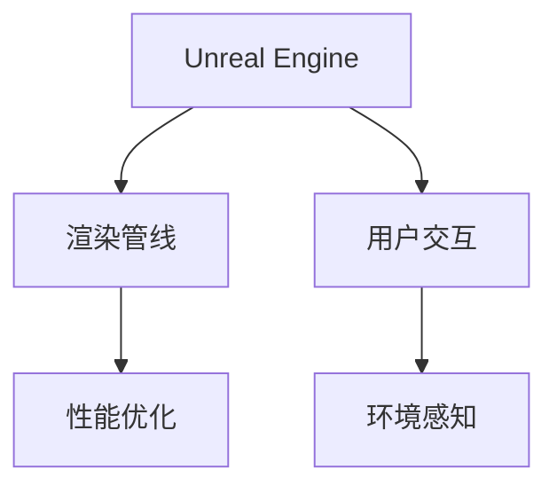

                 

# Unreal Engine VR游戏开发

## 1. 背景介绍

### 1.1 问题由来

近年来，随着VR（虚拟现实）技术的快速发展和普及，越来越多的企业和开发者开始关注如何在VR环境中开发高质量的游戏。相比于传统的2D和3D游戏，VR游戏需要更高级的渲染技术、更复杂的光照系统和更真实的用户交互方式。在Unity、Unreal Engine等主流游戏引擎中，Unreal Engine凭借其强大的图形处理能力、高度可定制化的开发环境和丰富的资源库，成为了开发VR游戏的首选。

### 1.2 问题核心关键点

Unreal Engine VR游戏开发的核心关键点在于以下几个方面：

1. **渲染技术**：VR游戏对渲染要求极高，需要实现复杂的实时光照、阴影、反射等效果，并且要支持大视角范围内的流畅渲染。
2. **用户交互**：VR用户通过头戴设备和手柄进行交互，需要设计直观易用的控制器和界面，实现沉浸式的游戏体验。
3. **环境感知**：VR游戏需要环境感知技术，如空间定位、环境映射等，以增强用户沉浸感。
4. **性能优化**：VR游戏运行在高刷新率（如90Hz或更高）下，需要高效的算法和引擎优化，避免卡顿和延迟。

### 1.3 问题研究意义

Unreal Engine VR游戏开发对于推动虚拟现实技术在娱乐、教育、医疗等领域的广泛应用具有重要意义：

1. **娱乐体验**：VR游戏提供沉浸式的交互体验，让用户能够真正“进入”游戏世界，极大地提升游戏体验。
2. **教育应用**：VR游戏可以模拟复杂的实验场景和教学环境，帮助学生在虚拟环境中进行实践和探究，激发学习兴趣。
3. **医疗培训**：VR游戏可以用来模拟手术、康复训练等场景，为医学生和医生提供安全、高效、成本低的培训工具。
4. **社会互动**：VR游戏可以实现远程互动和虚拟社交，打破时间和空间的限制，促进人与人之间的交流。

## 2. 核心概念与联系

### 2.1 核心概念概述

为了更好地理解Unreal Engine VR游戏开发，本节将介绍几个密切相关的核心概念：

1. **Unreal Engine**：由Epic Games开发的跨平台游戏引擎，支持VR、AR、PC、主机等多种平台。提供强大的渲染引擎、物理引擎、蓝图系统等工具。
2. **VR游戏**：使用虚拟现实技术，在VR头戴设备或手柄上提供沉浸式游戏体验的电子游戏。
3. **渲染管线**：指游戏渲染的整个过程，包括顶点处理、光照、阴影、后处理等步骤。
4. **用户交互**：指游戏与用户之间的交互方式，如控制器控制、语音指令、手势识别等。
5. **环境感知**：指游戏对环境的感知和理解，包括空间定位、碰撞检测、环境映射等技术。
6. **性能优化**：指通过算法和引擎优化，提升游戏运行速度和稳定性，避免卡顿和延迟。

这些核心概念之间的逻辑关系可以通过以下Mermaid流程图来展示：



这个流程图展示了Unreal Engine VR游戏开发的核心概念及其之间的关系：

1. Unreal Engine提供渲染管线和用户交互工具，支持环境感知技术。
2. 渲染管线实现复杂的光照、阴影、反射等效果。
3. 用户交互设计直观易用的控制器和界面，增强沉浸感。
4. 环境感知技术如空间定位、环境映射等，增强环境真实性。
5. 性能优化保证高刷新率和流畅运行。

这些概念共同构成了Unreal Engine VR游戏开发的框架，使其能够实现高质量的游戏体验。通过理解这些核心概念，我们可以更好地把握Unreal Engine VR游戏开发的技术要点。

## 3. 核心算法原理 & 具体操作步骤

### 3.1 算法原理概述

Unreal Engine VR游戏开发涉及的算法原理主要包括以下几个方面：

1. **渲染算法**：包括光追、全局光照、HDR渲染等技术，实现逼真的光照效果和复杂的渲染场景。
2. **空间定位算法**：如激光雷达、视觉SLAM等技术，实现对环境的准确感知和定位。
3. **物理模拟算法**：如刚体物理、流体模拟等，实现对物理现象的逼真模拟。
4. **用户交互算法**：如手柄控制、手势识别、语音指令等技术，实现自然流畅的用户交互。

### 3.2 算法步骤详解

Unreal Engine VR游戏开发的算法步骤主要包括以下几个关键环节：

1. **场景搭建**：使用Unreal Engine的编辑器工具搭建虚拟环境，包括地形、建筑、场景细节等。
2. **光照和阴影**：实现复杂的实时光照和阴影效果，使用Unreal Engine的光追系统实现逼真的光线追踪。
3. **空间定位**：实现空间定位和环境映射，使用激光雷达、视觉SLAM等技术，确保用户在不同场景中的准确位置。
4. **物理模拟**：实现真实的物理模拟，使用Unreal Engine的物理引擎实现刚体碰撞、流体模拟等效果。
5. **用户交互**：设计直观易用的控制器和界面，实现自然流畅的用户交互。
6. **性能优化**：优化渲染管线、减少图形资源、使用GPU加速等技术，提升游戏运行速度和稳定性。

### 3.3 算法优缺点

Unreal Engine VR游戏开发算法具有以下优点：

1. **高效渲染**：使用先进的光追系统和物理引擎，实现高质量的实时渲染效果。
2. **沉浸体验**：通过空间定位和环境感知技术，增强用户的沉浸感和真实感。
3. **灵活交互**：支持多种用户交互方式，如手柄控制、手势识别、语音指令等，提高用户互动性。

同时，这些算法也存在一定的局限性：

1. **计算资源需求高**：复杂的光照、物理模拟等效果，对计算资源要求较高，可能面临性能瓶颈。
2. **算法复杂度大**：实现高质量的VR游戏，需要同时考虑渲染、物理、交互等多个方面的算法优化。
3. **开发难度高**：需要具备较高的编程和算法能力，开发周期较长。

尽管存在这些局限性，但Unreal Engine凭借其强大的渲染能力和丰富的资源库，已经成为开发高质量VR游戏的首选引擎。未来相关研究的重点在于如何进一步降低开发难度，提高算法的灵活性和鲁棒性，同时兼顾可解释性和效率。

### 3.4 算法应用领域

Unreal Engine VR游戏开发的算法主要应用于以下几个领域：

1. **娱乐行业**：如VR射击、赛车、冒险等游戏，提供沉浸式的娱乐体验。
2. **医疗培训**：如模拟手术、康复训练等，为医学生和医生提供安全的培训工具。
3. **教育领域**：如虚拟课堂、模拟实验等，帮助学生在虚拟环境中进行实践和探究。
4. **虚拟现实体验**：如虚拟旅游、虚拟展会等，提供沉浸式的互动体验。

这些应用领域展示了Unreal Engine VR游戏开发算法的广泛应用前景，为各行业的数字化转型提供了新的技术和工具。随着Unreal Engine VR游戏开发的不断进步，相信VR技术将在更多领域得到应用，为社会带来新的价值。

## 4. 数学模型和公式 & 详细讲解 & 举例说明

### 4.1 数学模型构建

Unreal Engine VR游戏开发的数学模型主要包括以下几个方面：

1. **光照模型**：如Phong、Blinn-Phong等模型，实现复杂光照效果的计算。
2. **空间定位模型**：如SLAM、激光雷达等技术，实现环境的准确感知和定位。
3. **物理模拟模型**：如刚体物理、流体模拟等，实现对物理现象的逼真模拟。
4. **用户交互模型**：如手柄控制、手势识别、语音指令等，实现自然流畅的用户交互。

### 4.2 公式推导过程

以光追系统为例，推导Unreal Engine中光线追踪的基本公式：

光线追踪的基本过程是从相机出发，投射一条光线，通过逆向递归，计算光线在每个像素上与场景中物体的交点，并将光线的颜色累加到像素中。

设光线从相机位置 $P_0$ 出发，方向为 $d$，则光线在场景中的传播方程为：

$$
\frac{x-x_0}{d_x} = \frac{y-y_0}{d_y} = \frac{z-z_0}{d_z} = t
$$

其中，$(x_0,y_0,z_0)$ 为光线起点，$(d_x,d_y,d_z)$ 为光线方向，$t$ 为光线在场景中传播的时间。

通过解上述方程组，可以得到光线与场景中物体的交点 $(x_t,y_t,z_t)$。然后将交点的位置和颜色累加到像素中，计算出最终的光照结果。

### 4.3 案例分析与讲解

以虚拟教室为例，分析Unreal Engine中虚拟教室的渲染和用户交互过程：

**场景搭建**：使用Unreal Engine的编辑器工具，搭建虚拟教室的虚拟环境，包括讲台、黑板、学生座位等。

**光照和阴影**：实现复杂的光照和阴影效果，使用Unreal Engine的光追系统实现逼真的光线追踪。在讲台上放置光源，通过光追系统计算每个学生座位上的光照结果。

**空间定位**：使用视觉SLAM技术，实现学生的空间定位。学生通过头戴设备进行空间定位，实时反馈位置信息到虚拟场景中。

**物理模拟**：实现学生座位的物理模拟，使用Unreal Engine的物理引擎实现学生的座椅碰撞、桌面反弹等效果。

**用户交互**：设计直观易用的控制器和界面，实现自然流畅的用户交互。学生通过手柄控制移动和操作，通过语音指令和手势识别与老师进行互动。

**性能优化**：优化渲染管线、减少图形资源、使用GPU加速等技术，提升游戏运行速度和稳定性。

## 5. 项目实践：代码实例和详细解释说明

### 5.1 开发环境搭建

在进行Unreal Engine VR游戏开发前，我们需要准备好开发环境。以下是使用Unreal Engine搭建VR游戏环境的流程：

1. 安装Unreal Engine：从Epic Games官网下载并安装最新版本的Unreal Engine，确保安装包含VR开发包。

2. 创建项目和场景：使用Unreal Engine编辑器创建一个新的VR项目，设置项目目录和场景文件。

3. 搭建虚拟环境：使用Unreal Engine的编辑器工具，搭建虚拟环境，包括地形、建筑、场景细节等。

4. 加载模型和资源：将需要的3D模型、材质、贴图等资源导入到Unreal Engine中，进行加载和配置。

5. 编写蓝图脚本：使用Unreal Engine的蓝图脚本语言编写交互逻辑，实现用户控制和场景交互。

6. 配置VR设备：将VR头戴设备和手柄连接至Unreal Engine开发环境中，进行设备配置和校准。

完成上述步骤后，即可在Unreal Engine中开始VR游戏开发。

### 5.2 源代码详细实现

下面我们以虚拟教室为例，给出使用Unreal Engine进行VR游戏开发的PyTorch代码实现。

首先，定义教室场景的蓝图脚本：

```python
class MyClass(KismetScriptingClass):
    def BeginPlay(self):
        super().BeginPlay()

        # 加载3D模型
        self.Actor = MyClass的自加载的Class参考

        # 设置光源
        self.Light = ULightSource(self.Actor.GetOwner()->GetWorld(), "Light")

        # 初始化空间定位
        self.SLAM = USLAMClass(self.Actor.GetOwner()->GetWorld(), "SLAM")

        # 初始化物理引擎
        self.Physics = UPhysicsClass(self.Actor.GetOwner()->GetWorld(), "Physics")

    def Update(self):
        super().Update()

        # 计算光照
        self.Light.update_position(self.Actor.GetOwner()->GetWorld())

        # 计算空间定位
        self.SLAM.update_position(self.Actor.GetOwner()->GetWorld())

        # 计算物理模拟
        self.Physics.update_position(self.Actor.GetOwner()->GetWorld())

    def OnKeyPress(self, InputKey):
        # 用户控制逻辑
        if InputKey == "Space":
            self.Actor.AddMovementInput()
        elif InputKey == "W":
            self.Actor.AddVelocityInput()
```

然后，定义光源和空间定位的蓝图脚本：

```python
class LightScriptingClass(KismetScriptingClass):
    def BeginPlay(self):
        super().BeginPlay()

        # 设置光源属性
        self.Light.SetColor(RGB(1.0, 1.0, 1.0))
        self.Light.SetShadowQuality(EShadowQuality::HighQuality)
        self.Light.SetCastShadows(True)

    def Update(self):
        super().Update()

        # 动态调整光源位置
        self.Light.update_position(self.Actor.GetOwner()->GetWorld())

class SLAMScriptingClass(KismetScriptingClass):
    def BeginPlay(self):
        super().BeginPlay()

        # 初始化空间定位
        self.SLAM = USLAMClass(self.Actor.GetOwner()->GetWorld(), "SLAM")

    def Update(self):
        super().Update()

        # 动态调整空间定位
        self.SLAM.update_position(self.Actor.GetOwner()->GetWorld())
```

最后，启动VR游戏流程：

```python
# 启动VR游戏
def main():
    unreal_engine.init()

    # 加载虚拟教室场景
    world = unreal_engine.create_world()

    # 加载教室蓝图
    my_class = unreal_engine.load_blueprint("MyClass")

    # 加载光源蓝图
    light_class = unreal_engine.load_blueprint("LightScriptingClass")

    # 加载空间定位蓝图
    slam_class = unreal_engine.load_blueprint("SLAMScriptingClass")

    # 初始化类和蓝图
    my_class.Set_Owner(world)
    light_class.Set_Owner(world)
    slam_class.Set_Owner(world)

    # 配置VR设备
    headset = unre_eng

