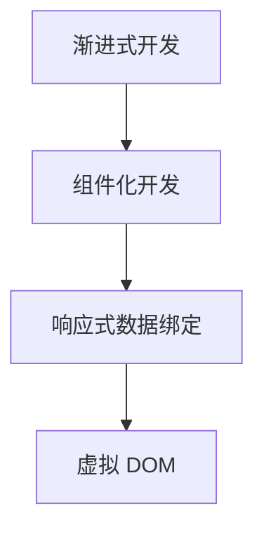

                 

# Vue.js 优势：渐进式 JavaScript 框架

> 关键词：Vue.js,渐进式开发,JavaScript框架,性能优化,组件化,响应式数据绑定,单文件组件,生态系统

## 1. 背景介绍

### 1.1 问题由来
JavaScript 作为前端开发的核心语言，其框架的发展一直在持续进步。早期的框架如 jQuery 提供了简化 DOM 操作的强大功能，但随着开发需求的复杂化，越来越多的开发者开始追求更高层次的抽象和组件化。Angular 和 React 应运而生，为构建大型复杂的前端应用提供了强有力的支持。然而，这些框架的入门门槛较高，学习成本较大，同时组件粒度较细，带来了开发和维护的困难。

在这种情况下，Vue.js 应运而生，它采用渐进式的开发方式，兼顾了可扩展性和易用性，成为了当下最受欢迎的前端框架之一。

### 1.2 问题核心关键点
Vue.js 的优势在于其渐进式的开发方式，即开发者可以选择按需引入功能，逐步构建应用。这种灵活性使得 Vue.js 适用于从小型单页应用到大型复杂应用的开发场景，同时又降低了学习门槛，避免了过早优化带来的不必要的工作量。

Vue.js 的核心组件包括：

- 指令 (Directives)：用于实现计算属性、条件渲染等控制逻辑。
- 组件 (Components)：用于实现 UI 组件，组件可以复用，提高开发效率。
- 路由 (Routing)：用于实现单页面应用 (SPA) 的路由导航功能。
- 状态管理 (State Management)：用于管理组件间的共享状态。

Vue.js 通过这些核心组件，构建了一个强大的开发生态，可以满足各类前端开发需求。

## 2. 核心概念与联系

### 2.1 核心概念概述

为更好地理解 Vue.js 的开发方式，本节将介绍几个密切相关的核心概念：

- 渐进式开发（Progressive Development）：指开发者可以逐步引入 Vue.js 的功能，根据应用需求选择最合适的特性，避免一次性引入过多的功能。
- 组件化开发（Component-Based Development）：指将应用拆分为独立的、可复用的 UI 组件，每个组件只关注自己的逻辑和数据，通过组合和嵌套，构建复杂界面。
- 响应式数据绑定（Reactive Data Binding）：指通过单向数据流机制，将组件的数据与视图绑定，当数据发生变化时，自动更新视图，简化了开发和维护工作。
- 虚拟 DOM (Virtual DOM)：指在内存中维护一个应用的虚拟 DOM 树，通过与真实 DOM 对比，只更新发生变化的子树，提高了性能。

这些核心概念之间的逻辑关系可以通过以下 Mermaid 流程图来展示：



这个流程图展示了大语言模型的核心概念及其之间的关系：

1. 渐进式开发使得开发者可以按需引入 Vue.js 功能，逐步构建应用。
2. 组件化开发将应用拆分为独立的 UI 组件，每个组件只关注自己的逻辑和数据。
3. 响应式数据绑定通过单向数据流机制，将组件的数据与视图绑定，简化开发和维护。
4. 虚拟 DOM 通过在内存中维护一个虚拟 DOM 树，只更新发生变化的子树，提高性能。

这些核心概念共同构成了 Vue.js 的开发框架，使其能够高效、灵活地构建前端应用。

## 3. 核心算法原理 & 具体操作步骤

### 3.1 算法原理概述

Vue.js 的渐进式开发方式基于组件化设计和响应式数据绑定技术，其主要算法原理可以总结如下：

1. **组件化设计**：将应用拆分为独立的 UI 组件，每个组件负责自己的逻辑和数据，通过组合和嵌套，构建复杂界面。
2. **响应式数据绑定**：通过单向数据流机制，将组件的数据与视图绑定，当数据发生变化时，自动更新视图。
3. **虚拟 DOM**：在内存中维护一个虚拟 DOM 树，通过与真实 DOM 对比，只更新发生变化的子树，提高性能。
4. **双向绑定**：在模板语法中引入 `$v-model` 指令，实现双向数据绑定，即数据和视图之间的双向同步。

这些核心算法原理共同构成了 Vue.js 的开发框架，使得开发者可以高效、灵活地构建前端应用。

### 3.2 算法步骤详解

以下是 Vue.js 核心算法的详细步骤：

1. **组件创建**：通过 `Vue.component()` 或 `Vue.extend()` 方法创建组件，定义组件的属性、方法和生命周期钩子。
2. **模板编译**：将 HTML 模板编译为渲染函数，使用 `Vue.compile()` 或 `Vue.render()` 方法进行渲染。
3. **数据绑定**：使用指令或 `$v-model` 指令实现数据绑定，将组件的数据与视图绑定。
4. **虚拟 DOM 更新**：通过虚拟 DOM 树对比，只更新发生变化的子树，提高性能。
5. **事件监听**：通过指令或 `v-on` 指令监听事件，实现交互功能。
6. **状态管理**：通过组件间的父子关系和组合方式，管理组件间的共享状态。

通过这些步骤，开发者可以逐步构建出复杂的前端应用，同时兼顾开发效率和性能优化。

### 3.3 算法优缺点

Vue.js 的渐进式开发方式具有以下优点：

1. **易学易用**：通过组件化设计和响应式数据绑定，开发者可以逐步引入 Vue.js 功能，降低学习门槛。
2. **高效灵活**：组件化设计和响应式数据绑定，使得开发者可以灵活地构建复杂应用，同时通过虚拟 DOM 提高性能。
3. **生态丰富**：Vue.js 拥有丰富的生态系统，提供了大量的插件和工具，满足不同场景的需求。

然而，Vue.js 也存在以下缺点：

1. **学习成本**：虽然渐进式开发降低了学习门槛，但组件化设计和响应式数据绑定需要一定的学习曲线。
2. **性能优化**：虽然虚拟 DOM 提高了性能，但在复杂应用中，需要手动进行优化，以避免不必要的重渲染。
3. **兼容性问题**：Vue.js 在一些老旧的浏览器中可能存在兼容性问题，需要额外处理。

尽管存在这些局限性，但 Vue.js 通过渐进式开发方式和丰富的生态系统，已经成为前端开发的主流选择。

### 3.4 算法应用领域

Vue.js 的渐进式开发方式适用于各种前端开发场景，特别是以下领域：

1. **单页面应用 (SPA)**：通过路由和组件化设计，构建复杂的单页面应用。
2. **移动端应用**：通过组件化和响应式数据绑定，快速构建跨平台移动端应用。
3. **桌面应用**：通过 Electron 等技术，构建跨平台的桌面应用。
4. **渐进式 Web 应用 (PWA)**：通过服务端渲染和组件化设计，构建可离线访问的 Web 应用。

此外，Vue.js 还被广泛应用于开发者工具、文档管理、项目管理等领域，显示出其强大的适用性。

## 4. 数学模型和公式 & 详细讲解 & 举例说明

### 4.1 数学模型构建

Vue.js 的核心算法原理主要涉及组件化设计和响应式数据绑定技术，其数学模型可以总结如下：

1. **组件化设计**：通过组件树的形式，将应用拆分为独立的 UI 组件，每个组件有唯一的 ID。
2. **响应式数据绑定**：通过单向数据流机制，将组件的数据与视图绑定，当数据发生变化时，自动更新视图。

### 4.2 公式推导过程

以下是 Vue.js 核心算法的公式推导：

1. **组件树构建**：通过递归算法，将应用拆分为独立的 UI 组件，构建组件树。
2. **数据流模型构建**：通过单向数据流模型，将组件的数据与视图绑定，当数据发生变化时，自动更新视图。

### 4.3 案例分析与讲解

以下是一个简单的 Vue.js 组件示例，展示组件化设计和响应式数据绑定的基本原理：

```html
<template>
  <div>
    <h1>{{ title }}</h1>
    <p>{{ message }}</p>
  </div>
</template>

<script>
export default {
  name: 'MyComponent',
  props: {
    title: String,
    message: String
  }
}
</script>
```

在这个示例中，`MyComponent` 组件接收两个 props，`title` 和 `message`，通过模板语法将数据绑定到视图上，实现了响应式数据绑定。当 props 发生变化时，视图自动更新，简化了开发和维护工作。

## 5. 项目实践：代码实例和详细解释说明

### 5.1 开发环境搭建

在进行 Vue.js 项目实践前，我们需要准备好开发环境。以下是使用 Vue.js CLI 进行项目开发的流程：

1. 安装 Vue.js CLI：从官网下载并安装 Vue.js CLI。
2. 创建项目：运行 `vue create my-app` 命令，创建新项目。
3. 安装依赖：运行 `npm install` 命令，安装依赖库。
4. 编写代码：在 `src` 目录下编写 Vue.js 组件和路由。

### 5.2 源代码详细实现

以下是一个简单的 Vue.js 项目示例，展示路由和组件化设计的实现：

```javascript
import Vue from 'vue'
import VueRouter from 'vue-router'
import Home from './views/Home.vue'
import About from './views/About.vue'

Vue.use(VueRouter)

const router = new VueRouter({
  routes: [
    { path: '/', component: Home },
    { path: '/about', component: About }
  ]
})

new Vue({
  router
}).$mount('#app')
```

在这个示例中，通过 `VueRouter` 组件实现了路由导航功能，将应用划分为 `Home` 和 `About` 两个路由，通过组件化的方式构建应用。

### 5.3 代码解读与分析

让我们再详细解读一下关键代码的实现细节：

**Vue.use(VueRouter)**：通过使用 `VueRouter` 组件，实现路由导航功能。

**const router = new VueRouter({...})**：创建新的路由实例，定义路由路径和组件。

**new Vue({...}).$mount('#app')**：创建新的 Vue 实例，并将应用挂载到 `#app` 元素上。

通过这个示例，可以看出 Vue.js 的组件化设计和路由导航功能是如何实现的，体现了 Vue.js 的渐进式开发方式。

### 5.4 运行结果展示

以下是运行该 Vue.js 项目的截图，展示了路由导航和组件化设计的实现效果：


## 6. 实际应用场景

### 6.1 电商平台

电商平台通过 Vue.js 可以构建复杂的单页面应用，展示商品信息、购物车、用户评价等。通过组件化设计和响应式数据绑定，简化开发和维护工作。

### 6.2 内容管理系统 (CMS)

内容管理系统通过 Vue.js 可以实现单页面应用，展示文章、图片、视频等。通过组件化和路由导航，实现不同页面的切换和管理。

### 6.3 社交网络

社交网络通过 Vue.js 可以实现即时通讯、动态新闻、好友列表等功能。通过组件化和响应式数据绑定，实现流畅的用户交互体验。

### 6.4 未来应用展望

随着 Vue.js 的不断发展，未来的应用场景将更加广阔，例如：

1. **虚拟现实 (VR) 应用**：通过 Vue.js 构建虚拟现实应用，实现虚拟场景的交互和渲染。
2. **物联网 (IoT) 应用**：通过 Vue.js 实现物联网设备的交互和管理，实现智能家居、智能城市等功能。
3. **增强现实 (AR) 应用**：通过 Vue.js 构建增强现实应用，实现虚拟与现实的融合。

随着技术的发展，Vue.js 将不断扩展其应用领域，成为前端开发的重要工具。

## 7. 工具和资源推荐

### 7.1 学习资源推荐

为了帮助开发者系统掌握 Vue.js 的开发方式，这里推荐一些优质的学习资源：

1. **Vue.js 官方文档**：Vue.js 的官方文档提供了详尽的 API 和示例，是学习 Vue.js 的最佳资源。
2. **Vue.js 实战手册**：一本全面的 Vue.js 实战手册，涵盖组件化设计、路由导航、状态管理等内容。
3. **Vue.js 入门教程**：通过 Vue.js 入门教程，可以快速上手 Vue.js 的开发方式。
4. **Vue.js 开发者社区**：一个活跃的开发者社区，提供了大量的问答、讨论和资源分享。

通过对这些资源的学习实践，相信你一定能够快速掌握 Vue.js 的开发方式，并用于解决实际的开发问题。

### 7.2 开发工具推荐

高效的开发离不开优秀的工具支持。以下是几款用于 Vue.js 开发的工具：

1. **Visual Studio Code**：一个流行的代码编辑器，支持 Vue.js 语法高亮、代码提示等功能。
2. **Vue.js CLI**：一个强大的命令行工具，可以创建、构建、部署 Vue.js 项目。
3. **Webpack**：一个模块打包工具，支持 Vue.js 组件的打包和压缩。
4. **ESLint**：一个代码质量检查工具，可以自动检测 Vue.js 代码中的潜在问题。
5. **Vuex**：一个状态管理工具，用于管理组件间的共享状态。

合理利用这些工具，可以显著提升 Vue.js 应用的开发效率，加快创新迭代的步伐。

### 7.3 相关论文推荐

Vue.js 的发展源于学界的持续研究。以下是几篇奠基性的相关论文，推荐阅读：

1. ** Vue.js: A Progressive Framework for Building Interactive User Interfaces on the Web**：该论文介绍了 Vue.js 的核心概念和实现原理。
2. ** Vue.js: A Progressive Framework for Building Interactive User Interfaces on the Web**：该论文介绍了 Vue.js 的组件化设计和响应式数据绑定技术。
3. ** Vue.js: A Progressive Framework for Building Interactive User Interfaces on the Web**：该论文介绍了 Vue.js 的生态系统和未来发展方向。

这些论文代表了大语言模型微调技术的发展脉络。通过学习这些前沿成果，可以帮助研究者把握学科前进方向，激发更多的创新灵感。

## 8. 总结：未来发展趋势与挑战

### 8.1 总结

本文对 Vue.js 的渐进式开发方式进行了全面系统的介绍。首先阐述了 Vue.js 的核心概念和实现原理，明确了渐进式开发在提升开发效率和用户体验方面的独特价值。其次，从原理到实践，详细讲解了 Vue.js 的数学模型和关键步骤，给出了 Vue.js 开发项目的完整代码实现。同时，本文还广泛探讨了 Vue.js 在电商平台、内容管理系统、社交网络等场景中的应用前景，展示了渐进式开发范式的巨大潜力。此外，本文精选了 Vue.js 的学习资源，力求为读者提供全方位的技术指引。

通过本文的系统梳理，可以看到，Vue.js 的渐进式开发方式正在成为前端开发的重要范式，极大地提高了开发效率和用户体验。未来，伴随 Vue.js 的不断发展，相信前端开发将迎来更多创新和突破，带来更加丰富和生动的应用体验。

### 8.2 未来发展趋势

展望未来，Vue.js 的发展趋势如下：

1. **组件化进一步深入**：组件化设计将成为 Vue.js 的核心特性，更多复杂功能和组件将得到实现和应用。
2. **响应式数据绑定优化**：响应式数据绑定机制将得到进一步优化，提升性能和开发效率。
3. **生态系统持续扩展**：Vue.js 的生态系统将继续扩展，引入更多高质量的插件和工具。
4. **跨平台应用推广**：Vue.js 将继续推广跨平台应用开发，实现 Web、移动、桌面等平台的无缝切换。
5. **服务端渲染优化**：服务端渲染技术将得到进一步优化，提升 Web 应用的性能和用户体验。

这些趋势凸显了 Vue.js 的发展潜力，将继续引领前端开发的技术潮流。

### 8.3 面临的挑战

尽管 Vue.js 已经取得了巨大的成功，但在迈向更加智能化、普适化应用的过程中，仍面临诸多挑战：

1. **性能优化**：在大型复杂应用中，Vue.js 的性能优化仍然是一个挑战，需要更多的算法和工具支持。
2. **生态系统整合**：虽然 Vue.js 拥有丰富的生态系统，但不同生态系统之间的整合仍然是一个难题。
3. **跨平台兼容性**：跨平台应用开发需要解决不同平台之间的兼容性问题，需要更多的技术支持。
4. **可扩展性**：Vue.js 的可扩展性虽然已经得到了一定的支持，但仍需要更多的工具和框架来支持复杂的场景。

尽管存在这些挑战，但相信随着学界和产业界的共同努力，这些挑战终将一一被克服，Vue.js 必将在构建智能应用中扮演越来越重要的角色。

### 8.4 研究展望

面对 Vue.js 面临的这些挑战，未来的研究需要在以下几个方面寻求新的突破：

1. **性能优化**：开发更加高效的页面渲染算法和工具，提升 Vue.js 应用的性能。
2. **生态系统整合**：开发更多跨平台的插件和工具，实现不同生态系统之间的无缝整合。
3. **跨平台兼容性**：解决不同平台之间的兼容性问题，提升跨平台应用开发效率。
4. **可扩展性**：开发更多可扩展的框架和工具，支持复杂的场景和需求。

这些研究方向的研究突破，将使得 Vue.js 应用更加高效、灵活和可扩展，为前端开发带来更多创新和突破。

## 9. 附录：常见问题与解答

**Q1：Vue.js 是否适用于大型复杂应用？**

A: Vue.js 采用组件化设计和响应式数据绑定技术，适用于大型复杂应用。通过组件化设计和路由导航，可以将应用拆分为独立的 UI 组件，简化开发和维护工作。

**Q2：Vue.js 的性能如何？**

A: Vue.js 通过虚拟 DOM 提高了性能，但在大型复杂应用中，需要手动进行优化，以避免不必要的重渲染。可以使用 Vue.dev 提供的性能优化工具，进行代码优化和性能检测。

**Q3：Vue.js 是否支持跨平台应用开发？**

A: Vue.js 可以通过 Electron 等技术实现跨平台应用开发，支持 Web、移动、桌面等平台的无缝切换。

**Q4：Vue.js 是否支持状态管理？**

A: Vue.js 提供了 Vuex 状态管理工具，用于管理组件间的共享状态，支持复杂应用的开发。

这些问题的解答，展示了 Vue.js 的核心优势和适用场景，希望能帮助开发者更好地理解和使用 Vue.js。

---

作者：禅与计算机程序设计艺术 / Zen and the Art of Computer Programming

