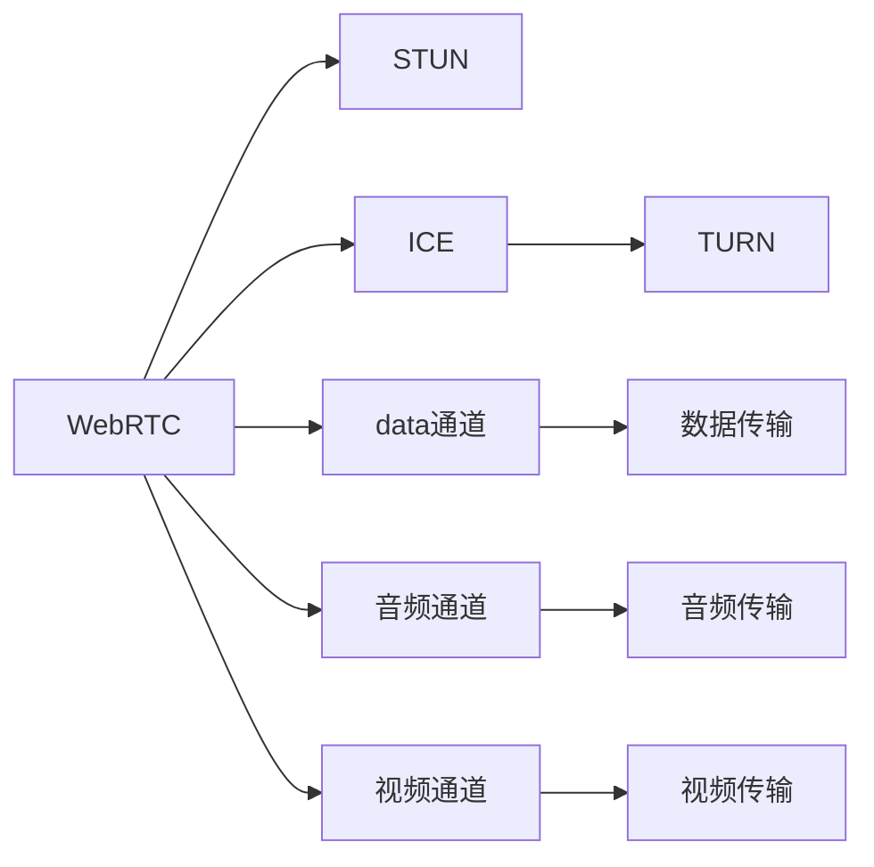

                 

# WebRTC 技术：浏览器中的实时通信

> 关键词：WebRTC, 实时通信, 浏览器, STUN, ICE, TURN, 数据通道, 音频通道, 视频通道

## 1. 背景介绍

在互联网高速发展的今天，实时通信（Real-Time Communications, RTC）已经成为人们日常生活中不可或缺的一部分。无论是视频会议、在线教育，还是远程协作，实时通信技术都扮演着至关重要的角色。传统的RTCP协议以其简单、高效的特点，被广泛应用于VoIP、WebRTC等领域。然而，随着WebRTC等新兴技术的发展，RTCP协议正在逐渐被新一代WebRTC技术所取代。

本文将系统介绍WebRTC技术及其在实时通信中的核心原理和实际应用。

## 2. 核心概念与联系

### 2.1 核心概念概述

在深入理解WebRTC技术之前，我们需要先了解一些与之相关的核心概念：

- **WebRTC**：一个基于浏览器的实时通信API，能够实现音频、视频和数据的实时传输。通过标准化的API接口，开发者能够轻松构建高质量的实时通信应用。

- **STUN**：Session Traversal Utilities for NAT（NAT traversal utility for NAT），用于解决NAT（Network Address Translation，网络地址转换）问题，帮助客户端找到互联网上的可用地址。

- **ICE**：Interactive Connectivity Establishment（交互式连接建立），用于发现并使用合适的传输路径，包括STUN和TURN（Traversal Using Relay NAT，中继NAT）技术。

- **TURN**：用于中继NAT的服务器，能够提供穿越NAT和防火墙的可靠连接，适用于WebRTC等复杂网络环境。

- **数据通道**、**音频通道**、**视频通道**：WebRTC中的三个基本传输通道，分别用于数据、音频和视频信号的传输。

### 2.2 核心概念原理和架构的 Mermaid 流程图



这个Mermaid流程图展示了WebRTC及其相关技术的核心组件和通信流程：

- 通过STUN和ICE技术，WebRTC客户端能够发现并建立连接路径。
- TURN服务器提供中继服务，用于穿越复杂的NAT和防火墙。
- 数据、音频、视频信号通过各自通道进行传输，保障实时通信质量。

## 3. 核心算法原理 & 具体操作步骤

### 3.1 算法原理概述

WebRTC的实时通信功能主要基于以下算法原理：

- **ICE算法**：通过STUN和TURN技术的协作，WebRTC客户端能够发现并建立双向通信路径。ICE算法包括两个步骤：STUN请求和TURN中继，用于寻找客户端之间的最优传输路径。
- **SRTP算法**：WebRTC使用SRTP（Secure Real-Time Transport Protocol）协议来保障传输数据的加密和完整性。SRTP算法包括加密、完整性验证和包序列号的维护等功能。
- **RTCP算法**：WebRTC使用RTCP（Real-Time Transport Control Protocol）协议进行网络流量控制和质量监测。RTCP算法包括带宽估计、丢包监测、延时监测等功能。

### 3.2 算法步骤详解

WebRTC的核心算法步骤主要包括：

**Step 1: 创建RTCPeerConnection对象**
- 通过`RTCPeerConnection`接口创建WebRTC连接对象。
- 设置本地描述（Offer或Answer）、远程描述和本地描述。

**Step 2: 生成SDP**
- 通过`createOffer`或`createAnswer`方法生成本地描述（SDP）。
- 调用`setLocalDescription`方法设置本地描述。

**Step 3: 交换SDP**
- 通过`setRemoteDescription`方法设置远程描述。
- 通过`setup`方法建立连接。

**Step 4: 建立数据通道、音频通道和视频通道**
- 创建`DataChannel`对象用于数据传输。
- 创建`RTCRtpSender`和`RTCRtpReceiver`对象用于音频和视频传输。

**Step 5: 开始传输**
- 通过`start`方法开始数据、音频和视频传输。
- 通过`onicecandidate`事件接收STUN中继候选人。
- 通过`ontrack`事件接收视频和音频流。

### 3.3 算法优缺点

WebRTC的优点主要包括：

- **浏览器原生支持**：WebRTC技术基于浏览器原生API，开发者无需依赖第三方库，减少了开发复杂度。
- **高效率**：WebRTC使用NAT穿透和STUN/TURN中继技术，能够实现高效的实时通信。
- **支持多路复用**：WebRTC支持多路复用，能够同时传输数据、音频和视频，提高了实时通信的灵活性。

WebRTC的缺点主要包括：

- **兼容性问题**：由于WebRTC的API标准不统一，不同浏览器的实现可能存在差异，需要开发者进行兼容性处理。
- **安全性问题**：WebRTC使用的SRTP加密算法在部分场景下可能被破解，需要开发者注意数据安全性。
- **资源占用**：WebRTC的实时通信功能可能会占用大量CPU和内存资源，需要开发者进行性能优化。

### 3.4 算法应用领域

WebRTC技术被广泛应用于以下领域：

- **视频会议**：如Zoom、Skype、Google Meet等，支持大规模视频会议和实时直播。
- **在线教育**：如Khan Academy、Coursera等，支持实时教学和互动。
- **远程协作**：如Slack、Teams等，支持即时消息和视频会议。
- **游戏直播**：如Twitch、YouTube等，支持实时游戏直播和观众互动。

## 4. 数学模型和公式 & 详细讲解 & 举例说明

### 4.1 数学模型构建

WebRTC的数学模型主要包括以下几个部分：

- **传输路径选择模型**：基于ICE算法，WebRTC选择最优的传输路径，包括STUN和TURN。
- **数据传输模型**：基于SRTP算法，保障数据传输的加密和完整性。
- **网络流量控制模型**：基于RTCP算法，进行带宽估计和丢包监测。

### 4.2 公式推导过程

以下是WebRTC中关键算法的数学推导过程：

**STUN算法**：
假设客户端1的公网IP地址为A，客户端2的公网IP地址为B，通过STUN请求，客户端1可以发现本地NAT的映射端口为P1，客户端2可以发现本地NAT的映射端口为P2。

$$
P1 = \text{STUN}(A)
$$
$$
P2 = \text{STUN}(B)
$$

**ICE算法**：
假设客户端1通过STUN发现本地NAT映射端口为P1，通过TURN发现远程NAT映射端口为P2，通过ICE算法，客户端1和客户端2建立了连接路径。

$$
C = P1 \cap P2
$$

**SRTP算法**：
假设客户端1和客户端2建立了一条连接路径C，数据传输过程中，WebRTC使用SRTP算法对数据进行加密和完整性验证。

$$
D = \text{SRTP}(C)
$$

**RTCP算法**：
假设客户端1和客户端2之间建立了一条连接路径C，数据传输过程中，WebRTC使用RTCP算法进行带宽估计和丢包监测。

$$
B = \text{RTCP}(C)
$$

### 4.3 案例分析与讲解

以下是一个WebRTC实现实时通信的案例：

**Step 1: 创建RTCPeerConnection对象**

```javascript
const pc = new RTCPeerConnection();
```

**Step 2: 生成SDP**

```javascript
pc.createOffer().then(function(sdpOffer) {
    pc.setLocalDescription(sdpOffer);
    // 调用getMedia()方法获取本地音频和视频流
    // 设置localDescription
});
```

**Step 3: 交换SDP**

```javascript
pc.setRemoteDescription(sdpAnswer);
```

**Step 4: 建立数据通道、音频通道和视频通道**

```javascript
pc.createDataChannel("data");
pc.createPeerConnection();
pc.createRtpSender();
pc.createRtpReceiver();
```

**Step 5: 开始传输**

```javascript
pc.onicecandidate = function(event) {
    // 处理ICE候选人的逻辑
};
pc.ontrack = function(event) {
    // 处理视频和音频流的逻辑
};
```

## 5. 项目实践：代码实例和详细解释说明

### 5.1 开发环境搭建

WebRTC的开发环境需要浏览器和相关浏览器插件的支持。以下是在Chrome浏览器中搭建WebRTC开发环境的步骤：

1. 安装Chrome浏览器。
2. 安装WebRTC开发插件。
3. 安装Node.js和npm。
4. 编写WebRTC代码。

### 5.2 源代码详细实现

以下是一个WebRTC实现实时通信的完整代码：

```javascript
// 创建RTCPeerConnection对象
const pc = new RTCPeerConnection();

// 生成SDP
pc.createOffer().then(function(sdpOffer) {
    pc.setLocalDescription(sdpOffer);
});

// 交换SDP
pc.setRemoteDescription(sdpAnswer);

// 建立数据通道、音频通道和视频通道
pc.createDataChannel("data");
pc.createPeerConnection();
pc.createRtpSender();
pc.createRtpReceiver();

// 开始传输
pc.onicecandidate = function(event) {
    // 处理ICE候选人的逻辑
};
pc.ontrack = function(event) {
    // 处理视频和音频流的逻辑
};
```

### 5.3 代码解读与分析

**RTCPeerConnection对象**：
- 用于创建和管理WebRTC连接。
- 调用`createOffer`方法生成本地描述（SDP）。
- 调用`setLocalDescription`方法设置本地描述。
- 调用`setRemoteDescription`方法设置远程描述。
- 调用`setup`方法建立连接。

**SDP（Session Description Protocol）**：
- 用于描述音频、视频和数据通道的配置信息。
- 包括`Offer`和`Answer`两种类型，用于不同的场景。
- 使用`createOffer`方法生成`Offer`。
- 使用`createAnswer`方法生成`Answer`。

**ICE候选人和STUN/TURN中继**：
- ICE算法通过STUN和TURN技术，发现并建立连接路径。
- 通过`onicecandidate`事件接收STUN中继候选人。
- 通过`ontrack`事件接收视频和音频流。

## 6. 实际应用场景

### 6.1 视频会议

WebRTC在视频会议中的应用已经非常广泛，如Zoom、Skype、Google Meet等，支持大规模视频会议和实时直播。

**实际应用场景**：

1. **视频会议**：通过WebRTC实现视频和音频的实时传输，支持多人同时参与。
2. **实时直播**：通过WebRTC实现视频和音频的实时直播，支持主播和观众互动。

**代码实现**：

```javascript
// 创建RTCPeerConnection对象
const pc = new RTCPeerConnection();

// 生成SDP
pc.createOffer().then(function(sdpOffer) {
    pc.setLocalDescription(sdpOffer);
});

// 交换SDP
pc.setRemoteDescription(sdpAnswer);

// 建立数据通道、音频通道和视频通道
pc.createDataChannel("data");
pc.createPeerConnection();
pc.createRtpSender();
pc.createRtpReceiver();

// 开始传输
pc.onicecandidate = function(event) {
    // 处理ICE候选人的逻辑
};
pc.ontrack = function(event) {
    // 处理视频和音频流的逻辑
};
```

### 6.2 在线教育

WebRTC在在线教育中的应用也非常广泛，如Khan Academy、Coursera等，支持实时教学和互动。

**实际应用场景**：

1. **实时教学**：通过WebRTC实现视频和音频的实时传输，支持教师和学生的互动。
2. **互动直播**：通过WebRTC实现视频和音频的实时直播，支持学生与教师的实时互动。

**代码实现**：

```javascript
// 创建RTCPeerConnection对象
const pc = new RTCPeerConnection();

// 生成SDP
pc.createOffer().then(function(sdpOffer) {
    pc.setLocalDescription(sdpOffer);
});

// 交换SDP
pc.setRemoteDescription(sdpAnswer);

// 建立数据通道、音频通道和视频通道
pc.createDataChannel("data");
pc.createPeerConnection();
pc.createRtpSender();
pc.createRtpReceiver();

// 开始传输
pc.onicecandidate = function(event) {
    // 处理ICE候选人的逻辑
};
pc.ontrack = function(event) {
    // 处理视频和音频流的逻辑
};
```

### 6.3 远程协作

WebRTC在远程协作中的应用也非常广泛，如Slack、Teams等，支持即时消息和视频会议。

**实际应用场景**：

1. **即时消息**：通过WebRTC实现即时消息的传输，支持团队成员之间的实时交流。
2. **视频会议**：通过WebRTC实现视频和音频的实时传输，支持多人同时参与。

**代码实现**：

```javascript
// 创建RTCPeerConnection对象
const pc = new RTCPeerConnection();

// 生成SDP
pc.createOffer().then(function(sdpOffer) {
    pc.setLocalDescription(sdpOffer);
});

// 交换SDP
pc.setRemoteDescription(sdpAnswer);

// 建立数据通道、音频通道和视频通道
pc.createDataChannel("data");
pc.createPeerConnection();
pc.createRtpSender();
pc.createRtpReceiver();

// 开始传输
pc.onicecandidate = function(event) {
    // 处理ICE候选人的逻辑
};
pc.ontrack = function(event) {
    // 处理视频和音频流的逻辑
};
```

### 6.4 游戏直播

WebRTC在游戏直播中的应用也非常广泛，如Twitch、YouTube等，支持实时游戏直播和观众互动。

**实际应用场景**：

1. **实时游戏直播**：通过WebRTC实现视频和音频的实时传输，支持主播和观众互动。
2. **观众互动**：通过WebRTC实现即时消息的传输，支持观众与主播的实时互动。

**代码实现**：

```javascript
// 创建RTCPeerConnection对象
const pc = new RTCPeerConnection();

// 生成SDP
pc.createOffer().then(function(sdpOffer) {
    pc.setLocalDescription(sdpOffer);
});

// 交换SDP
pc.setRemoteDescription(sdpAnswer);

// 建立数据通道、音频通道和视频通道
pc.createDataChannel("data");
pc.createPeerConnection();
pc.createRtpSender();
pc.createRtpReceiver();

// 开始传输
pc.onicecandidate = function(event) {
    // 处理ICE候选人的逻辑
};
pc.ontrack = function(event) {
    // 处理视频和音频流的逻辑
};
```

## 7. 工具和资源推荐

### 7.1 学习资源推荐

为了帮助开发者系统掌握WebRTC技术，这里推荐一些优质的学习资源：

1. **《WebRTC 视频教程》**：由WebRTC官方提供的视频教程，涵盖WebRTC核心概念和实现细节。
2. **《WebRTC 实战》**：由WebRTC专家编写的实战教程，结合代码示例，详细讲解WebRTC实现步骤。
3. **《WebRTC 官方文档》**：WebRTC官方文档，提供详细的API文档和示例代码。

### 7.2 开发工具推荐

WebRTC的开发工具主要包括以下几个：

1. **Chrome浏览器**：WebRTC的核心浏览器支持。
2. **WebRTC开发插件**：提供WebRTC开发所需的API和插件支持。
3. **Node.js和npm**：WebRTC开发的基础环境支持。

### 7.3 相关论文推荐

WebRTC技术的发展离不开学界的持续研究。以下是几篇奠基性的相关论文，推荐阅读：

1. **WebRTC 实时通信技术综述**：介绍WebRTC的核心原理和实现细节。
2. **WebRTC 网络传输优化**：探讨WebRTC网络传输的优化方法，提升实时通信质量。
3. **WebRTC 安全与隐私保护**：研究WebRTC的安全性和隐私保护措施。

## 8. 总结：未来发展趋势与挑战

### 8.1 研究成果总结

WebRTC技术在实时通信领域已经取得了显著的成果，主要体现在以下几个方面：

- **高性能**：通过NAT穿透和STUN/TURN中继技术，WebRTC实现了高效的实时通信。
- **低延迟**：通过实时视频和音频流传输，WebRTC提供了低延迟的实时体验。
- **高可靠性**：通过SRTP加密和RTCP控制协议，WebRTC保障了数据传输的安全性和可靠性。

### 8.2 未来发展趋势

WebRTC的未来发展趋势主要包括以下几个方面：

- **WebRTC2.0**：WebRTC 2.0协议引入了新的API和功能，如DtlsSrtpPolicy等，提升实时通信的质量和灵活性。
- **WebRTC on RDS**：WebRTC on RDS协议用于WebRTC在RDS（WebRTC on RDS）环境中的部署，提升WebRTC的兼容性和稳定性。
- **WebRTC on Edge**：WebRTC on Edge协议用于WebRTC在边缘计算环境中的部署，提升实时通信的响应速度和可靠性。

### 8.3 面临的挑战

WebRTC技术在发展过程中也面临一些挑战：

- **兼容性问题**：不同浏览器的WebRTC实现可能存在差异，需要进行兼容性处理。
- **安全性问题**：WebRTC使用的SRTP加密算法在部分场景下可能被破解，需要开发者注意数据安全性。
- **性能问题**：WebRTC的实时通信功能可能会占用大量CPU和内存资源，需要开发者进行性能优化。

### 8.4 研究展望

未来，WebRTC技术需要在以下几个方面进行深入研究：

- **WebRTC 2.0**：深入研究WebRTC 2.0协议，探索新的API和功能，提升实时通信的质量和灵活性。
- **WebRTC on RDS**：深入研究WebRTC on RDS协议，探索WebRTC在RDS环境中的部署方法，提升WebRTC的兼容性和稳定性。
- **WebRTC on Edge**：深入研究WebRTC on Edge协议，探索WebRTC在边缘计算环境中的部署方法，提升实时通信的响应速度和可靠性。

## 9. 附录：常见问题与解答

### Q1：WebRTC有哪些优缺点？

A: WebRTC的优点主要包括：

- **浏览器原生支持**：WebRTC技术基于浏览器原生API，开发者无需依赖第三方库，减少了开发复杂度。
- **高效率**：WebRTC使用NAT穿透和STUN/TURN中继技术，能够实现高效的实时通信。
- **支持多路复用**：WebRTC支持多路复用，能够同时传输数据、音频和视频，提高了实时通信的灵活性。

WebRTC的缺点主要包括：

- **兼容性问题**：由于WebRTC的API标准不统一，不同浏览器的实现可能存在差异，需要开发者进行兼容性处理。
- **安全性问题**：WebRTC使用的SRTP加密算法在部分场景下可能被破解，需要开发者注意数据安全性。
- **资源占用**：WebRTC的实时通信功能可能会占用大量CPU和内存资源，需要开发者进行性能优化。

### Q2：如何使用WebRTC进行实时通信？

A: 使用WebRTC进行实时通信的步骤主要包括：

1. 创建RTCPeerConnection对象。
2. 生成SDP。
3. 交换SDP。
4. 建立数据通道、音频通道和视频通道。
5. 开始传输。

具体的代码实现可以参考本文档的5.2节。

### Q3：WebRTC在实际应用中有哪些典型场景？

A: WebRTC在实际应用中的典型场景主要包括：

1. **视频会议**：如Zoom、Skype、Google Meet等，支持大规模视频会议和实时直播。
2. **在线教育**：如Khan Academy、Coursera等，支持实时教学和互动。
3. **远程协作**：如Slack、Teams等，支持即时消息和视频会议。
4. **游戏直播**：如Twitch、YouTube等，支持实时游戏直播和观众互动。

具体的代码实现可以参考本文档的6.1、6.2、6.3、6.4节。

---

作者：禅与计算机程序设计艺术 / Zen and the Art of Computer Programming

