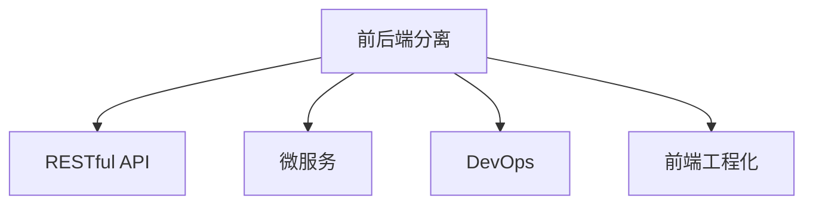

                 

# Web前后端分离架构设计与实现

> 关键词：前后端分离, Web前端, Web后端, 架构设计, 微服务, RESTful API

## 1. 背景介绍

### 1.1 问题由来

Web应用是当今互联网时代最重要的交互形式之一，无论是电商、社交、媒体、教育还是金融，大多互联网应用都是通过Web实现。Web应用分为前端和后端，前端主要负责交互界面的展示和数据操作，后端主要负责业务逻辑的实现和数据的管理。

随着互联网应用的规模不断扩大，传统的"一体化"Web应用架构已经难以满足需求，前端和后端之间的交互变得越来越复杂。前端需要向后端传递越来越多的请求，后端需要向前端返回越来越复杂的数据。这种"一体化"架构导致了代码难以维护、系统扩展性差、部署难度高等问题。

Web前后端分离（Separated Frontend and Backend）架构模式通过将前端和后端分离，将复杂度进行拆分，提升系统的开发效率、可维护性和扩展性。本文将系统介绍Web前后端分离架构的设计与实现方法。

### 1.2 问题核心关键点

Web前后端分离架构的核心在于将前端和后端的功能进行合理拆分，通过API进行通信，提升系统开发效率、可维护性和扩展性。其关键点包括：

1. 前端和后端的分离：将业务逻辑、数据管理等核心功能放在后端，将界面展示、用户交互等功能放在前端。
2. API的设计与实现：前后端通过RESTful API进行通信，API设计要符合无状态、语义化、可缓存等原则。
3. 前后端协作流程：明确前后端的工作流程，优化API调用方式，提升交互效率。
4. 数据传递与渲染：后端将数据以JSON格式返回，前端根据API返回的数据进行渲染。

## 2. 核心概念与联系

### 2.1 核心概念概述

为更好地理解Web前后端分离架构，本节将介绍几个密切相关的核心概念：

- **前后端分离(Separated Frontend and Backend)**：将前端和后端的功能进行分离，前端负责界面展示和用户交互，后端负责业务逻辑和数据管理，两者通过API进行通信。
- **RESTful API**：一种基于HTTP的Web服务架构风格，符合无状态、语义化、可缓存等原则，常用于Web前后端分离架构中。
- **微服务(Microservice)**：将大应用拆分为多个小型服务，每个服务独立部署，提升系统扩展性和可维护性。
- **DevOps**：将开发与运维工作紧密结合，提升系统开发效率和质量，缩短交付周期。
- **前端工程化(Frontend Engineering)**：通过代码分割、模块化、自动化测试等技术提升前端开发效率和质量。

这些核心概念之间的逻辑关系可以通过以下Mermaid流程图来展示：



这个流程图展示了几大核心概念之间的联系：

1. 前后端分离通过RESTful API与微服务、DevOps、前端工程化等技术紧密结合，提升系统的开发效率、可维护性和扩展性。
2. RESTful API是前后端分离架构的核心，提供前后端通信的基础。
3. 微服务可以与前后端分离架构相结合，提升系统灵活性和可扩展性。
4. DevOps可以优化前后端分离架构的持续集成和持续部署流程，提升开发效率。
5. 前端工程化可以提高前端代码的质量和可维护性，提升开发效率。

## 3. 核心算法原理 & 具体操作步骤

### 3.1 算法原理概述

Web前后端分离架构的核心原理是通过API进行前后端的通信，前端的展示层与后端的业务逻辑层分离，提升系统开发效率、可维护性和扩展性。

具体来说，Web前后端分离架构通过以下步骤实现：

1. 将业务逻辑层和数据管理层放在后端，将界面展示和用户交互层放在前端。
2. 在前端和后端之间设计RESTful API接口，约定数据格式和操作方式。
3. 前端通过API向后端发送请求，获取数据并进行展示渲染。
4. 后端通过API接收前端请求，处理业务逻辑并返回数据。

### 3.2 算法步骤详解

以下详细介绍Web前后端分离架构的详细步骤：

**Step 1: 分离业务逻辑和数据管理层**

将业务逻辑和数据管理放在后端，提升系统的可维护性和扩展性。具体做法是：

1. 使用现代开发语言和框架，如Java、Node.js、Spring Boot、Express.js等，实现后端逻辑。
2. 设计数据库表结构和关系，使用ORM框架，如Hibernate、Sequelize等，进行数据管理。
3. 设计API接口，约定数据格式和操作方式。

**Step 2: 设计RESTful API接口**

RESTful API是Web前后端分离架构的核心，前后端通过API进行通信。具体做法是：

1. 定义API接口，约定数据格式、操作方式和权限控制。
2. 使用路由框架，如Spring MVC、Express.js等，实现API接口。
3. 使用API网关，如Kong、Zuul等，管理API接口和服务。

**Step 3: 实现前端展示层**

前端展示层负责界面的展示和用户交互，具体做法是：

1. 使用现代前端开发框架，如React、Vue.js、Angular等，实现前端展示层。
2. 设计前端页面和组件，使用前端框架的组件化特性，提升开发效率。
3. 设计数据渲染逻辑，根据API返回的数据进行展示渲染。

**Step 4: 前后端协作**

前后端协作是Web前后端分离架构的关键，具体做法是：

1. 明确前后端的工作流程，定义API调用方式和数据格式。
2. 设计前后端接口文档，使用工具如Swagger、Postman等，进行接口管理。
3. 使用DevOps工具，如Jenkins、GitLab CI等，进行自动化测试和部署。

### 3.3 算法优缺点

Web前后端分离架构具有以下优点：

1. 提升系统开发效率：前后端分离将前端和后端的开发分离，提升开发效率。
2. 提升系统可维护性：前后端分离将前后端的功能进行分离，提升系统可维护性。
3. 提升系统扩展性：前后端分离通过API进行通信，提升系统的扩展性。

同时，Web前后端分离架构也存在一定的局限性：

1. 前后端协作复杂：前后端分离增加了前后端协作的复杂度，需要明确接口调用方式和数据格式。
2. API接口设计复杂：API接口设计需要考虑数据格式、操作方式和权限控制，设计复杂。
3. 需要前后端团队合作：前后端分离需要前后端团队紧密合作，才能实现良好的系统开发和维护。

### 3.4 算法应用领域

Web前后端分离架构在Web应用中广泛应用，适用于以下场景：

1. 电商平台：电商平台需要同时支持前端展示和后端业务逻辑，前后端分离可以提升开发效率和系统可维护性。
2. 社交媒体：社交媒体需要同时支持前端界面展示和后端消息推送，前后端分离可以提升系统扩展性和稳定性。
3. 在线教育：在线教育需要同时支持前端课程展示和后端学生管理，前后端分离可以提升系统开发效率和可维护性。
4. 医疗健康：医疗健康需要同时支持前端数据展示和后端数据管理，前后端分离可以提升系统可扩展性和安全性。

## 4. 数学模型和公式 & 详细讲解 & 举例说明

### 4.1 数学模型构建

Web前后端分离架构的数学模型主要涉及到API接口的设计和前后端协作的流程。以下通过数学语言进行详细描述：

**API接口设计**：

假设有一个简单的Web应用，其API接口如下：

- GET /users：获取用户列表
- POST /users：创建新用户
- GET /users/{id}：获取指定用户
- PUT /users/{id}：更新指定用户
- DELETE /users/{id}：删除指定用户

其中，/users接口用于管理用户数据，每个接口返回的数据格式如下：

- users：JSON格式的数组，每个用户对象包含id、name、email等属性。

**前后端协作流程**：

假设用户在客户端点击了添加用户的按钮，客户端发送请求到服务器端：

- 客户端发送POST请求到/users接口，请求体为JSON格式的用户数据。
- 服务器端接收到请求，调用后端业务逻辑层，创建新用户并返回id。
- 服务器端发送JSON格式的数据到客户端，客户端展示新添加的用户信息。

通过以上数学模型，可以看出API接口设计前后端协作的流程，从而明确了前后端的工作方式。

### 4.2 公式推导过程

以下是API接口设计的公式推导过程：

假设用户的JSON格式数据如下：

```json
{
  "name": "张三",
  "email": "zhangsan@example.com"
}
```

则该数据可以表示为向量 $\vec{u}$：

$$
\vec{u} = (name, email)
$$

服务器端创建新用户的业务逻辑可以表示为函数 $f$，该函数接受用户数据向量 $\vec{u}$ 作为输入，返回用户ID：

$$
id = f(\vec{u})
$$

则最终的API接口设计可以表示为：

$$
POST /users
\rightarrow \vec{u} \rightarrow f(\vec{u}) \rightarrow id \rightarrow JSON
$$

其中，箭头表示数据流向，JSON表示数据格式。通过以上公式推导，可以看出API接口设计的前后端协作流程。

### 4.3 案例分析与讲解

以下通过具体案例来分析Web前后端分离架构的应用：

**案例1: 电商平台商品管理**

假设有一个电商平台，其Web应用采用前后端分离架构。具体实现如下：

- 前端展示商品列表和商品详情页面。
- 后端管理商品数据，包括添加、修改、删除商品。
- 前端通过API接口向后端请求商品数据，并展示在页面上。

**案例2: 在线教育学习管理系统**

假设有一个在线教育平台，其Web应用采用前后端分离架构。具体实现如下：

- 前端展示课程列表、课程详情、学生列表、学生详情页面。
- 后端管理课程数据、学生数据和用户权限。
- 前端通过API接口向后端请求课程数据、学生数据和用户权限，并展示在页面上。

通过以上案例分析，可以看出前后端分离架构在Web应用中的广泛应用。

## 5. 项目实践：代码实例和详细解释说明

### 5.1 开发环境搭建

在进行Web前后端分离架构实践前，我们需要准备好开发环境。以下是使用Java Spring Boot和Vue.js进行前后端分离架构开发的环境配置流程：

1. 安装Java JDK：从官网下载并安装Java JDK，环境变量配置如下：

```bash
export JAVA_HOME=/usr/lib/jvm/java-11-openjdk-amd64
export PATH=$PATH:$JAVA_HOME/bin
```

2. 安装Maven：从官网下载并安装Maven，环境变量配置如下：

```bash
export MAVEN_HOME=/usr/share/maven
export PATH=$PATH:$MAVEN_HOME/bin
```

3. 安装Node.js和npm：从官网下载并安装Node.js，环境变量配置如下：

```bash
export PATH=$PATH:/usr/lib/node_modules/npm/bin
```

4. 安装Vue.js：使用npm安装Vue.js，项目结构如下：

```
vue-project/
├── src/
│   ├── main.js
│   ├── App.vue
│   ├── router
│   └── views/
├── package.json
├── webpack.config.js
└── index.html
```

5. 配置Spring Boot项目：

```bash
mvn archetype:generate -DgroupId=com.example -DartifactId=vue-backend -DarchetypeArtifactId=maven-archetype-quickstart
```

### 5.2 源代码详细实现

下面我们以电商平台商品管理为例，给出使用Spring Boot和Vue.js进行Web前后端分离架构的代码实现。

**后端实现**：

1. 定义商品数据模型：

```java
@Entity
public class Product {
    @Id
    @GeneratedValue(strategy = GenerationType.IDENTITY)
    private Long id;
    private String name;
    private String description;
    private Double price;
    // getter和setter方法
}
```

2. 定义商品数据存储类：

```java
@Component
public class ProductService {
    @Autowired
    private ProductRepository productRepository;
    
    public List<Product> getAllProducts() {
        return productRepository.findAll();
    }
    
    public Product getProductById(Long id) {
        return productRepository.findById(id).orElse(null);
    }
    
    public Product saveProduct(Product product) {
        return productRepository.save(product);
    }
    
    public void deleteProduct(Long id) {
        productRepository.deleteById(id);
    }
}
```

3. 定义API接口：

```java
@RestController
@RequestMapping("/api")
public class ProductController {
    @Autowired
    private ProductService productService;
    
    @GetMapping("/products")
    public List<Product> getAllProducts() {
        return productService.getAllProducts();
    }
    
    @GetMapping("/product/{id}")
    public Product getProductById(@PathVariable Long id) {
        return productService.getProductById(id);
    }
    
    @PostMapping("/product")
    public Product saveProduct(@RequestBody Product product) {
        return productService.saveProduct(product);
    }
    
    @DeleteMapping("/product/{id}")
    public void deleteProduct(@PathVariable Long id) {
        productService.deleteProduct(id);
    }
}
```

**前端实现**：

1. 定义商品数据模型：

```javascript
export default {
    name: "",
    description: "",
    price: 0.0
}
```

2. 定义商品列表和详情组件：

```vue
<template>
    <div>
        <h2>商品列表</h2>
        <ul>
            <li v-for="(product, index) in products" :key="index">
                {{ product.name }} - ${{ product.price }}
            </li>
        </ul>
        <h2>商品详情</h2>
        <p>{{ product.name }}</p>
        <p>{{ product.description }}</p>
        <p>{{ product.price }}</p>
    </div>
</template>

<script>
export default {
    name: "ProductList",
    props: {
        products: {
            type: Array,
            required: true
        }
    }
}
</script>
```

3. 定义API接口调用：

```javascript
const axios = require('axios');

export default {
    name: 'ProductList',
    data() {
        return {
            products: []
        }
    },
    mounted() {
        axios.get('/api/products').then(response => {
            this.products = response.data;
        }).catch(error => {
            console.log(error);
        });
    }
}
```

### 5.3 代码解读与分析

让我们再详细解读一下关键代码的实现细节：

**后端实现**：

1. **商品数据模型**：定义了商品实体类，包含了商品的基本属性和对应的数据表结构。
2. **商品数据存储类**：定义了商品服务的业务逻辑，包括获取所有商品、根据ID获取商品、保存商品和删除商品等操作。
3. **API接口**：定义了RESTful API接口，包括获取所有商品、根据ID获取商品、保存商品和删除商品等操作。

**前端实现**：

1. **商品数据模型**：定义了商品数据模型，包含了商品的基本属性和对应的显示格式。
2. **商品列表和详情组件**：定义了商品列表和详情组件，通过Vue.js的组件化特性，提升开发效率。
3. **API接口调用**：定义了API接口的调用，使用axios库进行数据获取，并在组件中进行展示渲染。

## 6. 实际应用场景

### 6.1 智能客服系统

基于Web前后端分离架构，可以构建智能客服系统，提升客户服务效率和客户满意度。具体实现如下：

1. 后端管理客户数据和客服对话数据。
2. 后端根据客户输入的问题，通过API向后端发送请求，获取最佳答复。
3. 后端返回答复，前端展示在客服页面上，供客户查看。

### 6.2 在线教育学习管理系统

基于Web前后端分离架构，可以构建在线教育学习管理系统，提升在线教育的管理效率和学习体验。具体实现如下：

1. 后端管理课程数据、学生数据和用户权限。
2. 后端根据学生的操作请求，通过API向后端发送请求，获取学生数据和课程数据。
3. 后端返回数据，前端展示在学生页面上，供学生查看和管理。

### 6.3 电商平台商品管理

基于Web前后端分离架构，可以构建电商平台商品管理功能，提升商品管理的效率和准确性。具体实现如下：

1. 后端管理商品数据和订单数据。
2. 后端根据前端的操作请求，通过API向后端发送请求，获取商品数据和订单数据。
3. 后端返回数据，前端展示在商品页面和订单页面上，供用户查看和管理。

### 6.4 未来应用展望

随着Web前后端分离架构的不断发展，其在Web应用中的应用将更加广泛，为Web应用带来更多的创新和突破。

1. 前端工程化：前端工程化技术的发展将进一步提升Web应用的开发效率和质量。
2. 微服务架构：微服务架构的发展将进一步提升Web应用的扩展性和可维护性。
3. DevOps文化：DevOps文化的普及将进一步提升Web应用的开发效率和质量。
4. 人工智能技术：人工智能技术的发展将进一步提升Web应用的功能和用户体验。

## 7. 工具和资源推荐

### 7.1 学习资源推荐

为了帮助开发者系统掌握Web前后端分离架构的理论基础和实践技巧，这里推荐一些优质的学习资源：

1. **《Web前后端分离架构实战》系列博文**：由大前端技术专家撰写，深入浅出地介绍了Web前后端分离架构的原理、实现和应用，帮助开发者掌握Web前后端分离架构的核心技术和实践经验。

2. **《Web开发实战》系列课程**：由知名Web开发专家开设的在线课程，涵盖Web前后端分离架构、React、Vue.js、Spring Boot等Web开发技术，帮助开发者全面掌握Web开发技能。

3. **《RESTful API设计与实现》书籍**：介绍RESTful API设计和实现的经典书籍，详细讲解了RESTful API的核心概念、设计原则和实现技巧，帮助开发者设计高效、可扩展的RESTful API。

4. **《Web开发最佳实践》博客**：涵盖Web开发最佳实践的博客，提供Web前后端分离架构、DevOps、前端工程化等技术的学习资源，帮助开发者提升开发效率和系统质量。

5. **《Spring Boot实战》书籍**：介绍Spring Boot实战应用的经典书籍，涵盖Spring Boot开发、Spring MVC、Spring Boot RESTful API等技术，帮助开发者掌握Spring Boot框架。

通过对这些资源的学习实践，相信你一定能够快速掌握Web前后端分离架构的理论基础和实践技巧，并用于解决实际的Web开发问题。

### 7.2 开发工具推荐

高效的开发离不开优秀的工具支持。以下是几款用于Web前后端分离架构开发的常用工具：

1. **Visual Studio Code**：免费的轻量级代码编辑器，支持丰富的插件和扩展，适合Web前后端分离架构开发。
2. **IntelliJ IDEA**：功能强大的Java IDE，支持Spring Boot、Spring MVC等框架，适合Java后端开发。
3. **Postman**：流行的API测试工具，支持多种API协议和测试方法，适合Web前后端分离架构中的API接口测试。
4. **Swagger**：流行的API文档工具，支持自动生成API文档，适合Web前后端分离架构中的API接口文档管理。
5. **Webpack**：流行的前端打包工具，支持模块化开发、代码分割等特性，适合Web前端开发。

合理利用这些工具，可以显著提升Web前后端分离架构的开发效率，加快创新迭代的步伐。

### 7.3 相关论文推荐

Web前后端分离架构的发展源于学界的持续研究。以下是几篇奠基性的相关论文，推荐阅读：

1. **《RESTful Web服务架构设计》**：介绍RESTful Web服务架构设计的经典论文，详细讲解了RESTful Web服务架构的核心概念和设计原则。

2. **《Web前后端分离架构的挑战与解决方案》**：分析Web前后端分离架构面临的挑战，提出解决方案，帮助开发者解决实际开发中的问题。

3. **《微服务架构设计与实现》**：介绍微服务架构设计与实现的经典论文，详细讲解了微服务架构的核心概念和设计原则。

4. **《DevOps文化与实践》**：介绍DevOps文化的经典论文，详细讲解了DevOps文化与实践的核心概念和实施方法。

5. **《Web前端工程化实践》**：介绍Web前端工程化实践的经典论文，详细讲解了Web前端工程化的核心技术和实践经验。

这些论文代表了大前端架构的发展脉络。通过学习这些前沿成果，可以帮助研究者把握学科前进方向，激发更多的创新灵感。

## 8. 总结：未来发展趋势与挑战

### 8.1 总结

本文对Web前后端分离架构进行了全面系统的介绍。首先阐述了Web前后端分离架构的研究背景和意义，明确了前后端分离架构在提升系统开发效率、可维护性和扩展性方面的独特价值。其次，从原理到实践，详细讲解了Web前后端分离架构的数学模型、API接口设计和前后端协作流程，给出了Web前后端分离架构的完整代码实例。同时，本文还广泛探讨了Web前后端分离架构在智能客服、在线教育、电商平台等领域的实际应用前景，展示了Web前后端分离架构的巨大潜力。此外，本文精选了Web前后端分离架构的学习资源、开发工具和相关论文，力求为读者提供全方位的技术指引。

通过本文的系统梳理，可以看出，Web前后端分离架构正成为Web应用的重要范式，极大地提升了Web应用的开发效率、可维护性和扩展性。Web前后端分离架构在大规模、复杂系统的开发和维护中发挥了重要作用，成为现代Web应用开发的标准配置。未来，伴随Web前后端分离架构的不断演进，相信Web应用必将在更广阔的领域大放异彩，深刻影响人类的生产生活方式。

### 8.2 未来发展趋势

展望未来，Web前后端分离架构将呈现以下几个发展趋势：

1. **前端工程化**：前端工程化技术的发展将进一步提升Web应用的开发效率和质量。通过代码分割、模块化、自动化测试等技术，前端开发将更加高效、可维护。
2. **微服务架构**：微服务架构的发展将进一步提升Web应用的扩展性和可维护性。通过将大应用拆分为多个小型服务，微服务架构将提升系统灵活性和可扩展性。
3. **DevOps文化**：DevOps文化的普及将进一步提升Web应用的开发效率和质量。通过持续集成和持续部署(CI/CD)，DevOps文化将提升系统开发效率和质量。
4. **人工智能技术**：人工智能技术的发展将进一步提升Web应用的功能和用户体验。通过将人工智能技术融入Web应用，Web应用将具备更强的智能能力和用户交互能力。
5. **前端与后端的深度融合**：前端与后端的深度融合将进一步提升Web应用的功能和用户体验。通过将前端与后端技术深度融合，Web应用将具备更强的用户交互能力和业务逻辑处理能力。

以上趋势凸显了Web前后端分离架构的广阔前景。这些方向的探索发展，必将进一步提升Web应用的功能和用户体验，为Web应用的未来发展带来新的突破。

### 8.3 面临的挑战

尽管Web前后端分离架构已经取得了瞩目成就，但在迈向更加智能化、普适化应用的过程中，它仍面临着诸多挑战：

1. **前后端协作复杂**：前后端分离增加了前后端协作的复杂度，需要明确接口调用方式和数据格式。
2. **API接口设计复杂**：API接口设计需要考虑数据格式、操作方式和权限控制，设计复杂。
3. **性能问题**：Web前后端分离架构对性能要求较高，需要优化前后端的性能，提升用户体验。
4. **安全性问题**：Web前后端分离架构需要考虑安全性问题，如跨站请求伪造、SQL注入等攻击。
5. **可维护性问题**：Web前后端分离架构需要考虑可维护性问题，如代码质量、开发文档等。

这些挑战需要开发者在实际应用中不断优化和改进，以提升Web前后端分离架构的性能和可维护性。

### 8.4 研究展望

面对Web前后端分离架构所面临的挑战，未来的研究需要在以下几个方面寻求新的突破：

1. **前端工程化技术**：前端工程化技术的发展将进一步提升Web应用的开发效率和质量。通过代码分割、模块化、自动化测试等技术，前端开发将更加高效、可维护。
2. **微服务架构**：微服务架构的发展将进一步提升Web应用的扩展性和可维护性。通过将大应用拆分为多个小型服务，微服务架构将提升系统灵活性和可扩展性。
3. **DevOps文化**：DevOps文化的普及将进一步提升Web应用的开发效率和质量。通过持续集成和持续部署(CI/CD)，DevOps文化将提升系统开发效率和质量。
4. **人工智能技术**：人工智能技术的发展将进一步提升Web应用的功能和用户体验。通过将人工智能技术融入Web应用，Web应用将具备更强的智能能力和用户交互能力。
5. **前端与后端的深度融合**：前端与后端的深度融合将进一步提升Web应用的功能和用户体验。通过将前端与后端技术深度融合，Web应用将具备更强的用户交互能力和业务逻辑处理能力。

这些研究方向的发展，将进一步提升Web前后端分离架构的功能和用户体验，为Web应用的未来发展带来新的突破。

## 9. 附录：常见问题与解答

**Q1：Web前后端分离架构是否适用于所有Web应用？**

A: Web前后端分离架构适用于大多数Web应用，特别是对于数据量大、业务逻辑复杂的Web应用。但对于一些特定领域的Web应用，如在线游戏、实时通信等，可能需要特殊的架构设计。

**Q2：如何选择合适的后端语言和框架？**

A: 选择合适的后端语言和框架需要考虑应用的业务场景和需求。常用的后端语言有Java、Node.js、Python等，常用的框架有Spring Boot、Express.js、Django等。可以根据应用的特点选择适合的语言和框架。

**Q3：前端和后端如何协作？**

A: 前端和后端协作需要明确接口调用方式和数据格式。通常通过RESTful API进行通信，使用Swagger等工具进行接口管理。同时，前后端协作需要良好的文档记录和沟通机制。

**Q4：如何优化Web前后端分离架构的性能？**

A: 优化Web前后端分离架构的性能可以从以下几个方面入手：
1. 使用缓存技术，减少API调用次数。
2. 使用异步编程模型，提升系统响应速度。
3. 使用CDN技术，加速静态资源加载。
4. 使用压缩技术，减少数据传输量。

这些优化方法可以帮助提升Web前后端分离架构的性能和用户体验。

**Q5：如何提高Web前后端分离架构的安全性？**

A: 提高Web前后端分离架构的安全性需要考虑以下几个方面：
1. 使用HTTPS协议，保障数据传输的安全性。
2. 使用跨站请求伪造(CSRF)防护技术，防止跨站请求攻击。
3. 使用SQL注入防护技术，防止SQL注入攻击。
4. 使用OAuth 2.0等认证机制，保障用户身份的安全性。

这些措施可以帮助提升Web前后端分离架构的安全性，保障系统的稳定性和安全性。

