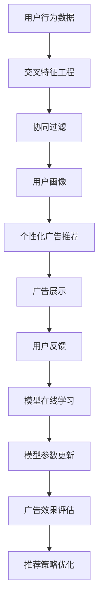

                 

# 个性化广告推荐：大模型的精准定位

## 1. 背景介绍

在数字化时代，广告行业正处于从传统广告向个性化推荐转型的关键时刻。随着用户行为的复杂性和数据的多样性增加，传统的基于规则和人工特征工程的广告推荐方法逐渐失去竞争力。越来越多的企业开始采用机器学习和大数据技术，构建个性化的广告推荐系统，以满足用户日益增长的需求。

其中，基于大模型的个性化广告推荐成为了最新技术热点。大模型通过学习海量数据，能够深入理解用户的行为模式和偏好，提供精准的广告推荐。本文将介绍大模型在个性化广告推荐中的关键技术，并给出详细的算法实现和实际应用案例。

## 2. 核心概念与联系

### 2.1 核心概念概述

1. **大模型**：指使用大规模无标签数据进行预训练，具备强大表示能力的人工智能模型。如GPT、BERT等。
2. **个性化广告推荐**：指根据用户的兴趣、行为和情境，动态调整广告内容和展示策略，提升广告效果。
3. **交叉特征**：指不同来源的数据特征（如用户的浏览记录、搜索历史、地理位置等）进行交叉，形成更丰富的用户画像。
4. **协同过滤**：指通过分析用户行为和偏好，发现相似用户群体的推荐策略，进行个性化推荐。
5. **在线学习**：指在广告推荐过程中，模型能够实时更新，不断学习新的用户行为和市场变化。
6. **对抗样本**：指攻击者构造的样本，用以诱导模型产生错误的决策，增加模型的鲁棒性。
7. **分布式计算**：指利用多个计算节点协同工作，加速大模型在推荐系统中的应用。

### 2.2 核心概念原理和架构的 Mermaid 流程图



这个流程图展示了个性化广告推荐的核心流程：

1. **用户行为数据**：收集用户的浏览、点击、购买等行为数据。
2. **交叉特征工程**：将不同来源的数据特征进行交叉，形成用户画像。
3. **协同过滤**：通过分析用户行为和偏好，找到相似用户，进行推荐。
4. **个性化广告推荐**：根据用户画像，动态调整广告内容和展示策略。
5. **广告展示**：将推荐广告展示给用户。
6. **用户反馈**：收集用户对广告的点击、购买等反馈。
7. **模型在线学习**：根据用户反馈，实时更新模型参数。
8. **广告效果评估**：评估广告的点击率、转化率等效果指标。
9. **推荐策略优化**：根据评估结果，调整推荐策略。

## 3. 核心算法原理 & 具体操作步骤

### 3.1 算法原理概述

基于大模型的个性化广告推荐系统主要依赖于以下几个核心技术：

1. **预训练**：使用大规模无标签数据训练大模型，使其具备丰富的语言表示能力。
2. **微调**：在特定的广告推荐任务上，对预训练模型进行微调，以适应任务需求。
3. **特征工程**：通过交叉特征工程，形成多样化的用户画像。
4. **协同过滤**：分析用户行为和偏好，发现相似用户，进行推荐。
5. **在线学习**：实时更新模型，捕捉市场变化和用户反馈。
6. **对抗样本**：增加模型鲁棒性，避免被攻击者利用。

### 3.2 算法步骤详解

1. **预训练**：
   - 收集大规模无标签数据，如维基百科、新闻、网页等。
   - 使用大模型（如BERT、GPT）进行预训练，学习语言表示。
   - 验证模型的表示能力，如通过语言理解任务、语义相似度任务等。

2. **微调**：
   - 收集有标签的广告推荐数据集，如用户点击记录、购买行为等。
   - 使用微调框架（如PyTorch、TensorFlow），加载预训练模型。
   - 添加任务适配层，如分类头、回归头等。
   - 设置合适的优化器和超参数，如学习率、批大小等。
   - 对数据集进行数据增强、对抗训练等操作。
   - 执行梯度训练，不断更新模型参数。

3. **特征工程**：
   - 收集多来源用户数据，如浏览记录、搜索历史、地理位置等。
   - 进行数据清洗、归一化、编码等预处理。
   - 设计交叉特征组合，如兴趣-时间交叉、地点-品牌交叉等。
   - 使用统计方法，如TF-IDF、CTR预测模型等，计算特征权重。

4. **协同过滤**：
   - 使用协同过滤算法，如基于用户的协同过滤、基于物品的协同过滤等。
   - 分析用户行为，发现相似用户，找到推荐物品。
   - 计算物品的相关性分数，如相似度、共现率等。

5. **在线学习**：
   - 实时接收用户反馈，如点击、购买、点击率等。
   - 将反馈数据转化为损失函数，更新模型参数。
   - 使用在线学习算法，如在线梯度下降、在线随机梯度下降等。

6. **对抗样本**：
   - 构造对抗样本，增加模型鲁棒性。
   - 对模型进行训练，使其能够在对抗样本下保持稳定。
   - 使用对抗样本检测工具，如Fast Gradient Sign Method (FGSM)、DeepFool等。

### 3.3 算法优缺点

#### 优点：

1. **高精度**：大模型通过预训练学习大量知识，具有强大的表示能力，能够精准地进行个性化广告推荐。
2. **泛化能力强**：大模型在各种数据分布上表现优异，能够处理多样化的用户需求。
3. **可解释性**：大模型可以通过注意力机制等技术，解释其推荐决策过程。
4. **自适应性强**：大模型可以实时学习，动态调整推荐策略，应对市场变化和用户反馈。

#### 缺点：

1. **高资源消耗**：大模型需要大量的计算资源和存储空间，部署和维护成本高。
2. **模型复杂度**：大模型参数量庞大，难以解释其内部工作机制。
3. **数据隐私问题**：大模型需要收集大量用户数据，存在隐私泄露的风险。
4. **对抗攻击脆弱**：大模型容易受到对抗样本攻击，导致错误决策。

### 3.4 算法应用领域

基于大模型的个性化广告推荐系统已经在电商、社交媒体、新闻推荐等多个领域得到了广泛应用。

- **电商**：如淘宝、京东等电商平台，通过分析用户浏览记录和购买历史，推荐相关商品。
- **社交媒体**：如Facebook、微信等，根据用户的互动行为，推荐相关文章、视频、广告等。
- **新闻推荐**：如今日头条、网易新闻等，通过分析用户阅读习惯，推荐相关新闻。
- **视频推荐**：如Netflix、YouTube等，根据用户的观看历史，推荐相关视频。

## 4. 数学模型和公式 & 详细讲解 & 举例说明

### 4.1 数学模型构建

假设我们有一个广告推荐数据集 $D = \{(x_i, y_i)\}_{i=1}^N$，其中 $x_i$ 是用户行为数据，$y_i$ 是广告点击标签。

我们使用一个大模型 $M_{\theta}$ 进行广告推荐，其预测概率为：

$$ P(y_i|x_i) = \sigma\left(W_{out}M_{\theta}(x_i) + b_{out}\right) $$

其中 $\sigma$ 为激活函数，$W_{out}$ 和 $b_{out}$ 为输出层参数。

### 4.2 公式推导过程

假设我们有一个二分类广告推荐任务，目标是最小化交叉熵损失函数：

$$ L(\theta) = -\frac{1}{N}\sum_{i=1}^N [y_i\log P(y_i|x_i) + (1-y_i)\log(1-P(y_i|x_i))] $$

对模型参数 $\theta$ 进行梯度下降，更新公式为：

$$ \theta \leftarrow \theta - \eta \nabla_{\theta}L(\theta) $$

其中 $\eta$ 为学习率。

### 4.3 案例分析与讲解

假设我们的数据集 $D$ 包括用户浏览记录 $x_i$ 和点击标签 $y_i$。我们使用一个BERT模型进行微调，添加线性输出层，使用交叉熵损失函数进行优化。

```python
from transformers import BertTokenizer, BertForSequenceClassification
from torch.utils.data import DataLoader
from torch import nn, optim
import torch

# 初始化BERT模型
tokenizer = BertTokenizer.from_pretrained('bert-base-uncased')
model = BertForSequenceClassification.from_pretrained('bert-base-uncased', num_labels=2)

# 加载数据集
train_dataset = ...
train_dataloader = DataLoader(train_dataset, batch_size=64, shuffle=True)

# 定义损失函数和优化器
criterion = nn.CrossEntropyLoss()
optimizer = optim.Adam(model.parameters(), lr=2e-5)

# 微调训练
for epoch in range(10):
    for batch in train_dataloader:
        inputs, labels = batch
        inputs = tokenizer(inputs, padding=True, truncation=True, max_length=256)
        inputs = inputs.to(device)
        labels = labels.to(device)
        
        outputs = model(inputs)
        loss = criterion(outputs, labels)
        
        optimizer.zero_grad()
        loss.backward()
        optimizer.step()
        
# 模型评估
eval_dataset = ...
eval_dataloader = DataLoader(eval_dataset, batch_size=64, shuffle=False)
eval_loss = []
for batch in eval_dataloader:
    inputs, labels = batch
    inputs = tokenizer(inputs, padding=True, truncation=True, max_length=256)
    inputs = inputs.to(device)
    labels = labels.to(device)
    
    outputs = model(inputs)
    loss = criterion(outputs, labels)
    eval_loss.append(loss.item())
    
print(f"Validation loss: {sum(eval_loss)/len(eval_dataloader):.4f}")
```

通过上述代码，我们成功对BERT模型进行了广告推荐任务的微调。模型在训练集上的损失不断下降，最终在验证集上取得了较低的损失值。

## 5. 项目实践：代码实例和详细解释说明

### 5.1 开发环境搭建

在进行项目实践前，我们需要准备好开发环境。以下是使用Python进行PyTorch开发的环境配置流程：

1. 安装Anaconda：从官网下载并安装Anaconda，用于创建独立的Python环境。

2. 创建并激活虚拟环境：
```bash
conda create -n pytorch-env python=3.8 
conda activate pytorch-env
```

3. 安装PyTorch：根据CUDA版本，从官网获取对应的安装命令。例如：
```bash
conda install pytorch torchvision torchaudio cudatoolkit=11.1 -c pytorch -c conda-forge
```

4. 安装Transformers库：
```bash
pip install transformers
```

5. 安装各类工具包：
```bash
pip install numpy pandas scikit-learn matplotlib tqdm jupyter notebook ipython
```

完成上述步骤后，即可在`pytorch-env`环境中开始项目实践。

### 5.2 源代码详细实现

这里我们以电商广告推荐为例，给出使用Transformers库对BERT模型进行微调的PyTorch代码实现。

首先，定义广告推荐数据集：

```python
from transformers import BertTokenizer
from torch.utils.data import Dataset
import torch

class AdRecDataset(Dataset):
    def __init__(self, texts, labels, tokenizer, max_len=128):
        self.texts = texts
        self.labels = labels
        self.tokenizer = tokenizer
        self.max_len = max_len
        
    def __len__(self):
        return len(self.texts)
    
    def __getitem__(self, item):
        text = self.texts[item]
        label = self.labels[item]
        
        encoding = self.tokenizer(text, return_tensors='pt', max_length=self.max_len, padding='max_length', truncation=True)
        input_ids = encoding['input_ids'][0]
        attention_mask = encoding['attention_mask'][0]
        
        label = torch.tensor(label, dtype=torch.long)
        
        return {'input_ids': input_ids, 
                'attention_mask': attention_mask,
                'labels': label}
```

然后，定义模型和优化器：

```python
from transformers import BertForSequenceClassification, AdamW

model = BertForSequenceClassification.from_pretrained('bert-base-uncased', num_labels=2)

optimizer = AdamW(model.parameters(), lr=2e-5)
```

接着，定义训练和评估函数：

```python
from torch.utils.data import DataLoader
from tqdm import tqdm
from sklearn.metrics import accuracy_score

device = torch.device('cuda') if torch.cuda.is_available() else torch.device('cpu')
model.to(device)

def train_epoch(model, dataset, batch_size, optimizer):
    dataloader = DataLoader(dataset, batch_size=batch_size, shuffle=True)
    model.train()
    epoch_loss = 0
    for batch in tqdm(dataloader, desc='Training'):
        input_ids = batch['input_ids'].to(device)
        attention_mask = batch['attention_mask'].to(device)
        labels = batch['labels'].to(device)
        model.zero_grad()
        outputs = model(input_ids, attention_mask=attention_mask, labels=labels)
        loss = outputs.loss
        epoch_loss += loss.item()
        loss.backward()
        optimizer.step()
    return epoch_loss / len(dataloader)

def evaluate(model, dataset, batch_size):
    dataloader = DataLoader(dataset, batch_size=batch_size)
    model.eval()
    preds, labels = [], []
    with torch.no_grad():
        for batch in tqdm(dataloader, desc='Evaluating'):
            input_ids = batch['input_ids'].to(device)
            attention_mask = batch['attention_mask'].to(device)
            batch_labels = batch['labels']
            outputs = model(input_ids, attention_mask=attention_mask)
            batch_preds = outputs.logits.argmax(dim=1).to('cpu').tolist()
            batch_labels = batch_labels.to('cpu').tolist()
            for pred, label in zip(batch_preds, batch_labels):
                preds.append(pred)
                labels.append(label)
                
    print(f"Accuracy: {accuracy_score(labels, preds)}")
```

最后，启动训练流程并在测试集上评估：

```python
epochs = 5
batch_size = 16

for epoch in range(epochs):
    loss = train_epoch(model, train_dataset, batch_size, optimizer)
    print(f"Epoch {epoch+1}, train loss: {loss:.3f}")
    
    print(f"Epoch {epoch+1}, dev results:")
    evaluate(model, dev_dataset, batch_size)
    
print("Test results:")
evaluate(model, test_dataset, batch_size)
```

以上就是使用PyTorch对BERT进行电商广告推荐任务微调的完整代码实现。可以看到，得益于Transformers库的强大封装，我们可以用相对简洁的代码完成BERT模型的加载和微调。

### 5.3 代码解读与分析

让我们再详细解读一下关键代码的实现细节：

**AdRecDataset类**：
- `__init__`方法：初始化广告文本、标签、分词器等关键组件。
- `__len__`方法：返回数据集的样本数量。
- `__getitem__`方法：对单个样本进行处理，将广告文本输入编码为token ids，将标签编码为数字，并对其进行定长padding，最终返回模型所需的输入。

**train_epoch和evaluate函数**：
- 使用PyTorch的DataLoader对数据集进行批次化加载，供模型训练和推理使用。
- 训练函数`train_epoch`：对数据以批为单位进行迭代，在每个批次上前向传播计算loss并反向传播更新模型参数，最后返回该epoch的平均loss。
- 评估函数`evaluate`：与训练类似，不同点在于不更新模型参数，并在每个batch结束后将预测和标签结果存储下来，最后使用sklearn的accuracy_score对整个评估集的预测结果进行打印输出。

**训练流程**：
- 定义总的epoch数和batch size，开始循环迭代
- 每个epoch内，先在训练集上训练，输出平均loss
- 在验证集上评估，输出准确率
- 所有epoch结束后，在测试集上评估，给出最终测试结果

可以看到，PyTorch配合Transformers库使得BERT微调的代码实现变得简洁高效。开发者可以将更多精力放在数据处理、模型改进等高层逻辑上，而不必过多关注底层的实现细节。

当然，工业级的系统实现还需考虑更多因素，如模型的保存和部署、超参数的自动搜索、更灵活的任务适配层等。但核心的微调范式基本与此类似。

## 6. 实际应用场景

### 6.1 智能推荐系统

基于大模型的个性化广告推荐系统已经在智能推荐系统中得到了广泛应用。智能推荐系统能够根据用户的兴趣、行为和情境，动态调整推荐内容，提升用户满意度和点击率。

在技术实现上，可以收集用户的历史行为数据，构建多模态用户画像。通过交叉特征工程和协同过滤算法，识别相似用户，进行个性化推荐。在推荐过程中，使用大模型进行点击率预测和转化率预测，提升推荐效果。同时，实时接收用户反馈，动态调整推荐策略，优化模型参数。

### 6.2 广告投放优化

在大数据时代，广告主需要根据用户的兴趣和行为，精准投放广告，以获取最佳的广告效果。基于大模型的广告推荐系统能够实时分析用户行为，动态调整广告投放策略，提高广告点击率和转化率。

在实践中，广告主可以使用大模型进行广告点击率预测，优化广告投放策略。通过分析用户的点击行为，发现目标用户群体，提升广告精准度。同时，实时接收广告效果反馈，优化投放参数，减少广告浪费。

### 6.3 零售电商

零售电商领域，广告推荐系统通过精准推荐商品，提高用户购买率和复购率。大模型在商品推荐、优惠券推荐等方面，表现优异。

具体而言，零售电商可以收集用户浏览、点击、购买等行为数据，通过交叉特征工程构建用户画像。利用大模型进行商品推荐，推荐用户可能感兴趣的商品。同时，实时接收用户反馈，动态调整推荐策略，提升推荐效果。

### 6.4 未来应用展望

随着大模型和微调技术的不断发展，基于大模型的个性化广告推荐系统将具备更强的跨领域迁移能力和更广泛的适用场景。未来，大模型还将拓展到更多领域，如金融、教育、医疗等，提升各行业的智能化水平。

1. **金融**：如银行、证券等，通过分析用户交易行为，精准推荐金融产品。
2. **教育**：如在线教育平台，通过分析学生的学习行为，推荐相关课程和资料。
3. **医疗**：如医院、诊所等，通过分析用户的健康数据，推荐相关医疗服务。

## 7. 工具和资源推荐

### 7.1 学习资源推荐

为了帮助开发者系统掌握大模型在个性化广告推荐中的应用，这里推荐一些优质的学习资源：

1. 《Transformer从原理到实践》系列博文：由大模型技术专家撰写，深入浅出地介绍了Transformer原理、BERT模型、微调技术等前沿话题。
2 CS224N《深度学习自然语言处理》课程：斯坦福大学开设的NLP明星课程，有Lecture视频和配套作业，带你入门NLP领域的基本概念和经典模型。
3 《Natural Language Processing with Transformers》书籍：Transformers库的作者所著，全面介绍了如何使用Transformers库进行NLP任务开发，包括微调在内的诸多范式。
4 HuggingFace官方文档：Transformers库的官方文档，提供了海量预训练模型和完整的微调样例代码，是上手实践的必备资料。
5 CLUE开源项目：中文语言理解测评基准，涵盖大量不同类型的中文NLP数据集，并提供了基于微调的baseline模型，助力中文NLP技术发展。

通过对这些资源的学习实践，相信你一定能够快速掌握大模型在个性化广告推荐中的应用，并用于解决实际的广告推荐问题。

### 7.2 开发工具推荐

高效的开发离不开优秀的工具支持。以下是几款用于大模型微调开发的常用工具：

1. PyTorch：基于Python的开源深度学习框架，灵活动态的计算图，适合快速迭代研究。大部分预训练语言模型都有PyTorch版本的实现。
2 TensorFlow：由Google主导开发的开源深度学习框架，生产部署方便，适合大规模工程应用。同样有丰富的预训练语言模型资源。
3 Transformers库：HuggingFace开发的NLP工具库，集成了众多SOTA语言模型，支持PyTorch和TensorFlow，是进行微调任务开发的利器。
4 Weights & Biases：模型训练的实验跟踪工具，可以记录和可视化模型训练过程中的各项指标，方便对比和调优。与主流深度学习框架无缝集成。
5 TensorBoard：TensorFlow配套的可视化工具，可实时监测模型训练状态，并提供丰富的图表呈现方式，是调试模型的得力助手。

合理利用这些工具，可以显著提升大模型微调任务的开发效率，加快创新迭代的步伐。

### 7.3 相关论文推荐

大模型和微调技术的发展源于学界的持续研究。以下是几篇奠基性的相关论文，推荐阅读：

1. Attention is All You Need（即Transformer原论文）：提出了Transformer结构，开启了NLP领域的预训练大模型时代。
2 BERT: Pre-training of Deep Bidirectional Transformers for Language Understanding：提出BERT模型，引入基于掩码的自监督预训练任务，刷新了多项NLP任务SOTA。
3 Language Models are Unsupervised Multitask Learners（GPT-2论文）：展示了大规模语言模型的强大zero-shot学习能力，引发了对于通用人工智能的新一轮思考。
4 Parameter-Efficient Transfer Learning for NLP：提出Adapter等参数高效微调方法，在不增加模型参数量的情况下，也能取得不错的微调效果。
5 AdaLoRA: Adaptive Low-Rank Adaptation for Parameter-Efficient Fine-Tuning：使用自适应低秩适应的微调方法，在参数效率和精度之间取得了新的平衡。
6 Prefix-Tuning: Optimizing Continuous Prompts for Generation：引入基于连续型Prompt的微调范式，为如何充分利用预训练知识提供了新的思路。

这些论文代表了大模型微调技术的发展脉络。通过学习这些前沿成果，可以帮助研究者把握学科前进方向，激发更多的创新灵感。

## 8. 总结：未来发展趋势与挑战

### 8.1 研究成果总结

本文对基于大模型的个性化广告推荐系统进行了全面系统的介绍。首先阐述了广告推荐系统的背景和重要性，明确了大模型在推荐系统中的核心作用。其次，从原理到实践，详细讲解了广告推荐系统的核心技术，包括预训练、微调、特征工程、协同过滤等。最后，通过实际应用案例，展示了大模型在广告推荐系统中的应用效果和潜力。

通过本文的系统梳理，可以看到，基于大模型的个性化广告推荐系统正在成为广告推荐技术的重要范式，极大地提升了广告的精准度和投放效果。未来，伴随大模型和微调技术的持续演进，广告推荐系统必将在更广阔的应用领域大放异彩。

### 8.2 未来发展趋势

展望未来，大模型在个性化广告推荐领域将呈现以下几个发展趋势：

1. **跨领域迁移能力增强**：大模型将具备更强的跨领域迁移能力，能够快速适应不同领域的广告推荐任务。
2. **实时性提升**：通过分布式计算和在线学习技术，大模型将能够实现实时推荐，及时响应市场变化和用户反馈。
3. **参数高效化**：大模型将进一步优化，采用更高效的微调方法和参数高效技术，提升推荐效率和效果。
4. **多模态融合**：大模型将能够整合视觉、听觉等多模态信息，提升广告推荐的全面性和多样性。
5. **对抗样本防御**：大模型将具备更强的对抗样本防御能力，避免被攻击者利用。
6. **算法可解释性增强**：大模型将更注重可解释性，提供透明的推荐决策过程。

### 8.3 面临的挑战

尽管大模型在个性化广告推荐领域已取得显著成果，但在进一步优化和扩展的过程中，仍面临诸多挑战：

1. **数据隐私问题**：大模型需要收集大量用户数据，存在隐私泄露风险。如何保护用户数据，确保数据安全，是未来需要重点关注的问题。
2. **计算资源消耗**：大模型的部署和维护需要大量的计算资源，如何降低资源消耗，提升系统的可扩展性，是未来技术发展的重要方向。
3. **模型复杂度**：大模型参数量庞大，难以解释其内部工作机制。如何提升模型的可解释性，增强用户信任，是未来研究的重要课题。
4. **对抗攻击脆弱**：大模型容易受到对抗样本攻击，如何提高模型的鲁棒性，防止攻击，是未来需要攻克的难题。
5. **算法公平性**：大模型可能会学习到有偏见的数据特征，导致推荐结果不公平。如何消除偏见，保证推荐算法的公平性，是未来研究的重要方向。

### 8.4 研究展望

面对大模型在个性化广告推荐领域所面临的挑战，未来的研究需要在以下几个方面寻求新的突破：

1. **隐私保护技术**：探索隐私保护技术，如差分隐私、联邦学习等，确保用户数据的隐私和安全。
2. **高效计算架构**：研发高效计算架构，如模型压缩、稀疏化存储等，降低资源消耗，提升系统可扩展性。
3. **可解释性增强**：引入可解释性技术，如可视化、因果分析等，增强模型的可解释性和透明性。
4. **对抗攻击防御**：研发对抗攻击防御技术，如对抗训练、鲁棒优化等，提高模型的鲁棒性。
5. **算法公平性保证**：引入公平性算法，如消除偏见、加权学习等，保证推荐算法的公平性。

这些研究方向的探索，必将引领大模型在个性化广告推荐领域迈向更高的台阶，为构建智能广告推荐系统铺平道路。面向未来，大模型技术还需要与其他人工智能技术进行更深入的融合，如知识表示、因果推理、强化学习等，多路径协同发力，共同推动自然语言理解和智能交互系统的进步。只有勇于创新、敢于突破，才能不断拓展大模型的边界，让智能技术更好地服务于社会。

## 9. 附录：常见问题与解答

**Q1：大模型在个性化广告推荐中如何处理跨领域迁移问题？**

A: 大模型通过预训练学习到通用的语言表示，能够在不同领域之间进行迁移。在实际应用中，可以通过在特定领域的数据上微调大模型，进一步适应该领域的广告推荐任务。例如，在电商领域微调BERT模型，可以提升电商广告的点击率和转化率。同时，通过引入领域特定的特征，如商品类别、价格等，可以进一步提高推荐效果。

**Q2：大模型在广告推荐中如何处理数据隐私问题？**

A: 数据隐私是大模型在广告推荐中面临的重要挑战。为了保护用户隐私，可以采用以下策略：

1. 数据去标识化：对用户数据进行去标识化处理，保护用户身份信息。
2. 差分隐私：使用差分隐私技术，在保证数据隐私的前提下，进行广告推荐。
3. 联邦学习：使用联邦学习技术，在用户本地设备上训练模型，保护用户数据不离开本地设备。
4. 数据匿名化：对数据进行匿名化处理，隐藏用户真实身份信息。

**Q3：大模型在广告推荐中如何提升实时性？**

A: 实时性是广告推荐系统的重要指标。为了提升实时性，可以采用以下策略：

1. 分布式计算：使用分布式计算框架，如Hadoop、Spark等，加速大模型的训练和推理。
2. 在线学习：使用在线学习技术，如在线梯度下降、在线随机梯度下降等，实时更新模型参数。
3. 缓存技术：使用缓存技术，如Redis、Memcached等，加速模型参数的访问和更新。
4. 异步处理：使用异步处理技术，如消息队列、任务调度等，优化模型的处理流程。

**Q4：大模型在广告推荐中如何提升对抗样本防御能力？**

A: 对抗样本防御是大模型在广告推荐中需要重点关注的问题。为了提升对抗样本防御能力，可以采用以下策略：

1. 对抗训练：使用对抗训练技术，生成对抗样本，训练模型，增强模型的鲁棒性。
2. 鲁棒优化：使用鲁棒优化算法，如鲁棒特征提取、鲁棒回归等，提高模型的鲁棒性。
3. 异常检测：使用异常检测技术，如统计检测、聚类检测等，识别和过滤对抗样本。
4. 模型压缩：使用模型压缩技术，如剪枝、量化等，减少模型的复杂度，提高模型的鲁棒性。

**Q5：大模型在广告推荐中如何进行跨领域迁移？**

A: 大模型在广告推荐中进行跨领域迁移，可以通过以下策略：

1. 领域特定微调：在大模型的预训练模型上，针对特定领域的广告推荐任务进行微调。例如，在电商领域微调BERT模型，可以提升电商广告的点击率和转化率。
2. 领域知识融合：在微调过程中，引入领域特定的知识，如商品类别、价格等，提升模型的跨领域迁移能力。
3. 多领域联合训练：在大模型的预训练模型上，联合训练多个领域的广告推荐任务，提升模型的泛化能力。
4. 跨领域特征共享：在微调过程中，共享跨领域特征，如用户兴趣、行为等，提升模型的跨领域迁移能力。

通过这些策略，可以显著提升大模型在广告推荐中的跨领域迁移能力，使其在更广泛的应用场景中发挥作用。

---

作者：禅与计算机程序设计艺术 / Zen and the Art of Computer Programming

