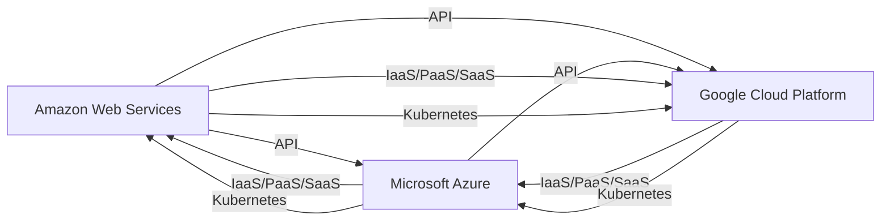

                 

# 云计算技术：AWS、Azure和GCP平台比较

> 关键词：云计算,AWS,Azure,GCP,云服务,云基础设施,云安全,云架构,云迁移

## 1. 背景介绍

云计算作为现代企业信息化的重要基础设施，已经广泛应用于各类业务场景。云计算提供了弹性的资源、丰富的服务、完善的管理和高效的数据处理能力，极大地降低了企业IT系统的建设和运维成本，提升了系统稳定性和响应速度。而作为全球三大主流云服务商，AWS、Azure和GCP在云服务的技术积累、产品成熟度、市场占有率、合作伙伴生态等方面各具特色。本文将通过比较这三个平台的特征和优势，帮助读者全面理解云计算领域的现状和趋势，辅助企业在云资源采购、项目选择、平台迁移等场景中做出科学合理的决策。

## 2. 核心概念与联系

### 2.1 核心概念概述

云计算技术是指通过互联网提供可弹性伸缩的计算资源，包括CPU、存储、内存、网络和数据库等。云计算技术可以按需提供，以匹配企业业务负载的变化。AWS、Azure和GCP是全球三大主要的云计算平台，均提供云计算基础设施、应用程序和平台服务，用于构建和管理各种云应用。

### 2.2 核心概念原理和架构的 Mermaid 流程图



该图展示了AWS、Azure和GCP平台的核心架构和相互关系。AWS、Azure和GCP都是基于IaaS（基础设施即服务）构建的云平台，提供各种PaaS（平台即服务）和SaaS（软件即服务）功能，支持Kubernetes等容器编排工具，能够实现跨云的资源共享和应用程序迁移。AWS、Azure和GCP在云服务的技术体系、产品功能、生态伙伴、市场策略等方面各有特点。

## 3. 核心算法原理 & 具体操作步骤

### 3.1 算法原理概述

云平台的建设基于大规模的分布式系统架构，以确保资源的弹性和可靠性。其核心原理包括：

1. **分布式存储与计算**：采用分布式文件系统和分布式计算框架，如Hadoop、Spark等，实现海量数据的存储和计算。
2. **弹性扩展**：通过容器编排和自动伸缩技术，实现资源的弹性伸缩，满足动态变化的业务需求。
3. **多租户隔离**：采用虚拟化和容器化技术，实现不同客户之间的资源隔离和隔离，保障客户数据安全。
4. **高可用性**：采用冗余设计和负载均衡技术，保障系统的高可用性，实现故障自动切换。

### 3.2 算法步骤详解

以AWS为例，云计算平台的核心操作步骤包括：

1. **初始化云账户**：在AWS、Azure和GCP官网注册云账户，设置相应的安全凭证和权限。
2. **选择云服务**：根据企业需求，选择合适的云服务，如EC2、Azure虚拟机、GKE等。
3. **配置资源**：在云平台上配置计算、存储、网络等资源，包括设置虚拟机类型、存储容量、网络接口等。
4. **安装应用程序**：通过云平台提供的工具或自定义脚本，安装和部署应用程序。
5. **应用监控和管理**：使用云平台提供的监控和管理工具，如AWS CloudWatch、Azure Monitor、GCP Stackdriver等，监控应用程序性能和资源使用情况。
6. **数据备份和恢复**：定期备份数据，并使用快照或备份工具恢复数据。

### 3.3 算法优缺点

AWS、Azure和GCP平台各有优缺点：

**AWS**：
- **优点**：
  - 市场占有率最高，生态系统最完善，有丰富的第三方插件和工具。
  - 支持全球最大的数据中心网络，网络带宽和延迟有优势。
  - 提供最丰富的服务，涵盖从基础设施到应用程序的各个层面。
- **缺点**：
  - 定价复杂，缺乏明确性。
  - 全球性扩展和本地法规的限制较多。

**Azure**：
- **优点**：
  - 融合了微软生态，易于与企业现有系统集成，如Active Directory、Office 365等。
  - 提供了丰富的PaaS服务，如Azure SQL Database、Azure Cosmos DB等。
  - 提供混合云和边缘计算解决方案，支持Azure IoT等新兴技术。
- **缺点**：
  - 在全球市场上的影响力略低于AWS和GCP，部分服务功能不全面。
  - 合作伙伴生态相对较少。

**GCP**：
- **优点**：
  - 原生支持Kubernetes，与Google其他云服务深度整合，管理便捷。
  - 支持大数据、人工智能、机器学习等前沿技术，如Dataflow、AI Platform等。
  - 在内存、GPU、TPU等高性能计算资源方面优势显著。
- **缺点**：
  - 市场份额较小，整体生态和工具配套不够完善。
  - 在某些功能上不如AWS和Azure强大，如直接数据存储等。

### 3.4 算法应用领域

AWS、Azure和GCP在各种云应用场景中都有广泛的应用，具体包括：

- **云存储**：AWS S3、Azure Blob Storage、GCS。
- **云数据库**：AWS RDS、Azure SQL Database、GCP Cloud SQL。
- **云计算和虚拟机**：AWS EC2、Azure Virtual Machines、GCP Compute Engine。
- **云网络**：AWS VPC、Azure Virtual Network、GCP VPC。
- **云安全**：AWS Identity and Access Management (IAM)、Azure Active Directory (AAD)、GCP IAM。
- **云容器**：AWS ECS、Azure Kubernetes Service (AKS)、GCP Kubernetes Engine (GKE)。
- **云分析与机器学习**：AWS Sagemaker、Azure Machine Learning、GCP AI Platform。

## 4. 数学模型和公式 & 详细讲解 & 举例说明

### 4.1 数学模型构建

云计算的成本模型主要涉及以下几个方面：

1. **资源成本**：如CPU、存储、内存、带宽等。
2. **运维成本**：如网络带宽、数据备份、安全性等。
3. **服务成本**：如云服务提供商的抽成费用。

设：
- $C_{total}$ 表示总成本
- $C_{resource}$ 表示资源成本
- $C_{maintenance}$ 表示运维成本
- $C_{service}$ 表示服务成本
- $q$ 表示资源用量

则数学模型为：

$$C_{total} = C_{resource} + C_{maintenance} + C_{service}$$

### 4.2 公式推导过程

在上述公式中，$C_{resource}$、$C_{maintenance}$ 和 $C_{service}$ 均为非线性函数，可以通过定价策略计算得出。

**AWS定价模型**：

- **按需计算**：
  - $C_{resource} = q \times \text{单位资源价格}$
- **预留计算**：
  - $C_{resource} = \text{预留成本} + (q-\text{预留容量}) \times \text{单位资源价格}$
- **转换优化**：
  - $C_{resource} = \text{优化成本} + q \times \text{优化价格}$
- **优先级和性能优化**：
  - $C_{resource} = \text{性能优化成本} + q \times \text{优化价格}$

**Azure定价模型**：

- **按需计算**：
  - $C_{resource} = q \times \text{单位资源价格}$
- **预留计算**：
  - $C_{resource} = \text{预留成本} + (q-\text{预留容量}) \times \text{单位资源价格}$
- **性能优化**：
  - $C_{resource} = \text{优化成本} + q \times \text{优化价格}$

**GCP定价模型**：

- **按需计算**：
  - $C_{resource} = q \times \text{单位资源价格}$
- **预留计算**：
  - $C_{resource} = \text{预留成本} + (q-\text{预留容量}) \times \text{单位资源价格}$
- **性能优化**：
  - $C_{resource} = \text{优化成本} + q \times \text{优化价格}$

### 4.3 案例分析与讲解

以**AWS EC2**为例，其按需计算和预留计算的价格如下：

- **按需计算**：
  - $C_{resource} = q \times \text{按需价格}$
- **预留计算**：
  - $C_{resource} = \text{预留费用} + (q-\text{预留容量}) \times \text{按需价格}$
  - 其中 $\text{预留容量}$ 表示预留的计算资源量。

在业务量波动较大的情况下，预留计算可以显著降低成本，但如果业务量超出预留容量，仍然需要支付按需计算的溢出费用。因此，需要根据实际情况选择预留容量和计算资源的使用策略。

## 5. 项目实践：代码实例和详细解释说明

### 5.1 开发环境搭建

在AWS、Azure和GCP上搭建云资源的基本步骤如下：

1. **创建云账户**：注册并激活AWS、Azure或GCP的云账户，申请所需的访问权限。
2. **配置IAM用户和角色**：为云账户创建IAM用户和角色，设置相应的权限，如管理员、开发者等。
3. **安装和管理工具**：安装AWS CLI、Azure CLI、gcloud等管理工具，并通过工具登录云平台。
4. **配置云资源**：使用AWS Console、Azure Portal或gcloud命令行，配置云资源，如虚拟机、存储、网络等。
5. **安装应用程序**：通过云平台提供的资源服务，安装和部署应用程序，如MySQL数据库、Web应用等。
6. **配置负载均衡和安全**：为应用程序配置负载均衡和安全组等网络资源，确保系统稳定运行。

### 5.2 源代码详细实现

以在AWS上使用EC2实例为例，使用Python和Boto3库实现程序化管理。

**安装Boto3**：

```bash
pip install boto3
```

**实例代码**：

```python
import boto3

# 初始化EC2客户端
ec2 = boto3.client('ec2', region_name='us-west-2')

# 创建EC2实例
response = ec2.run_instances(
    ImageId='ami-0c94855ba95c71c99',
    InstanceType='t2.micro',
    KeyName='my_key_pair'
)

# 输出实例ID
print(response['Instances'][0]['InstanceId'])
```

**代码解释**：
- `ec2 = boto3.client('ec2', region_name='us-west-2')`：初始化EC2客户端，指定Region为'us-west-2'。
- `response = ec2.run_instances(...)`：创建EC2实例，指定AMI ID和实例类型，并使用指定的密钥。
- `print(response['Instances'][0]['InstanceId'])`：输出创建的实例ID。

### 5.3 代码解读与分析

以上代码使用了Python的Boto3库来创建AWS EC2实例。Boto3是AWS提供的Python SDK，提供了一系列的API接口，用于访问和管理AWS资源。

代码中首先初始化EC2客户端，指定Region，然后调用`run_instances`方法创建EC2实例，其中包含AMI ID和Instance Type等参数。最后，输出创建的实例ID，验证实例创建成功。

### 5.4 运行结果展示

运行以上代码，会得到创建的EC2实例的ID，表示实例创建成功。

```bash
i-0123456789abcdef0
```

## 6. 实际应用场景

### 6.1 企业级云平台迁移

企业在进行云平台迁移时，需要考虑诸多因素，包括数据迁移、应用迁移、服务中断等。云计算提供商提供了多种迁移工具和服务，如AWS Database Migration Service、Azure Database Migration Service、GCP Data Migration Service等，用于支持数据库、应用程序等系统的迁移。

**案例**：某大型企业从本地数据中心迁移到AWS云平台，使用AWS Database Migration Service迁移了MySQL数据库。

1. **评估迁移需求**：评估本地数据库与目标云平台的数据库兼容性、数据量等需求。
2. **规划迁移策略**：根据评估结果，制定迁移策略，包括数据复制、数据转换、数据加载等步骤。
3. **实施迁移**：使用AWS Database Migration Service，按照迁移策略进行数据迁移。
4. **测试和优化**：在目标云平台上测试新环境，确保系统稳定运行，并优化性能。

通过以上步骤，企业完成了从本地数据中心到AWS云平台的迁移，大大降低了IT系统的建设和运维成本，提升了系统的弹性和可靠性。

### 6.2 高可用性云计算解决方案

云计算平台提供了多种高可用性解决方案，如自动伸缩、弹性负载均衡、灾备等，帮助企业构建可靠的应用系统。

**案例**：某电商企业使用AWS的自动伸缩和弹性负载均衡服务，构建了高可用性的购物网站。

1. **配置自动伸缩**：设置自动伸缩组，根据业务流量自动扩展或缩减EC2实例数量。
2. **配置负载均衡**：使用AWS ELB（Elastic Load Balancer），实现流量分发和负载均衡，保障系统性能。
3. **配置灾备**：使用AWS RDS Multi-AZ部署，保障数据库的高可用性和数据备份。

通过以上步骤，电商企业实现了购物网站的自动化扩展和弹性负载均衡，提升了系统的稳定性和用户体验。

### 6.3 跨云数据迁移

随着云计算市场的竞争加剧，越来越多的企业开始选择跨云迁移数据，以优化资源利用和降低成本。云计算提供商提供了多种跨云数据迁移工具和服务，如AWS Direct Connect、Azure ExpressRoute、GCP Interconnect等，用于支持跨云网络互联。

**案例**：某大型金融企业从AWS迁移到Azure云平台，使用Azure ExpressRoute实现跨云网络互联。

1. **配置ExpressRoute**：在AWS和Azure上分别配置ExpressRoute，实现云平台之间的网络连接。
2. **配置路由策略**：设置路由策略，将流量引导到目标云平台。
3. **迁移数据**：使用Azure Data Migration Service，将AWS RDS数据库迁移到Azure SQL Database。
4. **测试和优化**：在目标云平台上测试新环境，确保系统稳定运行，并优化性能。

通过以上步骤，企业完成了从AWS到Azure的跨云迁移，提升了系统的可靠性和扩展性，降低了资源成本。

## 7. 工具和资源推荐

### 7.1 学习资源推荐

为了帮助读者全面掌握云计算技术，以下是推荐的几项学习资源：

1. **AWS认证课程**：
   - **AWS Certified Solutions Architect**：了解AWS架构和设计原则。
   - **AWS Certified Developer**：掌握AWS开发和部署技能。

2. **Azure认证课程**：
   - **Microsoft Certified: Azure Solutions Architect Expert**：熟悉Azure架构设计和管理。
   - **Microsoft Certified: Azure Developer Associate**：掌握Azure开发和部署技能。

3. **GCP认证课程**：
   - **Google Cloud Professional Cloud Architect**：了解GCP架构和设计原则。
   - **Google Cloud Professional Data Engineer**：掌握GCP数据处理和分析技能。

4. **官方文档和博客**：
   - **AWS官方文档**：[https://docs.aws.amazon.com/](https://docs.aws.amazon.com/)
   - **Azure官方文档**：[https://docs.microsoft.com/en-us/azure/](https://docs.microsoft.com/en-us/)
   - **GCP官方文档**：[https://cloud.google.com/docs](https://cloud.google.com/docs)

5. **在线课程和视频**：
   - **Coursera**：提供多种云计算相关的课程，如Cloud Computing、Cloud Big Data等。
   - **Udemy**：提供多门云计算技术课程，如AWS Certified Solutions Architect、Azure Solutions Architect等。

### 7.2 开发工具推荐

以下是几项常用的云计算开发工具和插件，帮助开发者高效管理和部署云计算资源：

1. **AWS CLI**：命令行界面，用于自动化管理和部署AWS资源。
2. **Azure CLI**：命令行界面，用于自动化管理和部署Azure资源。
3. **gcloud**：命令行界面，用于自动化管理和部署GCP资源。
4. **Terraform**：开源的云资源管理工具，支持AWS、Azure、GCP等云平台，提供声明式配置。
5. **Ansible**：自动化运维工具，支持多种云平台和环境配置。

### 7.3 相关论文推荐

云计算技术的快速发展离不开众多研究者的努力。以下是几篇经典云计算论文，推荐阅读：

1. **On the Economic and Energy-Efficiency of Cloud Computing**：由Satya Nadella等撰写，探讨云计算的经济和能效问题。
2. **Cloud Computing: Concepts, Technology and Architecture**：由Sergio Villar-Calvo等撰写，介绍云计算的基本概念、技术和架构。
3. **Design and Implementation of a Cloud-Based Collaborative Virtual Environment**：由Tang W. et al.撰写，介绍云平台上的协作虚拟环境设计。
4. **A Survey on Cloud Computing and its Business Impact**：由Sumantra M. Das撰写，综述云计算的商业影响。
5. **Cloud Computing in Practice**：由Abhi Rajan撰写，介绍云计算的实践应用。

## 8. 总结：未来发展趋势与挑战

### 8.1 研究成果总结

云计算技术经过多年的发展，已经成为现代企业信息化不可或缺的基础设施。AWS、Azure和GCP作为三大主流云平台，在技术积累、产品成熟度、市场份额等方面各有特色，满足了不同企业的云计算需求。未来，云计算技术将继续发展和演进，逐步向自动化、智能化、安全化方向迈进。

### 8.2 未来发展趋势

1. **自动化和智能化的提升**：随着AI技术的普及，云计算平台将越来越智能，能够自动进行资源调度、自动优化性能、自动安全加固，极大提升云计算服务的效率和质量。
2. **多云和混合云的普及**：企业将越来越倾向于使用多云和混合云解决方案，以获取更好的资源弹性和成本优化。云计算提供商也将提供更加丰富的跨云服务，帮助企业构建统一的云计算体系。
3. **边缘计算和移动计算的融合**：云计算将进一步与边缘计算、移动计算等技术融合，提升应用的实时性和可靠性，支持更多复杂的应用场景。
4. **云计算生态的扩展**：云计算平台将加强与第三方生态系统的整合，提供更多创新的服务和工具，提升开发者和企业的效率和体验。

### 8.3 面临的挑战

尽管云计算技术取得了巨大的进展，但在其普及和应用过程中，仍然面临诸多挑战：

1. **成本控制**：云计算的复杂性和多样性导致其成本管理变得困难。企业需要更精细的成本管理和优化工具，以控制云计算成本。
2. **安全性和合规性**：云计算环境下的数据隐私和安全性问题不容忽视，企业需要采取更严格的安全措施和合规策略。
3. **技能和知识缺乏**：云计算技术复杂度高，需要具备丰富经验和专业知识才能有效管理，企业需要加强云计算培训和知识普及。
4. **云平台间的互操作性**：不同云平台之间的数据互操作性仍存在问题，企业需要采用标准化的技术和接口，实现跨云数据迁移和集成。

### 8.4 研究展望

未来，云计算技术将向以下几个方向进行探索：

1. **人工智能与云计算结合**：云计算平台将更广泛地集成AI技术，实现智能化管理和优化。
2. **云计算边缘化部署**：云计算将进一步向边缘计算和移动计算方向发展，提升实时性和可靠性。
3. **云计算与物联网的融合**：云计算将与物联网技术结合，提供更强大的数据处理和分析能力，支持更多物联网应用。
4. **云计算生态系统的丰富**：云计算平台将与更多第三方生态系统融合，提供更丰富的服务和工具，提升用户和开发者的效率和体验。

## 9. 附录：常见问题与解答

### Q1：如何选择合适的云服务？

**A**：选择云服务时，需要综合考虑以下几个因素：
1. **业务需求**：根据业务场景和需求，选择合适的云计算服务，如虚拟机、数据库、存储等。
2. **性能和可扩展性**：根据业务负载，选择合适的计算资源和存储资源，确保系统性能和可扩展性。
3. **成本和定价策略**：根据业务预算，选择合适的定价策略，如按需计算、预留计算等。
4. **安全和合规性**：根据业务需求，选择符合行业标准和安全要求的云服务。

### Q2：云计算服务的安全性如何保证？

**A**：云计算平台提供了多层次的安全措施，包括数据加密、访问控制、网络安全等。具体措施包括：
1. **数据加密**：对存储和传输的数据进行加密，保障数据安全。
2. **访问控制**：使用IAM、RBAC等机制，控制用户和角色的访问权限。
3. **网络安全**：使用防火墙、VPN、VPC等技术，保障网络安全。
4. **合规性**：符合行业标准和法规要求，如GDPR、HIPAA等。

### Q3：如何进行云平台迁移？

**A**：云平台迁移需要考虑以下几个步骤：
1. **评估迁移需求**：评估现有系统和目标云平台的兼容性、数据量等需求。
2. **规划迁移策略**：制定迁移策略，包括数据复制、数据转换、数据加载等步骤。
3. **实施迁移**：使用云计算提供商提供的迁移工具，按照迁移策略进行数据迁移。
4. **测试和优化**：在目标云平台上测试新环境，确保系统稳定运行，并优化性能。

通过以上步骤，企业可以顺利完成云平台迁移，提升系统的可靠性和扩展性，降低资源成本。

---

作者：禅与计算机程序设计艺术 / Zen and the Art of Computer Programming

