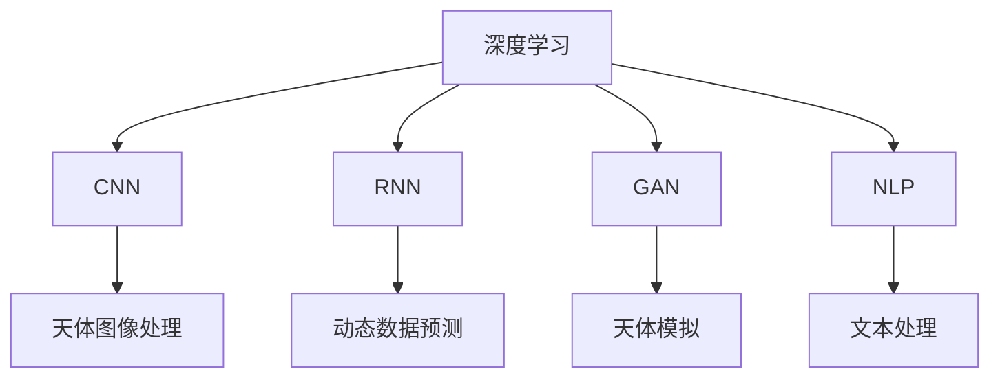

                 

## 1. 背景介绍

### 1.1 问题由来
随着人工智能（AI）技术的迅猛发展，其在航天科技和天文学领域的应用已经逐渐显现出巨大的潜力。天文学作为人类探索宇宙奥秘的重要领域，长期以来依赖于观测和计算，AI技术的引入将极大地提升其数据处理和分析能力，促进科学研究与技术的深度融合。

### 1.2 问题核心关键点
- **数据量庞大**：天文观测数据通常量级惊人，传统的计算方法难以处理。
- **数据类型多样**：包括光学、射电、X射线等不同波段的图像和光谱数据。
- **数据噪声高**：天文观测数据常常受到各种噪声干扰，且分析复杂。
- **模型与算法复杂**：传统的天文数据分析方法复杂，需要高精度的数学模型和算法。

### 1.3 问题研究意义
人工智能在天文学中的应用，不仅能提高数据的处理和分析效率，还能揭示宇宙中更多的奥秘。例如，通过深度学习模型，可以自动检测星系运动、黑洞吞噬事件，以及恒星变化等现象。此外，AI还能在预测天体行为、优化观测策略等方面发挥重要作用，推动天文学从“观测科学”向“数据科学”转变。

## 2. 核心概念与联系

### 2.1 核心概念概述

为更好地理解AI在天文学中的应用，本节将介绍几个关键概念：

- **人工智能（AI）**：利用计算机模拟人类智能行为的技术，包括机器学习、深度学习、自然语言处理等。
- **深度学习（Deep Learning）**：一种模拟人脑神经网络结构的机器学习技术，通过多层神经网络进行数据处理和模式识别。
- **卷积神经网络（CNN）**：一种深度学习模型，擅长处理具有空间结构的数据，如图像和光谱数据。
- **递归神经网络（RNN）**：一种深度学习模型，适用于处理时间序列数据，如天文学中的动态数据。
- **生成对抗网络（GAN）**：一种生成模型，可以生成高质量的天体图像或模拟天文现象。
- **自然语言处理（NLP）**：处理和理解人类语言的技术，适用于自动摘要、问答系统等天文学相关的文本处理任务。

这些核心概念之间的联系可以通过以下Mermaid流程图来展示：



这个流程图展示了深度学习在天文学中的多种应用：

1. 使用CNN处理天体图像数据。
2. 使用RNN分析时间序列数据。
3. GAN生成天体模拟图像。
4. 使用NLP技术处理与天文学相关的文本数据。

这些技术相互交织，共同推动了AI在天文学中的广泛应用。

## 3. 核心算法原理 & 具体操作步骤

### 3.1 算法原理概述

AI在天文学中的应用主要基于深度学习模型，通过大量的天文观测数据进行训练，从而实现对新数据的识别、分类和预测。以下是几种常见的深度学习模型及其在天文学中的应用：

- **卷积神经网络（CNN）**：用于处理高维图像数据，如星系、星系团、超新星等天体的多波段图像。
- **递归神经网络（RNN）**：适用于分析天体时间序列数据，如恒星运动轨迹、太阳黑子活动周期等。
- **生成对抗网络（GAN）**：生成高质量的天体图像或模拟天文现象，如黑洞吞噬事件、星系演化等。
- **注意力机制（Attention）**：用于增强模型对重要特征的关注，提高预测准确性，如恒星演化模型中的参数拟合。

### 3.2 算法步骤详解

以CNN为例，其在天文学中的应用步骤如下：

1. **数据预处理**：将天文图像进行标准化、归一化、降噪等预处理，以便于深度学习模型处理。
2. **模型构建**：使用深度学习框架（如TensorFlow、PyTorch）构建卷积神经网络模型。
3. **模型训练**：在标注好的天文图像数据集上训练CNN模型，优化模型参数。
4. **模型评估**：在验证集上评估模型性能，选择合适的参数和超参数。
5. **模型应用**：将训练好的CNN模型应用于新的天文图像数据，进行分类或特征提取。

### 3.3 算法优缺点

使用CNN等深度学习模型在天文学中的应用，具有以下优点：

- **高效处理数据**：能够处理大规模的天文图像数据，提高数据处理的效率。
- **准确性高**：在图像分类、天体检测等任务上具有较高的准确性。
- **泛化能力强**：经过大量数据训练后，模型能够处理未知数据，具有较好的泛化能力。

同时，也存在以下缺点：

- **需要大量数据**：深度学习模型通常需要大量的标注数据进行训练。
- **计算资源需求高**：模型训练和推理需要较高的计算资源。
- **模型复杂**：模型结构复杂，训练和调参难度较大。

### 3.4 算法应用领域

深度学习在天文学中的应用广泛，主要包括以下几个方面：

- **天体分类**：使用CNN模型对星系、恒星、行星等进行分类和识别。
- **天体运动分析**：使用RNN模型分析恒星、星系的时间序列数据，预测其运动轨迹。
- **天体模拟**：使用GAN模型生成高质量的天体图像或模拟天文现象。
- **文本分析**：使用NLP技术处理天文学相关的文本数据，如科学研究报告、天文学文献等。

这些应用不仅提升了天文数据处理和分析的效率，还推动了天文学研究的进步。

## 4. 数学模型和公式 & 详细讲解

### 4.1 数学模型构建

在天文数据的深度学习处理中，常见的数学模型包括卷积神经网络（CNN）和递归神经网络（RNN）。以下是这两个模型的基本构建过程：

**CNN模型**：

$$
f_\theta(x) = \frac{1}{Z} \sum_{i=1}^{N} \exp(\theta^T \cdot x_i)
$$

其中，$f_\theta(x)$为输出函数，$x_i$为输入样本，$Z$为归一化因子，$\theta$为模型参数。

**RNN模型**：

$$
h_t = f(x_t, h_{t-1}, \theta)
$$

其中，$h_t$为当前时间步的状态，$x_t$为当前时间步的输入，$h_{t-1}$为前一时间步的状态，$\theta$为模型参数。

### 4.2 公式推导过程

以CNN为例，其卷积操作可以表示为：

$$
C_i = \sum_{j=1}^{H} \sum_{k=1}^{W} F_{ij} * K_{ik}
$$

其中，$C_i$为输出特征图，$F_{ij}$为输入特征图，$K_{ik}$为卷积核。

### 4.3 案例分析与讲解

以CNN在星系图像分类为例，以下是其实现步骤：

1. **数据集准备**：准备包含星系图像和对应标签的数据集。
2. **模型定义**：定义卷积神经网络模型，包括卷积层、池化层、全连接层等。
3. **模型训练**：使用标注好的数据集进行模型训练，优化模型参数。
4. **模型评估**：在验证集上评估模型性能，选择合适的参数和超参数。
5. **模型应用**：将训练好的模型应用于新的星系图像数据，进行分类。

## 5. 项目实践：代码实例和详细解释说明

### 5.1 开发环境搭建

在进行深度学习项目实践前，需要准备以下开发环境：

1. **安装Python**：确保系统已安装Python 3.6及以上版本。
2. **安装深度学习框架**：选择TensorFlow或PyTorch，并使用pip进行安装。
3. **安装数据处理库**：如NumPy、Pandas、Scikit-learn等。
4. **安装数据可视化工具**：如Matplotlib、Seaborn等。
5. **安装GPU驱动和CUDA库**：确保系统支持GPU加速。

### 5.2 源代码详细实现

以下是一个简单的CNN模型用于星系图像分类的Python代码实现：

```python
import tensorflow as tf
from tensorflow.keras import layers, models

# 定义模型
model = models.Sequential([
    layers.Conv2D(32, (3,3), activation='relu', input_shape=(256,256,3)),
    layers.MaxPooling2D((2,2)),
    layers.Conv2D(64, (3,3), activation='relu'),
    layers.MaxPooling2D((2,2)),
    layers.Conv2D(128, (3,3), activation='relu'),
    layers.MaxPooling2D((2,2)),
    layers.Flatten(),
    layers.Dense(128, activation='relu'),
    layers.Dense(1, activation='sigmoid')
])

# 编译模型
model.compile(optimizer='adam', loss='binary_crossentropy', metrics=['accuracy'])

# 训练模型
model.fit(train_images, train_labels, epochs=10, validation_data=(val_images, val_labels))

# 评估模型
test_loss, test_acc = model.evaluate(test_images, test_labels)

# 应用模型
prediction = model.predict(new_images)
```

### 5.3 代码解读与分析

代码中主要包含以下几个步骤：

1. **模型定义**：使用Sequential模型定义CNN结构，包括多个卷积层和全连接层。
2. **模型编译**：设置优化器、损失函数和评估指标。
3. **模型训练**：使用训练集数据训练模型，设置迭代次数。
4. **模型评估**：在验证集上评估模型性能，获取测试集上的损失和准确率。
5. **模型应用**：使用训练好的模型对新的星系图像数据进行分类预测。

## 6. 实际应用场景

### 6.1 太空探测

AI在天文学中的应用，可以从太空探测开始，通过分析航天器返回的数据，提升对宇宙的认知水平。例如，使用CNN模型对行星大气层图像进行分类和分析，或使用RNN模型分析太阳风暴的时间序列数据，预测其强度和影响。

### 6.2 天体物理研究

AI还可以应用于天体物理研究中，如恒星演化、黑洞吞噬事件、星系演化等。通过深度学习模型，可以自动分析复杂的观测数据，发现新现象或验证现有理论。例如，使用GAN模型生成高质量的天体模拟图像，用于检验和修正理论模型。

### 6.3 空间天气预测

空间天气预测是天文学中的一个重要应用领域。通过分析太阳活动数据和空间天气模式，AI可以帮助预测太阳耀斑、日冕物质抛射等事件，确保通信和导航系统的安全。例如，使用RNN模型分析太阳黑子活动周期，预测太阳耀斑的发生时间。

### 6.4 未来应用展望

随着AI技术的不断进步，其在天文学中的应用将更加广泛和深入。未来可能的发展方向包括：

- **多模态数据融合**：将光学、射电、X射线等不同波段的观测数据进行融合，提高数据分析的全面性和准确性。
- **跨领域知识迁移**：将天文学知识与其他领域（如天体物理学、宇宙学等）的知识进行迁移，推动跨学科研究。
- **自动化科学发现**：使用AI进行自动化的科学发现和验证，减少人工干预，提高科研效率。

## 7. 工具和资源推荐

### 7.1 学习资源推荐

- **《深度学习》课程**：由斯坦福大学开设，涵盖深度学习的基础和前沿知识。
- **TensorFlow官方文档**：提供了深度学习框架的详细教程和代码示例。
- **Kaggle竞赛**：提供大量天文数据集，可以用于实践深度学习模型。
- **Coursera课程**：提供天文学和深度学习的综合课程，适合初学者学习。

### 7.2 开发工具推荐

- **TensorFlow**：深度学习框架，提供强大的GPU加速能力。
- **PyTorch**：灵活的深度学习框架，适合研究和实验。
- **Jupyter Notebook**：开源的交互式编程环境，适合编写和调试深度学习代码。

### 7.3 相关论文推荐

- **《卷积神经网络在天文图像分类中的应用》**：研究卷积神经网络在星系图像分类中的效果。
- **《递归神经网络在天体动态数据预测中的应用》**：研究递归神经网络在恒星运动预测中的应用。
- **《生成对抗网络在天体模拟中的应用》**：研究生成对抗网络在生成高质量天体图像中的应用。

## 8. 总结：未来发展趋势与挑战

### 8.1 总结

本文对人工智能在天文学中的应用进行了全面系统的介绍。首先阐述了AI在天文学中的研究背景和意义，明确了深度学习在天文数据分析和预测中的重要作用。其次，从原理到实践，详细讲解了深度学习模型的构建和应用步骤，给出了具体的代码实例。同时，本文还广泛探讨了AI在天文学中的多种应用场景，展示了其巨大的潜力。

### 8.2 未来发展趋势

展望未来，深度学习在天文学中的应用将呈现以下几个发展趋势：

1. **多模态数据融合**：将光学、射电、X射线等不同波段的观测数据进行融合，提高数据分析的全面性和准确性。
2. **跨领域知识迁移**：将天文学知识与其他领域（如天体物理学、宇宙学等）的知识进行迁移，推动跨学科研究。
3. **自动化科学发现**：使用AI进行自动化的科学发现和验证，减少人工干预，提高科研效率。
4. **模型可解释性**：提高深度学习模型的可解释性，帮助科学家更好地理解和应用模型结果。
5. **模型鲁棒性**：增强深度学习模型的鲁棒性，提高其在未知数据上的泛化能力。

### 8.3 面临的挑战

尽管深度学习在天文学中的应用取得了显著进展，但在迈向更加智能化、普适化应用的过程中，仍面临诸多挑战：

1. **数据稀缺性**：天文观测数据往往难以获取，且数据量较少。
2. **计算资源需求高**：深度学习模型的训练和推理需要高计算资源。
3. **模型复杂性**：深度学习模型的结构复杂，难以调试和优化。
4. **模型泛化能力**：深度学习模型在未知数据上的泛化能力仍有待提高。
5. **模型可解释性**：深度学习模型的决策过程缺乏可解释性，难以理解和调试。

### 8.4 研究展望

未来，深度学习在天文学中的应用需要从以下几个方面进行突破：

1. **数据增强**：通过数据增强技术，提高数据集的多样性和数量。
2. **模型压缩**：使用模型压缩技术，减少模型参数，提高推理速度。
3. **多模型集成**：使用多模型集成技术，提高模型的稳定性和泛化能力。
4. **跨学科融合**：将天文学与其他领域（如物理、化学等）的知识进行融合，推动跨学科研究。
5. **可解释性提升**：提高深度学习模型的可解释性，帮助科学家更好地理解和应用模型结果。

## 9. 附录：常见问题与解答

**Q1：为什么深度学习在天文学中具有较高的应用潜力？**

A: 深度学习具有强大的数据处理和模式识别能力，可以自动分析复杂的天文数据，发现新现象或验证现有理论。其高准确性和泛化能力使得深度学习在天文学中具有较高的应用潜力。

**Q2：深度学习在天文学中需要注意哪些数据问题？**

A: 天文学数据通常包含大量噪声和干扰，需要对数据进行预处理，如标准化、归一化、降噪等，以提高深度学习模型的准确性和鲁棒性。

**Q3：深度学习模型的训练和推理需要哪些计算资源？**

A: 深度学习模型的训练和推理需要高性能的GPU或TPU设备，以及大量的计算资源，如内存和存储空间。

**Q4：如何提高深度学习模型的泛化能力？**

A: 提高深度学习模型的泛化能力，可以从数据增强、模型压缩、多模型集成等多个方面入手，增加数据多样性，减少模型复杂性，提高模型的稳定性和泛化能力。

**Q5：如何提高深度学习模型的可解释性？**

A: 提高深度学习模型的可解释性，可以从模型简化、特征解释、可视化输出等多个方面入手，帮助科学家更好地理解和应用模型结果。

---

作者：禅与计算机程序设计艺术 / Zen and the Art of Computer Programming

