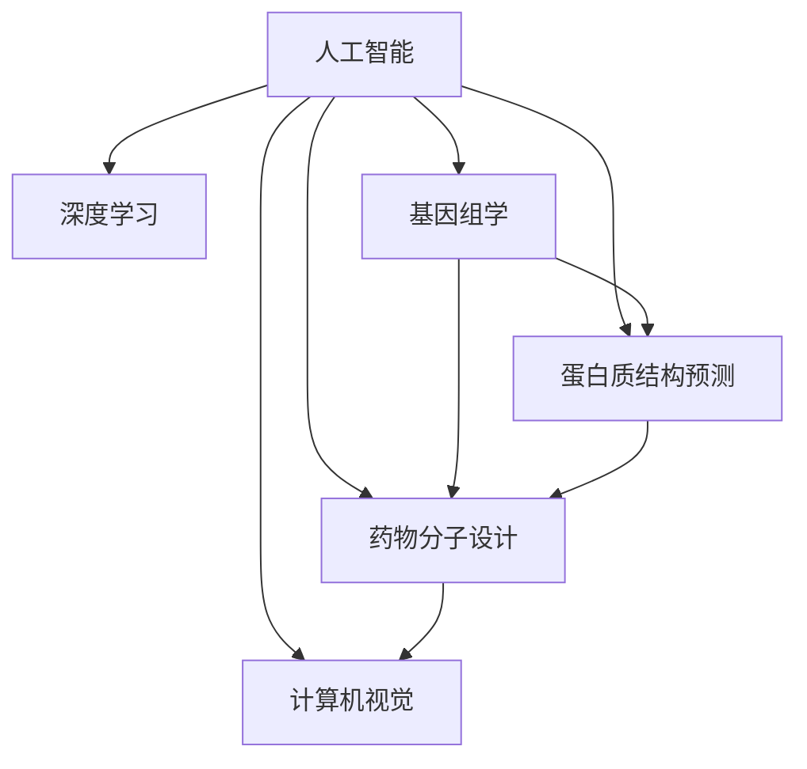

                 

# 人工智能在生物医学和药物发现中的应用

> 关键词：人工智能, 生物医学, 药物发现, 深度学习, 基因组学, 蛋白质结构, 药物分子设计, 计算机视觉

## 1. 背景介绍

### 1.1 问题由来
生物医学和药物发现是一个复杂且耗时的过程，涉及从基础研究到临床试验的多个阶段。传统上，这一过程依靠经验丰富的研究人员手动分析和筛选数据，但随着数据量的爆炸性增长，这种模式已不再适应现代生物医学研究的需要。人工智能(AI)技术的介入，为生物医学和药物发现带来了新的希望和机遇。

### 1.2 问题核心关键点
人工智能，尤其是深度学习算法，已在生物医学和药物发现中展示了巨大的潜力。AI技术可以处理和分析海量数据，发现潜在的治疗目标和药物，加速药物发现流程，提高研究的准确性和效率。本文将聚焦于AI在生物医学和药物发现中的最新进展，介绍核心概念、技术原理、操作步骤，并提供项目实践、实际应用场景、工具和资源推荐。

### 1.3 问题研究意义
AI在生物医学和药物发现中的应用，对于提高药物研发效率，降低研发成本，加速新药上市，具有重要的现实意义。AI技术可以在基因组学、蛋白质结构预测、药物分子设计等领域发挥重要作用，为药物发现过程带来新的突破和创新。

## 2. 核心概念与联系

### 2.1 核心概念概述

为更好地理解AI在生物医学和药物发现中的应用，本节将介绍几个关键概念：

- **人工智能(AI)**：利用算法和计算机模型进行数据处理、模式识别和决策制定的技术。在生物医学和药物发现中，AI主要用于数据挖掘、预测建模、图像识别等领域。

- **深度学习(Deep Learning, DL)**：一种特殊的机器学习方法，通过多层次的神经网络模拟人脑的神经网络结构，用于处理非结构化数据。深度学习在图像识别、语音识别、自然语言处理等方面有广泛应用。

- **基因组学(Genomics)**：研究生物体的基因结构和功能的科学。AI技术可用于基因序列分析、基因变异识别、基因表达预测等。

- **蛋白质结构预测**：通过AI模型预测蛋白质的三维结构，是药物设计的重要一环。

- **药物分子设计**：利用AI模型设计新的药物分子，包括分子生成、优化、筛选等。

- **计算机视觉(Computer Vision)**：使计算机“看”和理解图像的能力。在药物发现中，计算机视觉可用于化合物高通量筛选、图像分割、病理学图像分析等。

这些概念之间的逻辑关系可以通过以下Mermaid流程图来展示：



这个流程图展示了大语言模型的核心概念及其之间的关系：

1. 人工智能是核心，通过深度学习技术，处理和分析各类数据。
2. 基因组学、蛋白质结构预测和药物分子设计是药物发现的主要研究方向。
3. 计算机视觉在图像处理和识别中起着关键作用。
4. AI的各个子领域相互关联，协同推动药物发现过程的进步。

## 3. 核心算法原理 & 具体操作步骤
### 3.1 算法原理概述

AI在生物医学和药物发现中的应用，通常涉及以下几个关键步骤：

1. **数据收集与预处理**：从生物数据库、临床试验、文献等来源收集数据，并对数据进行清洗、标注和标准化。
2. **特征工程**：提取和构建可用于机器学习模型的特征，如基因序列、蛋白质结构、化合物性质等。
3. **模型训练与评估**：选择适合的机器学习算法，如深度神经网络、支持向量机、随机森林等，并在训练集上训练模型，在验证集上评估模型性能。
4. **模型部署与验证**：将训练好的模型部署到实际应用中，并在测试集上进行验证，确保模型具有泛化能力。

### 3.2 算法步骤详解

以深度学习在蛋白质结构预测中的应用为例，详细讲解算法的步骤：

**Step 1: 数据收集与预处理**
- 收集蛋白质三维结构数据，如蛋白质晶体结构数据库(PDB)、蛋白质序列数据库(UniProt)等。
- 将蛋白质序列转换为可用于神经网络处理的数值型数据。

**Step 2: 特征工程**
- 设计输入层，将蛋白质序列转化为数值型向量。
- 使用卷积神经网络(CNN)或循环神经网络(RNN)提取特征。
- 对提取出的特征进行归一化和标准化处理。

**Step 3: 模型训练与评估**
- 选择适合的深度学习模型，如AlphaFold，并在训练集上训练模型。
- 使用验证集评估模型的性能，选择最佳超参数，如学习率、批大小等。
- 使用测试集验证模型的泛化能力。

**Step 4: 模型部署与验证**
- 将训练好的模型部署到实际应用中，如新蛋白质的结构预测。
- 使用独立数据集验证模型的预测精度和鲁棒性。

### 3.3 算法优缺点

AI在生物医学和药物发现中的应用具有以下优点：
1. 处理和分析大规模数据，发现模式和规律。
2. 自动化和加速药物发现过程，降低人力成本。
3. 提高实验设计的科学性和效率。
4. 预测和模拟生物过程，加速药物研发。

同时，该方法也存在一定的局限性：
1. 需要大量标注数据，数据收集和标注成本较高。
2. 模型复杂度高，训练和推理资源消耗大。
3. 模型的解释性不足，难以解释预测过程。
4. 对数据质量和数据处理技术要求高。

尽管存在这些局限性，但AI在生物医学和药物发现中的应用已取得显著进展，展示了其巨大的潜力和应用价值。

### 3.4 算法应用领域

AI技术在生物医学和药物发现中的应用涵盖多个领域，包括但不限于：

- **基因组学**：利用AI进行基因序列分析、基因变异识别、基因表达预测等。
- **蛋白质结构预测**：通过AI模型预测蛋白质的三维结构，是药物设计的重要一环。
- **药物分子设计**：利用AI模型设计新的药物分子，包括分子生成、优化、筛选等。
- **计算机视觉**：在药物发现中，计算机视觉可用于化合物高通量筛选、图像分割、病理学图像分析等。
- **天然产物化学**：利用AI进行天然产物的筛选和结构预测。

除了上述这些经典领域外，AI技术还在药物分子-靶点结合预测、药物重定位、个性化医疗等领域展现出巨大的潜力。

## 4. 数学模型和公式 & 详细讲解 & 举例说明

### 4.1 数学模型构建

AI在生物医学和药物发现中的应用，通常涉及以下数学模型：

1. **线性回归模型**：用于基因表达预测、化合物性质预测等。
2. **支持向量机(SVM)**：用于分类问题，如药物靶点识别。
3. **深度神经网络(DNN)**：用于非线性关系建模，如图像识别、蛋白质结构预测等。
4. **随机森林(Random Forest)**：用于集成学习，提高模型泛化能力。

### 4.2 公式推导过程

以深度神经网络在蛋白质结构预测中的应用为例，推导模型的损失函数及其梯度计算公式。

假设输入为蛋白质序列$x_i$，输出为该序列对应的三维结构$y_i$，模型为深度神经网络。则模型在训练集$D=\{(x_i, y_i)\}_{i=1}^N$上的损失函数为：

$$
\mathcal{L}(\theta) = \frac{1}{N}\sum_{i=1}^N \|y_i - M_{\theta}(x_i)\|^2
$$

其中$M_{\theta}$为神经网络模型，$\theta$为模型参数。损失函数为均方误差损失。

根据链式法则，损失函数对参数$\theta_k$的梯度为：

$$
\frac{\partial \mathcal{L}(\theta)}{\partial \theta_k} = \frac{1}{N}\sum_{i=1}^N \frac{\partial M_{\theta}(x_i)}{\partial \theta_k} (y_i - M_{\theta}(x_i))
$$

其中$\frac{\partial M_{\theta}(x_i)}{\partial \theta_k}$为模型对参数$\theta_k$的梯度，可以通过反向传播算法计算得到。

### 4.3 案例分析与讲解

以AlphaFold模型为例，介绍其在蛋白质结构预测中的应用：

AlphaFold利用深度神经网络预测蛋白质结构，具体步骤如下：

1. **数据收集与预处理**：收集蛋白质序列和三维结构数据，对数据进行清洗和标准化。
2. **特征工程**：设计输入层，将蛋白质序列转换为数值型向量。
3. **模型训练与评估**：选择深度神经网络模型，并在训练集上训练模型。
4. **模型部署与验证**：将训练好的模型部署到实际应用中，并进行独立数据集的验证。

AlphaFold在CASP13、CASP14等蛋白质结构预测比赛中取得了优异的成绩，展示了深度学习在蛋白质结构预测中的巨大潜力。

## 5. 项目实践：代码实例和详细解释说明
### 5.1 开发环境搭建

在进行AI在生物医学和药物发现中的应用实践前，我们需要准备好开发环境。以下是使用Python进行TensorFlow开发的环境配置流程：

1. 安装Anaconda：从官网下载并安装Anaconda，用于创建独立的Python环境。

2. 创建并激活虚拟环境：
```bash
conda create -n pytorch-env python=3.8 
conda activate pytorch-env
```

3. 安装TensorFlow：根据CUDA版本，从官网获取对应的安装命令。例如：
```bash
conda install tensorflow -c conda-forge -c pytorch
```

4. 安装相关库：
```bash
pip install numpy pandas scikit-learn matplotlib tensorflow-cpu
```

5. 安装Keras：
```bash
pip install keras
```

完成上述步骤后，即可在`pytorch-env`环境中开始AI在生物医学和药物发现中的应用实践。

### 5.2 源代码详细实现

下面我们以AlphaFold模型为例，给出使用TensorFlow进行蛋白质结构预测的Python代码实现。

```python
import tensorflow as tf
from tensorflow.keras.layers import Input, Dense
from tensorflow.keras.models import Model

# 定义输入层
input_layer = Input(shape=(sequence_length,), dtype='float32', name='input_layer')

# 定义隐藏层
hidden_layer = Dense(256, activation='relu', name='hidden_layer')(input_layer)

# 定义输出层
output_layer = Dense(3, activation='softmax', name='output_layer')(hidden_layer)

# 定义模型
model = Model(inputs=input_layer, outputs=output_layer)

# 定义损失函数
loss = tf.keras.losses.MeanSquaredError()

# 定义优化器
optimizer = tf.keras.optimizers.Adam(learning_rate=0.001)

# 编译模型
model.compile(optimizer=optimizer, loss=loss)

# 训练模型
model.fit(x_train, y_train, epochs=10, batch_size=32, validation_data=(x_val, y_val))
```

以上代码展示了TensorFlow中定义、训练和评估深度神经网络的基本流程。

### 5.3 代码解读与分析

让我们再详细解读一下关键代码的实现细节：

**模型定义**：
- `input_layer`：输入层，用于接收蛋白质序列数据。
- `hidden_layer`：隐藏层，通过Dense层进行特征提取。
- `output_layer`：输出层，通过Dense层进行预测，输出三维结构的坐标。
- `model`：定义整个神经网络模型。

**损失函数与优化器**：
- `loss`：定义均方误差损失函数。
- `optimizer`：定义Adam优化器，学习率为0.001。

**模型编译与训练**：
- `model.compile`：编译模型，指定优化器和损失函数。
- `model.fit`：训练模型，指定训练数据、验证数据、迭代轮数和批次大小。

### 5.4 运行结果展示

运行上述代码，训练完成后，可以通过`model.evaluate`方法在测试集上进行评估，并输出预测结果。

## 6. 实际应用场景
### 6.1 基因组学研究

AI在基因组学研究中主要用于基因序列分析、基因变异识别和基因表达预测。基因组学研究对于疾病的早期诊断和个性化治疗具有重要意义。

**基因序列分析**：通过AI技术，可以对大规模基因组数据进行快速分析，识别出突变基因和疾病相关基因。例如，利用深度学习模型对基因序列进行分类，可以预测某些基因是否与特定疾病相关联。

**基因变异识别**：利用AI模型，可以从基因序列数据中识别出罕见的基因变异，这些变异可能与某些疾病的发生相关。例如，使用卷积神经网络对基因序列进行图像处理，识别出基因组中的变异点。

**基因表达预测**：通过AI技术，可以对基因表达数据进行预测，帮助研究人员理解基因与疾病之间的关系。例如，使用随机森林模型对基因表达数据进行分类，预测某些基因是否在特定疾病中表达异常。

### 6.2 药物分子设计

药物分子设计是药物发现过程中的关键环节，AI技术在该领域展现了巨大的潜力。

**药物分子生成**：通过AI模型，可以生成新的药物分子，并对其进行筛选和优化。例如，使用生成对抗网络(GAN)生成新的药物分子，通过优化网络结构，生成更具药理活性的分子。

**药物分子优化**：利用AI模型，可以对已有的药物分子进行优化，提高其药理活性和选择性。例如，使用进化算法对药物分子进行优化，找到活性更高、副作用更小的分子。

**药物分子筛选**：利用AI模型，可以从大量的化合物库中筛选出潜在的药物分子。例如，使用支持向量机对化合物库进行分类，筛选出具有特定药理活性的分子。

### 6.3 计算机视觉在药物发现中的应用

计算机视觉在药物发现中的应用，主要体现在高通量化合物筛选和病理学图像分析等领域。

**化合物高通量筛选**：通过计算机视觉技术，可以对大量的化合物进行高通量筛选。例如，利用图像处理技术对化合物进行分割和分类，筛选出具有特定药理活性的化合物。

**病理学图像分析**：通过计算机视觉技术，可以对病理图像进行分析和分类。例如，利用卷积神经网络对病理切片进行分类，预测某些疾病的发生概率。

## 7. 工具和资源推荐
### 7.1 学习资源推荐

为了帮助开发者系统掌握AI在生物医学和药物发现中的应用，这里推荐一些优质的学习资源：

1. **Coursera《深度学习专项课程》**：由深度学习领域的知名专家Andrew Ng开设的深度学习课程，涵盖了深度学习的基础知识和应用。

2. **Kaggle《机器学习竞赛》**：参与机器学习竞赛，实战练习AI在生物医学和药物发现中的应用，积累实战经验。

3. **DeepMind AlphaFold论文**：AlphaFold模型是AI在蛋白质结构预测中的经典案例，阅读论文可以了解AI模型的具体实现和技术细节。

4. **OpenAI《深度学习书籍》**：由OpenAI的AI专家编写，涵盖了深度学习在自然语言处理、计算机视觉等领域的实践技巧。

5. **GitHub《TensorFlow示例代码》**：TensorFlow提供的示例代码，展示了AI在生物医学和药物发现中的多种应用场景。

通过对这些资源的学习实践，相信你一定能够快速掌握AI在生物医学和药物发现中的应用技巧，并用于解决实际的生物医学问题。

### 7.2 开发工具推荐

高效的开发离不开优秀的工具支持。以下是几款用于AI在生物医学和药物发现中的应用开发的常用工具：

1. **Jupyter Notebook**：开源的交互式计算环境，支持Python代码的运行和可视化，方便实验和研究。

2. **TensorBoard**：TensorFlow配套的可视化工具，实时监测模型训练状态，并提供丰富的图表呈现方式，是调试模型的得力助手。

3. **HuggingFace Transformers库**：提供了多种预训练模型，支持深度学习模型的快速部署和微调。

4. **PyTorch Lightning**：基于PyTorch的快速原型开发框架，支持自动化的模型训练和评估。

5. **Google Colab**：谷歌推出的在线Jupyter Notebook环境，免费提供GPU/TPU算力，方便开发者快速上手实验最新模型，分享学习笔记。

合理利用这些工具，可以显著提升AI在生物医学和药物发现中的应用开发效率，加快创新迭代的步伐。

### 7.3 相关论文推荐

AI在生物医学和药物发现中的应用源于学界的持续研究。以下是几篇奠基性的相关论文，推荐阅读：

1. **AlphaFold: A Least-First Protein Structure Database**：DeepMind提出的AlphaFold模型，利用深度学习技术预测蛋白质结构，取得了优异的效果。

2. **Deep Residual Learning for Image Recognition**：由深度学习领域的知名专家Kaiming He等人提出，展示了深度残差网络在图像识别中的潜力。

3. **Causal Inference in Statistics: An Introduction**：介绍了因果推断在统计学中的应用，为AI在药物发现中的应用提供了理论基础。

4. **Deep Autoencoder Networks for Image Denoising**：展示了深度自编码网络在图像去噪中的应用，为计算机视觉提供了新的思路。

5. **Pharmacophore-Based Drug Design: A Review**：综述了基于分子结构的药物设计方法，介绍了AI在药物分子设计中的应用。

这些论文代表了大语言模型微调技术的发展脉络。通过学习这些前沿成果，可以帮助研究者把握学科前进方向，激发更多的创新灵感。

## 8. 总结：未来发展趋势与挑战

### 8.1 总结

本文对AI在生物医学和药物发现中的应用进行了全面系统的介绍。首先阐述了AI在生物医学和药物发现中的研究背景和应用前景，明确了AI技术在数据处理、模式识别、预测建模等方面的独特优势。其次，从原理到实践，详细讲解了AI在生物医学和药物发现中的数学模型和算法步骤，给出了项目实践、实际应用场景、工具和资源推荐。

通过本文的系统梳理，可以看到，AI在生物医学和药物发现中的应用正在成为科学研究的重要工具，极大地提高了实验设计的科学性和效率。AI技术可以在基因组学、蛋白质结构预测、药物分子设计等领域发挥重要作用，为药物发现过程带来新的突破和创新。未来，伴随AI技术的不断进步，AI在生物医学和药物发现中的应用前景将更加广阔。

### 8.2 未来发展趋势

展望未来，AI在生物医学和药物发现中的应用将呈现以下几个发展趋势：

1. **模型规模和复杂度持续提升**：随着计算能力的提升，AI模型的规模和复杂度将不断增加，可以处理更加复杂和多样化的数据。

2. **跨学科融合**：AI技术将与其他学科如基因组学、蛋白质组学、生物信息学等进一步融合，推动多学科协同创新。

3. **自动化和智能化**：AI技术将进一步自动化和智能化，减少人类参与，提高实验设计的科学性和效率。

4. **药物发现流程优化**：AI技术将优化药物发现流程，从靶点发现到化合物筛选，再到临床试验，各个环节都可以通过AI技术加速和优化。

5. **个性化医疗**：AI技术将推动个性化医疗的发展，根据患者基因组数据和病史，定制个性化的治疗方案。

6. **药物重定位**：AI技术可以重新定位现有药物，发现新的治疗用途，提高药物的利用率。

以上趋势凸显了AI在生物医学和药物发现中的应用前景。这些方向的探索发展，必将进一步提升药物研发效率，加速新药上市，推动生物医学研究的进步。

### 8.3 面临的挑战

尽管AI在生物医学和药物发现中的应用已取得显著进展，但在迈向更加智能化、普适化应用的过程中，仍面临诸多挑战：

1. **数据质量和数据量不足**：高质量的数据是AI技术应用的基础，但生物医学领域的数据往往质量参差不齐，数据量不足。

2. **模型复杂度和计算资源消耗**：AI模型的复杂度和计算资源消耗大，对计算资源和数据存储提出了较高要求。

3. **模型解释性和可解释性不足**：AI模型的黑盒特性，难以解释其内部决策过程，不利于模型的应用和推广。

4. **数据隐私和安全**：生物医学数据的隐私和安全问题，需要采取有效的措施进行保护。

5. **伦理和社会影响**：AI技术的应用可能带来伦理和社会问题，需要制定相应的法规和标准。

6. **跨学科协作**：AI技术需要跨学科协作，不同学科之间的沟通和协作仍需加强。

这些挑战需要学术界和产业界的共同努力，才能克服技术障碍，推动AI在生物医学和药物发现中的应用落地。

### 8.4 研究展望

面对AI在生物医学和药物发现中的应用所面临的挑战，未来的研究需要在以下几个方面寻求新的突破：

1. **跨学科合作**：加强与基因组学、蛋白质组学、生物信息学等学科的合作，推动AI技术在生物医学领域的应用。

2. **数据集标准化和共享**：推动生物医学数据集的标准化和共享，提高数据的质量和可用性。

3. **模型可解释性研究**：研究如何提高AI模型的可解释性，使其能够更好地解释其内部决策过程。

4. **隐私和安全保护**：研究如何保护生物医学数据的隐私和安全，确保数据在应用中的安全性。

5. **伦理和社会影响研究**：研究AI技术应用对伦理和社会的影响，制定相应的法规和标准。

6. **自动化和智能化研究**：研究如何进一步自动化和智能化AI技术，提高其效率和可靠性。

这些研究方向的探索，必将引领AI在生物医学和药物发现中的应用走向更加智能化和普适化的未来。只有不断创新和突破，才能真正实现AI技术在生物医学和药物发现中的广泛应用。

## 9. 附录：常见问题与解答

**Q1: AI在生物医学和药物发现中的应用是否适用于所有应用场景？**

A: AI技术在生物医学和药物发现中的应用具有广泛适用性，但具体应用需要根据数据特点和任务需求进行选择。对于数据量较小、任务较为复杂的应用场景，AI技术需要更多的先验知识和跨学科的协同。

**Q2: 如何选择适合的AI算法？**

A: 选择适合的AI算法需要考虑数据类型、任务需求、模型复杂度等多个因素。对于图像和序列数据，深度学习算法如卷积神经网络和循环神经网络较为适用。对于分类和回归任务，支持向量机和随机森林等算法可能更合适。

**Q3: AI在生物医学和药物发现中的应用是否面临数据隐私和安全问题？**

A: AI在生物医学和药物发现中的应用确实面临数据隐私和安全问题。需要对数据进行加密和匿名化处理，确保数据在应用过程中的安全性。

**Q4: 如何进行AI在生物医学和药物发现中的应用优化？**

A: AI在生物医学和药物发现中的应用优化需要从多个方面进行：1. 数据预处理和特征工程，提升数据质量；2. 选择合适的算法和模型，优化模型结构；3. 调整超参数，提高模型性能；4. 采用多模型集成，提升模型鲁棒性。

**Q5: 如何评估AI在生物医学和药物发现中的应用效果？**

A: 评估AI在生物医学和药物发现中的应用效果需要结合具体的任务和应用场景进行。通常可以通过交叉验证、独立数据集测试、ROC曲线等方法进行评估。

---

作者：禅与计算机程序设计艺术 / Zen and the Art of Computer Programming

