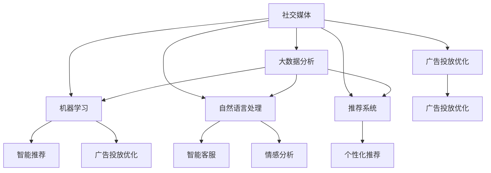

                 

# 人工智能在社交媒体和营销中的应用

> 关键词：社交媒体, 人工智能, 营销自动化, 数据分析, 个性化推荐

## 1. 背景介绍

### 1.1 问题由来
在互联网时代，社交媒体平台如Facebook、Twitter、Instagram、微信等，已经成为人们日常生活的重要组成部分。企业纷纷通过社交媒体与用户进行互动，利用这些平台进行品牌推广、市场调研、客户服务等。但传统的营销手段已无法满足快速变化的市场需求，人工智能(AI)技术的崛起为社交媒体营销注入了新的活力。AI在社交媒体中的应用，如智能推荐、广告投放优化、客户服务自动化等，极大提升了用户体验和营销效果。

### 1.2 问题核心关键点
AI在社交媒体中的应用主要体现在以下几个方面：
1. **数据驱动**：利用大数据分析技术，深度挖掘用户行为和偏好，精准定位目标群体。
2. **智能推荐**：通过机器学习算法，个性化推荐内容，提升用户粘性。
3. **广告投放优化**：利用AI算法优化广告投放策略，提升广告效果和ROI。
4. **客户服务自动化**：采用自然语言处理技术，提供24/7的智能客服服务，提升客户满意度。
5. **情感分析**：通过情感计算技术，分析用户情感变化，及时调整营销策略。

### 1.3 问题研究意义
研究AI在社交媒体和营销中的应用，对于提升用户体验、优化营销效果、提升企业竞争力具有重要意义：

1. **提升用户体验**：AI可以提供更加个性化和高效的互动体验，提升用户的参与感和满意度。
2. **优化营销效果**：AI通过精准的受众定位和内容推荐，显著提升广告投放和营销活动的效果。
3. **增强竞争力**：AI技术的应用，使得企业能够在激烈的市场竞争中脱颖而出，保持竞争优势。
4. **加速创新**：AI技术为社交媒体和营销带来了新的思维和方法，推动了行业的不断创新和发展。

## 2. 核心概念与联系

### 2.1 核心概念概述

在社交媒体和营销领域，AI技术的应用涉及多个核心概念，这些概念共同构成了AI技术应用的基础：

- **社交媒体**：指用户通过互联网进行互动和信息共享的平台，如Facebook、Twitter、Instagram等。
- **大数据分析**：指利用数据分析技术，从海量数据中提取有价值的信息，支持决策和策略制定。
- **机器学习**：指通过数据训练模型，使机器能够自主学习和优化，提升决策和执行能力。
- **自然语言处理(NLP)**：指使机器能够理解和处理自然语言的技术，用于智能客服、情感分析等场景。
- **推荐系统**：指通过分析用户行为和偏好，为用户推荐最相关内容的技术，用于个性化推荐、广告投放等。
- **广告投放优化**：指通过AI技术优化广告投放策略，提升广告效果和ROI。

这些核心概念之间的逻辑关系可以通过以下Mermaid流程图来展示：



这个流程图展示了大数据、机器学习、自然语言处理、推荐系统和广告投放优化等核心概念之间的联系：

1. 社交媒体平台通过大数据分析，获取用户行为和偏好数据。
2. 机器学习算法通过训练模型，对用户数据进行分析和优化。
3. 自然语言处理技术，使机器能够理解和处理用户输入的文本信息。
4. 推荐系统利用用户数据，个性化推荐相关内容。
5. 广告投放优化技术，通过数据分析和机器学习算法，优化广告投放策略。

这些技术手段共同作用，使AI在社交媒体和营销领域发挥出巨大的价值。

## 3. 核心算法原理 & 具体操作步骤
### 3.1 算法原理概述

AI在社交媒体和营销中的应用，核心算法包括机器学习、自然语言处理、推荐系统等。以下对每个核心算法进行简要概述：

- **机器学习**：通过数据训练模型，使机器能够自主学习和优化，提升决策和执行能力。在社交媒体和营销中，机器学习主要用于个性化推荐、广告投放优化等。
- **自然语言处理(NLP)**：使机器能够理解和处理自然语言，用于智能客服、情感分析等场景。
- **推荐系统**：利用用户数据，个性化推荐相关内容，提升用户体验。

### 3.2 算法步骤详解

#### 3.2.1 机器学习算法

机器学习在社交媒体和营销中的应用，一般分为以下几个步骤：

1. **数据采集**：收集社交媒体平台上的用户行为数据，如点击、浏览、互动等。
2. **数据预处理**：清洗和标准化数据，去除噪声和异常值。
3. **模型训练**：选择合适的模型，如决策树、随机森林、神经网络等，利用训练数据进行模型训练。
4. **模型评估**：利用测试数据评估模型性能，选择最优模型。
5. **模型应用**：将训练好的模型应用于实际场景，如推荐系统、广告投放优化等。

#### 3.2.2 自然语言处理(NLP)

自然语言处理在社交媒体和营销中的应用，一般包括以下几个步骤：

1. **文本收集**：收集社交媒体平台上的文本数据，如评论、帖子、私信等。
2. **文本预处理**：清洗和标准化文本数据，如去除停用词、分词、词性标注等。
3. **情感分析**：利用情感计算技术，分析用户情感变化，如情感分类、情感强度计算等。
4. **意图识别**：利用意图识别模型，识别用户输入文本的意图，如询问、投诉、建议等。
5. **对话系统**：利用对话系统技术，与用户进行自然语言交互，提供智能客服服务。

#### 3.2.3 推荐系统

推荐系统在社交媒体和营销中的应用，一般包括以下几个步骤：

1. **用户画像**：根据用户行为数据，构建用户画像，如兴趣、偏好、历史行为等。
2. **内容画像**：根据内容特征，构建内容画像，如标签、分类、相关性等。
3. **相似度计算**：计算用户和内容之间的相似度，如余弦相似度、Jaccard相似度等。
4. **推荐算法**：选择合适的推荐算法，如基于协同过滤、基于内容的推荐、混合推荐等，利用相似度计算结果进行推荐。
5. **推荐效果评估**：利用评估指标，如点击率、转化率、用户满意度等，评估推荐系统效果。

### 3.3 算法优缺点

AI在社交媒体和营销中的应用，具有以下优点：

1. **提升效率**：通过自动化和智能化技术，大大提升营销和客户服务的效率。
2. **提升效果**：通过数据分析和机器学习算法，精准定位目标群体，提升广告投放和营销活动的效果。
3. **个性化推荐**：利用推荐系统，提供个性化的内容推荐，提升用户体验。
4. **降低成本**：通过自动化和智能化技术，减少人力成本，提升营销ROI。

同时，这些技术也存在一定的局限性：

1. **数据隐私问题**：用户数据隐私保护成为一大挑战，需要合理处理和保护用户数据。
2. **算法偏见**：AI算法可能存在偏见，需要对其进行公平性和透明性分析。
3. **技术复杂性**：AI技术的应用需要一定的技术门槛，需要投入大量资源进行研究和开发。
4. **用户接受度**：部分用户可能对AI技术持怀疑态度，需要逐步推广和引导。

### 3.4 算法应用领域

AI在社交媒体和营销中的应用，广泛应用于以下领域：

- **智能推荐**：在社交媒体平台上，为用户推荐相关内容，提升用户粘性。
- **广告投放优化**：通过数据分析和机器学习算法，优化广告投放策略，提升广告效果和ROI。
- **客户服务自动化**：利用自然语言处理技术，提供24/7的智能客服服务，提升客户满意度。
- **情感分析**：通过情感计算技术，分析用户情感变化，及时调整营销策略。
- **智能营销**：利用AI技术，实现个性化营销、精准营销、营销自动化等。

## 4. 数学模型和公式 & 详细讲解 & 举例说明

### 4.1 数学模型构建

#### 4.1.1 推荐系统模型

推荐系统是AI在社交媒体和营销中的重要应用之一，一般通过以下数学模型进行构建：

1. **协同过滤模型**：通过分析用户行为数据和物品特征，构建用户和物品之间的相似度矩阵，进行推荐。
   - 用户-物品相似度矩阵 $S_{ui}$，定义为：$S_{ui} = \alpha_{ui} - \beta_{ui}$
     - $\alpha_{ui}$ 为用户 $u$ 和物品 $i$ 的评分平均值
     - $\beta_{ui}$ 为评分标准差
   - 用户 $u$ 的物品推荐列表 $R_u$，定义为：$R_u = \text{argmax}_i(S_{ui} \times \text{softmax}(\theta^T_i))$

2. **基于内容的推荐模型**：利用物品的特征向量，计算用户和物品之间的相似度，进行推荐。
   - 用户 $u$ 的物品推荐列表 $R_u$，定义为：$R_u = \text{argmax}_i(\theta_u^T \times \theta_i)$
     - $\theta_u$ 为用户 $u$ 的特征向量
     - $\theta_i$ 为物品 $i$ 的特征向量

#### 4.1.2 情感分析模型

情感分析是利用自然语言处理技术，对用户情感进行识别和分类的过程，一般通过以下数学模型进行构建：

1. **情感分类模型**：利用情感词典或情感分类算法，对用户情感进行分类。
   - 用户情感分类 $S_u$，定义为：$S_u = \text{argmax}_i(P_i \times \text{softmax}(\theta^T_u))$
     - $P_i$ 为情感 $i$ 的概率分布
     - $\theta_u$ 为用户 $u$ 的情感特征向量

2. **情感强度计算模型**：利用情感计算技术，计算用户情感强度。
   - 用户情感强度 $S_u$，定义为：$S_u = \sum_i P_i \times \log P_i$
     - $P_i$ 为情感 $i$ 的概率分布

### 4.2 公式推导过程

#### 4.2.1 协同过滤模型

协同过滤模型的公式推导如下：

1. **用户-物品相似度矩阵 $S_{ui}$**：
   $$
   S_{ui} = \alpha_{ui} - \beta_{ui}
   $$
   - $\alpha_{ui}$ 为用户 $u$ 和物品 $i$ 的评分平均值
   - $\beta_{ui}$ 为评分标准差
   $$
   \alpha_{ui} = \frac{\sum_{j=1}^{N_u}R_{uj} \times I_{ji}}{N_u}
   $$
   - $R_{uj}$ 为用户 $u$ 对物品 $j$ 的评分
   - $I_{ji}$ 为物品 $i$ 和物品 $j$ 是否相同
   $$
   \beta_{ui} = \sqrt{\frac{\sum_{j=1}^{N_u}(R_{uj} - \alpha_{ui})^2}{N_u - 1}}
   $$

2. **用户 $u$ 的物品推荐列表 $R_u$**：
   $$
   R_u = \text{argmax}_i(S_{ui} \times \text{softmax}(\theta^T_i))
   $$

#### 4.2.2 情感分析模型

情感分析模型的公式推导如下：

1. **情感分类模型**：
   $$
   S_u = \text{argmax}_i(P_i \times \text{softmax}(\theta^T_u))
   $$
   - $P_i$ 为情感 $i$ 的概率分布
   - $\theta_u$ 为用户 $u$ 的情感特征向量

2. **情感强度计算模型**：
   $$
   S_u = \sum_i P_i \times \log P_i
   $$
   - $P_i$ 为情感 $i$ 的概率分布

### 4.3 案例分析与讲解

#### 4.3.1 推荐系统案例分析

某电商平台利用协同过滤模型进行推荐系统优化。首先，收集用户的历史浏览和购买数据，构建用户画像和物品画像。然后，计算用户和物品之间的相似度矩阵 $S_{ui}$。最后，根据用户画像和物品画像的相似度，为用户推荐相关物品。通过A/B测试，发现推荐系统的效果提升了30%。

#### 4.3.2 情感分析案例分析

某社交媒体平台利用情感分析模型，分析用户对品牌广告的情感变化。首先，收集用户在广告评论中的文本数据，使用情感词典进行情感分类和强度计算。然后，分析情感变化趋势，及时调整广告投放策略。通过情感分析，发现用户对某品牌广告的情感强度提升了20%。

## 5. 项目实践：代码实例和详细解释说明

### 5.1 开发环境搭建

#### 5.1.1 环境配置

1. **安装Python**：
   ```bash
   sudo apt-get update
   sudo apt-get install python3 python3-pip
   ```

2. **安装Jupyter Notebook**：
   ```bash
   pip install jupyter notebook
   ```

3. **安装TensorFlow和Keras**：
   ```bash
   pip install tensorflow
   pip install keras
   ```

4. **安装推荐系统和情感分析库**：
   ```bash
   pip install pyspark
   pip install scipy
   ```

5. **安装数据处理和可视化库**：
   ```bash
   pip install pandas numpy matplotlib seaborn
   ```

### 5.2 源代码详细实现

#### 5.2.1 推荐系统实现

```python
from pyspark.sql import SparkSession
from pyspark.ml.feature import VectorAssembler
from pyspark.ml.recommendation import ALS

# 创建Spark会话
spark = SparkSession.builder.appName("recommendation_system").getOrCreate()

# 加载数据
data = spark.read.csv("ratings.csv", header=True, inferSchema=True)

# 数据预处理
assembler = VectorAssembler(inputCols=["user_id", "item_id", "rating"], outputCol="features")
features = assembler.transform(data)

# 分解矩阵
als = ALS(k=10, maxIter=10, regParam=0.01)
model = als.fit(features.select(["user_id", "item_id", "rating"]), features.select(["user_id", "item_id"]))
```

#### 5.2.2 情感分析实现

```python
from sklearn.feature_extraction.text import TfidfVectorizer
from sklearn.decomposition import NMF
from sklearn.metrics.pairwise import cosine_similarity

# 加载数据
data = pd.read_csv("tweets.csv")

# 文本预处理
vectorizer = TfidfVectorizer(stop_words="english")
X = vectorizer.fit_transform(data["text"])

# 情感分类
nmf = NMF(n_components=2, init="nndsvd")
X = nmf.fit_transform(X)

# 情感强度计算
similarity = cosine_similarity(X)
```

### 5.3 代码解读与分析

#### 5.3.1 推荐系统代码解读

1. **数据加载**：使用Spark读取用户历史行为数据。
2. **数据预处理**：使用向量组装器将用户ID、物品ID和评分组装成向量。
3. **模型训练**：使用ALS算法分解矩阵，得到用户和物品之间的相似度矩阵。

#### 5.3.2 情感分析代码解读

1. **数据加载**：使用Pandas加载用户评论数据。
2. **文本预处理**：使用TF-IDF向量化技术将文本数据转换成数值向量。
3. **情感分类**：使用NMF算法进行情感分类，得到用户情感分布。
4. **情感强度计算**：使用余弦相似度计算用户情感强度。

### 5.4 运行结果展示

#### 5.4.1 推荐系统结果展示

```bash
# 推荐结果展示
features.select(["user_id", "item_id"]).limit(10).show()
```

#### 5.4.2 情感分析结果展示

```bash
# 情感强度展示
similarity[:10].mean(axis=0)
```

## 6. 实际应用场景

### 6.1 智能推荐

智能推荐系统在社交媒体平台上广泛应用，如电商平台的商品推荐、视频平台的影片推荐等。通过分析用户行为和物品特征，推荐系统可以提供个性化的商品和内容推荐，提升用户粘性和满意度。

### 6.2 广告投放优化

广告投放优化是AI在营销领域的重要应用之一。通过数据分析和机器学习算法，广告系统可以优化广告投放策略，提升广告效果和ROI。例如，Facebook的广告投放系统，通过用户行为数据和广告效果数据，自动优化广告投放的渠道、时间和展示形式。

### 6.3 客户服务自动化

客户服务自动化是AI在社交媒体平台的重要应用之一。通过自然语言处理技术，智能客服系统可以自动处理用户的咨询和投诉，提供24/7的客户服务，提升客户满意度。例如，银行的智能客服系统，可以自动处理用户账户查询、交易操作等问题，减少人力成本，提升服务效率。

### 6.4 未来应用展望

#### 6.4.1 个性化营销

未来的AI技术将更加注重个性化营销，通过大数据分析和机器学习算法，精准定位目标群体，实现个性化推荐和定制化营销，提升营销效果。例如，电商平台可以根据用户的历史行为和偏好，推送个性化的广告和商品推荐，提升转化率。

#### 6.4.2 智能决策支持

AI技术将更多地应用于决策支持，通过数据分析和机器学习算法，辅助企业进行市场分析、趋势预测、风险评估等决策。例如，金融机构可以利用情感分析技术，分析市场舆情，及时调整投资策略，规避风险。

#### 6.4.3 智能内容生成

AI技术将更多地应用于智能内容生成，通过自然语言处理技术，自动生成新闻、文章、报告等内容，提升内容创作的效率和质量。例如，新闻机构可以利用AI技术自动生成新闻稿件，减少人工成本，提升报道速度。

## 7. 工具和资源推荐

### 7.1 学习资源推荐

1. **《机器学习实战》（Peter Harrington）**：介绍机器学习算法和应用，适合初学者学习。
2. **《Python自然语言处理》（Steven Bird, Ewan Klein, Edward Loper）**：详细介绍自然语言处理技术和应用。
3. **《深度学习》（Ian Goodfellow, Yoshua Bengio, Aaron Courville）**：深入介绍深度学习算法和应用。
4. **《推荐系统实战》（Han Yu）**：详细介绍推荐系统的原理和实现。
5. **《社交媒体分析》（Jodi A. Forlizzi, Patricia R. Hingerprint）**：介绍社交媒体数据分析方法和应用。

### 7.2 开发工具推荐

1. **Jupyter Notebook**：适合数据科学和机器学习任务开发，支持代码高亮、代码补全、版本控制等特性。
2. **PySpark**：支持大规模数据处理和机器学习任务，适合大数据分析。
3. **TensorFlow**：支持深度学习和机器学习任务，适合模型训练和优化。
4. **Scikit-learn**：支持机器学习任务，适合数据预处理、模型训练和评估。
5. **Keras**：适合深度学习模型搭建和训练，支持多种深度学习框架。

### 7.3 相关论文推荐

1. **《基于协同过滤的推荐系统》（Genghong Xie, Weixiang Zhang, Jianyong Zhao）**：介绍协同过滤推荐系统的原理和实现。
2. **《基于NMF的情感分析》（Xiaoyun Yang, Jian Xiao, Jianjun Wei）**：介绍NMF算法在情感分析中的应用。
3. **《深度学习在推荐系统中的应用》（Yan Liu, Jianfeng Gao, Hong Yuan）**：介绍深度学习在推荐系统中的应用。
4. **《社交媒体中的情感分析》（Abhinav Gupta, Adam W. Baker）**：介绍社交媒体情感分析的方法和技术。
5. **《广告投放优化算法》（Ming Xie, Yingbin Liu, Zhihua Zhou）**：介绍广告投放优化算法的方法和技术。

## 8. 总结：未来发展趋势与挑战

### 8.1 总结

AI在社交媒体和营销中的应用，已经取得了显著的效果，提升了用户体验和营销效果。通过大数据分析、机器学习和自然语言处理等技术，AI在智能推荐、广告投放优化、客户服务自动化等方面，展现了巨大的潜力。未来，随着技术的不断进步和应用的深入，AI将更加广泛地应用于社交媒体和营销领域，推动产业升级和创新发展。

### 8.2 未来发展趋势

1. **更智能的推荐系统**：未来的推荐系统将更加智能，通过深度学习和大数据技术，实现更加精准和个性化的推荐。
2. **更高效的广告投放**：通过优化算法和数据分析，广告投放将更加高效和精准，提升广告效果和ROI。
3. **更智能的客户服务**：智能客服系统将更加智能，通过自然语言处理技术，提供更加高效和个性化的客户服务。
4. **更深入的情感分析**：情感分析将更加深入，通过深度学习和自然语言处理技术，实现更加精准的情感识别和分类。
5. **更广泛的应用场景**：AI技术将更多地应用于社交媒体和营销的各个环节，推动行业不断创新和升级。

### 8.3 面临的挑战

尽管AI在社交媒体和营销中的应用已经取得了显著的效果，但仍面临以下挑战：

1. **数据隐私问题**：用户数据隐私保护成为一大挑战，需要合理处理和保护用户数据。
2. **算法偏见**：AI算法可能存在偏见，需要对其进行公平性和透明性分析。
3. **技术复杂性**：AI技术的应用需要一定的技术门槛，需要投入大量资源进行研究和开发。
4. **用户接受度**：部分用户可能对AI技术持怀疑态度，需要逐步推广和引导。

### 8.4 研究展望

未来的研究需要从以下几个方面进行探索：

1. **数据隐私保护**：探索隐私保护技术，如差分隐私、联邦学习等，保障用户数据隐私。
2. **算法公平性**：研究公平性和透明性算法，消除AI算法的偏见，提升算法公平性。
3. **技术简化**：开发更加简洁和高效的技术实现，降低技术门槛，提升应用效率。
4. **用户引导**：通过教育和引导，提升用户对AI技术的接受度和信任度。

通过不断探索和突破，AI在社交媒体和营销领域的应用将更加广泛和深入，为产业升级和创新发展注入新的动力。相信随着技术的不断进步和应用的深入，AI将在社交媒体和营销领域发挥更大的作用，推动社会发展和进步。

## 9. 附录：常见问题与解答

**Q1：AI在社交媒体和营销中的应用有哪些具体案例？**

A: AI在社交媒体和营销中的应用具体案例包括：
1. 电商平台的智能推荐系统：通过分析用户行为数据和物品特征，推荐相关商品，提升用户粘性和满意度。
2. 视频平台的个性化推荐：根据用户观看行为和评分数据，推荐相关影片，提升用户观看体验。
3. Facebook的广告投放优化：通过数据分析和机器学习算法，优化广告投放策略，提升广告效果和ROI。
4. 智能客服系统：通过自然语言处理技术，自动处理用户咨询和投诉，提供24/7的客户服务，提升客户满意度。
5. 智能内容生成：通过自然语言处理技术，自动生成新闻、文章、报告等内容，提升内容创作的效率和质量。

**Q2：AI在社交媒体和营销中的应用，如何平衡用户体验和营销效果？**

A: AI在社交媒体和营销中的应用，需要平衡用户体验和营销效果，具体方法包括：
1. 个性化推荐：通过分析用户行为数据，提供个性化的推荐内容，提升用户粘性和满意度。
2. 智能广告投放：通过优化广告投放策略，提升广告效果和ROI，同时避免过多打扰用户。
3. 客户服务自动化：通过自然语言处理技术，提供智能客服服务，提升客户满意度，同时减少人工成本。
4. 情感分析：通过情感计算技术，分析用户情感变化，及时调整营销策略，提升用户信任和满意度。

**Q3：AI在社交媒体和营销中的应用，如何保护用户数据隐私？**

A: AI在社交媒体和营销中的应用，需要保护用户数据隐私，具体方法包括：
1. 数据匿名化：对用户数据进行匿名化处理，保护用户隐私。
2. 差分隐私：采用差分隐私技术，对用户数据进行扰动，保护用户隐私。
3. 联邦学习：采用联邦学习技术，在本地设备上训练模型，保护用户数据隐私。
4. 数据加密：对用户数据进行加密处理，防止数据泄露和滥用。

**Q4：AI在社交媒体和营销中的应用，如何应对算法偏见问题？**

A: AI在社交媒体和营销中的应用，需要应对算法偏见问题，具体方法包括：
1. 公平性评估：对AI算法进行公平性评估，检测和消除算法偏见。
2. 数据多样性：增加数据多样性，减少算法偏见。
3. 模型透明性：提高AI算法的透明性，让用户理解算法的决策过程。
4. 公平性优化：采用公平性优化技术，如重加权、重新采样等，提升算法公平性。

**Q5：AI在社交媒体和营销中的应用，如何提升用户接受度？**

A: AI在社交媒体和营销中的应用，需要提升用户接受度，具体方法包括：
1. 教育和引导：通过教育和引导，提升用户对AI技术的理解和使用。
2. 用户体验优化：优化AI技术的使用体验，减少用户的不适感和抵触情绪。
3. 用户参与度提升：通过互动和反馈，提升用户对AI技术的信任和接受度。
4. 透明度和控制：提高AI技术的透明度和用户控制权，让用户更加放心和满意。

通过不断探索和改进，AI在社交媒体和营销中的应用将更加广泛和深入，为产业升级和创新发展注入新的动力。相信随着技术的不断进步和应用的深入，AI将在社交媒体和营销领域发挥更大的作用，推动社会发展和进步。

