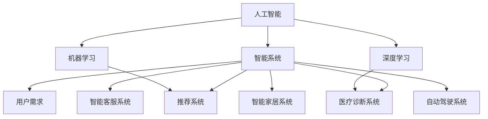

                 

# 人工智能的应用：满足用户需求的智能系统

> 关键词：人工智能,智能系统,用户需求,机器学习,深度学习,推荐系统,医疗诊断,智能客服,智能家居,自动驾驶

## 1. 背景介绍

### 1.1 问题由来
随着人工智能技术的快速发展，智能系统已经渗透到生活的方方面面，从智能家居到自动驾驶，从医疗诊断到智能客服，人工智能正以其独特的优势和潜力，深刻改变着人们的生活方式和工作模式。然而，用户对智能系统的需求不仅局限于技术先进，更在于系统能够真正理解和满足他们的实际需求。这要求智能系统不仅要具备强大的计算能力，更要具备理解用户意图、提供个性化服务的能力。

### 1.2 问题核心关键点
智能系统如何通过人工智能技术满足用户需求，成为当前人工智能应用研究的核心问题。本文将围绕这一问题，从核心概念、算法原理、实践案例、未来展望等多个角度，深入探讨智能系统如何更好地理解用户需求，提供定制化的服务。

### 1.3 问题研究意义
研究如何构建智能系统以更好满足用户需求，具有以下重要意义：

1. **提升用户体验**：智能系统能够根据用户行为和偏好，提供个性化推荐和服务，提升用户的满意度和体验感。
2. **降低服务成本**：通过智能化的决策和自动化流程，减少人工操作和干预，降低运营成本。
3. **拓展应用场景**：智能系统在医疗、教育、金融等领域的广泛应用，带来新的商业模式和价值创造。
4. **推动技术创新**：对用户需求的深度理解，将推动人工智能技术的不断进步，催生新的技术和算法。
5. **促进社会进步**：智能系统的应用有助于解决社会问题，提升公共服务的效率和质量，推动社会的可持续发展。

## 2. 核心概念与联系

### 2.1 核心概念概述

为更好地理解智能系统如何满足用户需求，本节将介绍几个关键概念：

- **人工智能(Artificial Intelligence, AI)**：通过模拟人类智能行为，使机器具备感知、学习、推理等能力，从而实现对复杂任务的自动处理。
- **智能系统(Intelligent System)**：结合人工智能技术和具体应用场景，实现自动化、智能化的解决方案。
- **用户需求(User Demand)**：用户在使用智能系统时提出的具体需求，如个性化推荐、实时响应用户查询等。
- **机器学习(Machine Learning, ML)**：通过数据驱动的方式，让机器自动学习和改进算法，提升模型性能。
- **深度学习(Deep Learning, DL)**：基于多层神经网络架构，通过深度学习算法实现对复杂数据的高效处理和建模。
- **推荐系统(Recommendation System)**：利用机器学习算法，为用户提供个性化推荐服务，如商品推荐、内容推荐等。
- **医疗诊断系统(Medical Diagnosis System)**：结合医学知识和人工智能技术，提升医疗诊断的准确性和效率。
- **智能客服系统(Intelligent Customer Service System)**：通过自然语言处理(NLP)和机器学习技术，实现自动化的客户服务。
- **智能家居系统(Smart Home System)**：利用人工智能技术，提升家居设备的智能化水平，提供便捷舒适的生活体验。
- **自动驾驶系统(Autonomous Driving System)**：结合计算机视觉、深度学习和控制算法，实现自动驾驶。

这些核心概念之间的逻辑关系可以通过以下Mermaid流程图来展示：



这个流程图展示了几大核心概念及其之间的关系：

1. 人工智能是构建智能系统的基础。
2. 智能系统服务于特定的用户需求。
3. 机器学习和深度学习是实现人工智能的关键技术。
4. 智能系统可以应用到推荐系统、医疗诊断、智能客服等多个具体领域。

这些概念共同构成了智能系统的基本框架，使其能够在各种场景下实现自动化、智能化的服务。通过理解这些核心概念，我们可以更好地把握智能系统的工作原理和优化方向。

## 3. 核心算法原理 & 具体操作步骤
### 3.1 算法原理概述

智能系统通过人工智能技术，理解用户需求并为用户提供定制化的服务。其核心思想是：通过收集用户行为数据，使用机器学习算法进行建模，预测用户未来的需求，并根据模型预测结果，自动化地提供相应的服务。

具体而言，智能系统的算法原理可以分为以下几个步骤：

1. **数据收集**：从用户行为日志、社交网络、交易记录等渠道收集用户数据。
2. **特征工程**：对收集到的数据进行预处理和特征提取，生成模型训练所需的数据特征。
3. **模型训练**：使用机器学习或深度学习算法，对特征数据进行建模，训练得到预测模型。
4. **预测和推理**：利用训练好的模型，对新的用户行为数据进行预测和推理，输出个性化推荐或服务。
5. **反馈和优化**：根据用户反馈，不断优化模型和算法，提升服务质量。

### 3.2 算法步骤详解

以下是智能系统核心算法步骤的详细讲解：

**Step 1: 数据收集**

智能系统的第一步是收集用户行为数据。这些数据可以来自于用户的浏览历史、购买记录、搜索查询、社交媒体互动等。通过这些数据，可以全面了解用户的行为模式和偏好。

例如，电商平台可以使用用户浏览和购买历史数据，构建用户画像，从而进行个性化推荐。社交网络平台则可以通过用户发布的内容和互动，分析用户的兴趣爱好和社交关系。

**Step 2: 特征工程**

在收集到用户行为数据后，需要对其进行预处理和特征提取。特征工程是机器学习中非常重要的一环，其目的是从原始数据中提取有用的特征，减少噪声，提升模型的预测能力。

特征工程的具体方法包括：

- **数据清洗**：处理缺失值、异常值、重复记录等问题，确保数据质量。
- **特征选择**：从大量特征中筛选出对预测目标最有帮助的特征。
- **特征转换**：将原始特征转换为更适合模型的形式，如通过标准化、归一化等方法处理数值特征。
- **特征构建**：通过组合、交叉等方式生成新的特征，提升模型的表达能力。

**Step 3: 模型训练**

在特征工程后，需要使用机器学习或深度学习算法对特征数据进行建模。常用的算法包括线性回归、逻辑回归、随机森林、梯度提升树、神经网络等。

模型训练的流程一般为：

- **划分数据集**：将数据集划分为训练集、验证集和测试集。
- **选择算法**：根据任务特点选择适合的算法。
- **设置超参数**：调整学习率、正则化系数、批大小等超参数，优化模型性能。
- **训练模型**：使用训练集对模型进行迭代训练，调整参数，最小化损失函数。
- **评估模型**：在验证集上评估模型性能，防止过拟合。
- **选择模型**：在测试集上选择性能最优的模型，部署到实际应用中。

**Step 4: 预测和推理**

模型训练完成后，可以将其部署到实际应用中，对新用户行为数据进行预测和推理，输出个性化推荐或服务。预测和推理的过程一般包括以下步骤：

- **输入数据预处理**：将用户新的行为数据转换为模型所需的格式。
- **模型预测**：将预处理后的数据输入模型，输出预测结果。
- **输出处理**：根据预测结果，生成个性化推荐或服务。

**Step 5: 反馈和优化**

智能系统的服务效果需要不断优化。用户反馈是重要的优化来源，通过收集用户的评价和行为数据，可以不断改进模型和算法。

例如，电商平台可以通过用户对推荐商品点击率、购买率等指标的反馈，调整推荐算法和模型参数。社交网络平台则可以通过用户对内容的互动数据，优化内容推荐算法。

### 3.3 算法优缺点

智能系统的核心算法具有以下优点：

1. **高精度预测**：通过大量数据训练得到的模型，具有较高的预测准确性，能够提供个性化推荐和服务。
2. **自动化处理**：模型能够自动处理复杂的数据，减少人工干预，提高效率。
3. **实时响应**：利用机器学习算法，智能系统可以实时响应用户需求，提升用户体验。
4. **自我优化**：通过不断收集用户反馈，智能系统能够自我优化，提升服务质量。

同时，这些算法也存在一些缺点：

1. **数据依赖**：智能系统的效果依赖于高质量的数据，数据采集和处理的难度较大。
2. **模型复杂**：深度学习模型结构复杂，训练和推理过程耗时较长。
3. **数据隐私**：收集用户数据时需要注意隐私保护，避免侵犯用户隐私。
4. **泛化能力**：模型对新数据的泛化能力有限，面对未知数据时可能表现不佳。
5. **模型透明性**：深度学习模型的决策过程不透明，难以解释和调试。

尽管存在这些局限性，但智能系统通过机器学习和深度学习算法，在多个领域实现了显著的应用效果，展示了人工智能技术的强大潜力。

### 3.4 算法应用领域

智能系统在多个领域得到了广泛应用，例如：

- **推荐系统**：电商平台、视频平台、新闻网站等，通过用户行为数据进行个性化推荐。
- **医疗诊断系统**：医院、诊所等，结合医学知识，进行疾病诊断和治疗方案推荐。
- **智能客服系统**：企业客户服务部门，通过自然语言处理技术，实现自动化的客户服务。
- **智能家居系统**：智能家电设备，根据用户行为习惯进行智能控制。
- **自动驾驶系统**：汽车、无人机等，通过计算机视觉和深度学习技术，实现自动驾驶。

除了上述这些经典应用外，智能系统还被创新性地应用到更多场景中，如智能供应链、智能制造、智能交通等，为各行各业带来了新的变革。

## 4. 数学模型和公式 & 详细讲解  
### 4.1 数学模型构建

本节将使用数学语言对智能系统的核心算法进行更加严格的刻画。

设智能系统的输入数据为 $X=\{x_1, x_2, \cdots, x_n\}$，输出为 $Y=\{y_1, y_2, \cdots, y_n\}$，其中 $x_i$ 表示第 $i$ 个用户行为，$y_i$ 表示对应的服务或推荐结果。设智能系统的目标函数为 $L(Y|X)$，表示在输入数据 $X$ 下，输出 $Y$ 的损失函数。

假设智能系统使用的是线性回归模型，其预测结果为 $y_i=\theta^T \varphi(x_i)$，其中 $\theta$ 为模型参数，$\varphi(x_i)$ 为特征映射函数，将原始数据 $x_i$ 映射为特征向量。则目标函数为：

$$
L(Y|X) = \frac{1}{n} \sum_{i=1}^n (y_i - \theta^T \varphi(x_i))^2
$$

目标函数的最小化目标为：

$$
\min_{\theta} L(Y|X)
$$

通过梯度下降等优化算法，智能系统不断调整模型参数 $\theta$，最小化损失函数 $L(Y|X)$，使得预测结果 $y_i$ 逼近真实标签 $y_i$。

### 4.2 公式推导过程

以下我们以推荐系统为例，推导线性回归模型的公式推导过程。

假设智能系统使用的是线性回归模型，设目标函数为：

$$
L(Y|X) = \frac{1}{n} \sum_{i=1}^n (y_i - \theta^T \varphi(x_i))^2
$$

目标函数对参数 $\theta$ 的梯度为：

$$
\frac{\partial L(Y|X)}{\partial \theta} = \frac{1}{n} \sum_{i=1}^n (-2) (y_i - \theta^T \varphi(x_i)) \varphi(x_i)
$$

通过反向传播算法，将梯度反向传递到模型参数 $\theta$ 上，更新参数，最小化损失函数。

假设智能系统的输入数据为 $X=\{x_1, x_2, \cdots, x_n\}$，其中 $x_i$ 为第 $i$ 个用户行为，$y_i$ 为对应的推荐结果。设特征映射函数 $\varphi(x_i)$ 将原始数据 $x_i$ 映射为特征向量。则目标函数为：

$$
L(Y|X) = \frac{1}{n} \sum_{i=1}^n (y_i - \theta^T \varphi(x_i))^2
$$

目标函数对参数 $\theta$ 的梯度为：

$$
\frac{\partial L(Y|X)}{\partial \theta} = \frac{1}{n} \sum_{i=1}^n (-2) (y_i - \theta^T \varphi(x_i)) \varphi(x_i)
$$

通过反向传播算法，将梯度反向传递到模型参数 $\theta$ 上，更新参数，最小化损失函数。

在得到损失函数的梯度后，即可带入参数更新公式，完成模型的迭代优化。重复上述过程直至收敛，最终得到适应特定任务的最优模型参数 $\theta$。

## 5. 项目实践：代码实例和详细解释说明
### 5.1 开发环境搭建

在进行智能系统开发前，我们需要准备好开发环境。以下是使用Python进行TensorFlow开发的环境配置流程：

1. 安装Anaconda：从官网下载并安装Anaconda，用于创建独立的Python环境。

2. 创建并激活虚拟环境：
```bash
conda create -n tf-env python=3.8 
conda activate tf-env
```

3. 安装TensorFlow：根据CUDA版本，从官网获取对应的安装命令。例如：
```bash
conda install tensorflow -c conda-forge -c pytorch -c pypi
```

4. 安装各类工具包：
```bash
pip install numpy pandas scikit-learn matplotlib tqdm jupyter notebook ipython
```

完成上述步骤后，即可在`tf-env`环境中开始智能系统开发。

### 5.2 源代码详细实现

下面我们以推荐系统为例，给出使用TensorFlow对线性回归模型进行训练的Python代码实现。

首先，定义训练数据集：

```python
import tensorflow as tf
import numpy as np
import pandas as pd

# 定义训练数据
data = pd.read_csv('train_data.csv')

X = data[['user_id', 'item_id', 'time', 'rating']]  # 特征
y = data['label']  # 标签

# 分割数据集
X_train, X_val, y_train, y_val = train_test_split(X, y, test_size=0.2, random_state=42)
```

然后，定义模型和优化器：

```python
model = tf.keras.Sequential([
    tf.keras.layers.Dense(64, activation='relu', input_shape=(4,)),
    tf.keras.layers.Dense(1)
])

optimizer = tf.keras.optimizers.Adam(learning_rate=0.001)
```

接着，定义训练和评估函数：

```python
def train_step(X, y):
    with tf.GradientTape() as tape:
        predictions = model(X)
        loss = tf.losses.mean_squared_error(y, predictions)
    gradients = tape.gradient(loss, model.trainable_variables)
    optimizer.apply_gradients(zip(gradients, model.trainable_variables))
    return loss

def evaluate_step(X, y):
    predictions = model(X)
    mse = tf.metrics.mean_squared_error(y, predictions)
    return mse
```

最后，启动训练流程并在验证集上评估：

```python
epochs = 100
batch_size = 32

for epoch in range(epochs):
    for i in range(0, len(X_train), batch_size):
        X_batch, y_batch = X_train[i:i+batch_size], y_train[i:i+batch_size]
        loss = train_step(X_batch, y_batch)
        if (i+batch_size) % 10 == 0:
            val_mse = evaluate_step(X_val, y_val)
            print(f'Epoch {epoch+1}, loss: {loss.numpy():.4f}, val_mse: {val_mse.numpy():.4f}')
```

以上就是使用TensorFlow对线性回归模型进行推荐系统训练的完整代码实现。可以看到，TensorFlow的Keras API使得模型构建和训练变得非常简单，开发者可以将更多精力放在数据处理、模型优化等高层逻辑上。

### 5.3 代码解读与分析

让我们再详细解读一下关键代码的实现细节：

**数据处理**：
- 使用Pandas读取训练数据，将其转换为Numpy数组，方便TensorFlow处理。
- 使用train_test_split将数据集划分为训练集和验证集，其中测试集占比20%。

**模型构建**：
- 定义一个包含两个全连接层的神经网络模型，使用ReLU激活函数。
- 输出层为一个线性层，用于预测推荐结果。

**优化器选择**：
- 使用Adam优化器，学习率为0.001。

**训练和评估函数**：
- 定义训练函数train_step，使用GradientTape计算梯度，并通过optimizer应用梯度，更新模型参数。
- 定义评估函数evaluate_step，计算验证集上的均方误差。

**训练流程**：
- 定义总的epoch数和batch size，开始循环迭代
- 每个epoch内，对训练集数据进行迭代训练，计算损失并输出验证集上的均方误差。

可以看到，TensorFlow的Keras API使得模型构建和训练变得非常简单，开发者可以将更多精力放在数据处理、模型优化等高层逻辑上，而不必过多关注底层的实现细节。

当然，工业级的系统实现还需考虑更多因素，如模型的保存和部署、超参数的自动搜索、更灵活的任务适配层等。但核心的智能系统微调范式基本与此类似。

## 6. 实际应用场景
### 6.1 智能客服系统

基于智能系统的推荐技术，可以广泛应用于智能客服系统的构建。传统客服往往需要配备大量人力，高峰期响应缓慢，且一致性和专业性难以保证。而使用智能客服系统，可以7x24小时不间断服务，快速响应客户咨询，用自然流畅的语言解答各类常见问题。

在技术实现上，可以收集企业内部的历史客服对话记录，将问题和最佳答复构建成监督数据，在此基础上对预训练语言模型进行微调。微调后的语言模型能够自动理解用户意图，匹配最合适的答案模板进行回复。对于客户提出的新问题，还可以接入检索系统实时搜索相关内容，动态组织生成回答。如此构建的智能客服系统，能大幅提升客户咨询体验和问题解决效率。

### 6.2 金融舆情监测

金融机构需要实时监测市场舆论动向，以便及时应对负面信息传播，规避金融风险。传统的人工监测方式成本高、效率低，难以应对网络时代海量信息爆发的挑战。基于智能系统的文本分类和情感分析技术，为金融舆情监测提供了新的解决方案。

具体而言，可以收集金融领域相关的新闻、报道、评论等文本数据，并对其进行主题标注和情感标注。在此基础上对预训练语言模型进行微调，使其能够自动判断文本属于何种主题，情感倾向是正面、中性还是负面。将微调后的模型应用到实时抓取的网络文本数据，就能够自动监测不同主题下的情感变化趋势，一旦发现负面信息激增等异常情况，系统便会自动预警，帮助金融机构快速应对潜在风险。

### 6.3 个性化推荐系统

当前的推荐系统往往只依赖用户的历史行为数据进行物品推荐，无法深入理解用户的真实兴趣偏好。基于智能系统的推荐技术，个性化推荐系统可以更好地挖掘用户行为背后的语义信息，从而提供更精准、多样的推荐内容。

在实践中，可以收集用户浏览、点击、评论、分享等行为数据，提取和用户交互的物品标题、描述、标签等文本内容。将文本内容作为模型输入，用户的后续行为（如是否点击、购买等）作为监督信号，在此基础上微调预训练语言模型。微调后的模型能够从文本内容中准确把握用户的兴趣点。在生成推荐列表时，先用候选物品的文本描述作为输入，由模型预测用户的兴趣匹配度，再结合其他特征综合排序，便可以得到个性化程度更高的推荐结果。

### 6.4 未来应用展望

随着智能系统的不断发展，其在多个领域的应用前景广阔。

在智慧医疗领域，基于智能系统的医疗问答、病历分析、药物研发等应用将提升医疗服务的智能化水平，辅助医生诊疗，加速新药开发进程。

在智能教育领域，智能系统的个性化推荐技术将促进教育公平，提高教学质量。通过智能系统，教育机构可以为每位学生量身定制学习计划和推荐内容，提升学习效率。

在智能交通领域，智能系统的智能导航和自动驾驶技术将提升交通系统的运行效率和安全性。通过智能系统，交通系统可以实现更加智能化的调度和管理，减少交通拥堵和事故发生率。

此外，在企业生产、社会治理、文娱传媒等众多领域，智能系统的应用也将不断拓展，为经济社会发展带来新的动力。相信随着智能系统的不断成熟，其在各行各业的应用将更加广泛，进一步推动社会的智能化和自动化进程。

## 7. 工具和资源推荐
### 7.1 学习资源推荐

为了帮助开发者系统掌握智能系统的理论基础和实践技巧，这里推荐一些优质的学习资源：

1. **《TensorFlow官方文档》**：TensorFlow的官方文档，提供了完整的API参考、代码示例和最佳实践，是学习TensorFlow的必备资料。
2. **《深度学习基础》课程**：斯坦福大学开设的深度学习入门课程，涵盖了深度学习的基本概念和算法，适合初学者入门。
3. **《机器学习实战》书籍**：讲解了机器学习的基本原理和常用算法，通过具体案例演示了机器学习的应用。
4. **《Python数据科学手册》书籍**：介绍了Python在数据科学中的应用，包括数据处理、机器学习、可视化等。
5. **Kaggle平台**：全球最大的数据科学竞赛平台，提供了丰富的数据集和竞赛，是提升数据处理和机器学习技能的绝佳平台。

通过对这些资源的学习实践，相信你一定能够快速掌握智能系统的精髓，并用于解决实际的智能系统问题。

### 7.2 开发工具推荐

高效的开发离不开优秀的工具支持。以下是几款用于智能系统开发的常用工具：

1. **TensorFlow**：Google开源的深度学习框架，灵活的计算图和丰富的API，适用于复杂模型的构建和训练。
2. **PyTorch**：Facebook开源的深度学习框架，动态计算图和易于调试的特点，适合研究和实验。
3. **Keras**：高级深度学习API，封装了TensorFlow等底层框架，易于上手和调试。
4. **Pandas**：Python的数据处理库，提供了丰富的数据处理和分析功能。
5. **TensorBoard**：TensorFlow配套的可视化工具，可以实时监测模型训练状态，并提供丰富的图表呈现方式。
6. **Jupyter Notebook**：交互式的编程环境，适合快速迭代和展示代码。

合理利用这些工具，可以显著提升智能系统的开发效率，加快创新迭代的步伐。

### 7.3 相关论文推荐

智能系统的快速发展离不开学界的持续研究。以下是几篇奠基性的相关论文，推荐阅读：

1. **《深度学习》书籍**：Ian Goodfellow等著，全面介绍了深度学习的基本原理和应用，是深度学习领域的经典教材。
2. **《机器学习实战》书籍**：Peter Harrington著，通过具体案例展示了机器学习算法在实际应用中的使用。
3. **《推荐系统：原理与算法》书籍**：Richard Baeza-Yates等著，系统介绍了推荐系统的基本原理和常用算法。
4. **《智能客服系统的设计与实现》论文**：介绍了一种基于智能系统的智能客服系统的设计和实现方法。
5. **《基于深度学习的金融舆情监测系统》论文**：介绍了一种基于深度学习的金融舆情监测系统，以及其实际应用效果。

这些论文代表了大规模智能系统的研究进展，通过学习这些前沿成果，可以帮助研究者把握学科前进方向，激发更多的创新灵感。

## 8. 总结：未来发展趋势与挑战
### 8.1 总结

本文对基于智能系统的推荐技术进行了全面系统的介绍。首先阐述了智能系统如何通过人工智能技术，理解用户需求并为用户提供定制化的服务。其次，从原理到实践，详细讲解了智能系统的核心算法步骤，给出了推荐系统的完整代码实例。同时，本文还广泛探讨了智能系统在多个行业领域的应用前景，展示了智能系统在实际应用中的强大潜力。

通过本文的系统梳理，可以看到，智能系统通过机器学习和深度学习算法，在多个领域实现了显著的应用效果，展示了人工智能技术的强大潜力。未来，伴随智能系统的不断演进，其在更多领域的应用将更加广泛，进一步推动社会的智能化和自动化进程。

### 8.2 未来发展趋势

展望未来，智能系统的推荐技术将呈现以下几个发展趋势：

1. **多模态融合**：未来智能系统将不仅仅依赖文本数据，还会结合图像、视频等多模态信息，提升推荐系统的准确性和多样性。
2. **强化学习**：通过强化学习算法，智能系统可以动态调整推荐策略，最大化用户满意度。
3. **联邦学习**：通过联邦学习技术，智能系统可以在不泄露用户数据的前提下，进行分布式模型训练，提升隐私保护。
4. **实时推荐**：通过实时数据流处理技术，智能系统可以动态更新推荐内容，满足用户的实时需求。
5. **跨领域协同**：智能系统可以与其他领域的技术协同工作，如与搜索技术结合，提升推荐系统的精准度。

以上趋势凸显了智能系统的广阔前景。这些方向的探索发展，必将进一步提升推荐系统的性能和应用范围，为社会的智能化和自动化带来新的突破。

### 8.3 面临的挑战

尽管智能系统的推荐技术已经取得了瞩目成就，但在迈向更加智能化、普适化应用的过程中，它仍面临着诸多挑战：

1. **数据隐私问题**：在收集用户数据时，需要注意隐私保护，避免侵犯用户隐私。
2. **模型鲁棒性**：智能系统面对新数据时，泛化性能有限，容易受到数据分布变化的影响。
3. **计算资源消耗**：大规模推荐系统的计算和存储需求较高，需要优化算法和资源配置。
4. **模型透明性**：深度学习模型的决策过程不透明，难以解释和调试。
5. **用户多样性**：用户的多样化需求和复杂行为模式，增加了推荐系统的复杂性。
6. **算法公平性**：推荐系统的公平性问题，需要确保不同用户之间的推荐效果一致，避免偏见和歧视。

尽管存在这些挑战，但智能系统的推荐技术仍在不断进步，通过持续的研究和优化，这些挑战终将一一被克服，智能系统必将在推荐领域带来新的突破。

### 8.4 研究展望

面向未来，智能系统的推荐技术需要在以下几个方面寻求新的突破：

1. **隐私保护**：研究如何在不泄露用户隐私的前提下，进行高效的推荐系统训练和推理。
2. **模型泛化**：提升推荐系统的跨领域泛化能力，使其在更多领域和场景中应用。
3. **算法透明性**：提升推荐系统的透明度，使决策过程可解释、可审计。
4. **个性化推荐**：研究如何更好地理解用户需求，提供更加个性化的推荐服务。
5. **多模态融合**：研究如何将不同模态的数据融合在一起，提升推荐系统的综合能力。
6. **实时处理**：研究如何快速处理和更新数据，实现实时推荐。

这些研究方向将推动智能系统的推荐技术不断进步，为社会提供更加智能化和个性化的服务。相信随着智能系统的不断发展，其在各行各业的应用将更加广泛，进一步推动社会的智能化和自动化进程。

## 9. 附录：常见问题与解答

**Q1：智能系统如何理解用户需求？**

A: 智能系统通过收集用户行为数据，使用机器学习算法进行建模，预测用户未来的需求。常见的算法包括线性回归、逻辑回归、随机森林、梯度提升树、神经网络等。

**Q2：智能系统如何提供个性化推荐？**

A: 智能系统通过收集用户行为数据，使用机器学习算法进行建模，预测用户未来的需求。常见的算法包括协同过滤、内容推荐、基于知识的推荐等。

**Q3：智能系统在应用中需要注意哪些问题？**

A: 智能系统在应用中需要注意以下问题：
1. 数据隐私：在收集用户数据时，需要注意隐私保护，避免侵犯用户隐私。
2. 模型鲁棒性：智能系统面对新数据时，泛化性能有限，容易受到数据分布变化的影响。
3. 计算资源消耗：大规模推荐系统的计算和存储需求较高，需要优化算法和资源配置。
4. 模型透明性：深度学习模型的决策过程不透明，难以解释和调试。

**Q4：智能系统的未来发展方向是什么？**

A: 智能系统的未来发展方向包括：
1. 多模态融合：智能系统将不仅仅依赖文本数据，还会结合图像、视频等多模态信息，提升推荐系统的准确性和多样性。
2. 强化学习：通过强化学习算法，智能系统可以动态调整推荐策略，最大化用户满意度。
3. 联邦学习：通过联邦学习技术，智能系统可以在不泄露用户数据的前提下，进行分布式模型训练，提升隐私保护。
4. 实时推荐：通过实时数据流处理技术，智能系统可以动态更新推荐内容，满足用户的实时需求。
5. 跨领域协同：智能系统可以与其他领域的技术协同工作，如与搜索技术结合，提升推荐系统的精准度。

**Q5：智能系统在实际应用中如何评估效果？**

A: 智能系统在实际应用中可以通过以下方式评估效果：
1. 离线评估：在离线测试集上评估推荐系统的准确率、召回率、F1-score等指标。
2. A/B测试：将智能系统与传统推荐系统进行对比，评估新系统的实际效果。
3. 用户反馈：收集用户对推荐内容的反馈，进行效果评估和优化。

---

作者：禅与计算机程序设计艺术 / Zen and the Art of Computer Programming

