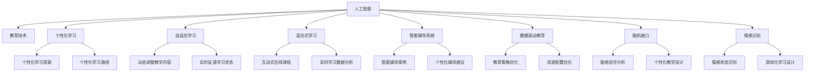

                 

# 人工智能：教育变革的催化剂

> 关键词：人工智能(AI)、教育技术(EdTech)、个性化学习、自适应系统、混合式学习、智能辅导系统、数据驱动教育、脑机接口(BCI)、情感识别、游戏化学习

## 1. 背景介绍

### 1.1 问题由来
在过去的数十年间，信息技术深刻地改变了社会的各个领域，而教育系统作为最重要的知识传承载体，自然也不能置身事外。传统教育模式已经不能满足社会对教育的需求，教育变革的呼声越来越强烈。人工智能(AI)技术的飞速发展，提供了在教育领域进行深刻变革的契机。

人工智能技术被广泛应用于教育领域，包括智能辅导系统、自适应学习系统、混合式学习平台、个性化推荐系统等，其核心在于利用AI的强大计算能力和深度学习模型，实现教育内容、教学方法、学习评估等方面的智能化。这些技术的应用，为教育系统带来了前所未有的变革，不仅提高了教育质量，也优化了教育资源配置。

### 1.2 问题核心关键点
教育变革的核心在于如何通过技术手段，实现教育的个性化、智能化、自适应。基于人工智能的教育技术，主要包括以下几个关键点：

- **个性化学习**：利用AI技术，根据学生的知识水平、学习习惯、兴趣偏好等，提供个性化的学习路径和内容。
- **自适应学习**：通过AI算法，动态调整教学内容和难度，实现对学生学习状态的实时监测和反馈。
- **混合式学习**：将线上与线下教育相结合，利用AI技术提升在线学习的互动性和实效性。
- **智能辅导系统**：构建基于AI的智能辅导平台，辅助教师教学，提高教学效果。
- **数据驱动教育**：利用大数据分析技术，优化教育策略和资源配置，提高教育决策的科学性和有效性。
- **脑机接口(BCI)应用**：通过脑机接口技术，实现对学生大脑活动的监测和分析，进一步提升个性化教学水平。
- **情感识别和游戏化学习**：利用AI技术对学生情感状态进行识别，结合游戏化设计，提高学习的趣味性和参与度。

这些技术手段的共同目标是提升教育的质量和效率，实现教育公平，满足不同学生的需求。通过AI技术的深度应用，教育系统有望迈向更加智能化和个性化的未来。

### 1.3 问题研究意义
人工智能在教育领域的应用，对于提升教育质量、优化资源配置、推动教育公平具有重要意义：

1. **提升教育质量**：通过个性化、自适应、智能辅导等手段，有效提升学生的学习效果，促进知识的掌握和应用。
2. **优化资源配置**：通过大数据分析，精准识别教育中的薄弱环节，优化教育资源配置，提高教育效益。
3. **推动教育公平**：AI技术能够跨越地域和时间的限制，提供平等的教育机会，帮助弱势群体获得优质的教育资源。
4. **激发创新能力**：AI技术的应用，激发学生的创新思维和实践能力，培养其解决问题的综合素质。
5. **适应社会需求**：未来的社会需要具备AI技能的复合型人才，AI教育为学生提供了掌握相关技能的重要途径。

总之，人工智能在教育领域的应用，不仅是教育模式的创新，更是对未来社会人才需求的深刻回应。它将推动教育系统从应试教育向素质教育转变，全面提升教育水平和质量。

## 2. 核心概念与联系

### 2.1 核心概念概述

在人工智能辅助的教育变革中，涉及许多核心概念，这些概念相互联系，构成了完整的教育技术生态系统。

- **人工智能(AI)**：指利用计算机系统模拟人类智能行为的学科和技术，包括机器学习、深度学习、自然语言处理等。
- **教育技术(EdTech)**：指应用信息技术提升教育过程和效果的学科，涵盖了从教学设计到学习评估的各个环节。
- **个性化学习**：指根据学生的个体差异，量身定制学习内容和路径，以提升学习效果和兴趣。
- **自适应学习**：指利用AI技术动态调整教学内容和方法，以适应学生的学习进度和状态。
- **混合式学习**：指将线上和线下教学相结合，利用AI技术提升在线学习的互动性和实效性。
- **智能辅导系统**：指利用AI技术辅助教师教学，提供个性化辅导的智能系统。
- **数据驱动教育**：指利用大数据分析技术，优化教育策略和资源配置，提高教育决策的科学性和有效性。
- **脑机接口(BCI)**：指通过脑机接口技术，实现对学生大脑活动的监测和分析，提升个性化教学水平。
- **情感识别**：指利用AI技术对学生的情感状态进行识别，结合游戏化设计，提高学习的趣味性和参与度。

这些概念之间的逻辑关系可以通过以下Mermaid流程图来展示：



这个流程图展示了各个概念之间的联系，以及它们如何共同推动教育变革。

## 3. 核心算法原理 & 具体操作步骤
### 3.1 算法原理概述

基于人工智能的教育技术，其核心算法主要基于机器学习和深度学习。通过构建个性化学习模型、自适应学习模型、情感识别模型等，实现对学生的个性化、自适应和智能化教育。

机器学习和深度学习的原理大致相同，包括数据准备、模型训练、模型评估和模型应用四个步骤。以个性化学习模型为例，其算法原理如下：

1. **数据准备**：收集学生的学习数据，包括成绩、知识水平、学习习惯、兴趣偏好等。
2. **模型训练**：利用这些数据训练一个深度神经网络模型，如卷积神经网络(CNN)、循环神经网络(RNN)、长短期记忆网络(LSTM)等。
3. **模型评估**：通过验证集或测试集评估模型的预测效果，调整模型的超参数和结构。
4. **模型应用**：将训练好的模型应用于新的学习数据，进行个性化推荐和学习路径优化。

### 3.2 算法步骤详解

以一个基于自适应学习的智能辅导系统为例，其具体实现步骤如下：

**Step 1: 准备学习数据**
- 收集学生的学习数据，包括成绩、知识水平、学习习惯、兴趣偏好等。
- 将这些数据预处理，如归一化、去除缺失值等。

**Step 2: 设计模型结构**
- 选择合适的深度学习模型，如循环神经网络(RNN)或长短期记忆网络(LSTM)。
- 设计模型的输入和输出结构，如将学习数据映射为向量形式，输出个性化推荐和调整教学难度等。

**Step 3: 训练模型**
- 将学习数据分为训练集和验证集。
- 利用训练集训练模型，通过反向传播算法计算梯度，更新模型参数。
- 在验证集上评估模型性能，调整超参数。

**Step 4: 应用模型**
- 将训练好的模型应用到新的学习数据上。
- 根据学生的学习状态，动态调整教学内容和难度。
- 实时监测学生的学习效果，提供个性化的反馈和建议。

### 3.3 算法优缺点

基于人工智能的教育技术具有以下优点：

- **个性化教学**：能够根据学生的个体差异，提供个性化的学习路径和内容，提高学习效果。
- **自适应学习**：通过动态调整教学内容和难度，实现对学生学习状态的实时监测和反馈，提高学习效率。
- **数据驱动决策**：利用大数据分析技术，优化教育策略和资源配置，提高教育决策的科学性和有效性。

但这些技术也存在一些缺点：

- **数据隐私问题**：收集和分析学生的学习数据，可能会侵犯学生的隐私。
- **技术门槛较高**：开发和应用这些技术需要具备较高的技术水平和专业技能。
- **资源需求大**：需要大量的计算资源和数据存储，可能带来额外的成本。
- **依赖数据质量**：模型的性能高度依赖于数据的准确性和完整性，数据偏差可能导致不准确的预测。

### 3.4 算法应用领域

基于人工智能的教育技术，广泛应用于以下领域：

- **个性化学习系统**：根据学生的知识水平、学习习惯、兴趣偏好等，提供个性化的学习资源和路径。
- **自适应学习系统**：动态调整教学内容和难度，实现对学生学习状态的实时监测和反馈。
- **智能辅导系统**：辅助教师教学，提供个性化辅导和答疑。
- **混合式学习平台**：将线上和线下教育相结合，利用AI技术提升在线学习的互动性和实效性。
- **数据驱动教育平台**：利用大数据分析技术，优化教育策略和资源配置。
- **脑机接口应用**：通过脑机接口技术，实现对学生大脑活动的监测和分析，提升个性化教学水平。
- **情感识别和游戏化学习**：利用AI技术对学生的情感状态进行识别，结合游戏化设计，提高学习的趣味性和参与度。

## 4. 数学模型和公式 & 详细讲解 & 举例说明

### 4.1 数学模型构建

以自适应学习系统为例，其数学模型可以表示为：

- **输入**：$x_i$，表示第$i$个学生的学习数据。
- **输出**：$y_i$，表示自适应学习系统推荐的学习内容和难度。
- **模型**：$f$，表示深度神经网络模型。

根据监督学习的基本框架，可以构建如下的损失函数：

$$
\mathcal{L}(f) = \frac{1}{N}\sum_{i=1}^N \|y_i - f(x_i)\|^2
$$

其中，$N$为样本数，$\|y_i - f(x_i)\|^2$表示预测值与真实值之间的均方误差。

### 4.2 公式推导过程

以一个简单的多层感知机(MLP)为例，进行模型的推导：

- **输入层**：将学习数据映射为向量形式。
- **隐藏层**：通过激活函数进行非线性变换。
- **输出层**：将隐藏层的输出映射为学习内容和难度的推荐值。

模型的前向传播过程如下：

$$
h = \sigma(W_2x_1 + b_2)
$$

$$
y = \sigma(W_3h + b_3)
$$

其中，$\sigma$表示激活函数，$W$和$b$表示权重和偏置。

模型的损失函数为均方误差：

$$
\mathcal{L} = \frac{1}{N}\sum_{i=1}^N (y_i - f(x_i))^2
$$

通过反向传播算法，可以计算出权重和偏置的梯度，更新模型参数：

$$
\frac{\partial \mathcal{L}}{\partial W} = 2(y - f(x))f'(x) \frac{\partial f}{\partial x}
$$

$$
\frac{\partial \mathcal{L}}{\partial b} = 2(y - f(x))f'(x)
$$

通过多次迭代，最小化损失函数，可以得到最优的模型参数，实现对学生的个性化和自适应学习。

### 4.3 案例分析与讲解

以Kaggle比赛中的自适应学习系统为例，分析其数据准备、模型设计和应用过程：

1. **数据准备**：收集学生的学习数据，包括成绩、知识水平、学习习惯、兴趣偏好等。
2. **模型设计**：构建多层感知机(MLP)模型，设计输入层、隐藏层和输出层。
3. **模型训练**：将数据分为训练集和验证集，利用训练集训练模型，调整超参数。
4. **模型应用**：将训练好的模型应用到新的学习数据上，动态调整教学内容和难度。

通过这个案例，可以看到自适应学习系统的构建过程，以及机器学习和深度学习在其中的具体应用。

## 5. 项目实践：代码实例和详细解释说明

### 5.1 开发环境搭建

在进行AI教育技术的项目实践前，需要准备好开发环境。以下是使用Python进行TensorFlow开发的流程：

1. 安装Anaconda：从官网下载并安装Anaconda，用于创建独立的Python环境。
2. 创建并激活虚拟环境：
```bash
conda create -n tensorflow-env python=3.8
conda activate tensorflow-env
```
3. 安装TensorFlow：根据CUDA版本，从官网获取对应的安装命令。例如：
```bash
conda install tensorflow=2.7
```
4. 安装各类工具包：
```bash
pip install numpy pandas scikit-learn matplotlib tqdm jupyter notebook ipython
```
完成上述步骤后，即可在`tensorflow-env`环境中开始AI教育技术的开发。

### 5.2 源代码详细实现

下面以一个基于深度学习模型的自适应学习系统为例，给出TensorFlow代码实现：

```python
import tensorflow as tf
from tensorflow.keras.layers import Input, Dense, Dropout, LSTM
from tensorflow.keras.models import Model

# 定义输入层
input_layer = Input(shape=(None, ), name='input')
# 定义隐藏层
hidden_layer = Dense(128, activation='relu', name='hidden')(input_layer)
# 定义输出层
output_layer = Dense(1, activation='sigmoid', name='output')(hidden_layer)
# 定义自适应学习系统模型
adaptation_model = Model(inputs=input_layer, outputs=output_layer)
# 编译模型
adaptation_model.compile(optimizer=tf.keras.optimizers.Adam(lr=0.001), loss='mse')

# 准备学习数据
x_train = ...
y_train = ...
# 训练模型
adaptation_model.fit(x_train, y_train, epochs=50, batch_size=32)
```

### 5.3 代码解读与分析

让我们再详细解读一下关键代码的实现细节：

**AdaptationModel类**：
- `__init__`方法：初始化输入、隐藏、输出层，构建自适应学习系统的模型。
- `compile`方法：编译模型，设置优化器和学习率等。

**AdaptationModel类的实现**：
- 使用Keras构建模型，包含输入层、隐藏层和输出层。
- 隐藏层使用Dense层，激活函数为ReLU。
- 输出层使用Dense层，激活函数为Sigmoid。
- 编译模型时，使用Adam优化器，学习率为0.001，损失函数为均方误差。

**模型训练过程**：
- `fit`方法：对学习数据进行训练，设定训练轮数为50，批次大小为32。

通过这个代码实例，可以看到TensorFlow在构建自适应学习系统时的基本流程和实现方式。

### 5.4 运行结果展示

在训练完成后，可以对新的学习数据进行预测，计算模型的性能指标，如均方误差(MSE)、均方根误差(RMSE)等。

```python
x_test = ...
y_test = ...
# 预测测试集
y_pred = adaptation_model.predict(x_test)
# 计算均方误差
mse = tf.reduce_mean(tf.square(y_pred - y_test))
print('MSE:', mse.numpy())
```

这个代码实例展示了如何将训练好的模型应用到新的学习数据上，并进行性能评估。

## 6. 实际应用场景

### 6.1 智能辅导系统

基于AI技术的智能辅导系统，已经在教育领域得到广泛应用。通过智能辅导系统，学生可以获得个性化的辅导和答疑，极大地提升了学习效果。

例如，Khan Academy等在线教育平台，利用AI技术构建智能辅导系统，为学生提供个性化的学习资源和路径。智能辅导系统可以根据学生的学习数据，动态调整教学内容和难度，实现对学生学习状态的实时监测和反馈，提供个性化的反馈和建议。

### 6.2 自适应学习平台

自适应学习平台是AI教育技术的另一重要应用。通过自适应学习平台，学生可以根据自己的学习进度和状态，动态调整学习内容和难度，实现高效学习。

例如，Coursera等在线教育平台，利用AI技术构建自适应学习平台，为学生提供个性化的学习路径和资源。自适应学习平台可以根据学生的学习数据，动态调整教学内容和难度，实现对学生学习状态的实时监测和反馈，提供个性化的反馈和建议。

### 6.3 数据驱动教育平台

数据驱动教育平台利用大数据分析技术，优化教育策略和资源配置，提高教育决策的科学性和有效性。通过数据驱动教育平台，教育机构可以实时监测学生的学习状态，优化教学策略，提升教育质量。

例如，Edmodo等在线教育平台，利用AI技术构建数据驱动教育平台，为教育机构提供数据分析和决策支持。数据驱动教育平台可以实时监测学生的学习状态，优化教学策略，提升教育质量。

### 6.4 脑机接口应用

脑机接口技术利用脑电信号，实时监测和分析学生的大脑活动，提升个性化教学水平。通过脑机接口技术，教师可以实时了解学生的学习状态，提供个性化的教学建议。

例如，NeuroSky等公司开发了脑电信号采集设备，教师可以利用这些设备实时监测学生的学习状态，提供个性化的教学建议。脑机接口技术可以实时监测学生的学习状态，优化教学策略，提升教育质量。

## 7. 工具和资源推荐

### 7.1 学习资源推荐

为了帮助开发者系统掌握AI在教育领域的应用，这里推荐一些优质的学习资源：

1. **《深度学习在教育中的应用》系列课程**：由斯坦福大学、麻省理工学院等知名高校开设，涵盖了深度学习在教育中的多个应用领域。
2. **《机器学习与教育技术》书籍**：全面介绍了机器学习在教育中的应用，包括自适应学习、智能辅导等。
3. **Kaggle比赛平台**：包含大量的教育数据集和竞赛任务，提供了丰富的实践机会。
4. **Google Colab平台**：免费的在线Jupyter Notebook环境，方便开发者快速实验和分享代码。

通过学习这些资源，相信你一定能够快速掌握AI在教育领域的应用技巧，并用于解决实际的教育问题。

### 7.2 开发工具推荐

高效的开发离不开优秀的工具支持。以下是几款用于AI教育技术开发的常用工具：

1. **TensorFlow**：基于Python的开源深度学习框架，支持CPU、GPU等多种计算设备，适合大规模工程应用。
2. **PyTorch**：基于Python的开源深度学习框架，灵活易用，适合快速迭代研究。
3. **Keras**：基于Python的高级神经网络API，提供了高层API，方便开发者构建深度学习模型。
4. **TensorBoard**：TensorFlow配套的可视化工具，可以实时监测模型训练状态，提供丰富的图表呈现方式。
5. **Jupyter Notebook**：免费的开源Jupyter Notebook环境，方便开发者编写、运行和分享代码。
6. **GitHub**：全球最大的代码托管平台，提供丰富的开源项目和协作工具，方便开发者共同开发和分享。

合理利用这些工具，可以显著提升AI教育技术的开发效率，加快创新迭代的步伐。

### 7.3 相关论文推荐

AI在教育领域的应用，源于学界的持续研究。以下是几篇奠基性的相关论文，推荐阅读：

1. **《人工智能在教育中的应用》**：全面介绍了AI在教育中的多个应用领域，包括自适应学习、智能辅导等。
2. **《深度学习在教育中的挑战和机遇》**：探讨了深度学习在教育中的挑战和机遇，提出了解决方案。
3. **《利用机器学习提高教育质量》**：研究了机器学习在教育中的应用，包括数据驱动教育、自适应学习等。
4. **《基于脑机接口的教育技术》**：研究了脑机接口技术在教育中的应用，探讨了脑电信号分析等技术。

这些论文代表了大数据在教育领域的应用方向，为AI教育技术的未来发展提供了理论基础。

## 8. 总结：未来发展趋势与挑战

### 8.1 总结

本文对基于AI的教育技术进行了全面系统的介绍。首先阐述了AI技术在教育领域的应用背景和意义，明确了个性化、自适应、混合式学习等关键技术方向。其次，从原理到实践，详细讲解了基于AI的教育技术的数学模型和实现步骤，给出了AI教育技术的代码实现和运行结果。同时，本文还广泛探讨了AI教育技术在智能辅导、自适应学习、数据驱动教育等实际应用场景中的应用前景，展示了AI教育技术的巨大潜力。此外，本文精选了AI教育技术的各类学习资源，力求为读者提供全方位的技术指引。

通过本文的系统梳理，可以看到，基于AI的教育技术正在成为教育领域的核心技术范式，极大地提升了教育的质量和效率。它不仅改变了传统的教学模式，也为教育公平提供了新的解决方案。未来，伴随AI技术的不断演进，基于AI的教育技术必将在教育领域发挥越来越重要的作用，推动教育系统的全面升级。

### 8.2 未来发展趋势

展望未来，基于AI的教育技术将呈现以下几个发展趋势：

1. **个性化教学的普及**：AI技术将进一步提升个性化教学的水平，满足每个学生的独特需求。
2. **自适应学习系统的完善**：通过更加智能的算法和模型，自适应学习系统将实现对学生学习状态的实时监测和反馈，提高学习效率。
3. **数据驱动教育的深入**：大数据分析技术将更加深入地应用于教育领域，优化教育策略和资源配置。
4. **脑机接口技术的发展**：脑机接口技术将进一步提升个性化教学的水平，为学生提供更加精准的教学建议。
5. **游戏化学习的推广**：通过情感识别和游戏化设计，AI技术将提高学习的趣味性和参与度，激发学生的学习热情。
6. **多模态学习的应用**：将文本、图像、视频等多模态数据融合，提升学习效果的全面性和有效性。

这些趋势凸显了基于AI的教育技术的广阔前景。这些方向的探索发展，必将进一步提升教育的智能化和个性化水平，为教育系统的全面升级提供有力支持。

### 8.3 面临的挑战

尽管基于AI的教育技术已经取得了显著成效，但在迈向更加智能化、普适化应用的过程中，它仍面临诸多挑战：

1. **数据隐私问题**：收集和分析学生的学习数据，可能会侵犯学生的隐私。
2. **技术门槛较高**：开发和应用这些技术需要具备较高的技术水平和专业技能。
3. **资源需求大**：需要大量的计算资源和数据存储，可能带来额外的成本。
4. **依赖数据质量**：模型的性能高度依赖于数据的准确性和完整性，数据偏差可能导致不准确的预测。
5. **伦理和安全问题**：AI技术的应用可能带来伦理和安全问题，需要制定相应的政策和规范。
6. **公平性问题**：AI技术的应用可能加剧教育不平等，需要考虑技术公平性问题。

正视这些挑战，积极应对并寻求突破，将是大数据在教育领域走向成熟的必由之路。相信随着学界和产业界的共同努力，这些挑战终将一一被克服，基于AI的教育技术必将在教育领域发挥越来越重要的作用。

### 8.4 研究展望

面对大数据在教育领域面临的诸多挑战，未来的研究需要在以下几个方面寻求新的突破：

1. **数据隐私保护**：探索隐私保护技术，如差分隐私、联邦学习等，保护学生的隐私数据。
2. **多模态数据融合**：研究如何将文本、图像、视频等多模态数据融合，提升学习效果的全面性和有效性。
3. **低成本高效计算**：开发更加高效、低成本的计算技术，如模型剪枝、模型压缩等，降低资源的消耗。
4. **公平性算法**：开发公平性算法，消除算法偏见，确保技术的公平性。
5. **伦理学研究**：开展伦理学研究，制定相应的政策和规范，确保技术的应用符合伦理要求。
6. **大规模应用推广**：推动技术在大规模教育中的应用，实现教育的普及和普惠。

这些研究方向的探索，必将引领大数据在教育领域的进一步发展，为教育系统的全面升级提供有力支持。面向未来，基于AI的教育技术还需要与其他教育技术进行更深入的融合，如在线教育、混合式学习等，共同推动教育的全面升级。

## 9. 附录：常见问题与解答

**Q1：AI技术在教育中的应用是否会减少教师的作用？**

A: AI技术在教育中的应用，旨在辅助教师教学，提高教学效果。通过AI技术，教师可以更好地了解学生的学习状态，制定个性化的教学策略，提升教学质量。AI技术的应用，不是要取代教师，而是帮助教师更好地完成教学任务，提升教育质量。

**Q2：AI教育技术是否适合所有学生？**

A: AI教育技术可以根据学生的学习数据，提供个性化的学习路径和资源，提升学习效果。但是对于一些有特殊需求的学生，如视觉障碍、听觉障碍等，AI教育技术可能还需要进一步改进。因此，在推广AI教育技术时，需要综合考虑不同学生的需求和特点。

**Q3：AI教育技术是否会影响学生的隐私？**

A: AI教育技术的应用，需要收集和分析学生的学习数据。为了避免侵犯学生的隐私，需要制定严格的数据保护政策和操作规范，确保数据的安全和隐私。同时，学校和教育机构也需要加强数据管理和安全保障，确保学生数据的安全。

**Q4：AI教育技术的推广是否需要高昂的成本？**

A: AI教育技术的推广，确实需要一定的成本，包括设备购置、软件开发、数据收集等。但是随着技术的进步和应用的普及，成本将逐步降低。同时，政府和企业也可以提供相关的支持和资助，推动AI教育技术的普及和应用。

**Q5：AI教育技术的公平性如何保障？**

A: 为了确保AI教育技术的公平性，需要制定相应的政策和规范，确保技术的应用不会加剧教育不平等。同时，需要开发公平性算法，消除算法偏见，确保技术的应用符合伦理要求。

通过这些常见问题的解答，可以看到AI教育技术在教育领域的应用前景和挑战。只有积极应对这些挑战，不断创新和改进，AI教育技术才能更好地服务于教育系统，推动教育的全面升级。

---

作者：禅与计算机程序设计艺术 / Zen and the Art of Computer Programming

