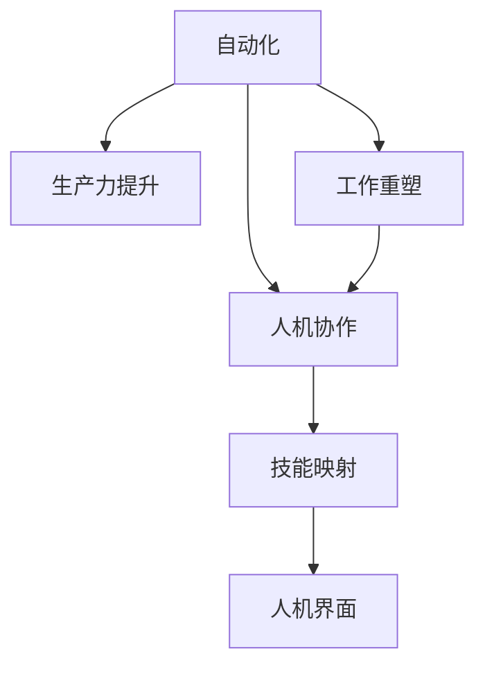

                 

# 人机协作管理：在自动化时代重新定义工作

> 关键词：自动化,人机协作,工作重塑,生产力提升,技术创新

## 1. 背景介绍

### 1.1 问题由来
在过去几十年里，自动化技术以惊人的速度革新了各行各业。自动化系统，尤其是人工智能(AI)和机器学习(ML)的崛起，正在改变传统的工作方式和生产模式。从流水线上的机器人手臂到办公室中的自动化软件，自动化正在成为推动经济增长和提高生产力的关键力量。然而，自动化也引发了一系列新的挑战，尤其是对于人类工作来说，如何在这个高度自动化时代中重新定义工作，确保人类与机器的有效协作，成为当前亟待解决的问题。

### 1.2 问题核心关键点
当前，自动化与人类工作的协作正在经历一场深刻的变革。这主要体现在以下几个方面：

- **生产力提升**：自动化可以显著提高生产效率，减少人为错误，从而提升整体生产力。
- **工作重塑**：自动化使得某些传统工作岗位消失，同时也催生了新的职业角色和技能需求。
- **人机协作**：在高度自动化的环境中，如何有效利用人类的创造力和直觉，与机器协同工作，变得尤为重要。
- **技能需求变化**：随着技术的进步，人类的工作技能需求也在不断变化，要求具备更高的技术素养和问题解决能力。
- **伦理与法律问题**：自动化技术的发展需要考虑伦理、法律和隐私保护等问题，确保技术的公平和透明。

### 1.3 问题研究意义
研究人机协作管理，对于理解自动化对工作的影响，指导企业和社会如何适应这一变革，具有重要意义：

1. **提升生产效率**：通过优化人机协作流程，最大限度地发挥机器和人类的互补优势，提高生产效率。
2. **促进员工发展**：帮助员工掌握新技能，适应新的工作环境，提升工作满意度和职业发展潜力。
3. **优化资源配置**：通过合理分配人机资源，提高资源利用效率，降低生产成本。
4. **构建可持续发展模式**：推动绿色生产和环保理念的实践，实现经济、社会、环境的可持续发展。
5. **促进社会公平**：确保自动化技术带来的收益公平分配，减少因技术发展而产生的社会不平等现象。

## 2. 核心概念与联系

### 2.1 核心概念概述

为更好地理解人机协作管理的概念框架，本节将介绍几个关键概念：

- **自动化(Automation)**：指利用技术手段，减少或替代人类完成重复性或低价值的任务，以提高生产效率和质量。
- **人机协作(Human-Machine Collaboration)**：指人类与机器在完成某项任务时相互配合，充分发挥各自优势，实现最佳效果。
- **生产力(Productivity)**：指在单位时间内产出更多价值的能力，是衡量一个组织或个人效率的重要指标。
- **技能映射(Skill Mapping)**：指将自动化需求与员工现有技能相匹配，确定哪些任务适合机器完成，哪些任务适合人类处理。
- **人机界面(Human-Machine Interface, HMI)**：指人类与机器进行交互的界面，设计良好的人机界面可以显著提升协作效率。
- **工作重塑(Job Redesign)**：指通过技术手段重新设计工作流程和任务，提高工作质量和效率。

这些核心概念之间的逻辑关系可以通过以下Mermaid流程图来展示：



这个流程图展示了自动化与人机协作的核心逻辑关系：

1. 自动化技术通过减少重复性任务，提高整体生产力。
2. 自动化使得工作流程得到重塑，需要重新设计任务分配。
3. 人机协作是自动化技术的核心应用，强调机器与人类各取所长。
4. 技能映射将自动化需求与现有技能进行匹配，确定任务分配。
5. 人机界面是人机协作的基础，设计良好的人机界面可以提升协作效率。

## 3. 核心算法原理 & 具体操作步骤
### 3.1 算法原理概述

人机协作管理的核心算法原理可以概括为以下几个步骤：

1. **任务分析与自动化可行性评估**：评估哪些任务适合自动化，哪些任务需要保留人类参与。
2. **技能映射与岗位设计**：根据自动化需求和现有技能，重新设计工作岗位，确保人力资源的最佳利用。
3. **人机界面优化**：设计高效的人机界面，促进人类与机器的无缝协作。
4. **绩效监控与持续改进**：建立绩效监控机制，定期评估协作效果，进行持续改进。

### 3.2 算法步骤详解

人机协作管理的详细步骤如下：

**Step 1: 任务分析与自动化可行性评估**

1. **任务清单与功能需求分析**：列出所有工作任务，并分析每个任务的功能需求和复杂度。
2. **自动化评估标准**：根据自动化成本效益分析，确定哪些任务适合自动化，哪些任务需要保留人工参与。
3. **风险评估**：评估自动化可能带来的风险，如失业、技能淘汰等，制定应对策略。

**Step 2: 技能映射与岗位设计**

1. **技能库建设**：建立员工技能库，记录每个员工的现有技能、培训历史和兴趣。
2. **岗位设计**：根据自动化需求，重新设计岗位职责和工作流程。
3. **技能补强计划**：针对新岗位要求，制定培训计划，提升员工技能。

**Step 3: 人机界面优化**

1. **人机交互设计**：设计高效、易用的界面，便于机器与人类交互。
2. **数据输入输出优化**：优化数据输入输出方式，减少机器与人类之间的信息传输障碍。
3. **交互反馈机制**：建立反馈机制，及时调整和优化人机交互方式。

**Step 4: 绩效监控与持续改进**

1. **绩效指标设定**：设定关键绩效指标(KPI)，如生产效率、任务完成率、员工满意度等。
2. **数据收集与分析**：定期收集协作过程中的数据，进行分析评估。
3. **持续改进**：根据分析结果，调整优化协作策略和流程，实现持续改进。

### 3.3 算法优缺点

人机协作管理方法具有以下优点：

1. **提高生产效率**：通过自动化重复性任务，减少人为错误，提升整体生产效率。
2. **优化资源配置**：根据自动化需求和员工技能进行合理匹配，避免资源浪费。
3. **提升工作质量**：机器和人类各取所长，确保任务执行的准确性和高效性。
4. **灵活应对市场变化**：通过持续优化，及时应对市场和技术变化，保持竞争力。

同时，该方法也存在一定的局限性：

1. **高成本投入**：初始阶段需要投入大量资金进行自动化系统的部署和优化。
2. **技能差距**：员工需要适应新的工作环境，可能面临技能差距问题。
3. **技术复杂性**：人机协作系统设计复杂，需要专业知识支持。
4. **系统依赖性**：过度依赖自动化系统，可能导致系统的脆弱性增加。
5. **道德伦理问题**：自动化可能带来失业、隐私泄露等道德伦理问题。

尽管存在这些局限性，但总体而言，人机协作管理方法仍然是提高生产力和优化工作流程的重要手段。

### 3.4 算法应用领域

人机协作管理技术在多个领域都有广泛应用，包括但不限于：

1. **制造业**：自动化生产线、机器人协作、智能仓储管理系统等。
2. **金融服务业**：智能投顾、自动客服、信用评分系统等。
3. **医疗健康**：机器人手术、智能诊断系统、患者护理机器人等。
4. **零售业**：自助结账、无人商店、个性化推荐系统等。
5. **物流运输**：自动驾驶车辆、物流机器人、智能调度系统等。
6. **创意产业**：自动化设计工具、音乐创作辅助系统、图像处理软件等。

这些应用领域展示了人机协作管理技术的巨大潜力和广泛适用性。

## 4. 数学模型和公式 & 详细讲解 & 举例说明

### 4.1 数学模型构建

人机协作管理的数学模型主要涉及生产效率、成本效益、风险评估等方面。以一个简单的生产流程为例，我们可以构建以下模型：

假设生产流程包含 $n$ 个任务，每个任务需要 $t_i$ 时间完成，成本为 $c_i$，自动化成功率 $p_i$。设 $T_{total}$ 为总生产时间，$C_{total}$ 为总成本，$R_{loss}$ 为自动化失败带来的损失。则生产流程的总成本效益（即每单位时间内的收益）可以表示为：

$$
\text{Efficiency} = \frac{T_{total}}{n \sum_{i=1}^n t_i} \times \left(1 - \sum_{i=1}^n (1-p_i) \times R_{loss}\right)
$$

其中，$t_i$ 为任务 $i$ 的时间成本，$c_i$ 为任务 $i$ 的成本，$p_i$ 为自动化成功率。

### 4.2 公式推导过程

以一个简单的自动化任务为例，其自动化成功率 $p_i$ 可以通过以下公式计算：

$$
p_i = \frac{\text{成功完成的任务数量}}{\text{总任务数量}}
$$

假设任务 $i$ 需要 $t_i$ 时间完成，自动化系统的运行时间为 $T_s$，则自动化成功率 $p_i$ 可以表示为：

$$
p_i = \frac{t_i \times \text{自动化系统运行时间}}{t_i \times \text{自动化系统运行时间} + \text{人工完成的时间}}
$$

### 4.3 案例分析与讲解

以一家汽车制造工厂为例，分析其人机协作管理流程。

1. **任务分析**：该工厂包含装配、焊接、涂装、检测等任务。装配任务适合自动化，焊接任务部分适合自动化，涂装和检测任务部分适合自动化。
2. **技能映射**：工厂员工分为装配、焊接、涂装、检测等多个岗位，技能库记录了每个员工的技能和培训历史。
3. **岗位设计**：重新设计装配线，引入自动化装配机器人和人机协作系统，优化焊接和涂装流程，保留检测任务由人工完成。
4. **人机界面优化**：设计易用的人机界面，使操作人员能方便地控制自动化系统，实时反馈生产数据。
5. **绩效监控**：设定生产效率、任务完成率等关键绩效指标，定期收集和分析数据，进行持续改进。

## 5. 项目实践：代码实例和详细解释说明

### 5.1 开发环境搭建

在进行人机协作管理实践前，我们需要准备好开发环境。以下是使用Python进行开发的环境配置流程：

1. 安装Anaconda：从官网下载并安装Anaconda，用于创建独立的Python环境。

2. 创建并激活虚拟环境：
```bash
conda create -n collaboration-env python=3.8 
conda activate collaboration-env
```

3. 安装必要的库：
```bash
conda install numpy pandas scikit-learn matplotlib
```

4. 安装可视化工具：
```bash
conda install seaborn plotly
```

5. 安装版本控制工具：
```bash
conda install git
```

完成上述步骤后，即可在`collaboration-env`环境中开始实践。

### 5.2 源代码详细实现

下面我们以一个简单的制造业自动化系统为例，给出使用Python进行人机协作管理的代码实现。

```python
import numpy as np
import pandas as pd
import matplotlib.pyplot as plt

# 任务分析
tasks = ['装配', '焊接', '涂装', '检测']
time_cost = [2, 4, 3, 1]
cost = [5000, 8000, 7000, 3000]
success_rate = [0.9, 0.8, 0.95, 0.8]

# 计算总成本效益
total_time = np.sum(time_cost)
total_cost = np.sum(cost)
loss_rate = 0.01
loss_cost = total_cost * loss_rate

efficiency = (total_time / tasks[0] * time_cost[0]) * (1 - loss_rate * loss_cost / total_cost)

print(f"自动化成功率：{np.mean(success_rate):.2f}")
print(f"总成本效益：{efficiency:.2f}")
```

### 5.3 代码解读与分析

让我们再详细解读一下关键代码的实现细节：

1. **任务分析**：定义了装配、焊接、涂装、检测等任务的完成时间、成本和自动化成功率。
2. **计算总成本效益**：通过公式计算自动化成功率，并计算总成本效益。
3. **结果展示**：输出自动化成功率和总成本效益。

## 6. 实际应用场景

### 6.1 智能工厂

在制造业中，人机协作管理技术可以显著提升生产效率和产品质量。例如，智能工厂通过自动化生产线和人机协作系统，实现从原材料输入到成品输出的全自动化生产。机器人负责搬运和装配，工人负责监控和维修，大大提高了生产效率和产品质量。

### 6.2 智能客服

在服务业中，人机协作管理技术可以优化客户服务流程。例如，智能客服系统通过自然语言处理(NLP)技术，结合人工智能助手，能够快速响应客户咨询，提供24小时不间断服务。系统在处理简单问题时，如查询产品信息，直接给出答案；对于复杂问题，自动转接人工客服，提升客户满意度。

### 6.3 智能医疗

在医疗领域，人机协作管理技术可以提高诊断和治疗效率。例如，智能诊断系统通过分析患者症状和历史数据，辅助医生进行疾病诊断和治疗方案制定。人机协作系统能够提供实时数据支持，如生命体征监测、药物推荐等，提高医疗服务的质量和效率。

## 7. 工具和资源推荐

### 7.1 学习资源推荐

为了帮助开发者系统掌握人机协作管理的理论基础和实践技巧，这里推荐一些优质的学习资源：

1. 《人机协作管理技术》系列博文：由人工智能专家撰写，深入浅出地介绍了人机协作管理的原理、技术和应用。
2. 《人工智能与自动化》课程：斯坦福大学开设的AI与自动化课程，讲解人机协作管理的核心概念和实际案例。
3. 《人机协作管理：从理论到实践》书籍：系统介绍了人机协作管理的理论框架、技术和应用，适合各类读者学习。
4. IEEE Xplore数据库：收录了大量人机协作管理的论文和技术报告，是深入学习的重要资源。
5. GitHub开源项目：收集了众多开源的人机协作管理系统和工具，可以参考和学习。

通过对这些资源的学习实践，相信你一定能够快速掌握人机协作管理的精髓，并用于解决实际问题。

### 7.2 开发工具推荐

高效的开发离不开优秀的工具支持。以下是几款用于人机协作管理开发的常用工具：

1. Python：灵活的编程语言，支持广泛的数据分析和处理库。
2. R：统计分析与数据可视化工具，适合数据驱动的决策支持。
3. MATLAB：工程计算和仿真工具，支持系统设计和模型验证。
4. Tableau：数据可视化工具，帮助理解复杂数据和分析结果。
5. Jupyter Notebook：交互式编程环境，方便进行数据探索和代码实验。

合理利用这些工具，可以显著提升人机协作管理任务的开发效率，加快创新迭代的步伐。

### 7.3 相关论文推荐

人机协作管理技术的发展源于学界的持续研究。以下是几篇奠基性的相关论文，推荐阅读：

1. “Human-Machine Collaboration in Manufacturing: A Review”（制造业中的人机协作：综述）：介绍了制造业中人机协作管理的最新进展和应用案例。
2. “Enhancing Collaborative Work in Healthcare via AI”（通过AI增强医疗领域的人机协作）：探讨了AI技术在医疗领域中的人机协作管理应用。
3. “A Survey on Human-Machine Collaboration in Logistics and Supply Chain Management”（物流与人机协作管理的综述）：概述了物流领域中人机协作管理的现状和未来趋势。
4. “Optimizing Human-Machine Collaboration in Manufacturing”（制造业中的人机协作优化）：研究了人机协作系统在制造业中的应用和优化方法。
5. “Human-Machine Collaboration in Smart Cities: Challenges and Opportunities”（智能城市中的人机协作管理）：探讨了智能城市中人机协作管理的挑战和机遇。

这些论文代表了点机协作管理的发展脉络。通过学习这些前沿成果，可以帮助研究者把握学科前进方向，激发更多的创新灵感。

## 8. 总结：未来发展趋势与挑战

### 8.1 总结

本文对人机协作管理方法进行了全面系统的介绍。首先阐述了自动化技术对工作方式的影响，明确了人机协作管理的核心概念和应用场景。其次，从原理到实践，详细讲解了人机协作管理的数学模型和操作步骤，给出了实践代码示例。同时，本文还广泛探讨了人机协作管理在制造业、服务业、医疗健康等领域的实际应用，展示了其巨大潜力和广泛适用性。此外，本文精选了人机协作管理的各类学习资源，力求为读者提供全方位的技术指引。

通过本文的系统梳理，可以看到，人机协作管理技术正在成为现代生产和服务的重要手段，显著提高了生产效率和工作质量。随着技术的不断进步，人机协作管理方法也将不断优化和完善，为构建高效、智能、可持续的生产和服务模式提供坚实基础。

### 8.2 未来发展趋势

展望未来，人机协作管理技术将呈现以下几个发展趋势：

1. **智能化水平提升**：随着AI技术的进步，人机协作系统的智能化水平将不断提升，能够更好地理解和处理复杂任务。
2. **多模态融合**：人机协作将不仅限于单一模态，如视觉、听觉、触觉等，实现多模态信息的整合和协同处理。
3. **自适应能力增强**：系统将具备更强的自适应能力，能够根据环境变化和用户需求实时调整协作策略。
4. **标准化体系建设**：人机协作管理技术将逐步形成标准化体系，制定统一的技术规范和接口标准。
5. **人机界面优化**：更自然、高效的人机界面将不断优化，提升用户体验和工作效率。
6. **数据驱动决策**：人机协作系统将更加依赖数据驱动决策，实现实时监控和优化。

这些趋势展示了人机协作管理技术的未来发展方向，将进一步推动智能化生产和服务的发展。

### 8.3 面临的挑战

尽管人机协作管理技术已经取得了显著进展，但在迈向更加智能化、普适化应用的过程中，仍面临以下挑战：

1. **技术复杂性**：人机协作系统的设计和实现复杂，需要综合考虑多个技术环节，如系统集成、数据处理等。
2. **数据隐私与安全**：大规模数据处理和存储可能带来数据隐私和安全问题，需要制定严格的数据保护措施。
3. **伦理与法律问题**：人机协作系统可能引发伦理和法律问题，如自动化导致的失业、算法偏见等，需要制定相关政策和法规。
4. **用户适应性**：员工需要适应新的工作环境和协作方式，可能面临培训成本和时间压力。
5. **系统可靠性**：人机协作系统的可靠性需要进一步提高，确保在各种环境下稳定运行。
6. **成本投入**：初始阶段的投入成本较高，需要合理规划和评估。

这些挑战需要学术界、产业界和政府等多方共同努力，才能克服障碍，推动人机协作管理技术的健康发展。

### 8.4 研究展望

面对人机协作管理面临的挑战，未来的研究需要在以下几个方面寻求新的突破：

1. **多模态信息融合**：研究多模态数据处理技术，实现不同信息源的整合和协同处理。
2. **自适应系统设计**：研究自适应人机协作系统，提高系统对环境变化的响应能力。
3. **数据驱动决策**：研究基于数据的决策支持技术，优化人机协作系统的决策过程。
4. **人机界面优化**：研究自然、高效的人机界面设计方法，提升用户体验和协作效率。
5. **伦理与法律框架**：研究自动化对社会的影响，制定伦理和法律框架，确保技术的公平和透明。
6. **成本效益分析**：研究人机协作系统的成本效益，优化资源配置，提升经济效益。

这些研究方向将引领人机协作管理技术迈向更高的台阶，为构建高效、智能、可持续的生产和服务模式提供新的技术路径。

## 9. 附录：常见问题与解答

**Q1：如何确定适合自动化的任务？**

A: 适合自动化的任务通常具备以下特征：
1. **重复性高**：任务具有高度的重复性，可以由机器反复执行。
2. **规则明确**：任务有明确的规则和流程，易于编写自动化脚本。
3. **数据量大**：任务处理的数据量较大，机器处理效率更高。
4. **环境稳定**：任务执行环境相对稳定，变化较少。

通过对任务进行评估和分析，可以确定哪些任务适合自动化，哪些任务需要保留人工处理。

**Q2：如何设计高效的人机界面？**

A: 设计高效的人机界面需要考虑以下几个方面：
1. **简洁易用**：界面应简洁明了，操作简便，减少用户的学习成本。
2. **反馈及时**：系统应能够及时反馈用户操作结果，帮助用户快速调整。
3. **可定制化**：界面可以根据用户需求进行定制化设计，提升用户体验。
4. **交互友好**：界面应具备友好的交互方式，如语音、手势等，方便用户操作。
5. **一致性**：界面应保持一致性，避免混淆和误解。

通过设计符合以上标准的人机界面，可以有效提升协作效率和用户体验。

**Q3：人机协作管理的成本如何评估？**

A: 人机协作管理的成本评估可以从以下几个方面进行：
1. **初始投入**：包括自动化设备购置、系统开发和部署等成本。
2. **运营成本**：包括自动化设备的维护、人工培训、数据采集和存储等成本。
3. **机会成本**：包括因自动化导致的人力资源转移、设备闲置等机会成本。
4. **收益评估**：包括自动化带来的生产效率提升、质量提高、成本降低等收益。
5. **风险评估**：包括自动化技术失败、系统故障等带来的风险成本。

通过全面的成本效益分析，可以合理评估人机协作管理的经济效益，制定最优的实施方案。

**Q4：如何应对自动化带来的伦理问题？**

A: 自动化带来的伦理问题需要通过以下措施应对：
1. **透明性**：确保自动化系统的决策过程透明，让用户理解其工作原理。
2. **可解释性**：提供系统的解释性输出，帮助用户理解和信任系统。
3. **公平性**：确保系统不歧视任何群体，实现公平对待。
4. **责任归属**：明确自动化系统的责任归属，制定相关法规和政策。
5. **用户参与**：让用户参与系统的设计和改进，确保其符合用户需求和价值观。

通过这些措施，可以有效应对自动化带来的伦理问题，提升系统的公平性和可接受性。

---

作者：禅与计算机程序设计艺术 / Zen and the Art of Computer Programming

