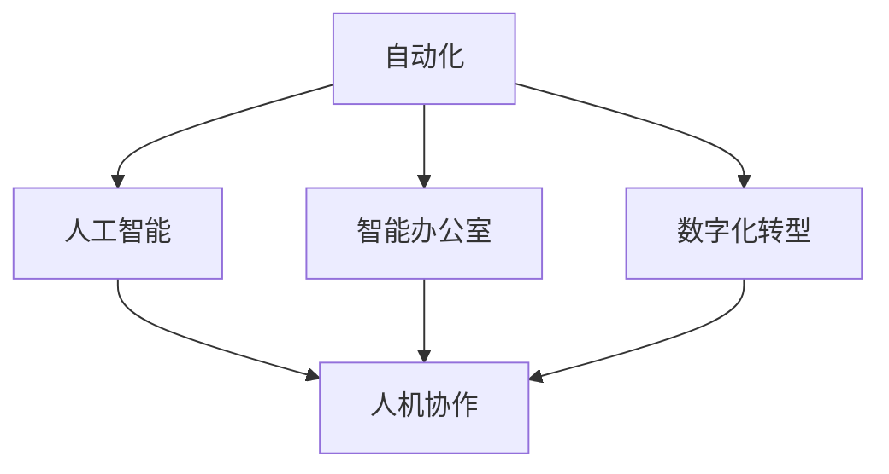

                 

# 人机协作：未来工作的趋势

> 关键词：人机协作, 自动化, 人工智能, 机器学习, 未来工作, 智能办公室, 数字化转型

## 1. 背景介绍

随着人工智能技术的飞速发展，未来工作的形态正在发生深刻变化。自动化和智能技术正在重塑工作流程，提升生产效率，同时也在挑战传统的人力工作方式。本文将探讨未来工作中人机协作的趋势，分析自动化和AI技术如何影响职场，以及未来人机协作的具体应用场景。

### 1.1 问题由来
自动化和人工智能技术的兴起，使得许多重复性、低价值的工作逐渐被机器替代。但与此同时，这也带来了对人类技能的重新评估和对工作性质的重新定义。未来工作将不再是纯粹的任务执行，而是更多地涉及与机器的协作与互补。

### 1.2 问题核心关键点
未来工作中，人机协作的核心关键点在于：
1. **自动化技术**：自动化技术在提高效率的同时，也带来工作流程的重新设计。
2. **人工智能**：AI能够处理复杂任务，提高决策质量，但也需要人类进行监督和管理。
3. **智能办公室**：通过集成各种智能技术，提升办公环境的舒适度和效率。
4. **数字化转型**：企业需要实现数字化转型，以适应智能时代的新要求。
5. **跨领域应用**：人机协作不仅限于某一特定领域，而是跨越医疗、教育、制造等多个行业。

## 2. 核心概念与联系

### 2.1 核心概念概述

为了更好地理解未来工作中的人机协作，本节将介绍几个密切相关的核心概念：

- **自动化(Automation)**：通过软件和硬件系统自动执行重复性任务的过程。
- **人工智能(Artificial Intelligence, AI)**：使计算机模拟人类的认知能力，包括学习、推理、理解语言等。
- **智能办公室(Smart Office)**：将各种智能技术集成到办公环境中，提升办公效率和员工满意度。
- **数字化转型(Digital Transformation, DX)**：通过数字化技术重塑企业的业务流程和管理模式。
- **人机协作(Human-Machine Collaboration)**：结合人类与机器的能力，实现任务的高效执行。

这些概念之间的逻辑关系可以通过以下Mermaid流程图来展示：



这个流程图展示了自动化、人工智能、智能办公室和数字化转型等人机协作的主要概念及其之间的关系：

1. 自动化和人工智能是实现人机协作的基础。
2. 智能办公室和数字化转型是人机协作的具体应用场景。
3. 人机协作是自动化、人工智能与智能办公室、数字化转型相互作用的结果。

## 3. 核心算法原理 & 具体操作步骤
### 3.1 算法原理概述

未来工作中的人机协作，可以通过以下几个关键步骤实现：

1. **自动化技术**：使用机器人和自动化软件处理重复性任务，释放人力。
2. **人工智能技术**：利用AI进行数据分析、决策支持、自然语言处理等复杂任务。
3. **智能办公室**：通过集成各种智能设备，提升办公效率和员工满意度。
4. **数字化转型**：通过数字化技术实现企业流程的优化和管理模式的创新。
5. **人机协作**：将自动化和人工智能技术融入日常工作流程，实现任务的高效执行。

### 3.2 算法步骤详解

以下详细介绍未来工作中人机协作的算法步骤：

1. **需求分析**：分析业务流程，识别需要自动化和智能化的环节。
2. **技术选择**：根据需求选择合适的自动化和AI技术，如机器人、RPA、NLP等。
3. **系统集成**：将自动化和AI技术集成到现有的业务系统中，进行接口和数据的整合。
4. **员工培训**：对员工进行新技术的培训，使其能够熟练使用系统，与机器协作。
5. **系统测试**：对集成后的系统进行全面的测试，确保其稳定性和性能。
6. **持续优化**：根据实际使用情况，不断调整和优化系统，提升协作效率。

### 3.3 算法优缺点

未来工作中人机协作的优势包括：
1. **效率提升**：自动化和AI技术可以显著提升工作效率，减少错误和重复劳动。
2. **决策质量**：AI能够处理大量数据，进行复杂计算，提供高质量的决策支持。
3. **工作灵活性**：人机协作使得员工可以更多地处理创造性工作，提升工作满意度。

但同时也存在一些缺点：
1. **技术门槛高**：需要较高的技术投入和专业知识，初期的实施成本较高。
2. **人员抵触**：部分员工可能对新技术持怀疑态度，需要时间和教育来适应。
3. **数据安全**：自动化和AI系统需要处理大量敏感数据，数据安全和隐私保护成为关键问题。

### 3.4 算法应用领域

人机协作技术在多个领域均有应用：

1. **制造业**：使用机器人进行流水线作业，使用AI进行质量检测和故障预测。
2. **医疗行业**：自动化处理病历记录，AI辅助诊断和治疗决策。
3. **金融服务**：自动化处理交易，AI进行风险评估和客户服务。
4. **零售业**：自动化库存管理，AI进行市场分析和客户推荐。
5. **教育领域**：智能教学系统，AI进行学习分析和个性化教育。
6. **公共服务**：自动化处理行政事务，AI进行社会服务分析和公共决策支持。

## 4. 数学模型和公式 & 详细讲解 & 举例说明
### 4.1 数学模型构建

为了更好地理解和模拟人机协作，我们可以构建一个数学模型。假设有一个自动化系统和一个AI系统，可以处理不同类型的工作任务，任务类型为$T$，任务量为$W$。设系统$S_i$的效率为$E_i$，处理任务$T_j$的时间为$T_{ij}$。则系统的总处理时间为：

$$
T_{\text{total}} = \sum_{i=1}^{n} \sum_{j=1}^{m} E_i \times T_{ij}
$$

### 4.2 公式推导过程

我们可以进一步推导系统的总效率和总成本：

- **总效率**：
$$
E_{\text{total}} = \frac{W}{T_{\text{total}}}
$$

- **总成本**：
$$
C_{\text{total}} = \sum_{i=1}^{n} C_i
$$

其中$C_i$为系统$S_i$的固定成本和运行成本之和。

### 4.3 案例分析与讲解

以医疗行业为例，自动化系统可以是机器人手术系统，AI系统可以是智能诊断系统。通过优化自动化和AI系统的配置，可以实现医疗服务的自动化和智能化。具体计算如下：

- **自动化系统**：设机器人手术系统的效率为$E_1=0.9$，处理手术$T_1$的时间为$T_{11}=3$小时。
- **AI系统**：设智能诊断系统的效率为$E_2=0.8$，处理诊断$T_2$的时间为$T_{22}=2$小时。

则系统的总处理时间为：

$$
T_{\text{total}} = 0.9 \times 3 + 0.8 \times 2 = 5.4 \text{小时}
$$

系统的总效率为：

$$
E_{\text{total}} = \frac{W}{5.4} = \frac{50}{5.4} = 9.26 \text{手术/小时}
$$

系统的总成本为：

$$
C_{\text{total}} = C_1 + C_2
$$

其中$C_1$和$C_2$为两个系统的固定成本和运行成本。通过优化这两个系统的配置和使用，可以实现高效的医疗服务。

## 5. 项目实践：代码实例和详细解释说明
### 5.1 开发环境搭建

在进行人机协作项目实践前，我们需要准备好开发环境。以下是使用Python进行PyTorch开发的环境配置流程：

1. 安装Anaconda：从官网下载并安装Anaconda，用于创建独立的Python环境。

2. 创建并激活虚拟环境：
```bash
conda create -n pytorch-env python=3.8 
conda activate pytorch-env
```

3. 安装PyTorch：根据CUDA版本，从官网获取对应的安装命令。例如：
```bash
conda install pytorch torchvision torchaudio cudatoolkit=11.1 -c pytorch -c conda-forge
```

4. 安装Transformers库：
```bash
pip install transformers
```

5. 安装各类工具包：
```bash
pip install numpy pandas scikit-learn matplotlib tqdm jupyter notebook ipython
```

完成上述步骤后，即可在`pytorch-env`环境中开始项目实践。

### 5.2 源代码详细实现

这里我们以智能诊断系统为例，给出使用Transformers库进行医疗诊断任务训练的PyTorch代码实现。

首先，定义数据处理函数：

```python
from transformers import BertTokenizer
from torch.utils.data import Dataset
import torch

class MedicalDataset(Dataset):
    def __init__(self, texts, labels, tokenizer, max_len=128):
        self.texts = texts
        self.labels = labels
        self.tokenizer = tokenizer
        self.max_len = max_len
        
    def __len__(self):
        return len(self.texts)
    
    def __getitem__(self, item):
        text = self.texts[item]
        label = self.labels[item]
        
        encoding = self.tokenizer(text, return_tensors='pt', max_length=self.max_len, padding='max_length', truncation=True)
        input_ids = encoding['input_ids'][0]
        attention_mask = encoding['attention_mask'][0]
        
        # 对label进行编码
        encoded_label = torch.tensor(label, dtype=torch.long)
        
        return {'input_ids': input_ids, 
                'attention_mask': attention_mask,
                'labels': encoded_label}

# 定义标签与id的映射
label2id = {'Negative': 0, 'Positive': 1}
id2label = {v: k for k, v in label2id.items()}

# 创建dataset
tokenizer = BertTokenizer.from_pretrained('bert-base-cased')

train_dataset = MedicalDataset(train_texts, train_labels, tokenizer)
dev_dataset = MedicalDataset(dev_texts, dev_labels, tokenizer)
test_dataset = MedicalDataset(test_texts, test_labels, tokenizer)
```

然后，定义模型和优化器：

```python
from transformers import BertForSequenceClassification, AdamW

model = BertForSequenceClassification.from_pretrained('bert-base-cased', num_labels=len(label2id))

optimizer = AdamW(model.parameters(), lr=2e-5)
```

接着，定义训练和评估函数：

```python
from torch.utils.data import DataLoader
from tqdm import tqdm
from sklearn.metrics import classification_report

device = torch.device('cuda') if torch.cuda.is_available() else torch.device('cpu')
model.to(device)

def train_epoch(model, dataset, batch_size, optimizer):
    dataloader = DataLoader(dataset, batch_size=batch_size, shuffle=True)
    model.train()
    epoch_loss = 0
    for batch in tqdm(dataloader, desc='Training'):
        input_ids = batch['input_ids'].to(device)
        attention_mask = batch['attention_mask'].to(device)
        labels = batch['labels'].to(device)
        model.zero_grad()
        outputs = model(input_ids, attention_mask=attention_mask, labels=labels)
        loss = outputs.loss
        epoch_loss += loss.item()
        loss.backward()
        optimizer.step()
    return epoch_loss / len(dataloader)

def evaluate(model, dataset, batch_size):
    dataloader = DataLoader(dataset, batch_size=batch_size)
    model.eval()
    preds, labels = [], []
    with torch.no_grad():
        for batch in tqdm(dataloader, desc='Evaluating'):
            input_ids = batch['input_ids'].to(device)
            attention_mask = batch['attention_mask'].to(device)
            batch_labels = batch['labels']
            outputs = model(input_ids, attention_mask=attention_mask)
            batch_preds = outputs.logits.argmax(dim=2).to('cpu').tolist()
            batch_labels = batch_labels.to('cpu').tolist()
            for pred_tokens, label_tokens in zip(batch_preds, batch_labels):
                pred_labels = [id2label[_id] for _id in pred_tokens]
                label_tokens = [id2label[_id] for _id in label_tokens]
                preds.append(pred_labels[:len(label_tokens)])
                labels.append(label_tokens)
                
    print(classification_report(labels, preds))
```

最后，启动训练流程并在测试集上评估：

```python
epochs = 5
batch_size = 16

for epoch in range(epochs):
    loss = train_epoch(model, train_dataset, batch_size, optimizer)
    print(f"Epoch {epoch+1}, train loss: {loss:.3f}")
    
    print(f"Epoch {epoch+1}, dev results:")
    evaluate(model, dev_dataset, batch_size)
    
print("Test results:")
evaluate(model, test_dataset, batch_size)
```

以上就是使用PyTorch对BERT进行医疗诊断任务训练的完整代码实现。可以看到，得益于Transformers库的强大封装，我们可以用相对简洁的代码完成BERT模型的训练。

### 5.3 代码解读与分析

让我们再详细解读一下关键代码的实现细节：

**MedicalDataset类**：
- `__init__`方法：初始化文本、标签、分词器等关键组件。
- `__len__`方法：返回数据集的样本数量。
- `__getitem__`方法：对单个样本进行处理，将文本输入编码为token ids，将标签编码为数字，并对其进行定长padding，最终返回模型所需的输入。

**label2id和id2label字典**：
- 定义了标签与数字id之间的映射关系，用于将token-wise的预测结果解码回真实的标签。

**训练和评估函数**：
- 使用PyTorch的DataLoader对数据集进行批次化加载，供模型训练和推理使用。
- 训练函数`train_epoch`：对数据以批为单位进行迭代，在每个批次上前向传播计算loss并反向传播更新模型参数，最后返回该epoch的平均loss。
- 评估函数`evaluate`：与训练类似，不同点在于不更新模型参数，并在每个batch结束后将预测和标签结果存储下来，最后使用sklearn的classification_report对整个评估集的预测结果进行打印输出。

**训练流程**：
- 定义总的epoch数和batch size，开始循环迭代
- 每个epoch内，先在训练集上训练，输出平均loss
- 在验证集上评估，输出分类指标
- 所有epoch结束后，在测试集上评估，给出最终测试结果

可以看到，PyTorch配合Transformers库使得BERT训练的代码实现变得简洁高效。开发者可以将更多精力放在数据处理、模型改进等高层逻辑上，而不必过多关注底层的实现细节。

当然，工业级的系统实现还需考虑更多因素，如模型的保存和部署、超参数的自动搜索、更灵活的任务适配层等。但核心的微调范式基本与此类似。

## 6. 实际应用场景
### 6.1 智能客服系统

基于大语言模型微调的对话技术，可以广泛应用于智能客服系统的构建。传统客服往往需要配备大量人力，高峰期响应缓慢，且一致性和专业性难以保证。而使用微调后的对话模型，可以7x24小时不间断服务，快速响应客户咨询，用自然流畅的语言解答各类常见问题。

在技术实现上，可以收集企业内部的历史客服对话记录，将问题和最佳答复构建成监督数据，在此基础上对预训练对话模型进行微调。微调后的对话模型能够自动理解用户意图，匹配最合适的答案模板进行回复。对于客户提出的新问题，还可以接入检索系统实时搜索相关内容，动态组织生成回答。如此构建的智能客服系统，能大幅提升客户咨询体验和问题解决效率。

### 6.2 金融舆情监测

金融机构需要实时监测市场舆论动向，以便及时应对负面信息传播，规避金融风险。传统的人工监测方式成本高、效率低，难以应对网络时代海量信息爆发的挑战。基于大语言模型微调的文本分类和情感分析技术，为金融舆情监测提供了新的解决方案。

具体而言，可以收集金融领域相关的新闻、报道、评论等文本数据，并对其进行主题标注和情感标注。在此基础上对预训练语言模型进行微调，使其能够自动判断文本属于何种主题，情感倾向是正面、中性还是负面。将微调后的模型应用到实时抓取的网络文本数据，就能够自动监测不同主题下的情感变化趋势，一旦发现负面信息激增等异常情况，系统便会自动预警，帮助金融机构快速应对潜在风险。

### 6.3 个性化推荐系统

当前的推荐系统往往只依赖用户的历史行为数据进行物品推荐，无法深入理解用户的真实兴趣偏好。基于大语言模型微调技术，个性化推荐系统可以更好地挖掘用户行为背后的语义信息，从而提供更精准、多样的推荐内容。

在实践中，可以收集用户浏览、点击、评论、分享等行为数据，提取和用户交互的物品标题、描述、标签等文本内容。将文本内容作为模型输入，用户的后续行为（如是否点击、购买等）作为监督信号，在此基础上微调预训练语言模型。微调后的模型能够从文本内容中准确把握用户的兴趣点。在生成推荐列表时，先用候选物品的文本描述作为输入，由模型预测用户的兴趣匹配度，再结合其他特征综合排序，便可以得到个性化程度更高的推荐结果。

### 6.4 未来应用展望

随着大语言模型和微调方法的不断发展，基于微调范式将在更多领域得到应用，为传统行业带来变革性影响。

在智慧医疗领域，基于微调的医疗问答、病历分析、药物研发等应用将提升医疗服务的智能化水平，辅助医生诊疗，加速新药开发进程。

在智能教育领域，微调技术可应用于作业批改、学情分析、知识推荐等方面，因材施教，促进教育公平，提高教学质量。

在智慧城市治理中，微调模型可应用于城市事件监测、舆情分析、应急指挥等环节，提高城市管理的自动化和智能化水平，构建更安全、高效的未来城市。

此外，在企业生产、社会治理、文娱传媒等众多领域，基于大模型微调的人工智能应用也将不断涌现，为NLP技术带来全新的突破。相信随着预训练模型和微调方法的不断进步，微调方法将成为人工智能落地应用的重要范式，推动人工智能技术在垂直行业的规模化落地。总之，微调需要开发者根据具体任务，不断迭代和优化模型、数据和算法，方能得到理想的效果。

## 7. 工具和资源推荐
### 7.1 学习资源推荐

为了帮助开发者系统掌握大语言模型微调的理论基础和实践技巧，这里推荐一些优质的学习资源：

1. 《Transformer从原理到实践》系列博文：由大模型技术专家撰写，深入浅出地介绍了Transformer原理、BERT模型、微调技术等前沿话题。

2. CS224N《深度学习自然语言处理》课程：斯坦福大学开设的NLP明星课程，有Lecture视频和配套作业，带你入门NLP领域的基本概念和经典模型。

3. 《Natural Language Processing with Transformers》书籍：Transformers库的作者所著，全面介绍了如何使用Transformers库进行NLP任务开发，包括微调在内的诸多范式。

4. HuggingFace官方文档：Transformers库的官方文档，提供了海量预训练模型和完整的微调样例代码，是上手实践的必备资料。

5. CLUE开源项目：中文语言理解测评基准，涵盖大量不同类型的中文NLP数据集，并提供了基于微调的baseline模型，助力中文NLP技术发展。

通过对这些资源的学习实践，相信你一定能够快速掌握大语言模型微调的精髓，并用于解决实际的NLP问题。
###  7.2 开发工具推荐

高效的开发离不开优秀的工具支持。以下是几款用于大语言模型微调开发的常用工具：

1. PyTorch：基于Python的开源深度学习框架，灵活动态的计算图，适合快速迭代研究。大部分预训练语言模型都有PyTorch版本的实现。

2. TensorFlow：由Google主导开发的开源深度学习框架，生产部署方便，适合大规模工程应用。同样有丰富的预训练语言模型资源。

3. Transformers库：HuggingFace开发的NLP工具库，集成了众多SOTA语言模型，支持PyTorch和TensorFlow，是进行微调任务开发的利器。

4. Weights & Biases：模型训练的实验跟踪工具，可以记录和可视化模型训练过程中的各项指标，方便对比和调优。与主流深度学习框架无缝集成。

5. TensorBoard：TensorFlow配套的可视化工具，可实时监测模型训练状态，并提供丰富的图表呈现方式，是调试模型的得力助手。

6. Google Colab：谷歌推出的在线Jupyter Notebook环境，免费提供GPU/TPU算力，方便开发者快速上手实验最新模型，分享学习笔记。

合理利用这些工具，可以显著提升大语言模型微调任务的开发效率，加快创新迭代的步伐。

### 7.3 相关论文推荐

大语言模型和微调技术的发展源于学界的持续研究。以下是几篇奠基性的相关论文，推荐阅读：

1. Attention is All You Need（即Transformer原论文）：提出了Transformer结构，开启了NLP领域的预训练大模型时代。

2. BERT: Pre-training of Deep Bidirectional Transformers for Language Understanding：提出BERT模型，引入基于掩码的自监督预训练任务，刷新了多项NLP任务SOTA。

3. Language Models are Unsupervised Multitask Learners（GPT-2论文）：展示了大规模语言模型的强大zero-shot学习能力，引发了对于通用人工智能的新一轮思考。

4. Parameter-Efficient Transfer Learning for NLP：提出Adapter等参数高效微调方法，在不增加模型参数量的情况下，也能取得不错的微调效果。

5. Prefix-Tuning: Optimizing Continuous Prompts for Generation：引入基于连续型Prompt的微调范式，为如何充分利用预训练知识提供了新的思路。

6. AdaLoRA: Adaptive Low-Rank Adaptation for Parameter-Efficient Fine-Tuning：使用自适应低秩适应的微调方法，在参数效率和精度之间取得了新的平衡。

这些论文代表了大语言模型微调技术的发展脉络。通过学习这些前沿成果，可以帮助研究者把握学科前进方向，激发更多的创新灵感。

## 8. 总结：未来发展趋势与挑战
### 8.1 总结

本文对未来工作中的人机协作进行了全面系统的介绍。首先阐述了自动化和人工智能技术的兴起及其对工作流程的影响，明确了未来工作的新特点。其次，从原理到实践，详细讲解了人机协作的数学模型和算法步骤，给出了微调任务开发的完整代码实例。同时，本文还广泛探讨了人机协作在智能客服、金融舆情、个性化推荐等多个行业领域的应用前景，展示了微调范式的巨大潜力。此外，本文精选了微调技术的各类学习资源，力求为读者提供全方位的技术指引。

通过本文的系统梳理，可以看到，未来工作中的人机协作正成为新常态。自动化和AI技术在提高效率、改善体验的同时，也带来了对传统工作方式的深刻变革。未来的人机协作不仅涉及到技术的进步，还涉及到文化、组织、伦理等多方面的变化。只有从整体上把握人机协作的趋势，才能真正实现智能化转型。

### 8.2 未来发展趋势

展望未来，人机协作技术将呈现以下几个发展趋势：

1. **自动化技术更加普及**：自动化技术在制造业、服务业等领域的应用将进一步普及，大幅提高生产效率。
2. **人工智能技术日益成熟**：AI将更广泛地应用于决策支持、知识推理等领域，提升问题解决能力。
3. **智能办公室和数字化转型**：通过智能设备和数字化技术，提升办公效率和员工满意度。
4. **跨领域应用**：人机协作技术将跨越多个行业，形成更为广泛的合作网络。
5. **新兴技术的融合**：人机协作将与物联网、大数据、区块链等新兴技术融合，形成新的应用场景。

这些趋势展示了人机协作技术在未来的广阔前景。通过持续的技术创新和实践应用，人机协作将在更多领域发挥重要作用，推动社会向智能化方向迈进。

### 8.3 面临的挑战

尽管人机协作技术正在蓬勃发展，但仍然面临一些挑战：

1. **技术门槛高**：需要较高的技术投入和专业知识，初期的实施成本较高。
2. **数据隐私和安全**：自动化和AI系统需要处理大量敏感数据，数据安全和隐私保护成为关键问题。
3. **伦理和道德**：AI决策的透明性和公平性、自动化系统的可解释性等，是当前面临的重要伦理挑战。
4. **技能匹配**：人机协作要求员工具备新技能，需要持续的培训和教育。
5. **技术依赖**：过度依赖自动化和AI系统，可能导致技术风险和系统故障。

面对这些挑战，需要各方共同努力，寻求解决方案，确保人机协作的顺利推进。

### 8.4 研究展望

未来研究需要从以下几个方面进行探索：

1. **跨学科研究**：将人机协作技术与心理学、社会学等学科结合，探索人类与机器的协作方式和心理适应。
2. **伦理和公平**：建立人机协作的伦理框架，确保技术应用的安全和公平。
3. **人工智能的可解释性**：提升AI系统的可解释性和透明性，增强用户信任。
4. **人工智能的适应性**：使AI系统能够根据不同的工作环境和任务需求，进行自我学习和调整。
5. **新兴技术的融合**：探索人机协作与物联网、大数据、区块链等技术的融合，形成新的应用场景。

通过这些方向的研究，将为人机协作技术的进一步发展提供坚实的基础。未来的人机协作将更加智能、高效、和谐，为社会带来更大的福祉。

## 9. 附录：常见问题与解答

**Q1：自动化技术是否会取代人类工作？**

A: 自动化技术会取代一些重复性、低价值的工作，但不会完全取代人类工作。人类在创新、决策、情感交流等方面具有独特的优势，无法被机器完全替代。未来人机协作将更加强调任务的互补性，而非替代性。

**Q2：如何确保数据隐私和安全？**

A: 确保数据隐私和安全需要综合采取以下措施：
1. 数据加密：使用加密技术保护数据传输和存储。
2. 访问控制：严格控制数据访问权限，防止未经授权的访问。
3. 匿名化处理：对数据进行匿名化处理，保护个人隐私。
4. 安全审计：定期进行安全审计，及时发现和修复漏洞。
5. 合规性管理：遵循相关法律法规，如GDPR、CCPA等。

**Q3：如何提升AI系统的可解释性？**

A: 提升AI系统的可解释性需要从多个方面进行：
1. 数据透明：使用可解释的数据集进行训练，增强模型的可解释性。
2. 算法透明：选择透明、可解释的算法模型，如规则模型、决策树等。
3. 可解释输出：通过可视化、报告等方式，展示AI系统的决策过程。
4. 多模型融合：通过多个模型的综合决策，增强系统的鲁棒性和可解释性。

**Q4：如何应对人机协作中的伦理和道德问题？**

A: 应对人机协作中的伦理和道德问题需要从以下几个方面进行：
1. 透明性：确保AI决策过程透明，便于用户理解和监督。
2. 公平性：确保AI决策对所有群体公平，不产生歧视。
3. 责任归属：明确人机协作中的责任归属，确保出现问题时有明确的责任方。
4. 伦理审查：建立伦理审查机制，对AI系统的使用进行伦理评估。

这些措施有助于构建更为安全和公平的人机协作环境。

---

作者：禅与计算机程序设计艺术 / Zen and the Art of Computer Programming

