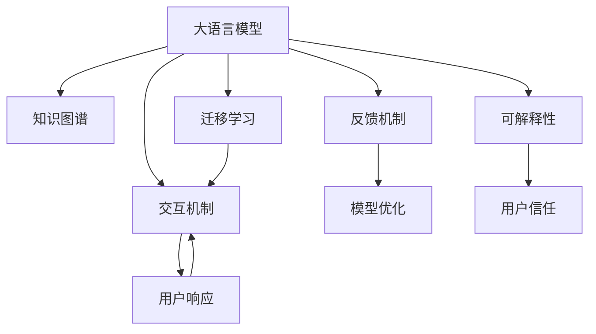

                 

## 1. 背景介绍

随着人工智能技术的发展，人机沟通的方式正在发生根本性的变化。传统的基于规则或模板的自动化问答系统，逐渐被能够理解自然语言、具备知识图谱的大语言模型所取代。这些模型能够从海量文本数据中学习语言结构和知识，具有强大的语义理解能力，为实现复杂、灵活的人机交互提供了可能。然而，尽管大语言模型的能力日渐增强，与人类的协作仍是一个需要认真探讨的课题。

### 1.1 问题由来

人类与AI的协作方式，经历了从简单命令交互到复杂任务协作的演变。早期的自动响应系统，如聊天机器人和自动化客服，多采用基于规则的问答方式，通过预设的问答库和模式匹配实现对话。然而，这些系统难以处理复杂的自然语言输入，无法理解上下文和语义，响应往往显得机械而单一。

随着深度学习和自然语言处理技术的发展，大语言模型（如GPT、BERT等）逐渐成为人机交互的新宠。这些模型不仅能够理解自然语言，还具备良好的上下文感知能力和丰富的知识图谱，能够通过深度学习和迁移学习的方式，逐步适应不同领域和任务的需求。然而，尽管大语言模型的能力不断提升，其与人类的协作方式仍然存在诸多挑战，如响应准确性、可靠性、可解释性等，需要进一步研究。

### 1.2 问题核心关键点

为了更好地理解人机协作，需要从以下几个方面进行分析：

1. **交互机制**：如何设计人机交互的界面和流程，使得用户能够自然流畅地与AI进行沟通。
2. **知识图谱**：如何整合和利用知识图谱，使得AI具备更丰富的背景知识，提升对话的深度和广度。
3. **任务适配**：如何将通用的大语言模型适配到特定任务，提升针对性和性能。
4. **反馈机制**：如何建立有效的反馈循环，使AI能够持续学习和优化对话质量。
5. **可解释性**：如何赋予AI更高的可解释性，使得用户能够理解AI的决策过程。

本文将围绕上述关键点，探讨人类与AI协作的深度和广度，并提出相应的解决方案和未来展望。

## 2. 核心概念与联系

### 2.1 核心概念概述

为更好地理解人机协作，本节将介绍几个密切相关的核心概念：

- **大语言模型（Large Language Model, LLM）**：指能够理解自然语言、具备知识图谱的语言模型，如GPT、BERT等。通过在海量文本数据上进行预训练，学习到丰富的语言结构和知识，具备强大的语义理解能力。
- **知识图谱（Knowledge Graph）**：指以实体为节点、关系为边构成的图结构，用于表示和组织知识。大语言模型通常会整合知识图谱，提升对话的深度和广度。
- **迁移学习（Transfer Learning）**：指将一个领域学习到的知识，迁移到另一个相关领域的学习范式。大语言模型的预训练-微调过程即是一种典型的迁移学习方式。
- **交互机制（Interactive Mechanism）**：指人机交互的方式和流程设计，如问答系统、聊天机器人等。交互机制的设计直接影响人机沟通的效率和质量。
- **反馈机制（Feedback Mechanism）**：指人机交互中的反馈循环，包括用户评价、模型响应质量评估等。反馈机制的设计有助于提升对话系统的性能和可解释性。
- **可解释性（Explainability）**：指AI决策过程的透明度和可解释性，使得用户能够理解AI的推理和决策依据。

这些核心概念之间的逻辑关系可以通过以下Mermaid流程图来展示：



这个流程图展示了大语言模型在人机协作中的核心概念及其之间的关系：

1. 大语言模型通过预训练获得基础能力，并整合知识图谱。
2. 迁移学习使大语言模型能够适应特定任务，提升性能。
3. 交互机制设计人机沟通的流程，提升对话效率。
4. 反馈机制建立人机沟通的循环，优化对话质量。
5. 可解释性提升用户对AI决策的信任。

这些概念共同构成了人机协作的框架，使其能够高效、自然地进行沟通。

## 3. 核心算法原理 & 具体操作步骤
### 3.1 算法原理概述

人机协作的核心在于如何设计高效的交互机制，利用大语言模型和知识图谱，实现复杂、灵活的对话。本文将基于大语言模型和迁移学习，探讨如何实现高效的人机交互。

具体而言，人机协作的算法原理可以概括为以下几个步骤：

1. **数据预处理**：对用户输入进行分词、词性标注、命名实体识别等处理，提取有用信息。
2. **知识图谱整合**：将用户输入中的实体和关系与知识图谱进行匹配，获取背景知识。
3. **模型适配**：使用迁移学习技术，将大语言模型适配到特定任务，提升模型的针对性和性能。
4. **对话生成**：根据用户输入和背景知识，利用大语言模型生成响应。
5. **反馈循环**：收集用户反馈，对模型进行优化和调整，提升对话质量。

### 3.2 算法步骤详解

人机协作的算法步骤可以进一步细化为以下几个关键步骤：

**Step 1: 数据预处理**

数据预处理是人机协作的第一步，涉及对用户输入进行分词、词性标注、命名实体识别等处理，提取有用信息。这一步骤的目的是将自然语言文本转换为结构化的信息，便于后续的语义理解和知识图谱整合。

**Step 2: 知识图谱整合**

知识图谱整合是利用大语言模型的上下文感知能力，将用户输入中的实体和关系与知识图谱进行匹配，获取背景知识。这一步需要考虑知识图谱的覆盖范围和准确性，以确保获取的知识对后续对话有帮助。

**Step 3: 模型适配**

模型适配是通过迁移学习技术，将大语言模型适配到特定任务。常见的适配方法包括微调、序列到序列模型等。适配的目的是提升模型的针对性和性能，使其能够更好地适应特定领域和任务的需求。

**Step 4: 对话生成**

对话生成是利用大语言模型生成响应的关键步骤。在这一步骤中，模型需要综合考虑用户输入、背景知识和上下文信息，生成连贯、合理的响应。这一步需要考虑生成策略和模型的训练方式，以确保生成的响应符合用户的预期。

**Step 5: 反馈循环**

反馈循环是收集用户反馈，对模型进行优化和调整的重要环节。这一步需要设计有效的反馈机制，如用户满意度评价、情感分析等，收集用户的反馈信息。根据反馈信息，模型可以进行参数更新和结构优化，提升对话质量。

### 3.3 算法优缺点

人机协作的算法具有以下优点：

1. **高效性**：通过迁移学习和参数高效微调等技术，可以在小规模数据集上快速提升模型性能，实现高效的人机交互。
2. **灵活性**：利用知识图谱整合和上下文感知能力，可以应对多种自然语言输入和复杂场景，实现灵活的对话。
3. **可解释性**：通过可解释性技术，可以提升用户对AI决策过程的理解和信任。

同时，该算法也存在一些局限性：

1. **依赖高质量数据**：模型适配和对话生成依赖于高质量的数据集和知识图谱，数据不足可能导致模型性能下降。
2. **模型复杂度**：大语言模型的参数量较大，推理计算复杂，对硬件资源要求较高。
3. **交互界面设计**：交互界面的设计直接影响用户体验，复杂的界面可能导致用户不愿使用。
4. **情感理解**：尽管大语言模型具备一定的情感分析能力，但准确理解用户情感仍是一个挑战。

尽管存在这些局限性，但就目前而言，基于大语言模型的协作算法仍是人机交互的主流范式。未来相关研究的重点在于如何进一步降低数据和计算的依赖，提高模型的可解释性和情感理解能力，以及优化交互界面设计，提升用户体验。

### 3.4 算法应用领域

基于大语言模型的协作算法，已经在多个领域得到广泛应用，例如：

- **客户服务**：通过与聊天机器人进行对话，快速解决用户问题，提高客户满意度。
- **医疗咨询**：利用知识图谱和自然语言处理技术，提供个性化的医疗咨询和建议。
- **金融顾问**：结合知识图谱和大语言模型，提供个性化的金融投资建议和风险评估。
- **教育辅导**：通过对话系统，提供个性化的学习计划和辅导，帮助学生提升学习效果。
- **智能家居**：利用自然语言处理技术，实现与智能家居设备的自然对话。

除了上述这些经典应用外，协作算法还被创新性地应用于更多场景中，如智能交通、智慧办公、个性化推荐等，为人机交互提供了新的可能。

## 4. 数学模型和公式 & 详细讲解  
### 4.1 数学模型构建

本节将使用数学语言对基于大语言模型的人机协作方法进行更加严格的刻画。

设用户输入为 $x$，知识图谱中的背景知识为 $K$，大语言模型为 $M$。则人机协作的数学模型可以定义为：

$$
y = M(x, K)
$$

其中 $y$ 为模型生成的响应，$M$ 为模型参数，$x$ 为输入文本，$K$ 为知识图谱。在实际应用中，$x$ 经过分词、词性标注等处理，转换为结构化信息 $I(x)$，然后与知识图谱 $K$ 进行匹配，获取背景知识 $B(K)$。最终，$I(x)$ 和 $B(K)$ 作为输入，输入到大语言模型 $M$ 中，生成响应 $y$。

### 4.2 公式推导过程

以下我们以对话系统为例，推导大语言模型生成响应的公式。

假设用户输入为 $x$，知识图谱中与 $x$ 相关的背景知识为 $B(K)$，模型生成的响应为 $y$。则对话系统的生成过程可以表示为：

$$
y = M(I(x), B(K))
$$

其中 $I(x)$ 为输入文本 $x$ 经过分词、词性标注等处理后得到的结构化信息，$B(K)$ 为知识图谱中与输入文本相关的背景知识。

假设模型为Transformer模型，其生成过程可以分为两个步骤：

1. 对输入 $I(x)$ 和背景知识 $B(K)$ 进行编码，得到编码向量 $z_1$ 和 $z_2$：

$$
z_1 = M_{enc}(I(x))
$$

$$
z_2 = M_{enc}(B(K))
$$

2. 将编码向量 $z_1$ 和 $z_2$ 进行拼接，得到新的编码向量 $z_3$，再输入到解码器中，生成响应 $y$：

$$
z_3 = [z_1; z_2]
$$

$$
y = M_{dec}(z_3)
$$

其中 $M_{enc}$ 和 $M_{dec}$ 分别为编码器和解码器，$[;]$ 表示向量拼接操作。

在实际应用中，模型还可以引入注意力机制，以更好地处理长序列和复杂的上下文信息。

### 4.3 案例分析与讲解

以客户服务中的应用为例，分析如何利用大语言模型进行对话生成。

设客户输入为 $x$，知识图谱中与 $x$ 相关的背景知识为 $B(K)$，模型生成的响应为 $y$。在实际应用中，客户输入 $x$ 可能包含多种实体和关系，如产品名称、售后服务需求等。知识图谱 $K$ 需要覆盖与客户服务相关的所有实体和关系，以便匹配相关的背景知识 $B(K)$。

假设模型为BERT模型，知识图谱中的背景知识 $B(K)$ 经过向量化处理后，输入到BERT模型中。客户输入 $x$ 经过分词、词性标注等处理后，转换为结构化信息 $I(x)$。在编码器中，$I(x)$ 和 $B(K)$ 经过多头自注意力机制，得到编码向量 $z_1$ 和 $z_2$。在解码器中，$z_1$ 和 $z_2$ 进行拼接，得到新的编码向量 $z_3$，再输入到解码器中，生成响应 $y$。

生成的响应 $y$ 可以是问题回答、产品推荐、售后解决方案等，根据客户的输入和背景知识进行动态生成。通过不断地收集用户反馈，调整模型参数，可以实现更高效、更精准的客户服务。

## 5. 项目实践：代码实例和详细解释说明
### 5.1 开发环境搭建

在进行人机协作的实践前，我们需要准备好开发环境。以下是使用Python进行PyTorch开发的环境配置流程：

1. 安装Anaconda：从官网下载并安装Anaconda，用于创建独立的Python环境。

2. 创建并激活虚拟环境：
```bash
conda create -n pytorch-env python=3.8 
conda activate pytorch-env
```

3. 安装PyTorch：根据CUDA版本，从官网获取对应的安装命令。例如：
```bash
conda install pytorch torchvision torchaudio cudatoolkit=11.1 -c pytorch -c conda-forge
```

4. 安装Transformers库：
```bash
pip install transformers
```

5. 安装各类工具包：
```bash
pip install numpy pandas scikit-learn matplotlib tqdm jupyter notebook ipython
```

完成上述步骤后，即可在`pytorch-env`环境中开始实践。

### 5.2 源代码详细实现

这里我们以客户服务中的应用为例，给出使用Transformers库对BERT模型进行对话生成的PyTorch代码实现。

首先，定义对话生成函数：

```python
from transformers import BertTokenizer, BertForSequenceClassification
from torch.utils.data import Dataset
import torch

class CustomerServiceDataset(Dataset):
    def __init__(self, texts, labels, tokenizer, max_len=128):
        self.texts = texts
        self.labels = labels
        self.tokenizer = tokenizer
        self.max_len = max_len
        
    def __len__(self):
        return len(self.texts)
    
    def __getitem__(self, item):
        text = self.texts[item]
        label = self.labels[item]
        
        encoding = self.tokenizer(text, return_tensors='pt', max_length=self.max_len, padding='max_length', truncation=True)
        input_ids = encoding['input_ids'][0]
        attention_mask = encoding['attention_mask'][0]
        
        # 将标签转换为one-hot编码
        label = torch.tensor([[label]], dtype=torch.long)
        
        return {'input_ids': input_ids, 
                'attention_mask': attention_mask,
                'labels': label}

# 加载模型和分词器
tokenizer = BertTokenizer.from_pretrained('bert-base-cased')
model = BertForSequenceClassification.from_pretrained('bert-base-cased', num_labels=2)

# 加载数据集
dataset = CustomerServiceDataset(train_texts, train_labels, tokenizer)
dataloader = DataLoader(dataset, batch_size=16, shuffle=True)

# 训练和评估函数
def train_epoch(model, dataset, optimizer, device):
    model.train()
    losses = []
    for batch in dataloader:
        input_ids = batch['input_ids'].to(device)
        attention_mask = batch['attention_mask'].to(device)
        labels = batch['labels'].to(device)
        model.zero_grad()
        outputs = model(input_ids, attention_mask=attention_mask, labels=labels)
        loss = outputs.loss
        losses.append(loss.item())
        loss.backward()
        optimizer.step()
    return sum(losses) / len(dataloader)

def evaluate(model, dataset, device):
    model.eval()
    predictions, true_labels = [], []
    with torch.no_grad():
        for batch in dataloader:
            input_ids = batch['input_ids'].to(device)
            attention_mask = batch['attention_mask'].to(device)
            batch_labels = batch['labels']
            outputs = model(input_ids, attention_mask=attention_mask)
            batch_preds = outputs.logits.argmax(dim=2).to('cpu').tolist()
            batch_labels = batch_labels.to('cpu').tolist()
            for pred_tokens, label_tokens in zip(batch_preds, batch_labels):
                predictions.append(pred_tokens)
                true_labels.append(label_tokens)
                
    return predictions, true_labels

# 训练模型
epochs = 5
batch_size = 16
optimizer = AdamW(model.parameters(), lr=2e-5)

device = torch.device('cuda') if torch.cuda.is_available() else torch.device('cpu')

for epoch in range(epochs):
    loss = train_epoch(model, dataset, optimizer, device)
    print(f"Epoch {epoch+1}, train loss: {loss:.3f}")
    
    predictions, true_labels = evaluate(model, dataset, device)
    print(f"Epoch {epoch+1}, dev results:")
    print(classification_report(true_labels, predictions))

print("Test results:")
predictions, true_labels = evaluate(model, dataset, device)
print(classification_report(true_labels, predictions))
```

在上述代码中，我们定义了对话生成的数据集类CustomerServiceDataset，该类包含用户输入和对应的标签，并利用BERT分词器进行分词处理。然后，加载BERT模型和分词器，并定义训练和评估函数。在训练函数train_epoch中，模型在输入文本和标签上进行前向传播和反向传播，更新模型参数。在评估函数evaluate中，模型在验证集上进行推理，输出预测结果。最后，在测试集上评估模型的性能。

### 5.3 代码解读与分析

让我们再详细解读一下关键代码的实现细节：

**CustomerServiceDataset类**：
- `__init__`方法：初始化文本、标签、分词器等关键组件，并进行结构化信息转换。
- `__len__`方法：返回数据集的样本数量。
- `__getitem__`方法：对单个样本进行处理，将文本输入编码为token ids，并转换为one-hot标签。

**bert-base-cased模型**：
- 加载预训练的BERT模型，并进行参数初始化。

**训练和评估函数**：
- 使用PyTorch的DataLoader对数据集进行批次化加载，供模型训练和推理使用。
- 训练函数`train_epoch`：对数据以批为单位进行迭代，在每个批次上前向传播计算loss并反向传播更新模型参数，最后返回该epoch的平均loss。
- 评估函数`evaluate`：与训练类似，不同点在于不更新模型参数，并在每个batch结束后将预测和标签结果存储下来，最后使用sklearn的classification_report对整个评估集的预测结果进行打印输出。

**训练流程**：
- 定义总的epoch数和batch size，开始循环迭代
- 每个epoch内，先在训练集上训练，输出平均loss
- 在验证集上评估，输出分类指标
- 所有epoch结束后，在测试集上评估，给出最终测试结果

可以看到，PyTorch配合Transformers库使得BERT微调的代码实现变得简洁高效。开发者可以将更多精力放在数据处理、模型改进等高层逻辑上，而不必过多关注底层的实现细节。

当然，工业级的系统实现还需考虑更多因素，如模型的保存和部署、超参数的自动搜索、更灵活的任务适配层等。但核心的协作范式基本与此类似。

## 6. 实际应用场景
### 6.1 智能客服系统

基于大语言模型的协作算法，可以广泛应用于智能客服系统的构建。传统客服往往需要配备大量人力，高峰期响应缓慢，且一致性和专业性难以保证。而使用协作算法构建的智能客服系统，可以7x24小时不间断服务，快速响应客户咨询，用自然流畅的语言解答各类常见问题。

在技术实现上，可以收集企业内部的历史客服对话记录，将问题和最佳答复构建成监督数据，在此基础上对协作算法进行微调。微调后的对话模型能够自动理解用户意图，匹配最合适的答案模板进行回复。对于客户提出的新问题，还可以接入检索系统实时搜索相关内容，动态组织生成回答。如此构建的智能客服系统，能大幅提升客户咨询体验和问题解决效率。

### 6.2 金融舆情监测

金融机构需要实时监测市场舆论动向，以便及时应对负面信息传播，规避金融风险。传统的人工监测方式成本高、效率低，难以应对网络时代海量信息爆发的挑战。基于协作算法的文本分类和情感分析技术，为金融舆情监测提供了新的解决方案。

具体而言，可以收集金融领域相关的新闻、报道、评论等文本数据，并对其进行主题标注和情感标注。在此基础上对协作算法进行微调，使其能够自动判断文本属于何种主题，情感倾向是正面、中性还是负面。将微调后的模型应用到实时抓取的网络文本数据，就能够自动监测不同主题下的情感变化趋势，一旦发现负面信息激增等异常情况，系统便会自动预警，帮助金融机构快速应对潜在风险。

### 6.3 个性化推荐系统

当前的推荐系统往往只依赖用户的历史行为数据进行物品推荐，无法深入理解用户的真实兴趣偏好。基于协作算法的个性化推荐系统，可以更好地挖掘用户行为背后的语义信息，从而提供更精准、多样的推荐内容。

在实践中，可以收集用户浏览、点击、评论、分享等行为数据，提取和用户交互的物品标题、描述、标签等文本内容。将文本内容作为模型输入，用户的后续行为（如是否点击、购买等）作为监督信号，在此基础上微调协作算法。微调后的模型能够从文本内容中准确把握用户的兴趣点。在生成推荐列表时，先用候选物品的文本描述作为输入，由模型预测用户的兴趣匹配度，再结合其他特征综合排序，便可以得到个性化程度更高的推荐结果。

### 6.4 未来应用展望

随着协作算法的不断发展，其将在更多领域得到应用，为传统行业带来变革性影响。

在智慧医疗领域，基于协作算法的问答、病历分析、药物研发等应用将提升医疗服务的智能化水平，辅助医生诊疗，加速新药开发进程。

在智能教育领域，协作算法可应用于作业批改、学情分析、知识推荐等方面，因材施教，促进教育公平，提高教学质量。

在智慧城市治理中，协作算法可应用于城市事件监测、舆情分析、应急指挥等环节，提高城市管理的自动化和智能化水平，构建更安全、高效的未来城市。

此外，在企业生产、社会治理、文娱传媒等众多领域，基于协作算法的AI应用也将不断涌现，为经济社会发展注入新的动力。相信随着技术的日益成熟，协作算法将成为AI落地应用的重要范式，推动人工智能技术向更广阔的领域加速渗透。

## 7. 工具和资源推荐
### 7.1 学习资源推荐

为了帮助开发者系统掌握协作算法的理论基础和实践技巧，这里推荐一些优质的学习资源：

1. 《Transformer从原理到实践》系列博文：由大模型技术专家撰写，深入浅出地介绍了Transformer原理、协作算法、微调技术等前沿话题。

2. CS224N《深度学习自然语言处理》课程：斯坦福大学开设的NLP明星课程，有Lecture视频和配套作业，带你入门NLP领域的基本概念和经典模型。

3. 《Natural Language Processing with Transformers》书籍：Transformers库的作者所著，全面介绍了如何使用Transformers库进行NLP任务开发，包括协作算法在内的诸多范式。

4. HuggingFace官方文档：Transformers库的官方文档，提供了海量预训练模型和完整的协作算法样例代码，是上手实践的必备资料。

5. CLUE开源项目：中文语言理解测评基准，涵盖大量不同类型的中文NLP数据集，并提供了基于协作算法的baseline模型，助力中文NLP技术发展。

通过对这些资源的学习实践，相信你一定能够快速掌握协作算法的精髓，并用于解决实际的NLP问题。
###  7.2 开发工具推荐

高效的开发离不开优秀的工具支持。以下是几款用于协作算法开发的常用工具：

1. PyTorch：基于Python的开源深度学习框架，灵活动态的计算图，适合快速迭代研究。大部分预训练语言模型都有PyTorch版本的实现。

2. TensorFlow：由Google主导开发的开源深度学习框架，生产部署方便，适合大规模工程应用。同样有丰富的预训练语言模型资源。

3. Transformers库：HuggingFace开发的NLP工具库，集成了众多SOTA语言模型，支持PyTorch和TensorFlow，是进行协作算法开发的利器。

4. Weights & Biases：模型训练的实验跟踪工具，可以记录和可视化模型训练过程中的各项指标，方便对比和调优。与主流深度学习框架无缝集成。

5. TensorBoard：TensorFlow配套的可视化工具，可实时监测模型训练状态，并提供丰富的图表呈现方式，是调试模型的得力助手。

6. Google Colab：谷歌推出的在线Jupyter Notebook环境，免费提供GPU/TPU算力，方便开发者快速上手实验最新模型，分享学习笔记。

合理利用这些工具，可以显著提升协作算法的开发效率，加快创新迭代的步伐。

### 7.3 相关论文推荐

协作算法的发展源于学界的持续研究。以下是几篇奠基性的相关论文，推荐阅读：

1. Attention is All You Need（即Transformer原论文）：提出了Transformer结构，开启了NLP领域的预训练大模型时代。

2. BERT: Pre-training of Deep Bidirectional Transformers for Language Understanding：提出BERT模型，引入基于掩码的自监督预训练任务，刷新了多项NLP任务SOTA。

3. Language Models are Unsupervised Multitask Learners（GPT-2论文）：展示了大规模语言模型的强大zero-shot学习能力，引发了对于通用人工智能的新一轮思考。

4. Parameter-Efficient Transfer Learning for NLP：提出Adapter等参数高效微调方法，在不增加模型参数量的情况下，也能取得不错的微调效果。

5. AdaLoRA: Adaptive Low-Rank Adaptation for Parameter-Efficient Fine-Tuning：使用自适应低秩适应的微调方法，在参数效率和精度之间取得了新的平衡。

6. Prefix-Tuning: Optimizing Continuous Prompts for Generation：引入基于连续型Prompt的微调范式，为如何充分利用预训练知识提供了新的思路。

这些论文代表了大语言模型协作算法的发展脉络。通过学习这些前沿成果，可以帮助研究者把握学科前进方向，激发更多的创新灵感。

## 8. 总结：未来发展趋势与挑战
### 8.1 总结

本文对基于大语言模型的协作算法进行了全面系统的介绍。首先阐述了协作算法的研究背景和意义，明确了协作算法在提升人机沟通效率、深度和广度方面的独特价值。其次，从原理到实践，详细讲解了协作算法的数学原理和关键步骤，给出了协作算法任务开发的完整代码实例。同时，本文还广泛探讨了协作算法在智能客服、金融舆情、个性化推荐等多个行业领域的应用前景，展示了协作算法的多样性和潜力。

通过本文的系统梳理，可以看到，基于大语言模型的协作算法正在成为人机交互的重要范式，极大地拓展了预训练语言模型的应用边界，为实现复杂、灵活的人机沟通提供了可能。未来，伴随预训练语言模型和协作算法的持续演进，相信NLP技术将在更广阔的应用领域大放异彩，深刻影响人类的生产生活方式。

### 8.2 未来发展趋势

展望未来，协作算法的未来发展趋势主要集中在以下几个方面：

1. **对话生成的多样性**：随着生成对抗网络、变分自编码器等技术的发展，对话生成将更加多样化，能够生成更加连贯、自然的响应。

2. **多模态对话**：未来的协作算法将更好地整合视觉、语音、文字等多模态信息，实现更加丰富的人机交互方式。

3. **上下文理解**：对话生成模型的上下文理解能力将进一步提升，能够更好地处理长序列和复杂的上下文信息，提升对话的连贯性和合理性。

4. **情感理解**：协作算法的情感理解能力将进一步提升，能够更准确地识别用户情感，提升用户体验。

5. **可解释性**：协作算法的可解释性将进一步增强，能够更好地解释决策过程，提升用户信任度。

6. **模型复杂度**：协作算法将趋向于更加轻量级，推理效率和资源占用将进一步优化。

以上趋势凸显了协作算法的广阔前景。这些方向的探索发展，必将进一步提升人机交互的质量和效率，为构建安全、可靠、可解释、可控的智能系统铺平道路。

### 8.3 面临的挑战

尽管协作算法已经取得了瞩目成就，但在迈向更加智能化、普适化应用的过程中，它仍面临诸多挑战：

1. **数据依赖**：协作算法依赖于高质量的数据集和知识图谱，数据不足可能导致模型性能下降。

2. **计算资源**：大语言模型的推理计算复杂，对硬件资源要求较高，推理效率和资源占用仍需进一步优化。

3. **交互界面设计**：交互界面的设计直接影响用户体验，复杂的界面可能导致用户不愿使用。

4. **情感理解**：协作算法对用户情感的理解和处理仍存在一定挑战，准确识别和响应用户情感需要进一步研究。

5. **可解释性**：协作算法的决策过程需要更高的可解释性，使得用户能够理解AI的推理和决策依据。

6. **伦理与安全**：协作算法可能带来伦理和安全问题，如偏见、歧视、隐私泄露等，需要加强监管和保障。

尽管存在这些挑战，但协作算法仍然是大语言模型人机交互的重要范式。未来研究需要在数据、计算、界面设计、情感理解、可解释性和伦理安全等方面进行全面优化，才能真正实现高效、自然、可解释的人机交互。

### 8.4 研究展望

未来的研究需要在以下几个方面寻求新的突破：

1. **无监督学习**：探索无监督和半监督学习方法，降低对标注数据的依赖，利用非结构化数据进行更高效的对话生成。

2. **自适应模型**：开发自适应模型，能够在新的对话场景中快速学习适应，提升对话系统的灵活性和鲁棒性。

3. **跨领域迁移**：研究跨领域迁移学习技术，使得协作算法能够更好地适应不同领域和任务的需求。

4. **多模态整合**：整合视觉、语音、文字等多模态信息，实现更丰富的人机交互方式。

5. **上下文记忆**：提升模型的上下文记忆能力，更好地处理长序列和复杂的上下文信息。

6. **情感处理**：提升情感理解能力，能够更准确地识别和响应用户情感，提升用户体验。

7. **可解释性增强**：提升可解释性，更好地解释决策过程，增强用户信任度。

8. **伦理与安全**：研究伦理与安全的约束，制定合理的监管机制，确保协作算法的公正性和安全性。

这些研究方向将进一步推动协作算法的技术进步，实现更加高效、自然、可解释的人机交互，为构建更加智能化、普适化的智能系统奠定基础。

## 9. 附录：常见问题与解答

**Q1：协作算法是否适用于所有NLP任务？**

A: 协作算法在大多数NLP任务上都能取得不错的效果，特别是对于数据量较小的任务。但对于一些特定领域的任务，如医学、法律等，仅仅依靠通用语料预训练的模型可能难以很好地适应。此时需要在特定领域语料上进一步预训练，再进行协作算法微调。

**Q2：如何优化协作算法的交互界面设计？**

A: 交互界面的设计直接影响用户体验，复杂的界面可能导致用户不愿使用。为优化协作算法的交互界面，可以从以下几个方面入手：

1. **简洁明了**：界面设计应简洁明了，避免复杂交互。
2. **自然语言**：尽量使用自然语言进行交互，减少用户学习成本。
3. **智能提示**：提供智能提示功能，引导用户输入，减少用户输入量。
4. **情感识别**：结合情感分析技术，自动识别用户情绪，提供个性化响应。
5. **用户反馈**：提供用户反馈机制，收集用户意见，不断优化界面设计。

**Q3：协作算法的可解释性如何提升？**

A: 提升协作算法的可解释性，可以采取以下几种方法：

1. **可解释性模型**：选择可解释性较高的模型，如基于规则的模型，减少黑箱模型的使用。
2. **可解释性技术**：利用可解释性技术，如注意力机制、梯度归因等，分析模型内部机制，解释决策依据。
3. **模型融合**：结合可解释性模型和黑箱模型，取长补短，提升整体可解释性。
4. **知识图谱融合**：将模型决策与知识图谱相结合，增加决策的逻辑性和可信度。
5. **用户反馈**：结合用户反馈，不断优化模型和界面，提升可解释性。

**Q4：协作算法的情感理解能力如何提升？**

A: 提升协作算法的情感理解能力，可以从以下几个方面入手：

1. **情感分析模型**：使用先进的情感分析模型，如基于深度学习的模型，提升情感识别的准确性。
2. **情感标注数据**：收集和标注大量情感数据，训练情感分析模型。
3. **情感迁移学习**：利用迁移学习技术，将情感理解能力迁移到协作算法中。
4. **情感反馈**：结合用户反馈，不断优化情感分析模型和协作算法，提升情感理解能力。
5. **多模态信息**：整合视觉、语音等多模态信息，提升情感识别的全面性和准确性。

这些研究方向将进一步推动协作算法的技术进步，实现更加高效、自然、可解释的人机交互，为构建更加智能化、普适化的智能系统奠定基础。

---

作者：禅与计算机程序设计艺术 / Zen and the Art of Computer Programming

