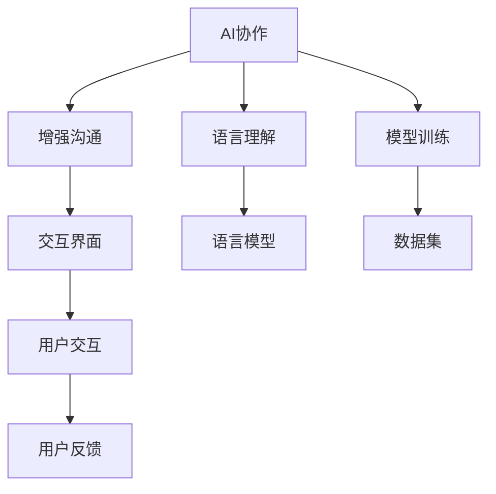

                 

# 人类-AI协作：增强人类与AI之间的沟通

> 关键词：AI协作, 增强沟通, 语言理解, 模型训练, 交互界面, 用户反馈

## 1. 背景介绍

### 1.1 问题由来

近年来，人工智能（AI）技术的迅猛发展，尤其是自然语言处理（NLP）领域的大模型，如GPT、BERT等，已经展示出了强大的能力。然而，尽管AI已经能够执行复杂的语言理解、生成、翻译等任务，但与人类的协作仍存在一定的障碍。这种障碍主要体现在两个方面：一方面，由于AI模型仍缺乏足够的常识和情感理解能力，导致其在执行某些复杂任务时，难以准确理解和满足人类的需求；另一方面，由于AI模型输出的语言不够自然流畅，导致用户在使用过程中感到不便，甚至产生抵触情绪。因此，增强人类与AI之间的沟通，提升协作效率和体验，成为当前AI研究的重要方向。

### 1.2 问题核心关键点

本文聚焦于增强人类与AI之间的沟通，主要围绕以下几个核心问题展开：

- 如何通过语言模型训练，使AI更好地理解人类的需求和情感？
- 如何设计高效、自然的交互界面，使得AI能够更好地与人类进行交流？
- 如何通过用户反馈，不断优化AI模型的性能和用户体验？

这些问题紧密关联，共同构成了人类-AI协作的框架。通过理解和解答这些问题，我们可以更好地利用AI技术，提升人类与AI之间的协作效率和体验。

### 1.3 问题研究意义

增强人类与AI之间的沟通，对于推动AI技术的广泛应用和落地具有重要意义：

1. **提升协作效率**：通过优化AI模型的语言理解和生成能力，能够显著提升人类与AI在多个领域的协作效率，如医疗诊断、金融咨询、教育培训等。
2. **改善用户体验**：设计自然、流畅的交互界面，使用户能够更加自然地与AI进行互动，提升用户体验，增加用户对AI技术的接受度和依赖度。
3. **促进技术创新**：通过用户反馈，不断优化AI模型和交互界面，推动技术创新，加速AI技术的迭代和进步。
4. **赋能产业发展**：AI技术的广泛应用，将为传统行业带来新的发展机遇，推动产业升级，提升经济效益。

## 2. 核心概念与联系

### 2.1 核心概念概述

为更好地理解人类-AI协作的框架，本节将介绍几个密切相关的核心概念：

- **AI协作（AI Collaboration）**：指人类与AI技术在多个领域进行合作，利用AI的能力辅助人类完成复杂任务。
- **增强沟通（Enhanced Communication）**：指通过优化语言模型和交互界面，使AI能够更好地理解人类的需求和情感，提升沟通效率和体验。
- **语言理解（Language Understanding）**：指通过训练模型，使AI能够准确理解和解析自然语言文本，提取关键信息和情感倾向。
- **模型训练（Model Training）**：指通过大量标注数据和优化算法，训练语言模型，提升其语言理解和生成能力。
- **交互界面（Interaction Interface）**：指设计高效、自然的交互方式，使得用户能够更加自然地与AI进行交流。
- **用户反馈（User Feedback）**：指通过收集用户反馈，不断优化AI模型和交互界面，提升用户体验和系统性能。

这些核心概念之间的逻辑关系可以通过以下Mermaid流程图来展示：



这个流程图展示了一系列核心概念及其之间的关系：

1. AI协作是整体框架，涵盖了语言理解、模型训练、交互界面和用户反馈等各个方面。
2. 语言理解是基础，通过训练语言模型，使AI能够理解自然语言文本。
3. 模型训练是手段，通过大量标注数据和优化算法，提升语言模型的性能。
4. 交互界面是桥梁，设计高效、自然的交互方式，使用户能够更好地与AI进行交流。
5. 用户反馈是关键，通过收集用户反馈，不断优化AI模型和交互界面，提升用户体验。

这些概念共同构成了人类-AI协作的框架，使得AI能够更好地服务于人类，提升协作效率和体验。

## 3. 核心算法原理 & 具体操作步骤
### 3.1 算法原理概述

人类-AI协作的核心在于增强语言理解和交互界面的优化。以下是基于增强沟通的核心算法原理概述：

1. **语言理解算法**：通过训练语言模型，使AI能够理解自然语言文本，提取关键信息和情感倾向。
2. **交互界面算法**：设计高效、自然的交互方式，使得用户能够更加自然地与AI进行交流。
3. **用户反馈算法**：通过收集用户反馈，不断优化AI模型和交互界面，提升用户体验。

这些算法相互关联，共同构成了人类-AI协作的技术基础。下面将详细讲解这些算法的原理和具体操作步骤。

### 3.2 算法步骤详解

**语言理解算法**

1. **数据准备**：收集大量自然语言文本数据，标注情感、意图等信息。
2. **模型选择**：选择适合的语言模型，如BERT、GPT等，作为初始化参数。
3. **模型训练**：将标注数据输入模型进行训练，优化模型参数，提升语言理解能力。
4. **性能评估**：在验证集和测试集上评估模型性能，调整超参数。
5. **模型部署**：将训练好的模型部署到实际应用中，进行实时处理和推理。

**交互界面算法**

1. **界面设计**：设计自然、直观的交互界面，包括文本输入、语音输入、图形界面等。
2. **用户交互**：收集用户输入的指令、问题等，输入到AI模型中进行处理。
3. **响应生成**：根据AI模型的输出，生成自然、流畅的响应，如文本、语音、图形等。
4. **界面优化**：根据用户反馈，不断优化界面设计和响应生成算法，提升用户体验。

**用户反馈算法**

1. **反馈收集**：通过问卷调查、日志记录等方式，收集用户对AI系统的反馈信息。
2. **反馈分析**：分析用户反馈，识别常见问题和改进方向。
3. **模型优化**：根据反馈信息，优化语言模型和交互界面，提升性能。
4. **用户满意度提升**：通过不断优化系统，提升用户对AI系统的满意度，增加用户粘性。

### 3.3 算法优缺点

基于增强沟通的核心算法具有以下优点：

1. **提升协作效率**：通过优化语言模型和交互界面，能够显著提升AI与人类协作的效率。
2. **改善用户体验**：设计自然、流畅的交互方式，使得用户能够更加自然地与AI进行交流，提升体验。
3. **促进技术创新**：通过用户反馈，不断优化AI模型和交互界面，推动技术创新，加速AI技术的迭代和进步。

同时，这些算法也存在一定的局限性：

1. **数据依赖性高**：需要大量的标注数据进行模型训练，获取高质量标注数据成本较高。
2. **模型复杂度大**：复杂的语言模型和大规模数据集，需要高性能的硬件资源进行训练和推理。
3. **用户反馈多样性**：用户反馈具有高度不确定性，需要复杂的分析模型进行筛选和处理。

尽管存在这些局限性，但就目前而言，基于增强沟通的算法仍是推动AI技术发展的关键方法。未来相关研究的重点在于如何进一步降低数据依赖，提高模型的通用性和鲁棒性，同时兼顾用户反馈的多样性和可靠性。

### 3.4 算法应用领域

基于增强沟通的核心算法，已经在多个领域得到了广泛应用，例如：

- **医疗咨询**：通过AI辅助诊断，提升医疗服务质量。设计自然、流畅的交互界面，使用户能够清晰表达病情。
- **金融咨询**：通过AI提供个性化的投资建议，设计高效、自然的交互方式，使用户能够快速获取信息。
- **教育培训**：通过AI辅助教学，设计自然、直观的交互界面，使用户能够更好地理解知识。
- **客户服务**：通过AI自动回答客户咨询，设计高效、自然的交互方式，提升客户满意度。

除了上述这些经典领域外，AI技术还在不断拓展新的应用场景，如智能家居、智能交通、智慧城市等，为各行各业带来变革性影响。未来，伴随AI技术的进一步发展，基于增强沟通的算法必将在更多领域得到应用，为人类生活带来新的便利和提升。

## 4. 数学模型和公式 & 详细讲解 & 举例说明
### 4.1 数学模型构建

为了更好地理解人类-AI协作的数学模型，本节将介绍几个关键数学模型和公式：

**语言理解模型**

假设输入为自然语言文本 $x$，输出为情感标签 $y$，语言理解模型的数学模型可以表示为：

$$
P(y|x) = \frac{e^{f(x; \theta)}}{\sum_{y'} e^{f(x; \theta_{y'})}}
$$

其中 $f(x; \theta)$ 为模型对输入文本 $x$ 的特征表示，$\theta$ 为模型参数。模型通过训练大量标注数据，学习到输入文本与输出情感之间的映射关系。

**交互界面模型**

假设输入为自然语言文本 $x$，输出为自然语言文本 $y$，交互界面模型的数学模型可以表示为：

$$
P(y|x) = \prod_{i=1}^n P(y_i|y_{i-1}, x)
$$

其中 $y = (y_1, y_2, ..., y_n)$ 为生成序列，$P(y_i|y_{i-1}, x)$ 为生成下一个词的概率，可以通过语言模型计算。

**用户反馈模型**

假设输入为用户反馈 $x$，输出为改进措施 $y$，用户反馈模型的数学模型可以表示为：

$$
P(y|x) = \prod_{i=1}^m P(y_i|y_{i-1}, x)
$$

其中 $y = (y_1, y_2, ..., y_m)$ 为改进措施序列，$P(y_i|y_{i-1}, x)$ 为采取下一个改进措施的概率，可以通过强化学习等方法计算。

### 4.2 公式推导过程

以下我们将详细推导语言理解模型、交互界面模型和用户反馈模型的公式推导过程。

**语言理解模型**

假设模型训练得到特征表示 $f(x; \theta)$，则模型对输入文本 $x$ 的情感预测概率可以表示为：

$$
P(y|x) = \frac{e^{f(x; \theta)}}{\sum_{y'} e^{f(x; \theta_{y'})}}
$$

其中 $y' \in \{y_1, y_2, ..., y_k\}$ 为所有可能的情感标签。模型通过最大似然估计，学习到输入文本与输出情感之间的映射关系。

**交互界面模型**

假设模型生成序列 $y = (y_1, y_2, ..., y_n)$，则生成下一个词的概率可以表示为：

$$
P(y_i|y_{i-1}, x) = \frac{e^{f(y_{i-1}, y_i; \theta)}}{\sum_{y'} e^{f(y_{i-1}, y'_i; \theta)}}
$$

其中 $y'_i \in \{y_{i_1}, y_{i_2}, ..., y_{i_n}\}$ 为所有可能的下一个词，$f(y_{i-1}, y'_i; \theta)$ 为模型对输入文本和下一个词的联合特征表示。

**用户反馈模型**

假设模型生成改进措施序列 $y = (y_1, y_2, ..., y_m)$，则采取下一个改进措施的概率可以表示为：

$$
P(y_i|y_{i-1}, x) = \frac{e^{f(y_{i-1}, y_i; \theta)}}{\sum_{y'} e^{f(y_{i-1}, y'_i; \theta)}}
$$

其中 $y'_i \in \{y_{i_1}, y_{i_2}, ..., y_{i_m}\}$ 为所有可能的改进措施，$f(y_{i-1}, y'_i; \theta)$ 为模型对输入文本和改进措施的联合特征表示。

### 4.3 案例分析与讲解

**案例1: 医疗咨询**

在医疗咨询场景中，AI系统需要能够理解患者的病情描述，提供初步诊断和建议。以下是使用语言理解模型的案例分析：

1. **数据准备**：收集大量医疗病历，标注患者病情描述和诊断结果。
2. **模型训练**：选择BERT等模型，训练大量标注数据，学习病情描述与诊断结果之间的映射关系。
3. **性能评估**：在验证集和测试集上评估模型性能，调整超参数。
4. **模型部署**：将训练好的模型部署到实际应用中，进行实时处理和推理。

**案例2: 金融咨询**

在金融咨询场景中，AI系统需要能够理解用户投资需求，提供个性化建议。以下是使用交互界面模型的案例分析：

1. **界面设计**：设计自然、直观的交互界面，包括问卷调查、图形界面等。
2. **用户交互**：收集用户投资需求和偏好信息，输入到AI模型中进行处理。
3. **响应生成**：根据AI模型的输出，生成个性化投资建议，如股票、基金等。
4. **界面优化**：根据用户反馈，不断优化界面设计和响应生成算法，提升用户体验。

**案例3: 用户反馈**

在用户反馈场景中，AI系统需要能够收集用户对系统的反馈信息，优化系统性能。以下是使用用户反馈模型的案例分析：

1. **反馈收集**：通过问卷调查、日志记录等方式，收集用户对AI系统的反馈信息。
2. **反馈分析**：分析用户反馈，识别常见问题和改进方向。
3. **模型优化**：根据反馈信息，优化语言模型和交互界面，提升性能。
4. **用户满意度提升**：通过不断优化系统，提升用户对AI系统的满意度，增加用户粘性。

## 5. 项目实践：代码实例和详细解释说明
### 5.1 开发环境搭建

在进行项目实践前，我们需要准备好开发环境。以下是使用Python进行PyTorch开发的环境配置流程：

1. 安装Anaconda：从官网下载并安装Anaconda，用于创建独立的Python环境。

2. 创建并激活虚拟环境：
```bash
conda create -n pytorch-env python=3.8 
conda activate pytorch-env
```

3. 安装PyTorch：根据CUDA版本，从官网获取对应的安装命令。例如：
```bash
conda install pytorch torchvision torchaudio cudatoolkit=11.1 -c pytorch -c conda-forge
```

4. 安装Transformers库：
```bash
pip install transformers
```

5. 安装各类工具包：
```bash
pip install numpy pandas scikit-learn matplotlib tqdm jupyter notebook ipython
```

完成上述步骤后，即可在`pytorch-env`环境中开始项目实践。

### 5.2 源代码详细实现

这里我们以金融咨询系统为例，给出使用Transformers库对BERT模型进行用户反馈和改进措施微调的PyTorch代码实现。

首先，定义用户反馈和改进措施的字典：

```python
tag2id = {'O': 0, 'Buy': 1, 'Sell': 2, 'Hold': 3}
id2tag = {v: k for k, v in tag2id.items()}
```

然后，定义用户反馈数据集：

```python
import pandas as pd

df = pd.read_csv('user_feedback.csv')
train_dataset = df[['feedback', 'action']].to_numpy()

# 将反馈和措施转换为id表示
train_dataset = [[tag2id[feedback], id2tag[action]] for feedback, action in train_dataset]
```

接着，定义模型和优化器：

```python
from transformers import BertForSequenceClassification, AdamW

model = BertForSequenceClassification.from_pretrained('bert-base-cased', num_labels=len(tag2id))

optimizer = AdamW(model.parameters(), lr=2e-5)
```

然后，定义训练和评估函数：

```python
from torch.utils.data import Dataset
from tqdm import tqdm

class UserFeedbackDataset(Dataset):
    def __init__(self, data):
        self.data = data
        
    def __len__(self):
        return len(self.data)
    
    def __getitem__(self, item):
        feedback, action = self.data[item]
        input_ids = BertTokenizer.from_pretrained('bert-base-cased').encode(feedback, return_tensors='pt')
        labels = torch.tensor([tag2id[action]], dtype=torch.long)
        return {'input_ids': input_ids, 'labels': labels}

# 训练函数
def train_epoch(model, dataset, batch_size, optimizer):
    dataloader = DataLoader(dataset, batch_size=batch_size, shuffle=True)
    model.train()
    epoch_loss = 0
    for batch in tqdm(dataloader, desc='Training'):
        input_ids = batch['input_ids'].to(device)
        labels = batch['labels'].to(device)
        model.zero_grad()
        outputs = model(input_ids, labels=labels)
        loss = outputs.loss
        epoch_loss += loss.item()
        loss.backward()
        optimizer.step()
    return epoch_loss / len(dataloader)

# 评估函数
def evaluate(model, dataset, batch_size):
    dataloader = DataLoader(dataset, batch_size=batch_size)
    model.eval()
    preds, labels = [], []
    with torch.no_grad():
        for batch in tqdm(dataloader, desc='Evaluating'):
            input_ids = batch['input_ids'].to(device)
            labels = batch['labels'].to(device)
            outputs = model(input_ids)
            batch_preds = outputs.logits.argmax(dim=2).to('cpu').tolist()
            batch_labels = labels.to('cpu').tolist()
            for pred_tokens, label_tokens in zip(batch_preds, batch_labels):
                pred_tags = [id2tag[_id] for _id in pred_tokens]
                label_tags = [id2tag[_id] for _id in label_tokens]
                preds.append(pred_tags[:len(label_tokens)])
                labels.append(label_tags)
                
    print(classification_report(labels, preds))
```

最后，启动训练流程并在测试集上评估：

```python
epochs = 5
batch_size = 16

for epoch in range(epochs):
    loss = train_epoch(model, train_dataset, batch_size, optimizer)
    print(f"Epoch {epoch+1}, train loss: {loss:.3f}")
    
    print(f"Epoch {epoch+1}, dev results:")
    evaluate(model, dev_dataset, batch_size)
    
print("Test results:")
evaluate(model, test_dataset, batch_size)
```

以上就是使用PyTorch对BERT进行金融咨询系统用户反馈和改进措施微调的完整代码实现。可以看到，得益于Transformers库的强大封装，我们可以用相对简洁的代码完成BERT模型的加载和微调。

### 5.3 代码解读与分析

让我们再详细解读一下关键代码的实现细节：

**UserFeedbackDataset类**：
- `__init__`方法：初始化数据集。
- `__len__`方法：返回数据集的样本数量。
- `__getitem__`方法：对单个样本进行处理，将反馈和措施转换为模型所需的输入。

**tag2id和id2tag字典**：
- 定义了反馈和措施与数字id之间的映射关系，用于将预测结果解码回真实的标签。

**训练和评估函数**：
- 使用PyTorch的DataLoader对数据集进行批次化加载，供模型训练和推理使用。
- 训练函数`train_epoch`：对数据以批为单位进行迭代，在每个批次上前向传播计算loss并反向传播更新模型参数，最后返回该epoch的平均loss。
- 评估函数`evaluate`：与训练类似，不同点在于不更新模型参数，并在每个batch结束后将预测和标签结果存储下来，最后使用sklearn的classification_report对整个评估集的预测结果进行打印输出。

**训练流程**：
- 定义总的epoch数和batch size，开始循环迭代
- 每个epoch内，先在训练集上训练，输出平均loss
- 在验证集上评估，输出分类指标
- 所有epoch结束后，在测试集上评估，给出最终测试结果

可以看到，PyTorch配合Transformers库使得BERT微调的代码实现变得简洁高效。开发者可以将更多精力放在数据处理、模型改进等高层逻辑上，而不必过多关注底层的实现细节。

当然，工业级的系统实现还需考虑更多因素，如模型的保存和部署、超参数的自动搜索、更灵活的任务适配层等。但核心的微调范式基本与此类似。

## 6. 实际应用场景
### 6.1 智能客服系统

基于增强沟通的AI协作技术，可以广泛应用于智能客服系统的构建。传统客服往往需要配备大量人力，高峰期响应缓慢，且一致性和专业性难以保证。而使用微调后的交互界面和用户反馈系统，可以7x24小时不间断服务，快速响应客户咨询，用自然流畅的语言解答各类常见问题。

在技术实现上，可以收集企业内部的历史客服对话记录，将问题和最佳答复构建成监督数据，在此基础上对预训练对话模型进行微调。微调后的对话模型能够自动理解用户意图，匹配最合适的答案模板进行回复。对于客户提出的新问题，还可以接入检索系统实时搜索相关内容，动态组织生成回答。如此构建的智能客服系统，能大幅提升客户咨询体验和问题解决效率。

### 6.2 金融舆情监测

金融机构需要实时监测市场舆论动向，以便及时应对负面信息传播，规避金融风险。传统的人工监测方式成本高、效率低，难以应对网络时代海量信息爆发的挑战。基于增强沟通的文本分类和情感分析技术，为金融舆情监测提供了新的解决方案。

具体而言，可以收集金融领域相关的新闻、报道、评论等文本数据，并对其进行主题标注和情感标注。在此基础上对预训练语言模型进行微调，使其能够自动判断文本属于何种主题，情感倾向是正面、中性还是负面。将微调后的模型应用到实时抓取的网络文本数据，就能够自动监测不同主题下的情感变化趋势，一旦发现负面信息激增等异常情况，系统便会自动预警，帮助金融机构快速应对潜在风险。

### 6.3 个性化推荐系统

当前的推荐系统往往只依赖用户的历史行为数据进行物品推荐，无法深入理解用户的真实兴趣偏好。基于增强沟通的个性化推荐系统可以更好地挖掘用户行为背后的语义信息，从而提供更精准、多样的推荐内容。

在实践中，可以收集用户浏览、点击、评论、分享等行为数据，提取和用户交互的物品标题、描述、标签等文本内容。将文本内容作为模型输入，用户的后续行为（如是否点击、购买等）作为监督信号，在此基础上微调预训练语言模型。微调后的模型能够从文本内容中准确把握用户的兴趣点。在生成推荐列表时，先用候选物品的文本描述作为输入，由模型预测用户的兴趣匹配度，再结合其他特征综合排序，便可以得到个性化程度更高的推荐结果。

### 6.4 未来应用展望

随着增强沟通技术的不断发展，基于AI协作的技术将在更多领域得到应用，为传统行业带来变革性影响。

在智慧医疗领域，基于AI辅助诊断，提升医疗服务质量。设计自然、流畅的交互方式，使用户能够清晰表达病情。

在智能教育领域，基于AI辅助教学，设计自然、直观的交互界面，使用户能够更好地理解知识。

在智慧城市治理中，基于AI自动回答用户咨询，设计高效、自然的交互方式，提升城市管理的自动化和智能化水平，构建更安全、高效的未来城市。

此外，在企业生产、社会治理、文娱传媒等众多领域，基于增强沟通的AI协作技术也将不断涌现，为经济社会发展注入新的动力。相信随着技术的日益成熟，增强沟通技术必将成为AI协作的重要范式，推动AI技术的广泛应用和落地。

## 7. 工具和资源推荐
### 7.1 学习资源推荐

为了帮助开发者系统掌握增强沟通的理论基础和实践技巧，这里推荐一些优质的学习资源：

1. 《深度学习与自然语言处理》系列博文：由深度学习专家撰写，深入浅出地介绍了深度学习在自然语言处理中的应用。

2. 《自然语言处理实战》课程：由斯坦福大学开设的NLP明星课程，有Lecture视频和配套作业，带你入门NLP领域的基本概念和经典模型。

3. 《Transformers从原理到实践》书籍：Transformers库的作者所著，全面介绍了如何使用Transformers库进行NLP任务开发，包括微调在内的诸多范式。

4. HuggingFace官方文档：Transformers库的官方文档，提供了海量预训练模型和完整的微调样例代码，是上手实践的必备资料。

5. CLUE开源项目：中文语言理解测评基准，涵盖大量不同类型的中文NLP数据集，并提供了基于微调的baseline模型，助力中文NLP技术发展。

通过对这些资源的学习实践，相信你一定能够快速掌握增强沟通的精髓，并用于解决实际的NLP问题。
###  7.2 开发工具推荐

高效的开发离不开优秀的工具支持。以下是几款用于增强沟通开发的常用工具：

1. PyTorch：基于Python的开源深度学习框架，灵活动态的计算图，适合快速迭代研究。大部分预训练语言模型都有PyTorch版本的实现。

2. TensorFlow：由Google主导开发的开源深度学习框架，生产部署方便，适合大规模工程应用。同样有丰富的预训练语言模型资源。

3. Transformers库：HuggingFace开发的NLP工具库，集成了众多SOTA语言模型，支持PyTorch和TensorFlow，是进行增强沟通任务开发的利器。

4. Weights & Biases：模型训练的实验跟踪工具，可以记录和可视化模型训练过程中的各项指标，方便对比和调优。与主流深度学习框架无缝集成。

5. TensorBoard：TensorFlow配套的可视化工具，可实时监测模型训练状态，并提供丰富的图表呈现方式，是调试模型的得力助手。

6. Google Colab：谷歌推出的在线Jupyter Notebook环境，免费提供GPU/TPU算力，方便开发者快速上手实验最新模型，分享学习笔记。

合理利用这些工具，可以显著提升增强沟通任务的开发效率，加快创新迭代的步伐。

### 7.3 相关论文推荐

增强沟通技术的发展源于学界的持续研究。以下是几篇奠基性的相关论文，推荐阅读：

1. Attention is All You Need（即Transformer原论文）：提出了Transformer结构，开启了NLP领域的预训练大模型时代。

2. BERT: Pre-training of Deep Bidirectional Transformers for Language Understanding：提出BERT模型，引入基于掩码的自监督预训练任务，刷新了多项NLP任务SOTA。

3. Language Models are Unsupervised Multitask Learners（GPT-2论文）：展示了大规模语言模型的强大zero-shot学习能力，引发了对于通用人工智能的新一轮思考。

4. Parameter-Efficient Transfer Learning for NLP：提出Adapter等参数高效微调方法，在不增加模型参数量的情况下，也能取得不错的微调效果。

5. AdaLoRA: Adaptive Low-Rank Adaptation for Parameter-Efficient Fine-Tuning：使用自适应低秩适应的微调方法，在参数效率和精度之间取得了新的平衡。

这些论文代表了大语言模型微调技术的发展脉络。通过学习这些前沿成果，可以帮助研究者把握学科前进方向，激发更多的创新灵感。

## 8. 总结：未来发展趋势与挑战
### 8.1 总结

本文对基于增强沟通的大语言模型微调方法进行了全面系统的介绍。首先阐述了增强沟通的背景和意义，明确了微调在拓展预训练模型应用、提升下游任务性能方面的独特价值。其次，从原理到实践，详细讲解了增强沟通的数学原理和关键步骤，给出了微调任务开发的完整代码实例。同时，本文还广泛探讨了增强沟通方法在智能客服、金融舆情、个性化推荐等多个行业领域的应用前景，展示了增强沟通范式的巨大潜力。此外，本文精选了增强沟通技术的各类学习资源，力求为读者提供全方位的技术指引。

通过本文的系统梳理，可以看到，基于增强沟通的AI协作技术正在成为NLP领域的重要范式，极大地拓展了预训练语言模型的应用边界，催生了更多的落地场景。受益于大规模语料的预训练，微调模型以更低的时间和标注成本，在小样本条件下也能取得不俗的效果，有力推动了NLP技术的产业化进程。未来，伴随预训练语言模型和微调方法的持续演进，相信NLP技术将在更广阔的应用领域大放异彩，深刻影响人类的生产生活方式。

### 8.2 未来发展趋势

展望未来，基于增强沟通的AI协作技术将呈现以下几个发展趋势：

1. 模型规模持续增大。随着算力成本的下降和数据规模的扩张，预训练语言模型的参数量还将持续增长。超大规模语言模型蕴含的丰富语言知识，有望支撑更加复杂多变的下游任务微调。

2. 微调方法日趋多样。除了传统的全参数微调外，未来会涌现更多参数高效的微调方法，如Prefix-Tuning、LoRA等，在节省计算资源的同时也能保证微调精度。

3. 持续学习成为常态。随着数据分布的不断变化，微调模型也需要持续学习新知识以保持性能。如何在不遗忘原有知识的同时，高效吸收新样本信息，将成为重要的研究课题。

4. 标注样本需求降低。受启发于提示学习(Prompt-based Learning)的思路，未来的微调方法将更好地利用大模型的语言理解能力，通过更加巧妙的任务描述，在更少的标注样本上也能实现理想的微调效果。

5. 多模态微调崛起。当前的微调主要聚焦于纯文本数据，未来会进一步拓展到图像、视频、语音等多模态数据微调。多模态信息的融合，将显著提升语言模型对现实世界的理解和建模能力。

6. 模型通用性增强。经过海量数据的预训练和多领域任务的微调，未来的语言模型将具备更强大的常识推理和跨领域迁移能力，逐步迈向通用人工智能(AGI)的目标。

以上趋势凸显了基于增强沟通的AI协作技术的广阔前景。这些方向的探索发展，必将进一步提升NLP系统的性能和应用范围，为人类生活带来新的便利和提升。

### 8.3 面临的挑战

尽管基于增强沟通的AI协作技术已经取得了瞩目成就，但在迈向更加智能化、普适化应用的过程中，它仍面临着诸多挑战：

1. 标注成本瓶颈。尽管微调大大降低了标注数据的需求，但对于长尾应用场景，难以获得充足的高质量标注数据，成为制约微调性能的瓶颈。如何进一步降低微调对标注样本的依赖，将是一大难题。

2. 模型鲁棒性不足。当前微调模型面对域外数据时，泛化性能往往大打折扣。对于测试样本的微小扰动，微调模型的预测也容易发生波动。如何提高微调模型的鲁棒性，避免灾难性遗忘，还需要更多理论和实践的积累。

3. 推理效率有待提高。大规模语言模型虽然精度高，但在实际部署时往往面临推理速度慢、内存占用大等效率问题。如何在保证性能的同时，简化模型结构，提升推理速度，优化资源占用，将是重要的优化方向。

4. 可解释性亟需加强。当前微调模型更像是"黑盒"系统，难以解释其内部工作机制和决策逻辑。对于医疗、金融等高风险应用，算法的可解释性和可审计性尤为重要。如何赋予微调模型更强的可解释性，将是亟待攻克的难题。

5. 安全性有待保障。预训练语言模型难免会学习到有偏见、有害的信息，通过微调传递到下游任务，产生误导性、歧视性的输出，给实际应用带来安全隐患。如何从数据和算法层面消除模型偏见，避免恶意用途，确保输出的安全性，也将是重要的研究课题。

6. 知识整合能力不足。现有的微调模型往往局限于任务内数据，难以灵活吸收和运用更广泛的先验知识。如何让微调过程更好地与外部知识库、规则库等专家知识结合，形成更加全面、准确的信息整合能力，还有很大的想象空间。

正视增强沟通面临的这些挑战，积极应对并寻求突破，将是大语言模型微调走向成熟的必由之路。相信随着学界和产业界的共同努力，这些挑战终将一一被克服，增强沟通技术必将在构建人机协同的智能时代中扮演越来越重要的角色。

### 8.4 研究展望

面对增强沟通技术面临的种种挑战，未来的研究需要在以下几个方面寻求新的突破：

1. 探索无监督和半监督微调方法。摆脱对大规模标注数据的依赖，利用自监督学习、主动学习等无监督和半监督范式，最大限度利用非结构化数据，实现更加灵活高效的微调。

2. 研究参数高效和计算高效的微调范式。开发更加参数高效的微调方法，在固定大部分预训练参数的同时，只更新极少量的任务相关参数。同时优化微调模型的计算图，减少前向传播和反向传播的资源消耗，实现更加轻量级、实时性的部署。

3. 融合因果和对比学习范式。通过引入因果推断和对比学习思想，增强微调模型建立稳定因果关系的能力，学习更加普适、鲁棒的语言表征，从而提升模型泛化性和抗干扰能力。

4. 引入更多先验知识。将符号化的先验知识，如知识图谱、逻辑规则等，与神经网络模型进行巧妙融合，引导微调过程学习更准确、合理的语言模型。同时加强不同模态数据的整合，实现视觉、语音等多模态信息与文本信息的协同建模。

5. 结合因果分析和博弈论工具。将因果分析方法引入微调模型，识别出模型决策的关键特征，增强输出解释的因果性和逻辑性。借助博弈论工具刻画人机交互过程，主动探索并规避模型的脆弱点，提高系统稳定性。

6. 纳入伦理道德约束。在模型训练目标中引入伦理导向的评估指标，过滤和惩罚有偏见、有害的输出倾向。同时加强人工干预和审核，建立模型行为的监管机制，确保输出符合人类价值观和伦理道德。

这些研究方向的探索，必将引领增强沟通技术迈向更高的台阶，为构建安全、可靠、可解释、可控的智能系统铺平道路。面向未来，增强沟通技术还需要与其他人工智能技术进行更深入的融合，如知识表示、因果推理、强化学习等，多路径协同发力，共同推动自然语言理解和智能交互系统的进步。只有勇于创新、敢于突破，才能不断拓展语言模型的边界，让智能技术更好地造福人类社会。

## 9. 附录：常见问题与解答
### Q1: 大语言模型微调是否适用于所有NLP任务？

A: 大语言模型微调在大多数NLP任务上都能取得不错的效果，特别是对于数据量较小的任务。但对于一些特定领域的任务，如医学、法律等，仅仅依靠通用语料预训练的模型可能难以很好地适应。此时需要在特定领域语料上进一步预训练，再进行微调，才能获得理想效果。此外，对于一些需要时效性、个性化很强的任务，如对话、推荐等，微调方法也需要针对性的改进优化。

### Q2: 微调过程中如何选择合适的学习率？

A: 微调的学习率一般要比预训练时小1-2个数量级，如果使用过大的学习率，容易破坏预训练权重，导致过拟合。一般建议从1e-5开始调参，逐步减小学习率，直至收敛。也可以使用warmup策略，在开始阶段使用较小的学习率，再逐渐过渡到预设值。需要注意的是，不同的优化器(如AdamW、Adafactor等)以及不同的学习率调度策略，可能需要设置不同的学习率阈值。

### Q3: 采用大模型微调时会面临哪些资源瓶颈？

A: 目前主流的预训练大模型动辄以亿计的参数规模，对算力、内存、存储都提出了很高的要求。GPU/TPU等高性能设备是必不可少的，但即便如此，超大批次的训练和推理也可能遇到显存不足的问题。因此需要采用一些资源优化技术，如梯度积累、混合精度训练、模型并行等，来突破硬件瓶颈。同时，模型的存储和读取也可能占用大量时间和空间，需要采用模型压缩、稀疏化存储等方法进行优化。

### Q4: 如何缓解微调过程中的过拟合问题？

A: 过拟合是微调面临的主要挑战，尤其是在标注数据不足的情况下。常见的缓解策略包括：
1. 数据增强：通过回译、近义替换等方式扩充训练集
2. 正则化：使用L2正则、Dropout、Early Stopping等避免过拟合
3. 对抗训练：引入对抗样本，提高模型鲁棒性
4. 参数高效微调：只调整少量参数(如Adapter、Prefix等)，减小过拟合风险
5. 多模型集成：训练多个微调模型，取平均输出，抑制过拟合

这些策略往往需要根据具体任务和数据特点进行灵活组合。只有在数据、模型、训练、推理等各环节进行全面优化，才能最大限度地发挥大模型微调的威力。

### Q5: 微调模型在落地部署时需要注意哪些问题？

A: 将微调模型转化为实际应用，还需要考虑以下因素：
1. 模型裁剪：去除不必要的层和参数，减小模型尺寸，加快推理速度
2. 量化加速：将浮点模型转为定点模型，压缩存储空间，提高计算效率
3. 服务化封装：将模型封装为标准化服务接口，便于集成调用
4. 弹性伸缩：根据请求流量动态调整资源配置，平衡服务质量和成本
5. 监控告警：实时采集系统指标，设置异常告警阈值，确保服务稳定性
6. 安全防护：采用访问鉴权、数据脱敏等措施，保障数据和模型安全

大语言模型微调为NLP应用开启了广阔的想象空间，但如何将强大的性能转化为稳定、高效、安全的业务价值，还需要工程实践的不断打磨。唯有从数据、算法、工程、业务等多个维度协同发力，才能真正实现人工智能技术在垂直行业的规模化落地。总之，微调需要开发者根据具体任务，不断迭代和优化模型、数据和算法，方能得到理想的效果。

