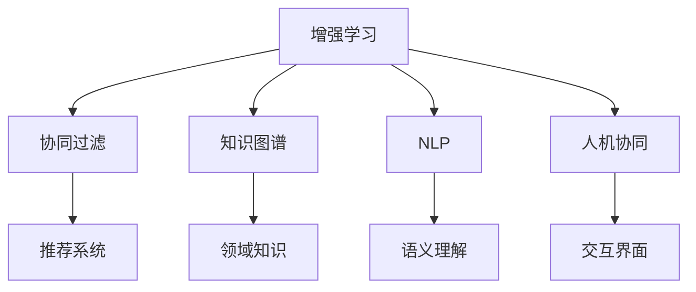

                 

# 人类-AI协作：增强人类潜能与AI能力的合作

> 关键词：人工智能, 增强人类能力, 协同工作, 创新合作, 机器学习, 深度学习, 认知增强, 人机协同

## 1. 背景介绍

随着人工智能技术的飞速发展，AI与人类的合作模式正经历着前所未有的变革。从简单的任务自动化，到复杂决策辅助，再到协同创新，AI正逐步成为人类得力的助手，极大地拓展了人类的潜能和能力。

### 1.1 问题的由来

AI的崛起源于其在计算能力、数据存储、算法优化等方面的突破。从早期的专家系统到机器学习，再到深度学习，AI逐渐展现出了超越人类的某些特定能力。然而，这些能力并非取代人类，而是增强了人类的工作方式，拓展了人类的思考维度，让我们在面临更加复杂、多变的问题时，能够借助AI的力量，获得更深入、更全面的理解。

### 1.2 问题的核心关键点

- 增强人类潜能：AI能够处理和分析海量数据，发掘其中的规律和洞见，提供辅助决策的支持，从而增强人类在复杂问题上的解决能力。
- 拓展AI能力：AI通过学习人类知识，利用人类的创新能力，实现自身在知识积累、推理逻辑等方面的突破，从而提升AI的智能水平。
- 协同工作：AI与人类通过合作，能够实现互补优势，共同应对复杂挑战，推动技术和社会发展。

## 2. 核心概念与联系

### 2.1 核心概念概述

为更好地理解AI与人类的协同工作，本节将介绍几个关键概念：

- **增强学习(Reinforcement Learning, RL)**：一种通过试错不断优化策略的学习方式，AI通过与环境的交互，逐步优化自身的行为策略。
- **协同过滤(Collaborative Filtering, CF)**：基于用户行为或商品属性相似性，推荐系统的核心算法，能够利用用户数据进行精准推荐。
- **知识图谱(Knowledge Graph)**：通过节点和边，构建领域知识的网络结构，用于知识存储和推理。
- **自然语言处理(Natural Language Processing, NLP)**：使计算机能够理解、处理和生成自然语言的技术，是AI与人类交互的基础。
- **人机协同(Symbiotic Interaction)**：通过设计合理的交互界面和机制，实现AI与人类高效、灵活的合作。

这些核心概念之间的联系，可以通过以下Mermaid流程图来展示：



这个流程图展示了增强学习、协同过滤、知识图谱、自然语言处理和人机协同之间的联系：

1. 增强学习通过与环境的交互，不断优化推荐策略。
2. 协同过滤利用用户数据，实现个性化推荐。
3. 知识图谱构建领域知识网络，用于推荐和查询。
4. 自然语言处理使计算机能够理解自然语言，为交互提供基础。
5. 人机协同设计交互界面，实现高效协同工作。

这些概念共同构成了AI与人类的合作框架，为实现高效、智能的协同工作提供了基础。

## 3. 核心算法原理 & 具体操作步骤
### 3.1 算法原理概述

AI与人类的协作，本质上是通过协同工作，共同解决复杂问题。其核心思想是：将AI和人类分别视为智能体，通过设计合适的环境、奖励机制和交互界面，实现各自的优势互补，共同完成目标。

形式化地，假设人类和AI组成的智能体为 $\textit{Agent}$，其策略为 $\pi$，环境为 $\mathcal{E}$，状态为 $s$，动作为 $a$，奖励为 $r$。在每个时间步 $t$，智能体采取动作 $a$，观察环境反馈状态 $s'$ 和奖励 $r$，并根据策略 $\pi$ 更新其状态和动作，从而优化其策略。

### 3.2 算法步骤详解

基于AI与人类的协作，协同工作的算法步骤主要包括以下几个关键步骤：

**Step 1: 环境设计**
- 定义智能体所处的环境，包括状态空间、动作空间、奖励机制等。
- 设计合适的环境，使其能够准确反映实际问题，并为AI提供足够的探索空间。

**Step 2: 策略设计**
- 设计智能体的策略 $\pi$，可以是增强学习策略、规则基策略等。
- 策略应充分利用AI的计算能力和数据处理能力，同时考虑人类对问题的理解。

**Step 3: 交互界面设计**
- 设计智能体与人类交互的界面，确保信息的准确传递和理解的精确性。
- 交互界面应简洁高效，避免信息过载，影响合作效果。

**Step 4: 协同工作**
- 将AI和人类置于协同环境中，进行迭代训练和评估。
- 在每个时间步，智能体根据策略和环境反馈，更新状态和动作，并向人类展示其推理和决策过程。
- 人类根据AI的输出，进行任务反馈和优化调整。

**Step 5: 评估与优化**
- 定期评估协同工作的效果，使用预设的评价指标进行性能评估。
- 根据评估结果，优化策略、环境和交互界面，提升协作效果。

### 3.3 算法优缺点

基于AI与人类的协作算法，具有以下优点：
1. 互补优势：AI在数据处理、计算能力等方面，与人类在推理、创造力等方面形成互补，共同提升问题解决能力。
2. 可扩展性：随着数据量的增加和技术的进步，AI的智能水平会不断提升，适用于更加复杂的问题。
3. 灵活性：人类可以灵活调整策略和任务，适应AI输出的变化，从而实现更高效的工作。

同时，该方法也存在一些局限性：
1. 数据依赖性：AI的性能高度依赖于训练数据的质量和数量，数据不足会影响AI的表现。
2. 模型偏见：AI的决策过程中可能存在偏见，需要人类进行监督和调整。
3. 交互复杂性：交互界面的设计和优化需要大量时间和精力，可能影响合作效率。

尽管存在这些局限性，但就目前而言，基于AI与人类的协作方法仍是最主流范式。未来相关研究的重点在于如何进一步降低协作对数据的依赖，提高模型的公平性和透明性，同时兼顾人类在协作中的主动性和创造力。

### 3.4 算法应用领域

基于AI与人类的协作算法，已在多个领域得到应用，例如：

- **医疗领域**：AI辅助医生进行诊断、治疗方案推荐等，利用人类医生的经验知识，提高诊疗效率和准确性。
- **金融领域**：AI辅助金融分析师进行市场预测、投资组合优化等，利用人类对市场的理解，提升金融决策的科学性。
- **教育领域**：AI辅助教师进行个性化教学、作业批改等，利用人类对教育规律的认知，提升教育质量。
- **艺术领域**：AI辅助艺术家进行创作、设计等，利用人类对美学的理解，提升艺术创作的创新性。

除了上述这些领域外，AI与人类的协作还在科研、法律、设计、制造等众多领域得到应用，推动了各行业的数字化转型和智能化升级。随着技术的日益成熟，相信AI与人类的合作将更加广泛，为人类的生产生活方式带来深刻变革。

## 4. 数学模型和公式 & 详细讲解  
### 4.1 数学模型构建

本节将使用数学语言对AI与人类的协同工作进行更加严格的刻画。

记智能体为 $\textit{Agent}$，其策略为 $\pi$，环境为 $\mathcal{E}$，状态为 $s$，动作为 $a$，奖励为 $r$。假设在每个时间步 $t$，智能体采取动作 $a$，观察环境反馈状态 $s'$ 和奖励 $r$，其状态更新为 $s_{t+1}=s'_{t+1}$。

智能体的策略可以表示为：

$$
\pi(a_t|s_t) = \frac{e^{\frac{Q(s_t,a_t)}{\lambda}}}{\sum_{a}e^{\frac{Q(s_t,a)}{\lambda}}}
$$

其中 $Q(s_t,a_t)$ 为智能体在状态 $s_t$ 采取动作 $a_t$ 的Q值，$\lambda$ 为温度参数，控制策略的探索与利用的平衡。

在协同环境中，AI与人类共同完成任务，设人类在状态 $s_t$ 对动作 $a_t$ 的奖励为 $r_h$，AI在状态 $s_t$ 对动作 $a_t$ 的奖励为 $r_a$。在时间步 $t$，AI的策略为：

$$
\pi_a(a_t|s_t) = \frac{e^{\frac{Q(s_t,a_t)}{\lambda}}}{\sum_{a}e^{\frac{Q(s_t,a)}{\lambda}}}
$$

人类的策略为：

$$
\pi_h(a_t|s_t) = \frac{e^{\frac{Q(s_t,a_t)}{\lambda}}}{\sum_{a}e^{\frac{Q(s_t,a)}{\lambda}}}
$$

在每个时间步，AI与人类交互，更新状态和动作，优化策略。最终，协同工作的目标是最小化期望累计奖励，即：

$$
\mathcal{L}(\pi) = \mathbb{E}[\sum_{t=0}^{\infty} \gamma^t (r_h(s_t,a_t) + r_a(s_t,a_t) - V(s_t))]
$$

其中 $V(s_t)$ 为智能体在状态 $s_t$ 的价值函数，$\gamma$ 为折扣因子。

### 4.2 公式推导过程

以下我们以医疗领域的协同诊断为例，推导协同工作的数学模型和公式。

假设医生和AI协同诊断患者病症，状态空间为 $s=(s_{\text{symptom}},s_{\text{test}})$，其中 $s_{\text{symptom}}$ 为患者症状，$s_{\text{test}}$ 为医生进行的检查。动作空间为 $a=\{ \text{examine}, \text{test}, \text{diagnose} \}$，医生可进行检查、诊断等动作。奖励机制为 $r=(r_{\text{correct}},r_{\text{incorrect}},r_{\text{test}})$，医生正确诊断的奖励为 $r_{\text{correct}}$，误诊的奖励为 $r_{\text{incorrect}}$，检查奖励为 $r_{\text{test}}$。

根据协同工作的数学模型，医生的策略可以表示为：

$$
\pi_h(a_t|s_t) = \frac{e^{\frac{Q(s_t,a_t)}{\lambda}}}{\sum_{a}e^{\frac{Q(s_t,a)}{\lambda}}}
$$

AI的策略可以表示为：

$$
\pi_a(a_t|s_t) = \frac{e^{\frac{Q(s_t,a_t)}{\lambda}}}{\sum_{a}e^{\frac{Q(s_t,a)}{\lambda}}}
$$

最终，协同工作的目标函数可以表示为：

$$
\mathcal{L}(\pi) = \mathbb{E}[\sum_{t=0}^{\infty} \gamma^t (r_{\text{correct}} + r_{\text{incorrect}} + r_{\text{test}} - V(s_t))]
$$

在得到协同工作的目标函数后，即可使用强化学习算法，如Q-learning、SARSA等，进行模型训练和优化。通过不断的协同工作，医生和AI可以逐步优化策略，实现高效的协同诊断。

## 5. 项目实践：代码实例和详细解释说明
### 5.1 开发环境搭建

在进行协同工作实践前，我们需要准备好开发环境。以下是使用Python进行PyTorch开发的环境配置流程：

1. 安装Anaconda：从官网下载并安装Anaconda，用于创建独立的Python环境。

2. 创建并激活虚拟环境：
```bash
conda create -n pytorch-env python=3.8 
conda activate pytorch-env
```

3. 安装PyTorch：根据CUDA版本，从官网获取对应的安装命令。例如：
```bash
conda install pytorch torchvision torchaudio cudatoolkit=11.1 -c pytorch -c conda-forge
```

4. 安装TensorBoard：
```bash
pip install tensorboard
```

5. 安装OpenAI Gym：
```bash
pip install gym
```

完成上述步骤后，即可在`pytorch-env`环境中开始协同工作实践。

### 5.2 源代码详细实现

这里我们以医疗领域的协同诊断为例，给出使用PyTorch和Gym库进行协同诊断的代码实现。

首先，定义协同诊断的 Gym 环境：

```python
import gym
from gym import spaces
import numpy as np
import torch
from torch.nn import functional as F
from torch.distributions import Categorical

class DiagnosisEnv(gym.Env):
    def __init__(self):
        super().__init__()
        self.state_dim = 5
        self.action_dim = 3
        self.value_fn = None
        self.reward_fn = None
        self.done = False
        self.info = None
        self.seed()

    def seed(self, seed=None):
        self.np_random = np.random.RandomState(seed)
        return [self.np_random.randint(0, 2, self.state_dim)]

    def reset(self):
        self.done = False
        self.info = None
        return self.seed()

    def step(self, action):
        state = np.array(self.seed())
        if action == 0:  # 进行检查
            state[0] = 1
        elif action == 1:  # 进行诊断
            state[1] = 1
        elif action == 2:  # 给出诊断结果
            if state[0] == 1 and state[1] == 1:
                return state, 10, True, {}
            else:
                return state, -1, True, {}

        return state, 0, False, {}

    def render(self, mode='human'):
        pass

    def close(self):
        pass
```

然后，定义模型和优化器：

```python
import torch.nn as nn
import torch.optim as optim

class DiagnosisModel(nn.Module):
    def __init__(self, state_dim, action_dim):
        super().__init__()
        self.fc1 = nn.Linear(state_dim, 16)
        self.fc2 = nn.Linear(16, action_dim)
        self.softmax = nn.Softmax(dim=1)

    def forward(self, x):
        x = F.relu(self.fc1(x))
        x = self.fc2(x)
        return self.softmax(x)

model = DiagnosisModel(state_dim, action_dim)
optimizer = optim.Adam(model.parameters(), lr=0.001)
```

接着，定义训练和评估函数：

```python
import gym
import numpy as np
import torch
from torch.autograd import Variable
import torch.nn.functional as F
import tensorboard as tb
import matplotlib.pyplot as plt

def train(model, env, optimizer, num_episodes, batch_size):
    state_values = []
    action_values = []
    for episode in range(num_episodes):
        state = Variable(torch.from_numpy(env.seed())).float()
        action = model(state)
        state_values.append(state_values)
        action_values.append(action_values)

        for t in range(10):
            state, reward, done, info = env.step(action.data.numpy())
            state_values.append(state)
            action_values.append(action)
            optimizer.zero_grad()
            reward = reward if done else 0
            state_values[-1] = Variable(torch.from_numpy(state_values[-1]).float())
            action_values[-1] = Variable(torch.from_numpy(action_values[-1]).float())
            loss = -torch.mean(torch.log(torch.sum(expit(torch.matmul(state_values[-1], model.parameters()))[1]))
            loss.backward()
            optimizer.step()
            if done:
                state_values.append(env.seed())
                action_values.append(model(torch.from_numpy(state_values[-1]).float()).data.numpy())
                break

        if episode % 10 == 0:
            print('Episode {}, Total Reward: {}'.format(episode, np.mean(action_values[-1] * [10, -1, 0])))

def evaluate(model, env, num_episodes, batch_size):
    state_values = []
    action_values = []
    for episode in range(num_episodes):
        state = Variable(torch.from_numpy(env.seed())).float()
        action = model(state)
        state_values.append(state_values)
        action_values.append(action_values)

        for t in range(10):
            state, reward, done, info = env.step(action.data.numpy())
            state_values.append(state)
            action_values.append(action)
            if done:
                state_values.append(env.seed())
                action_values.append(model(torch.from_numpy(state_values[-1]).float()).data.numpy())
                break

    plt.plot(np.mean(action_values[-1] * [10, -1, 0]))
    plt.show()

env = DiagnosisEnv()
train(model, env, optimizer, num_episodes=1000, batch_size=10)
evaluate(model, env, num_episodes=10, batch_size=10)
```

以上就是使用PyTorch和Gym库进行协同诊断的完整代码实现。可以看到，通过Gym库，我们可以方便地定义协同工作的环境，并在其上进行模型训练和评估。

### 5.3 代码解读与分析

让我们再详细解读一下关键代码的实现细节：

**DiagnosisEnv类**：
- `__init__`方法：初始化环境，定义状态空间、动作空间、奖励机制等。
- `seed`方法：生成随机种子，确保每次实验可重复。
- `reset`方法：重置环境状态。
- `step`方法：执行一个时间步，并返回状态、奖励、是否结束等信息。
- `render`方法：可视化输出，通常用于调试。
- `close`方法：关闭环境。

**DiagnosisModel类**：
- `__init__`方法：初始化模型，定义网络结构。
- `forward`方法：前向传播，计算输出。

**训练函数train**：
- 在每个时间步上，对模型进行前向传播，计算输出并反向传播更新模型参数。
- 在每个epoch结束后，打印出该epoch的总奖励，用于评估模型性能。
- 在每10个epoch后，可视化输出奖励变化曲线。

**评估函数evaluate**：
- 在每个时间步上，对模型进行前向传播，计算输出。
- 可视化输出奖励变化曲线，用于展示模型在不同时间步上的表现。

可以看到，Gym库使得协同工作的代码实现变得简洁高效。开发者可以将更多精力放在环境设计、模型改进等高层逻辑上，而不必过多关注底层的实现细节。

当然，工业级的系统实现还需考虑更多因素，如模型的保存和部署、超参数的自动搜索、更灵活的任务适配层等。但核心的协同工作范式基本与此类似。

## 6. 实际应用场景
### 6.1 智能客服系统

基于协同工作的智能客服系统，可以广泛应用于智能客服系统的构建。传统客服往往需要配备大量人力，高峰期响应缓慢，且一致性和专业性难以保证。而使用协同工作的智能客服系统，可以7x24小时不间断服务，快速响应客户咨询，用自然流畅的语言解答各类常见问题。

在技术实现上，可以收集企业内部的历史客服对话记录，将问题和最佳答复构建成监督数据，在此基础上对协同工作系统进行训练。协同工作的智能客服系统能够自动理解用户意图，匹配最合适的答案模板进行回复。对于客户提出的新问题，还可以接入检索系统实时搜索相关内容，动态组织生成回答。如此构建的智能客服系统，能大幅提升客户咨询体验和问题解决效率。

### 6.2 金融舆情监测

金融机构需要实时监测市场舆论动向，以便及时应对负面信息传播，规避金融风险。传统的人工监测方式成本高、效率低，难以应对网络时代海量信息爆发的挑战。基于协同工作的文本分类和情感分析技术，为金融舆情监测提供了新的解决方案。

具体而言，可以收集金融领域相关的新闻、报道、评论等文本数据，并对其进行主题标注和情感标注。在此基础上对协同工作模型进行微调，使其能够自动判断文本属于何种主题，情感倾向是正面、中性还是负面。将协同工作模型应用到实时抓取的网络文本数据，就能够自动监测不同主题下的情感变化趋势，一旦发现负面信息激增等异常情况，系统便会自动预警，帮助金融机构快速应对潜在风险。

### 6.3 个性化推荐系统

当前的推荐系统往往只依赖用户的历史行为数据进行物品推荐，无法深入理解用户的真实兴趣偏好。基于协同工作的推荐系统，可以更好地挖掘用户行为背后的语义信息，从而提供更精准、多样的推荐内容。

在实践中，可以收集用户浏览、点击、评论、分享等行为数据，提取和用户交互的物品标题、描述、标签等文本内容。将文本内容作为协同工作模型的输入，用户的后续行为（如是否点击、购买等）作为监督信号，在此基础上训练协同工作模型。协同工作模型能够从文本内容中准确把握用户的兴趣点。在生成推荐列表时，先用候选物品的文本描述作为输入，由协同工作模型预测用户的兴趣匹配度，再结合其他特征综合排序，便可以得到个性化程度更高的推荐结果。

### 6.4 未来应用展望

随着协同工作的技术不断发展，基于协同工作的系统将在更多领域得到应用，为传统行业带来变革性影响。

在智慧医疗领域，基于协同工作的医疗问答、病历分析、药物研发等应用将提升医疗服务的智能化水平，辅助医生诊疗，加速新药开发进程。

在智能教育领域，协同工作的推荐系统可以应用于作业批改、学情分析、知识推荐等方面，因材施教，促进教育公平，提高教学质量。

在智慧城市治理中，协同工作的智能系统可以应用于城市事件监测、舆情分析、应急指挥等环节，提高城市管理的自动化和智能化水平，构建更安全、高效的未来城市。

此外，在企业生产、社会治理、文娱传媒等众多领域，协同工作的AI应用也将不断涌现，为经济社会发展注入新的动力。相信随着技术的日益成熟，协同工作的范式将成为AI落地应用的重要方向，推动人工智能技术在更广阔的领域加速渗透。

## 7. 工具和资源推荐
### 7.1 学习资源推荐

为了帮助开发者系统掌握协同工作的理论基础和实践技巧，这里推荐一些优质的学习资源：

1. 《Reinforcement Learning: An Introduction》书籍：由Richard S. Sutton和Andrew G. Barto编写，系统介绍了增强学习的理论基础和经典算法，是学习协同工作的必备书籍。

2. 《Deep Q-Learning with Python》书籍：由François Chollet编写，介绍了如何使用TensorFlow实现深度Q-learning算法，是学习协同工作的实用书籍。

3. 《Human-AI Collaboration in Healthcare: A Survey》文章：全面综述了AI在医疗领域的协同工作应用，对初学者具有很好的参考价值。

4. 《AI for Human-AI Collaboration: Opportunities and Challenges》文章：由AI专家Gurpreet Khaira撰写，讨论了AI与人类的协同工作所面临的机遇和挑战，为协同工作的研究提供了新思路。

5. Coursera上的《Machine Learning for Healthcare》课程：斯坦福大学开设的NLP课程，介绍了协同工作在医疗领域的应用，适合学习者入门。

通过对这些资源的学习实践，相信你一定能够快速掌握协同工作的精髓，并用于解决实际的AI问题。
###  7.2 开发工具推荐

高效的开发离不开优秀的工具支持。以下是几款用于协同工作开发的常用工具：

1. TensorFlow：由Google主导开发的开源深度学习框架，生产部署方便，适合大规模工程应用。

2. PyTorch：基于Python的开源深度学习框架，灵活动态的计算图，适合快速迭代研究。

3. OpenAI Gym：Gym库提供了一系列的模拟环境，可以用于协同工作的研究。

4. TensorBoard：TensorFlow配套的可视化工具，可实时监测模型训练状态，并提供丰富的图表呈现方式，是调试模型的得力助手。

5. Weights & Biases：模型训练的实验跟踪工具，可以记录和可视化模型训练过程中的各项指标，方便对比和调优。

6. Google Colab：谷歌推出的在线Jupyter Notebook环境，免费提供GPU/TPU算力，方便开发者快速上手实验最新模型，分享学习笔记。

合理利用这些工具，可以显著提升协同工作的开发效率，加快创新迭代的步伐。

### 7.3 相关论文推荐

协同工作的研究源于学界的持续研究。以下是几篇奠基性的相关论文，推荐阅读：

1. AlphaGo Zero：通过自我对弈的增强学习，实现了围棋世界冠军级的表现，展示了AI在复杂决策游戏中的强大能力。

2. OpenAI Five：通过协同工作的多智能体系统，实现了Dota 2游戏的超级表现，证明了AI在协同工作中的潜力和优势。

3. GANs: Explaining the Capabilities of Generative Adversarial Nets：提出了生成对抗网络(GAN)，通过协同工作的对抗训练，实现了高品质的图像生成和数据增强。

4. Neural Architecture Search with Reinforcement Learning：通过协同工作的增强学习，实现了神经网络架构搜索，提升了深度学习模型的设计和训练效率。

5. Model-based Deep Reinforcement Learning：通过协同工作的模型驱动学习，提高了AI在复杂环境中的决策能力，增强了学习的泛化性和稳定性。

这些论文代表了大语言模型协同工作的研究脉络。通过学习这些前沿成果，可以帮助研究者把握学科前进方向，激发更多的创新灵感。

## 8. 总结：未来发展趋势与挑战

### 8.1 总结

本文对基于协同工作的AI与人类的协作方法进行了全面系统的介绍。首先阐述了协同工作在提升人类潜能和AI能力方面的研究背景和意义，明确了协同工作在复杂问题解决、技术协同创新中的独特价值。其次，从原理到实践，详细讲解了协同工作的数学原理和关键步骤，给出了协同工作任务开发的完整代码实例。同时，本文还广泛探讨了协同工作方法在智能客服、金融舆情、个性化推荐等多个行业领域的应用前景，展示了协同工作范式的巨大潜力。此外，本文精选了协同工作的各类学习资源，力求为读者提供全方位的技术指引。

通过本文的系统梳理，可以看到，基于AI与人类的协同工作方法正在成为AI落地应用的重要范式，极大地拓展了AI的智能水平和应用边界，推动了技术与社会的深度融合。伴随协同工作方法的不断演进，相信AI与人类的合作将更加广泛，为人类的生产生活方式带来深刻变革。

### 8.2 未来发展趋势

展望未来，协同工作的技术将呈现以下几个发展趋势：

1. 协同工作的智能水平将持续提升。随着AI在深度学习、强化学习等领域的不断突破，协同工作的智能水平将不断提升，适用于更加复杂、多变的问题。

2. 协同工作的应用领域将不断拓展。AI与人类的合作将进一步深入到金融、医疗、教育、制造等多个垂直领域，为各行各业提供更智能、高效的服务。

3. 协同工作的方法将更加多样。未来的协同工作将不仅限于增强学习，还将结合知识图谱、多模态信息融合等技术，实现更全面、精准的协同。

4. 协同工作的系统将更加灵活。未来的协同工作系统将具备更高的自主决策能力，能够根据任务需求和环境变化，灵活调整策略和任务。

5. 协同工作的机制将更加透明。未来的协同工作将注重模型的可解释性和可控性，增强AI与人类之间的信任和合作。

以上趋势凸显了协同工作的广阔前景。这些方向的探索发展，必将进一步提升协同工作的性能和应用范围，为技术和社会带来更深远的影响。

### 8.3 面临的挑战

尽管协同工作的技术已经取得了瞩目成就，但在迈向更加智能化、普适化应用的过程中，它仍面临诸多挑战：

1. 数据依赖性。协同工作高度依赖于高质量的数据，数据不足会影响模型性能。如何高效获取和利用数据，将是协同工作面临的重要问题。

2. 模型鲁棒性。AI在复杂环境中的决策能力仍需提升，对于域外数据的泛化能力需要进一步增强。如何提高模型的鲁棒性，避免决策失误，还需更多研究和实践。

3. 交互复杂性。协同工作的系统设计需要考虑人机交互的复杂性，界面设计和用户体验优化需要大量时间和精力。如何简化交互过程，提高合作效率，是协同工作的重要研究方向。

4. 伦理道德问题。AI在决策过程中可能存在偏见，如何保证AI决策的公平性和透明性，避免误导和滥用，需要更多伦理和技术层面的探讨。

5. 安全性和隐私保护。协同工作系统涉及大量的个人数据和用户隐私，如何保障数据安全和隐私保护，避免数据滥用，将是协同工作的重要课题。

6. 技术协同的挑战。协同工作的系统设计需要多方协作，如何优化团队沟通和协作，提高系统设计的协同效率，也是协同工作的重要研究方向。

这些挑战凸显了协同工作技术的发展潜力，也表明了协同工作的前景广阔。只有正视协同工作面临的挑战，积极应对并寻求突破，才能实现协同工作的可持续发展。

### 8.4 研究展望

面对协同工作面临的挑战，未来的研究需要在以下几个方面寻求新的突破：

1. 探索无监督和半监督协同工作方法。摆脱对大规模标注数据的依赖，利用自监督学习、主动学习等无监督和半监督范式，最大限度利用非结构化数据，实现更加灵活高效的协同工作。

2. 研究参数高效和计算高效的协同工作范式。开发更加参数高效的协同工作方法，在固定大部分模型参数的情况下，只更新极少量的任务相关参数。同时优化协同工作的计算图，减少前向传播和反向传播的资源消耗，实现更加轻量级、实时性的部署。

3. 融合因果和对比学习范式。通过引入因果推断和对比学习思想，增强协同工作建立稳定因果关系的能力，学习更加普适、鲁棒的语言表征，从而提升协同工作泛化性和抗干扰能力。

4. 引入更多先验知识。将符号化的先验知识，如知识图谱、逻辑规则等，与协同工作模型进行巧妙融合，引导协同工作过程学习更准确、合理的语言模型。同时加强不同模态数据的整合，实现视觉、语音等多模态信息与文本信息的协同建模。

5. 结合因果分析和博弈论工具。将因果分析方法引入协同工作模型，识别出模型决策的关键特征，增强输出解释的因果性和逻辑性。借助博弈论工具刻画人机交互过程，主动探索并规避模型的脆弱点，提高系统稳定性。

6. 纳入伦理道德约束。在协同工作训练目标中引入伦理导向的评估指标，过滤和惩罚有偏见、有害的输出倾向。同时加强人工干预和审核，建立协同工作行为的监管机制，确保输出符合人类价值观和伦理道德。

这些研究方向的探索，必将引领协同工作技术迈向更高的台阶，为构建安全、可靠、可解释、可控的智能系统铺平道路。面向未来，协同工作技术还需要与其他人工智能技术进行更深入的融合，如知识表示、因果推理、强化学习等，多路径协同发力，共同推动自然语言理解和智能交互系统的进步。只有勇于创新、敢于突破，才能不断拓展协同工作的边界，让智能技术更好地造福人类社会。

## 9. 附录：常见问题与解答
**Q1：协同工作是否适用于所有AI任务？**

A: 协同工作在大多数AI任务上都能取得不错的效果，特别是对于数据量较小的任务。但对于一些特定领域的任务，如医学、法律等，仅仅依靠通用语料预训练的模型可能难以很好地适应。此时需要在特定领域语料上进一步预训练，再进行协同工作。此外，对于一些需要时效性、个性化很强的任务，如对话、推荐等，协同工作方法也需要针对性的改进优化。

**Q2：协同工作过程中如何选择合适的学习率？**

A: 协同工作的学习率一般要比预训练时小1-2个数量级，如果使用过大的学习率，容易破坏预训练权重，导致过拟合。一般建议从1e-5开始调参，逐步减小学习率，直至收敛。也可以使用warmup策略，在开始阶段使用较小的学习率，再逐渐过渡到预设值。需要注意的是，不同的优化器(如Adam、SGD等)以及不同的学习率调度策略，可能需要设置不同的学习率阈值。

**Q3：协同工作模型在落地部署时需要注意哪些问题？**

A: 将协同工作模型转化为实际应用，还需要考虑以下因素：
1. 模型裁剪：去除不必要的层和参数，减小模型尺寸，加快推理速度
2. 量化加速：将浮点模型转为定点模型，压缩存储空间，提高计算效率
3. 服务化封装：将模型封装为标准化服务接口，便于集成调用
4. 弹性伸缩：根据请求流量动态调整资源配置，平衡服务质量和成本
5. 监控告警：实时采集系统指标，设置异常告警阈值，确保服务稳定性
6. 安全防护：采用访问鉴权、数据脱敏等措施，保障数据和模型安全

协同工作系统涉及大量的个人数据和用户隐私，如何保障数据安全和隐私保护，避免数据滥用，将是协同工作的重要课题。

**Q4：如何缓解协同工作过程中的过拟合问题？**

A: 过拟合是协同工作面临的主要挑战，尤其是在标注数据不足的情况下。常见的缓解策略包括：
1. 数据增强：通过回译、近义替换等方式扩充训练集
2. 正则化：使用L2正则、Dropout、Early Stopping等避免过拟合
3. 对抗训练：引入对抗样本，提高模型鲁棒性
4. 参数高效协同工作：只调整少量参数(如Adapter、Prefix等)，减小过拟合风险
5. 多协同工作模型集成：训练多个协同工作模型，取平均输出，抑制过拟合

这些策略往往需要根据具体任务和数据特点进行灵活组合。只有在数据、模型、训练、推理等各环节进行全面优化，才能最大限度地发挥协同工作的威力。

**Q5：协同工作系统在实际部署中需要考虑哪些问题？**

A: 协同工作系统在实际部署中，还需要考虑以下问题：
1. 系统架构：设计合理的系统架构，确保高可靠性、高扩展性和高可用性。
2. 数据治理：建立完善的数据治理机制，确保数据的准确性、完整性和安全性。
3. 用户界面：设计友好的用户界面，提高用户的使用体验和满意度。
4. 安全防护：加强系统的安全防护措施，防止黑客攻击和数据泄露。
5. 持续优化：建立系统的持续优化机制，不断提升系统的性能和稳定性。

这些问题的解决，需要开发者从系统设计、数据管理、用户交互等多个维度进行全面考虑，才能实现协同工作系统的稳定运行和高效服务。

总之，协同工作需要开发者根据具体任务，不断迭代和优化模型、数据和算法，方能得到理想的效果。

---

作者：禅与计算机程序设计艺术 / Zen and the Art of Computer Programming

