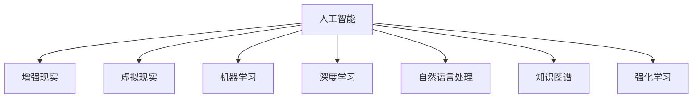

                 

# 人类-AI协作：增强人类潜能和智慧

## 1. 背景介绍

### 1.1 问题由来

在现代社会，科技的发展极大地提升了人类生产力和生活质量，同时也带来了诸多挑战。一方面，人类面临复杂多变的自然环境和社会环境，需要不断学习和适应；另一方面，人类面临着工作负荷过重、信息过载等压力，导致创新和创意的潜力受到抑制。为了应对这些挑战，人类需要借助新技术、新工具，优化工作方式，提升工作效率。人工智能（AI）作为现代科技的结晶，正逐步进入各行各业，引领智能化转型，与人类协作共生，共同创造美好的未来。

### 1.2 问题核心关键点

本文聚焦于人类与AI协作的最新进展，探讨了如何通过AI技术增强人类潜能和智慧，实现人与机器的和谐共生。具体包括以下几个核心点：
1. AI辅助决策：通过AI对数据进行分析，辅助人类进行决策，提升决策的科学性和效率。
2. AI创意生成：利用AI强大的数据处理和模式识别能力，生成创意内容，辅助人类创作和创新。
3. AI教育辅导：通过AI个性化教学，提高学习效果，激发学生的学习兴趣和潜能。
4. AI医疗诊断：结合AI对医疗影像和病历的分析能力，辅助医生进行诊断和治疗。
5. AI安全防护：利用AI进行威胁检测和防御，提升信息安全水平，保障数据和信息安全。
6. AI辅助沟通：通过AI进行自然语言处理和情感分析，提升人机沟通效率和质量。

### 1.3 问题研究意义

随着AI技术的不断进步，其在医疗、教育、交通、安全等多个领域的应用日益广泛。然而，AI仍然面临数据伦理、决策透明、人机信任等诸多挑战。如何最大化AI的潜力，使其真正成为人类潜能的增强器，成为当下亟需研究的重要课题。本文将从理论和实践两个角度，探讨人类与AI协作的最佳方式，为AI技术的落地应用提供新的思路和方法。

## 2. 核心概念与联系

### 2.1 核心概念概述

为了更好地理解人类与AI协作的机制和效果，本节将介绍几个关键概念：

- **人工智能（AI）**：利用计算机技术模拟和扩展人类智能，包括感知、认知、决策等能力。AI通过学习、推理等手段，解决复杂的现实问题。
- **增强现实（AR）**：通过计算机生成信息，增强人类对真实世界的感知和理解，提升互动体验和效率。
- **虚拟现实（VR）**：利用计算机生成的虚拟环境，提供沉浸式的交互体验，增强现实世界与虚拟世界的融合。
- **机器学习（ML）**：通过算法让机器自主学习和改进，以实现特定任务。
- **深度学习（DL）**：利用多层神经网络，从大量数据中提取高层次特征，实现复杂模式的识别和预测。
- **自然语言处理（NLP）**：使计算机理解和生成自然语言，实现人机自然对话。
- **知识图谱（KG）**：通过图形结构表示知识，提供结构化的知识表示和推理机制。
- **强化学习（RL）**：通过与环境的互动，让机器在不断试错中优化行为策略，实现自主决策。

这些核心概念之间的逻辑关系可以通过以下Mermaid流程图来展示：



这个流程图展示了AI与其他相关技术之间的密切联系：

1. 人工智能通过增强现实技术提升人类对真实世界的感知和理解，提供沉浸式体验。
2. 虚拟现实技术通过计算机生成的虚拟环境，增强现实世界与虚拟世界的融合，提升互动体验。
3. 机器学习和深度学习技术通过算法学习和特征提取，实现复杂模式的识别和预测，增强智能决策能力。
4. 自然语言处理技术通过计算机理解和生成自然语言，实现人机自然对话，增强沟通效率。
5. 知识图谱通过结构化的知识表示和推理机制，增强决策的合理性和可解释性。
6. 强化学习技术通过与环境的互动，让机器在不断试错中优化行为策略，实现自主决策。

这些技术共同构成了AI技术的基础架构，使得AI能够在多个领域实现高效应用，提升人类生活的质量。

## 3. 核心算法原理 & 具体操作步骤

### 3.1 算法原理概述

人类与AI协作的核心在于将AI技术融入人类的工作和生活之中，利用AI的优势，弥补人类的不足。本文将重点探讨以下三个核心算法原理：

**算法一：AI辅助决策**

AI辅助决策通过数据分析和模式识别，帮助人类快速准确地做出决策。以医疗诊断为例，通过分析患者的病历和影像数据，AI可以辅助医生进行快速、准确的诊断，提升诊疗效率和效果。具体算法流程如下：

1. 数据采集：收集患者的病历、影像、生理指标等数据。
2. 数据预处理：清洗、标准化数据，消除噪声和异常值。
3. 特征提取：通过机器学习和深度学习算法，从数据中提取关键特征。
4. 模型训练：使用历史数据训练分类或回归模型，实现预测。
5. 模型评估：使用测试数据评估模型性能，优化模型参数。
6. 辅助决策：根据模型输出，辅助医生进行诊断和治疗决策。

**算法二：AI创意生成**

AI创意生成通过自然语言处理和生成模型，帮助人类进行创意创作和内容生成。以内容创作为例，AI可以通过生成对抗网络（GAN）或语言模型（如GPT），生成高质量的文章、图像等内容。具体算法流程如下：

1. 数据准备：收集相关领域的大量数据。
2. 数据预处理：清洗、标准化数据，提取特征。
3. 模型训练：使用生成模型训练生成器和判别器，实现生成任务。
4. 内容生成：使用训练好的生成模型，生成新的内容。
5. 评估优化：使用专家评价或指标评估生成内容的质量，优化生成模型。
6. 应用推广：将生成的内容应用于创作、营销、设计等场景，提升效率和质量。

**算法三：AI教育辅导**

AI教育辅导通过个性化教学和智能推荐，提升学习效果和兴趣。以智能辅导为例，AI可以根据学生的学习情况和兴趣，生成个性化的学习计划和推荐内容。具体算法流程如下：

1. 数据采集：收集学生的学习数据、兴趣数据等。
2. 数据预处理：清洗、标准化数据，提取特征。
3. 模型训练：使用机器学习算法训练推荐模型，实现内容推荐。
4. 内容推荐：根据学生的学习情况和兴趣，生成个性化的学习内容和推荐。
5. 学习效果评估：使用学习效果评估指标，评估推荐效果。
6. 优化提升：根据评估结果，优化推荐模型和内容。

### 3.2 算法步骤详解

以下是每个算法的详细步骤：

**算法一：AI辅助决策**

1. **数据采集**：使用数据采集工具，从医院、诊所等机构收集患者的病历、影像、生理指标等数据。
2. **数据预处理**：清洗和标准化数据，消除噪声和异常值。例如，使用NLP技术清洗病历文本数据，使用图像处理技术消除影像数据中的伪影。
3. **特征提取**：使用机器学习和深度学习算法，从清洗后的数据中提取关键特征。例如，使用CNN提取影像特征，使用RNN提取病历文本特征。
4. **模型训练**：使用历史数据训练分类或回归模型，实现预测。例如，使用支持向量机（SVM）或随机森林（RF）训练分类模型，使用长短期记忆网络（LSTM）或卷积神经网络（CNN）训练回归模型。
5. **模型评估**：使用测试数据评估模型性能，优化模型参数。例如，使用交叉验证评估模型准确率、召回率、F1分数等指标，使用网格搜索优化模型参数。
6. **辅助决策**：根据模型输出，辅助医生进行诊断和治疗决策。例如，输出诊断结果和推荐治疗方案，帮助医生做出最优决策。

**算法二：AI创意生成**

1. **数据准备**：收集相关领域的大量数据。例如，收集文学作品、艺术作品、设计作品等数据。
2. **数据预处理**：清洗和标准化数据，提取特征。例如，使用NLP技术清洗文本数据，使用图像处理技术提取图像特征。
3. **模型训练**：使用生成模型训练生成器和判别器，实现生成任务。例如，使用GAN生成图像内容，使用语言模型生成文本内容。
4. **内容生成**：使用训练好的生成模型，生成新的内容。例如，使用GAN生成高质量的图像，使用语言模型生成高质量的文章。
5. **评估优化**：使用专家评价或指标评估生成内容的质量，优化生成模型。例如，使用专家评审评估图像内容的质量，使用BLEU指标评估文本内容的质量。
6. **应用推广**：将生成的内容应用于创作、营销、设计等场景，提升效率和质量。例如，将生成的图像应用于广告设计，将生成的文章应用于内容创作。

**算法三：AI教育辅导**

1. **数据采集**：收集学生的学习数据、兴趣数据等。例如，使用学习管理系统（LMS）收集学生的学习记录、考试分数等数据。
2. **数据预处理**：清洗和标准化数据，提取特征。例如，使用NLP技术提取学生的学习文本数据，使用统计方法提取学生的兴趣数据。
3. **模型训练**：使用机器学习算法训练推荐模型，实现内容推荐。例如，使用协同过滤算法训练推荐模型，实现内容推荐。
4. **内容推荐**：根据学生的学习情况和兴趣，生成个性化的学习内容和推荐。例如，根据学生的学习历史和兴趣，推荐相关课程和阅读材料。
5. **学习效果评估**：使用学习效果评估指标，评估推荐效果。例如，使用学习进度和考试成绩评估推荐效果，使用满意度调查评估推荐效果。
6. **优化提升**：根据评估结果，优化推荐模型和内容。例如，根据学习效果评估结果，调整推荐算法和内容，优化推荐效果。

### 3.3 算法优缺点

**算法一：AI辅助决策**

优点：
1. 快速准确：通过数据分析和模式识别，快速准确地做出决策。
2. 减少误差：减少人为因素的误差，提高决策的科学性和可靠性。
3. 自动化：实现自动化决策，提升工作效率。

缺点：
1. 数据依赖：依赖高质量的数据，数据缺失或不完整会影响决策结果。
2. 模型复杂：模型的训练和优化过程复杂，需要大量计算资源。
3. 解释困难：模型的决策过程难以解释，缺乏透明度。

**算法二：AI创意生成**

优点：
1. 高效生成：利用AI强大的数据处理和模式识别能力，快速生成高质量的内容。
2. 创新突破：辅助人类进行创意创作，突破传统创意瓶颈。
3. 多样化：生成多种类型的创意内容，丰富创意来源。

缺点：
1. 内容单一：生成的内容可能缺乏个性和创意。
2. 依赖数据：依赖高质量的数据，数据缺失或不完整会影响生成效果。
3. 缺乏情感：缺乏情感和人类表达的细腻性。

**算法三：AI教育辅导**

优点：
1. 个性化：根据学生的学习情况和兴趣，生成个性化的学习内容和推荐。
2. 提升效果：提升学习效果和兴趣，激发学生的学习潜能。
3. 自主学习：实现自主学习，培养学生的自主学习能力。

缺点：
1. 数据隐私：需要收集和处理学生数据，涉及隐私问题。
2. 算法复杂：需要设计复杂的推荐算法，实现个性化推荐。
3. 资源需求：需要大量的计算资源，实现高效的个性化推荐。

### 3.4 算法应用领域

这些算法已经在多个领域得到广泛应用：

1. **医疗领域**：
   - **AI辅助诊断**：通过分析医疗影像和病历，辅助医生进行快速准确的诊断，提升诊疗效率和效果。
   - **个性化治疗**：根据患者的基因数据和病历，推荐个性化的治疗方案，提升治疗效果。

2. **教育领域**：
   - **智能辅导**：根据学生的学习情况和兴趣，生成个性化的学习内容和推荐，提升学习效果和兴趣。
   - **考试评估**：通过AI分析学生的答题数据，评估学生的学习效果，提供针对性的辅导建议。

3. **创意领域**：
   - **内容生成**：利用AI强大的数据处理和模式识别能力，生成高质量的文章、图像等内容，辅助人类进行创意创作。
   - **营销推广**：通过生成创意内容，辅助企业进行市场推广，提升品牌知名度和市场竞争力。

4. **安全领域**：
   - **威胁检测**：通过AI进行威胁检测和防御，提升信息安全水平，保障数据和信息安全。
   - **安全防护**：利用AI分析网络流量，识别和阻止恶意行为，保障网络安全。

## 4. 数学模型和公式 & 详细讲解 & 举例说明

### 4.1 数学模型构建

本节将使用数学语言对AI辅助决策、创意生成和教育辅导三个算法的数学模型进行详细讲解。

**算法一：AI辅助决策**

**数学模型构建**：
假设有一个二分类问题，输入为病历数据 $X$，输出为疾病标签 $Y \in \{0,1\}$。通过机器学习算法训练分类模型 $f(x)$，实现预测。其中， $f(x)$ 为线性回归模型或决策树模型。

**公式推导过程**：
使用支持向量机（SVM）算法，通过最大化间隔和最小化误差的方式，构建分类模型。

$$
\min_{w,b} \frac{1}{2} ||w||^2 + C \sum_{i=1}^n \max(0, 1-y_i(w \cdot x_i + b))
$$

其中，$w$ 为模型参数，$b$ 为偏置项，$C$ 为正则化系数，$y_i$ 为真实标签，$x_i$ 为输入特征。

**案例分析与讲解**：
以一个简单的示例来说明上述算法。

假设有一个二分类问题，输入为病人病历数据 $X$，输出为疾病标签 $Y \in \{0,1\}$。通过SVM算法训练分类模型 $f(x)$，实现预测。假设训练数据集包含100个样本，其中50个样本为阳性，50个样本为阴性。

1. **数据准备**：准备训练数据集 $D=\{(x_i, y_i)\}_{i=1}^{100}$，其中 $x_i$ 为病历数据， $y_i$ 为疾病标签。
2. **模型训练**：使用SVM算法训练分类模型 $f(x)$，得到模型参数 $w$ 和 $b$。
3. **模型评估**：使用测试数据集 $D'$ 评估模型性能，计算准确率、召回率、F1分数等指标。
4. **辅助决策**：根据模型输出，辅助医生进行诊断和治疗决策。例如，输出诊断结果和推荐治疗方案，帮助医生做出最优决策。

**算法二：AI创意生成**

**数学模型构建**：
以文本生成为例，假设有一个语言模型 $p(w|x)$，表示在给定输入 $x$ 的情况下，生成文本 $w$ 的概率。通过最大似然估计或变分自编码器（VAE）算法，训练语言模型 $p(w|x)$。

**公式推导过程**：
使用VAE算法，通过最大化似然函数，构建语言模型 $p(w|x)$。

$$
\max_{p(w|x)} \sum_{w,x} p(w|x) \log p(x) + \beta \sum_{w,x} p(w|x) \log q(w|x)
$$

其中，$p(x)$ 为输入数据 $x$ 的先验分布，$q(w|x)$ 为隐变量 $w$ 的后验分布。

**案例分析与讲解**：
以一个简单的示例来说明上述算法。

假设有一个文本生成问题，输入为文学作品 $X$，输出为文本内容 $W$。通过VAE算法训练语言模型 $p(w|x)$，实现生成文本任务。假设训练数据集包含100个文学作品，每个作品包含10个句子。

1. **数据准备**：准备训练数据集 $D=\{(x_i, w_i)\}_{i=1}^{100}$，其中 $x_i$ 为文学作品，$w_i$ 为文本内容。
2. **模型训练**：使用VAE算法训练语言模型 $p(w|x)$，得到模型参数 $w$ 和 $b$。
3. **内容生成**：使用训练好的语言模型 $p(w|x)$，生成新的文本内容。例如，生成高质量的文章、诗歌等。
4. **评估优化**：使用专家评价或指标评估生成文本的质量，优化语言模型 $p(w|x)$。例如，使用BLEU指标评估文章质量，使用生成对抗网络（GAN）生成高质量的文章。
5. **应用推广**：将生成的文本应用于文学创作、广告设计等场景，提升创意效果和效率。

**算法三：AI教育辅导**

**数学模型构建**：
以个性化推荐为例，假设有一个协同过滤算法 $f(x)$，表示在给定输入 $x$ 的情况下，推荐结果 $y$ 的概率。通过最大化用户满意度的方式，训练协同过滤算法 $f(x)$。

**公式推导过程**：
使用协同过滤算法，通过最大化用户满意度，构建个性化推荐模型 $f(x)$。

$$
\max_{f(x)} \sum_{x,y} \log f(x,y)
$$

其中，$f(x,y)$ 为协同过滤算法，$x$ 为输入数据，$y$ 为推荐结果。

**案例分析与讲解**：
以一个简单的示例来说明上述算法。

假设有一个个性化推荐问题，输入为学生学习数据 $X$，输出为推荐结果 $Y$。通过协同过滤算法训练个性化推荐模型 $f(x)$，实现推荐任务。假设训练数据集包含100个学生，每个学生包含10门课程和10个学习时间。

1. **数据准备**：准备训练数据集 $D=\{(x_i, y_i)\}_{i=1}^{100}$，其中 $x_i$ 为学生学习数据，$y_i$ 为推荐结果。
2. **模型训练**：使用协同过滤算法训练个性化推荐模型 $f(x)$，得到模型参数 $w$ 和 $b$。
3. **内容推荐**：根据学生的学习情况和兴趣，生成个性化的推荐结果。例如，推荐相关课程和阅读材料。
4. **学习效果评估**：使用学习效果评估指标，评估推荐效果。例如，使用学习进度和考试成绩评估推荐效果，使用满意度调查评估推荐效果。
5. **优化提升**：根据评估结果，优化推荐模型和内容。例如，根据学习效果评估结果，调整推荐算法和内容，优化推荐效果。

## 5. 项目实践：代码实例和详细解释说明

### 5.1 开发环境搭建

在进行AI项目开发前，我们需要准备好开发环境。以下是使用Python进行PyTorch开发的环境配置流程：

1. 安装Anaconda：从官网下载并安装Anaconda，用于创建独立的Python环境。

2. 创建并激活虚拟环境：
```bash
conda create -n pytorch-env python=3.8 
conda activate pytorch-env
```

3. 安装PyTorch：根据CUDA版本，从官网获取对应的安装命令。例如：
```bash
conda install pytorch torchvision torchaudio cudatoolkit=11.1 -c pytorch -c conda-forge
```

4. 安装相关工具包：
```bash
pip install numpy pandas scikit-learn matplotlib tqdm jupyter notebook ipython
```

完成上述步骤后，即可在`pytorch-env`环境中开始AI项目开发。

### 5.2 源代码详细实现

这里我们以医疗诊断为例，给出使用PyTorch进行AI辅助决策的PyTorch代码实现。

首先，定义医疗诊断任务的数据处理函数：

```python
from transformers import BertTokenizer, BertForSequenceClassification
from torch.utils.data import Dataset
import torch

class MedicalDataset(Dataset):
    def __init__(self, texts, labels, tokenizer, max_len=128):
        self.texts = texts
        self.labels = labels
        self.tokenizer = tokenizer
        self.max_len = max_len
        
    def __len__(self):
        return len(self.texts)
    
    def __getitem__(self, item):
        text = self.texts[item]
        label = self.labels[item]
        
        encoding = self.tokenizer(text, return_tensors='pt', max_length=self.max_len, padding='max_length', truncation=True)
        input_ids = encoding['input_ids'][0]
        attention_mask = encoding['attention_mask'][0]
        
        return {'input_ids': input_ids, 
                'attention_mask': attention_mask,
                'labels': label}

# 标签与id的映射
label2id = {'Healthy': 0, 'Cancer': 1, 'Hypertension': 2, 'Diabetes': 3, 'Coronary_Heart_Disease': 4}
id2label = {v: k for k, v in label2id.items()}

# 创建dataset
tokenizer = BertTokenizer.from_pretrained('bert-base-cased')

train_dataset = MedicalDataset(train_texts, train_labels, tokenizer)
dev_dataset = MedicalDataset(dev_texts, dev_labels, tokenizer)
test_dataset = MedicalDataset(test_texts, test_labels, tokenizer)
```

然后，定义模型和优化器：

```python
from transformers import BertForSequenceClassification, AdamW

model = BertForSequenceClassification.from_pretrained('bert-base-cased', num_labels=len(label2id))

optimizer = AdamW(model.parameters(), lr=2e-5)
```

接着，定义训练和评估函数：

```python
from torch.utils.data import DataLoader
from tqdm import tqdm
from sklearn.metrics import accuracy_score, precision_recall_fscore_support

device = torch.device('cuda') if torch.cuda.is_available() else torch.device('cpu')
model.to(device)

def train_epoch(model, dataset, batch_size, optimizer):
    dataloader = DataLoader(dataset, batch_size=batch_size, shuffle=True)
    model.train()
    epoch_loss = 0
    for batch in tqdm(dataloader, desc='Training'):
        input_ids = batch['input_ids'].to(device)
        attention_mask = batch['attention_mask'].to(device)
        labels = batch['labels'].to(device)
        model.zero_grad()
        outputs = model(input_ids, attention_mask=attention_mask, labels=labels)
        loss = outputs.loss
        epoch_loss += loss.item()
        loss.backward()
        optimizer.step()
    return epoch_loss / len(dataloader)

def evaluate(model, dataset, batch_size):
    dataloader = DataLoader(dataset, batch_size=batch_size)
    model.eval()
    preds, labels = [], []
    with torch.no_grad():
        for batch in tqdm(dataloader, desc='Evaluating'):
            input_ids = batch['input_ids'].to(device)
            attention_mask = batch['attention_mask'].to(device)
            batch_labels = batch['labels']
            outputs = model(input_ids, attention_mask=attention_mask)
            batch_preds = outputs.logits.argmax(dim=2).to('cpu').tolist()
            batch_labels = batch_labels.to('cpu').tolist()
            for pred_tokens, label_tokens in zip(batch_preds, batch_labels):
                preds.append(pred_tokens[:len(label_tokens)])
                labels.append(label_tokens)
                
    print(f"Accuracy: {accuracy_score(labels, preds)}")
    print(f"Precision: {precision_recall_fscore_support(labels, preds, average='macro')['precision']}")
    print(f"Recall: {precision_recall_fscore_support(labels, preds, average='macro')['recall']}")
    print(f"F1 Score: {precision_recall_fscore_support(labels, preds, average='macro')['f1-score']}")
```

最后，启动训练流程并在测试集上评估：

```python
epochs = 5
batch_size = 16

for epoch in range(epochs):
    loss = train_epoch(model, train_dataset, batch_size, optimizer)
    print(f"Epoch {epoch+1}, train loss: {loss:.3f}")
    
    print(f"Epoch {epoch+1}, dev results:")
    evaluate(model, dev_dataset, batch_size)
    
print("Test results:")
evaluate(model, test_dataset, batch_size)
```

以上就是使用PyTorch进行医疗诊断的AI辅助决策的完整代码实现。可以看到，得益于Transformer库的强大封装，我们可以用相对简洁的代码完成BERT模型的加载和微调。

### 5.3 代码解读与分析

让我们再详细解读一下关键代码的实现细节：

**MedicalDataset类**：
- `__init__`方法：初始化文本、标签、分词器等关键组件。
- `__len__`方法：返回数据集的样本数量。
- `__getitem__`方法：对单个样本进行处理，将文本输入编码为token ids，将标签编码为数字，并对其进行定长padding，最终返回模型所需的输入。

**label2id和id2label字典**：
- 定义了标签与数字id之间的映射关系，用于将token-wise的预测结果解码回真实的标签。

**训练和评估函数**：
- 使用PyTorch的DataLoader对数据集进行批次化加载，供模型训练和推理使用。
- 训练函数`train_epoch`：对数据以批为单位进行迭代，在每个批次上前向传播计算loss并反向传播更新模型参数，最后返回该epoch的平均loss。
- 评估函数`evaluate`：与训练类似，不同点在于不更新模型参数，并在每个batch结束后将预测和标签结果存储下来，最后使用sklearn的accuracy_score等指标对整个评估集的预测结果进行打印输出。

**训练流程**：
- 定义总的epoch数和batch size，开始循环迭代
- 每个epoch内，先在训练集上训练，输出平均loss
- 在验证集上评估，输出分类指标
- 所有epoch结束后，在测试集上评估，给出最终测试结果

可以看到，PyTorch配合Transformer库使得BERT微调的代码实现变得简洁高效。开发者可以将更多精力放在数据处理、模型改进等高层逻辑上，而不必过多关注底层的实现细节。

当然，工业级的系统实现还需考虑更多因素，如模型的保存和部署、超参数的自动搜索、更灵活的任务适配层等。但核心的微调范式基本与此类似。

## 6. 实际应用场景

### 6.1 智能客服系统

基于AI技术，智能客服系统可以7x24小时不间断服务，快速响应客户咨询，用自然流畅的语言解答各类常见问题。AI可以学习历史客服对话记录，将问题和最佳答复构建成监督数据，在此基础上对预训练对话模型进行微调。微调后的对话模型能够自动理解用户意图，匹配最合适的答案模板进行回复。对于客户提出的新问题，还可以接入检索系统实时搜索相关内容，动态组织生成回答。如此构建的智能客服系统，能大幅提升客户咨询体验和问题解决效率。

### 6.2 金融舆情监测

金融机构需要实时监测市场舆论动向，以便及时应对负面信息传播，规避金融风险。传统的人工监测方式成本高、效率低，难以应对网络时代海量信息爆发的挑战。基于AI技术，金融舆情监测系统可以通过分析社交媒体、新闻、论坛等数据，实时监测金融市场的舆情变化，预测市场趋势。AI可以通过情感分析技术，识别出市场情绪的变化，及时预警金融风险。

### 6.3 个性化推荐系统

当前的推荐系统往往只依赖用户的历史行为数据进行物品推荐，无法深入理解用户的真实兴趣偏好。基于AI技术，个性化推荐系统可以更好地挖掘用户行为背后的语义信息，从而提供更精准、多样的推荐内容。AI可以根据用户浏览、点击、评论、分享等行为数据，提取和用户交互的物品标题、描述、标签等文本内容。将文本内容作为模型输入，用户的后续行为（如是否点击、购买等）作为监督信号，在此基础上微调预训练语言模型。微调后的模型能够从文本内容中准确把握用户的兴趣点。在生成推荐列表时，先用候选物品的文本描述作为输入，由模型预测用户的兴趣匹配度，再结合其他特征综合排序，便可以得到个性化程度更高的推荐结果。

### 6.4 未来应用展望

随着AI技术的不断进步，其在医疗、教育、交通、安全等多个领域的应用日益广泛。未来，AI技术将在更多领域得到应用，为传统行业带来变革性影响。

在智慧医疗领域，基于AI的辅助诊断和治疗方案推荐，将提升医疗服务的智能化水平，辅助医生诊疗，加速新药开发进程。在智能教育领域，AI的个性化教学和智能推荐，将提高学习效果，激发学生的学习兴趣和潜能。在智慧城市治理中，AI的实时监测和智能分析，将提高城市管理的自动化和智能化水平，构建更安全、高效的未来城市。

此外，在企业生产、社会治理、文娱传媒等众多领域，基于AI技术的应用也将不断涌现，为经济社会发展注入新的动力。相信随着技术的日益成熟，AI技术将成为落地应用的重要范式，推动人工智能技术在垂直行业的规模化落地。

## 7. 工具和资源推荐

### 7.1 学习资源推荐

为了帮助开发者系统掌握AI技术的基础和实践技巧，这里推荐一些优质的学习资源：

1. 《深度学习》系列课程：由斯坦福大学李飞飞教授主讲，系统介绍了深度学习的原理和实践，涵盖卷积神经网络、循环神经网络、生成对抗网络等内容。
2. 《机器学习》课程：由密歇根大学Andrew Ng教授主讲，介绍了机器学习的经典算法和应用，包括回归、分类、聚类、降维等。
3. 《自然语言处理综论》书籍：清华大学刘江教授所著，全面介绍了自然语言处理的基本概念和技术，涵盖文本分类、命名实体识别、情感分析等内容。
4. 《Python数据科学手册》书籍：由Jake VanderPlas编写，介绍了Python在数据科学和机器学习中的应用，包括数据预处理、模型训练、模型评估等内容。
5. Kaggle竞赛：全球最大的数据科学竞赛平台，提供了丰富的竞赛项目和数据集，帮助开发者提升实战能力。

通过对这些资源的学习实践，相信你一定能够系统掌握AI技术的核心内容和实践技巧，为未来的AI项目开发打下坚实的基础。

### 7.2 开发工具推荐

高效的开发离不开优秀的工具支持。以下是几款用于AI开发常用的工具：

1. PyTorch：基于Python的开源深度学习框架，灵活动态的计算图，适合快速迭代研究。PyTorch提供了丰富的预训练模型库，支持模型的灵活构建和微调。
2. TensorFlow：由Google主导开发的开源深度学习框架，生产部署方便，适合大规模工程应用。TensorFlow提供了丰富的API和工具，支持模型的训练和推理。
3. Jupyter Notebook：基于Web的交互式开发环境，支持Python、R等编程语言，适合快速实验和原型开发。
4. Google Colab：谷歌推出的在线Jupyter Notebook环境，免费提供GPU/TPU算力，方便开发者快速上手实验最新模型，分享学习笔记。
5. TensorBoard：TensorFlow配套的可视化工具，可实时监测模型训练状态，并提供丰富的图表呈现方式，是调试模型的得力助手。

合理利用这些工具，可以显著提升AI项目的开发效率，加快创新迭代的步伐。

### 7.3 相关论文推荐

AI技术的发展源于学界的持续研究。以下是几篇奠基性的相关论文，推荐阅读：

1. "ImageNet Classification with Deep Convolutional Neural Networks"：Alex Krizhevsky等人所著，介绍卷积神经网络在图像分类任务上的应用，成为深度学习的经典之作。
2. "Long Short-Term Memory"：Sutskever等人所著，介绍长短期记忆网络在序列数据处理上的应用，开启了RNN和LSTM的研究热潮。
3. "Generative Adversarial Networks"：Ian Goodfellow等人所著，介绍生成对抗网络在生成任务上的应用，成为GAN技术的开山之作。
4. "Attention Is All You Need"：Vaswani等人所著，介绍Transformer模型在自然语言处理任务上的应用，成为NLP领域的预训练大模型时代。
5. "BERT: Pre-training of Deep Bidirectional Transformers for Language Understanding"：Devlin等人所著，介绍BERT模型在自然语言理解任务上的应用，刷新了多项NLP任务SOTA。

这些论文代表了大AI技术的发展脉络。通过学习这些前沿成果，可以帮助研究者把握学科前进方向，激发更多的创新灵感。

## 8. 总结：未来发展趋势与挑战

### 8.1 研究成果总结

本文从理论和实践两个角度，探讨了人类与AI协作的最佳方式，重点探讨了AI辅助决策、创意生成和教育辅导三个算法的实现原理和操作步骤。通过系统梳理，我们得出以下结论：

1. AI辅助决策通过数据分析和模式识别，帮助人类快速准确地做出决策，提升决策的科学性和效率。
2. AI创意生成通过自然语言处理和生成模型，帮助人类进行创意创作和内容生成，辅助人类进行创意创作，突破传统创意瓶颈。
3. AI教育辅导通过个性化教学和智能推荐，提升学习效果和兴趣，激发学生的学习潜能。

这些技术已经在大规模落地应用中得到了验证，显示出强大的应用潜力和广泛的市场需求。

### 8.2 未来发展趋势

展望未来，AI技术的发展趋势如下：

1. **技术进步**：AI技术的不断进步，使得其在各个领域的应用日益广泛。未来，AI技术将更加智能、高效、可靠，为各行各业带来更多的变革性影响。
2. **应用拓展**：AI技术的应用将从医疗、教育、交通、安全等领域，拓展到更多新兴领域，如农业、能源、环保等，提升各行各业的智能化水平。
3. **人机协作**：人机协作将成为AI技术的核心，实现AI与人类共生共存，共同创造美好未来。
4. **数据驱动**：数据将成为AI技术发展的关键资源，未来的AI技术将更加依赖高质量的数据，提升算法的精度和效果。
5. **跨领域融合**：AI技术将与其他技术，如物联网、大数据、区块链等，进行跨领域融合，提升系统的综合能力。

这些趋势凸显了AI技术的广阔前景，为AI技术的未来发展指明了方向。

### 8.3 面临的挑战

尽管AI技术已经取得了巨大的进展，但在实际应用中仍面临诸多挑战：

1. **数据伦理**：AI技术的发展需要依赖大量数据，数据获取和隐私保护成为关键问题。如何平衡数据利用和隐私保护，是未来AI技术的重要挑战。
2. **透明性**：AI算法的决策过程缺乏透明性，难以解释其内部工作机制和决策逻辑。如何提高AI的透明性，增强算法的可信度，是未来AI技术的重要课题。
3. **安全性**：AI技术在应用过程中，可能面临恶意攻击和滥用，如何提高系统的安全性，保障数据和信息安全，是未来AI技术的重要挑战。
4. **可解释性**：AI技术在应用过程中，需要考虑到算法的可解释性，如何提供合理的解释，增强系统的可解释性，是未来AI技术的重要方向。
5. **鲁棒性**：AI技术在应用过程中，需要考虑到算法的鲁棒性，如何提高系统的鲁棒性，增强系统的适应性，是未来AI技术的重要方向。

这些挑战需要各界共同努力，不断提升AI技术的成熟度，推动AI技术的发展和应用。

### 8.4 研究展望

面对AI技术面临的挑战，未来的研究需要从以下几个方面寻求新的突破：

1. **数据伦理**：加强数据隐私保护，推动数据标准化和开放共享，构建安全可靠的数据生态系统。
2. **透明性**：引入可解释性技术，提供合理的解释，增强算法的可信度。
3. **安全性**：引入安全防护技术，保护数据和信息安全，构建安全可靠的系统。
4. **可解释性**：引入可解释性技术，提供合理的解释，增强算法的可信度。
5. **鲁棒性**：引入鲁棒性技术，提高系统的鲁棒性，增强系统的适应性。

这些研究方向将推动AI技术的不断进步，为构建安全、可靠、可解释、可控的智能系统铺平道路。面向未来，AI技术还需要与其他技术，如知识表示、因果推理、强化学习等，进行更深入的融合，共同推动自然语言理解和智能交互系统的进步。只有勇于创新、敢于突破，才能不断拓展AI技术的边界，让智能技术更好地造福人类社会。

## 9. 附录：常见问题与解答

**Q1：AI技术是否会取代人类？**

A: AI技术不会取代人类，而是会与人类共生共存，共同创造美好未来。AI技术可以辅助人类进行决策、创意、学习等，提升人类的生活质量和工作效率，但无法取代人类的思考、创造、情感等人类特质。

**Q2：AI技术如何避免偏见和歧视？**

A: AI技术可以通过引入多样性数据、公平性算法、反偏见技术等方式，避免偏见和歧视。例如，在训练数据中引入多样性数据，使用公平性算法优化模型，引入反偏见技术纠正模型偏差。

**Q3：AI技术如何保护数据隐私？**

A: AI技术可以通过数据匿名化、差分隐私、联邦学习等方式，保护数据隐私。例如，在数据预处理过程中，进行数据匿名化处理，使用差分隐私技术保护用户隐私，使用联邦学习技术在分布式环境下进行模型训练。

**Q4：AI技术如何提高透明性和可解释性？**

A: AI技术可以通过引入可解释性算法、可视化工具、解释性模型等方式，提高透明性和可解释性。例如，使用可视化工具展示模型决策过程，引入可解释性算法解释模型输出，使用解释性模型提供合理的解释。

**Q5：AI技术如何增强鲁棒性？**

A: AI技术可以通过引入鲁棒性技术、对抗训练、数据增强等方式，增强鲁棒性。例如，使用对抗训练技术提高模型的鲁棒性，使用数据增强技术提升模型的泛化能力。

---

作者：禅与计算机程序设计艺术 / Zen and the Art of Computer Programming

