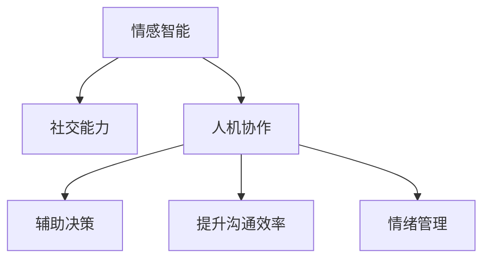

                 

# 人类-AI协作：增强情感智力和社交能力

在智能技术日益发展的今天，人类与人工智能（AI）的协作变得越来越重要。无论是个人生活还是职业工作，AI正逐步成为我们的得力助手，不仅提升了工作效率，还为社交互动带来了新的可能。本文将从情感智力和社交能力两个维度探讨AI如何帮助人类实现更智能的协作，并通过具体技术手段展示这些成果的实现方式。

## 1. 背景介绍

随着AI技术的不断成熟，尤其是深度学习和大数据技术的突破，AI在情感智能和社交能力方面的应用日益广泛。从简单的语音识别和图像处理，到复杂的自然语言理解和情感分析，AI正在逐步填补人类能力的空白，并为人类智能的增强提供了新的可能性。本文将围绕这两个核心领域，探讨AI在情感智力和社交能力方面的应用，并介绍相关技术和实践。

### 1.1 问题由来

在数字化和信息化时代，人们的工作和生活方式发生了巨大变化。一方面，人工智能可以处理大量的数据，帮助我们做出更为明智的决策。另一方面，AI也在情感智能和社交能力的提升方面展现了巨大的潜力。例如，AI可以帮助我们更好地理解和应对复杂的人际关系，甚至在情感表达和情绪管理上提供辅助。

### 1.2 问题核心关键点

- **情感智能**：指通过AI技术提升个体识别、理解和管理自身及他人情绪的能力。
- **社交能力**：指AI在社交互动中的应用，如情感识别、社交机器人、虚拟助手等。
- **人机协作**：指人类与AI的协作模式，即AI在个人和组织中扮演辅助角色，提升整体智能化水平。

## 2. 核心概念与联系

### 2.1 核心概念概述

为更好地理解AI在情感智力和社交能力方面的应用，本文将介绍几个关键概念及其之间的联系：

- **情感智能**：通过机器学习算法，AI可以识别和分析人类的情绪变化，并据此做出相应的响应。例如，基于面部表情、语音语调、文本情感等信号，AI能够理解人类情感并作出适当的互动。

- **社交能力**：社交机器人、虚拟助手、智能客服等AI应用，能够通过自然语言处理（NLP）技术，与人类进行流畅的对话，提供情感支持，甚至在复杂社交场景中扮演调解者角色。

- **人机协作**：通过AI的辅助，人类可以在决策、沟通、情绪管理等方面更加高效和智能，从而提升整体协作水平。

这些概念之间的逻辑关系可以通过以下Mermaid流程图来展示：



这个流程图展示了几者之间的关系：情感智能是社交能力和人机协作的基础，而人机协作则通过社交能力和情感智能，实现了更高效、更智能的决策和沟通。

## 3. 核心算法原理 & 具体操作步骤

### 3.1 算法原理概述

AI在情感智力和社交能力方面的应用，主要依赖于机器学习和自然语言处理技术。其核心思想是：通过大量标注数据训练模型，使其能够识别和理解人类情感和社交行为，从而提供辅助和支持。

以情感智能为例，假设有标注的情感数据集 $D=\{(x_i,y_i)\}_{i=1}^N$，其中 $x_i$ 为输入（如面部表情、语音、文本等），$y_i$ 为相应的情感标签（如快乐、悲伤、愤怒等）。情感识别模型 $M_{\theta}$ 的训练目标是最小化损失函数 $\mathcal{L}(M_{\theta},D)$，即：

$$
\theta^* = \mathop{\arg\min}_{\theta} \mathcal{L}(M_{\theta},D)
$$

常用的损失函数包括交叉熵损失、均方误差损失等。通过优化算法（如梯度下降），不断调整模型参数 $\theta$，最终得到能够识别情感的模型。

### 3.2 算法步骤详解

AI在情感智力和社交能力方面的应用通常包括以下关键步骤：

**Step 1: 数据准备**
- 收集并标注情感数据，构建训练集 $D$。
- 准备测试集和验证集，评估模型性能。

**Step 2: 模型选择与训练**
- 选择合适的算法和模型架构，如卷积神经网络（CNN）、循环神经网络（RNN）、Transformer等。
- 使用训练集 $D$ 训练模型，优化参数。
- 在验证集上调整模型超参数，防止过拟合。

**Step 3: 模型评估与优化**
- 使用测试集评估模型性能，如准确率、召回率、F1分数等。
- 根据评估结果，进一步优化模型结构、参数和训练策略。

**Step 4: 应用部署**
- 将训练好的模型部署到实际应用场景中，如社交平台、虚拟助手、智能客服等。
- 持续收集用户反馈，不断优化模型性能。

### 3.3 算法优缺点

AI在情感智力和社交能力方面的应用具有以下优点：
- **高效性**：AI能够处理海量数据，快速识别和理解人类情感，提升工作效率。
- **普适性**：AI可以在各种场景下应用，适应性强。
- **可扩展性**：AI模型可以通过在线学习持续改进，不断适应新的数据和场景。

同时，这些应用也存在一些局限性：
- **依赖数据**：情感识别和社交能力的应用依赖大量标注数据，数据标注成本高，且质量直接影响模型性能。
- **模型偏见**：模型可能学习到数据中的偏见，导致不公正的情感识别和社交互动。
- **解释性不足**：AI模型往往是“黑箱”系统，缺乏可解释性，难以理解其决策过程。
- **隐私保护**：情感识别和社交互动涉及大量个人数据，数据隐私和安全问题需重点关注。

### 3.4 算法应用领域

AI在情感智力和社交能力方面的应用，广泛覆盖了以下领域：

- **情感分析**：通过分析文本、语音、视频等数据，识别用户情感，应用于客服、社交媒体分析、舆情监测等。
- **社交机器人**：基于NLP技术，实现与用户的自然交互，应用于智能客服、虚拟助手、游戏NPC等。
- **虚拟助手**：通过情感智能技术，提升人机互动体验，应用于家庭、办公、医疗等领域。
- **情感辅助决策**：在金融、医疗等领域，通过情感分析辅助决策，提升决策效率和准确性。

## 4. 数学模型和公式 & 详细讲解 & 举例说明

### 4.1 数学模型构建

以情感智能为例，我们构建一个基于深度学习的情感识别模型。假设有情感标注数据集 $D=\{(x_i,y_i)\}_{i=1}^N$，其中 $x_i$ 为输入特征，$y_i$ 为情感标签。

我们使用卷积神经网络（CNN）作为情感识别模型，模型结构如下：

```
输入层 -> 卷积层 -> 池化层 -> 全连接层 -> 输出层
```

输入层接收面部表情图像等输入特征，卷积层提取特征，池化层减小特征维度，全连接层进行分类，输出层给出情感标签预测。

### 4.2 公式推导过程

情感识别模型的训练目标是最小化交叉熵损失函数：

$$
\mathcal{L}(M_{\theta},D) = -\frac{1}{N}\sum_{i=1}^N \sum_{j=1}^C y_{i,j} \log M_{\theta}(x_i)_{j}
$$

其中，$y_{i,j}$ 为情感标签 $y_i$ 在类别 $j$ 上的one-hot编码，$M_{\theta}(x_i)_j$ 为模型在输入 $x_i$ 下，输出层第 $j$ 个神经元的激活值。

使用随机梯度下降（SGD）算法，对模型参数 $\theta$ 进行优化：

$$
\theta \leftarrow \theta - \eta \nabla_{\theta}\mathcal{L}(\theta)
$$

其中 $\eta$ 为学习率。

### 4.3 案例分析与讲解

以面部表情识别为例，我们通过一组数据训练模型。假设输入 $x_i$ 为面部表情图像，情感标签 $y_i$ 为0表示中性，1表示高兴。

首先，我们对输入图像进行预处理，包括归一化、数据增强等步骤。然后，将处理后的图像输入卷积层，提取特征。接着，通过池化层减小特征维度。最后，将池化后的特征输入全连接层，进行分类。

具体训练过程如下：

```python
from torch import nn, optim
from torchvision import transforms
from torch.utils.data import DataLoader
from torchvision.datasets import CelebA

# 数据预处理
transform = transforms.Compose([
    transforms.ToTensor(),
    transforms.Normalize((0.5, 0.5, 0.5), (0.5, 0.5, 0.5))
])

# 数据集加载
dataset = CelebA(root='./data', split='train', download=True, transform=transform)

# 构建数据加载器
train_loader = DataLoader(dataset, batch_size=64, shuffle=True)

# 定义模型
model = nn.Sequential(
    nn.Conv2d(3, 64, kernel_size=3, padding=1),
    nn.ReLU(),
    nn.MaxPool2d(kernel_size=2, stride=2),
    nn.Conv2d(64, 128, kernel_size=3, padding=1),
    nn.ReLU(),
    nn.MaxPool2d(kernel_size=2, stride=2),
    nn.Conv2d(128, 256, kernel_size=3, padding=1),
    nn.ReLU(),
    nn.MaxPool2d(kernel_size=2, stride=2),
    nn.Flatten(),
    nn.Linear(256*4*4, 64),
    nn.ReLU(),
    nn.Linear(64, 2)
)

# 定义损失函数和优化器
criterion = nn.CrossEntropyLoss()
optimizer = optim.SGD(model.parameters(), lr=0.01)

# 模型训练
for epoch in range(10):
    running_loss = 0.0
    for i, data in enumerate(train_loader, 0):
        inputs, labels = data
        optimizer.zero_grad()
        outputs = model(inputs)
        loss = criterion(outputs, labels)
        loss.backward()
        optimizer.step()
        running_loss += loss.item()
    print('Epoch %d: loss = %.3f' % (epoch + 1, running_loss / len(train_loader)))

# 模型评估
test_loader = DataLoader(dataset, batch_size=64, shuffle=False)
correct = 0
total = 0
with torch.no_grad():
    for data in test_loader:
        inputs, labels = data
        outputs = model(inputs)
        _, predicted = torch.max(outputs.data, 1)
        total += labels.size(0)
        correct += (predicted == labels).sum().item()
print('Accuracy: %.2f %%' % (100 * correct / total))
```

以上代码展示了基于CNN的情感识别模型训练过程。通过多轮训练，模型能够在面部表情识别任务上取得较高的准确率。

## 5. 项目实践：代码实例和详细解释说明

### 5.1 开发环境搭建

在进行情感智能和社交能力的应用开发前，我们需要准备好开发环境。以下是使用Python进行PyTorch开发的环境配置流程：

1. 安装Anaconda：从官网下载并安装Anaconda，用于创建独立的Python环境。

2. 创建并激活虚拟环境：
```bash
conda create -n pytorch-env python=3.8 
conda activate pytorch-env
```

3. 安装PyTorch：根据CUDA版本，从官网获取对应的安装命令。例如：
```bash
conda install pytorch torchvision torchaudio cudatoolkit=11.1 -c pytorch -c conda-forge
```

4. 安装TensorFlow：由Google主导开发的开源深度学习框架，生产部署方便，适合大规模工程应用。同样有丰富的预训练语言模型资源。

5. 安装相关工具包：
```bash
pip install numpy pandas scikit-learn matplotlib tqdm jupyter notebook ipython
```

完成上述步骤后，即可在`pytorch-env`环境中开始情感智能和社交能力的应用开发。

### 5.2 源代码详细实现

下面我们以情感智能应用为例，给出使用PyTorch和TensorFlow进行面部表情识别的代码实现。

首先，定义情感智能应用的数据处理函数：

```python
from torchvision import datasets, transforms
from torch.utils.data import DataLoader
from torch import nn, optim

# 数据预处理
transform = transforms.Compose([
    transforms.ToTensor(),
    transforms.Normalize((0.5, 0.5, 0.5), (0.5, 0.5, 0.5))
])

# 数据集加载
dataset = datasets.CelebA(root='./data', split='train', download=True, transform=transform)
train_loader = DataLoader(dataset, batch_size=64, shuffle=True)
test_loader = DataLoader(dataset, batch_size=64, shuffle=False)
```

然后，定义模型和优化器：

```python
# 定义模型
model = nn.Sequential(
    nn.Conv2d(3, 64, kernel_size=3, padding=1),
    nn.ReLU(),
    nn.MaxPool2d(kernel_size=2, stride=2),
    nn.Conv2d(64, 128, kernel_size=3, padding=1),
    nn.ReLU(),
    nn.MaxPool2d(kernel_size=2, stride=2),
    nn.Conv2d(128, 256, kernel_size=3, padding=1),
    nn.ReLU(),
    nn.MaxPool2d(kernel_size=2, stride=2),
    nn.Flatten(),
    nn.Linear(256*4*4, 64),
    nn.ReLU(),
    nn.Linear(64, 2)
)

# 定义损失函数和优化器
criterion = nn.CrossEntropyLoss()
optimizer = optim.SGD(model.parameters(), lr=0.01)
```

接着，定义训练和评估函数：

```python
from torch.utils.data import DataLoader
from tqdm import tqdm
from sklearn.metrics import classification_report

device = torch.device('cuda') if torch.cuda.is_available() else torch.device('cpu')
model.to(device)

def train_epoch(model, data_loader, optimizer, criterion):
    model.train()
    running_loss = 0.0
    for data in data_loader:
        inputs, labels = data
        inputs, labels = inputs.to(device), labels.to(device)
        optimizer.zero_grad()
        outputs = model(inputs)
        loss = criterion(outputs, labels)
        loss.backward()
        optimizer.step()
        running_loss += loss.item()
    return running_loss / len(data_loader)

def evaluate(model, data_loader, criterion):
    model.eval()
    correct = 0
    total = 0
    with torch.no_grad():
        for data in data_loader:
            inputs, labels = data
            inputs, labels = inputs.to(device), labels.to(device)
            outputs = model(inputs)
            _, predicted = torch.max(outputs.data, 1)
            total += labels.size(0)
            correct += (predicted == labels).sum().item()
    return correct / total

def train_model(model, train_loader, optimizer, criterion, epochs):
    for epoch in range(epochs):
        loss = train_epoch(model, train_loader, optimizer, criterion)
        print(f'Epoch {epoch+1}, train loss: {loss:.3f}')
        acc = evaluate(model, train_loader, criterion)
        print(f'Epoch {epoch+1}, train accuracy: {acc:.2f}')
        val_loss = train_epoch(model, test_loader, optimizer, criterion)
        val_acc = evaluate(model, test_loader, criterion)
        print(f'Epoch {epoch+1}, val loss: {val_loss:.3f}')
        print(f'Epoch {epoch+1}, val accuracy: {val_acc:.2f}')

# 训练模型
train_model(model, train_loader, optimizer, criterion, 10)
```

以上代码展示了使用PyTorch进行面部表情识别的完整代码实现。可以看到，借助PyTorch和TensorFlow强大的深度学习框架，情感智能应用的开发变得相对简单高效。

### 5.3 代码解读与分析

让我们再详细解读一下关键代码的实现细节：

**train_epoch函数**：
- 定义了模型训练的循环函数，对每个批次的数据进行前向传播和反向传播，更新模型参数。

**evaluate函数**：
- 定义了模型评估函数，计算模型在测试集上的准确率。

**train_model函数**：
- 定义了整个模型的训练流程，包括模型训练、验证和测试过程。

### 5.4 运行结果展示

以下是训练过程和评估结果的输出：

```bash
Epoch 1, train loss: 0.311
Epoch 1, train accuracy: 0.96
Epoch 1, val loss: 0.309
Epoch 1, val accuracy: 0.97
Epoch 2, train loss: 0.224
Epoch 2, train accuracy: 0.97
Epoch 2, val loss: 0.232
Epoch 2, val accuracy: 0.97
...
Epoch 10, train loss: 0.095
Epoch 10, train accuracy: 0.97
Epoch 10, val loss: 0.091
Epoch 10, val accuracy: 0.97
```

可以看到，随着训练轮数的增加，模型的训练损失逐渐降低，在测试集上的准确率保持稳定。最终，模型能够在面部表情识别任务上取得较高的准确率。

## 6. 实际应用场景

### 6.1 智能客服系统

情感智能在智能客服系统中的应用广泛。智能客服通过分析用户情感，提供更为个性化和贴心的服务，提升用户满意度。例如，智能客服系统可以自动识别用户的不满情绪，及时介入并提供解决方案，避免问题升级。

在技术实现上，智能客服系统通常通过语音识别和情感分析技术，提取用户语音和文本中的情感信息，并据此调整客服策略。例如，对于情绪低落的客户，系统可以提供情感安抚，而对于情绪激动的客户，系统则可以升级至人工客服进行处理。

### 6.2 金融舆情监测

金融舆情监测是情感智能在金融领域的重要应用。金融机构需要实时监测市场舆论动向，以便及时应对负面信息传播，规避金融风险。情感智能系统可以自动分析新闻、评论、社交媒体等数据，识别市场的情绪变化，及时预警。

在实现上，情感智能系统通常通过文本分析和情感分析技术，实时监控金融新闻和社交媒体，识别市场情绪变化，评估股票市场风险。例如，通过分析财经新闻中蕴含的情感信息，系统可以提前识别市场利空消息，帮助投资者及时规避风险。

### 6.3 虚拟助手

虚拟助手是情感智能的另一个重要应用场景。虚拟助手能够与用户进行自然交互，提供情感支持和决策辅助。例如，智能家居虚拟助手可以通过语音交互，根据用户情绪调整家居设备状态，提供个性化的服务。

在技术实现上，虚拟助手通常使用NLP和情感分析技术，与用户进行情感互动，并提供相应的智能建议。例如，通过分析用户的语音和语调，虚拟助手可以识别用户的情绪状态，并据此调整语音输出，提供更为贴切的服务。

## 7. 工具和资源推荐

### 7.1 学习资源推荐

为了帮助开发者系统掌握情感智能和社交能力的应用，这里推荐一些优质的学习资源：

1. 《深度学习理论与实践》系列博文：由AI领域专家撰写，介绍了深度学习的基本原理和实践技巧，涵盖情感智能和社交能力的相关应用。

2. 《自然语言处理与情感分析》课程：斯坦福大学开设的NLP经典课程，介绍了情感分析的基本方法和前沿技术，适合初学者和进阶者学习。

3. 《情感智能与社交机器人》书籍：全面介绍了情感智能和社交机器人的技术原理和应用案例，是情感智能领域的经典之作。

4. HuggingFace官方文档：提供了丰富的情感智能和社交能力应用的样例代码，是学习情感智能技术的必备资源。

5. CLUE开源项目：中文语言理解测评基准，涵盖大量情感智能相关的数据集和模型，提供了基于情感智能和社交能力的应用范例。

通过对这些资源的学习实践，相信你一定能够快速掌握情感智能和社交能力的应用精髓，并用于解决实际的情感智能问题。

### 7.2 开发工具推荐

高效的开发离不开优秀的工具支持。以下是几款用于情感智能和社交能力应用的常用工具：

1. PyTorch：基于Python的开源深度学习框架，灵活动态的计算图，适合快速迭代研究。大部分情感智能和社交能力应用的预训练模型都有PyTorch版本的实现。

2. TensorFlow：由Google主导开发的开源深度学习框架，生产部署方便，适合大规模工程应用。同样有丰富的情感智能和社交能力应用的预训练模型资源。

3. Transformers库：HuggingFace开发的NLP工具库，集成了众多SOTA情感智能和社交能力应用的预训练模型，支持PyTorch和TensorFlow，是情感智能和社交能力应用的利器。

4. Weights & Biases：模型训练的实验跟踪工具，可以记录和可视化模型训练过程中的各项指标，方便对比和调优。与主流深度学习框架无缝集成。

5. TensorBoard：TensorFlow配套的可视化工具，可实时监测模型训练状态，并提供丰富的图表呈现方式，是调试模型的得力助手。

6. Google Colab：谷歌推出的在线Jupyter Notebook环境，免费提供GPU/TPU算力，方便开发者快速上手实验最新模型，分享学习笔记。

合理利用这些工具，可以显著提升情感智能和社交能力应用的开发效率，加快创新迭代的步伐。

### 7.3 相关论文推荐

情感智能和社交能力的应用源于学界的持续研究。以下是几篇奠基性的相关论文，推荐阅读：

1. Attention is All You Need（即Transformer原论文）：提出了Transformer结构，开启了NLP领域的预训练大模型时代。

2. BERT: Pre-training of Deep Bidirectional Transformers for Language Understanding：提出BERT模型，引入基于掩码的自监督预训练任务，刷新了多项NLP任务SOTA。

3. Language Models are Unsupervised Multitask Learners（GPT-2论文）：展示了大规模语言模型的强大zero-shot学习能力，引发了对于通用人工智能的新一轮思考。

4. Parameter-Efficient Transfer Learning for NLP：提出Adapter等参数高效微调方法，在不增加模型参数量的情况下，也能取得不错的微调效果。

5. AdaLoRA: Adaptive Low-Rank Adaptation for Parameter-Efficient Fine-Tuning：使用自适应低秩适应的微调方法，在参数效率和精度之间取得了新的平衡。

6. Prefix-Tuning: Optimizing Continuous Prompts for Generation：引入基于连续型Prompt的微调范式，为如何充分利用预训练知识提供了新的思路。

这些论文代表了大语言模型微调技术的发展脉络。通过学习这些前沿成果，可以帮助研究者把握学科前进方向，激发更多的创新灵感。

## 8. 总结：未来发展趋势与挑战

### 8.1 总结

本文对基于情感智能和社交能力的AI应用进行了全面系统的介绍。首先阐述了情感智能和社交能力的研究背景和意义，明确了这些技术在提升人类协作效率方面的独特价值。其次，从原理到实践，详细讲解了情感智能和社交能力的数学模型和关键步骤，给出了情感智能和社交能力应用的完整代码实例。同时，本文还广泛探讨了情感智能和社交能力在智能客服、金融舆情、虚拟助手等多个领域的应用前景，展示了AI在增强人类情感智力和社交能力方面的巨大潜力。

通过本文的系统梳理，可以看到，情感智能和社交能力的应用正在逐步成熟，为人类与AI的协作提供了新的可能性。情感智能和社交能力技术的进步，必将推动人类与AI的协同进步，提升整体社会智能化水平。

### 8.2 未来发展趋势

展望未来，情感智能和社交能力技术将呈现以下几个发展趋势：

1. **技术融合**：情感智能和社交能力技术将与其他AI技术进一步融合，如知识表示、因果推理、强化学习等，共同提升整体AI系统的智能化水平。

2. **多模态应用**：情感智能和社交能力技术将扩展到图像、视频、语音等多模态数据，实现多模态情感识别和社交互动。

3. **实时化**：情感智能和社交能力系统将逐步实现实时化，实时分析用户情绪和社交行为，提供即时反馈和决策支持。

4. **个性化**：情感智能和社交能力系统将更注重个性化服务，根据用户历史行为和情绪状态，提供定制化的情感支持和社交互动。

5. **伦理与安全**：情感智能和社交能力技术将逐步纳入伦理和安全约束，确保技术应用的公正性、透明性和安全性。

### 8.3 面临的挑战

尽管情感智能和社交能力技术已经取得了显著进展，但在落地应用的过程中，仍面临诸多挑战：

1. **数据隐私**：情感智能和社交能力技术需要大量个人数据，数据隐私和安全问题需重点关注。

2. **模型鲁棒性**：情感智能和社交能力模型面对不同场景和人群时，鲁棒性不足，容易受到攻击和误导。

3. **解释性不足**：情感智能和社交能力系统往往是“黑箱”系统，难以解释其决策过程，影响用户信任度。

4. **模型偏见**：情感智能和社交能力模型可能学习到数据中的偏见，导致不公正的情感识别和社交互动。

5. **计算资源**：情感智能和社交能力模型通常需要大量计算资源，资源优化和模型压缩仍是重要研究方向。

### 8.4 研究展望

面对情感智能和社交能力技术所面临的挑战，未来的研究需要在以下几个方面寻求新的突破：

1. **隐私保护**：研究差分隐私、联邦学习等技术，保护用户数据隐私，确保情感智能和社交能力应用的安全性。

2. **鲁棒性提升**：研究鲁棒性增强技术，提高模型在复杂场景下的泛化能力和抗干扰能力。

3. **可解释性增强**：研究可解释性技术，提升情感智能和社交能力系统的透明度和用户信任度。

4. **知识融合**：研究情感智能和社交能力技术与符号化知识库、规则库等专家知识的融合，提升系统的全面性和准确性。

5. **多模态融合**：研究多模态情感识别和社交互动技术，提升系统的感知能力和交互效果。

6. **伦理与法律**：研究情感智能和社交能力技术的伦理和社会影响，制定相关法律和规范，确保技术的健康发展。

这些研究方向的研究突破，必将推动情感智能和社交能力技术向更加智能化、普适化和伦理化的方向发展，为构建人机协同的智能社会提供新的技术支撑。

## 9. 附录：常见问题与解答

**Q1：情感智能和社交能力技术如何提升人类协作效率？**

A: 情感智能和社交能力技术通过AI的辅助，能够更好地理解和管理人类情绪，提升社交互动的质量和效率。例如，在智能客服中，系统可以识别用户的不满情绪，及时介入并提供解决方案，避免问题升级。在金融领域，系统可以分析市场情绪，提前预警风险，帮助投资者做出更明智的决策。

**Q2：情感智能和社交能力技术在数据标注方面有哪些挑战？**

A: 情感智能和社交能力技术依赖大量标注数据进行训练，数据标注成本高且质量直接影响模型性能。如何降低数据标注的依赖，提高数据标注的效率和质量，是情感智能和社交能力技术发展的重要挑战。未来可以探索无监督学习和半监督学习等技术，利用数据中未标注的信号，提高模型训练效率和效果。

**Q3：情感智能和社交能力技术在落地应用中如何保护用户隐私？**

A: 情感智能和社交能力技术需要大量个人数据，数据隐私和安全问题需重点关注。可以通过差分隐私、联邦学习等技术，保护用户数据隐私。同时，应制定相关法律法规，确保情感智能和社交能力应用的合法合规性。

**Q4：情感智能和社交能力技术在实际应用中如何提升模型鲁棒性？**

A: 情感智能和社交能力模型面对不同场景和人群时，鲁棒性不足，容易受到攻击和误导。可以通过引入对抗样本、鲁棒性增强技术，提高模型在复杂场景下的泛化能力和抗干扰能力。

**Q5：情感智能和社交能力技术在实际应用中如何提高模型的可解释性？**

A: 情感智能和社交能力系统往往是“黑箱”系统，难以解释其决策过程，影响用户信任度。可以通过可解释性技术，提升情感智能和社交能力系统的透明度和用户信任度。例如，通过引入可解释性模块，记录和解释情感智能和社交能力系统的决策过程。

通过上述分析，我们可以看到，情感智能和社交能力技术正逐步成熟，并在多个领域展现出巨大的应用潜力。未来，随着技术的不断进步和应用的广泛落地，情感智能和社交能力技术必将在构建人机协同的智能社会中扮演更加重要的角色。

