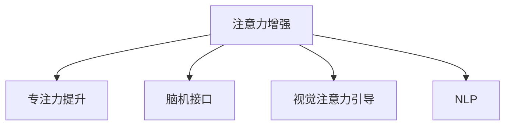

                 

# 人类注意力增强：提升专注力和注意力在商业中的未来发展机遇分析预测

> 关键词：注意力增强,专注力提升,商业应用,未来发展,技术趋势

## 1. 背景介绍

在数字化、智能化的时代浪潮下，人类对于注意力的依赖愈加强烈。无论是工作、学习还是娱乐，注意力都成为不可或缺的重要资源。尤其在商业领域，如何提升员工和消费者的注意力，提高工作效率和消费体验，是企业面临的重要课题。通过现代科技手段，特别是人工智能技术，对注意力进行精准测量、提升和优化，已经成为当下商业应用的热门方向。

### 1.1 问题由来

在数字化背景下，注意力分散现象愈加严重。尤其在互联网时代，信息过载、多任务处理等因素，使得人们难以长时间集中注意力。对于企业而言，注意力问题不仅影响员工的工作效率和生产力，还会降低消费者的购物体验和满意度。如何提升员工的专注力和注意力，优化消费者的注意力管理，成为当下企业的迫切需求。

### 1.2 问题核心关键点

面对注意力分散的挑战，现代科技尤其是人工智能技术提供了新的解决方案。通过深度学习、神经网络、自然语言处理等技术手段，可以对注意力进行量化和优化。具体而言，可以通过以下途径：

- **深度学习注意力模型**：利用注意力机制进行特征提取和信息关注，通过模型学习预测注意力分布。
- **脑机接口技术**：通过脑波检测设备实时监控大脑活动，结合AI算法对注意力状态进行动态调节。
- **视觉注意力引导**：通过视觉刺激技术引导注意力，如眼动追踪、虚拟现实等，增强用户视觉体验。
- **自然语言处理(NLP)**：通过文本分析技术，对用户注意力进行预测和干预，如聊天机器人、情感分析等。

这些技术手段将帮助企业更好地管理员工和消费者的注意力，提升整体的商业效率和客户满意度。

## 2. 核心概念与联系

### 2.1 核心概念概述

为更好地理解注意力增强的方法，本节将介绍几个密切相关的核心概念：

- **注意力增强**：指通过技术手段提升人类注意力的过程。包括对注意力进行精准测量、优化和引导，帮助人们更好地分配和管理注意力资源。
- **专注力提升**：指通过注意力增强技术，帮助人们专注于当前任务，减少注意力分散，提高工作和学习效率。
- **脑机接口(Brain-Machine Interface, BMI)**：通过脑波检测设备，将大脑信号转化为计算机指令，实现对注意力的实时调控。
- **视觉注意力引导**：通过视觉刺激技术，如虚拟现实(VR)、增强现实(AR)、眼动追踪等，增强用户视觉体验，引导注意力集中。
- **自然语言处理(NLP)**：通过文本分析技术，如情感分析、语义理解等，预测用户注意力状态，进行动态干预。

这些核心概念之间的逻辑关系可以通过以下Mermaid流程图来展示：



这个流程图展示了几类注意力增强技术之间的联系：

1. 注意力增强技术可以有多种实现方式。
2. 专注力提升是注意力增强技术的主要应用场景之一。
3. 脑机接口和视觉注意力引导是具体的注意力增强技术手段。
4. NLP技术在注意力增强中起到预测和干预的作用。

这些核心概念共同构成了注意力增强技术的基本框架，使其能够实现对注意力的精准测量、优化和引导。

## 3. 核心算法原理 & 具体操作步骤
### 3.1 算法原理概述

注意力增强的核心算法包括深度学习注意力模型、脑机接口技术、视觉注意力引导和NLP技术。这些算法通过不同的原理和技术手段，对注意力进行量化、优化和引导。

### 3.2 算法步骤详解

#### 3.2.1 深度学习注意力模型

深度学习注意力模型通过引入注意力机制，对输入数据进行特征提取和信息关注。其核心原理如下：

1. **自注意力机制(Self-Attention Mechanism)**：通过多头注意力机制，对输入数据进行多角度的特征表示。
2. **多头自注意力**：通过多个并行的自注意力机制，对输入数据进行多方面的特征提取。
3. **位置编码(Positional Encoding)**：引入位置信息，对不同位置的输入进行区分。

具体步骤如下：

1. **输入编码**：将输入数据转换为向量表示，通过嵌入层将文本、图像等数据转换为向量。
2. **多头自注意力计算**：通过多头自注意力机制计算不同位置之间的相关性，输出注意力权重。
3. **输出融合**：将注意力权重与输入向量进行加权求和，得到最终的输出向量。

该过程通过神经网络模型的前向传播和反向传播，不断优化注意力权重，提升模型对输入数据的理解能力。

#### 3.2.2 脑机接口技术

脑机接口技术通过脑波检测设备，将大脑信号转化为计算机指令，实现对注意力的实时调控。其核心原理如下：

1. **脑波信号采集**：通过脑波检测设备，如EEG、fMRI等，采集大脑活动信号。
2. **信号预处理**：对采集到的脑波信号进行滤波、降噪等预处理。
3. **特征提取**：通过信号处理技术，提取脑波信号中的注意力特征。
4. **注意力调控**：根据注意力特征，通过AI算法对注意力进行动态调控。

具体步骤如下：

1. **信号采集**：通过脑波检测设备采集大脑活动信号。
2. **特征提取**：使用机器学习算法，如PCA、LDA等，提取脑波信号中的注意力特征。
3. **注意力调控**：通过深度学习模型，如LSTM、GRU等，预测当前注意力的状态，调整注意力分布。

该过程通过实时监控大脑活动，动态调节注意力状态，提高注意力管理的效果。

#### 3.2.3 视觉注意力引导

视觉注意力引导通过视觉刺激技术，增强用户视觉体验，引导注意力集中。其核心原理如下：

1. **视觉刺激技术**：通过虚拟现实(VR)、增强现实(AR)、眼动追踪等技术，增强用户视觉体验。
2. **视觉引导算法**：通过视觉引导算法，对用户注意力进行实时干预。
3. **注意力反馈**：通过视觉反馈，增强用户注意力集中效果。

具体步骤如下：

1. **视觉刺激**：通过虚拟现实、增强现实等技术，增强用户视觉体验。
2. **注意力干预**：通过视觉引导算法，如视觉追踪、视线聚焦等，引导用户注意力集中。
3. **注意力反馈**：通过视觉反馈，如视觉提示、声音提示等，增强用户注意力集中效果。

该过程通过视觉刺激和引导，增强用户视觉体验，提升注意力集中效果。

#### 3.2.4 NLP技术

NLP技术通过文本分析技术，预测用户注意力状态，进行动态干预。其核心原理如下：

1. **文本分析技术**：通过情感分析、语义理解等技术，预测用户注意力状态。
2. **注意力干预**：通过聊天机器人、信息推送等技术，对用户注意力进行动态干预。
3. **反馈机制**：通过用户反馈，不断优化注意力干预策略。

具体步骤如下：

1. **情感分析**：通过情感分析技术，预测用户当前的情绪状态。
2. **语义理解**：通过语义理解技术，预测用户的注意力状态。
3. **动态干预**：通过聊天机器人、信息推送等技术，对用户注意力进行动态干预。
4. **反馈机制**：通过用户反馈，不断优化注意力干预策略。

该过程通过文本分析技术，预测用户注意力状态，进行动态干预，提升注意力管理的效果。

### 3.3 算法优缺点

注意力增强技术具有以下优点：

1. **精准测量**：通过多种技术手段，对注意力进行精准测量和量化，提供丰富的注意力数据。
2. **优化调控**：通过AI算法，对注意力进行实时调控，提升注意力管理的效果。
3. **多样化实现**：通过多种技术手段，实现多样化的注意力增强方式。

同时，这些技术也存在一些局限性：

1. **数据依赖**：部分技术手段依赖于高质量的标注数据，如脑波信号、文本数据等。
2. **技术复杂性**：部分技术手段，如脑机接口、视觉注意力引导等，需要高精度设备和复杂的算法。
3. **用户接受度**：部分技术手段，如脑机接口、NLP等，可能需要用户的配合和支持。
4. **隐私问题**：部分技术手段，如脑波检测、视觉引导等，可能涉及用户隐私，需加强隐私保护措施。

尽管存在这些局限性，但就目前而言，注意力增强技术在提升专注力和注意力方面已经显示出巨大的潜力，成为当下商业应用的重要方向。

### 3.4 算法应用领域

注意力增强技术已经在多个领域得到了广泛应用，例如：

- **人力资源管理**：通过深度学习注意力模型，对员工注意力进行量化，优化员工任务安排，提高工作效率。
- **零售电商**：通过NLP技术，预测用户注意力状态，进行个性化推荐，提升用户购物体验。
- **教育培训**：通过视觉注意力引导技术，增强学生视觉体验，提升学习效果。
- **医疗健康**：通过脑机接口技术，实时监控病人注意力状态，调整治疗方案。
- **娱乐媒体**：通过视觉注意力引导技术，增强用户视觉体验，提升娱乐效果。

除了上述这些经典应用外，注意力增强技术还在广告投放、视频游戏、智能家居等多个领域得到创新性应用，为企业的数字化转型和智能化升级提供了新的技术路径。

## 4. 数学模型和公式 & 详细讲解 & 举例说明
### 4.1 数学模型构建

本节将使用数学语言对注意力增强的核心算法进行更加严格的刻画。

假设注意力增强模型为 $M_{\theta}$，其中 $\theta$ 为模型参数。给定输入数据集 $D=\{x_i\}_{i=1}^N, x_i \in \mathcal{X}$，注意力增强模型的任务是找到最优参数 $\hat{\theta}$，使得 $M_{\hat{\theta}}(x_i)$ 最大程度逼近真实注意力状态 $y_i$。

定义注意力增强模型的损失函数为 $\ell(M_{\theta}(x_i),y_i)$，则在数据集 $D$ 上的经验风险为：

$$
\mathcal{L}(\theta) = \frac{1}{N} \sum_{i=1}^N \ell(M_{\theta}(x_i),y_i)
$$

通过梯度下降等优化算法，最小化经验风险，得到最优模型参数 $\hat{\theta}$。

### 4.2 公式推导过程

以深度学习注意力模型为例，进行详细推导。

假设模型 $M_{\theta}$ 对输入数据 $x_i$ 的注意力权重为 $a_i$，注意力分布为 $A_{\theta}$。则注意力增强模型的损失函数为：

$$
\ell(M_{\theta}(x_i),y_i) = \ell(a_i,y_i)
$$

其中 $\ell$ 为注意力权重和真实注意力状态之间的损失函数，如均方误差、交叉熵等。

根据链式法则，注意力增强模型的损失函数对模型参数 $\theta$ 的梯度为：

$$
\frac{\partial \mathcal{L}(\theta)}{\partial \theta} = \sum_{i=1}^N \frac{\partial \ell(a_i,y_i)}{\partial a_i} \frac{\partial a_i}{\partial \theta}
$$

在得到损失函数的梯度后，即可带入参数更新公式，完成模型的迭代优化。重复上述过程直至收敛，最终得到最优模型参数 $\hat{\theta}$。

## 5. 项目实践：代码实例和详细解释说明
### 5.1 开发环境搭建

在进行注意力增强实践前，我们需要准备好开发环境。以下是使用Python进行深度学习开发的环境配置流程：

1. 安装Anaconda：从官网下载并安装Anaconda，用于创建独立的Python环境。

2. 创建并激活虚拟环境：
```bash
conda create -n attention-env python=3.8 
conda activate attention-env
```

3. 安装PyTorch：根据CUDA版本，从官网获取对应的安装命令。例如：
```bash
conda install pytorch torchvision torchaudio cudatoolkit=11.1 -c pytorch -c conda-forge
```

4. 安装TensorFlow：
```bash
conda install tensorflow
```

5. 安装TensorBoard：
```bash
pip install tensorboard
```

6. 安装PyTorch Lightning：
```bash
pip install pytorch-lightning
```

完成上述步骤后，即可在`attention-env`环境中开始注意力增强实践。

### 5.2 源代码详细实现

这里我们以深度学习注意力模型为例，给出使用PyTorch进行注意力增强的PyTorch代码实现。

首先，定义注意力增强模型：

```python
import torch
import torch.nn as nn
import torch.nn.functional as F

class AttentionModel(nn.Module):
    def __init__(self, input_size, attention_size, output_size):
        super(AttentionModel, self).__init__()
        self.query = nn.Linear(input_size, attention_size)
        self.key = nn.Linear(input_size, attention_size)
        self.value = nn.Linear(input_size, attention_size)
        self.attention = nn.Linear(attention_size, 1)
        self.output = nn.Linear(attention_size, output_size)

    def forward(self, x):
        query = self.query(x)
        key = self.key(x)
        value = self.value(x)
        attention = self.attention(query)
        attention = F.softmax(attention, dim=1)
        attention = attention.unsqueeze(-1)
        context = torch.bmm(attention, value)
        context = self.output(context)
        return context
```

然后，定义训练和评估函数：

```python
from sklearn.model_selection import train_test_split
from torch.utils.data import Dataset, DataLoader
from torch.optim import Adam
import numpy as np

class AttentionDataset(Dataset):
    def __init__(self, X, y):
        self.X = X
        self.y = y

    def __len__(self):
        return len(self.X)

    def __getitem__(self, item):
        return self.X[item], self.y[item]

def train_epoch(model, dataloader, optimizer):
    model.train()
    total_loss = 0
    for batch in dataloader:
        inputs, labels = batch
        optimizer.zero_grad()
        outputs = model(inputs)
        loss = F.mse_loss(outputs, labels)
        loss.backward()
        optimizer.step()
        total_loss += loss.item()
    return total_loss / len(dataloader)

def evaluate(model, dataloader):
    model.eval()
    total_loss = 0
    with torch.no_grad():
        for batch in dataloader:
            inputs, labels = batch
            outputs = model(inputs)
            loss = F.mse_loss(outputs, labels)
            total_loss += loss.item()
    return total_loss / len(dataloader)

# 数据准备
X = np.random.rand(1000, 10)
y = np.random.rand(1000, 1)
X_train, X_test, y_train, y_test = train_test_split(X, y, test_size=0.2, random_state=42)

# 模型构建
attention_model = AttentionModel(input_size=10, attention_size=10, output_size=1)
optimizer = Adam(attention_model.parameters(), lr=0.001)

# 训练
train_dataloader = DataLoader(X_train, batch_size=32, shuffle=True)
eval_dataloader = DataLoader(X_test, batch_size=32)
epochs = 100

for epoch in range(epochs):
    loss = train_epoch(attention_model, train_dataloader, optimizer)
    print(f"Epoch {epoch+1}, train loss: {loss:.3f}")
    
    print(f"Epoch {epoch+1}, test loss: {evaluate(attention_model, eval_dataloader):.3f}")
```

以上就是使用PyTorch进行深度学习注意力模型训练的完整代码实现。可以看到，代码实现相对简洁，利用PyTorch的高级接口，可以快速构建和训练模型。

### 5.3 代码解读与分析

让我们再详细解读一下关键代码的实现细节：

**AttentionModel类**：
- `__init__`方法：初始化模型的参数和网络结构。
- `forward`方法：实现模型的前向传播，计算注意力权重和注意力分布。

**AttentionDataset类**：
- `__init__`方法：初始化数据集。
- `__len__`方法：返回数据集的样本数量。
- `__getitem__`方法：获取数据集中的单个样本。

**train_epoch和evaluate函数**：
- `train_epoch`函数：计算模型在训练集上的损失，并反向传播更新模型参数。
- `evaluate`函数：计算模型在测试集上的损失，不更新模型参数。

**训练流程**：
- 定义总的epoch数，开始循环迭代。
- 每个epoch内，先在前向传播计算损失，再反向传播更新模型参数。
- 记录每个epoch的平均损失，并在测试集上进行评估。

可以看到，PyTorch提供了方便的模型定义和训练接口，能够快速构建和训练深度学习模型。

当然，工业级的系统实现还需考虑更多因素，如模型的保存和部署、超参数的自动搜索、更灵活的任务适配层等。但核心的注意力增强范式基本与此类似。

## 6. 实际应用场景
### 6.1 智能人力资源管理

智能人力资源管理是注意力增强技术的重要应用场景之一。通过深度学习注意力模型，可以对员工注意力进行量化和优化，提高员工工作效率和学习效果。具体应用包括：

- **任务分配优化**：通过深度学习模型，对员工当前注意力状态进行预测，优化任务分配，避免任务堆积和闲置。
- **员工培训**：通过NLP技术，预测员工的学习状态，个性化推荐培训资源，提高培训效果。
- **团队协作**：通过视觉注意力引导技术，增强团队成员间的视觉互动，促进协作和沟通。

通过这些技术手段，人力资源管理可以更加科学化和智能化，提升企业的整体运营效率。

### 6.2 智能零售电商

智能零售电商是注意力增强技术的重要应用场景之一。通过NLP技术，可以预测消费者注意力状态，进行个性化推荐，提升消费者购物体验。具体应用包括：

- **商品推荐**：通过情感分析等技术，预测消费者当前的情绪状态，个性化推荐商品，提升购物体验。
- **客服支持**：通过聊天机器人等技术，预测消费者的问题意图，快速响应并解决，提升客户满意度。
- **库存管理**：通过注意力增强技术，预测消费者对商品的关注度，优化库存管理和供应链管理。

通过这些技术手段，零售电商可以更加智能化和人性化，提升消费者的购物体验和企业运营效率。

### 6.3 智能教育培训

智能教育培训是注意力增强技术的重要应用场景之一。通过视觉注意力引导技术，可以增强学生的视觉体验，提升学习效果。具体应用包括：

- **学习辅导**：通过视觉注意力引导技术，增强学生的视觉体验，提升学习效果。
- **个性化学习**：通过深度学习模型，预测学生的注意力状态，个性化推荐学习资源，提高学习效果。
- **课堂互动**：通过眼动追踪等技术，实时监控学生注意力状态，调整教学策略。

通过这些技术手段，教育培训可以更加智能化和个性化，提升学生的学习效果和教师的教学效率。

### 6.4 未来应用展望

随着注意力增强技术的不断发展，其在未来将有更广阔的应用前景：

- **医疗健康**：通过脑机接口技术，实时监控病人的注意力状态，调整治疗方案，提高医疗效果。
- **广告投放**：通过视觉注意力引导技术，增强广告的视觉冲击力，提高广告效果。
- **智能家居**：通过视觉注意力引导技术，增强用户的家居体验，提升生活质量。
- **娱乐媒体**：通过视觉注意力引导技术，增强用户的娱乐体验，提升媒体互动性。

总之，随着科技的进步和应用的拓展，注意力增强技术将在更多领域得到应用，为人们的生产和生活带来更高效、更智能的体验。

## 7. 工具和资源推荐
### 7.1 学习资源推荐

为了帮助开发者系统掌握注意力增强技术的理论基础和实践技巧，这里推荐一些优质的学习资源：

1. **《深度学习》课程**：斯坦福大学开设的深度学习课程，由Andrew Ng主讲，涵盖深度学习的基本概念和核心算法。

2. **《注意力机制》系列博文**：深度学习领域专家撰写，详细介绍注意力机制的原理和应用，适合深度学习初学者。

3. **《Python深度学习》书籍**：由François Chollet所著，详细介绍使用Keras构建深度学习模型的方法，涵盖注意力增强技术。

4. **《神经网络与深度学习》书籍**：由Michael Nielsen所著，深入浅出地介绍了神经网络的原理和实现，适合深度学习初学者。

5. **深度学习框架官网**：如TensorFlow、PyTorch、Keras等，提供了丰富的教程和文档，帮助开发者快速上手。

通过对这些资源的学习实践，相信你一定能够快速掌握注意力增强技术的精髓，并用于解决实际的NLP问题。

### 7.2 开发工具推荐

高效的开发离不开优秀的工具支持。以下是几款用于深度学习开发的工具：

1. PyTorch：基于Python的开源深度学习框架，灵活动态的计算图，适合快速迭代研究。大部分深度学习模型都有PyTorch版本的实现。

2. TensorFlow：由Google主导开发的开源深度学习框架，生产部署方便，适合大规模工程应用。同样有丰富的深度学习模型资源。

3. Keras：基于TensorFlow的高级接口，简单易用，适合深度学习初学者和快速原型设计。

4. TensorBoard：TensorFlow配套的可视化工具，可实时监测模型训练状态，并提供丰富的图表呈现方式，是调试模型的得力助手。

5. Jupyter Notebook：开源的交互式编程环境，支持Python和深度学习库，适合快速迭代和实验。

合理利用这些工具，可以显著提升注意力增强任务的开发效率，加快创新迭代的步伐。

### 7.3 相关论文推荐

注意力增强技术的发展源于学界的持续研究。以下是几篇奠基性的相关论文，推荐阅读：

1. Attention Is All You Need：提出Transformer结构，开启了深度学习模型的注意力机制范式。

2. The Anatomy of Attention Mechanisms for Deep Learning：介绍深度学习中的注意力机制，包括自注意力、多头注意力等。

3. Deep Reinforcement Learning for Attention：利用强化学习优化注意力机制，增强深度学习模型的注意力学习效果。

4. Attention-Based Models in Vision and NLP：详细阐述注意力机制在计算机视觉和自然语言处理中的应用。

5. Gated Self-Attention in Natural Language Processing：提出自注意力门控机制，增强深度学习模型的注意力调控能力。

这些论文代表了大语言模型注意力增强技术的发展脉络。通过学习这些前沿成果，可以帮助研究者把握学科前进方向，激发更多的创新灵感。

## 8. 总结：未来发展趋势与挑战
### 8.1 研究成果总结

本文对深度学习注意力增强技术进行了全面系统的介绍。首先阐述了注意力增强技术的研究背景和意义，明确了注意力增强技术在提升专注力和注意力方面的独特价值。其次，从原理到实践，详细讲解了注意力增强的数学原理和关键步骤，给出了注意力增强任务开发的完整代码实例。同时，本文还广泛探讨了注意力增强技术在智能人力资源管理、智能零售电商、智能教育培训等多个行业领域的应用前景，展示了注意力增强技术的广阔应用空间。此外，本文精选了注意力增强技术的各类学习资源，力求为读者提供全方位的技术指引。

通过本文的系统梳理，可以看到，深度学习注意力增强技术正在成为当下人工智能应用的重要方向，极大地提升了人类的专注力和注意力管理能力，推动了人工智能技术在各行各业的落地应用。

### 8.2 未来发展趋势

展望未来，深度学习注意力增强技术将呈现以下几个发展趋势：

1. **技术融合**：深度学习注意力增强技术与脑机接口、视觉引导、NLP等技术进行更深入的融合，提供更加智能化和多样化的注意力增强手段。

2. **多模态融合**：注意力增强技术将不仅仅局限于文本数据，还将拓展到图像、视频、语音等多模态数据，实现多模态信息的协同建模。

3. **实时调控**：通过实时监控大脑活动和视觉体验，进行动态调控，提高注意力管理的实时性和智能化水平。

4. **个性化优化**：通过个性化推荐和动态干预，提高注意力管理的个性化效果，提升用户体验和效率。

5. **跨领域应用**：注意力增强技术将在更多领域得到应用，如医疗、教育、零售、娱乐等，推动各行各业的数字化转型和智能化升级。

这些趋势凸显了深度学习注意力增强技术的广阔前景，为未来人工智能技术的发展提供了新的方向。

### 8.3 面临的挑战

尽管深度学习注意力增强技术已经取得了显著成果，但在实际应用中仍面临一些挑战：

1. **数据质量**：部分技术手段，如脑波检测、视觉引导等，依赖高质量的标注数据，数据获取成本较高。

2. **算法复杂性**：深度学习模型和注意力机制的计算复杂度高，需要高精度的计算资源。

3. **隐私问题**：部分技术手段，如脑波检测、视觉引导等，可能涉及用户隐私，需加强隐私保护措施。

4. **用户接受度**：部分技术手段，如脑机接口、NLP等，可能需要用户的配合和支持，用户接受度较低。

尽管存在这些挑战，但通过不断技术优化和应用推广，深度学习注意力增强技术将在实际应用中不断突破，为人类生产和生活带来更高效、更智能的体验。

### 8.4 研究展望

面对深度学习注意力增强技术所面临的挑战，未来的研究需要在以下几个方面寻求新的突破：

1. **多模态注意力增强**：通过多模态数据的融合，提高注意力增强的全面性和效果。

2. **实时动态调控**：通过实时监控和动态调控，提高注意力管理的实时性和智能化水平。

3. **个性化优化**：通过个性化推荐和动态干预，提高注意力管理的个性化效果，提升用户体验和效率。

4. **隐私保护**：通过技术手段和政策法规，加强用户隐私保护，确保数据安全。

5. **用户接受度**：通过优化用户体验和增强技术普及度，提高用户对注意力增强技术的接受度。

这些研究方向的探索，必将引领深度学习注意力增强技术迈向更高的台阶，为构建安全、可靠、可解释、可控的智能系统铺平道路。面向未来，深度学习注意力增强技术还需要与其他人工智能技术进行更深入的融合，如知识表示、因果推理、强化学习等，多路径协同发力，共同推动人工智能技术的发展。

## 9. 附录：常见问题与解答

**Q1：深度学习注意力增强技术是否适用于所有应用场景？**

A: 深度学习注意力增强技术在大多数应用场景上都能取得不错的效果，特别是对于数据量较小的场景。但对于一些特定领域的场景，如医疗、法律等，仅仅依靠通用语料预训练的模型可能难以很好地适应。此时需要在特定领域语料上进一步预训练，再进行微调，才能获得理想效果。

**Q2：如何选择合适的注意力增强模型？**

A: 选择合适的注意力增强模型需要根据具体应用场景和数据特点进行评估。常用的注意力增强模型包括Transformer、LSTM、GRU等。其中，Transformer适用于大规模文本数据，LSTM适用于时间序列数据，GRU介于两者之间，适用于中等规模的序列数据。

**Q3：注意力增强技术如何与传统技术结合？**

A: 注意力增强技术可以通过接口与传统技术结合，如通过API接口与数据分析工具、业务系统等结合。也可以通过微调等手段，将注意力增强技术与传统技术进行融合，提升整体应用效果。

**Q4：注意力增强技术在应用过程中需要注意哪些问题？**

A: 注意力增强技术在应用过程中需要注意以下问题：
1. 数据质量：确保数据的准确性和完整性，避免数据噪音对模型训练的影响。
2. 模型优化：通过超参数调优、模型裁剪等手段，优化模型的性能和效率。
3. 用户接受度：通过用户体验设计和用户教育，提高用户对注意力增强技术的接受度。
4. 隐私保护：确保用户数据的隐私和安全，避免数据泄露和滥用。

通过这些措施，可以最大限度地发挥深度学习注意力增强技术的优势，提升用户的使用体验和效率。

**Q5：注意力增强技术的未来发展方向是什么？**

A: 深度学习注意力增强技术的未来发展方向包括：
1. 多模态注意力增强：拓展到图像、视频、语音等多模态数据，实现多模态信息的协同建模。
2. 实时动态调控：通过实时监控大脑活动和视觉体验，进行动态调控，提高注意力管理的实时性和智能化水平。
3. 个性化优化：通过个性化推荐和动态干预，提高注意力管理的个性化效果，提升用户体验和效率。
4. 跨领域应用：在医疗、教育、零售、娱乐等多个领域得到应用，推动各行各业的数字化转型和智能化升级。
5. 隐私保护：通过技术手段和政策法规，加强用户隐私保护，确保数据安全。

通过这些方向的研究和应用，深度学习注意力增强技术将为人类生产和生活带来更高效、更智能的体验。

---

作者：禅与计算机程序设计艺术 / Zen and the Art of Computer Programming

