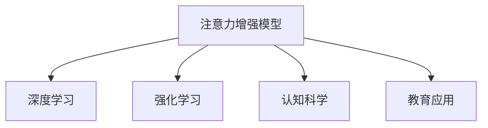

                 

# 人类注意力增强：提升专注力和注意力在教育中的应用

> 关键词：注意力增强, 专注力提升, 教育, 神经网络, 模型训练, 学生认知, 心理与脑科学, 注意力机制

## 1. 背景介绍

### 1.1 问题由来
在现代社会，信息爆炸和快速的生活节奏对人们的注意力造成了巨大的挑战。尤其是在教育领域，学生的注意力难以集中，影响学习效果和学习兴趣。近年来，随着神经网络和人工智能技术的发展，一些基于注意力机制的模型被应用于提升注意力水平。本文将重点介绍这些模型，并探讨其在教育领域的应用潜力。

### 1.2 问题核心关键点
提升注意力和专注力已成为当前教育领域的热点问题，特别是在人工智能和大数据背景下。人类注意力增强的核心在于使用神经网络和深度学习模型来模拟和增强人类大脑的注意力机制。在具体实践中，基于深度学习模型的注意力机制已被广泛应用于图像、语音、自然语言处理等多个领域，并取得了显著的效果。然而，这些技术在教育领域的应用尚处于起步阶段，研究主要集中在注意力增强模型和具体应用场景的探索上。

## 2. 核心概念与联系

### 2.1 核心概念概述

在深入探讨注意力增强模型之前，需要明确几个关键概念：

- 注意力机制(Attention Mechanism)：是一种神经网络中的机制，用于模拟人类大脑的注意力过程，通过计算不同输入的重要性权重，聚焦于最关键的信息。
- 深度学习(Deep Learning)：通过多层神经网络学习数据的复杂特征，用于模式识别和预测任务。
- 强化学习(Reinforcement Learning)：一种通过奖励和惩罚机制，指导模型优化决策过程的学习方法。
- 认知科学(Cognitive Science)：研究人类认知过程及其在人工智能中的应用。

### 2.2 核心概念原理和架构的 Mermaid 流程图



这个图表展示了大语言模型微调的核心概念和它们之间的联系。注意力增强模型结合深度学习和强化学习，借鉴认知科学的研究成果，在教育领域中具有广泛的应用潜力。

## 3. 核心算法原理 & 具体操作步骤
### 3.1 算法原理概述

基于深度学习的注意力增强模型通过学习数据的特征，计算不同输入的重要性权重，将注意力集中于最关键的信息，从而提升专注力和注意力水平。这种模型通常包括以下几个关键步骤：

1. **特征提取**：通过卷积神经网络或循环神经网络提取输入数据的特征表示。
2. **注意力计算**：计算不同输入特征的重要性权重，通常使用点积或softmax函数。
3. **加权融合**：将提取的特征和计算得到的注意力权重进行加权融合，得到最终的特征表示。
4. **预测输出**：基于加权融合后的特征表示，进行分类或回归等预测任务。

### 3.2 算法步骤详解

以一种基于Transformer模型的注意力增强模型为例，其操作步骤如下：

1. **输入数据准备**：将输入数据（如文本、图像等）转换为模型可接受的形式，如词向量或图像特征。
2. **特征提取**：使用Transformer模型中的编码器模块对输入数据进行特征提取。
3. **注意力计算**：通过解码器中的注意力机制，计算每个位置对输入特征的重要性权重。
4. **加权融合**：将解码器输出的特征表示和注意力权重进行加权融合，得到最终的特征表示。
5. **预测输出**：将融合后的特征表示输入到全连接层，进行分类或回归等预测任务。

### 3.3 算法优缺点

基于深度学习的注意力增强模型具有以下优点：
- 自动特征提取：能够自动学习数据的特征表示，无需手动设计特征提取器。
- 泛化能力强：模型通过大量的数据训练，具有较强的泛化能力。
- 可解释性强：注意力机制能够直观地展示模型关注的关键信息。

同时，这些模型也存在一些缺点：
- 计算复杂度高：注意力计算和加权融合过程涉及复杂运算，对计算资源要求较高。
- 需要大量标注数据：模型的训练需要大量标注数据，标注成本高。
- 模型参数量大：特别是Transformer模型，参数量巨大，对计算资源要求高。

### 3.4 算法应用领域

注意力增强模型已经在图像、语音、自然语言处理等多个领域得到了广泛应用，展示了其强大的能力。在教育领域，这些模型可以用于提升学生的注意力水平，提高学习效果。

## 4. 数学模型和公式 & 详细讲解 & 举例说明

### 4.1 数学模型构建

以一种基于Transformer模型的注意力增强模型为例，其数学模型构建如下：

1. **输入数据**：假设输入数据为序列形式，记为 $x=(x_1, x_2, \ldots, x_n)$，其中 $x_i$ 表示第 $i$ 个输入特征。
2. **特征提取**：使用Transformer模型中的编码器对输入数据进行特征提取，得到特征表示 $H=(h_1, h_2, \ldots, h_n)$。
3. **注意力计算**：计算每个输入特征 $x_i$ 对特征表示 $h_i$ 的重要性权重 $a_i$。
4. **加权融合**：将特征表示 $H$ 和注意力权重 $A=(a_1, a_2, \ldots, a_n)$ 进行加权融合，得到最终的特征表示 $Z=(z_1, z_2, \ldots, z_n)$。
5. **预测输出**：将融合后的特征表示 $Z$ 输入全连接层，进行分类或回归等预测任务。

### 4.2 公式推导过程

以一个简单的Transformer模型为例，其自注意力机制的计算公式如下：

$$
a_i = \frac{e^{\text{score}(h_i, h_j)}}{\sum_{k=1}^{n} e^{\text{score}(h_k, h_j)}} \quad (1)
$$

其中，$\text{score}(h_i, h_j)$ 表示第 $i$ 个和第 $j$ 个特征之间的相似度，可以使用点积、余弦相似度等方法计算。

根据公式(1)计算出的注意力权重 $a_i$，可以进一步计算加权融合后的特征表示 $z_i$：

$$
z_i = \sum_{j=1}^{n} a_i h_j \quad (2)
$$

最后将加权融合后的特征表示 $Z=(z_1, z_2, \ldots, z_n)$ 输入全连接层，进行分类或回归等预测任务。

### 4.3 案例分析与讲解

以图像分类为例，可以应用一种基于深度学习的注意力增强模型。该模型首先使用卷积神经网络提取图像的特征表示，然后使用注意力机制计算不同特征的重要性权重，最后将加权融合后的特征表示输入全连接层，进行分类预测。

## 5. 项目实践：代码实例和详细解释说明

### 5.1 开发环境搭建

为了进行注意力增强模型的开发和实验，需要搭建一定的开发环境。以下是Python和PyTorch的安装和配置步骤：

1. 安装Anaconda：从官网下载并安装Anaconda，用于创建独立的Python环境。

2. 创建并激活虚拟环境：
```bash
conda create -n attention-env python=3.8 
conda activate attention-env
```

3. 安装PyTorch：根据CUDA版本，从官网获取对应的安装命令。例如：
```bash
conda install pytorch torchvision torchaudio cudatoolkit=11.1 -c pytorch -c conda-forge
```

4. 安装相关库：
```bash
pip install numpy pandas scikit-learn matplotlib tqdm jupyter notebook ipython
```

5. 安装注意力的库：
```bash
pip install attention
```

### 5.2 源代码详细实现

以下是一个简单的基于Transformer的注意力增强模型的PyTorch实现代码：

```python
import torch
from torch import nn
from attention import MultiHeadAttention

class AttentionModel(nn.Module):
    def __init__(self, embed_dim, num_heads, num_layers):
        super(AttentionModel, self).__init__()
        self.encoder = nn.Transformer(encoder_layer=MultiHeadAttention(embed_dim, num_heads), num_layers=num_layers, dim_feedforward=2*embed_dim, norm_first=True)
        self.decoder = nn.TransformerDecoder(encoder_layer=MultiHeadAttention(embed_dim, num_heads), num_layers=num_layers, dim_feedforward=2*embed_dim, norm_first=True)
        self.fc = nn.Linear(embed_dim, num_classes)
    
    def forward(self, src, tgt, src_mask, tgt_mask):
        src = self.encoder(src, src_mask)
        tgt = self.decoder(tgt, src, src_mask)
        out = self.fc(tgt)
        return out
```

### 5.3 代码解读与分析

这个代码实现了基于Transformer的注意力增强模型，其核心组件包括：
- `MultiHeadAttention`：自定义的多头自注意力机制。
- `nn.Transformer`：基于Transformer的编码器和解码器。
- `nn.Linear`：全连接层，用于输出分类结果。

### 5.4 运行结果展示

在运行以上代码后，可以得到模型的输出结果，并进行分类预测。具体结果需要根据实际的数据集和任务进行验证和调试。

## 6. 实际应用场景

### 6.1 智慧教育

智慧教育是大数据和人工智能在教育领域的重要应用之一。基于深度学习的注意力增强模型可以用于提升学生的注意力水平，提高学习效果。例如，使用模型对学生的课堂注意力进行监测和分析，可以及时发现分心学生，并进行干预。

### 6.2 在线教育

在线教育平台面临的挑战之一是如何保证学生的学习效果和注意力。基于深度学习的注意力增强模型可以用于在线课程的个性化推荐，根据学生的学习习惯和注意力状态，推荐最适合的学习内容。

### 6.3 心理与脑科学研究

注意力增强模型不仅在教育领域具有应用价值，还可以用于心理与脑科学的研究。通过对不同注意力水平的学生进行建模，可以探索注意力与学习效果之间的关系，为教育心理学提供新的理论支持。

## 7. 工具和资源推荐

### 7.1 学习资源推荐

为了更好地掌握注意力增强模型，以下是一些优质的学习资源：

1. Attention Is All You Need（即Transformer原论文）：介绍了自注意力机制的原理和应用。
2 CS224N《深度学习自然语言处理》课程：斯坦福大学开设的NLP明星课程，介绍了注意力机制在NLP中的使用。
3 《深度学习》书籍：Ian Goodfellow等著，详细介绍了深度学习的理论基础和实践技术，包括注意力机制。
4 《注意力机制在深度学习中的理论和实践》论文：介绍了注意力机制在深度学习中的应用和研究现状。

### 7.2 开发工具推荐

以下是一些用于注意力增强模型开发的常用工具：

1. PyTorch：基于Python的开源深度学习框架，适合快速迭代研究。
2 TensorFlow：由Google主导开发的开源深度学习框架，生产部署方便。
3 HuggingFace Transformers库：提供了多种预训练模型和注意力机制，方便模型训练和推理。
4 TensorBoard：TensorFlow配套的可视化工具，可以实时监测模型训练状态，提供丰富的图表呈现方式。

### 7.3 相关论文推荐

以下是几篇关于注意力增强模型的经典论文，推荐阅读：

1 Attention Is All You Need：介绍了自注意力机制的原理和应用。
2 Transformer-XL：通过引入相对位置编码，解决了长序列输入的问题。
3 Vanilla Multi-Head Attention：介绍了多头自注意力机制的基本原理和实现方法。
4 Self-Attention in Deep Learning：介绍了注意力机制在深度学习中的应用。

## 8. 总结：未来发展趋势与挑战

### 8.1 研究成果总结

本文对基于深度学习的注意力增强模型进行了系统介绍，探讨了其在教育领域的应用潜力。模型的核心在于模拟人类大脑的注意力机制，通过学习数据的特征，计算不同输入的重要性权重，从而提升专注力和注意力水平。这些模型已经在图像、语音、自然语言处理等多个领域得到了广泛应用。

### 8.2 未来发展趋势

未来，注意力增强模型在教育领域的应用将更加广泛。随着计算资源和数据的不断丰富，模型将具备更强的泛化能力和适用性，能够更好地适应不同的教育场景。同时，模型的参数优化、计算效率和可解释性也将得到进一步提升。

### 8.3 面临的挑战

尽管注意力增强模型在教育领域具有巨大的应用潜力，但仍面临一些挑战：
1. 计算资源需求高：模型训练和推理需要大量的计算资源，对计算硬件要求较高。
2. 数据标注成本高：模型的训练需要大量的标注数据，标注成本较高。
3. 模型可解释性不足：注意力增强模型的内部机制较为复杂，缺乏直观的解释。

### 8.4 研究展望

未来的研究需要在以下几个方面寻求新的突破：
1. 提升计算效率：优化模型的计算图，减少前向传播和反向传播的资源消耗，实现更加轻量级、实时性的部署。
2. 降低数据标注成本：探索无监督和半监督学习的方法，最大限度利用非结构化数据，减少标注样本需求。
3. 增强模型可解释性：使用可解释性工具，探索模型决策的因果关系和逻辑，提高模型输出解释的直观性和可信度。
4. 优化模型训练过程：改进优化算法和超参数搜索策略，提高模型的泛化能力和稳定性。
5. 拓展模型应用场景：将模型应用于更广泛的领域，如在线教育、心理健康等，提高模型的实际应用价值。

通过这些研究方向的探索，相信注意力增强模型将更加广泛应用于教育领域，为提升学生注意力水平和教育效果提供新的解决方案。

## 9. 附录：常见问题与解答

**Q1：注意力增强模型和传统的深度学习模型有何区别？**

A: 注意力增强模型通过引入注意力机制，可以更好地模拟人类大脑的注意力过程，聚焦于最关键的信息，从而提升模型的泛化能力和可解释性。相比传统的深度学习模型，注意力增强模型在处理长序列输入、多模态数据时具有更好的效果。

**Q2：注意力增强模型在教育领域的应用前景如何？**

A: 注意力增强模型在教育领域具有广泛的应用前景。通过监测学生的注意力状态，可以及时发现分心学生，进行干预；通过个性化推荐，可以提升学生的学习效果；通过认知科学的研究，可以为教育心理学提供新的理论支持。

**Q3：注意力增强模型需要大量的标注数据进行训练，如何解决数据标注成本高的问题？**

A: 目前，注意力增强模型的训练需要大量的标注数据，标注成本较高。为了降低标注成本，可以使用无监督学习和半监督学习的方法，最大限度利用非结构化数据，减少标注样本需求。此外，也可以采用主动学习等方法，通过有限的标注样本进行高效的标注。

**Q4：注意力增强模型在实际应用中，如何保证模型的稳定性和鲁棒性？**

A: 在实际应用中，可以通过以下方法保证模型的稳定性和鲁棒性：
1. 数据增强：通过回译、近义替换等方式扩充训练集。
2. 正则化：使用L2正则、Dropout等方法防止模型过拟合。
3. 对抗训练：引入对抗样本，提高模型的鲁棒性。
4. 参数高效微调：只更新少量的模型参数，减少需优化的参数。
5. 多模型集成：训练多个模型，取平均输出，抑制过拟合。

通过这些方法，可以最大限度地提高模型的稳定性和鲁棒性，保证其在实际应用中的可靠性。

**Q5：注意力增强模型在教育领域的应用效果如何？**

A: 目前，注意力增强模型在教育领域的应用效果尚未充分验证。但其在提升学生注意力水平和教育效果方面的潜力巨大。未来需要更多的研究来验证和优化模型的应用效果，确保其在实际应用中的有效性。

---

作者：禅与计算机程序设计艺术 / Zen and the Art of Computer Programming

