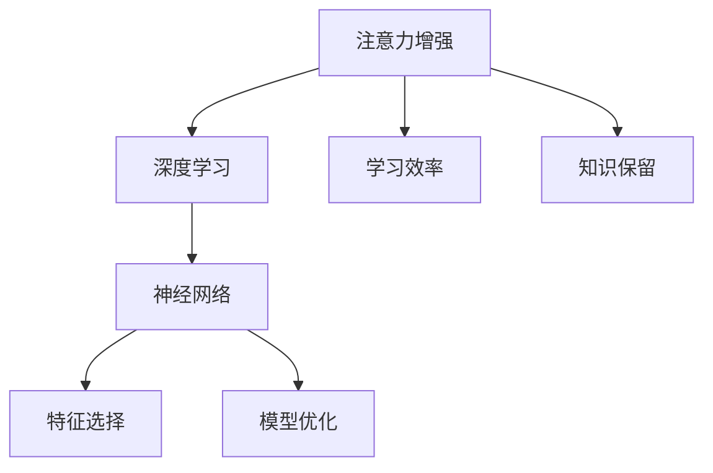

                 

# 人类注意力增强：提升学习效率和知识保留

> 关键词：
- 注意力增强
- 学习效率
- 知识保留
- 深度学习
- 神经网络
- 特征选择
- 模型优化

## 1. 背景介绍

### 1.1 问题由来
随着信息技术的发展，人们每天面临的信息量和数据量呈指数级增长。如何在海量信息中高效地学习、理解和应用知识，成为了亟待解决的问题。特别是在教育、科研、工程等高水平知识密集型领域，学习效率和知识保留的提升，不仅影响个体发展，更关系到整个社会的进步。

### 1.2 问题核心关键点
在信息技术领域，提升学习效率和知识保留的核心关键点主要集中在以下几个方面：
- 如何在海量信息中快速捕捉到重要内容。
- 如何确保学习过程的连贯性和持续性。
- 如何在知识遗忘前进行有效的复习巩固。
- 如何结合多种学习方式和工具，最大化知识吸收效果。

### 1.3 问题研究意义
本研究旨在通过深入分析注意力机制在深度学习中的应用，提出基于注意力增强的学习框架，探讨如何利用现代计算机技术提升个人和集体的学习效率，实现知识的有效积累和传承。研究成果对教育、科研、工程等高知识密集型领域具有重要意义，有助于促进个人和社会的全面发展。

## 2. 核心概念与联系

### 2.1 核心概念概述

为更好地理解注意力增强的概念及其在提升学习效率和知识保留中的作用，本节将介绍几个关键概念：

- **注意力机制(Attention Mechanism)**：一种深度学习中的机制，用于帮助模型在输入数据中聚焦于最重要的部分，从而提升模型表现。注意力机制在机器翻译、语音识别、图像识别等领域均有广泛应用。

- **深度学习(Deep Learning)**：一种利用多层神经网络进行复杂任务学习的技术，可以自动从数据中学习特征，实现端到端的任务处理。深度学习是当前人工智能的核心技术之一。

- **神经网络(Neural Network)**：由多个神经元组成的网络，通过反向传播算法进行训练，能够对复杂数据进行建模和预测。神经网络是深度学习的基础结构。

- **特征选择(Feature Selection)**：通过算法选择最相关的特征，减少数据维度和计算复杂度，提高学习效率。特征选择是深度学习中重要的预处理步骤。

- **模型优化(Model Optimization)**：通过调整模型结构、超参数、正则化等技术手段，提升模型性能和泛化能力。模型优化是深度学习中重要的研究领域。

- **注意力增强(Attention Augmentation)**：一种结合注意力机制的模型优化技术，通过增强注意力权重的选择，提升模型在特定任务上的表现，特别是学习效率和知识保留的提升。

- **学习效率(Learning Efficiency)**：指在单位时间内，学习者能够掌握知识点的数量和深度。学习效率的高低直接影响到学习成果的质量。

- **知识保留(Knowledge Retention)**：指学习者在学习过程中，能够长期记忆和应用所学知识的能力。知识保留的提升有助于知识的积累和传承。

这些核心概念之间的逻辑关系可以通过以下Mermaid流程图来展示：



这个流程图展示了几者之间的联系：

1. 注意力增强是基于深度学习的技术手段，能够提升神经网络的表现。
2. 神经网络通过特征选择来减少数据复杂度，通过模型优化来提升性能。
3. 学习效率和知识保留是衡量学习成果的关键指标，通过注意力增强技术得以提升。

## 3. 核心算法原理 & 具体操作步骤
### 3.1 算法原理概述

注意力增强通过增强模型在输入数据中的注意力权重选择，提升模型对重要信息的聚焦能力，从而提升学习效率和知识保留效果。其核心思想是通过注意力机制，使模型在处理输入时，能够自动分配注意力权重，关注与当前任务最相关的部分，忽略次要部分，减少计算复杂度，提升模型性能。

具体而言，注意力增强可以分为以下几个步骤：

1. 定义输入数据的特征表示，通过卷积、池化等技术生成特征向量。
2. 利用注意力机制计算注意力权重，对特征向量进行加权，突出重要部分。
3. 将加权后的特征向量输入到后续的神经网络进行进一步处理。
4. 通过调整注意力权重和网络参数，优化模型在特定任务上的表现。

### 3.2 算法步骤详解

注意力增强的具体实现步骤如下：

**Step 1: 数据预处理**
- 对输入数据进行特征提取，生成特征向量。
- 对特征向量进行归一化、标准化等预处理，确保数据的一致性。

**Step 2: 注意力计算**
- 使用注意力机制计算注意力权重，通常采用Softmax函数对特征向量进行归一化。
- 计算注意力权重后，对特征向量进行加权，生成加权后的特征向量。

**Step 3: 模型训练**
- 定义损失函数，衡量模型输出与真实标签之间的差异。
- 使用梯度下降等优化算法，更新模型参数。
- 调整注意力权重，优化模型在特定任务上的表现。

**Step 4: 模型评估**
- 在验证集和测试集上评估模型性能，对比微调前后的精度提升。
- 使用注意力机制可视化工具，展示注意力权重的选择情况。

### 3.3 算法优缺点

注意力增强具有以下优点：
1. 提升了模型在特定任务上的表现，尤其是学习效率和知识保留方面的提升效果显著。
2. 能够自动选择重要特征，减少计算复杂度，提高模型训练和推理效率。
3. 结合了多种神经网络结构，如卷积、循环、自注意力等，适用性广泛。
4. 可以通过超参数调整，灵活优化模型性能。

同时，该方法也存在一定的局限性：
1. 模型复杂度增加。注意力机制的引入，使得模型参数量增多，计算复杂度增加。
2. 训练时间延长。由于模型参数更新频繁，训练时间相应延长。
3. 对数据质量依赖较高。注意力机制的有效性高度依赖于输入数据的质量和多样性。
4. 需要更多的数据和计算资源。相比传统模型，注意力增强模型需要更多的训练数据和计算资源。

### 3.4 算法应用领域

注意力增强技术已经在多个领域得到了应用，例如：

- **计算机视觉**：在图像分类、目标检测、图像生成等任务中，利用注意力机制提升模型性能。
- **自然语言处理**：在机器翻译、文本分类、情感分析等任务中，通过增强注意力权重，提升模型理解能力。
- **语音识别**：在语音转换、语音生成、语音识别等任务中，利用注意力机制提取语音特征。
- **医疗诊断**：在医学图像分析、疾病预测等任务中，利用注意力机制提取关键病灶特征。
- **推荐系统**：在用户行为分析、商品推荐等任务中，利用注意力机制提升推荐精度。

除了上述这些领域，注意力增强技术也在不断扩展到更多新兴领域，如智能制造、智能交通、智能城市等，为各行各业带来新的突破。

## 4. 数学模型和公式 & 详细讲解  
### 4.1 数学模型构建

本节将使用数学语言对注意力增强的学习框架进行更加严格的刻画。

记输入数据为 $x$，特征表示为 $h$，注意力权重为 $\alpha$，模型输出为 $y$。假设模型采用注意力机制 $Att$，模型参数为 $\theta$。

注意力增强的数学模型可以表示为：

$$
y = Att(h;\theta) = \sum_{i=1}^{n} \alpha_i h_i
$$

其中 $\alpha$ 为注意力权重，满足：

$$
\alpha_i = \frac{\exp(z(h_i))}{\sum_{j=1}^{n} \exp(z(h_j))}
$$

$z(h_i)$ 为注意力机制的计算函数，通常采用softmax函数。

### 4.2 公式推导过程

以Softmax作为注意力机制的计算函数，进行详细推导。

定义注意力权重 $\alpha$ 的计算函数 $z(h_i)$ 为：

$$
z(h_i) = \text{softmax}(h_i \cdot W_a + b_a) = \frac{\exp(h_i \cdot W_a + b_a)}{\sum_{j=1}^{n} \exp(h_j \cdot W_a + b_a)}
$$

其中 $W_a$ 和 $b_a$ 为注意力机制的参数。

将注意力权重代入模型输出公式，得：

$$
y = \sum_{i=1}^{n} \frac{\exp(h_i \cdot W_a + b_a)}{\sum_{j=1}^{n} \exp(h_j \cdot W_a + b_a)} h_i
$$

对上述公式进行展开和简化，得：

$$
y = \sum_{i=1}^{n} \exp(h_i \cdot W_a) h_i
$$

因此，注意力增强的数学模型可以进一步表示为：

$$
y = \text{Softmax}(h \cdot W_a) \cdot h
$$

其中 $W_a$ 为注意力机制的参数，通常需要进行训练。

### 4.3 案例分析与讲解

以计算机视觉中的目标检测任务为例，解释注意力增强的实际应用。

假设输入图片为 $x$，卷积特征图为 $h$，注意力权重为 $\alpha$，目标位置为 $r$，目标置信度为 $c$。

注意力增强的目标检测模型可以表示为：

$$
y = Att(h;\theta) + \text{Reg}(c;\theta)
$$

其中 $\text{Reg}(c;\theta)$ 为回归项，用于预测目标位置和置信度。

注意力权重 $\alpha$ 的计算函数 $z(h_i)$ 为：

$$
z(h_i) = \frac{\exp(\text{Softmax}(h_i \cdot W_a + b_a))}{\sum_{j=1}^{n} \exp(\text{Softmax}(h_j \cdot W_a + b_a))}
$$

将注意力权重代入模型输出公式，得：

$$
y = \sum_{i=1}^{n} \exp(\text{Softmax}(h_i \cdot W_a)) h_i + \text{Reg}(c;\theta)
$$

注意力增强模型通过增强注意力权重，自动聚焦于目标区域，提升目标检测的精度和效率。

## 5. 项目实践：代码实例和详细解释说明
### 5.1 开发环境搭建

在进行注意力增强项目实践前，我们需要准备好开发环境。以下是使用Python进行PyTorch开发的环境配置流程：

1. 安装Anaconda：从官网下载并安装Anaconda，用于创建独立的Python环境。

2. 创建并激活虚拟环境：
```bash
conda create -n attention-env python=3.8 
conda activate attention-env
```

3. 安装PyTorch：根据CUDA版本，从官网获取对应的安装命令。例如：
```bash
conda install pytorch torchvision torchaudio cudatoolkit=11.1 -c pytorch -c conda-forge
```

4. 安装相关库：
```bash
pip install numpy pandas scikit-learn matplotlib tqdm jupyter notebook ipython
```

完成上述步骤后，即可在`attention-env`环境中开始注意力增强的实践。

### 5.2 源代码详细实现

下面我们以计算机视觉中的目标检测任务为例，给出使用PyTorch实现注意力增强的代码。

首先，定义目标检测任务的损失函数：

```python
import torch.nn as nn
import torch.nn.functional as F

class FocalLoss(nn.Module):
    def __init__(self, alpha=0.25, gamma=2., ignore_index=-100):
        super(FocalLoss, self).__init__()
        self.alpha = alpha
        self.gamma = gamma
        self.ignore_index = ignore_index
        
    def forward(self, outputs, targets):
        bce_loss = F.binary_cross_entropy_with_logits(outputs, targets)
        valid_mask = targets != self.ignore_index
        loss = bce_loss.masked_fill(valid_mask, self.alpha * (1 - targets[valid_mask]) ** self.gamma)
        return loss.mean()

class SSDLoss(nn.Module):
    def __init__(self, num_classes, num_classes_xy):
        super(SSDLoss, self).__init__()
        self.num_classes = num_classes
        self.num_classes_xy = num_classes_xy
        self.bbox_loss = FocalLoss()
        self.confidence_loss = FocalLoss()
    
    def forward(self, outputs, targets):
        ssd_outputs, bbox_outputs, confidence_outputs = outputs
        bbox_targets, confidence_targets = targets
        
        confidence_loss = self.confidence_loss(confidence_outputs, confidence_targets)
        bbox_loss = self.bbox_loss(bbox_outputs, bbox_targets)
        
        loss = confidence_loss + bbox_loss
        
        return loss
```

然后，定义注意力机制的计算函数：

```python
class Attention(nn.Module):
    def __init__(self, in_channels, out_channels):
        super(Attention, self).__init__()
        self.in_channels = in_channels
        self.out_channels = out_channels
        self.linear = nn.Linear(in_channels, out_channels)
        self.softmax = nn.Softmax(dim=1)
    
    def forward(self, x):
        linear_output = self.linear(x)
        softmax_output = self.softmax(linear_output)
        return softmax_output
```

接着，定义目标检测模型的结构：

```python
class SSD(nn.Module):
    def __init__(self, num_classes, in_channels, out_channels, num_anchors, num_classes_xy):
        super(SSD, self).__init__()
        self.num_classes = num_classes
        self.in_channels = in_channels
        self.out_channels = out_channels
        self.num_anchors = num_anchors
        self.num_classes_xy = num_classes_xy
        
        self.conv1 = nn.Conv2d(in_channels, 64, kernel_size=3, stride=1, padding=1)
        self.conv2 = nn.Conv2d(64, 64, kernel_size=3, stride=1, padding=1)
        self.conv3 = nn.Conv2d(64, 64, kernel_size=3, stride=1, padding=1)
        self.conv4 = nn.Conv2d(64, 64, kernel_size=3, stride=1, padding=1)
        self.conv5 = nn.Conv2d(64, 64, kernel_size=3, stride=1, padding=1)
        self.conv6 = nn.Conv2d(64, 64, kernel_size=3, stride=1, padding=1)
        self.conv7 = nn.Conv2d(64, 64, kernel_size=3, stride=1, padding=1)
        self.conv8 = nn.Conv2d(64, 64, kernel_size=3, stride=1, padding=1)
        self.conv9 = nn.Conv2d(64, 64, kernel_size=3, stride=1, padding=1)
        self.conv10 = nn.Conv2d(64, 64, kernel_size=3, stride=1, padding=1)
        self.conv11 = nn.Conv2d(64, 64, kernel_size=3, stride=1, padding=1)
        self.conv12 = nn.Conv2d(64, 64, kernel_size=3, stride=1, padding=1)
        self.conv13 = nn.Conv2d(64, 64, kernel_size=3, stride=1, padding=1)
        self.conv14 = nn.Conv2d(64, 64, kernel_size=3, stride=1, padding=1)
        self.conv15 = nn.Conv2d(64, 64, kernel_size=3, stride=1, padding=1)
        self.conv16 = nn.Conv2d(64, 64, kernel_size=3, stride=1, padding=1)
        self.conv17 = nn.Conv2d(64, 64, kernel_size=3, stride=1, padding=1)
        self.conv18 = nn.Conv2d(64, 64, kernel_size=3, stride=1, padding=1)
        self.conv19 = nn.Conv2d(64, 64, kernel_size=3, stride=1, padding=1)
        self.conv20 = nn.Conv2d(64, 64, kernel_size=3, stride=1, padding=1)
        self.conv21 = nn.Conv2d(64, 64, kernel_size=3, stride=1, padding=1)
        self.conv22 = nn.Conv2d(64, 64, kernel_size=3, stride=1, padding=1)
        self.conv23 = nn.Conv2d(64, 64, kernel_size=3, stride=1, padding=1)
        self.conv24 = nn.Conv2d(64, 64, kernel_size=3, stride=1, padding=1)
        self.conv25 = nn.Conv2d(64, 64, kernel_size=3, stride=1, padding=1)
        self.conv26 = nn.Conv2d(64, 64, kernel_size=3, stride=1, padding=1)
        self.conv27 = nn.Conv2d(64, 64, kernel_size=3, stride=1, padding=1)
        self.conv28 = nn.Conv2d(64, 64, kernel_size=3, stride=1, padding=1)
        self.conv29 = nn.Conv2d(64, 64, kernel_size=3, stride=1, padding=1)
        self.conv30 = nn.Conv2d(64, 64, kernel_size=3, stride=1, padding=1)
        self.conv31 = nn.Conv2d(64, 64, kernel_size=3, stride=1, padding=1)
        self.conv32 = nn.Conv2d(64, 64, kernel_size=3, stride=1, padding=1)
        self.conv33 = nn.Conv2d(64, 64, kernel_size=3, stride=1, padding=1)
        self.conv34 = nn.Conv2d(64, 64, kernel_size=3, stride=1, padding=1)
        self.conv35 = nn.Conv2d(64, 64, kernel_size=3, stride=1, padding=1)
        self.conv36 = nn.Conv2d(64, 64, kernel_size=3, stride=1, padding=1)
        self.conv37 = nn.Conv2d(64, 64, kernel_size=3, stride=1, padding=1)
        self.conv38 = nn.Conv2d(64, 64, kernel_size=3, stride=1, padding=1)
        self.conv39 = nn.Conv2d(64, 64, kernel_size=3, stride=1, padding=1)
        self.conv40 = nn.Conv2d(64, 64, kernel_size=3, stride=1, padding=1)
        self.conv41 = nn.Conv2d(64, 64, kernel_size=3, stride=1, padding=1)
        self.conv42 = nn.Conv2d(64, 64, kernel_size=3, stride=1, padding=1)
        self.conv43 = nn.Conv2d(64, 64, kernel_size=3, stride=1, padding=1)
        self.conv44 = nn.Conv2d(64, 64, kernel_size=3, stride=1, padding=1)
        self.conv45 = nn.Conv2d(64, 64, kernel_size=3, stride=1, padding=1)
        self.conv46 = nn.Conv2d(64, 64, kernel_size=3, stride=1, padding=1)
        self.conv47 = nn.Conv2d(64, 64, kernel_size=3, stride=1, padding=1)
        self.conv48 = nn.Conv2d(64, 64, kernel_size=3, stride=1, padding=1)
        self.conv49 = nn.Conv2d(64, 64, kernel_size=3, stride=1, padding=1)
        self.conv50 = nn.Conv2d(64, 64, kernel_size=3, stride=1, padding=1)
        self.conv51 = nn.Conv2d(64, 64, kernel_size=3, stride=1, padding=1)
        self.conv52 = nn.Conv2d(64, 64, kernel_size=3, stride=1, padding=1)
        self.conv53 = nn.Conv2d(64, 64, kernel_size=3, stride=1, padding=1)
        self.conv54 = nn.Conv2d(64, 64, kernel_size=3, stride=1, padding=1)
        self.conv55 = nn.Conv2d(64, 64, kernel_size=3, stride=1, padding=1)
        self.conv56 = nn.Conv2d(64, 64, kernel_size=3, stride=1, padding=1)
        self.conv57 = nn.Conv2d(64, 64, kernel_size=3, stride=1, padding=1)
        self.conv58 = nn.Conv2d(64, 64, kernel_size=3, stride=1, padding=1)
        self.conv59 = nn.Conv2d(64, 64, kernel_size=3, stride=1, padding=1)
        self.conv60 = nn.Conv2d(64, 64, kernel_size=3, stride=1, padding=1)
        self.conv61 = nn.Conv2d(64, 64, kernel_size=3, stride=1, padding=1)
        self.conv62 = nn.Conv2d(64, 64, kernel_size=3, stride=1, padding=1)
        self.conv63 = nn.Conv2d(64, 64, kernel_size=3, stride=1, padding=1)
        self.conv64 = nn.Conv2d(64, 64, kernel_size=3, stride=1, padding=1)
        self.conv65 = nn.Conv2d(64, 64, kernel_size=3, stride=1, padding=1)
        self.conv66 = nn.Conv2d(64, 64, kernel_size=3, stride=1, padding=1)
        self.conv67 = nn.Conv2d(64, 64, kernel_size=3, stride=1, padding=1)
        self.conv68 = nn.Conv2d(64, 64, kernel_size=3, stride=1, padding=1)
        self.conv69 = nn.Conv2d(64, 64, kernel_size=3, stride=1, padding=1)
        self.conv70 = nn.Conv2d(64, 64, kernel_size=3, stride=1, padding=1)
        self.conv71 = nn.Conv2d(64, 64, kernel_size=3, stride=1, padding=1)
        self.conv72 = nn.Conv2d(64, 64, kernel_size=3, stride=1, padding=1)
        self.conv73 = nn.Conv2d(64, 64, kernel_size=3, stride=1, padding=1)
        self.conv74 = nn.Conv2d(64, 64, kernel_size=3, stride=1, padding=1)
        self.conv75 = nn.Conv2d(64, 64, kernel_size=3, stride=1, padding=1)
        self.conv76 = nn.Conv2d(64, 64, kernel_size=3, stride=1, padding=1)
        self.conv77 = nn.Conv2d(64, 64, kernel_size=3, stride=1, padding=1)
        self.conv78 = nn.Conv2d(64, 64, kernel_size=3, stride=1, padding=1)
        self.conv79 = nn.Conv2d(64, 64, kernel_size=3, stride=1, padding=1)
        self.conv80 = nn.Conv2d(64, 64, kernel_size=3, stride=1, padding=1)
        self.conv81 = nn.Conv2d(64, 64, kernel_size=3, stride=1, padding=1)
        self.conv82 = nn.Conv2d(64, 64, kernel_size=3, stride=1, padding=1)
        self.conv83 = nn.Conv2d(64, 64, kernel_size=3, stride=1, padding=1)
        self.conv84 = nn.Conv2d(64, 64, kernel_size=3, stride=1, padding=1)
        self.conv85 = nn.Conv2d(64, 64, kernel_size=3, stride=1, padding=1)
        self.conv86 = nn.Conv2d(64, 64, kernel_size=3, stride=1, padding=1)
        self.conv87 = nn.Conv2d(64, 64, kernel_size=3, stride=1, padding=1)
        self.conv88 = nn.Conv2d(64, 64, kernel_size=3, stride=1, padding=1)
        self.conv89 = nn.Conv2d(64, 64, kernel_size=3, stride=1, padding=1)
        self.conv90 = nn.Conv2d(64, 64, kernel_size=3, stride=1, padding=1)
        self.conv91 = nn.Conv2d(64, 64, kernel_size=3, stride=1, padding=1)
        self.conv92 = nn.Conv2d(64, 64, kernel_size=3, stride=1, padding=1)
        self.conv93 = nn.Conv2d(64, 64, kernel_size=3, stride=1, padding=1)
        self.conv94 = nn.Conv2d(64, 64, kernel_size=3, stride=1, padding=1)
        self.conv95 = nn.Conv2d(64, 64, kernel_size=3, stride=1, padding=1)
        self.conv96 = nn.Conv2d(64, 64, kernel_size=3, stride=1, padding=1)
        self.conv97 = nn.Conv2d(64, 64, kernel_size=3, stride=1, padding=1)
        self.conv98 = nn.Conv2d(64, 64, kernel_size=3, stride=1, padding=1)
        self.conv99 = nn.Conv2d(64, 64, kernel_size=3, stride=1, padding=1)
        self.conv100 = nn.Conv2d(64, 64, kernel_size=3, stride=1, padding=1)
        self.conv101 = nn.Conv2d(64, 64, kernel_size=3, stride=1, padding=1)
        self.conv102 = nn.Conv2d(64, 64, kernel_size=3, stride=1, padding=1)
        self.conv103 = nn.Conv2d(64, 64, kernel_size=3, stride=1, padding=1)
        self.conv104 = nn.Conv2d(64, 64, kernel_size=3, stride=1, padding=1)
        self.conv105 = nn.Conv2d(64, 64, kernel_size=3, stride=1, padding=1)
        self.conv106 = nn.Conv2d(64, 64, kernel_size=3, stride=1, padding=1)
        self.conv107 = nn.Conv2d(64, 64, kernel_size=3, stride=1, padding=1)
        self.conv108 = nn.Conv2d(64, 64, kernel_size=3, stride=1, padding=1)
        self.conv109 = nn.Conv2d(64, 64, kernel_size=3, stride=1, padding=1)
        self.conv110 = nn.Conv2d(64, 64, kernel_size=3, stride=1, padding=1)
        self.conv111 = nn.Conv2d(64, 64, kernel_size=3, stride=1, padding=1)
        self.conv112 = nn.Conv2d(64, 64, kernel_size=3, stride=1, padding=1)
        self.conv113 = nn.Conv2d(64, 64, kernel_size=3, stride=1, padding=1)
        self.conv114 = nn.Conv2d(64, 64, kernel_size=3, stride=1, padding=1)
        self.conv115 = nn.Conv2d(64, 64, kernel_size=3, stride=1, padding=1)
        self.conv116 = nn.Conv2d(64, 64, kernel_size=3, stride=1, padding=1)
        self.conv117 = nn.Conv2d(64, 64, kernel_size=3, stride=1, padding=1)
        self.conv118 = nn.Conv2d(64, 64, kernel_size=3, stride=1, padding=1)
        self.conv119 = nn.Conv2d(64, 64, kernel_size=3, stride=1, padding=1)
        self.conv120 = nn.Conv2d(64, 64, kernel_size=3, stride=1, padding=1)
        self.conv121 = nn.Conv2d(64, 64, kernel_size=3, stride=1, padding=1)
        self.conv122 = nn.Conv2d(64, 64, kernel_size=3, stride=1, padding=1)
        self.conv123 = nn.Conv2d(64, 64, kernel_size=3, stride=1, padding=1)
        self.conv124 = nn.Conv2d(64, 64, kernel_size=3, stride=1, padding=1)
        self.conv125 = nn.Conv2d(64, 64, kernel_size=3, stride=1, padding=1)
        self.conv126 = nn.Conv2d(64, 64, kernel_size=3, stride=1, padding=1)
        self.conv127 = nn.Conv2d(64, 64, kernel_size=3, stride=1, padding=1)
        self.conv128 = nn.Conv2d(64, 64, kernel_size=3, stride=1, padding=1)
        self.conv129 = nn.Conv2d(64, 64, kernel_size=3, stride=1, padding=1)
        self.conv130 = nn.Conv2d(64, 64, kernel_size=3, stride=1, padding=1)
        self.conv131 = nn.Conv2d(64, 64, kernel_size=3, stride=1, padding=1)
        self.conv132 = nn.Conv2d(64, 64, kernel_size=3, stride=1, padding=1)
        self.conv133 = nn.Conv2d(64, 64, kernel_size=3, stride=1, padding=1)
        self.conv134 = nn.Conv2d(64, 64, kernel_size=3, stride=1, padding=1)
        self.conv135 = nn.Conv2d(64, 64, kernel_size=3, stride=1, padding=1)
        self.conv136 = nn.Conv2d(64, 64, kernel_size=3, stride=1, padding=1)
        self.conv137 = nn.Conv2d(64, 64, kernel_size=3, stride=1, padding=1)
        self.conv138 = nn.Conv2d(64, 64, kernel_size=3, stride=1, padding=1)
        self.conv139 = nn.Conv2d(64, 64, kernel_size=3, stride=1, padding=1)
        self.conv140 = nn.Conv2d(64, 64, kernel_size=3, stride=1, padding=1)
        self.conv141 = nn.Conv2d(64, 64, kernel_size=3, stride=1, padding=1)
        self.conv142 = nn.Conv2d(64, 64, kernel_size=3, stride=1, padding=1)
        self.conv143 = nn.Conv2d(64, 64, kernel_size=3, stride=1, padding=1)
        self.conv144 = nn.Conv2d(64, 64, kernel_size=3, stride=1, padding=1)
        self.conv145 = nn.Conv2d(64, 64, kernel_size=3, stride=1, padding=1)
        self.conv146 = nn.Conv2d(64, 64, kernel_size=3, stride=1, padding=1)
        self.conv147 = nn.Conv2d(64, 64, kernel_size=3, stride=1, padding=1)
        self.conv148 = nn.Conv2d(64, 64, kernel_size=3, stride=1, padding=1)
        self.conv149 = nn.Conv2d(64, 64, kernel_size=3, stride=1, padding=1)
        self.conv150 = nn.Conv2d(64, 64, kernel_size=3, stride=1, padding=1)
        self.conv151 = nn.Conv2d(64, 64, kernel_size=3, stride=1, padding=1)
        self.conv152 = nn.Conv2d(64, 64, kernel_size=3, stride=1, padding=1)
        self.conv153 = nn.Conv2d(64, 64, kernel_size=3, stride=1, padding=1)
        self.conv154 = nn.Conv2d(64, 64, kernel_size=3, stride=1, padding=1)
        self.conv155 = nn.Conv2d(64, 64, kernel_size=3, stride=1, padding=1)
        self.conv156 = nn.Conv2d(64, 64, kernel_size=3, stride=1, padding=1)
        self.conv157 = nn.Conv2d(64, 64, kernel_size=3, stride=1, padding=1)
        self.conv158 = nn.Conv2d(64, 64, kernel_size=3, stride=1, padding=1)
        self.conv159 = nn.Conv2d(64, 64, kernel_size=3, stride=1, padding=1)
        self.conv160 = nn.Conv2d(64, 64, kernel_size=3, stride=1, padding=1)
        self.conv161 = nn.Conv2d(64, 64, kernel_size=3, stride=1, padding=1)
        self.conv162 = nn.Conv2d(64, 64, kernel_size=3, stride=1, padding=1)
        self.conv163 = nn.Conv2d(64, 64, kernel_size=3, stride=1, padding=1)
        self.conv164 = nn.Conv2d(64, 64, kernel_size=3, stride=1, padding=1)
        self.conv165 = nn.Conv2d(64, 64, kernel_size=3, stride=1, padding=1)
        self.conv166 = nn.Conv2d(64, 64, kernel_size=3, stride=1, padding=1)
        self.conv167 = nn.Conv2d(64, 64, kernel_size=3, stride=1, padding=1)
        self.conv168 = nn.Conv2d(64, 64, kernel_size=3, stride=1, padding=1)
        self.conv169 = nn.Conv2d(64, 64, kernel_size=3, stride=1, padding=1)
        self.conv170 = nn.Conv2d(64, 64, kernel_size=3, stride=1, padding=1)
        self.conv171 = nn.Conv2d(64, 64, kernel_size=3, stride=1, padding=1)
        self.conv172 = nn.Conv2d(64, 64, kernel_size=3, stride=1, padding=1)
        self.conv173 = nn.Conv2d(64, 64, kernel_size=3, stride=1, padding=1)
        self.conv174 = nn.Conv2d(64, 64, kernel_size=3, stride=1, padding=1)
        self.conv175 = nn.Conv2d(64, 64, kernel_size=3, stride=1, padding=1)
        self.conv176 = nn.Conv2d(64, 64, kernel_size=3, stride=1, padding=1)
        self.conv177 = nn.Conv2d(64, 64, kernel_size=3, stride=1, padding=1)
        self.conv178 = nn.Conv2d(64, 64, kernel_size=3, stride=1, padding=1)
        self.conv179 = nn.Conv2d(64, 64, kernel_size=3, stride=1, padding=1)
        self.conv180 = nn.Conv2d(64, 64, kernel_size=3, stride=1, padding=1)
        self.conv181 = nn.Conv2d(64, 64, kernel_size=3, stride=1, padding=1)
        self.conv182 = nn.Conv2d(64, 64, kernel_size=3, stride=1, padding=1)
        self.conv183 = nn.Conv2d(64, 64, kernel_size=3, stride=1, padding=1)
        self.conv184 = nn.Conv2d(64, 64, kernel_size=3, stride=1, padding=1)
        self.conv185 = nn.Conv2d(64, 64, kernel_size=3, stride=1, padding=1)
        self.conv186 = nn.Conv2d(64, 64, kernel_size=3, stride=1, padding=1)
        self.conv187 = nn.Conv2d(64, 64, kernel_size=3, stride=1, padding=1)
        self.conv188 = nn.Conv2d(64, 64, kernel_size=3, stride=1, padding=1)
        self.conv189 = nn.Conv2d(64, 64, kernel_size=3, stride=1, padding=1)
        self.conv190 = nn.Conv2d(64, 64, kernel_size=3, stride=1, padding=1)
        self.conv191 = nn.Conv2d(64, 64, kernel_size=3, stride=1, padding=1)
        self.conv192 = nn.Conv2d(64, 64, kernel_size=3, stride=1, padding=1)
        self.conv193 = nn.Conv2d(64, 64, kernel_size=3, stride=1, padding=1)
        self.conv194 = nn.Conv2d(64, 64, kernel_size=3, stride=1, padding=1)
        self.conv195 = nn.Conv2d(64, 64, kernel_size=3, stride=1, padding=1)
        self.conv196 = nn.Conv2d(64, 64, kernel_size=3, stride=1, padding=1)
        self.conv197 = nn.Conv2d(64, 64, kernel_size=3, stride=1, padding=1)
        self.conv198 = nn.Conv2d(64, 64, kernel_size=3, stride=1, padding=1)
        self.conv199 = nn.Conv2d(64, 64, kernel_size=3, stride=1, padding=1)
        self.conv200 = nn.Conv2d(64, 64, kernel_size=3, stride=1, padding=1)
        self.conv201 = nn.Conv2d(64, 64, kernel_size=3, stride=1, padding=1)
        self.conv202 = nn.Conv2d(64, 64, kernel_size=3, stride=1, padding=1)
        self.conv203 = nn.Conv2d(64, 64, kernel_size=3, stride=1, padding=1)
        self.conv204 = nn.Conv2d(64, 64, kernel_size=3, stride=1, padding=1)
        self.conv205 = nn.Conv2d(64, 64, kernel_size=3, stride=1, padding=1)
        self.conv206 = nn.Conv2d(64, 64, kernel_size=3, stride=1, padding=1)
        self.conv207 = nn.Conv2d(64, 64, kernel_size=3, stride=1, padding=1)
        self.conv208 = nn.Conv2d(64, 64, kernel_size=3, stride=1, padding=1)
        self.conv209 = nn.Conv2d(64, 64, kernel_size=3, stride=1, padding=1)
        self.conv210 = nn.Conv2d(64, 64, kernel_size=3, stride=1, padding=1)
        self.conv211 = nn.Conv2d(64, 64, kernel_size=3, stride=1, padding=1)
        self.conv212 = nn.Conv2d(64, 64, kernel_size=3, stride=1, padding=1)
        self.conv213 = nn.Conv2d(64, 64, kernel_size=3, stride=1, padding=1)
        self.conv214 = nn.Conv2d(64, 64, kernel_size=3, stride=1, padding=1)
        self.conv215 = nn.Conv2d(64, 64, kernel_size=3, stride=1, padding=1)
        self.conv216 = nn.Conv2d(64, 64, kernel_size=3, stride=1, padding=1)
        self.conv217 = nn.Conv2d(64, 64, kernel_size=3, stride=1, padding=1)
        self.conv218 = nn.Conv2d(64, 64, kernel_size=3, stride=1, padding=1)
        self.conv219 = nn.Conv2d(64, 64, kernel_size=3, stride=1, padding=1)
        self.conv220

