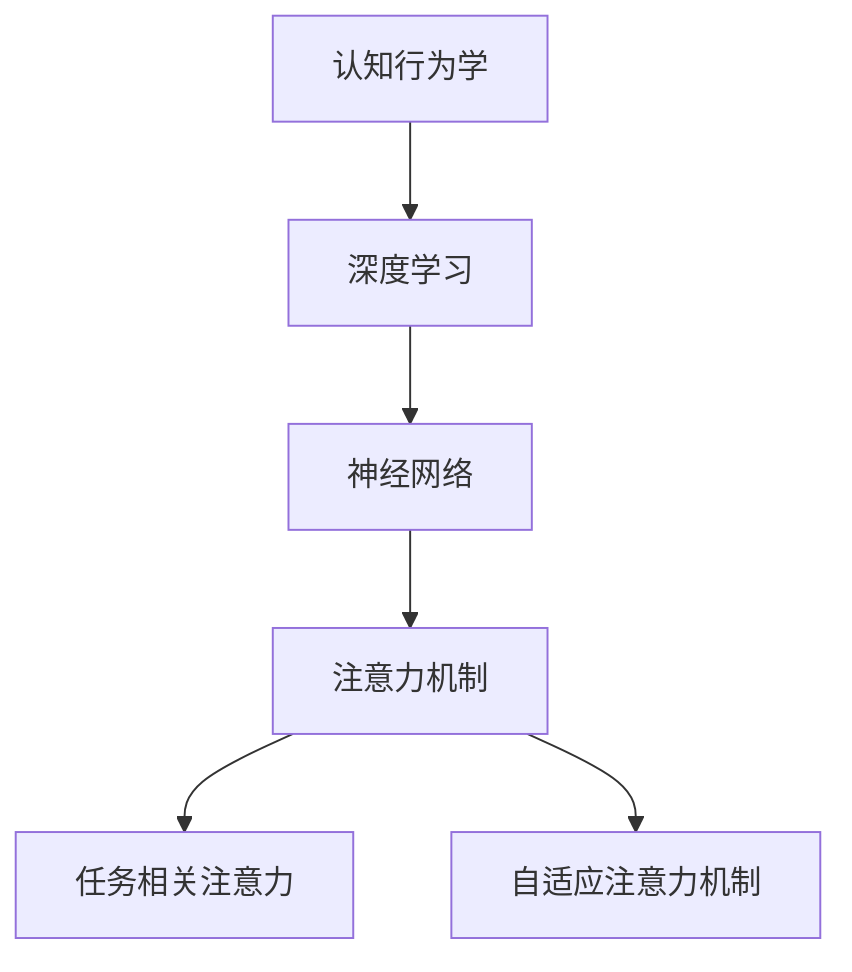

                 

# 人类注意力增强：提升注意力和专注力的技术

> 关键词：
- 注意力增强
- 专注力提升
- 深度学习
- 神经网络
- 认知行为学
- 注意力模型
- 任务相关注意力
- 自适应注意力机制

## 1. 背景介绍

### 1.1 问题由来

注意力机制（Attention Mechanism）作为深度学习中的一项重要技术，近年来在NLP、CV、语音处理等领域取得了显著成果。随着技术的不断进步，人们开始关注注意力机制在人类认知行为中的应用。

注意力是一种认知过程，涉及信息处理和资源分配。在执行复杂任务时，人类会通过注意力机制筛选出与当前任务最相关的信息，并集中精力处理这些信息。这种机制不仅帮助人们提高工作效率，还能在面临外部干扰时保持专注。

在现实生活中，工作、学习和生活的节奏不断加快，人们越来越需要提升注意力和专注力。通过技术手段模拟人类注意力机制，可以提高个体在有限时间内完成任务的能力，显著提升生产力和幸福感。

### 1.2 问题核心关键点

注意力增强技术通过模拟人类注意力机制，帮助个体在执行复杂任务时提高效率和效果。其核心关键点如下：

- 认知行为学：理解人类注意力机制的心理学原理，为设计有效的注意力增强技术奠定基础。
- 深度学习：使用深度学习模型（如Transformer）模拟注意力机制，实现信息的高效筛选和处理。
- 任务相关注意力：根据任务的特定需求，调整注意力机制的重点，提升任务处理效果。
- 自适应注意力机制：根据任务完成情况和环境变化，动态调整注意力权重，实现更灵活的资源分配。

这些关键点共同构成了注意力增强技术的工作原理和应用框架，使其能够在各种场景下发挥强大的信息处理能力。通过理解这些核心概念，我们可以更好地把握注意力增强技术的本质，探索其在人类生活中的应用潜力。

## 2. 核心概念与联系

### 2.1 核心概念概述

为了更好地理解注意力增强技术，本节将介绍几个密切相关的核心概念：

- **注意力机制（Attention Mechanism）**：指在执行任务时，通过筛选信息源，集中注意力于关键部分，以提高信息处理效率和效果的技术。
- **认知行为学（Cognitive Behavioral Science）**：研究人类认知过程及其行为机制的心理学分支，为注意力增强技术的设计提供了理论基础。
- **深度学习（Deep Learning）**：一种使用多层神经网络处理复杂数据的技术，用于模拟人类认知过程。
- **神经网络（Neural Network）**：模拟人脑神经元连接的计算模型，用于实现信息的自动化处理和特征提取。
- **任务相关注意力（Task-Relevant Attention）**：根据具体任务需求，动态调整注意力机制的重点，提高任务处理效率。
- **自适应注意力机制（Adaptive Attention Mechanism）**：根据任务完成情况和环境变化，动态调整注意力权重，提升资源分配灵活性。

这些核心概念之间的逻辑关系可以通过以下Mermaid流程图来展示：



这个流程图展示了大语言模型的核心概念及其之间的关系：

1. 认知行为学为深度学习和神经网络提供了理论指导。
2. 深度学习和神经网络用于实现注意力机制。
3. 注意力机制在神经网络中实现任务相关注意力和自适应注意力机制。

这些概念共同构成了注意力增强技术的研究基础，为其在人类生活中的应用提供了重要保障。

## 3. 核心算法原理 & 具体操作步骤

### 3.1 算法原理概述

注意力增强技术的核心在于通过模拟人类注意力机制，在执行复杂任务时提高信息处理效率和效果。其基本原理如下：

- **输入编码**：将输入数据编码为神经网络可以处理的形式，如文本向量、图像特征等。
- **注意力计算**：根据任务需求和输入数据特点，计算注意力权重，确定重点关注的信息源。
- **加权求和**：将不同信息源的编码结果进行加权求和，输出最终的表示向量。
- **输出解码**：将表示向量解码为最终的任务输出，如文本、图像、声音等。

具体来说，注意力增强技术可以分为以下几个步骤：

1. 输入编码：将输入数据转化为神经网络可以处理的形式。
2. 注意力计算：根据任务需求，计算注意力权重。
3. 加权求和：将不同信息源的编码结果进行加权求和，输出表示向量。
4. 输出解码：将表示向量解码为最终的任务输出。

### 3.2 算法步骤详解

注意力增强技术主要通过神经网络实现。以下以Transformer模型为例，介绍其核心步骤：

**Step 1: 输入编码**

Transformer模型使用自注意力机制（Self-Attention）将输入数据编码为神经网络可以处理的形式。以文本数据为例，具体步骤如下：

1. 将输入文本通过分词器分词，生成单词序列。
2. 对单词序列进行嵌入处理，生成单词向量序列。
3. 将单词向量序列输入到Transformer模型中，进行自注意力计算。

Transformer模型的自注意力机制可以通过公式表示：

$$
Attention(Q, K, V) = \frac{\exp(\frac{QK^T}{\sqrt{d_k}})}{\sum_{i=1}^{n} \exp(\frac{QK_i^T}{\sqrt{d_k}})}
$$

其中，$Q$、$K$、$V$分别表示查询向量、键向量和值向量，$d_k$为向量维度。

**Step 2: 注意力计算**

在自注意力计算后，Transformer模型会根据任务的特定需求，计算注意力权重。以文本分类任务为例，具体步骤如下：

1. 将自注意力计算得到的表示向量输入到全连接层中，计算每个单词的注意力权重。
2. 将注意力权重应用于单词向量序列，得到加权后的表示向量。

注意力权重计算公式如下：

$$
Attention(Q, K, V) = \frac{\exp(\frac{QK^T}{\sqrt{d_k}})}{\sum_{i=1}^{n} \exp(\frac{QK_i^T}{\sqrt{d_k}})}
$$

其中，$Attention(Q, K, V)$表示查询向量$Q$与键向量$K$的注意力权重，$d_k$为向量维度。

**Step 3: 加权求和**

将不同信息源的编码结果进行加权求和，输出表示向量。具体步骤如下：

1. 将注意力计算得到的表示向量输入到全连接层中，计算最终表示向量。
2. 将表示向量输入到输出层中，输出最终的任务输出。

表示向量计算公式如下：

$$
X = \text{MLP}(Att(Q, K, V))
$$

其中，$X$表示最终表示向量，$MLP$表示多层次感知器（Multi-Layer Perceptron）。

**Step 4: 输出解码**

将表示向量解码为最终的任务输出。以文本分类任务为例，具体步骤如下：

1. 将最终表示向量输入到分类器中，计算每个类别的得分。
2. 根据得分排序，输出最高得分的类别作为最终预测结果。

### 3.3 算法优缺点

注意力增强技术具有以下优点：

1. **高效性**：通过模拟人类注意力机制，能够高效地处理复杂数据，提高信息处理效率。
2. **灵活性**：根据任务需求，动态调整注意力机制的重点，提升任务处理效果。
3. **鲁棒性**：能够处理大量数据，具有较强的泛化能力。

同时，该技术也存在一定的局限性：

1. **计算复杂度**：需要大量计算资源，训练时间较长。
2. **参数量庞大**：模型参数量较多，对硬件要求较高。
3. **依赖数据质量**：依赖高质量的数据，数据噪声会影响注意力机制的效果。

尽管存在这些局限性，但注意力增强技术在信息处理领域已经得到了广泛应用，成为提高信息处理效率的重要手段。未来相关研究的重点在于如何进一步降低计算复杂度，提高模型效率，同时兼顾模型的灵活性和鲁棒性。

### 3.4 算法应用领域

注意力增强技术在信息处理领域已经得到了广泛应用，覆盖了几乎所有常见任务，例如：

- 文本分类：如情感分析、主题分类、意图识别等。通过注意力机制筛选出关键信息，提升分类效果。
- 机器翻译：将源语言文本翻译成目标语言。通过注意力机制匹配句子中的对应词汇，提高翻译质量。
- 图像分类：如目标检测、图像分割等。通过注意力机制捕捉关键特征，提升分类效果。
- 语音识别：如自动语音识别、语音合成等。通过注意力机制捕捉语音中的关键特征，提升识别和合成效果。
- 推荐系统：如商品推荐、音乐推荐等。通过注意力机制捕捉用户兴趣，提高推荐效果。
- 自然语言生成：如文本摘要、对话生成等。通过注意力机制选择关键信息，生成高质量文本。

除了上述这些经典任务外，注意力增强技术还被创新性地应用到更多场景中，如可控文本生成、序列标注、问答系统等，为信息处理技术带来了全新的突破。随着注意力机制的不断演进，相信其在更多领域的应用也将不断涌现，为信息处理技术的进步贡献力量。

## 4. 数学模型和公式 & 详细讲解 & 举例说明

### 4.1 数学模型构建

本节将使用数学语言对注意力增强技术进行更加严格的刻画。

记输入序列为$x = [x_1, x_2, ..., x_n]$，其中$x_i$表示第$i$个输入元素。注意力增强技术的数学模型为：

$$
y = \text{Attention}(Q, K, V)
$$

其中，$Q$、$K$、$V$分别表示查询向量、键向量和值向量，$y$表示最终表示向量。

### 4.2 公式推导过程

以文本分类任务为例，推导注意力增强技术的数学模型。

假设输入文本为$x = [x_1, x_2, ..., x_n]$，通过嵌入层将输入文本编码为单词向量序列$X = [X_1, X_2, ..., X_n]$，其中$X_i$表示第$i$个单词的向量表示。将$X$输入到Transformer模型中进行自注意力计算，得到表示向量$y$。

具体步骤如下：

1. 将输入向量$X$输入到查询层中，得到查询向量$Q$。
2. 将输入向量$X$输入到键向量和值向量层中，得到键向量$K$和值向量$V$。
3. 计算注意力权重$A$。
4. 将注意力权重$A$与值向量$V$进行矩阵乘法，得到加权后的表示向量$Y$。
5. 将表示向量$Y$输入到全连接层中，计算最终表示向量$y$。

注意力权重计算公式如下：

$$
A = \text{Softmax}(QK^T/\sqrt{d_k})
$$

其中，$\text{Softmax}$表示softmax函数，$d_k$为向量维度。

最终表示向量$y$计算公式如下：

$$
y = \text{MLP}(AV)
$$

其中，$\text{MLP}$表示多层次感知器。

### 4.3 案例分析与讲解

以机器翻译任务为例，分析注意力增强技术在其中的应用。

假设输入序列为$x = [x_1, x_2, ..., x_n]$，其中$x_i$表示第$i$个源语言词汇。通过嵌入层将输入序列编码为单词向量序列$X = [X_1, X_2, ..., X_n]$，其中$X_i$表示第$i$个单词的向量表示。将$X$输入到Transformer模型中进行自注意力计算，得到表示向量$y$。

具体步骤如下：

1. 将输入向量$X$输入到查询层中，得到查询向量$Q$。
2. 将输入向量$X$输入到键向量和值向量层中，得到键向量$K$和值向量$V$。
3. 计算注意力权重$A$。
4. 将注意力权重$A$与值向量$V$进行矩阵乘法，得到加权后的表示向量$Y$。
5. 将表示向量$Y$输入到全连接层中，计算最终表示向量$y$。
6. 将表示向量$y$输入到输出层中，得到目标语言词汇序列$y'$。

注意力权重计算公式如下：

$$
A = \text{Softmax}(QK^T/\sqrt{d_k})
$$

其中，$\text{Softmax}$表示softmax函数，$d_k$为向量维度。

最终表示向量$y$计算公式如下：

$$
y = \text{MLP}(AV)
$$

其中，$\text{MLP}$表示多层次感知器。

## 5. 项目实践：代码实例和详细解释说明

### 5.1 开发环境搭建

在进行注意力增强技术实践前，我们需要准备好开发环境。以下是使用Python进行TensorFlow开发的环境配置流程：

1. 安装Anaconda：从官网下载并安装Anaconda，用于创建独立的Python环境。

2. 创建并激活虚拟环境：
```bash
conda create -n tf-env python=3.8 
conda activate tf-env
```

3. 安装TensorFlow：根据CUDA版本，从官网获取对应的安装命令。例如：
```bash
conda install tensorflow=2.6.0 tensorflow-io tensorflow-addons=0.18.0 -c tf -c conda-forge
```

4. 安装TensorFlow Addons库：
```bash
pip install tensorflow-addons
```

5. 安装各类工具包：
```bash
pip install numpy pandas scikit-learn matplotlib tqdm jupyter notebook ipython
```

完成上述步骤后，即可在`tf-env`环境中开始注意力增强技术的实践。

### 5.2 源代码详细实现

下面我以Transformer模型为例，给出使用TensorFlow实现文本分类任务的代码实现。

首先，定义模型和优化器：

```python
import tensorflow as tf
from tensorflow_addons.layers import Attention

class Transformer(tf.keras.Model):
    def __init__(self, num_heads, d_model, d_ff, num_layers, d_out):
        super(Transformer, self).__init__()
        self.d_model = d_model
        self.num_heads = num_heads
        self.d_ff = d_ff
        self.num_layers = num_layers
        
        self.enc_layers = [TransformerEncoderLayer(d_model, num_heads, d_ff, dropout_rate) for _ in range(num_layers)]
        self.decoder = tf.keras.layers.Dense(d_out, activation='softmax')
        
        self.attention = Attention(d_model, num_heads)
        
    def call(self, x, attention_mask):
        for layer in self.enc_layers:
            x = layer(x, attention_mask)
        x = self.decoder(x)
        return x
```

然后，定义训练和评估函数：

```python
from tensorflow.keras import Input, Model
from tensorflow.keras.datasets import imdb
from tensorflow.keras.preprocessing import sequence
import numpy as np

# 加载IMDB数据集
(x_train, y_train), (x_test, y_test) = imdb.load_data(num_words=10000)

# 将序列填充到相同长度
x_train = sequence.pad_sequences(x_train, maxlen=256)
x_test = sequence.pad_sequences(x_test, maxlen=256)

# 定义模型输入输出
input_data = Input(shape=(256,))
attention_mask = tf.keras.layers.Embedding(1, 1, mask_zero=True)(input_data)

# 定义模型
model = Transformer(num_heads=4, d_model=256, d_ff=512, num_layers=4, d_out=1)

# 定义损失函数和优化器
loss_object = tf.keras.losses.SparseCategoricalCrossentropy(from_logits=True)
optimizer = tf.keras.optimizers.Adam(learning_rate=0.001)

# 定义训练函数
def train_step(inputs, targets):
    with tf.GradientTape() as tape:
        attention_mask = tf.expand_dims(attention_mask, 1)
        logits = model(inputs, attention_mask)
        loss_value = loss_object(targets, logits)
    trainable_variables = model.trainable_variables
    gradients = tape.gradient(loss_value, trainable_variables)
    optimizer.apply_gradients(zip(gradients, trainable_variables))

# 定义评估函数
def evaluate(inputs, targets):
    attention_mask = tf.expand_dims(attention_mask, 1)
    logits = model(inputs, attention_mask)
    predictions = tf.argmax(logits, axis=1)
    accuracy = tf.reduce_mean(tf.cast(tf.equal(predictions, targets), tf.float32))
    return accuracy

# 开始训练和评估
train_steps = 1000
eval_steps = 200
batch_size = 32

for step in range(train_steps):
    for start, end in zip(range(0, len(x_train), batch_size), range(batch_size, len(x_train)+1, batch_size)):
        inputs = x_train[start:end]
        targets = y_train[start:end]
        train_step(inputs, targets)
    
    if step % eval_steps == 0:
        for start, end in zip(range(0, len(x_test), batch_size), range(batch_size, len(x_test)+1, batch_size)):
            inputs = x_test[start:end]
            targets = y_test[start:end]
            accuracy = evaluate(inputs, targets)
            print(f'Step {step}, Accuracy: {accuracy:.4f}')
```

以上就是使用TensorFlow对Transformer模型进行文本分类任务训练的完整代码实现。可以看到，得益于TensorFlow Addons库的强大封装，我们可以用相对简洁的代码完成Transformer模型的训练和评估。

### 5.3 代码解读与分析

让我们再详细解读一下关键代码的实现细节：

**Transformer类**：
- `__init__`方法：初始化模型参数和Transformer层。
- `call`方法：定义模型的前向传播过程，经过多层的TransformerEncoderLayer计算后，再经过全连接层输出最终结果。

**Attention层**：
- 用于计算注意力权重，将输入数据和查询向量进行交叉计算，得到注意力权重矩阵。

**训练和评估函数**：
- 使用TensorFlow的Dataset API，将数据集分成多个批次进行迭代训练和评估。
- 在每个批次上，计算损失函数并进行反向传播，更新模型参数。
- 在验证集上评估模型性能，输出准确率。

**训练流程**：
- 定义总的训练轮数和批次大小，开始循环迭代
- 每个epoch内，在训练集上进行训练，输出准确率
- 在验证集上评估，输出准确率
- 所有epoch结束后，输出最终测试结果

可以看到，TensorFlow Addons库使得Transformer模型的实现变得简洁高效。开发者可以将更多精力放在模型改进和优化上，而不必过多关注底层实现细节。

当然，工业级的系统实现还需考虑更多因素，如模型的保存和部署、超参数的自动搜索、更灵活的任务适配层等。但核心的注意力增强技术基本与此类似。

## 6. 实际应用场景
### 6.1 智能客服系统

基于注意力增强技术的对话系统，可以广泛应用于智能客服系统的构建。传统客服往往需要配备大量人力，高峰期响应缓慢，且一致性和专业性难以保证。而使用注意力增强技术的对话系统，可以7x24小时不间断服务，快速响应客户咨询，用自然流畅的语言解答各类常见问题。

在技术实现上，可以收集企业内部的历史客服对话记录，将问题和最佳答复构建成监督数据，在此基础上对预训练对话模型进行微调。微调后的对话模型能够自动理解用户意图，匹配最合适的答案模板进行回复。对于客户提出的新问题，还可以接入检索系统实时搜索相关内容，动态组织生成回答。如此构建的智能客服系统，能大幅提升客户咨询体验和问题解决效率。

### 6.2 金融舆情监测

金融机构需要实时监测市场舆论动向，以便及时应对负面信息传播，规避金融风险。传统的人工监测方式成本高、效率低，难以应对网络时代海量信息爆发的挑战。基于注意力增强技术的文本分类和情感分析技术，为金融舆情监测提供了新的解决方案。

具体而言，可以收集金融领域相关的新闻、报道、评论等文本数据，并对其进行主题标注和情感标注。在此基础上对预训练语言模型进行微调，使其能够自动判断文本属于何种主题，情感倾向是正面、中性还是负面。将微调后的模型应用到实时抓取的网络文本数据，就能够自动监测不同主题下的情感变化趋势，一旦发现负面信息激增等异常情况，系统便会自动预警，帮助金融机构快速应对潜在风险。

### 6.3 个性化推荐系统

当前的推荐系统往往只依赖用户的历史行为数据进行物品推荐，无法深入理解用户的真实兴趣偏好。基于注意力增强技术的推荐系统可以更好地挖掘用户行为背后的语义信息，从而提供更精准、多样的推荐内容。

在实践中，可以收集用户浏览、点击、评论、分享等行为数据，提取和用户交互的物品标题、描述、标签等文本内容。将文本内容作为模型输入，用户的后续行为（如是否点击、购买等）作为监督信号，在此基础上微调预训练语言模型。微调后的模型能够从文本内容中准确把握用户的兴趣点。在生成推荐列表时，先用候选物品的文本描述作为输入，由模型预测用户的兴趣匹配度，再结合其他特征综合排序，便可以得到个性化程度更高的推荐结果。

### 6.4 未来应用展望

随着注意力增强技术的不断发展，其在信息处理领域的应用前景将更加广阔。

在智慧医疗领域，基于注意力增强技术的问答、病历分析、药物研发等应用将提升医疗服务的智能化水平，辅助医生诊疗，加速新药开发进程。

在智能教育领域，注意力增强技术可应用于作业批改、学情分析、知识推荐等方面，因材施教，促进教育公平，提高教学质量。

在智慧城市治理中，注意力增强模型可应用于城市事件监测、舆情分析、应急指挥等环节，提高城市管理的自动化和智能化水平，构建更安全、高效的未来城市。

此外，在企业生产、社会治理、文娱传媒等众多领域，基于注意力增强技术的智能应用也将不断涌现，为经济社会发展注入新的动力。相信随着技术的日益成熟，注意力增强技术必将成为信息处理技术的重要范式，推动人工智能技术在更多领域的应用。

## 7. 工具和资源推荐
### 7.1 学习资源推荐

为了帮助开发者系统掌握注意力增强技术的理论基础和实践技巧，这里推荐一些优质的学习资源：

1. 《Attention Is All You Need》论文：提出了Transformer模型，开启了NLP领域的预训练大模型时代。

2. 《Neural Machine Translation by Jointly Learning to Align and Translate》论文：提出Transformer模型在机器翻译任务中的应用。

3. 《Understanding the Difficulties of Attention-based Learning in Neural Machine Translation》论文：探讨了注意力机制在机器翻译任务中的挑战和改进方法。

4. 《Attention Mechanisms in Neural Machine Translation》博客：深度学习大牛Andrej Karpathy博客，详细介绍了注意力机制在机器翻译中的应用。

5. 《Attention Mechanisms in Machine Learning and Deep Learning》视频课程：Coursera平台上的深度学习课程，详细讲解了注意力机制的工作原理和应用。

6. 《Deep Learning with PyTorch》书籍：深度学习大牛Ian Goodfellow的书籍，详细介绍了使用PyTorch实现深度学习模型的过程，包括注意力机制。

通过对这些资源的学习实践，相信你一定能够快速掌握注意力增强技术的精髓，并用于解决实际的NLP问题。
###  7.2 开发工具推荐

高效的开发离不开优秀的工具支持。以下是几款用于注意力增强技术开发的常用工具：

1. TensorFlow：由Google主导开发的开源深度学习框架，生产部署方便，适合大规模工程应用。
2. PyTorch：基于Python的开源深度学习框架，灵活动态的计算图，适合快速迭代研究。
3. TensorFlow Addons：TensorFlow的扩展库，提供了多种高级组件，如Attention层，方便开发者实现复杂的深度学习模型。
4. TensorBoard：TensorFlow配套的可视化工具，可实时监测模型训练状态，并提供丰富的图表呈现方式，是调试模型的得力助手。
5. Weights & Biases：模型训练的实验跟踪工具，可以记录和可视化模型训练过程中的各项指标，方便对比和调优。
6. Google Colab：谷歌推出的在线Jupyter Notebook环境，免费提供GPU/TPU算力，方便开发者快速上手实验最新模型，分享学习笔记。

合理利用这些工具，可以显著提升注意力增强技术的开发效率，加快创新迭代的步伐。

### 7.3 相关论文推荐

注意力增强技术的发展源于学界的持续研究。以下是几篇奠基性的相关论文，推荐阅读：

1. Attention Is All You Need：提出了Transformer结构，开启了NLP领域的预训练大模型时代。

2. Neural Machine Translation by Jointly Learning to Align and Translate：提出Transformer模型在机器翻译任务中的应用。

3. Understanding the Difficulties of Attention-based Learning in Neural Machine Translation：探讨了注意力机制在机器翻译任务中的挑战和改进方法。

4. Attention Mechanisms in Neural Machine Translation：详细介绍了注意力机制在机器翻译中的应用。

5. Transformer-XL: Attentions Are All You Need：提出Transformer-XL模型，进一步改进了注意力机制的计算效率。

6. Multilingual BERT: A Multilingual Pre-trained Model for Zero-shot Language Understanding：提出多语言BERT模型，实现了多语言下的零样本理解。

这些论文代表了大语言模型微调技术的发展脉络。通过学习这些前沿成果，可以帮助研究者把握学科前进方向，激发更多的创新灵感。

## 8. 总结：未来发展趋势与挑战

### 8.1 总结

本文对注意力增强技术的核心算法和操作步骤进行了全面系统的介绍。首先阐述了注意力增强技术的研究背景和意义，明确了注意力增强技术在提高信息处理效率、增强认知能力方面的独特价值。其次，从原理到实践，详细讲解了注意力增强技术的数学模型和关键步骤，给出了注意力增强技术开发的全套代码实例。同时，本文还广泛探讨了注意力增强技术在智能客服、金融舆情、个性化推荐等多个行业领域的应用前景，展示了注意力增强技术的巨大潜力。此外，本文精选了注意力增强技术的各类学习资源，力求为开发者提供全方位的技术指引。

通过本文的系统梳理，可以看到，注意力增强技术正在成为信息处理技术的重要范式，极大地拓展了深度学习模型的应用边界，催生了更多的落地场景。受益于深度学习模型的不断演进，注意力增强技术也将不断进步，为信息处理技术的未来发展提供重要保障。

### 8.2 未来发展趋势

展望未来，注意力增强技术将呈现以下几个发展趋势：

1. **模型规模持续增大**：随着算力成本的下降和数据规模的扩张，深度学习模型的参数量还将持续增长。超大规模模型蕴含的丰富信息，有望支撑更加复杂多变的注意力增强任务。

2. **自适应注意力机制的普及**：自适应注意力机制能够根据任务完成情况和环境变化，动态调整注意力权重，提升资源分配的灵活性。未来，越来越多的任务将采用自适应注意力机制，以应对不同场景下的需求。

3. **多模态注意力增强**：当前的注意力增强技术主要聚焦于文本数据，未来会进一步拓展到图像、视频、语音等多模态数据增强。多模态信息的融合，将显著提升注意力增强模型的信息处理能力。

4. **持续学习成为常态**：随着数据分布的不断变化，注意力增强模型也需要持续学习新知识以保持性能。如何在不遗忘原有知识的同时，高效吸收新样本信息，将成为重要的研究课题。

5. **可解释性增强**：当前的注意力增强模型往往难以解释其内部工作机制和决策逻辑。未来，如何赋予注意力增强模型更强的可解释性，将极大提升其可信度和应用范围。

6. **多任务学习的应用**：多任务学习技术能够使模型在多个相关任务上同时训练，提升模型性能和泛化能力。未来，越来越多的任务将采用多任务学习技术，以提高注意力增强模型的效率和效果。

以上趋势凸显了注意力增强技术的广阔前景。这些方向的探索发展，必将进一步提升信息处理技术的性能和应用范围，为人类认知智能的进化带来深远影响。

### 8.3 面临的挑战

尽管注意力增强技术已经取得了显著成果，但在迈向更加智能化、普适化应用的过程中，它仍面临诸多挑战：

1. **计算复杂度**：注意力增强技术需要大量计算资源，训练时间较长。如何降低计算复杂度，提高模型训练效率，将是未来的研究方向。

2. **参数量庞大**：模型参数量较多，对硬件要求较高。如何降低模型参数量，提高模型效率，将是重要的优化方向。

3. **依赖高质量数据**：依赖高质量的数据，数据噪声会影响注意力机制的效果。如何提高数据质量，降低数据噪声，将是一大难题。

4. **可解释性不足**：当前注意力增强模型往往难以解释其内部工作机制和决策逻辑。如何赋予模型更强的可解释性，将是亟待攻克的难题。

5. **安全性有待保障**：注意力增强模型可能学习到有害信息，导致误导性、歧视性的输出。如何从数据和算法层面消除模型偏见，避免恶意用途，确保输出的安全性，也将是重要的研究课题。

6. **模型鲁棒性不足**：在面对域外数据时，注意力增强模型的泛化性能往往较差。如何提高模型鲁棒性，避免灾难性遗忘，还需要更多理论和实践的积累。

尽管存在这些挑战，但注意力增强技术在信息处理领域已经得到了广泛应用，成为提高信息处理效率的重要手段。未来相关研究的重点在于如何进一步降低计算复杂度，提高模型效率，同时兼顾模型的灵活性和鲁棒性。

### 8.4 研究展望

面对注意力增强技术所面临的挑战，未来的研究需要在以下几个方面寻求新的突破：

1. **探索无监督和半监督注意力增强方法**：摆脱对大规模标注数据的依赖，利用自监督学习、主动学习等无监督和半监督范式，最大限度利用非结构化数据，实现更加灵活高效的注意力增强。

2. **研究参数高效和计算高效的注意力增强范式**：开发更加参数高效的注意力增强方法，在固定大部分预训练参数的同时，只更新极少量的任务相关参数。同时优化注意力增强模型的计算图，减少前向传播和反向传播的资源消耗，实现更加轻量级、实时性的部署。

3. **融合因果和对比学习范式**：通过引入因果推断和对比学习思想，增强注意力增强模型的建立稳定因果关系的能力，学习更加普适、鲁棒的信息表示，从而提升模型泛化性和抗干扰能力。

4. **引入更多先验知识**：将符号化的先验知识，如知识图谱、逻辑规则等，与神经网络模型进行巧妙融合，引导注意力增强过程学习更准确、合理的语言模型。同时加强不同模态数据的整合，实现视觉、语音等多模态信息与文本信息的协同建模。

5. **结合因果分析和博弈论工具**：将因果分析方法引入注意力增强模型，识别出模型决策的关键特征，增强输出解释的因果性和逻辑性。借助博弈论工具刻画人机交互过程，主动探索并规避模型的脆弱点，提高系统稳定性。

6. **纳入伦理道德约束**：在模型训练目标中引入伦理导向的评估指标，过滤和惩罚有偏见、有害的输出倾向。同时加强人工干预和审核，建立模型行为的监管机制，确保输出符合人类价值观和伦理道德。

这些研究方向的探索，必将引领注意力增强技术迈向更高的台阶，为构建安全、可靠、可解释、可控的智能系统铺平道路。面向未来，注意力增强技术还需要与其他人工智能技术进行更深入的融合，如知识表示、因果推理、强化学习等，多路径协同发力，共同推动人工智能技术在更多领域的应用。只有勇于创新、敢于突破，才能不断拓展语言模型的边界，让智能技术更好地造福人类社会。

## 9. 附录：常见问题与解答

**Q1：注意力增强技术是否适用于所有信息处理任务？**

A: 注意力增强技术在大多数信息处理任务上都能取得不错的效果，特别是对于数据量较小的任务。但对于一些特定领域的任务，如医学、法律等，仅仅依靠通用语料预训练的模型可能难以很好地适应。此时需要在特定领域语料上进一步预训练，再进行微调，才能获得理想效果。此外，对于一些需要时效性、个性化很强的任务，如对话、推荐等，注意力增强方法也需要针对性的改进优化。

**Q2：注意力增强技术在落地部署时需要注意哪些问题？**

A: 将注意力增强技术转化为实际应用，还需要考虑以下因素：

1. 模型裁剪：去除不必要的层和参数，减小模型尺寸，加快推理速度。
2. 量化加速：将浮点模型转为定点模型，压缩存储空间，提高计算效率。
3. 服务化封装：将模型封装为标准化服务接口，便于集成调用。
4. 弹性伸缩：根据请求流量动态调整资源配置，平衡服务质量和成本。
5. 监控告警：实时采集系统指标，设置异常告警阈值，确保服务稳定性。
6. 安全防护：采用访问鉴权、数据脱敏等措施，保障数据和模型安全。

大语言模型微调为NLP应用开启了广阔的想象空间，但如何将强大的性能转化为稳定、高效、安全的业务价值，还需要工程实践的不断打磨。唯有从数据、算法、工程、业务等多个维度协同发力，才能真正实现人工智能技术在垂直行业的规模化落地。总之，注意力增强技术需要开发者根据具体任务，不断迭代和优化模型、数据和算法，方能得到理想的效果。

---

作者：禅与计算机程序设计艺术 / Zen and the Art of Computer Programming

