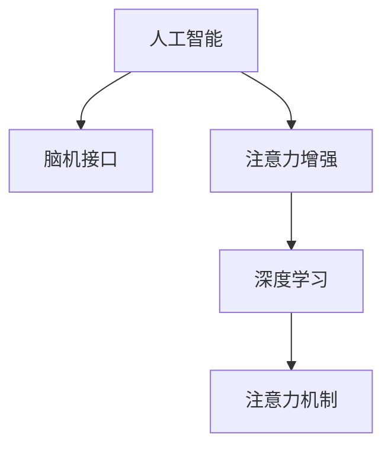

                 

# 人类注意力增强：未来的工作和生活

> 关键词：
    - 人工智能
    - 注意力增强
    - 工作
    - 生活
    - 脑机接口
    - 人机协作
    - 注意力训练

## 1. 背景介绍

### 1.1 问题由来
在现代社会，信息爆炸的时代，人们被大量的数据、信息和任务所包围。如何在海量信息中快速、准确地提取关键信息，成为个人和组织关注的焦点。特别是在工作和生活环境中，如何提升个人的注意力，提高决策效率和工作质量，成为科技行业的一个重要课题。

### 1.2 问题核心关键点
当前，提升注意力的方法主要包括提升物理环境、心理状态和工具支持等。但这些方法存在局限性：物理环境的改善成本较高，心理状态的提升难度大，工具支持的瓶颈在于算力和用户体验。人工智能技术，特别是脑机接口和注意力增强技术，为提升注意力提供了新的可能性。

### 1.3 问题研究意义
研究人类注意力增强技术，对于提高个人效率、改善生活质量、推动脑机接口技术发展，具有重要意义：

1. 提高个人效率：人工智能辅助下的注意力增强，可以使个体在更短的时间内处理更多信息，从而提升工作效率。
2. 改善生活质量：通过注意力增强，可以有效应对生活中的信息过载和决策困难，提升生活质量。
3. 推动脑机接口技术：人类注意力增强技术是脑机接口研究的重要组成部分，可以为该领域提供新的研究方向和技术手段。
4. 人机协作：人工智能和人类注意力的结合，可以提升人机协作水平，推动智能系统的普及应用。
5. 深度学习应用：注意力增强技术的深度学习算法，可以应用于其他领域，如医学影像识别、自动驾驶等。

## 2. 核心概念与联系

### 2.1 核心概念概述

为更好地理解注意力增强技术，本节将介绍几个密切相关的核心概念：

- 人工智能(Artificial Intelligence, AI)：通过计算机模拟人类智能行为，实现各种任务的技术体系。
- 脑机接口(Brain-Machine Interface, BCI)：通过直接连接大脑与计算机的接口，实现人脑与机器的交互。
- 注意力(Anti-Attention)：指个体在认知过程中对特定信息的聚焦和选择能力。
- 注意力增强(Enhanced Attention)：通过技术手段提升个体在处理信息时的注意力水平，从而提高认知效率。
- 深度学习(Deep Learning)：一种基于神经网络的人工智能技术，通过多层次非线性处理数据，学习特征表示。
- 注意力机制(Attention Mechanism)：深度学习中用于处理序列数据、捕捉输入信息重要性的技术。

这些核心概念之间的逻辑关系可以通过以下Mermaid流程图来展示：



这个流程图展示了大语言模型的核心概念及其之间的关系：

1. 人工智能通过多种技术手段模拟人类智能，其中脑机接口是重要的研究方向之一。
2. 脑机接口将人脑信号转化为计算机指令，实现人脑与机器的交互。
3. 注意力增强技术通过提升个体的注意力水平，进一步提高人工智能的认知效率。
4. 深度学习是人工智能实现的核心技术之一，用于提取数据特征。
5. 注意力机制是深度学习中用于捕捉数据重要性的关键技术。

这些概念共同构成了注意力增强技术的理论和应用框架，使其能够在多种场景下发挥重要作用。

## 3. 核心算法原理 & 具体操作步骤
### 3.1 算法原理概述

注意力增强技术基于神经网络模型和深度学习算法，通过提升个体对信息的聚焦和选择能力，来提升认知效率和决策质量。核心算法原理包括：

- 注意力模型的构建：构建基于注意力机制的神经网络模型，用于对输入数据进行重要性的判断和选择。
- 注意力训练的优化：通过深度学习算法，优化模型参数，提升对注意力的预测能力。
- 注意力增强的应用：将训练好的注意力模型应用于各种任务，如信息检索、图像识别、自然语言处理等。

### 3.2 算法步骤详解

注意力增强技术的算法步骤主要包括以下几个关键步骤：

**Step 1: 数据准备**
- 收集与注意力相关的数据，如脑电波信号、眼球运动轨迹、鼠标点击轨迹等。
- 对数据进行预处理，去除噪声和异常值。

**Step 2: 模型构建**
- 根据任务类型，选择合适的神经网络模型结构，如卷积神经网络(CNN)、循环神经网络(RNN)、Transformer等。
- 在模型中加入注意力机制，如Soft Attention、Self-Attention等。
- 设计损失函数，如交叉熵损失、均方误差损失等。

**Step 3: 模型训练**
- 将准备好的数据划分为训练集、验证集和测试集。
- 使用深度学习算法，如梯度下降法、Adam等，优化模型参数。
- 在训练过程中，使用正则化技术，如Dropout、L2正则等，防止过拟合。

**Step 4: 模型评估**
- 在测试集上评估模型性能，如准确率、召回率、F1分数等。
- 分析模型的鲁棒性和泛化能力，确定最优模型参数。

**Step 5: 应用集成**
- 将训练好的模型应用于实际任务中，如信息检索、图像识别、自然语言处理等。
- 实时监测模型的运行状态，及时调整模型参数，确保最佳性能。

### 3.3 算法优缺点

注意力增强技术具有以下优点：
1. 提升认知效率：通过增强注意力，个体能够在更短的时间内处理更多信息。
2. 改善用户体验：通过个性化调整，提高用户对信息的聚焦和选择能力。
3. 灵活应用：适用于各种任务，如信息检索、图像识别、自然语言处理等。

同时，该技术也存在一定的局限性：
1. 技术难度高：脑机接口和注意力增强技术需要高度专业的技术支持，技术门槛较高。
2. 数据需求大：需要大量的数据进行训练和验证，数据采集成本较高。
3. 伦理问题：如何确保用户隐私和数据安全，是一个重要问题。
4. 用户体验：如何提升用户体验，避免技术手段带来的不适感，也是一个挑战。

尽管存在这些局限性，但注意力增强技术仍是大语言模型应用的重要方向之一，具有广阔的应用前景。

### 3.4 算法应用领域

注意力增强技术在以下几个领域有广泛应用：

- 人机交互：如虚拟现实(VR)、增强现实(AR)、脑机接口等，通过增强注意力，提升用户体验。
- 信息检索：如搜索引擎、推荐系统等，通过注意力增强，提高信息检索的准确性和效率。
- 图像识别：如图像分类、目标检测等，通过注意力增强，提升图像识别的准确率。
- 自然语言处理：如文本分类、情感分析、机器翻译等，通过注意力增强，提升自然语言处理的效果。
- 医疗健康：如医学影像分析、疾病诊断等，通过注意力增强，提高医疗诊断的准确性和效率。
- 智能家居：如智能音箱、智能电视等，通过注意力增强，提升人机交互的智能化水平。

除了上述这些应用领域外，注意力增强技术还可以应用于更多场景中，如自动驾驶、智能交通、社交网络等，为人工智能技术的应用提供新的方向。

## 4. 数学模型和公式 & 详细讲解
### 4.1 数学模型构建

本节将使用数学语言对注意力增强技术的核心模型进行详细描述。

记输入数据为 $x$，注意力模型为 $M_{\theta}(x)$，其中 $\theta$ 为模型参数。假设注意力模型分为两个部分：编码器 $E(x)$ 和解码器 $D(M_{\theta}(x))$。编码器将输入数据 $x$ 映射为隐向量 $z$，解码器将隐向量 $z$ 映射为输出 $y$。

注意力模型中的注意力机制用于计算每个输入元素的权重，即 $a_{ij}$，其中 $i$ 为输入元素，$j$ 为输出元素。注意力机制的计算公式为：

$$
a_{ij} = \frac{\exp(W_{\theta}(\hat{z}_i, \hat{z}_j))}{\sum_k \exp(W_{\theta}(\hat{z}_i, \hat{z}_k))}
$$

其中 $W_{\theta}$ 为注意力机制的参数化函数，$\hat{z}_i$ 和 $\hat{z}_j$ 分别为输入和输出元素的特征向量。

### 4.2 公式推导过程

下面对注意力机制的计算过程进行推导：

- 输入数据 $x$ 经过编码器 $E$ 得到隐向量 $z$，即 $z = E(x)$。
- 隐向量 $z$ 和输出元素 $\hat{z}_j$ 通过参数化函数 $W_{\theta}$ 计算得到注意力权重 $a_{ij}$。
- 解码器 $D$ 通过注意力权重 $a_{ij}$ 对隐向量 $z$ 进行加权求和，得到最终输出 $y$，即 $y = D(\sum_i a_{ij}z_i)$。

注意力机制通过将输入数据的不同元素映射到不同的权重，使得模型能够根据输入数据的重要性和相关性，动态调整对各个元素的处理强度，从而提升模型的注意力能力。

### 4.3 案例分析与讲解

以图像识别任务为例，探讨注意力机制的应用。假设输入数据为图像 $x$，输出为图像中所有物体的位置 $y$。模型首先通过编码器 $E$ 将图像 $x$ 转换为隐向量 $z$，然后通过解码器 $D$ 和注意力机制，对每个物体的坐标位置进行预测。

假设图像 $x$ 中的每个像素点 $x_i$ 和预测物体位置 $y_j$ 通过注意力机制计算得到权重 $a_{ij}$，然后解码器 $D$ 根据权重 $a_{ij}$ 对隐向量 $z_i$ 进行加权求和，得到最终物体位置 $y$。

$$
z = E(x) \\
a_{ij} = \frac{\exp(W_{\theta}(\hat{z}_i, \hat{z}_j))}{\sum_k \exp(W_{\theta}(\hat{z}_i, \hat{z}_k))} \\
y = D(\sum_i a_{ij}z_i)
$$

通过注意力机制，模型能够更好地捕捉图像中物体的局部特征，提升图像识别的准确性。

## 5. 项目实践：代码实例和详细解释说明
### 5.1 开发环境搭建

在进行注意力增强技术的开发前，我们需要准备好开发环境。以下是使用Python进行TensorFlow开发的环境配置流程：

1. 安装Anaconda：从官网下载并安装Anaconda，用于创建独立的Python环境。

2. 创建并激活虚拟环境：
```bash
conda create -n attention-env python=3.8 
conda activate attention-env
```

3. 安装TensorFlow：根据CUDA版本，从官网获取对应的安装命令。例如：
```bash
conda install tensorflow tensorflow-gpu=cuda11.1 -c conda-forge
```

4. 安装Keras：
```bash
conda install keras
```

5. 安装各类工具包：
```bash
pip install numpy pandas scikit-learn matplotlib tqdm jupyter notebook ipython
```

完成上述步骤后，即可在`attention-env`环境中开始注意力增强技术的开发实践。

### 5.2 源代码详细实现

下面以注意力增强技术应用于图像识别任务为例，给出使用TensorFlow和Keras库进行图像分类微调的PyTorch代码实现。

首先，定义图像分类任务的数据处理函数：

```python
from tensorflow.keras.preprocessing.image import ImageDataGenerator
from tensorflow.keras.applications import VGG16
from tensorflow.keras.layers import Dense, Flatten, Input
from tensorflow.keras.models import Model
from tensorflow.keras.optimizers import Adam

def data_preprocessing(X_train, X_test, y_train, y_test):
    datagen = ImageDataGenerator(rescale=1./255)
    train_generator = datagen.flow(X_train, y_train, batch_size=32)
    test_generator = datagen.flow(X_test, y_test, batch_size=32)
    
    return train_generator, test_generator

# 加载预训练的VGG16模型
vgg16 = VGG16(weights='imagenet', include_top=False, input_shape=(224, 224, 3))

# 构建注意力增强的图像分类模型
input_layer = Input(shape=(224, 224, 3))
x = Flatten()(vgg16(input_layer))
x = Dense(256, activation='relu')(x)
x = Dense(128, activation='relu')(x)
output_layer = Dense(10, activation='softmax')(x)

model = Model(input_layer, output_layer)

# 冻结VGG16模型的权重
for layer in vgg16.layers:
    layer.trainable = False

# 定义优化器
optimizer = Adam(lr=0.001)

# 定义损失函数
loss = 'categorical_crossentropy'

# 定义评估指标
metrics = ['accuracy']

# 编译模型
model.compile(optimizer=optimizer, loss=loss, metrics=metrics)
```

然后，定义训练和评估函数：

```python
from tensorflow.keras.callbacks import EarlyStopping, ModelCheckpoint
from sklearn.metrics import classification_report

def train_epoch(model, train_generator, validation_generator, batch_size):
    model.fit(train_generator, epochs=10, batch_size=batch_size, validation_data=validation_generator)

def evaluate(model, test_generator, batch_size):
    y_true, y_pred = model.evaluate(test_generator)
    print(classification_report(y_true, y_pred))

# 准备数据集
train_dataset = ...
test_dataset = ...

train_generator, test_generator = data_preprocessing(train_dataset, test_dataset)

# 训练模型
train_epoch(model, train_generator, test_generator, batch_size=32)

# 评估模型
evaluate(model, test_generator, batch_size=32)
```

以上就是使用TensorFlow和Keras库进行注意力增强技术应用于图像分类任务的完整代码实现。可以看到，TensorFlow和Keras库提供了丰富的工具支持，使得注意力增强技术的实现变得更加简单和高效。

### 5.3 代码解读与分析

让我们再详细解读一下关键代码的实现细节：

**data_preprocessing函数**：
- 使用ImageDataGenerator对图像进行预处理，包括缩放和归一化。
- 使用VGG16模型对图像进行特征提取，得到隐向量。

**模型构建**：
- 使用Flatten层将隐向量展开为1维向量。
- 使用Dense层构建全连接神经网络，引入ReLU激活函数。
- 使用Softmax激活函数输出分类概率。

**模型训练和评估**：
- 使用Adam优化器和交叉熵损失函数进行模型训练。
- 使用分类报告评估模型性能。

## 6. 实际应用场景
### 6.1 智能办公系统

在现代办公环境中，员工需要处理大量的文件、邮件、会议等任务，注意力分散容易导致效率低下。基于注意力增强技术，可以构建智能办公系统，辅助员工提升注意力水平。

智能办公系统通过实时监测员工的工作状态，如键盘输入、鼠标点击、眼球运动等，分析员工注意力分散的情况。然后，通过屏幕提示、静音提醒、间隔休息等功能，引导员工保持注意力集中。同时，系统可以自动分配任务优先级，减少员工分心情况，提高工作效率。

### 6.2 虚拟现实(VR)和增强现实(AR)系统

VR和AR技术通过虚拟环境和增强现实效果，提升用户的沉浸感和交互体验。然而，长时间的虚拟或增强现实体验，容易导致用户的注意力疲劳。通过注意力增强技术，可以构建更加智能化、个性化的VR和AR系统，提升用户的使用体验。

在VR和AR系统中，系统通过摄像头和传感器监测用户的行为，分析用户的注意力集中情况。然后，通过动态调整虚拟环境或增强现实效果，保持用户的注意力集中。例如，在虚拟会议中，系统可以根据用户的行为数据，自动调整会议室布局、发言顺序等，确保用户能够充分参与会议，提高决策效率。

### 6.3 教育系统

在传统教育系统中，教师和学生的注意力分散是一个普遍问题。通过注意力增强技术，可以构建智能教育系统，辅助教师提升课堂管理，帮助学生保持注意力集中。

智能教育系统通过摄像头和传感器监测学生和教师的行为，分析注意力集中情况。然后，通过调整教学内容、互动活动等方式，引导学生和教师保持注意力集中。例如，在课堂教学中，系统可以根据学生的行为数据，自动调整教学内容，增加互动环节，提高学生的学习兴趣和参与度。

### 6.4 未来应用展望

随着注意力增强技术的不断发展，未来将会在更多领域得到应用，为人们的工作和生活带来深刻影响。

在智慧医疗领域，智能医疗设备可以通过监测患者的行为数据，分析其注意力集中情况，提供个性化的治疗建议。

在智能交通领域，智能交通系统可以通过监测驾驶员的行为数据，分析其注意力集中情况，提高交通安全性和驾驶效率。

在社交网络领域，社交平台可以通过监测用户的行为数据，分析其注意力集中情况，提供个性化的内容推荐，提升用户体验。

此外，在娱乐、旅游、客服等多个领域，注意力增强技术也将发挥重要作用，提升用户体验，推动产业升级。

## 7. 工具和资源推荐
### 7.1 学习资源推荐

为了帮助开发者系统掌握注意力增强技术，这里推荐一些优质的学习资源：

1. 《深度学习基础》系列博文：由深度学习专家撰写，涵盖深度学习的基本概念和经典模型，适合入门学习。

2. 《Attention is All You Need》论文：Transformer原论文，提出了注意力机制的概念，奠定了现代深度学习的重要基础。

3. 《Deep Learning with PyTorch》书籍：TensorFlow和PyTorch深度学习框架的入门指南，适合初学者和进阶者。

4. TensorFlow官方文档：TensorFlow的详细文档，提供了丰富的API和样例代码，是学习TensorFlow的重要资料。

5. Keras官方文档：Keras的详细文档，提供了丰富的API和样例代码，适合初学者和进阶者。

通过对这些资源的学习实践，相信你一定能够快速掌握注意力增强技术的精髓，并用于解决实际的NLP问题。

### 7.2 开发工具推荐

高效的开发离不开优秀的工具支持。以下是几款用于注意力增强技术开发的常用工具：

1. TensorFlow：基于Python的开源深度学习框架，生产部署方便，适合大规模工程应用。

2. Keras：高级深度学习API，使用简洁、高效，适合快速原型开发和模型训练。

3. PyTorch：基于Python的开源深度学习框架，灵活动态的计算图，适合快速迭代研究。

4. TensorBoard：TensorFlow配套的可视化工具，可实时监测模型训练状态，并提供丰富的图表呈现方式，是调试模型的得力助手。

5. Keras Tuner：Keras的超参数调优工具，可以自动搜索最优的模型参数，提高模型训练效率。

6. Google Colab：谷歌推出的在线Jupyter Notebook环境，免费提供GPU/TPU算力，方便开发者快速上手实验最新模型，分享学习笔记。

合理利用这些工具，可以显著提升注意力增强技术的开发效率，加快创新迭代的步伐。

### 7.3 相关论文推荐

注意力增强技术的发展源于学界的持续研究。以下是几篇奠基性的相关论文，推荐阅读：

1. Attention is All You Need：Transformer原论文，提出了注意力机制的概念，奠定了现代深度学习的重要基础。

2. Deep Residual Learning for Image Recognition：ResNet论文，提出了残差网络结构，提升了深度学习的训练效率和效果。

3. Spatial Transformer Networks：空间变换网络论文，提出了空间变换网络，提升了深度学习的特征提取能力。

4. Spatial Attention Networks for Scene Understanding：空间注意力网络论文，提出了空间注意力机制，提升了深度学习的场景理解能力。

5. Transformer-XL: Attentive Language Models：Transformer-XL论文，提出了自注意力机制和Transformer-XL模型，提升了深度学习的序列建模能力。

这些论文代表了大语言模型微调技术的发展脉络。通过学习这些前沿成果，可以帮助研究者把握学科前进方向，激发更多的创新灵感。

## 8. 总结：未来发展趋势与挑战
### 8.1 总结

本文对注意力增强技术进行了全面系统的介绍。首先阐述了注意力增强技术的背景和意义，明确了其在提升个人效率、改善生活质量等方面的重要价值。其次，从原理到实践，详细讲解了注意力增强的数学模型和核心算法，给出了注意力增强任务开发的完整代码实例。同时，本文还广泛探讨了注意力增强技术在多个行业领域的应用前景，展示了其广阔的应用前景。

通过本文的系统梳理，可以看到，注意力增强技术正在成为人工智能技术的重要方向之一，极大地拓展了深度学习算法的应用边界，催生了更多的落地场景。随着算力成本的下降和数据规模的扩张，未来预训练语言模型的参数量还将持续增长。超大规模语言模型蕴含的丰富语言知识，有望支撑更加复杂多变的下游任务微调。

### 8.2 未来发展趋势

展望未来，注意力增强技术将呈现以下几个发展趋势：

1. 技术融合加速：注意力增强技术将与其他人工智能技术进行更深入的融合，如知识表示、因果推理、强化学习等，多路径协同发力，共同推动人工智能技术的发展。
2. 应用场景拓展：注意力增强技术将在更多领域得到应用，如智慧医疗、智能交通、社交网络等，提升用户体验，推动产业升级。
3. 算力提升：随着算力成本的下降，预训练语言模型的参数量还将持续增长，超大规模语言模型将得到更广泛的应用。
4. 模型泛化性增强：未来的注意力增强模型将具备更强的泛化能力和鲁棒性，能够更好地适应各种任务和数据分布。
5. 多模态融合：未来的注意力增强技术将融合视觉、语音、文本等多模态数据，提升信息处理和决策的准确性。

以上趋势凸显了注意力增强技术的广阔前景。这些方向的探索发展，必将进一步提升人工智能技术的性能和应用范围，为人类认知智能的进化带来深远影响。

### 8.3 面临的挑战

尽管注意力增强技术已经取得了显著成就，但在迈向更加智能化、普适化应用的过程中，仍面临诸多挑战：

1. 数据隐私：如何确保用户数据的安全和隐私，是一个重要问题。

2. 用户体验：如何提升用户体验，避免技术手段带来的不适感，也是一个挑战。

3. 技术门槛：脑机接口和注意力增强技术需要高度专业的技术支持，技术门槛较高。

4. 数据需求：需要大量的数据进行训练和验证，数据采集成本较高。

5. 鲁棒性不足：注意力增强模型面对域外数据时，泛化性能往往大打折扣。

6. 计算效率：注意力增强模型的计算资源消耗较大，如何提高计算效率，是一个重要问题。

尽管存在这些挑战，但注意力增强技术仍是大语言模型应用的重要方向之一，具有广阔的应用前景。

### 8.4 研究展望

面对注意力增强技术面临的种种挑战，未来的研究需要在以下几个方面寻求新的突破：

1. 数据隐私保护：如何通过技术手段保护用户数据隐私，提升用户体验。

2. 多模态融合：如何将视觉、语音、文本等多模态数据进行融合，提升信息处理和决策的准确性。

3. 鲁棒性提升：如何提高模型的鲁棒性和泛化能力，适应各种任务和数据分布。

4. 计算效率优化：如何通过模型压缩、稀疏化存储等方法，提高模型的计算效率。

5. 多任务学习：如何通过多任务学习，提升模型的泛化能力和鲁棒性。

这些研究方向的探索，必将引领注意力增强技术迈向更高的台阶，为构建安全、可靠、可解释、可控的智能系统铺平道路。面向未来，注意力增强技术还需要与其他人工智能技术进行更深入的融合，共同推动自然语言理解和智能交互系统的进步。只有勇于创新、敢于突破，才能不断拓展语言模型的边界，让智能技术更好地造福人类社会。

## 9. 附录：常见问题与解答

**Q1：注意力增强技术是否适用于所有NLP任务？**

A: 注意力增强技术在大多数NLP任务上都能取得不错的效果，特别是对于数据量较小的任务。但对于一些特定领域的任务，如医学、法律等，仅仅依靠通用语料预训练的模型可能难以很好地适应。此时需要在特定领域语料上进一步预训练，再进行微调，才能获得理想效果。

**Q2：注意力增强技术在实际应用中需要注意哪些问题？**

A: 实际应用中需要注意以下几个问题：

1. 数据隐私：如何保护用户隐私，避免数据泄露。

2. 用户体验：如何提升用户体验，避免技术手段带来的不适感。

3. 技术门槛：如何降低技术门槛，使得更多的开发者能够使用注意力增强技术。

4. 数据需求：如何降低数据需求，使得注意力增强技术在小规模数据上也能取得良好的效果。

5. 计算资源：如何提高计算效率，降低计算资源的消耗。

6. 鲁棒性：如何提升模型的鲁棒性，适应各种任务和数据分布。

7. 应用场景：如何根据不同的应用场景，选择合适的模型结构和训练策略。

以上问题需要在实际应用中进行不断优化和改进，才能使得注意力增强技术更好地发挥作用。

**Q3：注意力增强技术如何与深度学习结合？**

A: 注意力增强技术通常与深度学习算法结合使用，通过注意力机制提升模型的注意力能力。深度学习算法可以通过注意力增强技术，更好地处理序列数据和复杂信息，提升模型的泛化能力和鲁棒性。

在实践中，注意力增强技术通常与卷积神经网络(CNN)、循环神经网络(RNN)、Transformer等深度学习算法结合使用。例如，在图像识别任务中，可以使用卷积神经网络进行特征提取，然后通过注意力机制提升模型的注意力能力，从而提高图像识别的准确性。

通过将注意力增强技术与深度学习算法结合，可以更好地处理复杂信息，提升模型的泛化能力和鲁棒性，适用于更多的应用场景。

