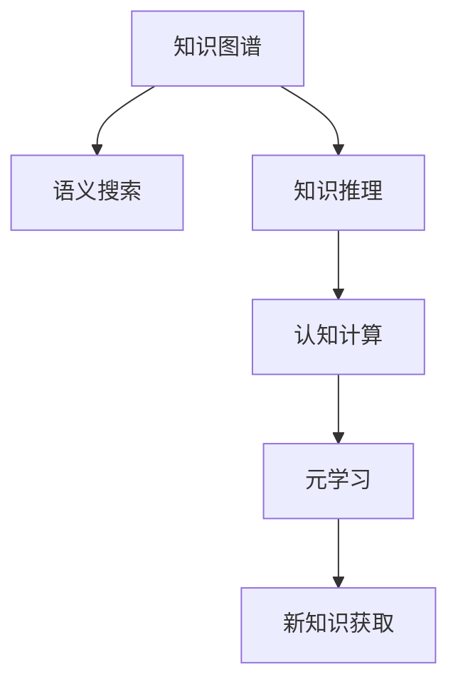

                 

# 人类的知识与权力：知识就是力量

在计算机科学领域，知识的积累和应用始终是推动技术进步的核心驱动力。本文旨在探讨知识的本质、如何获取知识以及知识在技术创新中的重要作用，并提出一些关于如何高效利用和传播知识的见解。通过深入分析大语言模型、人工智能领域的知识获取与传播机制，本文将展示知识如何成为推动人类前进的强大力量。

## 1. 背景介绍

### 1.1 问题由来

随着信息技术的快速发展，数据和知识的大规模涌现，人工智能技术已经进入了一个新的时代。在这个时代，知识的重要性比以往任何时候都更加凸显。然而，如何有效地获取、管理和利用这些知识，成为了技术研究与实践中的关键问题。

### 1.2 问题核心关键点

- **知识获取**：从海量数据中提取有用信息，构建知识图谱，是知识工程的基础。
- **知识管理**：如何将获取的知识结构化、系统化，便于存储和查询，是知识管理的核心。
- **知识应用**：如何将知识转化为实际应用，推动技术创新和产业升级，是知识应用的最终目的。

## 2. 核心概念与联系

### 2.1 核心概念概述

为了深入理解知识在人工智能中的作用，我们首先需要明确几个核心概念：

- **知识图谱**：通过语义网技术构建的，用于描述实体、属性和关系的知识网络。
- **语义搜索**：基于自然语言处理技术，从大规模语料中提取信息并返回精确结果的搜索技术。
- **知识推理**：利用逻辑和统计方法，从已知知识中推导出新知识的智能系统。
- **认知计算**：模拟人类认知过程，进行符号计算、知识获取、推理和决策的计算模型。
- **元学习**：通过学习如何学习，即如何利用已有知识来获取新知识的高级学习形式。

### 2.2 核心概念原理和架构的 Mermaid 流程图(Mermaid 流程节点中不要有括号、逗号等特殊字符)



## 3. 核心算法原理 & 具体操作步骤

### 3.1 算法原理概述

知识的获取与利用可以视为一个数据驱动的循环过程，即通过数据提取知识，再利用知识进行更高效的推理和决策。在大语言模型（LLM）的语境下，知识获取主要依赖于预训练过程，而知识利用则通过微调（Fine-tuning）实现。

### 3.2 算法步骤详解

#### 3.2.1 预训练过程

预训练（Pre-training）是指在大规模无标签文本数据上，通过自监督学习任务训练通用语言模型。常见的预训练任务包括语言建模、掩码语言模型等。预训练的目的是让模型学习到语言的通用表示，为后续的微调奠定基础。

#### 3.2.2 微调过程

微调（Fine-tuning）是指在预训练模型的基础上，使用下游任务的少量标注数据，通过有监督地训练优化模型在该任务上的性能。微调过程中，模型通常只更新顶层参数，而保持大部分预训练权重不变，以避免过拟合。

#### 3.2.3 算法优缺点

优点：
- 高效利用预训练模型的通用知识，加快任务适应。
- 通过微调，可以显著提升模型在特定任务上的性能。

缺点：
- 依赖标注数据，获取高质量标注成本较高。
- 泛化能力有限，当目标任务与预训练数据分布差异较大时，效果可能不理想。

### 3.3 算法应用领域

基于大语言模型的微调方法在自然语言处理（NLP）领域得到广泛应用，包括文本分类、命名实体识别、情感分析、机器翻译等任务。此外，微调方法也在图像识别、语音识别等领域有所应用。

## 4. 数学模型和公式 & 详细讲解 & 举例说明

### 4.1 数学模型构建

在预训练过程中，通常使用自回归模型（如GPT）或自编码模型（如BERT）进行训练。以BERT为例，其预训练的目标函数为：

$$
\min_{\theta} \frac{1}{N}\sum_{i=1}^N \ell(x_i, M_{\theta}(x_i))
$$

其中，$M_{\theta}$ 是预训练模型，$\ell$ 是损失函数，$x_i$ 是训练样本。

### 4.2 公式推导过程

以BERT的掩码语言模型为例，其目标函数为：

$$
\min_{\theta} \frac{1}{N}\sum_{i=1}^N \sum_{j=1}^L \mathbb{I}_{\text{mask}}(x_{i,j})\ell(x_{i,j}, M_{\theta}(x_{i,j}))
$$

其中，$\mathbb{I}_{\text{mask}}(x_{i,j})$ 是掩码函数，$x_{i,j}$ 是掩码后的序列。

### 4.3 案例分析与讲解

在微调过程中，可以通过调整模型的损失函数来适应不同任务。以情感分析为例，可以使用二分类交叉熵作为损失函数：

$$
\ell(y, M_{\theta}(x)) = -y \log M_{\theta}(x) - (1-y) \log (1 - M_{\theta}(x))
$$

其中，$y$ 是真实标签，$M_{\theta}(x)$ 是模型输出。

## 5. 项目实践：代码实例和详细解释说明

### 5.1 开发环境搭建

安装所需的Python环境、PyTorch和Transformers库：

```bash
conda create -n pytorch-env python=3.8 
conda activate pytorch-env
pip install torch transformers
```

### 5.2 源代码详细实现

```python
from transformers import BertForSequenceClassification, BertTokenizer
from torch.utils.data import Dataset, DataLoader
from torch.nn import CrossEntropyLoss

# 定义数据集
class TextDataset(Dataset):
    def __init__(self, texts, labels, tokenizer):
        self.texts = texts
        self.labels = labels
        self.tokenizer = tokenizer

    def __len__(self):
        return len(self.texts)

    def __getitem__(self, idx):
        text = self.texts[idx]
        label = self.labels[idx]
        encoding = self.tokenizer(text, return_tensors='pt')
        return {'input_ids': encoding['input_ids'], 'attention_mask': encoding['attention_mask'], 'labels': label}

# 加载预训练模型
model = BertForSequenceClassification.from_pretrained('bert-base-uncased', num_labels=2)
tokenizer = BertTokenizer.from_pretrained('bert-base-uncased')

# 准备数据
train_dataset = TextDataset(train_texts, train_labels, tokenizer)
test_dataset = TextDataset(test_texts, test_labels, tokenizer)

# 定义训练和评估函数
def train_epoch(model, data_loader, optimizer, loss_fn):
    model.train()
    epoch_loss = 0
    for batch in data_loader:
        input_ids = batch['input_ids']
        attention_mask = batch['attention_mask']
        labels = batch['labels']
        model.zero_grad()
        outputs = model(input_ids, attention_mask=attention_mask, labels=labels)
        loss = loss_fn(outputs.logits, labels)
        loss.backward()
        optimizer.step()
        epoch_loss += loss.item()
    return epoch_loss / len(data_loader)

def evaluate(model, data_loader, loss_fn):
    model.eval()
    epoch_loss = 0
    with torch.no_grad():
        for batch in data_loader:
            input_ids = batch['input_ids']
            attention_mask = batch['attention_mask']
            labels = batch['labels']
            outputs = model(input_ids, attention_mask=attention_mask)
            loss = loss_fn(outputs.logits, labels)
            epoch_loss += loss.item()
    return epoch_loss / len(data_loader)

# 训练模型
epochs = 3
batch_size = 32
optimizer = AdamW(model.parameters(), lr=2e-5)
loss_fn = CrossEntropyLoss()

for epoch in range(epochs):
    train_loss = train_epoch(model, train_dataset, optimizer, loss_fn)
    test_loss = evaluate(model, test_dataset, loss_fn)
    print(f'Epoch {epoch+1}/{epochs}, train loss: {train_loss:.4f}, test loss: {test_loss:.4f}')
```

### 5.3 代码解读与分析

此代码实现了一个基于BERT的情感分析任务微调过程。通过定义数据集、加载预训练模型、定义训练和评估函数，并使用AdamW优化器和交叉熵损失函数，在训练集上进行了3个epoch的训练。

## 6. 实际应用场景

### 6.1 智能客服系统

在智能客服系统中，利用大语言模型微调技术，可以实现自然语言理解和生成，自动回答用户问题，提升服务效率和用户体验。

### 6.2 金融舆情监测

在金融领域，通过微调模型进行舆情分析和情感分析，可以实时监测市场动态，识别风险点，为金融决策提供支持。

### 6.3 个性化推荐系统

在推荐系统中，利用微调技术对用户行为数据进行建模，可以提供更加个性化的推荐服务。

### 6.4 未来应用展望

随着技术的进步，大语言模型微调技术将在更多领域得到应用，如智慧医疗、教育、智慧城市等。未来的趋势包括：

- 多模态微调：融合视觉、语音等多模态数据，提升模型的理解和生成能力。
- 知识图谱与微调的结合：利用知识图谱增强模型的知识获取和推理能力。
- 元学习：通过学习如何学习，提高模型的适应性和泛化能力。

## 7. 工具和资源推荐

### 7.1 学习资源推荐

- **《深度学习与自然语言处理》**：斯坦福大学的NLP入门课程，涵盖基础知识和常用技术。
- **《Transformers: State of the Art Natural Language Processing》**：Hugging Face的 Transformers 库文档，提供了丰富的预训练模型和微调样例。
- **《NLP综述与技术进展》**：综述性质的论文，介绍NLP领域的最新研究成果。

### 7.2 开发工具推荐

- **PyTorch**：灵活的深度学习框架，适合研究性开发。
- **TensorFlow**：生产环境部署友好的框架，适合工程应用。
- **Weights & Biases**：实验跟踪工具，记录和可视化训练过程。
- **TensorBoard**：可视化工具，监测模型训练状态。

### 7.3 相关论文推荐

- **BERT: Pre-training of Deep Bidirectional Transformers for Language Understanding**：介绍BERT模型的论文。
- **GPT-2: Language Models are Unsupervised Multitask Learners**：展示大语言模型的零样本学习能力的论文。

## 8. 总结：未来发展趋势与挑战

### 8.1 研究成果总结

本文介绍了大语言模型微调的基本原理和实践方法，探讨了知识在人工智能中的重要作用。通过分析微调的优点和缺点，提出了一系列优化策略，并展示了微调在实际应用中的成功案例。

### 8.2 未来发展趋势

- **知识图谱的应用**：利用知识图谱提升模型的知识获取和推理能力。
- **多模态微调**：融合视觉、语音等多模态数据，提升模型的理解和生成能力。
- **元学习**：通过学习如何学习，提高模型的适应性和泛化能力。

### 8.3 面临的挑战

- **数据标注成本高**：高质量标注数据的获取成本较高，是制约微调性能的瓶颈。
- **模型鲁棒性不足**：面对域外数据时，泛化性能可能不理想。
- **推理效率低**：超大模型在推理时存在计算和存储压力。
- **可解释性不足**：模型的决策过程缺乏可解释性，难以调试和理解。

### 8.4 研究展望

未来的研究方向包括：
- **知识图谱与微调的结合**：利用知识图谱增强模型的知识获取和推理能力。
- **多模态微调**：融合视觉、语音等多模态数据，提升模型的理解和生成能力。
- **元学习**：通过学习如何学习，提高模型的适应性和泛化能力。

## 9. 附录：常见问题与解答

**Q1：什么是知识图谱？**

A: 知识图谱是一种通过语义网技术构建的知识网络，用于描述实体、属性和关系。它通过节点和边构成图，能够表示实体之间的复杂关系。

**Q2：知识图谱与微调的关系是什么？**

A: 知识图谱可以与微调模型结合，通过将知识图谱中的实体和关系信息作为训练数据的一部分，提升模型的知识获取和推理能力。

**Q3：如何在微调过程中获取知识？**

A: 通过预训练过程，大语言模型可以从大规模无标签文本数据中提取通用语言知识。微调过程中，可以引入知识图谱作为额外的训练数据，进一步提升模型的知识获取能力。

**Q4：如何评估微调模型的性能？**

A: 通常使用准确率、召回率、F1值等指标评估模型在特定任务上的性能。此外，还可以通过可视化工具（如TensorBoard）监测模型的训练过程，分析模型的收敛情况。

**Q5：知识图谱如何应用于推荐系统？**

A: 利用知识图谱中的实体和关系信息，对用户行为数据进行补充和丰富，可以提供更加个性化的推荐服务。

---

作者：禅与计算机程序设计艺术 / Zen and the Art of Computer Programming

