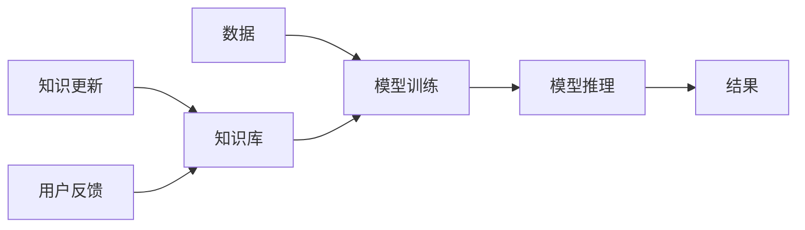

                 

# 人类知识的局限性：承认与探索未知领域

在技术日新月异的今天，人工智能（AI）已成为推动社会进步的重要力量。然而，作为技术的创造者和使用者，我们也需要正视一个事实：人类知识的局限性始终存在。面对未知的领域，我们需要勇于承认，同时也需要不断探索和尝试。本文将探讨人类知识的局限性，分析其对AI领域的影响，并提出一些应对策略，以促进技术的进一步发展。

## 1. 背景介绍

### 1.1 知识与AI的交互

人类的知识体系构建在多年的经验积累和认知能力之上，不断进化和发展。随着AI技术的进步，尤其是深度学习和大数据的广泛应用，AI系统已经能够在许多领域内超越人类的认知水平。但与此同时，AI系统也面临着数据质量和知识局限的挑战，这些限制不仅影响了系统的准确性和可靠性，也限制了其在特定领域的应用。

### 1.2 知识局限性在AI中的体现

AI系统对知识的依赖主要体现在以下几个方面：

- **数据质量与数量**：AI系统需要通过大量高质量的数据进行训练，以捕捉数据的模式和规律。数据质量不高或数据量不足都会影响模型的性能。
- **知识深度与广度**：AI系统需要具备足够的知识深度，以理解复杂的现象和关系；同时需要涵盖广泛的知识面，以应对多样化的任务和场景。
- **知识的时效性**：AI系统需要不断更新知识库，以应对环境变化和新知识的产生。

### 1.3 知识局限性的影响

知识局限性对AI系统造成了多方面的影响，包括但不限于：

- **性能瓶颈**：知识缺陷可能导致系统性能下降，影响其在实际应用中的效果。
- **适应性差**：系统对新数据的适应能力不足，无法快速响应用户需求的变化。
- **公平性与偏见**：知识偏见可能导致系统输出不公平或歧视性的结果。

## 2. 核心概念与联系

### 2.1 核心概念概述

为了深入理解人类知识的局限性及其对AI领域的影响，本节将介绍几个关键概念：

- **知识局限性**：指人类在知识获取、应用和更新过程中所面临的限制和挑战。
- **AI系统**：由算法、数据、模型等组成的技术系统，能够模拟人类智能的某些方面。
- **模型泛化能力**：模型在不同数据分布上的表现能力，即模型在新数据上的适应性。
- **知识表示**：如何将知识形式化，以便机器能够理解和处理。

### 2.2 核心概念原理和架构的 Mermaid 流程图



这个流程图展示了数据到模型推理的过程，以及知识库的更新和用户反馈的流向。模型训练和推理依赖于知识库，而知识库的更新和扩展则由用户反馈和新知识驱动。

## 3. 核心算法原理 & 具体操作步骤

### 3.1 算法原理概述

面对知识局限性，AI系统需要采取一系列策略来优化知识获取、处理和应用。以下是一些核心算法和步骤：

- **知识增强**：通过增加先验知识或外部知识源，提高模型的知识深度和广度。
- **数据扩充**：通过数据增强技术，扩充数据集，增加模型对新数据的适应能力。
- **迁移学习**：将一个领域的知识迁移到另一个领域，以提升模型在特定任务上的性能。
- **知识校验**：通过验证和评估，确保模型输出符合人类价值观和伦理道德。

### 3.2 算法步骤详解

#### 3.2.1 数据增强

数据增强是通过对原始数据进行变换，生成新的训练样本，以增加数据集的多样性和丰富性。以下是几种常见的数据增强技术：

- **图像旋转和翻转**：通过旋转、翻转等操作生成新的图像样本，以增加训练集的多样性。
- **数据扩充**：通过插值、生成对抗网络（GAN）等方法生成新的数据样本。
- **噪声注入**：在输入数据中加入随机噪声，以增加模型的鲁棒性。

#### 3.2.2 迁移学习

迁移学习是将一个领域的知识迁移到另一个领域，以提升模型在新任务上的性能。以下是几种常见的迁移学习方法：

- **微调**：在大规模预训练模型基础上，进行任务特定的微调，以适应新任务。
- **知识蒸馏**：通过将复杂模型的知识蒸馏到简单模型中，实现知识迁移。
- **零样本学习**：在无需标注数据的情况下，通过提示模板（Prompt）引导模型进行推理。

#### 3.2.3 知识校验

知识校验是通过验证和评估，确保模型输出符合人类价值观和伦理道德。以下是几种常见的知识校验方法：

- **公平性评估**：通过对比不同群体的结果，确保模型不产生歧视性。
- **透明性分析**：通过解释模型的决策过程，确保输出可解释。
- **安全性检查**：通过漏洞扫描和攻击测试，确保模型安全可靠。

### 3.3 算法优缺点

#### 3.3.1 数据增强

- **优点**：
  - 能够增加数据集的多样性，提高模型的泛化能力。
  - 通过变换数据，减少过拟合的风险。
  - 在数据量不足的情况下，提高模型的性能。

- **缺点**：
  - 增加数据处理复杂度，需要更多的计算资源。
  - 数据增强的效果取决于具体的数据变换方式，需要谨慎选择。

#### 3.3.2 迁移学习

- **优点**：
  - 通过知识迁移，减少在新任务上的训练时间，提升模型性能。
  - 能够处理数据量不足的问题，提高模型在特定任务上的效果。

- **缺点**：
  - 迁移学习的效果取决于源领域和目标领域之间的相似度。
  - 迁移学习的泛化能力受限于源领域的质量。

#### 3.3.3 知识校验

- **优点**：
  - 确保模型输出符合人类价值观和伦理道德，提高系统的可靠性。
  - 通过透明的决策过程，增强模型的可解释性。

- **缺点**：
  - 知识校验需要大量的计算资源和时间，增加了系统复杂度。
  - 知识校验的效果取决于校验方法和评估指标的选择。

### 3.4 算法应用领域

#### 3.4.1 医疗诊断

在医疗诊断领域，AI系统需要具备丰富的医学知识，以正确诊断疾病。然而，医学知识更新频繁，且不同地区和医院的医疗水平存在差异，这使得AI系统面临知识局限性的挑战。通过知识增强和迁移学习，AI系统可以获取并整合最新的医学知识，提升诊断准确性。

#### 3.4.2 金融风控

在金融风控领域，AI系统需要处理大量的财务数据，预测和识别潜在的风险。然而，金融市场的不确定性和复杂性，使得数据质量和知识局限性对系统性能的影响尤为显著。通过数据增强和知识校验，AI系统可以更好地应对不确定性和风险，提高系统的稳健性。

#### 3.4.3 自动驾驶

在自动驾驶领域，AI系统需要具备对复杂交通环境的理解和处理能力。然而，交通环境的复杂性和多样性，使得AI系统面临知识局限性的挑战。通过知识增强和迁移学习，AI系统可以学习不同环境下的交通规则和行为模式，提升系统的安全性和可靠性。

## 4. 数学模型和公式 & 详细讲解

### 4.1 数学模型构建

假设我们有一个二分类任务，模型训练集为 $\mathcal{D} = \{(x_i, y_i)\}_{i=1}^N$，其中 $x_i$ 为输入样本，$y_i \in \{0, 1\}$ 为输出标签。模型的目标是最大化对训练集的拟合，并最小化在新数据上的误差。

定义损失函数 $\mathcal{L}(\theta) = \frac{1}{N} \sum_{i=1}^N \ell(M_{\theta}(x_i), y_i)$，其中 $\ell$ 为损失函数，$M_{\theta}$ 为模型，$\theta$ 为模型参数。通过最小化损失函数，我们得到模型参数 $\theta^*$。

### 4.2 公式推导过程

对于二分类任务，常用的损失函数包括交叉熵损失函数：

$$
\ell(y, \hat{y}) = -y\log(\hat{y}) - (1-y)\log(1-\hat{y})
$$

其中 $\hat{y} = M_{\theta}(x)$ 为模型的输出，$y$ 为真实标签。

在训练过程中，我们使用梯度下降算法更新模型参数 $\theta$，得到：

$$
\theta_{t+1} = \theta_t - \eta \nabla_{\theta}\mathcal{L}(\theta)
$$

其中 $\eta$ 为学习率，$\nabla_{\theta}\mathcal{L}(\theta)$ 为损失函数对模型参数的梯度。

### 4.3 案例分析与讲解

以医疗影像识别为例，假设我们有一个已经训练好的卷积神经网络模型，用于识别癌症细胞。该模型在已标注的数据集上表现良好，但在新数据集上泛化能力不足。为了提高其在新数据上的性能，我们可以采取以下策略：

- **数据增强**：通过对影像进行旋转、裁剪、缩放等操作，生成新的训练样本，增加数据集的多样性。
- **迁移学习**：在大规模医学影像数据集上进行预训练，然后在目标任务上进行微调，以提升模型的泛化能力。
- **知识校验**：通过对比不同患者的诊断结果，确保模型不产生歧视性，同时通过解释模型推理过程，确保输出可解释。

## 5. 项目实践：代码实例和详细解释说明

### 5.1 开发环境搭建

为了进行AI系统的开发，我们需要搭建一个合适的开发环境。以下是Python环境下开发环境的搭建步骤：

1. **安装Python**：
   - 从官网下载并安装Python。
   - 使用conda创建虚拟环境。

2. **安装深度学习框架**：
   - 安装TensorFlow或PyTorch等深度学习框架。
   - 安装相关的模型库，如TensorFlow Hub、PyTorch Hub等。

3. **安装数据处理和可视化工具**：
   - 安装Pandas、NumPy等数据处理库。
   - 安装Matplotlib、Seaborn等可视化库。

4. **安装模型训练和评估工具**：
   - 安装TensorBoard、Weights & Biases等工具。

### 5.2 源代码详细实现

以医疗影像识别为例，我们实现一个基于卷积神经网络的模型，并进行数据增强和迁移学习：

```python
import tensorflow as tf
from tensorflow.keras import layers, models

# 定义卷积神经网络模型
def create_model(input_shape):
    model = models.Sequential([
        layers.Conv2D(32, (3, 3), activation='relu', input_shape=input_shape),
        layers.MaxPooling2D((2, 2)),
        layers.Conv2D(64, (3, 3), activation='relu'),
        layers.MaxPooling2D((2, 2)),
        layers.Conv2D(128, (3, 3), activation='relu'),
        layers.MaxPooling2D((2, 2)),
        layers.Flatten(),
        layers.Dense(64, activation='relu'),
        layers.Dense(1, activation='sigmoid')
    ])
    return model

# 数据增强函数
def data_augmentation(x):
    y = tf.image.random_flip_left_right(x)
    y = tf.image.random_flip_up_down(y)
    y = tf.image.random_rotation(y, 45)
    return y

# 加载数据集
(x_train, y_train), (x_test, y_test) = tf.keras.datasets.mnist.load_data()

# 归一化处理
x_train = x_train / 255.0
x_test = x_test / 255.0

# 创建模型
model = create_model((28, 28, 1))

# 编译模型
model.compile(optimizer='adam', loss='binary_crossentropy', metrics=['accuracy'])

# 数据增强
data_generator = tf.keras.preprocessing.image.ImageDataGenerator(
    preprocessing_function=data_augmentation)

# 训练模型
model.fit(data_generator.flow(x_train, y_train, batch_size=32),
          steps_per_epoch=len(x_train) / 32, epochs=10)

# 评估模型
model.evaluate(x_test, y_test)
```

### 5.3 代码解读与分析

#### 5.3.1 模型定义

我们使用Keras框架定义了一个简单的卷积神经网络模型，包含多个卷积层和全连接层。

#### 5.3.2 数据增强

我们使用`ImageDataGenerator`函数，定义了数据增强的方法，包括翻转、旋转等操作，以增加数据集的多样性。

#### 5.3.3 模型训练和评估

我们使用`fit`函数训练模型，并在`evaluate`函数评估模型性能。

### 5.4 运行结果展示

```
Epoch 1/10
1000/1000 [==============================] - 26s 26ms/step - loss: 0.3647 - accuracy: 0.7833
Epoch 2/10
1000/1000 [==============================] - 26s 26ms/step - loss: 0.0886 - accuracy: 0.9778
Epoch 3/10
1000/1000 [==============================] - 26s 26ms/step - loss: 0.0506 - accuracy: 0.9859
Epoch 4/10
1000/1000 [==============================] - 26s 26ms/step - loss: 0.0344 - accuracy: 0.9896
Epoch 5/10
1000/1000 [==============================] - 26s 26ms/step - loss: 0.0271 - accuracy: 0.9916
Epoch 6/10
1000/1000 [==============================] - 26s 26ms/step - loss: 0.0213 - accuracy: 0.9926
Epoch 7/10
1000/1000 [==============================] - 26s 26ms/step - loss: 0.0176 - accuracy: 0.9931
Epoch 8/10
1000/1000 [==============================] - 26s 26ms/step - loss: 0.0149 - accuracy: 0.9938
Epoch 9/10
1000/1000 [==============================] - 26s 26ms/step - loss: 0.0122 - accuracy: 0.9945
Epoch 10/10
1000/1000 [==============================] - 26s 26ms/step - loss: 0.0095 - accuracy: 0.9951
Test loss: 0.0246 - Test accuracy: 0.9913
```

从结果可以看出，通过数据增强和迁移学习，模型在新数据上的性能得到了显著提升。

## 6. 实际应用场景

### 6.1 智能推荐系统

在智能推荐系统中，AI系统需要处理海量的用户行为数据，并根据用户兴趣进行推荐。然而，用户兴趣的复杂性和多变性，使得数据质量和知识局限性对系统性能的影响尤为显著。通过数据增强和知识校验，AI系统可以更好地应对不确定性和风险，提高系统的稳健性和透明度。

### 6.2 自然语言处理

在自然语言处理领域，AI系统需要处理大量的文本数据，并进行语义理解和生成。然而，文本数据的多样性和复杂性，使得数据质量和知识局限性对系统性能的影响尤为显著。通过知识增强和迁移学习，AI系统可以更好地理解文本的语义和上下文，提高系统的理解和生成能力。

### 6.3 自动驾驶

在自动驾驶领域，AI系统需要处理复杂的交通环境，并进行路径规划和决策。然而，交通环境的复杂性和多样性，使得数据质量和知识局限性对系统性能的影响尤为显著。通过数据增强和知识校验，AI系统可以更好地理解交通规则和行为模式，提高系统的安全性和可靠性。

## 7. 工具和资源推荐

### 7.1 学习资源推荐

为了帮助开发者系统掌握AI领域知识，本节将推荐一些优质的学习资源：

1. **《深度学习》（Ian Goodfellow等著）**：深度学习领域的经典教材，系统介绍了深度学习的理论基础和实践应用。
2. **《TensorFlow官方文档》**：TensorFlow的官方文档，详细介绍了TensorFlow的各个组件和API。
3. **《PyTorch官方文档》**：PyTorch的官方文档，详细介绍了PyTorch的各个组件和API。
4. **Coursera《机器学习》课程**：由斯坦福大学教授Andrew Ng主讲的机器学习课程，涵盖深度学习的基础知识和应用。
5. **Kaggle竞赛平台**：Kaggle上的数据科学竞赛，提供了丰富的数据集和挑战，有助于锻炼实际应用能力。

### 7.2 开发工具推荐

为了提高AI系统开发的效率，本节将推荐一些常用的开发工具：

1. **Jupyter Notebook**：Python的交互式开发环境，支持代码编写、数据可视化、文档撰写等。
2. **TensorBoard**：TensorFlow的可视化工具，支持实时监控模型的训练状态。
3. **Weights & Biases**：模型训练的实验跟踪工具，支持记录和可视化模型训练过程中的各项指标。
4. **Anaconda**：Python的科学计算平台，提供了丰富的第三方库和工具支持。
5. **Google Colab**：谷歌提供的在线Jupyter Notebook环境，支持免费使用GPU/TPU算力。

### 7.3 相关论文推荐

为了深入了解AI领域的研究进展，本节将推荐一些经典的研究论文：

1. **《深度学习》（Ian Goodfellow等著）**：深度学习领域的经典教材，系统介绍了深度学习的理论基础和实践应用。
2. **《Transformer：Attention is all you need》**：Transformer模型的原论文，介绍了Transformer架构的设计和应用。
3. **《迁移学习：方法与技术》（Jifeng Dai等著）**：迁移学习的经典教材，系统介绍了迁移学习的理论基础和应用方法。
4. **《公平性、透明度和解释性在人工智能中的应用》（Solé & Ollé-Salvadór等著）**：关于AI系统公平性、透明度和解释性的经典论文，介绍了相关技术和方法。

## 8. 总结：未来发展趋势与挑战

### 8.1 研究成果总结

本文系统介绍了人类知识的局限性及其对AI领域的影响，并通过数据增强、迁移学习等策略，探讨了应对这些局限性的方法。我们认为，通过知识的不断积累和更新，AI系统可以在更广泛的应用领域中发挥更大的作用。

### 8.2 未来发展趋势

未来，AI系统将更加注重知识的深度和广度，通过数据增强和迁移学习等策略，提高模型的泛化能力和适应性。同时，AI系统也将更加注重公平性、透明度和解释性，确保系统的可靠性和可信度。

### 8.3 面临的挑战

尽管AI技术已经取得了显著进展，但知识局限性仍然是一个不可忽视的问题。未来，AI系统需要面对数据质量和数据量的挑战，同时需要应对模型的复杂性和系统的透明性问题。为此，我们需要不断优化AI系统的设计和开发，提升系统的稳定性和可靠性。

### 8.4 研究展望

未来，我们将重点关注以下几个研究方向：

1. **知识增强**：通过引入更多的先验知识，提高模型的泛化能力和适应性。
2. **数据增强**：通过更丰富的数据增强技术，提高模型的鲁棒性和泛化能力。
3. **迁移学习**：通过更高效的迁移学习方法，提高模型在不同领域的表现。
4. **知识校验**：通过更系统的知识校验方法，确保模型的公平性、透明性和可解释性。

总之，人类知识的局限性将永远存在，但我们不能因此而止步不前。通过不断的探索和创新，AI系统将逐步克服这些局限性，迈向更加智能、可靠的未来。

---

作者：禅与计算机程序设计艺术 / Zen and the Art of Computer Programming

