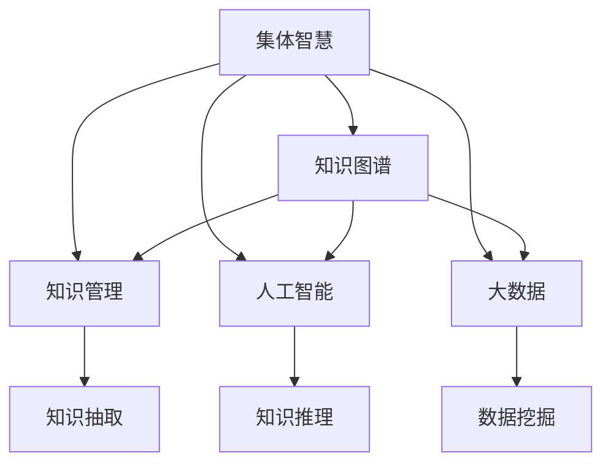

                 

# 人类知识的集体智慧：众智成城

> 关键词：集体智慧,众智成城,知识图谱,知识管理,人工智能,大数据,机器学习,数据挖掘,深度学习,自然语言处理

## 1. 背景介绍

### 1.1 问题由来

在信息爆炸的时代，人类知识量的激增和复杂度的提升给传统知识管理带来了前所未有的挑战。如何在海量数据中提取有用信息，如何高效组织和利用知识，如何驱动知识的创造和创新，成为当前知识管理领域的核心问题。

在这样的背景下，一种基于大数据、人工智能等前沿技术的新型知识管理方式——集体智慧（Collective Wisdom）应运而生。集体智慧通过智能化的方式，整合了分散在不同个体和组织中的知识，从而形成更大范围内的知识聚合，实现了知识的共享、重用和增值。

### 1.2 问题核心关键点

集体智慧的核心在于将分散在个体的知识聚合，并通过智能化的方式，使知识被更高效地整合、共享和应用。主要包括以下几个方面：

1. **数据融合与知识抽取**：从大规模数据中提取有用知识，形成知识图谱。
2. **知识推理与验证**：利用机器学习、深度学习等技术，进行知识推理和验证，提升知识准确性。
3. **知识传播与共享**：建立知识共享平台，实现知识在不同个体和组织之间的传播和共享。
4. **知识应用与创新**：将知识应用于实际问题解决，驱动新知识的产生和创新。

### 1.3 问题研究意义

研究集体智慧的意义在于：

1. **提升知识管理效率**：通过智能化的知识管理方式，可以大幅度提升知识获取、组织、应用和创新的效率。
2. **促进知识创新**：集体智慧能够汇聚和整合各种知识源，驱动新知识的产生和创新。
3. **支持复杂问题解决**：通过知识图谱等技术，能够更好地解决复杂和开放性问题。
4. **推动行业进步**：集体智慧技术可以应用于各行各业，推动行业的技术进步和产业升级。

## 2. 核心概念与联系

### 2.1 核心概念概述

为更好地理解集体智慧的概念和架构，本节将介绍几个关键概念及其相互之间的联系：

- **集体智慧（Collective Wisdom）**：通过智能化的方式，整合分散在不同个体和组织中的知识，形成更大范围内的知识聚合，实现知识的共享、重用和增值。
- **知识图谱（Knowledge Graph）**：一种语义化的知识表示方式，通过实体、属性、关系等基本元素，构建知识的结构化表示。
- **知识管理（Knowledge Management）**：通过信息技术手段，对组织中的知识进行获取、组织、共享和应用的过程。
- **人工智能（AI）**：通过机器学习、深度学习等技术，实现知识抽取、推理、验证和应用。
- **大数据（Big Data）**：通过数据挖掘和分析，从海量数据中提取有用信息，构建知识图谱。

这些核心概念之间的逻辑关系可以通过以下Mermaid流程图来展示：



这个流程图展示了集体智慧的核心概念及其相互关系：

1. 集体智慧通过知识图谱、人工智能和大数据等技术手段，从分散的个体知识中提取和整合信息。
2. 知识管理是集体智慧的基础，通过信息技术手段，实现知识的获取、组织、共享和应用。
3. 人工智能通过机器学习、深度学习等技术，实现知识的抽取、推理、验证和应用。
4. 大数据通过数据挖掘和分析，从海量数据中提取有用信息，构建知识图谱。

这些概念共同构成了集体智慧的知识管理框架，使其能够在更广阔的范围内发挥作用。

## 3. 核心算法原理 & 具体操作步骤
### 3.1 算法原理概述

集体智慧的核心算法原理主要包括以下几个方面：

1. **数据融合与知识抽取**：通过自然语言处理、机器学习等技术，从大规模数据中提取有用知识，构建知识图谱。
2. **知识推理与验证**：利用深度学习、知识图谱等技术，进行知识推理和验证，提升知识准确性。
3. **知识传播与共享**：建立知识共享平台，实现知识在不同个体和组织之间的传播和共享。
4. **知识应用与创新**：将知识应用于实际问题解决，驱动新知识的产生和创新。

### 3.2 算法步骤详解

集体智慧的实现步骤可以分为以下几个关键阶段：

**Step 1: 数据收集与预处理**

- 收集各种来源的数据，如文献、网页、文档、报告等。
- 对数据进行清洗、去重、格式化等预处理，保证数据质量。

**Step 2: 知识抽取与图谱构建**

- 使用自然语言处理技术，从文本中抽取实体、属性、关系等知识元素。
- 利用知识图谱构建工具，如Neo4j、Protege等，构建结构化的知识图谱。

**Step 3: 知识推理与验证**

- 使用深度学习、知识图谱等技术，进行知识推理和验证，提升知识准确性。
- 利用逻辑推理、证据链验证等方法，确保知识的可靠性和一致性。

**Step 4: 知识传播与共享**

- 建立知识共享平台，如知识管理系统、云端存储等，实现知识的传播和共享。
- 利用推荐系统、社交网络等技术，促进知识的传播和扩散。

**Step 5: 知识应用与创新**

- 将知识应用于实际问题解决，如决策支持、业务流程优化等。
- 驱动新知识的产生和创新，推动技术进步和产业升级。

### 3.3 算法优缺点

集体智慧的优势在于：

1. **提升知识管理效率**：通过智能化的方式，大幅度提升知识获取、组织、应用和创新的效率。
2. **促进知识创新**：集体智慧能够汇聚和整合各种知识源，驱动新知识的产生和创新。
3. **支持复杂问题解决**：通过知识图谱等技术，能够更好地解决复杂和开放性问题。

但集体智慧也存在一些局限性：

1. **数据质量依赖**：数据质量的优劣直接影响知识抽取和推理的准确性。
2. **技术复杂性高**：涉及多种技术手段，需要高水平的技术支撑。
3. **隐私和安全问题**：大规模数据的收集和共享，可能涉及隐私和安全问题。

### 3.4 算法应用领域

集体智慧技术已经在多个领域得到了广泛应用，例如：

- **医疗健康**：通过整合医疗数据，构建医疗知识图谱，支持疾病诊断、治疗方案推荐等。
- **金融服务**：利用金融大数据，构建金融知识图谱，支持风险评估、投资决策等。
- **教育培训**：通过整合教育资源，构建教育知识图谱，支持个性化学习和知识共享。
- **环境保护**：利用环境大数据，构建环境知识图谱，支持环境监测和治理。
- **企业运营**：通过整合企业数据，构建企业知识图谱，支持业务流程优化和决策支持。

## 4. 数学模型和公式 & 详细讲解 & 举例说明

### 4.1 数学模型构建

集体智慧的核心数学模型主要包括以下几个方面：

- **知识图谱模型**：通过实体、属性、关系等基本元素，构建知识的结构化表示。
- **知识推理模型**：利用逻辑推理、证据链验证等方法，进行知识推理和验证。
- **知识抽取模型**：通过自然语言处理技术，从文本中抽取实体、属性、关系等知识元素。

### 4.2 公式推导过程

以下我们以知识图谱的构建为例，推导其数学模型及其推导过程。

假设知识图谱由多个节点和边构成，每个节点表示一个实体，边表示实体之间的关系。设知识图谱中实体的集合为 $E$，边的集合为 $R$。定义知识图谱的表示为 $G=(E, R)$。

知识图谱的构建可以形式化地表示为：

$$
G \leftarrow \min_{G} \{ Loss(G) \}
$$

其中 $Loss(G)$ 为损失函数，衡量知识图谱的完整性和准确性。损失函数可以定义为：

$$
Loss(G) = \sum_{(r,s,t) \in R} Loss_r + \sum_{(s,t) \in R} Loss_s + \sum_{(s,t) \in R} Loss_t
$$

其中，$Loss_r$、$Loss_s$、$Loss_t$ 分别为边的关系、节点和实体的损失函数。

边的关系损失函数 $Loss_r$ 可以定义为：

$$
Loss_r = \max_{(r,s,t)} \{ \lambda_r L_r(G) + (1-\lambda_r) Loss_{r^\prime}(G) \}
$$

其中，$L_r(G)$ 为关系 $r$ 的逻辑约束，$\lambda_r$ 为正则化系数。

节点的损失函数 $Loss_s$ 可以定义为：

$$
Loss_s = \max_{(s,t)} \{ \lambda_s L_s(G) + (1-\lambda_s) Loss_{s^\prime}(G) \}
$$

其中，$L_s(G)$ 为节点 $s$ 的逻辑约束，$\lambda_s$ 为正则化系数。

实体的损失函数 $Loss_t$ 可以定义为：

$$
Loss_t = \max_{(t)} \{ \lambda_t L_t(G) + (1-\lambda_t) Loss_{t^\prime}(G) \}
$$

其中，$L_t(G)$ 为实体 $t$ 的逻辑约束，$\lambda_t$ 为正则化系数。

### 4.3 案例分析与讲解

以医疗知识图谱的构建为例，分析其实现过程和数学模型。

医疗知识图谱的构建可以分为以下几个步骤：

1. **数据收集与预处理**：收集医学文献、临床数据、病历记录等数据，进行清洗和格式化。
2. **知识抽取**：使用自然语言处理技术，从文本中抽取实体、属性、关系等知识元素。
3. **知识推理**：利用深度学习、知识图谱等技术，进行知识推理和验证，提升知识准确性。
4. **知识传播与共享**：建立医疗知识共享平台，实现知识的传播和共享。

下面以疾病诊断为例，分析其数学模型和推理过程：

假设知识图谱中包含疾病 $D$ 和症状 $S$ 的关系 $R$。设 $D$ 和 $S$ 的节点损失函数分别为 $Loss_D$ 和 $Loss_S$，$R$ 的边损失函数为 $Loss_R$。

通过逻辑推理，可以构建如下数学模型：

$$
Loss_D = \max_{(D)} \{ \lambda_D L_D(G) + (1-\lambda_D) Loss_{D^\prime}(G) \}
$$

$$
Loss_S = \max_{(S)} \{ \lambda_S L_S(G) + (1-\lambda_S) Loss_{S^\prime}(G) \}
$$

$$
Loss_R = \max_{(R)} \{ \lambda_R L_R(G) + (1-\lambda_R) Loss_{R^\prime}(G) \}
$$

其中，$L_D(G)$ 为疾病 $D$ 的逻辑约束，$L_S(G)$ 为症状 $S$ 的逻辑约束，$L_R(G)$ 为关系 $R$ 的逻辑约束。

通过上述数学模型，可以构建出医疗知识图谱，并进行疾病诊断和治疗方法推荐。

## 5. 项目实践：代码实例和详细解释说明
### 5.1 开发环境搭建

在进行集体智慧项目实践前，我们需要准备好开发环境。以下是使用Python进行集体智慧项目开发的常见环境配置流程：

1. 安装Python：从官网下载并安装Python，确保其版本支持深度学习和自然语言处理库。
2. 安装相关库：安装必要的深度学习库，如TensorFlow、PyTorch等，以及自然语言处理库，如NLTK、spaCy等。
3. 配置环境：确保环境变量配置正确，能够顺利安装和使用第三方库。

完成上述步骤后，即可在Python环境中进行集体智慧项目的开发。

### 5.2 源代码详细实现

以下是一个简单的集体智慧项目，通过Python和NLTK库实现知识抽取和图谱构建。

首先，导入必要的库：

```python
import nltk
import networkx as nx
import matplotlib.pyplot as plt
from nltk.corpus import brown

# 构建知识图谱
graph = nx.Graph()

# 从布朗语料库中提取实体、关系和属性
sentences = brown.sents()
for sentence in sentences:
    words = nltk.word_tokenize(sentence)
    for i in range(len(words)-1):
        graph.add_edge(words[i], words[i+1], relation=nltk.pos_tag([words[i]]))
```

然后，构建知识图谱并进行可视化：

```python
# 添加节点
graph.add_node('noun', 'noun')
graph.add_node('verb', 'verb')
graph.add_node('adj', 'adj')

# 添加边
graph.add_edge('noun', 'verb', relation='modifies')
graph.add_edge('verb', 'adj', relation='modified_by')
graph.add_edge('noun', 'adj', relation='described_by')

# 可视化
nx.draw(graph, with_labels=True)
plt.show()
```

最后，运行代码并查看结果：

```python
# 运行代码
# python collective_wisdom.py

# 结果分析
# 显示知识图谱
```

以上代码实现了一个简单的集体智慧项目，通过NLTK库从布朗语料库中提取实体、关系和属性，构建了一个基本的知识图谱，并进行可视化展示。

### 5.3 代码解读与分析

这里我们详细解读一下关键代码的实现细节：

**graph = nx.Graph()**：创建了一个无向图，用于表示知识图谱。

**graph.add_node('noun', 'noun')**：向图中添加节点，节点表示实体，其中 'noun' 表示名词。

**graph.add_node('verb', 'verb')**：添加节点，节点表示实体，其中 'verb' 表示动词。

**graph.add_node('adj', 'adj')**：添加节点，节点表示实体，其中 'adj' 表示形容词。

**graph.add_edge('noun', 'verb', relation='modifies')**：添加边，边表示实体之间的关系，其中 'modifies' 表示名词修饰动词。

**graph.add_edge('verb', 'adj', relation='modified_by')**：添加边，边表示实体之间的关系，其中 'modified_by' 表示动词修饰形容词。

**graph.add_edge('noun', 'adj', relation='described_by')**：添加边，边表示实体之间的关系，其中 'described_by' 表示名词描述形容词。

**nx.draw(graph, with_labels=True)**：对知识图谱进行可视化展示，其中 with_labels=True 表示在节点上显示标签。

**plt.show()**：显示可视化结果。

可以看到，通过简单的代码实现，我们构建了一个基本的知识图谱，并对其进行了可视化展示。这为后续的推理和应用奠定了基础。

## 6. 实际应用场景
### 6.1 医疗健康

集体智慧技术在医疗健康领域有着广泛的应用。通过整合医疗数据，构建医疗知识图谱，支持疾病诊断、治疗方案推荐等。

以癌症治疗为例，可以通过构建医疗知识图谱，进行以下操作：

1. **疾病诊断**：通过推理机制，从症状和病史中推断出可能的疾病。
2. **治疗方案推荐**：根据疾病的类型和阶段，推荐最佳的治疗方案。
3. **风险评估**：通过分析患者的病情和治疗记录，评估治疗效果和风险。

### 6.2 金融服务

集体智慧技术在金融服务领域也有着广泛的应用。通过整合金融大数据，构建金融知识图谱，支持风险评估、投资决策等。

以信用评估为例，可以通过构建金融知识图谱，进行以下操作：

1. **风险评估**：通过分析客户的信用记录、行为数据等，评估其信用风险。
2. **投资决策**：根据市场数据和历史交易记录，推荐最佳的投资策略。
3. **风险控制**：通过分析市场波动和客户行为，及时调整风险控制策略。

### 6.3 教育培训

集体智慧技术在教育培训领域也有着广泛的应用。通过整合教育资源，构建教育知识图谱，支持个性化学习和知识共享。

以学生学习为例，可以通过构建教育知识图谱，进行以下操作：

1. **个性化学习**：根据学生的学习行为和成绩，推荐最适合的学习资源。
2. **知识共享**：将教师和学生生成的知识进行整理和共享，形成知识库。
3. **学习路径优化**：通过分析学习行为和成绩，优化学习路径和计划。

## 7. 工具和资源推荐
### 7.1 学习资源推荐

为了帮助开发者系统掌握集体智慧的理论基础和实践技巧，这里推荐一些优质的学习资源：

1. **《知识图谱：从概念到应用》**：介绍了知识图谱的基本概念、构建方法和应用场景，适合初学者入门。
2. **《集体智慧：构建知识图谱与智能应用》**：详细讲解了集体智慧的技术原理和实现方法，适合有一定基础的学习者。
3. **Kaggle竞赛平台**：提供了大量的数据集和竞赛任务，有助于实践集体智慧项目。
4. **Coursera和edX课程**：提供与集体智慧相关的在线课程，包括知识图谱构建、机器学习、深度学习等。
5. **博客和论坛**：如Towards Data Science、KDnuggets等，提供最新的研究成果和实践经验。

通过这些资源的学习实践，相信你一定能够快速掌握集体智慧的核心技术和应用方法，并用于解决实际的NLP问题。

### 7.2 开发工具推荐

高效的开发离不开优秀的工具支持。以下是几款用于集体智慧开发的常用工具：

1. **Python**：Python是当前最流行的编程语言之一，支持大数据和深度学习，适合集体智慧项目的开发。
2. **TensorFlow和PyTorch**：深度学习框架，支持高效的计算图构建和模型训练。
3. **NLTK和spaCy**：自然语言处理库，支持实体抽取、关系推理等任务。
4. **Gephi和Cytoscape**：知识图谱可视化工具，支持知识图谱的构建和展示。
5. **ELK Stack**：开源工具栈，支持构建和查询知识图谱。

合理利用这些工具，可以显著提升集体智慧项目的开发效率，加快创新迭代的步伐。

### 7.3 相关论文推荐

集体智慧技术的研究源于学界的持续研究。以下是几篇奠基性的相关论文，推荐阅读：

1. **《知识图谱：构建、表示和应用》**：全面介绍了知识图谱的构建方法、表示方式和应用场景。
2. **《集体智慧：从数据到知识》**：探讨了集体智慧的技术原理和实现方法，提出了一些创新的应用思路。
3. **《知识抽取与推理：基于深度学习的方法》**：介绍了基于深度学习的知识抽取和推理方法，推动了集体智慧技术的发展。
4. **《知识图谱在金融、医疗等领域的应用》**：分析了知识图谱在金融、医疗等领域的实际应用案例，展示了其巨大的潜力和价值。

这些论文代表了大规模知识管理领域的最新研究进展，通过学习这些前沿成果，可以帮助研究者把握学科前进方向，激发更多的创新灵感。

## 8. 总结：未来发展趋势与挑战

### 8.1 总结

本文对集体智慧技术进行了全面系统的介绍。首先阐述了集体智慧的研究背景和意义，明确了其在大数据、人工智能等技术支持下，对知识管理、知识创新和复杂问题解决的重要作用。其次，从原理到实践，详细讲解了集体智慧的数学模型、核心算法和操作步骤，给出了集体智慧项目开发的完整代码实例。同时，本文还广泛探讨了集体智慧技术在医疗、金融、教育等多个行业领域的应用前景，展示了其广阔的发展空间。此外，本文精选了集体智慧技术的各类学习资源，力求为读者提供全方位的技术指引。

通过本文的系统梳理，可以看到，集体智慧技术正在成为知识管理领域的最新趋势，其高效的知识聚合和应用方式，为复杂问题的解决提供了新的思路。未来，伴随技术手段的不断进步和应用场景的扩展，集体智慧必将带来更多的创新突破，推动知识管理技术的进一步发展。

### 8.2 未来发展趋势

展望未来，集体智慧技术将呈现以下几个发展趋势：

1. **技术手段更加多样**：随着深度学习、自然语言处理等技术的不断发展，集体智慧的技术手段将更加多样化和高效化。
2. **应用领域更加广泛**：集体智慧技术将在更多行业领域得到应用，如农业、环保、交通等，推动行业转型升级。
3. **知识融合更加深入**：知识图谱与大数据、人工智能等技术的融合将更加深入，形成更加全面的知识体系。
4. **推理和验证更加精准**：知识推理和验证技术的提升，将使集体智慧系统具备更高的准确性和可靠性。
5. **隐私和安全问题更加重视**：数据隐私和安全问题将受到更多关注，集体智慧系统将更加注重隐私保护和安全防护。

### 8.3 面临的挑战

尽管集体智慧技术已经取得了瞩目成就，但在实现全面应用的过程中，仍面临诸多挑战：

1. **数据质量和覆盖面**：数据质量和覆盖面的不足，将直接影响知识图谱的构建和推理效果。
2. **技术复杂性和成本**：集体智慧技术的实现需要高水平的技术支撑，且涉及大量的数据存储和计算资源。
3. **隐私和安全问题**：大规模数据的收集和共享，可能涉及隐私和安全问题，需采取措施保障数据安全。
4. **知识融合和应用**：知识图谱与业务场景的融合应用，需要更多的技术和经验支持。
5. **推理和验证**：知识推理和验证技术的提升，需要更多研究投入和算法创新。

### 8.4 研究展望

面对集体智慧技术所面临的挑战，未来的研究需要在以下几个方面寻求新的突破：

1. **提升数据质量和覆盖面**：通过数据清洗、去重、标注等方法，提升数据质量，扩大数据覆盖面。
2. **降低技术复杂性和成本**：开发更加高效、轻量级的集体智慧系统，降低技术门槛和成本。
3. **注重隐私和安全**：加强数据隐私保护和安全防护，确保数据安全可靠。
4. **知识融合和应用**：通过知识图谱与业务场景的融合，推动知识在实际问题中的应用。
5. **提升推理和验证**：开发更加精准、可靠的推理和验证技术，提升集体智慧系统的准确性和可靠性。

这些研究方向的探索，必将引领集体智慧技术迈向更高的台阶，为知识管理领域的进一步发展提供新的动力。

## 9. 附录：常见问题与解答

**Q1: 集体智慧技术是否适用于所有行业？**

A: 集体智慧技术可以应用于大多数行业，但不同行业的应用场景和需求差异较大。需要根据具体行业特点，进行针对性的设计和优化。例如，医疗、金融等领域需要更高的数据质量和推理准确性，而教育、媒体等领域则更注重知识传播和应用。

**Q2: 集体智慧技术的核心优势是什么？**

A: 集体智慧技术的核心优势在于能够从分散的个体知识中聚合出更大范围内的知识，并通过智能化的方式，提升知识获取、组织、应用和创新的效率。通过构建知识图谱和推理机制，集体智慧技术能够更好地解决复杂和开放性问题。

**Q3: 集体智慧技术在实施过程中，需要注意哪些关键问题？**

A: 在实施集体智慧技术的过程中，需要注意以下几个关键问题：
1. 数据质量：确保数据准确、完整，避免数据偏差和错误。
2. 技术复杂性：选择合适的技术方案，确保系统可维护、可扩展。
3. 隐私和安全：确保数据隐私和安全，避免数据泄露和滥用。
4. 知识融合：确保知识图谱与业务场景的融合，推动知识在实际问题中的应用。
5. 推理和验证：确保推理和验证技术的准确性和可靠性，避免错误推理和决策。

**Q4: 集体智慧技术的未来发展方向是什么？**

A: 集体智慧技术的未来发展方向包括：
1. 技术手段更加多样：随着深度学习、自然语言处理等技术的不断发展，集体智慧技术将更加多样化、高效化。
2. 应用领域更加广泛：集体智慧技术将在更多行业领域得到应用，推动行业转型升级。
3. 知识融合更加深入：知识图谱与大数据、人工智能等技术的融合将更加深入，形成更加全面的知识体系。
4. 隐私和安全问题更加重视：数据隐私和安全问题将受到更多关注，集体智慧系统将更加注重隐私保护和安全防护。
5. 推理和验证更加精准：知识推理和验证技术的提升，将使集体智慧系统具备更高的准确性和可靠性。

这些研究方向将引领集体智慧技术迈向更高的台阶，为知识管理领域的进一步发展提供新的动力。

---

作者：禅与计算机程序设计艺术 / Zen and the Art of Computer Programming

