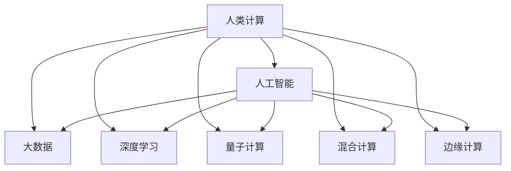

                 

# 人类计算的未来：趋势、机遇与挑战

> 关键词：人类计算, 人工智能, 大数据, 深度学习, 量子计算, 混合计算, 边缘计算, 未来趋势

## 1. 背景介绍

### 1.1 问题由来

随着科技的迅猛发展，计算技术已经深刻改变了人类的生产和生活方式。在过去几十年里，传统的电子计算机在处理大量数据、复杂算法、图形渲染等方面发挥了至关重要的作用。然而，随着计算任务的日益复杂和数据量的指数级增长，传统电子计算机的性能瓶颈逐渐显现。人类计算的极限已被逼近，迫切需要新的计算范式来应对未来挑战。

### 1.2 问题核心关键点

当前计算技术的发展正处于关键时刻，人类计算的未来趋势及其面临的机遇与挑战成为广泛关注的焦点。这些问题核心关键点包括：

- 大数据时代的计算需求，如何应对海量数据的高效处理和分析？
- 深度学习技术带来的计算复杂性，如何实现高效、可靠的模型训练与推理？
- 量子计算技术的突破，能否改变现有的计算范式，实现超越传统计算的能力？
- 混合计算、边缘计算等新兴技术的应用，如何与传统计算技术协同互补？
- 计算技术在各行业的应用，如何推动经济社会全面发展？

对这些关键问题的深入探讨，将有助于我们把握未来计算技术的走向，为人类计算的未来规划出一条光明的道路。

### 1.3 问题研究意义

研究人类计算的未来趋势、机遇与挑战，对于推动科技进步、促进经济社会发展、提升人类生活质量具有重要意义：

- 为计算技术的发展提供前瞻性指导，促进技术创新与突破。
- 推动各行业智能化转型，提高生产效率和生活品质。
- 为政策制定提供科学依据，引导社会资源合理配置。
- 促进国际科技合作，共同应对全球性计算难题。

## 2. 核心概念与联系

### 2.1 核心概念概述

为更好地理解人类计算的未来，本节将介绍几个密切相关的核心概念：

- **人类计算(Human Computation)**：指利用人类的智能和智慧，通过问题分解、协同协作等方式，高效解决复杂计算问题。
- **人工智能(Artificial Intelligence, AI)**：通过模拟人类智能，实现自主学习、推理、决策等功能的计算机技术。
- **大数据(Big Data)**：指规模庞大、复杂多样的数据集，需要通过高效的数据处理和分析技术来挖掘其价值。
- **深度学习(Deep Learning)**：利用神经网络模型，模仿人类大脑的学习机制，实现对复杂模式的高效识别和预测。
- **量子计算(Quantum Computing)**：利用量子力学的原理，实现并行计算和量子比特的量子叠加，实现超越传统计算的性能。
- **混合计算(Hybrid Computing)**：结合电子计算机和量子计算机的优点，实现计算性能的提升和计算资源的优化。
- **边缘计算(Edge Computing)**：将计算任务分布到靠近数据源的设备上，实现低延迟、高带宽的计算服务。

这些概念之间的逻辑关系可以通过以下Mermaid流程图来展示：



这个流程图展示了大数据、深度学习、量子计算等技术如何融入人类计算的各个方面，共同驱动计算技术的演进。

## 3. 核心算法原理 & 具体操作步骤
### 3.1 算法原理概述

人类计算的未来趋势，在很大程度上依赖于对现有计算技术的优化与创新。基于上述核心概念，未来计算技术将围绕以下几个关键点进行改进：

- 利用大数据技术，通过高效的数据处理和分析，实现对海量数据的高效利用。
- 深度学习技术将进一步发展，提高模型的准确性和鲁棒性。
- 量子计算的突破，将带来新的计算模式，解决传统计算难以处理的复杂问题。
- 混合计算的融合，将电子计算机与量子计算机的优势相结合，实现计算性能的提升。
- 边缘计算的普及，将计算任务分布到靠近数据源的设备上，实现低延迟、高带宽的计算服务。

### 3.2 算法步骤详解

基于这些关键点，未来人类计算的实现步骤可以分为以下几个方面：

1. **数据预处理**：
   - 收集和整合海量数据，利用大数据技术进行数据清洗和标注。
   - 应用数据压缩、数据加密等技术，提高数据存储和传输的效率。

2. **模型训练**：
   - 利用深度学习框架（如TensorFlow、PyTorch等），进行高效模型训练。
   - 采用分布式训练和混合精度训练等技术，提高训练效率。

3. **量子计算应用**：
   - 研究和开发量子计算硬件，如量子比特、量子线路等。
   - 开发量子算法，利用量子叠加和量子纠缠的特性，解决传统计算难以处理的问题。

4. **混合计算设计**：
   - 设计混合计算系统，将电子计算机与量子计算机的优势相结合。
   - 优化计算任务调度，提高混合计算系统的性能。

5. **边缘计算部署**：
   - 在靠近数据源的设备上部署计算资源，如物联网设备、移动终端等。
   - 应用边缘计算技术，实现低延迟、高带宽的数据处理和分析。

### 3.3 算法优缺点

未来人类计算的优势主要体现在以下几个方面：

- **高效性**：利用大数据和深度学习技术，实现对海量数据的高效处理和分析。
- **准确性**：通过量子计算，解决传统计算难以处理的复杂问题，提高模型的准确性。
- **灵活性**：结合混合计算和边缘计算，实现灵活多样的计算服务。

同时，未来人类计算也面临一些挑战：

- **技术复杂性**：量子计算和混合计算技术尚未完全成熟，存在较高的技术门槛。
- **资源需求**：大规模的数据存储和计算任务，需要庞大的硬件资源。
- **隐私和安全**：大数据和量子计算可能带来隐私和安全问题，需要相应的技术手段进行保障。

### 3.4 算法应用领域

未来人类计算的应用领域非常广泛，涵盖以下几个主要方向：

- **科学研究**：在物理、化学、生物等领域，利用计算技术进行模拟和预测。
- **医疗健康**：通过大数据分析和深度学习，实现疾病的早期诊断和治疗。
- **金融行业**：利用量子计算和大数据技术，进行风险评估和市场预测。
- **智能制造**：通过混合计算和边缘计算，实现智能制造和工业互联网的构建。
- **智慧城市**：应用边缘计算技术，提升城市管理和公共服务的效率。
- **交通运输**：通过混合计算和边缘计算，实现智能交通和物流系统的优化。

这些应用领域将极大地推动社会各行业的智能化转型，提升生产效率和生活质量。

## 4. 数学模型和公式 & 详细讲解  
### 4.1 数学模型构建

未来人类计算的核心在于高效、准确的数据处理和模型训练。以下将以深度学习模型为例，构建数学模型。

假设我们有一个深度学习模型 $f(x;\theta)$，其中 $x$ 为输入数据，$\theta$ 为模型参数。模型的损失函数为 $L(f(x;\theta),y)$，其中 $y$ 为真实标签。我们的目标是最小化损失函数，即：

$$
\min_{\theta} \frac{1}{N}\sum_{i=1}^N L(f(x_i;\theta),y_i)
$$

### 4.2 公式推导过程

以一个简单的线性回归问题为例，假设我们有 $N$ 个样本 $(x_i,y_i)$，其中 $x_i \in \mathbb{R}^d$，$y_i \in \mathbb{R}$。我们的目标是最小化如下损失函数：

$$
L(f(x;\theta),y) = \frac{1}{2}\sum_{i=1}^N (y_i - f(x_i;\theta))^2
$$

采用梯度下降算法进行优化，更新模型参数 $\theta$ 的公式为：

$$
\theta \leftarrow \theta - \eta \nabla_{\theta}L(f(x;\theta),y)
$$

其中 $\eta$ 为学习率，$\nabla_{\theta}L(f(x;\theta),y)$ 为损失函数对参数 $\theta$ 的梯度，可通过自动微分技术高效计算。

### 4.3 案例分析与讲解

以图像分类任务为例，我们通过卷积神经网络(CNN)模型进行图像分类。假设我们有 $N$ 个训练样本，每个样本包含 $d$ 维的图像特征向量 $x_i$ 和 $k$ 类的标签 $y_i$。我们的目标是最小化如下损失函数：

$$
L(f(x;\theta),y) = \frac{1}{N}\sum_{i=1}^N \sum_{j=1}^k I(y_i=j) \log(f(x_i;\theta)[j])
$$

其中 $I(y_i=j)$ 为示性函数，$j$ 表示类别，$f(x_i;\theta)[j]$ 表示模型对 $x_i$ 属于类别 $j$ 的概率预测。

## 5. 项目实践：代码实例和详细解释说明
### 5.1 开发环境搭建

在进行未来人类计算实践前，我们需要准备好开发环境。以下是使用Python进行TensorFlow开发的环境配置流程：

1. 安装Anaconda：从官网下载并安装Anaconda，用于创建独立的Python环境。

2. 创建并激活虚拟环境：
```bash
conda create -n tf-env python=3.8 
conda activate tf-env
```

3. 安装TensorFlow：根据CUDA版本，从官网获取对应的安装命令。例如：
```bash
pip install tensorflow-gpu
```

4. 安装各类工具包：
```bash
pip install numpy pandas scikit-learn matplotlib tqdm jupyter notebook ipython
```

完成上述步骤后，即可在`tf-env`环境中开始未来人类计算的实践。

### 5.2 源代码详细实现

下面以图像分类任务为例，给出使用TensorFlow进行深度学习模型训练的PyTorch代码实现。

首先，定义模型：

```python
import tensorflow as tf
from tensorflow.keras import layers

model = tf.keras.Sequential([
    layers.Conv2D(32, (3,3), activation='relu', input_shape=(28,28,1)),
    layers.MaxPooling2D((2,2)),
    layers.Flatten(),
    layers.Dense(64, activation='relu'),
    layers.Dense(10, activation='softmax')
])
```

然后，定义训练和评估函数：

```python
from tensorflow.keras.datasets import mnist
from tensorflow.keras.utils import to_categorical
import numpy as np

# 加载MNIST数据集
(train_images, train_labels), (test_images, test_labels) = mnist.load_data()

# 数据预处理
train_images = train_images.reshape((60000, 28, 28, 1)) / 255.0
test_images = test_images.reshape((10000, 28, 28, 1)) / 255.0
train_labels = to_categorical(train_labels)
test_labels = to_categorical(test_labels)

# 定义训练和验证集
train_dataset = tf.data.Dataset.from_tensor_slices((train_images, train_labels)).shuffle(60000).batch(64)
test_dataset = tf.data.Dataset.from_tensor_slices((test_images, test_labels)).batch(64)

# 定义优化器、损失函数和评估指标
optimizer = tf.keras.optimizers.Adam(learning_rate=0.001)
loss_fn = tf.keras.losses.CategoricalCrossentropy()
metrics = [tf.keras.metrics.CategoricalAccuracy('accuracy')]

# 定义训练和评估函数
@tf.function
def train_step(images, labels):
    with tf.GradientTape() as tape:
        predictions = model(images, training=True)
        loss = loss_fn(predictions, labels)
    gradients = tape.gradient(loss, model.trainable_variables)
    optimizer.apply_gradients(zip(gradients, model.trainable_variables))

@tf.function
def evaluate_step(images, labels):
    predictions = model(images, training=False)
    return loss_fn(predictions, labels), predictions

# 训练模型
EPOCHS = 10
for epoch in range(EPOCHS):
    for images, labels in train_dataset:
        train_step(images, labels)
    for images, labels in test_dataset:
        test_loss, predictions = evaluate_step(images, labels)
    print(f"Epoch {epoch+1}, test loss: {test_loss.numpy():.4f}, test accuracy: {metrics[0].result().numpy():.4f}")
```

以上就是使用TensorFlow进行图像分类任务训练的完整代码实现。可以看到，利用TensorFlow的高效计算图机制，可以轻松实现深度学习模型的训练和推理。

### 5.3 代码解读与分析

让我们再详细解读一下关键代码的实现细节：

**模型定义**：
- 使用 `tf.keras.Sequential` 定义一个包含卷积层、池化层、全连接层的深度学习模型。

**数据预处理**：
- 加载 MNIST 数据集，将其reshape为 (28, 28, 1) 的形状，并进行归一化处理。
- 使用 `to_categorical` 函数将标签转换为one-hot编码，方便后续计算。

**训练和评估函数**：
- 定义训练和验证集的 `tf.data.Dataset`，进行批处理和打乱操作。
- 定义优化器、损失函数和评估指标。
- 定义 `train_step` 和 `evaluate_step` 函数，分别用于模型训练和评估。

**模型训练**：
- 设置训练轮数，在每个epoch内对训练集和验证集进行迭代训练和评估。

可以看到，TensorFlow提供了完整的工具链支持，使得深度学习模型的开发和训练变得更加简单高效。开发者可以专注于模型设计和数据处理，而不必过多关注底层细节。

## 6. 实际应用场景
### 6.1 科学研究

未来人类计算在科学研究中的应用前景广阔。通过计算技术，科学家们可以高效模拟复杂的物理、化学和生物系统，加速科学发现和创新。例如，在药物研发领域，通过模拟蛋白质结构和化学反应过程，可以快速筛选出潜在的药物分子，缩短研发周期。

### 6.2 医疗健康

大数据和深度学习技术在医疗健康领域的应用，将极大地提升疾病诊断和治疗的准确性和效率。通过分析患者的历史数据和当前症状，预测疾病的发生和发展趋势，提供个性化的治疗方案。同时，量子计算技术将有望在药物设计和新材料研发等领域发挥重要作用。

### 6.3 金融行业

利用大数据和深度学习技术，金融行业可以实现精准的风险评估和市场预测。通过分析市场数据和金融产品，进行风险控制和投资决策。量子计算技术也将为金融领域带来新的计算范式，解决传统计算难以处理的问题。

### 6.4 智能制造

通过混合计算和边缘计算技术，智能制造可以实现高效的生产过程管理和质量控制。通过实时监测和分析生产数据，优化生产流程，提高生产效率和产品质量。同时，量子计算技术将有望在供应链优化和物流管理等领域发挥重要作用。

### 6.5 智慧城市

边缘计算技术将极大地提升智慧城市的管理和服务水平。通过在城市基础设施中部署计算资源，实现低延迟、高带宽的数据处理和分析，优化交通流量、提升公共服务水平。同时，量子计算技术也将为智慧城市提供新的计算能力，解决传统计算难以处理的问题。

## 7. 工具和资源推荐
### 7.1 学习资源推荐

为了帮助开发者系统掌握未来人类计算的理论基础和实践技巧，这里推荐一些优质的学习资源：

1. **Deep Learning Specialization（深度学习专项课程）**：由Coursera与斯坦福大学合作，涵盖深度学习基础、卷积神经网络、循环神经网络等核心内容，适合入门学习。

2. **Quantum Computing with TensorFlow**：由Google和TensorFlow团队联合开发的教程，介绍了如何使用TensorFlow进行量子计算。

3. **The Hundred-Page Machine Learning Book**：Andrew Ng教授所著，介绍了机器学习的基本概念和实用技巧，适合快速入门。

4. **TensorFlow官方文档**：详细介绍了TensorFlow的使用方法和高级特性，是深入学习TensorFlow的重要资源。

5. **Nature Review Computer Science**：国际顶级期刊，涵盖最新的计算技术和应用进展，适合研究学习。

通过对这些资源的学习实践，相信你一定能够快速掌握未来人类计算的精髓，并用于解决实际的计算问题。

### 7.2 开发工具推荐

高效的开发离不开优秀的工具支持。以下是几款用于未来人类计算开发的常用工具：

1. **TensorFlow**：基于Python的开源深度学习框架，灵活动态的计算图，适合快速迭代研究。支持分布式训练、混合精度训练等功能。

2. **PyTorch**：基于Python的开源深度学习框架，灵活易用，适合高效的研究和开发。支持动态计算图，易于调试和扩展。

3. **JAX**：Google开发的自动微分和编译工具，支持向量矩阵乘法等高效计算，适合高性能计算任务。

4. **Jupyter Notebook**：交互式的数据科学和编程环境，支持多种语言和工具集成，适合研究和开发。

5. **Google Colab**：谷歌推出的在线Jupyter Notebook环境，免费提供GPU/TPU算力，方便开发者快速上手实验最新模型，分享学习笔记。

合理利用这些工具，可以显著提升未来人类计算任务的开发效率，加快创新迭代的步伐。

### 7.3 相关论文推荐

未来人类计算的发展源于学界的持续研究。以下是几篇奠基性的相关论文，推荐阅读：

1. **TensorFlow: A System for Large-Scale Machine Learning**：Google团队发表的TensorFlow论文，介绍了TensorFlow的架构和应用场景。

2. **A New Kind of Learning**：DeepMind团队发表的论文，介绍了AlphaGo的深度学习和强化学习技术。

3. **Quantum Computing with Quantum Neural Networks and Tensorflow**：Google团队发表的论文，介绍了如何使用TensorFlow进行量子计算。

4. **Superconducting Quantum Processor with 48 Qubits**：Google团队发表的论文，介绍了超导量子计算器的设计和使用。

5. **Superconducting Qubit Architecture**：D-Wave团队发表的论文，介绍了D-Wave量子的架构和应用。

这些论文代表了大计算技术的最新进展，为未来人类计算的研究提供了重要参考。

## 8. 总结：未来发展趋势与挑战
### 8.1 总结

本文对未来人类计算的趋势、机遇与挑战进行了全面系统的介绍。首先阐述了未来计算技术的发展方向和目标，明确了未来人类计算在科学研究、医疗健康、金融行业、智能制造、智慧城市等领域的广阔应用前景。其次，从原理到实践，详细讲解了未来人类计算的核心算法和操作步骤，给出了未来人类计算任务开发的完整代码实例。同时，本文还广泛探讨了未来人类计算面临的技术复杂性、资源需求、隐私和安全等挑战，指出了未来计算技术需要突破的方向。

通过本文的系统梳理，可以看到，未来人类计算将依托于大数据、深度学习、量子计算等前沿技术，实现高效、准确、灵活的计算能力，推动各行业的智能化转型，提升生产效率和生活质量。未来人类计算的研究和发展，将为构建人机协同的智能社会奠定坚实基础。

### 8.2 未来发展趋势

展望未来，未来人类计算技术将呈现以下几个发展趋势：

1. **数据驱动的计算范式**：通过大数据技术，实现对海量数据的高效处理和分析，挖掘数据的潜在价值。
2. **深度学习技术的不断突破**：深度学习模型将进一步优化和改进，提高模型的准确性和鲁棒性。
3. **量子计算的商业化应用**：量子计算技术将逐步成熟，在特定领域实现商业化应用。
4. **混合计算和边缘计算的普及**：混合计算和边缘计算技术将得到广泛应用，提升计算性能和资源利用率。
5. **跨学科的协同创新**：各学科领域将加强合作，推动计算技术在多个领域的协同创新。

这些趋势将推动未来人类计算技术的不断进步，带来新的计算范式和应用场景。

### 8.3 面临的挑战

尽管未来人类计算技术具有广阔的应用前景，但在迈向实际应用的过程中，仍面临诸多挑战：

1. **技术复杂性**：量子计算和混合计算技术尚未完全成熟，存在较高的技术门槛。
2. **资源需求**：大规模的数据存储和计算任务，需要庞大的硬件资源。
3. **隐私和安全**：大数据和量子计算可能带来隐私和安全问题，需要相应的技术手段进行保障。
4. **跨学科合作**：各学科领域需要加强合作，共同推动计算技术的发展。

这些挑战需要学界和产业界共同努力，不断突破技术瓶颈，推动未来人类计算技术的成熟和应用。

### 8.4 研究展望

未来的研究需要在以下几个方面寻求新的突破：

1. **跨学科合作**：加强各学科领域的合作，推动计算技术在多个领域的协同创新。
2. **技术突破**：开发新型计算硬件和算法，解决当前技术瓶颈。
3. **应用场景**：探索新的计算应用场景，推动技术落地。
4. **标准规范**：制定计算技术的标准规范，保障技术安全性和可靠性。

只有勇于创新、敢于突破，才能不断拓展未来人类计算的边界，推动计算技术在各行业的广泛应用。

## 9. 附录：常见问题与解答

**Q1：未来人类计算是否适用于所有应用场景？**

A: 未来人类计算在大多数应用场景中都能取得不错的效果，特别是在需要高效数据处理和复杂计算的领域。但对于一些数据量较小、计算复杂度较低的场景，传统电子计算仍具有一定的优势。

**Q2：如何提升未来人类计算的效率？**

A: 提升未来人类计算的效率，需要从数据预处理、模型优化、计算硬件等多个方面进行改进。例如，利用数据压缩、分布式训练、混合精度训练等技术，提高计算效率。

**Q3：未来人类计算的资源需求如何？**

A: 未来人类计算需要大量的硬件资源，包括高性能计算集群、量子计算硬件等。同时，需要相应的软件工具和技术支持，如TensorFlow、PyTorch等深度学习框架，以及量子计算模拟工具。

**Q4：未来人类计算在各行业的具体应用有哪些？**

A: 未来人类计算在科学研究、医疗健康、金融行业、智能制造、智慧城市等领域具有广泛的应用前景。例如，在科学研究中，可以通过模拟和预测加速科学发现；在医疗健康中，可以通过大数据和深度学习提高疾病诊断和治疗的准确性；在金融行业，可以通过风险评估和市场预测优化投资决策。

**Q5：未来人类计算面临哪些技术挑战？**

A: 未来人类计算面临的技术挑战主要包括技术复杂性、资源需求、隐私和安全等问题。例如，量子计算和混合计算技术尚未完全成熟，存在较高的技术门槛；大规模数据存储和计算任务需要庞大的硬件资源；大数据和量子计算可能带来隐私和安全问题，需要相应的技术手段进行保障。

---

作者：禅与计算机程序设计艺术 / Zen and the Art of Computer Programming

