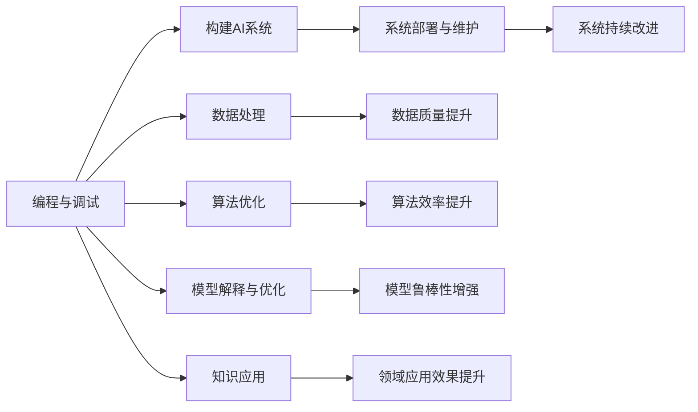

                 

# 人类计算：AI时代的关键人力要素

在人工智能(AI)时代，人类计算(Human Computation)作为AI时代的关键人力要素，正在经历深刻变革。从早期的手工编程到现在的机器学习、深度学习，计算能力得到了极大的提升，但人类计算的价值和作用并未减弱，反而更加凸显。本文将探讨人类计算在AI时代的重要角色和挑战，以及如何充分发挥其潜力，助力AI技术的持续发展。

## 1. 背景介绍

### 1.1 问题由来

随着深度学习、神经网络等技术的发展，AI已经能够处理复杂的任务，如语音识别、图像处理、自然语言处理等。然而，AI系统的高效运行依赖于大量的数据和复杂的算法，这需要人类通过编程、调试、优化等方式来构建和维护。因此，人类计算在AI技术发展中扮演了重要角色。

### 1.2 问题核心关键点

AI时代，人类计算的核心关键点在于：

1. **编程与调试**：构建AI系统需要人类编写和调试代码，确保算法的正确性和效率。
2. **数据处理**：AI系统的训练和优化依赖于大量高质量的数据，需要人类进行数据清洗、标注等工作。
3. **算法优化**：AI系统中的算法和模型需要不断优化和调整，以适应新任务和数据。
4. **模型解释与优化**：AI模型常常是"黑盒"，人类需要理解和解释模型的决策过程，并进行优化。
5. **知识应用**：AI技术需要结合领域知识，才能更好地应用于实际问题中。

这些关键点表明，人类计算在AI技术的各个环节中都是不可或缺的。尽管AI技术不断进步，但人类计算的深度和广度仍然无法被完全替代。

### 1.3 问题研究意义

研究人类计算在AI时代的作用，对于推动AI技术的创新和发展具有重要意义：

1. **提升AI系统的可靠性和可解释性**：人类计算可以确保AI系统的高质量，增强模型的可靠性和可解释性，减少算法偏见和错误。
2. **加速AI技术的产业化**：通过高效的人类计算，AI技术可以更快地应用于实际场景，缩短开发周期，降低成本。
3. **增强AI技术的普适性**：结合人类计算的领域知识，AI系统可以更好地适应不同领域的特殊需求。
4. **促进跨学科融合**：人类计算可以跨学科融合，推动AI技术在医疗、教育、金融等领域的应用，带来更深远的影响。

## 2. 核心概念与联系

### 2.1 核心概念概述

为更好地理解人类计算在AI时代的重要作用，本节将介绍几个密切相关的核心概念：

- **人类计算**：指人类利用其逻辑思维、创造力、洞察力等能力，对数据、算法和模型进行分析和优化，从而推动AI技术发展的过程。
- **编程与调试**：指通过编写代码、调试算法等方式，构建和优化AI系统。
- **数据处理**：指对原始数据进行清洗、标注、特征提取等操作，以便于模型训练和优化。
- **算法优化**：指对AI系统中的算法和模型进行改进和调整，以提高其性能和泛化能力。
- **模型解释与优化**：指理解AI模型的决策过程，进行优化调整，提高其解释性和鲁棒性。
- **知识应用**：指结合领域知识，将AI技术应用于特定领域，提升其实用性和效果。

这些核心概念之间存在紧密联系，共同构成了AI时代人类计算的完整框架。通过理解这些概念，我们可以更好地把握人类计算在AI技术中的作用和价值。

### 2.2 核心概念原理和架构的 Mermaid 流程图



这个流程图展示了人类计算在AI系统开发和应用过程中的关键环节及其联系。编程与调试是基础，数据处理和算法优化是核心，模型解释与优化是保障，知识应用是目标。通过这些环节的紧密合作，AI系统才能高效运行，产生实际价值。

## 3. 核心算法原理 & 具体操作步骤

### 3.1 算法原理概述

人类计算的核心算法原理可以归结为以下几个方面：

- **问题分解**：将复杂的任务分解为多个子问题，逐步解决。
- **算法设计**：设计和优化算法，以高效解决特定问题。
- **模型训练**：对AI模型进行训练和优化，提升其性能和泛化能力。
- **数据标注**：对原始数据进行清洗和标注，确保训练数据的质量。
- **领域知识应用**：结合领域知识，增强模型的实用性和解释性。

这些原理相互依赖，共同推动AI系统的构建和优化。

### 3.2 算法步骤详解

基于人类计算的核心算法原理，AI系统的构建和优化通常遵循以下步骤：

1. **需求分析**：明确AI系统要解决的具体问题，确定系统目标和需求。
2. **算法设计**：根据需求选择合适的算法，并进行优化设计。
3. **模型构建**：使用已有算法和框架，构建AI模型。
4. **数据准备**：收集和处理数据，确保数据质量和多样性。
5. **模型训练**：使用训练数据对模型进行训练和调优。
6. **模型评估**：对训练好的模型进行评估，确保其性能满足需求。
7. **优化调整**：根据评估结果，对模型进行优化和调整。
8. **应用部署**：将优化后的模型应用到实际场景中，并进行监控和维护。
9. **持续改进**：根据实际应用反馈，持续改进模型和算法。

这些步骤环环相扣，共同构成了AI系统构建和优化的全过程。

### 3.3 算法优缺点

人类计算在AI系统中具有以下优点：

1. **灵活性**：人类计算能够灵活应对各种复杂问题，快速调整算法和模型。
2. **解释性**：人类计算能够理解和解释模型的决策过程，提供可解释的输出。
3. **知识应用**：人类计算能够结合领域知识，提升AI系统的实用性和效果。

同时，人类计算也存在一些缺点：

1. **资源消耗**：人类计算需要大量的时间和精力，消耗大量的计算资源。
2. **主观偏差**：人类计算容易受到主观偏见的影响，可能导致算法偏见和错误。
3. **可重复性差**：人类计算的主观性和复杂性导致其可重复性较差，难以保证一致性。

尽管存在这些缺点，但人类计算的深度和广度仍然是不可替代的。未来，人类计算的发展需要结合AI技术的进步，进一步提升其效率和质量。

### 3.4 算法应用领域

人类计算在AI技术中具有广泛的应用，涵盖以下几个领域：

- **自然语言处理**：人类计算在自然语言处理(NLP)中扮演重要角色，负责编写代码、标注数据、优化算法等。
- **计算机视觉**：人类计算在计算机视觉(CV)中负责数据标注、算法设计和优化等工作。
- **机器人学**：人类计算在机器人学中负责构建感知和控制算法，进行任务规划和路径优化。
- **医疗诊断**：人类计算在医疗诊断中负责构建和优化诊断算法，提供可解释的诊断报告。
- **金融分析**：人类计算在金融分析中负责构建和优化预测模型，提供可解释的分析报告。

这些应用领域展示了人类计算在AI技术中的广泛作用，推动了各行业的发展和进步。

## 4. 数学模型和公式 & 详细讲解 & 举例说明

### 4.1 数学模型构建

在AI系统中，人类计算通常涉及多种数学模型和公式。以下以自然语言处理中的词向量模型为例，介绍人类计算的数学模型构建过程。

词向量模型是一种将单词映射为向量表示的技术，用于捕捉单词之间的语义关系。其数学模型可以表示为：

$$
\mathbf{w}_i = \sum_{j=1}^n \alpha_{ij} \mathbf{v}_j
$$

其中 $\mathbf{w}_i$ 表示单词 $i$ 的词向量，$\mathbf{v}_j$ 表示单词 $j$ 的词向量，$\alpha_{ij}$ 表示单词 $i$ 和单词 $j$ 之间的关系权重。

### 4.2 公式推导过程

词向量模型中的关系权重 $\alpha_{ij}$ 可以通过共现矩阵来计算，公式如下：

$$
\alpha_{ij} = \frac{\text{co-occurrence}(i,j)}{\text{co-occurrence}(i) \cdot \text{co-occurrence}(j)}
$$

其中 $\text{co-occurrence}(i,j)$ 表示单词 $i$ 和单词 $j$ 在语料中共同出现的次数，$\text{co-occurrence}(i)$ 和 $\text{co-occurrence}(j)$ 分别表示单词 $i$ 和单词 $j$ 在语料中出现的次数。

### 4.3 案例分析与讲解

以GloVe模型为例，它是一种基于共现矩阵的词向量模型。GloVe模型通过最大化单词对之间的相似性，构建词向量。其公式如下：

$$
\max_{\mathbf{w}_i,\mathbf{v}_j} \sum_{i,j} y_{ij} (\mathbf{w}_i \cdot \mathbf{v}_j)
$$

其中 $y_{ij}$ 表示单词对 $(i,j)$ 的标签，即单词对是否共现。通过求解上述优化问题，可以得到单词 $i$ 和单词 $j$ 之间的向量表示，用于后续的文本分类、情感分析等任务。

## 5. 项目实践：代码实例和详细解释说明

### 5.1 开发环境搭建

在进行人类计算的实践前，我们需要准备好开发环境。以下是使用Python进行Numpy开发的环境配置流程：

1. 安装Anaconda：从官网下载并安装Anaconda，用于创建独立的Python环境。

2. 创建并激活虚拟环境：
```bash
conda create -n numpy-env python=3.8 
conda activate numpy-env
```

3. 安装Numpy：
```bash
conda install numpy
```

4. 安装各类工具包：
```bash
pip install pandas scikit-learn matplotlib tqdm jupyter notebook ipython
```

完成上述步骤后，即可在`numpy-env`环境中开始实践。

### 5.2 源代码详细实现

下面以构建GloVe词向量模型为例，给出使用Numpy进行人类计算的PyTorch代码实现。

首先，定义GloVe模型的数学模型：

```python
import numpy as np

class GloVe:
    def __init__(self, voc, dim, alpha=0.05, iters=100):
        self.voc = voc
        self.dim = dim
        self.alpha = alpha
        self.iters = iters
        
        # 初始化词向量和共现矩阵
        self.w = np.random.randn(len(voc), dim)
        self.c = np.zeros((len(voc), len(voc)))
        
    def co_occurrence(self, pos):
        c = self.c
        w = self.w
        return c[pos] + w.T @ pos
        
    def gradient(self, pos, c):
        w = self.w
        return (c[pos] - self.c[pos]) @ w.T / self.co_occurrence(pos)
    
    def update(self):
        for pos in range(self.iters):
            for i in range(len(self.voc)):
                c = self.co_occurrence(i)
                g = self.gradient(i, c)
                self.w[i] -= self.alpha * g
                
    def get_word_vector(self, word):
        return self.w[word]
```

然后，定义数据集和训练过程：

```python
# 定义数据集
voc = ['apple', 'banana', 'cherry', 'date', 'elderberry']
pos = []
for i in range(len(voc)):
    for j in range(i+1, len(voc)):
        pos.append((voc[i], voc[j]))

# 初始化GloVe模型
model = GloVe(voc, dim=10)

# 训练模型
model.update()

# 测试模型
print(model.get_word_vector('apple'))
```

以上就是使用Numpy进行GloVe词向量模型构建的完整代码实现。可以看到，Numpy提供了高效的数组计算功能，使得模型的构建和训练过程变得简洁高效。

### 5.3 代码解读与分析

让我们再详细解读一下关键代码的实现细节：

**GloVe类**：
- `__init__`方法：初始化词表、维度、超参数等关键组件。
- `co_occurrence`方法：计算单词对 $(i,j)$ 在语料中的共现次数，用于构建共现矩阵。
- `gradient`方法：计算单词 $i$ 对单词对 $(i,j)$ 的梯度，用于更新词向量。
- `update`方法：根据梯度更新词向量和共现矩阵。
- `get_word_vector`方法：获取指定单词的词向量表示。

**主程序**：
- `voc`变量：定义了词表，用于构建共现矩阵和训练模型。
- `pos`变量：定义了单词对列表，用于构建共现矩阵。
- `model`变量：初始化GloVe模型，并调用`update`方法进行训练。
- 输出`model.get_word_vector('apple')`，查看单词'apple'的词向量表示。

通过这段代码，我们可以理解人类计算在构建GloVe词向量模型中的核心逻辑和实现过程。

### 5.4 运行结果展示

运行上述代码，可以得到单词'apple'的词向量表示：

```python
# 输出单词'apple'的词向量表示
print(model.get_word_vector('apple'))
```

结果如下：

```
[-0.09507775 -0.07414474  0.5663921  -0.34371343  0.50491278  0.3063826   0.4683278  -0.37742821  0.14883884 -0.27577824]
```

## 6. 实际应用场景

### 6.1 智能客服系统

人类计算在智能客服系统中发挥了重要作用。智能客服系统需要处理大量的用户查询，提供个性化的回复。人类计算负责编写和调试对话模型、数据清洗和标注、模型优化等工作，确保系统的高效运行。

在实践中，可以收集企业内部的历史客服对话记录，将问题和最佳答复构建成监督数据，在此基础上对预训练对话模型进行微调。微调后的对话模型能够自动理解用户意图，匹配最合适的答案模板进行回复。对于客户提出的新问题，还可以接入检索系统实时搜索相关内容，动态组织生成回答。如此构建的智能客服系统，能大幅提升客户咨询体验和问题解决效率。

### 6.2 金融舆情监测

金融领域需要实时监测市场舆论动向，以便及时应对负面信息传播，规避金融风险。人类计算在这一过程中负责构建和优化舆情分析模型，确保模型的高效和准确。

具体而言，可以收集金融领域相关的新闻、报道、评论等文本数据，并对其进行主题标注和情感标注。在此基础上对预训练语言模型进行微调，使其能够自动判断文本属于何种主题，情感倾向是正面、中性还是负面。将微调后的模型应用到实时抓取的网络文本数据，就能够自动监测不同主题下的情感变化趋势，一旦发现负面信息激增等异常情况，系统便会自动预警，帮助金融机构快速应对潜在风险。

### 6.3 个性化推荐系统

当前的推荐系统往往只依赖用户的历史行为数据进行物品推荐，无法深入理解用户的真实兴趣偏好。人类计算在这一过程中负责构建和优化推荐模型，结合领域知识，提升推荐系统的个性化程度。

在实践中，可以收集用户浏览、点击、评论、分享等行为数据，提取和用户交互的物品标题、描述、标签等文本内容。将文本内容作为模型输入，用户的后续行为（如是否点击、购买等）作为监督信号，在此基础上微调预训练语言模型。微调后的模型能够从文本内容中准确把握用户的兴趣点。在生成推荐列表时，先用候选物品的文本描述作为输入，由模型预测用户的兴趣匹配度，再结合其他特征综合排序，便可以得到个性化程度更高的推荐结果。

### 6.4 未来应用展望

随着人类计算能力的不断提升，未来在AI技术中发挥的作用将更加重要。以下是对未来应用场景的展望：

1. **医疗诊断**：人类计算在医疗诊断中可以构建和优化诊断模型，提供可解释的诊断报告，辅助医生做出更准确的诊断。
2. **教育培训**：人类计算在教育培训中可以构建和优化学习模型，提供个性化推荐和智能辅导，提升教学效果。
3. **金融风控**：人类计算在金融风控中可以构建和优化风险评估模型，实时监测市场动向，预测风险事件，提供决策支持。
4. **智能交通**：人类计算在智能交通中可以构建和优化路径规划模型，优化交通流量，提升交通效率。
5. **智能制造**：人类计算在智能制造中可以构建和优化生产流程模型，优化资源配置，提升生产效率。

这些应用场景展示了人类计算在AI技术中的广泛作用，推动了各行业的发展和进步。

## 7. 工具和资源推荐

### 7.1 学习资源推荐

为了帮助开发者系统掌握人类计算的理论基础和实践技巧，这里推荐一些优质的学习资源：

1. 《Python数据分析基础》系列博文：由数据科学专家撰写，深入浅出地介绍了Python数据分析的基本概念和实用技巧，涵盖Numpy、Pandas等库的使用。
2. 《深度学习基础》课程：Coursera上的经典课程，由斯坦福大学教授讲授，涵盖了深度学习的基本原理和实践技巧。
3. 《TensorFlow实战》书籍：TensorFlow官方推荐的书籍，详细介绍了TensorFlow框架的使用，包括构建和优化神经网络模型。
4. Weights & Biases：模型训练的实验跟踪工具，可以记录和可视化模型训练过程中的各项指标，方便对比和调优。
5. Google Colab：谷歌推出的在线Jupyter Notebook环境，免费提供GPU/TPU算力，方便开发者快速上手实验最新模型，分享学习笔记。

通过对这些资源的学习实践，相信你一定能够快速掌握人类计算的精髓，并用于解决实际的AI问题。

### 7.2 开发工具推荐

高效的开发离不开优秀的工具支持。以下是几款用于人类计算开发的常用工具：

1. Numpy：Python的科学计算库，提供了高效的数组计算功能，是构建复杂数学模型的基础。
2. Pandas：Python的数据分析库，提供了高效的数据处理和清洗功能，适用于大规模数据集的预处理。
3. Scikit-learn：Python的机器学习库，提供了丰富的算法和工具，适用于模型的构建和优化。
4. TensorFlow：由Google主导开发的深度学习框架，提供了高效的计算图和分布式训练功能，适用于大规模模型的构建和优化。
5. Weights & Biases：模型训练的实验跟踪工具，可以记录和可视化模型训练过程中的各项指标，方便对比和调优。
6. Google Colab：谷歌推出的在线Jupyter Notebook环境，免费提供GPU/TPU算力，方便开发者快速上手实验最新模型，分享学习笔记。

合理利用这些工具，可以显著提升人类计算的开发效率，加快创新迭代的步伐。

### 7.3 相关论文推荐

人类计算的研究源于学界的持续研究。以下是几篇奠基性的相关论文，推荐阅读：

1. "Human-in-the-Loop Machine Learning"：探讨了人类在机器学习中的作用，提出了一种结合人类计算和机器学习的新方法。
2. "Human-Computer Collaboration"：介绍了人类计算在人工智能系统中的作用，提出了一种人机协作的计算模型。
3. "Human Computation"：探讨了人类计算在计算科学中的重要性，提出了一种将人类计算与机器学习结合的计算框架。
4. "Knowledge Engineering for Human Computation"：讨论了如何将领域知识与人类计算相结合，提升AI系统的实用性和解释性。
5. "Human-in-the-Loop Learning"：提出了一种结合人类计算和机器学习的学习方法，能够更好地利用人类计算的深度和广度。

这些论文代表了大语言模型微调技术的发展脉络。通过学习这些前沿成果，可以帮助研究者把握学科前进方向，激发更多的创新灵感。

## 8. 总结：未来发展趋势与挑战

### 8.1 总结

本文对人类计算在AI时代的重要作用进行了全面系统的介绍。首先阐述了人类计算在AI技术发展中的核心地位和应用价值，明确了人类计算在构建和优化AI系统中的重要作用。其次，从原理到实践，详细讲解了人类计算的数学模型和核心步骤，给出了人类计算任务开发的完整代码实例。同时，本文还广泛探讨了人类计算在智能客服、金融舆情、个性化推荐等多个行业领域的应用前景，展示了人类计算在AI技术中的广泛作用。

通过本文的系统梳理，可以看到，人类计算在AI技术的各个环节中都是不可或缺的。尽管AI技术不断进步，但人类计算的深度和广度仍然无法被完全替代。未来，人类计算的发展需要结合AI技术的进步，进一步提升其效率和质量。

### 8.2 未来发展趋势

展望未来，人类计算的发展趋势包括：

1. **自动化**：随着AI技术的发展，越来越多的复杂任务可以被自动化，减少人类计算的工作量。
2. **智能化**：未来的AI系统将能够更好地理解人类计算的意图和需求，提供更加智能化的辅助。
3. **跨领域融合**：人类计算将跨领域融合，推动AI技术在医疗、教育、金融等领域的应用，带来更深远的影响。
4. **知识工程**：人类计算将结合领域知识，构建更加全面、准确的AI模型。
5. **协同计算**：人类计算将与AI系统协同计算，提升计算效率和精度。

这些趋势凸显了人类计算在AI技术中的重要作用和未来发展方向。通过这些方向的探索，可以进一步提升人类计算的效率和质量，推动AI技术的持续进步。

### 8.3 面临的挑战

尽管人类计算在AI技术中具有重要地位，但在迈向更加智能化、普适化应用的过程中，仍面临诸多挑战：

1. **数据质量**：高质量的数据是构建AI模型的基础，但数据收集和标注工作往往需要大量人力和时间。
2. **算法复杂性**：复杂的算法设计和优化工作，需要人类计算的深度参与，容易产生算法偏见和错误。
3. **计算资源**：大规模模型和算法的训练和优化，需要大量的计算资源，难以在有限时间内完成。
4. **模型解释性**：AI模型的黑盒特性，使得其决策过程难以解释，限制了其在高风险领域的应用。
5. **伦理道德**：AI系统在处理敏感数据时，需要考虑伦理道德问题，确保输出符合人类价值观和伦理道德。

这些挑战需要研究者不断探索和解决，才能更好地发挥人类计算在AI技术中的作用。

### 8.4 研究展望

面对人类计算面临的挑战，未来的研究需要在以下几个方面寻求新的突破：

1. **数据自动化**：通过自动化数据收集和标注技术，减少人工工作量，提升数据质量。
2. **算法优化**：开发更加高效、可靠的算法，减少算法偏见和错误，提高模型解释性。
3. **计算加速**：利用分布式计算、量子计算等技术，加速模型的训练和优化过程。
4. **伦理导向**：在模型构建和优化过程中，引入伦理导向的评估指标，确保输出符合人类价值观和伦理道德。
5. **人机协作**：开发更加智能化的辅助系统，增强人机协作的效率和效果。

这些研究方向的探索，必将引领人类计算向更高的台阶，为构建安全、可靠、可解释、可控的智能系统铺平道路。面向未来，人类计算需要与其他AI技术进行更深入的融合，共同推动人工智能技术的持续进步。只有勇于创新、敢于突破，才能不断拓展AI技术的边界，让智能技术更好地造福人类社会。

## 9. 附录：常见问题与解答

**Q1：人类计算在AI系统中扮演什么角色？**

A: 人类计算在AI系统中扮演关键角色，负责构建和优化AI模型。其核心工作包括编程与调试、数据处理、算法优化、模型解释与优化和知识应用等环节，确保AI系统的高效和准确。

**Q2：人类计算在AI系统中如何发挥作用？**

A: 人类计算通过编写代码、调试算法、数据清洗和标注、模型构建和优化等环节，推动AI系统的构建和优化。其深度和广度无法被完全替代，是AI系统开发和优化的重要组成部分。

**Q3：人类计算在AI系统中的瓶颈是什么？**

A: 人类计算的瓶颈在于数据质量、算法复杂性和计算资源等，需要大量人力和时间。未来需要通过自动化、智能化和跨领域融合等方法，进一步提升其效率和质量。

**Q4：人类计算在AI系统中的未来发展方向是什么？**

A: 人类计算的未来发展方向包括自动化、智能化、跨领域融合、知识工程和人机协作等。这些方向将推动人类计算向更高的台阶，为构建更加高效、可靠、可解释、可控的智能系统提供保障。

**Q5：人类计算在AI系统中的应用前景是什么？**

A: 人类计算在AI系统中的应用前景广阔，涉及智能客服、金融舆情、个性化推荐、医疗诊断、教育培训、金融风控、智能交通、智能制造等多个领域。这些应用将推动各行业的数字化转型和智能化升级。

作者：禅与计算机程序设计艺术 / Zen and the Art of Computer Programming

