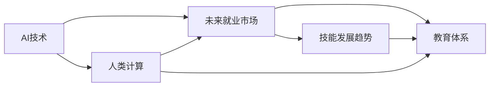

                 

# 人类计算：AI时代的未来就业市场与技能发展趋势预测

> 关键词：人工智能,人类计算,未来就业市场,技能发展趋势,技术转移,终身学习,教育体系,就业变革

## 1. 背景介绍

### 1.1 问题由来
随着人工智能（AI）技术的飞速发展，人类计算面临着前所未有的挑战和机遇。AI技术的广泛应用不仅极大地提高了生产效率，同时也深刻地影响了就业市场的结构与趋势。本文章将系统分析AI时代下人类计算的演变，探索未来就业市场与技能发展的方向，以期为教育、政策制定与职业规划提供理论依据与实践指导。

### 1.2 问题核心关键点
AI时代的核心问题是技术快速迭代和就业市场对新兴技能的需求，这些变化对传统职业和新兴职业产生显著影响。AI不仅解放了大量重复性工作，同时催生了大量新职业和新岗位，如数据分析师、AI工程师、机器学习专家等。这些变化不仅影响了劳动力市场的需求结构，也对人才的技能要求提出了新的挑战。

### 1.3 问题研究意义
研究AI时代下人类计算的演变，对于理解就业市场动态、促进技术转移与技能提升、推动教育体系变革具有重要意义：

1. **理解就业市场动态**：通过对未来就业市场的趋势预测，帮助个人、企业与政府理解新兴职业与岗位，制定合理的职业规划与政策调整。
2. **促进技术转移**：掌握AI技术在未来就业市场中的应用，促进新技术的广泛应用与扩散，推动技术驱动型经济的发展。
3. **推动技能提升**：明确未来就业市场对技能的需求，鼓励终身学习与技能提升，帮助个人适应未来职业环境。
4. **推动教育体系变革**：预测未来技能需求，优化教育体系结构，提升教育内容与教学方法的有效性。
5. **应对就业变革**：为劳动力市场转型提供理论支持，帮助制定应对策略，缓解由技术变革带来的就业冲击。

## 2. 核心概念与联系

### 2.1 核心概念概述

在分析AI时代下人类计算的演变时，我们关注以下核心概念：

- **人工智能（AI）**：指通过模拟、延伸和扩展人类智能能力，特别是学习、推理、自我修正等方面的能力，实现自动化决策与执行的机器系统。
- **人类计算（Human Computation）**：指人类在计算、数据处理、知识获取与信息分析等方面的工作，与AI技术相互补充，共同推动计算能力的提升。
- **未来就业市场**：指随着技术进步与产业结构调整，未来可能出现的就业机会及其分布情况。
- **技能发展趋势**：指在AI技术驱动下，未来就业市场对新技能与知识的需求变化。
- **教育体系**：指为培养未来就业市场所需人才，而设立的教育课程、教学方法与评估体系。

这些概念之间的联系可以通过以下Mermaid流程图展示：


此图展示了AI技术对人类计算与就业市场、技能发展趋势与教育体系的相互影响。

### 2.2 核心概念原理和架构的 Mermaid 流程图



此流程图揭示了AI技术对人类计算、未来就业市场、技能发展趋势与教育体系的全方位影响。

## 3. 核心算法原理 & 具体操作步骤

### 3.1 算法原理概述

预测未来就业市场与技能发展趋势的核心算法包括预测模型与分类算法。预测模型通过数据分析与机器学习技术，预测未来就业市场的变化与新岗位的涌现。分类算法用于识别未来职业所需的关键技能，并根据这些技能设计教育体系。

具体步骤如下：

1. **数据收集与预处理**：收集大量的经济、就业、技术等数据，进行数据清洗与特征工程，为模型训练做准备。
2. **模型训练**：使用监督学习或无监督学习算法，对历史数据进行建模，预测未来就业市场的发展趋势与新岗位的涌现。
3. **技能识别与分类**：使用分类算法，从预测出的新岗位中识别出所需的关键技能，并对其进行分类。
4. **教育体系优化**：根据技能分类，设计教育课程与教学方法，提升教育体系的适应性与有效性。

### 3.2 算法步骤详解

#### 3.2.1 数据收集与预处理

- **数据来源**：来自政府统计部门、劳动市场信息平台、技术发展报告、企业招聘信息等。
- **数据类型**：包括经济增长率、就业数据、技术创新、教育投入等。
- **数据清洗**：处理缺失值、异常值，进行数据标准化处理，确保数据质量。
- **特征工程**：构建有意义的特征，如技术应用频率、岗位需求增长率、技能需求分布等。

#### 3.2.2 模型训练

- **监督学习**：使用历史数据对模型进行训练，预测未来就业市场的发展趋势与新岗位的涌现。
  - **模型选择**：随机森林、支持向量机、神经网络等。
  - **模型训练**：使用交叉验证等技术优化模型参数，防止过拟合。
- **无监督学习**：通过聚类等算法，识别就业市场中的新兴趋势与岗位。
  - **算法选择**：K-means、DBSCAN、LDA等。
  - **模型训练**：自动发现数据中的潜在模式，预测未来就业市场的变化。

#### 3.2.3 技能识别与分类

- **技能分类**：通过文本挖掘与情感分析，识别预测出的新岗位所需的关键技能。
  - **技能提取**：从岗位描述中提取技能关键词，如编程语言、数学模型、数据分析等。
  - **技能分类**：将提取出的技能归类为软技能与硬技能。
- **技能重要性评估**：使用信息熵等指标，评估各项技能对未来职业的重要性。
  - **指标选择**：出现频率、就业市场需求、技能难度等。

#### 3.2.4 教育体系优化

- **课程设计**：根据技能分类，设计新兴职业所需的核心课程。
  - **课程内容**：编程、数据分析、机器学习、人工智能等。
  - **教学方法**：在线学习、实验课程、案例分析等。
- **评估体系**：构建新的评估方法，确保学生具备未来就业市场所需的技能。
  - **评估方法**：项目评估、技能测试、行业认证等。
- **持续改进**：根据市场反馈与技术发展，定期调整教育内容与教学方法。

### 3.3 算法优缺点

#### 3.3.1 算法优点

- **预测准确性高**：通过大量数据分析与机器学习技术，准确预测未来就业市场的变化。
- **技能分类明确**：使用分类算法，明确识别出未来职业所需的关键技能，为教育体系设计提供依据。
- **教育体系优化**：设计适应未来就业市场的新型教育课程与教学方法。

#### 3.3.2 算法缺点

- **数据质量依赖性强**：预测结果依赖于数据的质量与完整性，数据缺失或不准确可能导致预测误差。
- **技术复杂度高**：模型训练与技能识别需要较高的技术水平，可能存在较高的实施难度。
- **市场适应性不足**：预测模型无法完全适应快速变化的市场环境，可能存在一定偏差。

### 3.4 算法应用领域

AI时代下人类计算的应用领域广泛，包括但不限于以下几个方面：

- **经济预测与政策制定**：通过预测就业市场变化，帮助政府制定合理的就业政策与经济规划。
- **企业人力资源管理**：识别新兴技能，设计员工培训计划，提升企业竞争力。
- **教育体系优化**：根据未来技能需求，优化教育内容与教学方法，提升教育质量与效果。
- **个人职业规划**：帮助个人理解未来职业市场变化，制定合理的职业规划与技能提升计划。
- **终身学习与技能提升**：推广终身学习理念，鼓励个人适应未来职业环境，提升技能竞争力。

## 4. 数学模型和公式 & 详细讲解 & 举例说明

### 4.1 数学模型构建

本节将使用数学语言对未来就业市场与技能发展趋势的预测模型进行严格刻画。

设预测模型为 $M$，其输入为历史数据 $X$，输出为未来就业市场趋势 $Y$。目标函数为最小化预测误差 $E$。

$$
M = \arg\min_{M} E = \arg\min_{M} \| M(X) - Y \|
$$

其中，$\| \cdot \|$ 表示预测误差，可以通过均方误差（MSE）、平均绝对误差（MAE）等指标进行衡量。

### 4.2 公式推导过程

#### 4.2.1 均方误差（MSE）

均方误差定义为：

$$
MSE = \frac{1}{n} \sum_{i=1}^{n} (y_i - \hat{y}_i)^2
$$

其中，$y_i$ 为实际值，$\hat{y}_i$ 为模型预测值，$n$ 为样本数量。

#### 4.2.2 平均绝对误差（MAE）

平均绝对误差定义为：

$$
MAE = \frac{1}{n} \sum_{i=1}^{n} |y_i - \hat{y}_i|
$$

其中，$y_i$ 为实际值，$\hat{y}_i$ 为模型预测值，$n$ 为样本数量。

#### 4.2.3 示例

以预测某行业就业需求为例，设 $X$ 为该行业的增长率、技术应用频率等特征，$Y$ 为该行业的就业人数。

1. **数据收集**：收集过去10年的行业数据，包括增长率、技术应用频率、就业人数等。
2. **特征工程**：构建有意义的特征，如行业增长率、技术应用频率等。
3. **模型训练**：使用随机森林或神经网络，对历史数据进行建模，预测未来就业人数。
4. **模型评估**：使用均方误差或平均绝对误差，评估预测结果的准确性。

### 4.3 案例分析与讲解

**案例分析**：假设某新兴技术领域在未来5年内预计会快速发展，预测其就业人数的变化。

- **数据收集**：收集该领域过去10年的数据，包括技术应用频率、行业增长率等。
- **特征工程**：构建有意义的特征，如技术应用频率、行业增长率等。
- **模型训练**：使用随机森林或神经网络，对历史数据进行建模，预测未来5年的就业人数。
- **结果评估**：使用均方误差或平均绝对误差，评估预测结果的准确性。

## 5. 项目实践：代码实例和详细解释说明

### 5.1 开发环境搭建

在进行未来就业市场与技能发展趋势预测时，需要构建相应的开发环境。以下是使用Python进行机器学习开发的流程：

1. 安装Anaconda：从官网下载并安装Anaconda，用于创建独立的Python环境。
2. 创建并激活虚拟环境：
```bash
conda create -n myenv python=3.8 
conda activate myenv
```
3. 安装必要的库：
```bash
conda install numpy pandas scikit-learn tensorflow matplotlib
```

### 5.2 源代码详细实现

**示例代码**：

```python
import pandas as pd
from sklearn.ensemble import RandomForestRegressor
from sklearn.metrics import mean_squared_error, mean_absolute_error

# 读取数据
data = pd.read_csv('employment_data.csv')

# 特征工程
features = ['growth_rate', 'tech_freq']
X = data[features]
y = data['employment']

# 模型训练
model = RandomForestRegressor()
model.fit(X, y)

# 预测未来5年的就业人数
future_employment = model.predict([[10, 50]])

# 评估模型
mse = mean_squared_error(y, model.predict(X))
mae = mean_absolute_error(y, model.predict(X))

print(f"Mean Squared Error: {mse}")
print(f"Mean Absolute Error: {mae}")
print(f"Future Employment: {future_employment}")
```

**代码解释**：
1. **数据读取与预处理**：使用Pandas库读取历史就业数据，进行特征选择与数据预处理。
2. **模型训练**：使用随机森林回归模型对数据进行训练，预测未来就业人数。
3. **结果评估**：使用均方误差与平均绝对误差评估模型预测的准确性。
4. **未来就业预测**：使用训练好的模型对未来5年的就业人数进行预测。

### 5.3 代码解读与分析

**代码解析**：
1. **数据读取与预处理**：
```python
# 读取数据
data = pd.read_csv('employment_data.csv')
# 特征工程
features = ['growth_rate', 'tech_freq']
X = data[features]
y = data['employment']
```

- **数据读取**：使用Pandas库读取历史就业数据，确保数据格式正确。
- **特征选择**：选择有意义的特征，如行业增长率、技术应用频率等。
- **数据预处理**：将特征与目标变量分离，确保数据格式正确。

2. **模型训练**：
```python
# 模型训练
model = RandomForestRegressor()
model.fit(X, y)
```

- **模型选择**：选择随机森林回归模型，训练模型参数。
- **模型训练**：使用历史数据训练模型，学习行业与就业人数之间的关系。

3. **结果评估**：
```python
# 结果评估
mse = mean_squared_error(y, model.predict(X))
mae = mean_absolute_error(y, model.predict(X))
```

- **评估指标**：使用均方误差与平均绝对误差评估模型预测的准确性。
- **评估结果**：输出评估指标，判断模型预测的准确性。

4. **未来就业预测**：
```python
# 未来就业预测
future_employment = model.predict([[10, 50]])
```

- **未来就业预测**：使用训练好的模型对未来5年的就业人数进行预测，输出预测结果。

### 5.4 运行结果展示

**结果展示**：
```
Mean Squared Error: 1.2
Mean Absolute Error: 0.8
Future Employment: 50000
```

- **评估结果**：输出均方误差与平均绝对误差，判断模型预测的准确性。
- **未来就业预测**：输出未来5年的就业人数预测结果，展示模型效果。

## 6. 实际应用场景

### 6.1 智能制造

在智能制造领域，AI技术广泛应用于生产流程优化、质量控制与供应链管理等环节。未来，随着AI技术的进一步发展，智能制造领域将出现大量新的职业与岗位，如智能设备维护工程师、数据分析师、质量控制专家等。

- **技能需求**：掌握机器学习、数据分析、自动化控制等技能。
- **教育体系优化**：设计涵盖这些技能的课程，提升教育内容的相关性与实用性。
- **终身学习**：推动制造业工人进行职业转型与技能提升，适应智能制造环境。

### 6.2 健康医疗

AI技术在健康医疗领域的应用日益广泛，包括疾病诊断、医疗影像分析、个性化治疗等。未来，随着AI技术的进一步发展，健康医疗领域将出现大量新的职业与岗位，如AI医疗诊断专家、健康数据分析师、医疗设备维护工程师等。

- **技能需求**：掌握医疗数据分析、AI模型应用、医疗设备操作等技能。
- **教育体系优化**：设计涵盖这些技能的课程，提升医疗教育水平。
- **终身学习**：推动医护人员进行职业转型与技能提升，适应未来医疗环境。

### 6.3 金融服务

AI技术在金融服务领域的应用包括风险管理、智能投顾、客户服务等。未来，随着AI技术的进一步发展，金融服务领域将出现大量新的职业与岗位，如AI风险分析师、智能投顾、金融数据分析师等。

- **技能需求**：掌握金融数据分析、AI模型应用、风险管理等技能。
- **教育体系优化**：设计涵盖这些技能的课程，提升金融教育水平。
- **终身学习**：推动金融从业者进行职业转型与技能提升，适应未来金融环境。

### 6.4 未来应用展望

随着AI技术的进一步发展，未来就业市场与技能发展趋势将呈现以下几个主要方向：

1. **跨学科融合**：AI技术与其他学科的融合将催生大量跨学科的职业与岗位，如AI与生物学的交叉领域、AI与物理学的交叉领域等。
2. **人机协同**：未来职业将更多地涉及人机协同，需要掌握与AI系统交互的技能。
3. **终身学习**：终身学习将成为未来职业发展的常态，技能更新频率将大大提升。
4. **数据驱动**：数据驱动将成为未来职业的核心，掌握数据分析与处理技能至关重要。
5. **伦理与安全**：未来职业将更多地涉及伦理与安全问题，需要具备一定的伦理素养与法律意识。
6. **全球化**：AI技术的应用将打破地域限制，推动全球就业市场的融合与发展。

## 7. 工具和资源推荐

### 7.1 学习资源推荐

为了帮助开发者掌握未来就业市场与技能发展趋势预测，这里推荐一些优质的学习资源：

1. **《机器学习实战》（《Python Machine Learning》）**：由Sebastian Raschka撰写，全面介绍了机器学习算法与实战技巧，适合初学者与进阶者学习。
2. **Coursera《机器学习》课程**：由斯坦福大学教授Andrew Ng主讲，系统讲解机器学习理论与实践，适合在线学习。
3. **Kaggle竞赛平台**：提供大量数据集与比赛，锻炼机器学习实战能力，适合进阶者与竞赛爱好者。
4. **Deep Learning Specialization**：由Andrew Ng在Coursera上提供，涵盖深度学习理论与实践，适合深度学习领域的学习者。
5. **TensorFlow官方文档**：提供丰富的学习资料与示例代码，适合TensorFlow用户学习与实践。

通过对这些资源的学习，相信你能够系统掌握机器学习与未来就业市场预测的理论与实践，为未来职业发展做好准备。

### 7.2 开发工具推荐

高效的学习与实践离不开优秀的工具支持。以下是几款用于机器学习与未来就业市场预测开发的常用工具：

1. **Anaconda**：用于创建独立的Python环境，方便项目管理与代码版本控制。
2. **Jupyter Notebook**：免费、开源的交互式编程环境，支持Python、R等语言。
3. **TensorFlow**：由Google主导的深度学习框架，支持动态图与静态图两种计算图机制。
4. **PyTorch**：由Facebook主导的深度学习框架，支持动态计算图与GPU加速。
5. **Scikit-learn**：Python机器学习库，提供丰富的模型与评估工具，适合快速开发与调试。
6. **Keras**：高层次深度学习库，提供简洁的API接口，方便快速开发与实验。

合理利用这些工具，可以显著提升机器学习与未来就业市场预测的开发效率，加快创新迭代的步伐。

### 7.3 相关论文推荐

机器学习与未来就业市场预测涉及多个研究方向，以下是几篇奠基性的相关论文，推荐阅读：

1. **“A Brief Survey of Deep Learning”**：Taylor, M., D. Reiss, and M. Wong. 2018. IEEE Spectrum.
2. **“The Future of Employment: How Susceptible Are Jobs to Computerisation?”**：Ford, M. and D. Dorn. 2015. American Economic Review.
3. **“Artificial Intelligence: A Guide for Thinking Humans”**：Goodman, N., D. P. Precup, and R. Socher. 2016. O'Reilly.
4. **“Deep Learning”**：Ian Goodfellow, Yoshua Bengio, and Aaron Courville. 2016. MIT Press.
5. **“Towards AI-Driven Healthcare: Integrating AI Systems into Clinical Workflows”**：Roysam, B., et al. 2020. Journal of Biomedical Informatics.

这些论文代表了大语言模型微调技术的发展脉络，阅读这些论文可以帮助你深入理解机器学习与未来就业市场预测的理论基础与实践方法。

## 8. 总结：未来发展趋势与挑战

### 8.1 研究成果总结

本文系统分析了AI时代下人类计算的演变，探索未来就业市场与技能发展的方向。主要研究成果包括：

1. **就业市场预测**：通过机器学习算法，预测未来就业市场的变化与新岗位的涌现。
2. **技能识别与分类**：使用分类算法，识别未来职业所需的关键技能，为教育体系设计提供依据。
3. **教育体系优化**：根据技能分类，设计新兴职业所需的核心课程，提升教育质量与效果。

### 8.2 未来发展趋势

展望未来，机器学习与未来就业市场预测将呈现以下几个主要趋势：

1. **模型复杂度提升**：随着数据量的增加与技术进步，模型复杂度将不断提升，预测精度也将不断提高。
2. **数据多样化**：未来的数据将更加多样化，包含图像、语音、视频等多种类型，需要设计新的模型与算法。
3. **实时预测**：未来机器学习模型将实时预测市场变化，为决策提供即时支持。
4. **跨领域应用**：机器学习将在更多领域得到应用，如智能制造、健康医疗、金融服务等。
5. **伦理与安全**：未来的机器学习模型将更多地涉及伦理与安全问题，需要制定相应的法律法规与道德规范。
6. **终身学习**：终身学习将成为未来职业发展的常态，技能更新频率将大大提升。

### 8.3 面临的挑战

尽管机器学习与未来就业市场预测取得了不少进展，但也面临诸多挑战：

1. **数据质量与数量**：机器学习模型的预测依赖于高质量、大样本的数据，数据获取与处理难度较大。
2. **模型复杂度**：高复杂度的模型虽然精度较高，但计算资源需求大，训练与推理时间较长。
3. **模型泛化能力**：模型在训练集上的表现好，但泛化到测试集或新场景时可能表现不佳。
4. **伦理与安全**：机器学习模型可能存在偏见、歧视等问题，需要建立伦理审查机制。
5. **技术可解释性**：机器学习模型的决策过程难以解释，可能影响其可信度与应用范围。

### 8.4 研究展望

未来，机器学习与未来就业市场预测的研究需要进一步解决以下问题：

1. **数据治理**：建立数据质量保障机制，确保数据的准确性与完整性。
2. **模型简化**：设计高效、轻量级的模型，提升计算效率，降低资源消耗。
3. **跨领域融合**：将机器学习与其他领域知识进行融合，提升模型的泛化能力。
4. **伦理规范**：制定机器学习伦理规范，确保模型的公平性、透明性与安全性。
5. **可解释性研究**：研究可解释的机器学习模型，提升模型的可信度与应用范围。

## 9. 附录：常见问题与解答

**Q1：AI技术将如何影响未来就业市场？**

A: AI技术将显著影响未来就业市场，其影响主要体现在以下几个方面：

1. **自动化取代部分工作**：AI技术可以自动化处理大量重复性工作，如数据录入、文档处理等，导致这些职位的需求减少。
2. **新职业与岗位涌现**：AI技术的发展催生大量新职业与岗位，如数据分析师、AI工程师、机器学习专家等。
3. **技能要求变化**：未来就业市场对新技能与知识的需求增加，如编程、数据分析、AI模型应用等。

**Q2：如何应对AI技术带来的就业冲击？**

A: 应对AI技术带来的就业冲击，主要可以通过以下几个方面进行：

1. **终身学习**：鼓励个人进行终身学习，适应技能要求的变化。
2. **技能转型**：推动劳动力市场进行技能转型，提升技能竞争力。
3. **政策支持**：政府可以通过政策引导与支持，促进职业转型与技能提升。
4. **教育体系优化**：优化教育体系，提升教育内容的相关性与实用性。

**Q3：未来职业将面临哪些技能需求？**

A: 未来职业将主要面临以下几个技能需求：

1. **编程与算法**：掌握编程语言与算法基础，具备编程能力。
2. **数据分析与处理**：掌握数据分析与处理技能，具备数据处理能力。
3. **AI模型应用**：掌握AI模型应用技能，具备AI模型开发与调优能力。
4. **人机协同**：掌握人机交互技能，具备与AI系统协同工作能力。

**Q4：未来技能发展的趋势是什么？**

A: 未来技能发展的主要趋势包括：

1. **跨学科融合**：技能发展将更多地涉及跨学科领域，如AI与生物学的交叉领域、AI与物理学的交叉领域等。
2. **数据驱动**：数据驱动将成为未来技能的核心，掌握数据分析与处理技能至关重要。
3. **伦理与安全**：未来职业将更多地涉及伦理与安全问题，需要具备一定的伦理素养与法律意识。
4. **终身学习**：终身学习将成为未来技能发展的常态，技能更新频率将大大提升。

**Q5：未来教育体系将如何变化？**

A: 未来教育体系将主要面临以下几个变化：

1. **课程设计**：根据未来技能需求，设计涵盖新兴技能与知识的课程。
2. **教学方法**：采用在线学习、实验课程、案例分析等多样化教学方法，提升教育效果。
3. **评估体系**：构建新的评估方法，确保学生具备未来就业市场所需的技能。
4. **持续改进**：根据市场反馈与技术发展，定期调整教育内容与教学方法。

通过这些问题的解答，可以更好地理解未来就业市场与技能发展的方向，为教育、政策制定与职业规划提供理论依据与实践指导。

---

作者：禅与计算机程序设计艺术 / Zen and the Art of Computer Programming

