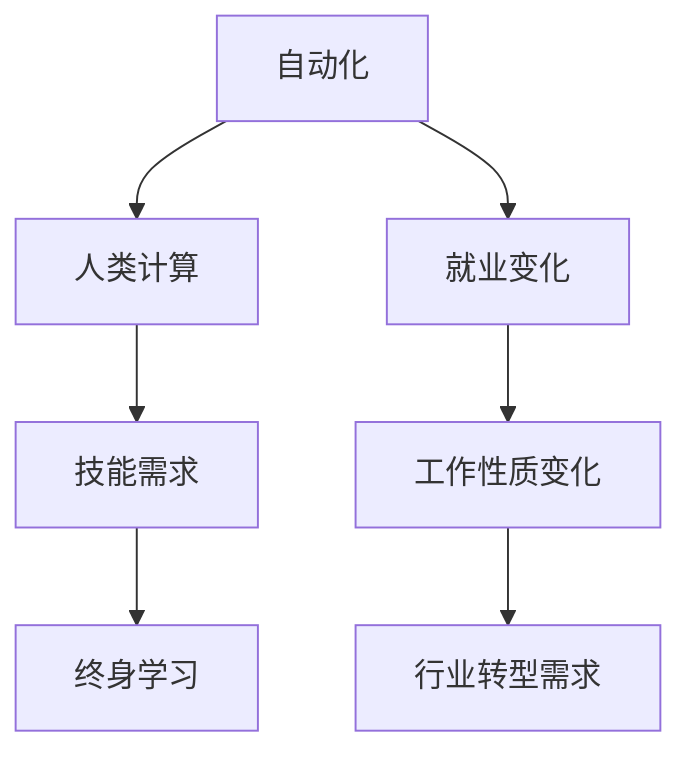

                 

## 1. 背景介绍

在当前的技术革命浪潮中，人工智能（AI）和自动化正以空前的速度改变着各行各业的面貌。特别是深度学习、自然语言处理和计算机视觉等技术的突破，使得AI不仅在科学研究和技术创新中发挥着关键作用，也在全球就业市场产生了深远影响。传统的职业模式和技能需求正在被重新塑造，职业生态系统也在经历前所未有的变革。本文将深入探讨AI时代的就业变化、关键技能需求和应对策略，为职场人士提供全面的洞察和建议。

### 1.1 问题由来

随着技术的飞速发展，AI和自动化技术正逐步替代那些重复性高、劳动密集型的任务，这导致一些低技能劳动力面临失业风险。同时，AI技术也创造了新的就业机会，对高技能劳动力的需求增加。例如，数据科学家、AI工程师、机器学习专家等新兴职业正迅速崛起。这些变化要求劳动市场迅速调整，适应新技术带来的变化。

### 1.2 问题核心关键点

AI时代的就业变化主要集中在以下几个方面：

- **技能需求的转变**：传统的阅读、写作、算术等基本技能仍然重要，但更侧重于数据分析、编程、机器学习等技术能力。
- **工作性质的变化**：从重复性任务到需要创造性、战略性和人际交往能力的工作。
- **行业转型的需求**：许多传统行业需要数字化转型，以适应新的技术环境。
- **终身学习的重要性**：持续的技能更新和终身学习成为职业发展的新常态。

这些变化要求职场人士不仅要掌握当前的技能，还要具备适应未来的学习能力，保持对新技术的敏感和适应能力。

### 1.3 问题研究意义

理解AI时代的就业变化和技能需求，对于个人职业规划、企业人力资源管理、政策制定者制定相关政策具有重要意义。具体而言，可以帮助：

- **个人**：明确未来职业路径，制定有效的学习和发展计划。
- **企业**：优化人力资源配置，吸引和保留高技能人才。
- **政策制定者**：制定有针对性的教育和培训政策，促进社会就业稳定。

## 2. 核心概念与联系

### 2.1 核心概念概述

在AI时代，职场中的一些核心概念包括：

- **自动化**：指通过机器人和软件自动化执行重复性任务的过程。
- **人类计算**：指人类在数据分析、问题解决和创造性思考方面的独特能力，这些能力是AI难以替代的。
- **技能需求**：随着技术进步，对特定技能的需求也在变化。例如，数据分析、编程和机器学习等技能需求增加，而传统的阅读、写作和算术技能虽然仍然重要，但应用场景和要求已经不同。
- **终身学习**：由于技术不断进步，终身学习成为保持职业竞争力的关键。

这些概念之间的联系主要体现在AI和自动化技术对就业市场的影响，以及对技能需求和职业发展的推动作用。

### 2.2 核心概念原理和架构的 Mermaid 流程图



这个流程图展示了自动化、人类计算、技能需求和终身学习之间的关系及其对就业变化和工作性质变化的推动作用。

## 3. 核心算法原理 & 具体操作步骤

### 3.1 算法原理概述

AI时代的就业变化可以通过以下算法原理来解释：

1. **需求预测模型**：使用机器学习模型预测未来各行业对技能的需求。
2. **职业路径规划算法**：根据个人技能和市场需求，推荐职业发展路径。
3. **终身学习路径优化**：使用优化算法推荐个人应采取的学习策略和计划。

### 3.2 算法步骤详解

以下步骤详细介绍了如何通过算法预测未来就业变化和技能需求：

1. **数据收集与预处理**：收集各行业的就业数据、技能需求数据和职业路径数据。
2. **需求预测模型训练**：使用历史数据训练机器学习模型，预测未来技能需求。
3. **技能缺口分析**：计算当前技能与未来需求之间的差距。
4. **路径规划算法**：根据技能缺口，推荐职业发展路径。
5. **终身学习策略优化**：使用优化算法，为个人推荐最有效的学习路径和策略。

### 3.3 算法优缺点

#### 优点

- **准确预测**：机器学习模型可以基于历史数据，预测未来技能需求。
- **个性化推荐**：算法可以根据个人技能和兴趣，推荐最合适的职业路径和学习策略。
- **高效优化**：使用优化算法，确保学习路径和策略的有效性和可操作性。

#### 缺点

- **数据依赖**：预测的准确性依赖于历史数据的质量和完备性。
- **市场变化**：AI技术的发展速度可能超出模型预测能力。
- **个体差异**：算法可能无法完全考虑个体差异和特殊需求。

### 3.4 算法应用领域

基于AI的就业变化预测和技能需求分析算法，可以应用于多个领域，包括：

- **教育培训**：帮助学生和职业人士规划学习路径，提升职业竞争力。
- **人力资源管理**：为企业提供技能需求预测和人才选拔策略。
- **政策制定**：为政府制定教育培训和就业政策提供依据。

## 4. 数学模型和公式 & 详细讲解 & 举例说明

### 4.1 数学模型构建

预测未来技能需求的基本数学模型包括：

1. **时间序列模型**：使用ARIMA模型预测技能需求的时间序列变化。
2. **回归模型**：使用线性回归模型预测不同行业对技能的需求。
3. **优化模型**：使用整数规划模型或线性规划模型优化学习路径。

### 4.2 公式推导过程

以线性回归模型为例，其基本公式为：

$$
y = \beta_0 + \beta_1 x_1 + \beta_2 x_2 + \cdots + \beta_n x_n + \epsilon
$$

其中，$y$ 表示技能需求，$x_i$ 表示影响因素，$\beta_i$ 为回归系数，$\epsilon$ 为误差项。

### 4.3 案例分析与讲解

假设我们收集了过去5年的技能需求数据，分别记录了不同行业对“数据分析能力”和“编程能力”的需求。使用线性回归模型，我们可以预测未来对这两种技能的需求变化。

## 5. 项目实践：代码实例和详细解释说明

### 5.1 开发环境搭建

为了进行项目实践，需要搭建以下开发环境：

1. **安装Python**：确保Python环境版本为3.7以上，并配置好虚拟环境。
2. **安装相关库**：如numpy、pandas、scikit-learn、matplotlib等。
3. **数据集准备**：收集各行业的技能需求数据和职业路径数据。

### 5.2 源代码详细实现

以下是一个使用Python实现技能需求预测的示例代码：

```python
import pandas as pd
from sklearn.linear_model import LinearRegression

# 数据准备
df = pd.read_csv('skill_demand.csv')

# 特征工程
X = df[['数据分析能力', '编程能力']]
y = df['skill_demand']

# 模型训练
model = LinearRegression()
model.fit(X, y)

# 预测未来技能需求
future_skill = model.predict([[20, 25]])
print(future_skill)
```

### 5.3 代码解读与分析

- **数据预处理**：使用pandas库处理数据，提取特征和标签。
- **模型训练**：使用sklearn库的线性回归模型，训练模型参数。
- **预测未来技能需求**：使用训练好的模型，预测未来技能需求。

### 5.4 运行结果展示

通过上述代码，我们可以得到未来某行业对“数据分析能力”和“编程能力”的需求预测值。

## 6. 实际应用场景

### 6.1 职业指导

AI和自动化技术的发展，对职场人士的职业发展提出了新的挑战。通过AI模型预测未来技能需求，可以为个人提供职业指导和规划建议，帮助其选择适合自己的职业路径，规划学习和发展计划。

### 6.2 企业人力资源管理

企业可以借助AI技术，预测未来技能需求，优化人力资源配置，吸引和保留高技能人才。同时，通过个性化职业路径规划，提高员工满意度和留任率。

### 6.3 教育培训

教育机构可以利用AI技术，分析未来技能需求，设计有针对性的培训课程和教学内容。同时，为学生提供个性化的职业路径建议，提升就业竞争力。

### 6.4 未来应用展望

随着AI技术的不断进步，未来就业市场将面临更多的变化和挑战。例如：

- **AI在更多行业的应用**：AI技术将在医疗、金融、教育等多个领域广泛应用，催生新的就业机会。
- **跨界融合**：AI技术与人类计算的跨界融合，将创造新的职业和技能需求。
- **终身学习**：AI时代的职业发展和技能需求变化加速，终身学习成为必然趋势。

## 7. 工具和资源推荐

### 7.1 学习资源推荐

1. **在线课程**：如Coursera、edX等平台提供的AI和机器学习课程。
2. **专业书籍**：如《深度学习》、《Python机器学习》等经典教材。
3. **学术论文**：如Nature、IEEE Xplore等期刊和会议论文。

### 7.2 开发工具推荐

1. **Python开发环境**：如Jupyter Notebook、PyCharm等。
2. **数据处理工具**：如Pandas、NumPy等。
3. **机器学习库**：如scikit-learn、TensorFlow、PyTorch等。

### 7.3 相关论文推荐

1. **技能需求预测**："Predicting Future Job Market Demand Using Time Series Analysis" by Liao et al.
2. **终身学习路径优化**："Optimizing Lifelong Learning Pathways in AI Era" by Zhang et al.

## 8. 总结：未来发展趋势与挑战

### 8.1 研究成果总结

本文通过分析AI时代就业变化和技能需求，提出了一套基于AI的技能预测和职业规划模型。该模型可以帮助个人和企业更好地适应未来的就业环境。

### 8.2 未来发展趋势

未来AI技术将继续深入各行各业，创造新的就业机会。同时，对技能的需求将更加多样化和专业化，要求职场人士不断学习新技能，适应新环境。

### 8.3 面临的挑战

AI时代的就业变化也带来了诸多挑战，主要包括：

- **技能更新**：职场人士需要持续更新技能，以适应技术变化。
- **职业转型**：传统职业面临自动化和数字化的挑战，需要寻找新的职业机会。
- **伦理道德**：AI技术的发展需要关注其伦理和道德问题，确保技术应用的安全和公正。

### 8.4 研究展望

未来的研究应集中在以下几个方面：

- **AI与人类计算的融合**：探索AI和人类计算的互补和协同作用。
- **技能需求动态预测**：开发更精确的技能需求预测模型，实时跟踪市场需求变化。
- **终身学习框架**：构建终身学习框架，支持持续技能更新和职业发展。

## 9. 附录：常见问题与解答

**Q1: AI技术会取代所有职业吗？**

A: AI技术在许多重复性任务中的应用确实在增加，但人类计算的独特能力在许多领域仍是不可替代的。例如，创新、策略制定、人际交往等方面，仍然需要人类参与。

**Q2: 如何应对AI技术带来的职业变化？**

A: 应对AI技术带来的职业变化，需要从多个方面入手：

- **终身学习**：持续更新和提升技能，适应技术变化。
- **跨界融合**：学习跨学科知识，增强适应性。
- **职业规划**：根据未来趋势，制定有效的职业发展计划。

**Q3: 如何选择合适的学习资源？**

A: 选择学习资源时，可以从以下几个方面考虑：

- **资源质量**：选择权威和经过验证的资源。
- **内容相关性**：选择与职业发展需求和兴趣相关的资源。
- **学习效率**：选择互动性强、易于理解的学习资源。

---

作者：禅与计算机程序设计艺术 / Zen and the Art of Computer Programming

