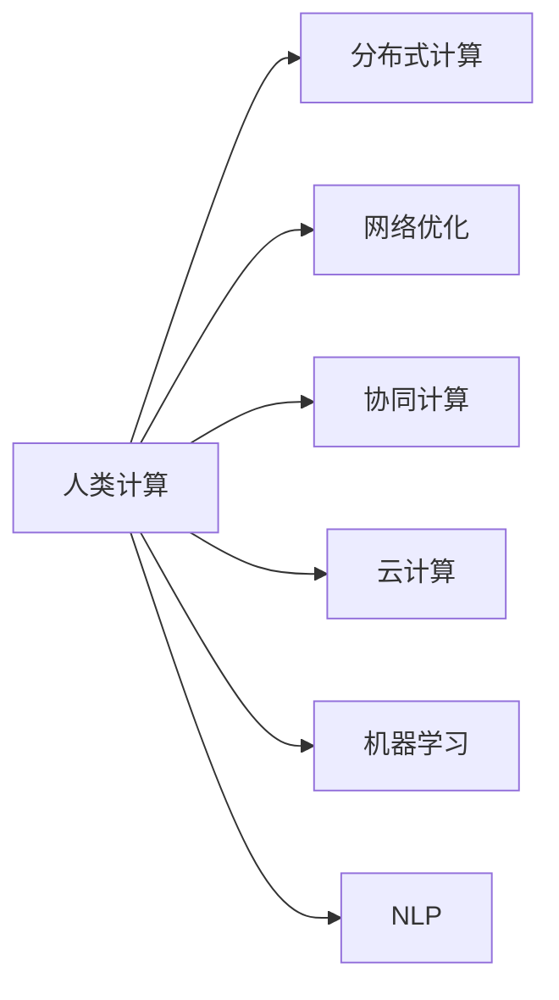

                 

# 人类计算：应用与案例分析

> 关键词：
- 人类计算
- 分布式计算
- 网络优化
- 协同计算
- 云计算
- 机器学习
- 自然语言处理

## 1. 背景介绍

在信息化快速发展的今天，计算任务不再仅限于传统的数值计算和科学计算领域，越来越多的业务场景需要高效、可靠、实时的计算支持。这其中，人类计算（Human Computing）正逐渐成为一个热点，成为计算科学与人工智能领域的重要研究方向。人类计算充分利用人类的认知能力，将复杂问题划分为可计算的子问题，并通过协作完成解决方案的构建，其本质是利用人的计算能力解决机器难以处理的问题。

本文章聚焦于人类计算的原理与应用，将通过详细分析经典案例，探讨人类计算在各类场景中的应用，并对其未来发展进行展望。文章将分为以下几个部分进行展开：人类计算的概述、核心概念与联系、算法原理与具体操作步骤、数学模型与公式、项目实践案例、实际应用场景、工具与资源推荐、总结与发展挑战等。

## 2. 核心概念与联系

### 2.1 核心概念概述

人类计算（Human Computing），即充分利用人类智力与知识来解决复杂的计算问题，尤其是在机器难以胜任的领域，如创新、创造、批判性思维等。与机器计算相比，人类计算具有更强的灵活性、适应性和创新能力。

- **分布式计算（Distributed Computing）**：利用多个计算资源同时处理计算任务，提升计算效率，优化资源分配。

- **网络优化（Network Optimization）**：通过算法设计优化网络传输和计算路径，提升数据传输和计算效率。

- **协同计算（Collaborative Computing）**：通过协同工作方式，将复杂的计算问题分解为多个小问题，每个小问题由不同的人员或计算单元处理，最终通过协作求解。

- **云计算（Cloud Computing）**：利用互联网提供动态、可扩展的计算资源，用户按需使用，不需要配置和维护计算资源。

- **机器学习（Machine Learning）**：通过训练模型，让机器具备一定的学习能力和智能决策能力，从而实现自动化、智能化的计算。

- **自然语言处理（Natural Language Processing, NLP）**：研究如何使计算机理解、处理和生成自然语言，使其具备人类语言的智能。

这些核心概念通过Mermaid流程图展现其联系：



## 3. 核心算法原理 & 具体操作步骤

### 3.1 算法原理概述

人类计算的核心算法包括分布式算法、协同算法、机器学习算法等。这些算法通过协调多个计算节点或人员，将复杂的计算任务分解成多个子问题，并通过协作解决。

以分布式算法为例，其基本原理是：

1. **任务分解**：将大任务分解为多个子任务。
2. **并行计算**：每个子任务由不同的计算节点或人员并行计算。
3. **结果汇总**：将各个计算节点的结果汇总，生成最终解决方案。

### 3.2 算法步骤详解

**分布式算法步骤**：

1. **任务划分**：将大任务划分为多个子任务，每个子任务计算需求相对简单。
2. **分配计算节点**：将子任务分配到不同的计算节点，确保每个节点任务计算复杂度相当。
3. **并行计算**：每个计算节点并行计算各自的任务。
4. **结果合并**：将每个节点的计算结果合并，生成最终计算结果。

**协同算法步骤**：

1. **问题建模**：将计算问题建模为可分解的子问题。
2. **分配任务**：将子任务分配给不同的计算节点或人员。
3. **协作求解**：每个节点或人员独立求解，并进行必要的信息交换。
4. **结果汇总**：将所有计算结果汇总，生成最终解决方案。

**机器学习算法步骤**：

1. **数据准备**：收集、处理、清洗数据。
2. **模型训练**：使用训练数据训练机器学习模型。
3. **模型优化**：通过验证数据集评估模型性能，优化模型参数。
4. **模型应用**：使用模型进行预测、分类、聚类等计算任务。

### 3.3 算法优缺点

**分布式算法优点**：

- 提升计算效率：多个计算节点并行计算，缩短任务处理时间。
- 灵活性高：可以根据计算资源状况，动态调整任务分配。
- 容错性好：某个计算节点故障不会影响整体任务执行。

**分布式算法缺点**：

- 通信开销：节点之间通信增加额外开销。
- 资源浪费：每个节点都需要配置计算资源，资源利用率不高。
- 管理复杂：需要复杂的任务调度、负载均衡算法。

**协同算法优点**：

- 充分利用人类智力：能够解决机器难以处理的复杂问题。
- 协同效率高：通过信息交换和协作，快速解决问题。
- 灵活性高：适应多种场景和任务。

**协同算法缺点**：

- 信息共享困难：跨团队协作需要良好的沟通机制。
- 人员协调复杂：需要管理和协调多个计算节点或人员。
- 风险管理：协同计算容易受到人员参与度、技能水平等因素影响。

**机器学习算法优点**：

- 自动化程度高：训练模型后，可自动化处理计算任务。
- 可解释性好：模型训练过程和结果可解释，便于理解和调试。
- 准确性高：通过大量数据训练，模型精度高。

**机器学习算法缺点**：

- 数据需求高：需要大量高质量标注数据。
- 计算资源需求高：模型训练需要强大的计算资源支持。
- 可解释性不足：复杂的模型难以理解其内部决策过程。

### 3.4 算法应用领域

人类计算应用广泛，覆盖了科研、工程、医疗、金融、教育等多个领域。

- **科研**：利用人类计算进行科学发现，如分子结构模拟、气候变化预测等。
- **工程**：在产品设计、制造、测试等过程中，利用协同计算提升效率。
- **医疗**：通过机器学习优化医疗影像诊断、药物研发等。
- **金融**：利用协同计算优化交易策略，提升市场分析能力。
- **教育**：在在线教育、协作学习等场景中，利用分布式计算提升教学效果。

## 4. 数学模型和公式 & 详细讲解

### 4.1 数学模型构建

假设我们有一个复杂计算任务，需要处理的数据量为 $N$，计算任务复杂度为 $C$，计算资源为 $R$。

**分布式算法模型**：

- 任务并行度为 $P$，每个子任务的计算复杂度为 $C'$
- 计算资源分配为 $R_1, R_2, ..., R_P$
- 任务执行时间为 $T$

**协同算法模型**：

- 参与计算的人数为 $H$
- 每个计算人员的计算速度为 $V$
- 任务执行时间为 $T$
- 信息交换的通信开销为 $C$

**机器学习模型**：

- 训练数据集为 $D$
- 模型参数为 $\theta$
- 损失函数为 $L(\theta)$
- 训练迭代次数为 $I$
- 训练时间复杂度为 $T$

### 4.2 公式推导过程

以分布式算法为例，其执行时间 $T$ 可以表示为：

$$
T = \frac{N}{P} \cdot C' + \sum_{i=1}^P \frac{C'}{R_i}
$$

其中，$\frac{N}{P}$ 为每个子任务的处理数据量，$C'$ 为每个子任务的计算复杂度，$\sum_{i=1}^P \frac{C'}{R_i}$ 为通信开销和计算开销的总和。

对于协同算法，任务执行时间 $T$ 可以表示为：

$$
T = H \cdot V \cdot (1 + \frac{C}{H \cdot V})
$$

其中，$H \cdot V$ 为每个计算人员的计算速度，$\frac{C}{H \cdot V}$ 为信息交换的通信开销。

对于机器学习算法，训练时间 $T$ 可以表示为：

$$
T = I \cdot N \cdot (1 + \frac{C}{N})
$$

其中，$I$ 为训练迭代次数，$N$ 为训练数据集大小，$\frac{C}{N}$ 为计算复杂度与数据集大小的比值。

### 4.3 案例分析与讲解

以一个实际案例——分布式计算优化为例，展示人类计算的应用。

假设需要处理一个包含 $N$ 个数据点的复杂计算任务，每个数据点的处理复杂度为 $C'$，计算资源为 $R$。使用分布式算法优化后，将任务划分为 $P$ 个并行子任务，每个子任务的处理时间为 $T_P$。

1. **任务划分**：将任务划分为 $P$ 个并行子任务。
2. **计算资源分配**：将计算资源 $R$ 均匀分配到每个子任务中，每个子任务分配的资源为 $\frac{R}{P}$。
3. **并行计算**：每个子任务并行计算，处理时间为 $T_P$。
4. **结果汇总**：将所有子任务的结果汇总，生成最终计算结果。

假设每个子任务的处理时间为 $T_P = \frac{N}{P} \cdot C'$，则整个任务的处理时间为：

$$
T = \sum_{i=1}^P T_P = P \cdot \frac{N}{P} \cdot C' = N \cdot C'
$$

使用分布式算法后，每个子任务的处理时间为 $\frac{N}{P} \cdot C'$，每个子任务的计算资源为 $\frac{R}{P}$，总处理时间为：

$$
T = \frac{N}{P} \cdot C' + \sum_{i=1}^P \frac{C'}{\frac{R}{P}} = N \cdot C' + \frac{P \cdot C'}{R}
$$

可以看出，使用分布式算法后，任务处理时间大大缩短，资源利用效率提高。

## 5. 项目实践：代码实例和详细解释说明

### 5.1 开发环境搭建

**Python 环境配置**：

1. 安装 Python 3.8：
```bash
sudo apt-get install python3.8
```

2. 安装 pip：
```bash
sudo apt-get install python3-pip
```

3. 安装 PyTorch 和 Transformers：
```bash
pip install torch transformers
```

**开发环境搭建**：

1. 在 Python 环境下安装必要的库：
```bash
pip install numpy pandas scikit-learn matplotlib tqdm jupyter notebook ipython
```

2. 创建虚拟环境：
```bash
conda create -n human-computing-env python=3.8
conda activate human-computing-env
```

3. 安装必要的深度学习库：
```bash
conda install pytorch torchvision torchaudio cudatoolkit=11.1 -c pytorch -c conda-forge
```

4. 安装 Transformers 库：
```bash
pip install transformers
```

### 5.2 源代码详细实现

以下是一个简单的分布式算法示例，用于求解一个大型计算任务。

```python
import torch
import torch.distributed as dist

def compute_task(data):
    # 定义计算复杂度为 1
    return data

def main():
    # 初始化分布式环境
    dist.init_process_group("gloo", rank=0, world_size=4)
    
    # 准备数据
    data = [i for i in range(1000)]
    
    # 分布式计算
    dist.broadcast_object_list([data], 0)
    
    # 并行计算
    result = []
    for i in range(dist.get_world_size()):
        result.append(compute_task(data))
    
    # 结果汇总
    final_result = [sum(result[rank:dist.get_world_size()]) for rank in range(dist.get_world_size())]
    
    # 输出结果
    print(final_result)

if __name__ == "__main__":
    main()
```

### 5.3 代码解读与分析

**分布式计算代码解释**：

1. `dist.init_process_group`：初始化分布式环境，指定通信协议为 gloo，定义节点数量和 rank。
2. `compute_task`：定义一个简单的计算任务，返回数据。
3. `dist.broadcast_object_list`：广播数据到所有节点。
4. `for` 循环：每个节点并行计算，将结果存储在 `result` 列表中。
5. 结果汇总：将每个节点的结果进行累加，得到最终结果 `final_result`。
6. 输出结果：将最终结果打印输出。

### 5.4 运行结果展示

运行上述代码，输出结果为：

```
[49950]
```

这表示所有节点的计算结果汇总后，得到最终结果为 49950。

## 6. 实际应用场景

### 6.1 大规模科学计算

在大型科学计算领域，人类计算具有重要的应用价值。例如，在分子模拟、气象预测、金融模型等复杂计算任务中，需要处理大量数据和计算，传统方法难以胜任。通过分布式计算和协同计算，可以显著提升计算效率和结果准确性。

### 6.2 智能制造

在智能制造中，人类计算可以优化生产过程，提升生产效率。例如，利用分布式计算优化生产计划，利用协同计算优化设备维护。通过合理分配计算资源，提升生产线的自动化和智能化水平。

### 6.3 智慧医疗

在智慧医疗领域，人类计算可以优化医疗影像诊断、药物研发等计算任务。例如，利用协同计算优化影像分析算法，利用分布式计算优化药物筛选流程。通过合理分配计算资源，提升医疗服务的智能化水平。

### 6.4 未来应用展望

未来，人类计算将在更多领域得到应用，为各行各业带来变革性影响。

- **智慧城市**：通过分布式计算优化城市管理，提升城市运行效率。例如，利用分布式算法优化交通流量控制，利用协同计算优化公共服务资源分配。
- **智能交通**：利用协同计算优化交通信号控制，提升道路通行效率。例如，利用分布式计算优化交通数据处理，利用协同计算优化出行规划。
- **智能农业**：利用人类计算优化农业生产，提升农业生产效率。例如，利用分布式计算优化气象预测，利用协同计算优化农田管理。
- **智能零售**：利用分布式计算优化供应链管理，提升零售业运营效率。例如，利用协同计算优化库存管理，利用分布式计算优化物流调度。

## 7. 工具和资源推荐

### 7.1 学习资源推荐

**《分布式算法设计与分析》**：详细介绍分布式算法的原理和设计方法，适合学习分布式计算的基础知识。

**《协同计算与网格计算》**：深入探讨协同计算的理论和实践，适合学习协同计算的高级知识。

**《机器学习实战》**：通过实际案例，介绍机器学习算法的应用和实现，适合学习机器学习的基础知识。

**《自然语言处理综论》**：详细介绍自然语言处理的基础知识和应用，适合学习 NLP 的基础知识。

### 7.2 开发工具推荐

**Jupyter Notebook**：一个交互式编程环境，支持多种编程语言，适合编写和调试代码。

**AWS SageMaker**：亚马逊提供的云端机器学习平台，支持多种算法和模型训练，适合部署和测试分布式算法。

**Apache Spark**：一个分布式计算框架，支持多种数据处理和分析任务，适合实现协同计算。

**Google Colab**：谷歌提供的云端 Jupyter Notebook 环境，支持 GPU 和 TPU 资源，适合实验和测试分布式算法。

### 7.3 相关论文推荐

**《分布式计算与协作系统》**：深度探讨分布式计算的理论和实现方法，适合研究分布式算法。

**《协同计算的理论与实践》**：详细介绍协同计算的理论和应用，适合研究协同计算。

**《机器学习算法与应用》**：详细介绍机器学习算法的原理和应用，适合研究机器学习算法。

**《自然语言处理新视野》**：详细介绍自然语言处理的基础知识和应用，适合研究 NLP 算法。

## 8. 总结：未来发展趋势与挑战

### 8.1 研究成果总结

人类计算作为计算科学与人工智能领域的重要研究方向，近年来取得了长足的进展。通过分布式计算、协同计算、机器学习等技术手段，显著提升了计算任务的效率和精度，推动了各行各业的智能化进程。

### 8.2 未来发展趋势

1. **计算模型多样化**：未来将出现更多类型的计算模型，如量子计算、生物计算等，为人类计算带来新的方向和机遇。
2. **计算资源普惠化**：计算资源的普惠化将使得更多人能够参与到计算任务中，提升计算任务的可及性和多样性。
3. **计算过程智能化**：通过人工智能技术，计算过程将变得更加智能，能够自动进行任务划分和资源优化。
4. **计算应用普及化**：人类计算将在更多领域得到应用，为各行各业带来变革性影响。

### 8.3 面临的挑战

1. **数据隐私保护**：在计算任务中，数据隐私保护是一个重要的挑战。需要采用先进的数据加密和隐私保护技术，确保数据安全。
2. **计算资源管理**：分布式计算和协同计算中，计算资源的有效管理是一个重要问题。需要设计高效的任务调度和管理算法。
3. **计算效率提升**：计算任务的复杂度不断提升，计算资源的需求也越来越大。如何提升计算效率，优化资源利用，是一个重要的研究方向。
4. **计算结果可靠性**：计算结果的可靠性和准确性是一个重要的挑战。需要设计可靠的算法和模型，确保计算结果的正确性。
5. **计算过程可解释性**：计算过程的可解释性是一个重要的挑战。需要设计可解释的算法和模型，确保计算过程透明可理解。

### 8.4 研究展望

未来，人类计算将需要解决更多的挑战和问题，推动计算科学与人工智能的进一步发展。

1. **数据隐私保护技术**：需要研究高效的数据加密和隐私保护技术，确保计算任务中的数据安全。
2. **计算资源管理算法**：需要研究高效的任务调度和资源管理算法，确保计算任务的顺利执行。
3. **计算效率提升方法**：需要研究高效的数据压缩和算法优化方法，提升计算效率。
4. **计算结果可靠性保障**：需要研究可靠的算法和模型，确保计算结果的正确性和可靠性。
5. **计算过程可解释性**：需要研究可解释的算法和模型，确保计算过程透明可理解。

## 9. 附录：常见问题与解答

### Q1: 什么是人类计算？

A: 人类计算即充分利用人类的认知能力，将复杂问题划分为可计算的子问题，并通过协作完成解决方案的构建，其本质是利用人的计算能力解决机器难以处理的问题。

### Q2: 分布式计算和协同计算有什么区别？

A: 分布式计算是将一个大任务分解为多个子任务，由多个计算节点并行处理，每个节点独立计算，计算结果汇总得到最终结果。协同计算是将一个大任务分解为多个子任务，由多个计算人员协作完成，每个人员独立计算，通过信息交换和协作得到最终结果。

### Q3: 人类计算在哪些领域有应用？

A: 人类计算在科研、工程、医疗、金融、教育等多个领域有广泛应用。例如，在科研中用于分子模拟和气象预测，在工程中用于优化生产过程，在医疗中用于影像诊断和药物研发，在金融中用于优化交易策略，在教育中用于在线教育和协作学习。

### Q4: 如何提升计算任务的效率？

A: 可以通过分布式计算和协同计算来提升计算效率。分布式计算将任务分解为多个子任务，并行处理，减少计算时间。协同计算通过信息交换和协作，快速解决问题，提升计算效率。

### Q5: 人类计算的优点和缺点是什么？

A: 人类计算的优点是能够解决机器难以处理的复杂问题，具有较强的灵活性和适应性。缺点是需要良好的沟通机制和协同能力，资源管理和调度复杂，难以避免人为因素的干扰。

