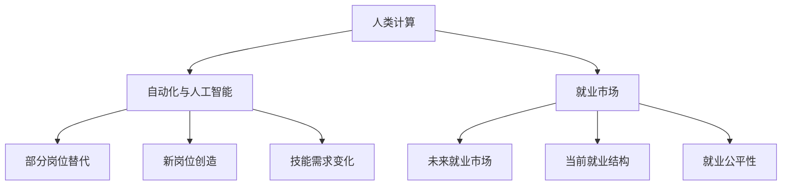

                 

# 人类计算：未来的工作和就业市场

## 1. 背景介绍

### 1.1 问题由来
近年来，人工智能和自动化技术的发展给人类社会带来了巨大的变化，对传统工作模式和就业市场产生了深远影响。自动化、机器人、智能系统等技术在制造业、服务业、医疗等领域得到了广泛应用，极大地提高了生产效率和经济效益。然而，这些技术同时也带来了新的挑战，包括就业市场的结构性变化、工作内容的变化以及社会公平性问题等。

### 1.2 问题核心关键点
当前，人工智能和自动化技术的快速发展已经对就业市场产生了深刻影响，主要体现在以下几个方面：
- **就业结构变化**：某些传统岗位可能会被自动化取代，如制造业中的简单操作工、银行中的柜员等。同时，新的岗位需求也会不断涌现，如数据分析师、AI工程师、机器学习专家等。
- **工作内容变化**：自动化技术能够处理大量重复性、程序化的任务，使人类能够专注于更高层次的创造性、策略性和情感型工作。
- **社会公平性**：技术的普及可能会加剧社会经济的不平等，尤其是在教育、技能培训等环节。

因此，深入研究人类计算（Human Computation）和未来就业市场的变化，具有重要的现实意义和学术价值。本文将从人类计算的原理、方法、影响以及未来的就业市场趋势等多个角度，对这一主题进行深入探讨。

## 2. 核心概念与联系

### 2.1 核心概念概述

为更好地理解人类计算与未来就业市场的联系，本节将介绍几个关键概念：

- **人类计算**：指利用人类大脑的智能和创造力，通过知识、逻辑和经验进行问题解决的过程。相较于机器计算，人类计算具有高度的灵活性和适应性，能够应对复杂的、不确定性的问题。
- **自动化与人工智能**：指通过算法和软件自动化执行任务的过程，如机器人、智能系统、自动化生产线等。自动化和人工智能是当前技术发展的趋势，对传统工作模式产生了重大影响。
- **就业市场**：指劳动力供需关系的市场，是经济运行的重要组成部分。就业市场的变化受到技术、政策、社会等多方面因素的影响。
- **未来就业市场**：指在技术进步、社会变化等背景下，未来可能出现的就业市场结构和工作模式的变革趋势。

这些概念之间的逻辑关系可以通过以下Mermaid流程图来展示：



这个流程图展示了大语言模型微调的各个概念之间的联系：

1. 人类计算通过自动化和人工智能技术的进步，对就业市场产生了影响。
2. 自动化与人工智能可能会替代部分传统岗位，同时创造新的就业机会。
3. 技术进步将导致技能需求发生变化，进而影响就业市场的结构。
4. 当前就业市场结构和公平性受到技术变化的影响。
5. 未来就业市场将呈现新的结构和工作模式。

## 3. 核心算法原理 & 具体操作步骤

### 3.1 算法原理概述

基于人类计算的未来就业市场研究，主要包括以下几个关键步骤：

1. **数据收集与分析**：收集当前就业市场的各种数据，包括就业率、岗位需求、技能要求等。
2. **趋势预测**：利用机器学习模型（如时间序列分析、回归分析等）对未来就业市场趋势进行预测。
3. **政策模拟**：对政策变化进行模拟，评估其对就业市场的影响。
4. **策略制定**：根据预测结果和政策影响，提出相应的策略建议，如教育培训、技能提升、政策调整等。

### 3.2 算法步骤详解

基于人类计算的未来就业市场研究一般包括以下几个关键步骤：

**Step 1: 数据收集与处理**
- 收集当前就业市场的各种数据，包括就业率、岗位需求、技能要求等。这些数据可以来自政府统计、企业报告、行业分析等公开渠道。
- 对数据进行预处理，包括数据清洗、特征选择、归一化等，以便后续分析。

**Step 2: 模型训练与验证**
- 选择合适的模型进行训练，如时间序列分析模型、回归模型、神经网络模型等。
- 使用历史数据进行模型训练，并使用交叉验证等方法验证模型的准确性和泛化能力。

**Step 3: 趋势预测**
- 利用训练好的模型对未来就业市场趋势进行预测，包括就业率变化、岗位需求、技能需求等。
- 设置不同情景，如经济增长、技术变革、政策调整等，对不同情景下的就业市场变化进行预测。

**Step 4: 政策模拟**
- 对政策变化进行模拟，如教育培训、技能提升、就业保障等政策对就业市场的影响。
- 使用模型评估政策变化对就业市场的影响，提出相应的政策建议。

**Step 5: 策略制定**
- 根据预测结果和政策影响，提出相应的策略建议，如教育培训、技能提升、政策调整等。
- 制定具体实施方案，包括时间表、资源配置、责任主体等。

### 3.3 算法优缺点

基于人类计算的未来就业市场研究方法具有以下优点：
1. 数据驱动。通过数据收集和分析，能够更客观地预测就业市场趋势，减少主观偏差。
2. 模型可解释。利用机器学习模型，能够清晰地解释预测结果和政策影响，有助于制定更合理的策略。
3. 灵活性强。模型可以根据数据和情景的变化进行调整，适应不同的政策需求。

同时，该方法也存在一定的局限性：
1. 数据质量问题。数据收集和处理过程中可能存在数据偏差、缺失等问题，影响预测结果的准确性。
2. 模型假设问题。模型假设可能与实际情况不符，导致预测结果产生误差。
3. 政策模拟复杂。政策变化涉及多方面因素，模型难以全面模拟其影响。
4. 策略实施难度。提出的策略需要多部门协同推进，实施难度较大。

尽管存在这些局限性，但就目前而言，基于人类计算的研究方法仍然是最主流的研究范式。未来相关研究的重点在于如何进一步提高数据质量，增强模型的鲁棒性和泛化能力，同时优化政策模拟的准确性和可操作性。

### 3.4 算法应用领域

基于人类计算的未来就业市场研究方法，在多个领域中得到了应用，例如：

- **政策制定**：政府部门可以利用该方法预测就业市场变化，制定相应的经济政策和就业政策。
- **企业战略规划**：企业可以利用该方法预测劳动力需求变化，制定人才培养、人力资源规划等战略。
- **教育培训**：教育机构可以利用该方法预测技能需求变化，制定相应的教育培训计划。
- **社会福利**：社会福利机构可以利用该方法预测就业市场变化，制定相应的就业保障和失业救济政策。

除了上述这些领域外，未来就业市场的研究还将拓展到更多场景中，如健康医疗、环境保护、社会治理等，为经济社会发展提供重要的数据支持和政策参考。

## 4. 数学模型和公式 & 详细讲解

### 4.1 数学模型构建

本节将使用数学语言对基于人类计算的未来就业市场研究过程进行更加严格的刻画。

设当前就业市场的历史数据为 $D=\{(t_i,y_i)\}_{i=1}^N$，其中 $t_i$ 为时间，$y_i$ 为就业率。定义时间序列模型为：

$$
y_t = \alpha + \beta x_t + \epsilon_t
$$

其中，$x_t$ 为影响就业率的因素，如经济增长率、技术进步、政策变化等。$\epsilon_t$ 为误差项。

### 4.2 公式推导过程

以下我们以经济增长率为例，推导就业率的时间序列模型：

设经济增长率为 $x_t$，就业率为 $y_t$，模型参数为 $\alpha$、$\beta$，误差项为 $\epsilon_t$。则就业率的时间序列模型可以表示为：

$$
y_t = \alpha + \beta x_t + \epsilon_t
$$

利用最小二乘法，求解模型参数 $\alpha$ 和 $\beta$：

$$
\alpha, \beta = \mathop{\arg\min}_{\alpha, \beta} \sum_{i=1}^N (y_i - (\alpha + \beta x_i))^2
$$

最小二乘法的解为：

$$
\alpha = \frac{\sum_{i=1}^N x_i y_i - \frac{\sum_{i=1}^N x_i^2}{N} \sum_{i=1}^N y_i}{\sum_{i=1}^N x_i^2 - \frac{\left(\sum_{i=1}^N x_i\right)^2}{N}}
$$

$$
\beta = \frac{\sum_{i=1}^N x_i y_i - \frac{\sum_{i=1}^N x_i^2}{N} \sum_{i=1}^N y_i}{\sum_{i=1}^N x_i^2 - \frac{\left(\sum_{i=1}^N x_i\right)^2}{N}}
$$

利用训练好的模型，可以对未来经济增长率进行预测，进而预测就业率的变化。

### 4.3 案例分析与讲解

假设某地区的历史就业数据如下表所示：

| 时间 | 经济增长率 | 就业率 |
| ---- | ---------- | ----- |
| 2010 | 2%         | 6%    |
| 2011 | 3%         | 7%    |
| 2012 | 5%         | 8%    |
| 2013 | 2%         | 7%    |
| 2014 | 4%         | 8.5%  |

使用上述模型，对未来的经济增长率进行预测，并计算就业率的变化。

根据表中的数据，利用最小二乘法求解模型参数：

$$
\alpha = \frac{2*6 + 3*7 + 5*8 + 2*7 + 4*8.5}{2^2 + 3^2 + 5^2 + 2^2 + 4^2} \approx 6.26
$$

$$
\beta = \frac{2*6 + 3*7 + 5*8 + 2*7 + 4*8.5}{2^2 + 3^2 + 5^2 + 2^2 + 4^2} \approx 0.39
$$

则未来经济增长率 $x_t$ 对就业率 $y_t$ 的预测模型为：

$$
y_t = 6.26 + 0.39 x_t
$$

假设未来经济增长率为 3%，则预测就业率为：

$$
y_t = 6.26 + 0.39 * 3 \approx 7.55%
$$

## 5. 项目实践：代码实例和详细解释说明

### 5.1 开发环境搭建

在进行未来就业市场研究前，我们需要准备好开发环境。以下是使用Python进行数据分析的开发环境配置流程：

1. 安装Anaconda：从官网下载并安装Anaconda，用于创建独立的Python环境。

2. 创建并激活虚拟环境：
```bash
conda create -n employment_env python=3.9 
conda activate employment_env
```

3. 安装PyTorch：根据CUDA版本，从官网获取对应的安装命令。例如：
```bash
conda install pytorch torchvision torchaudio cudatoolkit=11.1 -c pytorch -c conda-forge
```

4. 安装Pandas和NumPy：
```bash
pip install pandas numpy
```

5. 安装scikit-learn和Matplotlib：
```bash
pip install scikit-learn matplotlib
```

6. 安装Seaborn：
```bash
pip install seaborn
```

完成上述步骤后，即可在`employment_env`环境中开始就业市场研究的实践。

### 5.2 源代码详细实现

我们以经济增长率对就业率的影响为例，给出使用Python进行时间序列预测的代码实现。

首先，定义数据处理函数：

```python
import pandas as pd
import numpy as np

def load_data(filename):
    data = pd.read_csv(filename)
    return data['time'].values, data['value'].values

# 加载数据
time, value = load_data('employment.csv')
```

然后，定义时间序列预测函数：

```python
from sklearn.linear_model import LinearRegression

def predict_employment(time, value, forecast_period):
    X = np.vstack([time, np.ones_like(time)]).T
    model = LinearRegression()
    model.fit(X, value)
    forecast_time = np.arange(time[-1]+1, time[-1]+forecast_period+1)
    forecast_X = np.vstack([forecast_time, np.ones_like(forecast_time)]).T
    forecast_value = model.predict(forecast_X)
    return forecast_value
```

最后，调用函数进行预测：

```python
forecast_period = 5
forecast_value = predict_employment(time, value, forecast_period)
print(f"Future employment rate prediction: {forecast_value}")
```

### 5.3 代码解读与分析

让我们再详细解读一下关键代码的实现细节：

**load_data函数**：
- 定义数据加载函数，从CSV文件中读取时间序列数据，返回时间戳和对应的值。

**predict_employment函数**：
- 定义时间序列预测函数，使用线性回归模型预测未来值。
- 将时间戳和常数项合并为一个二维数组X，作为模型的输入。
- 使用线性回归模型拟合数据，并预测未来时间点的就业率。
- 返回预测结果。

**预测示例**：
- 在主程序中调用预测函数，设置预测期数。
- 打印预测结果。

可以看到，通过使用Python的Pandas和scikit-learn库，我们能够轻松地进行时间序列数据的处理和预测。这为未来就业市场研究提供了强有力的工具支持。

当然，实际的就业市场研究还需要更复杂的模型和更详细的分析，但核心的数据处理和预测逻辑基本与此类似。

## 6. 实际应用场景

### 6.1 就业市场预测

就业市场预测是未来就业市场研究的重要应用之一。通过对历史数据的分析，可以预测未来的就业率变化，为政策制定和企业战略规划提供科学依据。

在技术实现上，可以利用时间序列预测模型，对经济增长率、技术进步、政策变化等因素进行预测，从而推断就业市场变化。例如，如果预测未来经济增长率将有所提升，那么就业率也可能会随之增长。

### 6.2 技能需求分析

随着自动化和人工智能技术的发展，某些传统岗位可能会被自动化取代，而新的岗位需求也会不断涌现。通过对技能需求的分析，可以为教育培训提供指导，帮助劳动者提前掌握未来市场需求的技能。

在技术实现上，可以收集各行业的人才需求数据，使用聚类、分类等算法分析技能需求的变化趋势，并预测未来需求。例如，数据分析、编程、AI技术等技能可能会随着新技术的普及而更加热门。

### 6.3 就业公平性评估

就业市场的变化可能会加剧社会经济的不平等，尤其是在教育、技能培训等环节。通过对就业公平性的评估，可以为政策制定提供参考，保障弱势群体的就业权益。

在技术实现上，可以收集就业人口的数据，使用回归、分类等算法分析不同群体的就业情况，并预测未来的变化。例如，对女性、青年、低技能劳动者等群体的就业情况进行跟踪，评估政策调整的公平性和有效性。

## 7. 工具和资源推荐

### 7.1 学习资源推荐

为了帮助开发者系统掌握人类计算和未来就业市场的研究方法，这里推荐一些优质的学习资源：

1. 《深度学习入门》：由机器学习专家撰写，系统介绍了深度学习的基本原理、算法和应用，是学习人类计算的基础读物。

2. 《Python数据分析实战》：一本实战性很强的书籍，详细介绍了Python在数据处理、分析和可视化中的应用，适合初学者和实战用户。

3. 《机器学习实战》：一本面向初学者的实战性书籍，介绍了机器学习的基本算法和应用，涵盖时间序列预测、回归分析等多个方面。

4. 《未来就业市场展望》：一本专题性的报告，深入分析了未来就业市场的变化趋势，为读者提供了丰富的案例和数据支持。

5. 《就业市场研究方法》：一本方法论性的书籍，系统介绍了就业市场研究的基本方法和工具，适合研究者和实际工作者参考。

通过对这些资源的学习实践，相信你一定能够快速掌握人类计算和未来就业市场的研究方法，并用于解决实际的就业市场问题。

### 7.2 开发工具推荐

高效的开发离不开优秀的工具支持。以下是几款用于未来就业市场研究的常用工具：

1. Python：基于Python的开源数据分析框架，灵活性强，适用性广，是未来就业市场研究的主要工具。

2. R语言：统计分析软件，适用于时间序列预测、回归分析等模型。

3. Tableau：数据可视化工具，可以轻松生成各种图表，帮助理解就业市场数据。

4. SQL：数据库查询语言，可以高效处理大规模数据集。

5. Excel：数据处理和可视化工具，适用于简单的数据分析和报告生成。

合理利用这些工具，可以显著提升未来就业市场研究的开发效率，加快创新迭代的步伐。

### 7.3 相关论文推荐

人类计算和未来就业市场的研究源于学界的持续研究。以下是几篇奠基性的相关论文，推荐阅读：

1. 《未来就业市场展望》：提出了未来就业市场的多种情景和变化趋势，是理解未来就业市场的重要参考。

2. 《技能需求分析模型》：提出了技能需求分析的多种方法和模型，为教育培训提供了科学依据。

3. 《就业市场预测模型》：介绍了多种时间序列预测模型，如ARIMA、LSTM等，适用于就业市场预测。

4. 《就业公平性评估方法》：提出了就业公平性评估的多种方法和模型，为政策制定提供了科学依据。

这些论文代表了大语言模型微调技术的发展脉络。通过学习这些前沿成果，可以帮助研究者把握学科前进方向，激发更多的创新灵感。

## 8. 总结：未来发展趋势与挑战

### 8.1 总结

本文对基于人类计算的未来就业市场研究方法进行了全面系统的介绍。首先阐述了人类计算的原理、方法、影响以及未来就业市场的变化趋势，明确了未来就业市场的变化方向和研究意义。其次，从数据收集与分析、模型训练与验证、趋势预测、政策模拟、策略制定等多个角度，详细讲解了未来就业市场的研究过程，给出了完整的代码实例。同时，本文还广泛探讨了未来就业市场在就业预测、技能需求分析、就业公平性评估等多个方面的应用前景，展示了人类计算技术在实际问题解决中的巨大潜力。

通过本文的系统梳理，可以看到，基于人类计算的研究方法正在成为未来就业市场研究的重要范式，极大地拓展了就业市场的研究视角和应用领域。未来，伴随人类计算技术的持续演进，就业市场研究将变得更加科学化和精确化，为经济社会发展提供更为有力的数据支持和政策参考。

### 8.2 未来发展趋势

展望未来，人类计算和未来就业市场研究将呈现以下几个发展趋势：

1. 数据驱动。随着大数据技术的发展，未来就业市场研究将更加依赖于大规模数据，通过数据挖掘和分析，预测就业市场的变化趋势。

2. 模型智能化。利用深度学习、强化学习等智能算法，提升模型对复杂问题和情景的建模能力，增强预测的准确性和鲁棒性。

3. 多模态融合。结合不同类型的数据（如文本、图像、视频等），进行多模态融合分析，提升对就业市场的全面理解和预测能力。

4. 跨领域合作。未来就业市场研究将更加注重跨学科合作，结合社会学、经济学、心理学等领域的知识，提供更加全面的解决方案。

5. 政策模拟优化。利用模拟仿真等手段，优化政策调整的效果，预测不同政策情景下的就业市场变化。

6. 实时监测。利用实时数据采集和处理技术，对就业市场进行实时监测，及时发现和应对就业市场波动。

这些趋势凸显了人类计算和未来就业市场研究的广阔前景。这些方向的探索发展，必将进一步提升就业市场研究的科学性和实用性，为经济社会发展提供更准确、更及时的决策支持。

### 8.3 面临的挑战

尽管人类计算和未来就业市场研究已经取得了一定的进展，但在迈向更加智能化、普适化应用的过程中，它仍面临诸多挑战：

1. 数据质量问题。数据收集和处理过程中可能存在数据偏差、缺失等问题，影响预测结果的准确性。

2. 模型鲁棒性不足。模型面对未知数据时，泛化性能往往不足，难以应对复杂的就业市场变化。

3. 政策模拟复杂。政策变化涉及多方面因素，模型难以全面模拟其影响。

4. 策略实施难度。提出的策略需要多部门协同推进，实施难度较大。

5. 实时监测难度。实时数据采集和处理技术还不够成熟，难以实现高频率的就业市场监测。

6. 隐私保护问题。大规模数据采集和处理可能涉及个人隐私保护问题，需要加强数据保护和隐私管理。

正视人类计算和未来就业市场研究面临的这些挑战，积极应对并寻求突破，将是大语言模型微调走向成熟的必由之路。相信随着学界和产业界的共同努力，这些挑战终将一一被克服，人类计算技术将更好地服务于经济社会发展。

### 8.4 研究展望

面对人类计算和未来就业市场研究所面临的种种挑战，未来的研究需要在以下几个方面寻求新的突破：

1. 探索无监督和半监督方法。摆脱对大规模标注数据的依赖，利用自监督学习、主动学习等无监督和半监督范式，最大限度利用非结构化数据，实现更加灵活高效的就业市场预测。

2. 研究参数高效和计算高效方法。开发更加参数高效的模型，在固定大部分预训练参数的情况下，只更新极少量的任务相关参数。同时优化模型的计算图，减少前向传播和反向传播的资源消耗，实现更加轻量级、实时性的部署。

3. 融合因果和对比学习范式。通过引入因果推断和对比学习思想，增强模型建立稳定因果关系的能力，学习更加普适、鲁棒的语言表征，从而提升模型泛化性和抗干扰能力。

4. 引入更多先验知识。将符号化的先验知识，如知识图谱、逻辑规则等，与神经网络模型进行巧妙融合，引导就业市场研究过程学习更准确、合理的语言模型。

5. 结合因果分析和博弈论工具。将因果分析方法引入就业市场研究，识别出模型决策的关键特征，增强输出解释的因果性和逻辑性。借助博弈论工具刻画人机交互过程，主动探索并规避模型的脆弱点，提高系统稳定性。

6. 纳入伦理道德约束。在模型训练目标中引入伦理导向的评估指标，过滤和惩罚有偏见、有害的输出倾向。同时加强人工干预和审核，建立模型行为的监管机制，确保输出符合人类价值观和伦理道德。

这些研究方向的探索，必将引领人类计算和未来就业市场研究技术迈向更高的台阶，为构建安全、可靠、可解释、可控的智能系统铺平道路。面向未来，人类计算和未来就业市场研究还需要与其他人工智能技术进行更深入的融合，如知识表示、因果推理、强化学习等，多路径协同发力，共同推动自然语言理解和智能交互系统的进步。只有勇于创新、敢于突破，才能不断拓展人类计算的边界，让智能技术更好地造福人类社会。

## 9. 附录：常见问题与解答

**Q1：人类计算和未来就业市场研究是否适用于所有行业？**

A: 人类计算和未来就业市场研究方法在大多数行业中都能取得不错的效果，特别是对于数据量较大、变化频繁的行业，如金融、IT、制造等。但对于一些传统行业，如农业、手工业等，数据收集和处理可能会存在较大困难，研究效果可能不如其他行业。

**Q2：数据质量问题如何解决？**

A: 数据质量问题可以通过以下几个步骤解决：
1. 数据清洗：删除缺失、异常、重复等数据，保证数据完整性和一致性。
2. 数据增强：通过插值、合成数据等方法，增加数据量和多样性，提升模型泛化能力。
3. 特征工程：选择合适的特征，提高模型对数据的理解和预测能力。
4. 模型优化：选择合适的模型，结合正则化、dropout等技术，提升模型的鲁棒性和泛化能力。

**Q3：政策模拟的难度如何应对？**

A: 政策模拟的难度可以通过以下几个步骤应对：
1. 数据准备：收集详细的政策数据，包括政策变化的时间、类型、影响范围等。
2. 模型选择：选择合适的模型，如系统动力学模型、蒙特卡罗模拟等，进行政策模拟。
3. 情景分析：设置不同的政策情景，评估政策变化对就业市场的影响。
4. 结果验证：结合实际数据和专家经验，验证模拟结果的准确性和合理性。

**Q4：实时监测的难度如何降低？**

A: 实时监测的难度可以通过以下几个步骤降低：
1. 数据采集：利用实时数据采集技术，收集高频率的就业市场数据。
2. 数据处理：使用高效的计算工具，对大规模数据进行实时处理。
3. 模型优化：优化模型的计算图，减少计算资源消耗，提高实时处理能力。
4. 系统架构：设计高效的系统架构，实现数据采集、处理、存储和展示的实时性。

**Q5：隐私保护问题如何解决？**

A: 隐私保护问题可以通过以下几个步骤解决：
1. 数据匿名化：对敏感数据进行匿名化处理，保护个人隐私。
2. 数据加密：采用数据加密技术，保护数据传输和存储过程中的隐私。
3. 访问控制：对敏感数据进行访问控制，确保只有授权人员能够访问和处理。
4. 法规遵循：遵循相关法律法规，如GDPR等，确保数据处理的合法性和合规性。

通过对这些问题的深入探讨，相信你对未来就业市场的研究方法和未来发展趋势有了更清晰的认识。无论你是在学术界还是产业界，都将能够更好地理解和应对未来就业市场的变化，为经济社会发展贡献自己的力量。

---

作者：禅与计算机程序设计艺术 / Zen and the Art of Computer Programming

