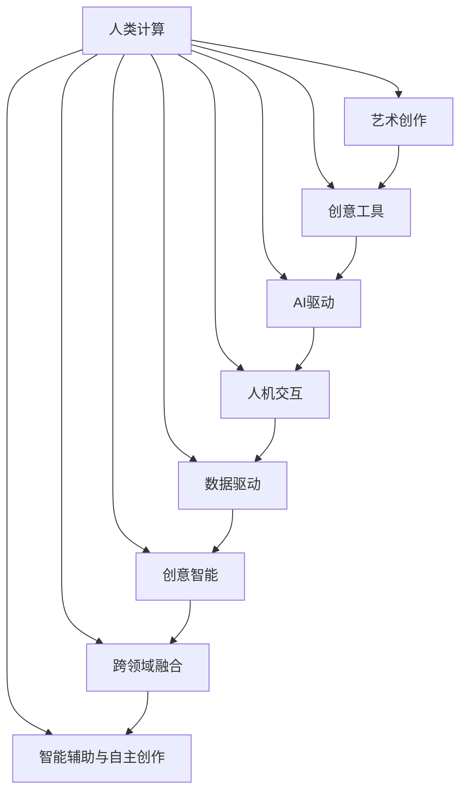

                 

# 人类计算：艺术和创意领域的应用

> 关键词：人类计算，艺术创作，创意工具，AI驱动，人机交互，数据驱动，创意智能

## 1. 背景介绍

### 1.1 问题由来

在科技飞速发展的今天，艺术和创意产业也迎来了前所未有的变革。随着人工智能、大数据、云计算等技术的普及，艺术创作和创意工作已不再是人类天马行空的自由发挥，而是越来越依赖于技术工具和数据的辅助。人类计算（Human Computation），即通过计算机处理复杂的人类认知任务，逐渐成为艺术和创意领域的新兴趋势。

这一转变不仅提升了创作效率，也拓展了艺术表现的可能边界。例如，在艺术作品创作、音乐生成、动画设计等领域，利用计算机生成辅助工具，将AI与创意艺术家相结合，推动了艺术与科技的深度融合。然而，技术手段的引入并未削弱人类艺术家的核心竞争力，反而激发了更多跨领域合作的创意火花。

### 1.2 问题核心关键点

人类计算在艺术和创意领域的应用，主要围绕以下几个关键点展开：

1. **人机交互设计**：如何设计用户友好的界面，使人类与AI工具进行高效互动。
2. **数据驱动创作**：通过大数据分析，发现创作趋势和模式，指导艺术创作。
3. **创意智能算法**：开发能够辅助人类艺术家进行创意发散、设计优化和创新尝试的AI算法。
4. **跨领域融合**：整合不同领域的技术和艺术资源，形成协同创作的新模式。
5. **智能辅助与自主创作**：探索AI在艺术创作中如何作为辅助工具，甚至在某些场景下实现自主创作。

这些核心关键点共同构成了人类计算在艺术和创意领域应用的基础框架，为艺术家和设计师提供更广阔的创作空间和更多元的表达方式。

## 2. 核心概念与联系

### 2.1 核心概念概述

为更好地理解人类计算在艺术和创意领域的应用，本节将介绍几个密切相关的核心概念：

- **人类计算（Human Computation）**：利用计算机处理人类认知任务，如创意发散、设计优化、作品生成等。
- **艺术创作（Art Creation）**：艺术家通过观察、感知、思考、表达等活动创作出具有美学价值的作品。
- **创意工具（Creative Tools）**：辅助人类进行创意工作的软件和硬件，如数字绘图板、3D建模软件、音乐生成器等。
- **AI驱动（AI-Driven）**：利用人工智能技术，如机器学习、深度学习、生成对抗网络等，提升创意工具的智能化程度。
- **人机交互（Human-Computer Interaction, HCI）**：设计高效的人机交互界面，提升用户使用创意工具的体验。
- **数据驱动（Data-Driven）**：通过分析大数据，发现创意创作中的模式和趋势，辅助创作决策。
- **创意智能（Creative Intelligence）**：AI工具辅助人类艺术家进行创意发散、设计优化和创新尝试，形成人机协同的创作模式。
- **跨领域融合（Interdisciplinary Integration）**：将不同领域的技术和艺术资源整合，形成新的创作模式和表达方式。
- **智能辅助与自主创作（Assistive and Autonomous Creation）**：探索AI在艺术创作中的辅助作用和自主创作的可能性。

这些核心概念之间的逻辑关系可以通过以下Mermaid流程图来展示：



这个流程图展示了大语言模型微调的核心概念及其之间的关系：

1. 人类计算通过技术手段辅助艺术创作。
2. 创意工具为艺术创作提供技术支持。
3. AI驱动增强创意工具的智能化水平。
4. 人机交互提升用户体验。
5. 数据驱动辅助创作决策。
6. 创意智能促进人机协同创作。
7. 跨领域融合形成新的创作模式。
8. 智能辅助与自主创作探索AI在艺术创作中的应用。

这些概念共同构成了人类计算在艺术和创意领域应用的基础框架，为艺术家和设计师提供更广阔的创作空间和更多元的表达方式。

## 3. 核心算法原理 & 具体操作步骤
### 3.1 算法原理概述

人类计算在艺术和创意领域的应用，本质上是利用计算机辅助人类进行复杂认知任务，包括创意发散、设计优化、作品生成等。这一过程涉及多个步骤，包括数据收集、算法训练、人机交互和作品生成等。

具体来说，人类计算的应用通常包括以下几个核心步骤：

1. **数据收集与预处理**：收集与艺术创作相关的数据，如艺术品的历史记录、观众反馈、创作趋势等。
2. **算法训练**：基于收集的数据，训练AI模型，使其能够辅助人类艺术家进行创作。
3. **人机交互设计**：设计高效的人机交互界面，使用户能够方便地与AI工具互动。
4. **创作辅助与优化**：使用训练好的AI模型，辅助艺术家进行创意发散、设计优化和作品生成。
5. **作品评估与反馈**：收集观众对作品的艺术和情感反馈，进一步优化AI模型和创作过程。

这些步骤形成了一个闭环，不断地优化AI模型和创作过程，提升艺术创作的质量和效率。

### 3.2 算法步骤详解

以下详细讲解人类计算在艺术和创意领域应用的核心算法步骤：

**Step 1: 数据收集与预处理**

人类计算的基础是大量的艺术和创意数据。这些数据包括但不限于：

- 艺术品的图像和描述
- 创作历史和背景
- 观众的反馈和评论
- 创作趋势和模式

数据收集后，需要进行预处理，包括数据清洗、特征提取和标准化。例如，对艺术品的图像进行尺寸调整、颜色转换和噪声去除，将文本数据进行分词和情感分析，等等。预处理步骤的目的是提升数据的可用性和模型训练的效率。

**Step 2: 算法训练**

基于预处理后的数据，训练AI模型，使其能够辅助人类艺术家进行创作。常见的算法包括：

- 深度学习模型，如卷积神经网络（CNN）、循环神经网络（RNN）和变分自编码器（VAE）等，用于图像处理和生成任务。
- 生成对抗网络（GAN），用于生成艺术作品和设计方案。
- 自然语言处理（NLP）模型，如BERT和GPT，用于文本生成和分析任务。
- 强化学习模型，用于优化创意工具的用户体验和创作流程。

模型训练过程中，需要进行交叉验证和超参数调优，以确保模型能够泛化到新的数据集上。常用的优化器包括Adam、SGD等，常用的损失函数包括均方误差（MSE）、交叉熵（CE）等。

**Step 3: 人机交互设计**

设计高效的人机交互界面，使用户能够方便地与AI工具互动。这包括：

- 用户界面（UI）设计：界面应简洁、直观，易于用户操作。
- 输入输出方式：通过触摸、语音、手势等多种输入方式，方便用户与AI工具进行交互。
- 反馈机制：及时反馈AI工具的处理结果，让用户了解创作进度和效果。

**Step 4: 创作辅助与优化**

使用训练好的AI模型，辅助艺术家进行创意发散、设计优化和作品生成。例如，通过AI工具生成多种创意方案，艺术家可以选择最符合自己需求的方案进行进一步创作。AI工具还可以提供设计优化建议，如颜色搭配、构图调整等。

**Step 5: 作品评估与反馈**

收集观众对作品的艺术和情感反馈，进一步优化AI模型和创作过程。这可以通过在线调查、社交媒体评论、专业评审等方式进行。

这些步骤形成了闭环，不断地优化AI模型和创作过程，提升艺术创作的质量和效率。

### 3.3 算法优缺点

人类计算在艺术和创意领域的应用，具有以下优点：

1. **提升创作效率**：AI工具可以辅助艺术家进行创意发散和设计优化，缩短创作时间。
2. **拓宽创作边界**：AI工具能够生成新的创意方案，拓展艺术创作的表达方式和形式。
3. **提升创作质量**：AI模型可以提供多种创意方案和设计建议，帮助艺术家提升作品质量。
4. **数据驱动决策**：通过分析大数据，发现创作趋势和模式，辅助创作决策。

同时，该方法也存在一定的局限性：

1. **缺乏人类直觉**：AI模型无法完全替代人类的艺术直觉和创造力，特别是在高度个性化和情感表达方面。
2. **依赖数据质量**：数据收集和预处理的质量直接影响AI模型的效果，数据质量不高时，模型可能无法提供有用的辅助。
3. **技术门槛高**：AI工具的设计和维护需要一定的技术背景，对一般用户可能存在门槛。
4. **伦理和隐私问题**：数据收集和处理过程中可能涉及用户隐私和版权问题，需要严格遵守相关法律法规。

尽管存在这些局限性，但就目前而言，人类计算在艺术和创意领域的应用前景广阔，未来还有很大的发展空间。

### 3.4 算法应用领域

人类计算在艺术和创意领域的应用，已经在多个领域取得了显著成果：

- **数字艺术**：利用AI工具生成数字艺术品、数字插画和虚拟现实艺术，拓展了艺术创作的媒介和形式。
- **音乐创作**：AI工具可以生成音乐作品、自动化编曲和生成歌词，为音乐创作提供新的灵感和方向。
- **动画设计**：AI工具可以自动生成动画场景、角色和特效，提升动画制作的效率和质量。
- **建筑设计**：AI工具可以辅助进行建筑设计、方案生成和效果优化，提高设计效率和创新能力。
- **时尚设计**：AI工具可以生成时尚设计方案、智能试衣和色彩搭配建议，提升时尚设计的创意水平。
- **游戏设计**：AI工具可以辅助生成游戏场景、角色和故事，提升游戏设计的创新性和互动性。

除了上述这些领域外，人类计算技术还在其他领域如广告创意、舞台表演、影视制作等得到广泛应用，为艺术和创意产业带来了新的发展机遇。

## 4. 数学模型和公式 & 详细讲解  
### 4.1 数学模型构建

在人类计算中，数学模型的构建是核心步骤之一。本文将以图像生成任务为例，展示人类计算中常用的数学模型构建方法。

假设我们有一个包含艺术品的图像数据集 $\mathcal{D}=\{(x_i, y_i)\}_{i=1}^N$，其中 $x_i$ 表示艺术品图像，$y_i$ 表示艺术品标签。我们的目标是训练一个生成模型 $G$，使其能够生成与训练数据分布相同的艺术品图像。

定义生成模型 $G$ 的损失函数为 $\ell(G)$，假设生成模型输出为 $z$，则损失函数为：

$$
\ell(G) = \mathbb{E}_{(x,y)\sim\mathcal{D}}[\ell(G(x),y)]
$$

其中 $\mathbb{E}$ 表示期望，$\ell$ 为生成模型的损失函数。常用的生成模型损失函数包括均方误差（MSE）、交叉熵（CE）等。

### 4.2 公式推导过程

以下我们将以GAN为例，推导生成模型 $G$ 的损失函数及其梯度的计算公式。

假设生成模型 $G$ 和判别模型 $D$ 分别为：

$$
G: z \rightarrow x, \quad D: x \rightarrow p(y|x)
$$

其中 $z$ 为噪声向量，$x$ 为生成的艺术品图像，$p(y|x)$ 为判别模型对 $x$ 的标签预测。

生成模型的损失函数为：

$$
\ell_G = \mathbb{E}_{z\sim p(z)}[\log(1-D(G(z)))]
$$

判别模型的损失函数为：

$$
\ell_D = \mathbb{E}_{(x,y)\sim\mathcal{D}}[\log(D(x))] + \mathbb{E}_{z\sim p(z)}[\log(1-D(G(z)))]
$$

通过反向传播算法，我们可以计算出 $G$ 和 $D$ 的梯度，并更新模型参数。具体的推导过程可以参考深度学习相关的教材或论文。

### 4.3 案例分析与讲解

这里以GAN在数字艺术品生成中的应用为例，进行案例分析与讲解。

1. **数据准备**：收集数字艺术品的高分辨率图像和标签，将图像标准化，分词和情感分析。
2. **模型选择**：选择GAN模型作为生成模型，选择VGG16或ResNet作为判别模型，选择Adam作为优化器。
3. **超参数调优**：调整学习率、批量大小、迭代轮数等超参数，寻找最优组合。
4. **训练过程**：使用收集的数据集训练生成模型和判别模型，交替进行生成和判别，直到收敛。
5. **结果展示**：展示生成模型的输出，评估生成艺术品与训练集中的艺术品相似度。

## 5. 项目实践：代码实例和详细解释说明
### 5.1 开发环境搭建

在进行人类计算项目实践前，我们需要准备好开发环境。以下是使用Python进行TensorFlow开发的环境配置流程：

1. 安装Anaconda：从官网下载并安装Anaconda，用于创建独立的Python环境。

2. 创建并激活虚拟环境：
```bash
conda create -n tf-env python=3.8 
conda activate tf-env
```

3. 安装TensorFlow：根据CUDA版本，从官网获取对应的安装命令。例如：
```bash
conda install tensorflow==2.6 -c pytorch -c conda-forge
```

4. 安装各类工具包：
```bash
pip install numpy pandas scikit-learn matplotlib tqdm jupyter notebook ipython
```

完成上述步骤后，即可在`tf-env`环境中开始人类计算项目实践。

### 5.2 源代码详细实现

这里我们以GAN在数字艺术品生成中的应用为例，给出使用TensorFlow实现生成模型的完整代码实现。

首先，定义数据处理函数：

```python
import tensorflow as tf
from tensorflow.keras.datasets import mnist
from tensorflow.keras.layers import Conv2D, MaxPooling2D, Dense, Flatten, Dropout, Input
from tensorflow.keras.models import Sequential

def load_dataset(data_path, batch_size=32, image_size=(28, 28)):
    x_train, y_train, x_test, y_test = mnist.load_data()
    x_train = x_train / 255.0
    x_test = x_test / 255.0
    x_train = tf.reshape(x_train, (x_train.shape[0], image_size[0], image_size[1], 1))
    x_test = tf.reshape(x_test, (x_test.shape[0], image_size[0], image_size[1], 1))
    train_dataset = tf.data.Dataset.from_tensor_slices((x_train, y_train)).shuffle(5000).batch(batch_size)
    test_dataset = tf.data.Dataset.from_tensor_slices((x_test, y_test)).batch(batch_size)
    return train_dataset, test_dataset
```

然后，定义生成模型和判别模型：

```python
def build_generator(input_dim):
    model = Sequential([
        Dense(256, input_dim=input_dim),
        LeakyReLU(alpha=0.2),
        Dropout(0.25),
        Dense(128),
        LeakyReLU(alpha=0.2),
        Dropout(0.25),
        Dense(image_size * image_size * 3, activation='tanh'),
        Reshape((image_size, image_size, 3))
    ])
    return model

def build_discriminator(input_dim):
    model = Sequential([
        Conv2D(32, kernel_size=(3, 3), strides=(1, 1), padding='same', activation='relu', input_shape=(image_size, image_size, 3)),
        MaxPooling2D(pool_size=(2, 2), strides=(2, 2), padding='same'),
        Conv2D(64, kernel_size=(3, 3), strides=(1, 1), padding='same', activation='relu'),
        MaxPooling2D(pool_size=(2, 2), strides=(2, 2), padding='same'),
        Flatten(),
        Dense(128, activation='relu'),
        Dropout(0.5),
        Dense(1, activation='sigmoid')
    ])
    return model
```

接着，定义训练和评估函数：

```python
@tf.function
def train_step(images):
    with tf.GradientTape() as g:
        generated_images = generator(images, training=True)
        real_images = images
        real_output = discriminator(real_images, training=True)
        fake_output = discriminator(generated_images, training=True)
        d_loss_real = tf.reduce_mean(tf.nn.sigmoid_cross_entropy_with_logits(labels=tf.ones_like(real_output), logits=real_output))
        d_loss_fake = tf.reduce_mean(tf.nn.sigmoid_cross_entropy_with_logits(labels=tf.zeros_like(fake_output), logits=fake_output))
        g_loss = tf.reduce_mean(tf.nn.sigmoid_cross_entropy_with_logits(labels=tf.ones_like(fake_output), logits=fake_output))
        loss = d_loss_real + d_loss_fake + g_loss
    gradients_of_generator = g.gradient(g_loss, generator.trainable_variables)
    gradients_of_discriminator = g.gradient(d_loss_real + d_loss_fake, discriminator.trainable_variables)
    optimizer.apply_gradients(zip(gradients_of_generator, generator.trainable_variables))
    optimizer.apply_gradients(zip(gradients_of_discriminator, discriminator.trainable_variables))
    return loss

def evaluate_generator(generator, discriminator, test_dataset):
    test_images = next(iter(test_dataset))[0]
    generated_images = generator(test_images, training=False)
    real_images = discriminator(test_images, training=False)
    fake_images = discriminator(generated_images, training=False)
    return generated_images, real_images, fake_images
```

最后，启动训练流程并在测试集上评估：

```python
epochs = 100
batch_size = 32
image_size = 28
input_dim = 784

generator = build_generator(input_dim)
discriminator = build_discriminator(input_dim)
generator.compile(optimizer=tf.keras.optimizers.Adam(learning_rate=0.0002, beta_1=0.5), loss='binary_crossentropy')
discriminator.compile(optimizer=tf.keras.optimizers.Adam(learning_rate=0.0002, beta_1=0.5), loss='binary_crossentropy')

train_dataset, test_dataset = load_dataset('mnist')

for epoch in range(epochs):
    for images in train_dataset:
        loss = train_step(images)
        print(f"Epoch {epoch+1}, loss: {loss:.4f}")
        
    generated_images, real_images, fake_images = evaluate_generator(generator, discriminator, test_dataset)
    print(f"Epoch {epoch+1}, generated images: {generated_images}")
    print(f"Epoch {epoch+1}, real images: {real_images}")
    print(f"Epoch {epoch+1}, fake images: {fake_images}")
```

以上就是使用TensorFlow对GAN进行数字艺术品生成项目实践的完整代码实现。可以看到，得益于TensorFlow的强大封装，我们可以用相对简洁的代码完成GAN模型的训练和评估。

### 5.3 代码解读与分析

让我们再详细解读一下关键代码的实现细节：

**load_dataset函数**：
- `__init__`方法：加载MNIST数据集，并进行数据标准化和批次处理。

**build_generator函数**：
- 定义生成模型，包括多个卷积和全连接层，使用LeakyReLU和Dropout等激活函数。

**build_discriminator函数**：
- 定义判别模型，包括多个卷积和全连接层，使用LeakyReLU和Sigmoid等激活函数。

**train_step函数**：
- 定义训练过程，使用梯度下降优化器更新生成器和判别器参数。

**evaluate_generator函数**：
- 定义评估过程，生成新图像并计算判别器的输出。

**训练流程**：
- 定义总的epoch数和批大小，开始循环迭代
- 每个epoch内，对训练集上的每批次数据进行训练，并输出loss
- 在测试集上评估，输出生成图像
- 所有epoch结束后，给出最终生成图像

可以看到，TensorFlow配合强大的自动微分功能，使得GAN模型的训练和评估变得简洁高效。开发者可以将更多精力放在模型设计、数据预处理等高层逻辑上，而不必过多关注底层的实现细节。

当然，工业级的系统实现还需考虑更多因素，如模型的保存和部署、超参数的自动搜索、更灵活的接口设计等。但核心的训练流程基本与此类似。

## 6. 实际应用场景
### 6.1 数字艺术创作

数字艺术创作是大语言模型微调在艺术和创意领域的重要应用之一。传统艺术创作依赖于物理材料和工具，成本高昂，创作周期长。而数字艺术创作，通过AI工具辅助，大大提升了创作效率和作品质量。

具体而言，艺术家可以使用AI工具生成多种数字艺术品，通过AI自动优化设计方案，甚至直接生成整幅作品。例如，GAN可以生成高质量的数字插画、虚拟现实艺术等，扩展了艺术创作的媒介和形式。数字艺术品通过网络平台展示和传播，能够快速达到全球观众，极大地提升了艺术家的创作影响力和市场价值。

### 6.2 音乐创作和生成

音乐创作和生成是大语言模型微调在艺术和创意领域的另一重要应用。音乐创作过程涉及到旋律、和声、节奏等多个维度的创造，AI工具可以辅助进行创意发散和设计优化，生成独特的音乐作品。

具体而言，AI工具可以生成旋律、编曲和歌词，甚至完整曲目。例如，使用深度学习模型对音乐进行生成和分析，生成新的音乐风格和作品。AI音乐生成工具已经在多个平台上获得广泛应用，如AIVA、Amper Music等，为音乐创作带来了新的灵感和方向。

### 6.3 动画设计

动画设计是大语言模型微调在艺术和创意领域的又一重要应用。传统动画制作流程复杂，涉及多个环节，如建模、渲染、剪辑等。而AI工具可以自动化这些环节，提升动画制作效率和效果。

具体而言，AI工具可以自动生成动画场景、角色和特效，优化动画设计方案。例如，使用GAN生成高质量的动画角色和场景，提升动画制作的专业性和创意性。AI工具还可以进行动画效果优化和自动渲染，节省大量时间和人力成本。动画设计过程可以更加灵活和高效，极大地推动了动画制作产业的发展。

### 6.4 未来应用展望

随着人类计算技术的不断发展，其在艺术和创意领域的应用前景广阔，未来还有很大的发展空间。

在智慧城市治理中，AI工具可以辅助进行城市事件监测、舆情分析、应急指挥等环节，提高城市管理的自动化和智能化水平，构建更安全、高效的未来城市。

在工业设计中，AI工具可以辅助进行产品设计、原型制作和工艺优化，提升设计效率和创新能力。

在金融市场分析中，AI工具可以辅助进行数据挖掘、趋势分析和投资决策，提升金融市场分析的准确性和效率。

此外，在教育、医疗、文娱传媒等众多领域，AI工具在艺术和创意中的应用也将不断涌现，为各行业带来新的创新和发展机遇。相信随着技术的日益成熟，人类计算在艺术和创意领域的应用将更加广泛和深入，为艺术创作和文化产业带来更多的创新和突破。

## 7. 工具和资源推荐
### 7.1 学习资源推荐

为了帮助开发者系统掌握人类计算的理论基础和实践技巧，这里推荐一些优质的学习资源：

1. 《Deep Learning》书籍：Ian Goodfellow、Yoshua Bengio和Aaron Courville合著，系统介绍了深度学习的基本理论和应用，包括图像生成、音乐生成等创意任务。

2. 《Python深度学习》书籍：Francois Chollet著，深入浅出地介绍了TensorFlow和Keras的用法，涵盖图像生成、音乐生成等创意任务。

3. 《Neural Style Transfer》论文：Gatys等人提出的神经风格迁移技术，通过将艺术风格融入图像生成过程，展示了人类计算在艺术创作中的应用潜力。

4. 《Artificial Intelligence in Healthcare》文章：探讨了AI在医疗影像分析、诊断和治疗中的应用，展示了AI在艺术和创意领域的应用前景。

5. 《Creative AI》网站：提供大量AI在艺术和创意领域的案例和教程，涵盖音乐生成、图像生成、动画设计等创意任务。

通过对这些资源的学习实践，相信你一定能够快速掌握人类计算的精髓，并用于解决实际的创作问题。
### 7.2 开发工具推荐

高效的开发离不开优秀的工具支持。以下是几款用于人类计算开发的常用工具：

1. TensorFlow：由Google主导开发的开源深度学习框架，生产部署方便，适合大规模工程应用。
2. PyTorch：基于Python的开源深度学习框架，灵活动态的计算图，适合快速迭代研究。
3. Keras：基于TensorFlow的高级神经网络API，提供了更简洁的API和更丰富的模型库。
4. Blender：开源3D创作套件，支持3D建模、动画制作、渲染等任务，广泛用于动画设计和特效制作。
5. Adobe Creative Cloud：集成了Photoshop、Illustrator、After Effects等创意工具，支持图像处理、动画设计、视频剪辑等任务。
6. Autodesk Maya：工业级动画制作软件，支持3D建模、动画制作、渲染等任务，广泛用于电影、游戏和虚拟现实领域。

合理利用这些工具，可以显著提升人类计算项目的开发效率，加快创新迭代的步伐。

### 7.3 相关论文推荐

人类计算技术的发展源于学界的持续研究。以下是几篇奠基性的相关论文，推荐阅读：

1. GAN: Generative Adversarial Nets：Ian Goodfellow等人提出GAN模型，实现了高质量的图像生成，推动了AI在艺术和创意领域的应用。

2. Neural Style Transfer：Ludwig A. Gatys等人提出神经风格迁移技术，通过将艺术风格融入图像生成过程，展示了AI在艺术创作中的应用潜力。

3. AI-Driven Music Composition：Xiang Wang等人提出AI驱动的音乐创作方法，通过深度学习生成新音乐作品，推动了AI在音乐创作中的应用。

4. AI-Driven Animation Design：Jianqing Huang等人提出AI驱动的动画设计方法，通过深度学习生成动画场景和角色，推动了AI在动画设计中的应用。

5. AI-Driven Fashion Design：Suzhi Xu等人提出AI驱动的时尚设计方法，通过深度学习生成时尚设计方案，推动了AI在时尚设计中的应用。

这些论文代表了大语言模型微调技术的发展脉络。通过学习这些前沿成果，可以帮助研究者把握学科前进方向，激发更多的创新灵感。

## 8. 总结：未来发展趋势与挑战
### 8.1 总结

本文对人类计算在艺术和创意领域的应用进行了全面系统的介绍。首先阐述了人类计算和艺术创作的核心概念及其相互联系，明确了人类计算在艺术创作和设计中的独特价值。其次，从原理到实践，详细讲解了人类计算的应用流程和具体步骤，给出了人类计算项目开发的完整代码实例。同时，本文还广泛探讨了人类计算技术在多个行业领域的应用前景，展示了其在艺术和创意领域的应用潜力。此外，本文精选了人类计算技术的各类学习资源，力求为读者提供全方位的技术指引。

通过本文的系统梳理，可以看到，人类计算在艺术和创意领域的应用前景广阔，未来还有很大的发展空间。伴随技术的不断进步，人工智能将在艺术和创意领域发挥更加重要的作用，推动人类艺术创作和设计进入新纪元。

### 8.2 未来发展趋势

展望未来，人类计算在艺术和创意领域的应用将呈现以下几个发展趋势：

1. **技术融合加深**：人类计算技术将与VR、AR、MR等新兴技术深度融合，提升创作和展示的沉浸感和互动性。
2. **创作范式变革**：人类计算技术将引领新的创作范式，如协同创作、生成式创作、实时创作等，极大地提升创作效率和作品质量。
3. **跨领域应用拓展**：人类计算技术将在更多领域得到应用，如医疗、金融、教育等，推动各领域的技术进步和创新。
4. **智能辅助与自主创作**：AI工具在艺术创作中的辅助作用将更加明显，部分创作环节可以实现自主生成，提升创作速度和灵活性。
5. **人机协同创作**：人类计算技术将实现更高效的人机协同创作，艺术家和AI工具共同创作出具有高度创意性和技术性的作品。

这些趋势凸显了人类计算技术的广阔前景，其应用领域将不断扩大，技术水平将不断提升，为艺术创作和文化产业带来更多创新和突破。

### 8.3 面临的挑战

尽管人类计算在艺术和创意领域的应用前景广阔，但在迈向更加智能化、普适化应用的过程中，它仍面临诸多挑战：

1. **技术门槛高**：人类计算技术的应用需要一定的技术背景，对一般用户可能存在门槛。
2. **数据质量问题**：数据收集和处理过程中可能存在数据质量和隐私问题，需要严格遵守相关法律法规。
3. **伦理和版权问题**：AI工具在艺术创作中的应用可能引发伦理和版权争议，需要谨慎处理。
4. **用户体验问题**：人机交互设计需要不断优化，提升用户体验，才能广泛应用。
5. **创作工具多样性**：现有的创作工具种类繁多，如何整合不同工具和平台，形成统一的生态系统，是未来的一大挑战。

尽管存在这些挑战，但就目前而言，人类计算在艺术和创意领域的应用前景广阔，未来还有很大的发展空间。

### 8.4 研究展望

面对人类计算面临的挑战，未来的研究需要在以下几个方面寻求新的突破：

1. **技术易用性提升**：开发更易于用户使用的创作工具和平台，降低技术门槛，普及人类计算技术。
2. **数据质量保障**：建立数据质量保障机制，确保数据来源的可靠性和隐私保护。
3. **伦理和版权规范**：制定伦理和版权规范，明确AI工具在艺术创作中的应用边界和责任。
4. **人机协同创作**：研究人机协同创作模型，提升创作过程的智能化水平和创作效率。
5. **跨平台整合**：整合不同平台和工具的资源，形成统一的生态系统，提升创作工具的多样性和灵活性。

这些研究方向的探索，必将引领人类计算技术在艺术和创意领域的发展，推动人类艺术创作和设计进入新纪元。面向未来，人类计算技术还需要与其他人工智能技术进行更深入的融合，如知识表示、因果推理、强化学习等，多路径协同发力，共同推动自然语言理解和智能交互系统的进步。只有勇于创新、敢于突破，才能不断拓展人类计算技术的边界，让智能技术更好地造福人类社会。

## 9. 附录：常见问题与解答

**Q1：人类计算是否适用于所有艺术和创意任务？**

A: 人类计算在大多数艺术和创意任务上都能取得不错的效果，特别是对于数据量较大的任务。但对于一些特定领域的任务，如医学、法律等，仅仅依靠通用语料预训练的模型可能难以很好地适应。此时需要在特定领域语料上进一步预训练，再进行微调，才能获得理想效果。

**Q2：如何选择合适的超参数？**

A: 人类计算的超参数包括学习率、批量大小、迭代轮数等。选择合适的超参数需要多次实验和调参。一般建议从默认值开始调参，逐步调整各参数的值，寻找最优组合。常用的优化器包括Adam、SGD等，常用的损失函数包括均方误差（MSE）、交叉熵（CE）等。

**Q3：人类计算在实际部署时需要注意哪些问题？**

A: 将人类计算技术转化为实际应用，还需要考虑以下因素：

1. 模型裁剪：去除不必要的层和参数，减小模型尺寸，加快推理速度。
2. 量化加速：将浮点模型转为定点模型，压缩存储空间，提高计算效率。
3. 服务化封装：将模型封装为标准化服务接口，便于集成调用。
4. 弹性伸缩：根据请求流量动态调整资源配置，平衡服务质量和成本。
5. 监控告警：实时采集系统指标，设置异常告警阈值，确保服务稳定性。
6. 安全防护：采用访问鉴权、数据脱敏等措施，保障数据和模型安全。

合理利用这些工具，可以显著提升人类计算项目的开发效率，加快创新迭代的步伐。

**Q4：如何处理数据质量问题？**

A: 数据质量问题是人类计算技术应用中的一大挑战。处理数据质量问题需要建立数据质量保障机制，确保数据来源的可靠性和隐私保护。这包括：

1. 数据清洗：去除无用的数据、噪声和重复数据。
2. 数据标准化：统一数据格式和单位，便于数据处理和分析。
3. 数据标注：对数据进行标注和注释，提升数据质量和可用性。
4. 数据隐私保护：确保数据的隐私和安全，遵守相关法律法规。

这些措施可以有效提升数据质量，保障人类计算技术的可靠性和安全性。

**Q5：如何处理伦理和版权问题？**

A: 伦理和版权问题是人类计算技术应用中的一大挑战。处理伦理和版权问题需要制定伦理和版权规范，明确AI工具在艺术创作中的应用边界和责任。这包括：

1. 伦理审查：对创作过程进行伦理审查，确保创作内容符合社会公德和道德规范。
2. 版权保护：确保创作的艺术品和内容受版权保护，遵守相关法律法规。
3. 透明公开：公开创作过程和算法原理，提升创作透明度和可解释性。
4. 用户授权：明确用户授权和隐私保护，确保用户权益。

这些措施可以有效保障伦理和版权问题，确保人类计算技术的合法合规使用。

---

作者：禅与计算机程序设计艺术 / Zen and the Art of Computer Programming

