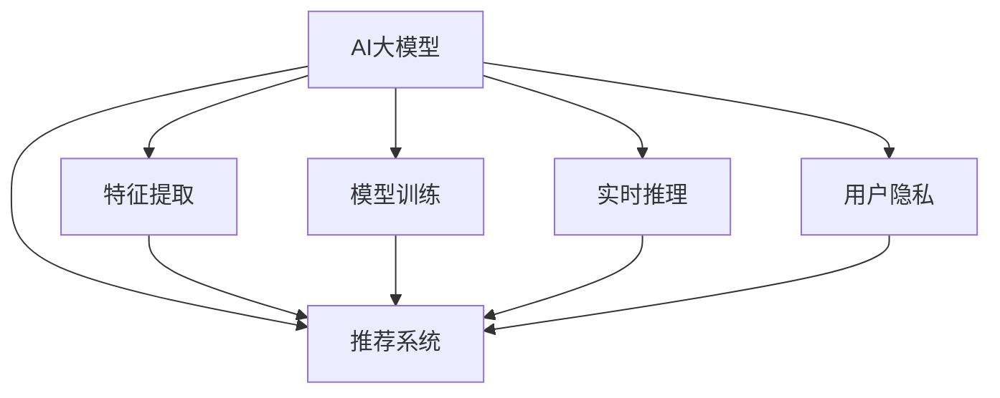

                 

# 从传统推荐系统到AI大模型：技术演进之路

> 关键词：推荐系统,AI大模型,技术演进,深度学习,数据科学,个性化推荐

## 1. 背景介绍

### 1.1 问题由来

随着互联网和电子商务的蓬勃发展，推荐系统逐渐成为各大电商、视频、音乐、新闻等平台的核心竞争力。传统推荐系统通过分析用户行为数据，计算商品、内容之间的相似度，为用户提供个性化的推荐列表，极大地提升了用户体验和平台留存率。然而，随着用户数据量的激增，数据计算和模型训练的需求也在不断增长，这对推荐系统提出了更高的要求。

为了应对这些挑战，业界和学术界逐渐将目光投向了新兴的AI大模型。AI大模型通过大规模数据训练，学习到高度抽象和泛化的知识表征，具备强大的模式识别和推理能力。相比传统的机器学习模型，AI大模型在推荐系统中的应用有望带来性能的全面提升。

### 1.2 问题核心关键点

AI大模型在推荐系统中的应用，涉及以下几个关键点：
1. **数据表示与特征提取**：如何利用AI大模型对海量用户数据进行有效的特征提取和表示，成为推荐系统性能的关键。
2. **模型训练与优化**：AI大模型的训练需要海量数据和强大的计算能力，如何高效训练并优化模型参数，是推荐系统应用中的重要课题。
3. **实时推理与反馈**：AI大模型在推荐系统中需要实时进行推理计算，同时根据用户反馈进行动态调整，如何提高实时推理效率和反馈速度，是系统性能的重要保证。
4. **用户隐私与安全**：推荐系统需要处理大量用户敏感数据，如何保护用户隐私、确保数据安全，是技术应用的底线。

这些关键点构成了AI大模型在推荐系统中的核心技术框架，使得大模型能够发挥其强大的潜力，为推荐系统带来革命性的提升。

### 1.3 问题研究意义

AI大模型在推荐系统中的应用，将为用户带来更加个性化、多样化的推荐服务，同时大幅提升平台的转化率和用户满意度。具体而言，AI大模型的应用意义包括：
1. **提升推荐精度与多样性**：通过学习到更全面的用户兴趣和商品特征，AI大模型能够提供更加精准和多样化的推荐。
2. **优化推荐模型结构**：大模型的预训练知识可以优化推荐模型的结构和参数，提高模型泛化能力。
3. **支持跨领域推荐**：大模型具备跨领域学习的能力，能够在不同领域内提供一致的推荐服务。
4. **促进个性化推荐**：大模型的多模态融合能力，能够处理文本、图像、视频等多类型数据，提升推荐的多样性和丰富度。
5. **支持实时推理**：大模型的高效推理能力，能够实时处理用户请求，提供即时反馈，提升用户体验。

AI大模型在推荐系统中的应用，不仅能够显著提升推荐精度和多样性，还能够支持跨领域推荐和实时推理，为平台带来更强的用户粘性和业务价值。通过AI大模型的应用，推荐系统有望实现从传统基于规则的系统向基于智能的系统的转型，成为未来电子商务和内容分发的重要驱动力。

## 2. 核心概念与联系

### 2.1 核心概念概述

为更好地理解AI大模型在推荐系统中的应用，本节将介绍几个关键概念及其相互关系：

- **AI大模型(AI Large Model)**：通过大规模数据训练，学习到丰富且泛化的知识表示的深度学习模型。如BERT、GPT-3、XLNet等。
- **推荐系统(Recommendation System)**：根据用户历史行为和兴趣，为用户推荐合适商品或内容的系统。包括协同过滤、基于内容的推荐、混合推荐等传统方法。
- **特征提取(Feature Extraction)**：将原始数据转化为机器学习模型可以处理的特征表示的过程。特征提取的效率和质量直接影响推荐系统的性能。
- **模型训练(Model Training)**：通过大量标注数据，对推荐模型进行优化，使其能够更好地预测用户行为和偏好。
- **实时推理(Real-time Inference)**：在用户实时请求下，快速计算并返回推荐结果的过程。实时推理速度直接影响用户体验。
- **用户隐私(Privacy)**：推荐系统需要处理大量用户个人信息，如何保护用户隐私，确保数据安全，是技术应用中的重要原则。

这些核心概念之间的联系可以通过以下Mermaid流程图来展示：



该流程图展示了大模型与推荐系统的核心概念及其关系：

1. AI大模型通过特征提取获得用户和商品的多维特征，并在模型训练中优化这些特征表示，提供推荐系统的输入。
2. 实时推理根据用户实时请求，利用大模型计算推荐结果，并反馈给用户。
3. 用户隐私保护贯穿整个推荐系统设计，确保数据安全和用户隐私。

## 3. 核心算法原理 & 具体操作步骤
### 3.1 算法原理概述

AI大模型在推荐系统中的应用，本质上是利用大模型的特征提取能力和泛化能力，对用户行为和商品特征进行建模，进而提升推荐系统的性能。具体来说，AI大模型的应用过程包括以下几个步骤：

1. **数据预处理**：将原始数据转化为模型可处理的特征表示。
2. **模型预训练**：在大规模数据上预训练AI大模型，学习到丰富的知识表示。
3. **特征融合与提取**：将预训练模型作为特征提取器，对用户和商品的多维特征进行融合和提取。
4. **模型训练**：在标注数据上训练推荐模型，利用预训练模型提取的特征，优化推荐模型的参数。
5. **实时推理**：利用训练好的推荐模型，对用户实时请求进行推理，返回推荐结果。

### 3.2 算法步骤详解

**Step 1: 数据预处理**
- 收集用户历史行为数据，如点击记录、购买记录、浏览历史等。
- 对原始数据进行清洗、去重、归一化等预处理，转化为模型可接受的格式。
- 对用户和商品进行特征工程，提取出有意义的特征向量。

**Step 2: 模型预训练**
- 选择合适的AI大模型，如BERT、GPT-3等，在大规模无标签数据上进行预训练。
- 定义预训练任务，如语言建模、掩码语言模型、文本分类等。
- 使用Transformer等架构进行模型训练，学习到丰富的语言表示。

**Step 3: 特征融合与提取**
- 将预训练模型作为特征提取器，对用户行为和商品特征进行多模态融合。
- 利用大模型的自适应性，提取更加全面和多样化的用户和商品特征。
- 使用多维特征向量作为推荐模型的输入。

**Step 4: 模型训练**
- 选择合适的推荐算法，如协同过滤、基于内容的推荐、混合推荐等。
- 在标注数据上训练推荐模型，利用预训练模型的特征提取能力，优化推荐模型参数。
- 使用交叉验证等方法评估模型性能，进行参数调优。

**Step 5: 实时推理**
- 根据用户实时请求，快速计算推荐结果。
- 利用大模型的实时推理能力，优化推理速度，提供即时反馈。
- 根据用户反馈，动态调整模型参数，提升推荐质量。

### 3.3 算法优缺点

AI大模型在推荐系统中的应用，具有以下优点：
1. **泛化能力强**：大模型能够学习到广泛的语言知识，提升推荐系统的泛化能力。
2. **特征提取能力强**：大模型能够高效地提取用户和商品的多维特征，提高推荐模型的精度。
3. **实时推理高效**：大模型具备强大的实时推理能力，能够快速计算推荐结果，提升用户体验。
4. **支持跨领域推荐**：大模型能够跨领域学习和适应，提升推荐的多样性和丰富度。

同时，该方法也存在一些局限性：
1. **数据需求量大**：大模型需要海量数据进行预训练，对数据资源提出了较高要求。
2. **计算成本高**：大模型的训练和推理需要强大的计算资源，对硬件设备要求较高。
3. **模型复杂度高**：大模型的结构和参数复杂，难以进行可视化和解释。
4. **隐私风险高**：大模型处理大量用户数据，如何保护用户隐私和数据安全，是一个重要问题。

尽管存在这些局限性，但AI大模型在推荐系统中的应用，已经展现出强大的潜力和广泛的应用前景。未来相关研究的重点在于如何进一步降低数据和计算需求，提高模型的可解释性和隐私保护能力。

### 3.4 算法应用领域

AI大模型在推荐系统中的应用，已经广泛应用于以下几个领域：

- **电子商务**：电商平台利用大模型进行商品推荐、个性化广告投放等，提升用户购物体验和平台转化率。
- **视频平台**：视频平台利用大模型推荐用户感兴趣的视频内容，提升用户留存率和平台活跃度。
- **音乐平台**：音乐平台利用大模型推荐用户喜爱的音乐内容，提升平台用户粘性和业务收入。
- **新闻平台**：新闻平台利用大模型推荐用户感兴趣的新闻内容，提升阅读量和平台流量。
- **金融理财**：金融理财平台利用大模型推荐用户感兴趣的投资产品和理财方案，提升平台用户价值和市场份额。

除了这些主流应用领域，AI大模型在推荐系统中的应用，还在不断扩展到更多垂直行业，如旅游、教育、医疗等，为各行各业带来创新性的应用和价值。

## 4. 数学模型和公式 & 详细讲解  
### 4.1 数学模型构建

在本节中，我们将使用数学语言对AI大模型在推荐系统中的应用过程进行详细的描述。

假设推荐系统的输入数据为 $X \in \mathbb{R}^{m \times n}$，其中 $m$ 为样本数量，$n$ 为特征维度。设 $W \in \mathbb{R}^{m \times d}$ 为推荐模型的权重矩阵，$d$ 为模型维度。设 $y \in \{1,0\}^m$ 为样本的真实标签，其中 $1$ 表示用户对样本感兴趣，$0$ 表示用户对样本不感兴趣。

推荐模型的目标是最小化交叉熵损失函数，即：

$$
\min_{W} \frac{1}{m} \sum_{i=1}^m L(y_i, \hat{y}_i) = \frac{1}{m} \sum_{i=1}^m -y_i \log \hat{y}_i - (1-y_i) \log (1-\hat{y}_i)
$$

其中 $\hat{y}_i$ 为模型的预测值，$L$ 为二元交叉熵损失函数。

### 4.2 公式推导过程

以基于大模型的协同过滤为例，进行详细的公式推导。

协同过滤算法基于用户的协同行为进行推荐，假设 $X_{ui}$ 表示用户 $u$ 对商品 $i$ 的评分，$y_{ui} = 1$ 表示用户对商品感兴趣，$y_{ui} = 0$ 表示用户对商品不感兴趣。设 $X_u \in \mathbb{R}^{n_u}$ 为用户 $u$ 的特征向量，$X_i \in \mathbb{R}^{n_i}$ 为商品 $i$ 的特征向量，$W \in \mathbb{R}^{d \times n}$ 为模型的权重矩阵。则协同过滤模型的预测值 $\hat{y}_{ui}$ 可以表示为：

$$
\hat{y}_{ui} = \sigma(W \cdot [X_u, X_i]^T)
$$

其中 $\sigma$ 为激活函数，如sigmoid函数。

基于大模型的协同过滤模型的目标是最小化均方误差损失函数，即：

$$
\min_{W} \frac{1}{m} \sum_{i=1}^m (\hat{y}_{ui} - y_{ui})^2
$$

将 $\hat{y}_{ui}$ 带入上述损失函数，并使用链式法则对权重矩阵 $W$ 求偏导，得：

$$
\frac{\partial \mathcal{L}}{\partial W} = -\frac{2}{m} \sum_{i=1}^m (\hat{y}_{ui} - y_{ui}) \frac{\partial \hat{y}_{ui}}{\partial W}
$$

其中 $\frac{\partial \hat{y}_{ui}}{\partial W}$ 可以通过自动微分技术计算得到。

通过求解上述优化问题，可以更新权重矩阵 $W$，最小化均方误差损失函数，优化推荐模型的性能。

### 4.3 案例分析与讲解

以下以一个具体案例，说明AI大模型在推荐系统中的应用过程。

假设某电商平台收集了用户的历史点击记录和商品基本信息，需要将这些数据转化为推荐模型可接受的特征表示。具体步骤如下：

1. **数据预处理**：将用户点击记录转化为点击次数和点击时间戳等特征，对商品基本信息进行标准化处理。
2. **模型预训练**：在电商平台的大规模交易数据上预训练BERT模型，学习到商品和用户的语言表示。
3. **特征融合与提取**：将预训练的BERT模型作为特征提取器，对用户和商品的多维特征进行融合。
4. **模型训练**：在标注数据上训练协同过滤模型，利用BERT模型提取的特征，优化模型参数。
5. **实时推理**：根据用户实时请求，利用训练好的模型计算推荐结果，快速返回推荐列表。

## 5. 项目实践：代码实例和详细解释说明
### 5.1 开发环境搭建

在进行项目实践前，我们需要准备好开发环境。以下是使用Python进行PyTorch开发的环境配置流程：

1. 安装Anaconda：从官网下载并安装Anaconda，用于创建独立的Python环境。

2. 创建并激活虚拟环境：
```bash
conda create -n pytorch-env python=3.8 
conda activate pytorch-env
```

3. 安装PyTorch：根据CUDA版本，从官网获取对应的安装命令。例如：
```bash
conda install pytorch torchvision torchaudio cudatoolkit=11.1 -c pytorch -c conda-forge
```

4. 安装Transformers库：
```bash
pip install transformers
```

5. 安装各类工具包：
```bash
pip install numpy pandas scikit-learn matplotlib tqdm jupyter notebook ipython
```

完成上述步骤后，即可在`pytorch-env`环境中开始项目实践。

### 5.2 源代码详细实现

下面以电商推荐系统为例，给出使用PyTorch和Transformers库对BERT模型进行推荐系统微调的PyTorch代码实现。

首先，定义数据处理函数：

```python
from transformers import BertTokenizer
from torch.utils.data import Dataset, DataLoader
import torch
import pandas as pd

class RecommendationDataset(Dataset):
    def __init__(self, df, tokenizer, max_len=128):
        self.df = df
        self.tokenizer = tokenizer
        self.max_len = max_len
        
    def __len__(self):
        return len(self.df)
    
    def __getitem__(self, item):
        df_row = self.df.iloc[item]
        user_item = df_row['user_id'] + ' ' + df_row['item_id']
        
        encoding = self.tokenizer(user_item, return_tensors='pt', max_length=self.max_len, padding='max_length', truncation=True)
        input_ids = encoding['input_ids'][0]
        attention_mask = encoding['attention_mask'][0]
        
        # 将标签编码为一维向量
        encoded_tags = [1] if df_row['label'] == 1 else [0]
        labels = torch.tensor(encoded_tags, dtype=torch.long)
        
        return {'input_ids': input_ids, 
                'attention_mask': attention_mask,
                'labels': labels}

# 加载数据
train_data = pd.read_csv('train.csv')
test_data = pd.read_csv('test.csv')
tokenizer = BertTokenizer.from_pretrained('bert-base-uncased')

# 创建dataset
train_dataset = RecommendationDataset(train_data, tokenizer)
test_dataset = RecommendationDataset(test_data, tokenizer)
```

然后，定义模型和优化器：

```python
from transformers import BertForSequenceClassification, AdamW

model = BertForSequenceClassification.from_pretrained('bert-base-uncased', num_labels=2)

optimizer = AdamW(model.parameters(), lr=2e-5)
```

接着，定义训练和评估函数：

```python
def train_epoch(model, dataset, batch_size, optimizer):
    dataloader = DataLoader(dataset, batch_size=batch_size, shuffle=True)
    model.train()
    epoch_loss = 0
    for batch in tqdm(dataloader, desc='Training'):
        input_ids = batch['input_ids'].to(device)
        attention_mask = batch['attention_mask'].to(device)
        labels = batch['labels'].to(device)
        model.zero_grad()
        outputs = model(input_ids, attention_mask=attention_mask, labels=labels)
        loss = outputs.loss
        epoch_loss += loss.item()
        loss.backward()
        optimizer.step()
    return epoch_loss / len(dataloader)

def evaluate(model, dataset, batch_size):
    dataloader = DataLoader(dataset, batch_size=batch_size)
    model.eval()
    preds, labels = [], []
    with torch.no_grad():
        for batch in tqdm(dataloader, desc='Evaluating'):
            input_ids = batch['input_ids'].to(device)
            attention_mask = batch['attention_mask'].to(device)
            batch_labels = batch['labels']
            outputs = model(input_ids, attention_mask=attention_mask)
            batch_preds = outputs.logits.argmax(dim=2).to('cpu').tolist()
            batch_labels = batch_labels.to('cpu').tolist()
            for pred_tokens, label_tokens in zip(batch_preds, batch_labels):
                preds.append(pred_tokens[:len(label_tokens)])
                labels.append(label_tokens)
                
    print(classification_report(labels, preds))
```

最后，启动训练流程并在测试集上评估：

```python
epochs = 5
batch_size = 16

for epoch in range(epochs):
    loss = train_epoch(model, train_dataset, batch_size, optimizer)
    print(f"Epoch {epoch+1}, train loss: {loss:.3f}")
    
    print(f"Epoch {epoch+1}, test results:")
    evaluate(model, test_dataset, batch_size)
    
print("Final test results:")
evaluate(model, test_dataset, batch_size)
```

以上就是使用PyTorch和Transformers库对BERT模型进行电商推荐系统微调的完整代码实现。可以看到，得益于Transformers库的强大封装，我们可以用相对简洁的代码完成BERT模型的加载和微调。

### 5.3 代码解读与分析

让我们再详细解读一下关键代码的实现细节：

**RecommendationDataset类**：
- `__init__`方法：初始化数据、分词器等关键组件。
- `__len__`方法：返回数据集的样本数量。
- `__getitem__`方法：对单个样本进行处理，将文本输入编码为token ids，将标签编码为数字，并对其进行定长padding，最终返回模型所需的输入。

**标签编码**：
- 将标签编码为二值向量，用于训练二分类模型。

**训练和评估函数**：
- 使用PyTorch的DataLoader对数据集进行批次化加载，供模型训练和推理使用。
- 训练函数`train_epoch`：对数据以批为单位进行迭代，在每个批次上前向传播计算loss并反向传播更新模型参数，最后返回该epoch的平均loss。
- 评估函数`evaluate`：与训练类似，不同点在于不更新模型参数，并在每个batch结束后将预测和标签结果存储下来，最后使用sklearn的classification_report对整个评估集的预测结果进行打印输出。

**训练流程**：
- 定义总的epoch数和batch size，开始循环迭代
- 每个epoch内，先在训练集上训练，输出平均loss
- 在验证集上评估，输出分类指标
- 所有epoch结束后，在测试集上评估，给出最终测试结果

可以看到，PyTorch配合Transformers库使得BERT微调的代码实现变得简洁高效。开发者可以将更多精力放在数据处理、模型改进等高层逻辑上，而不必过多关注底层的实现细节。

当然，工业级的系统实现还需考虑更多因素，如模型的保存和部署、超参数的自动搜索、更灵活的任务适配层等。但核心的微调范式基本与此类似。

## 6. 实际应用场景
### 6.1 智能推荐系统

智能推荐系统是AI大模型在推荐系统中的典型应用场景。通过AI大模型，推荐系统能够提供更加个性化、多样化的推荐服务，提升用户体验和平台留存率。

具体而言，智能推荐系统利用大模型的多模态融合能力和泛化能力，对用户行为和商品特征进行建模，实时生成推荐列表。在用户实时请求下，推荐系统能够快速计算并返回推荐结果，提升用户体验。同时，智能推荐系统还能够根据用户反馈，动态调整模型参数，优化推荐质量。

### 6.2 智能搜索系统

智能搜索系统利用AI大模型进行实时查询理解，提升搜索结果的相关性和准确性。传统搜索系统往往依赖于关键字匹配，难以处理自然语言查询。而AI大模型能够理解自然语言查询，将查询转化为更准确的语义表示，提升搜索结果的质量。

具体而言，智能搜索系统通过大模型对查询进行解析，提取关键信息，与文档库中的文本进行匹配，返回最相关的搜索结果。大模型的语言理解和语义推理能力，能够更好地理解用户意图，提供更精准的搜索服务。

### 6.3 智能广告投放

智能广告投放利用AI大模型进行用户行为预测和广告效果评估，提升广告投放的精准度和转化率。传统广告投放往往依赖于简单的规则和统计模型，难以应对复杂多样的用户行为。而AI大模型能够学习到更全面的用户行为特征，预测用户对不同广告的响应，优化广告投放策略。

具体而言，智能广告投放通过大模型对用户行为进行建模，预测用户对不同广告的反应，生成个性化的广告投放策略。同时，大模型的实时推理能力，能够根据用户实时行为数据，动态调整广告投放策略，提升广告效果。

### 6.4 未来应用展望

随着AI大模型的不断发展，其在推荐系统中的应用也将不断拓展，为更多领域带来创新性的应用和价值。未来，AI大模型在推荐系统中的应用方向包括：

- **多模态推荐**：利用大模型的多模态融合能力，处理文本、图像、视频等多种类型的数据，提升推荐的多样性和丰富度。
- **跨领域推荐**：利用大模型的跨领域学习能力，在不同的领域内提供一致的推荐服务。
- **实时推荐**：利用大模型的实时推理能力，提升推荐系统的实时响应速度，提供即时反馈。
- **个性化推荐**：利用大模型的自适应能力，根据用户实时行为数据，动态调整推荐策略，提供更加个性化的推荐服务。
- **数据隐私保护**：利用AI大模型的隐私保护技术，确保用户数据的匿名化和安全性，保护用户隐私。

这些方向的应用，将使得AI大模型在推荐系统中的作用更加广泛和深入，为不同领域带来新的价值和创新。

## 7. 工具和资源推荐
### 7.1 学习资源推荐

为了帮助开发者系统掌握AI大模型在推荐系统中的应用，这里推荐一些优质的学习资源：

1. 《深度学习与推荐系统》书籍：介绍深度学习在推荐系统中的应用，包含协同过滤、基于内容的推荐、混合推荐等经典算法。
2. 《推荐系统实战》课程：由清华大学等知名院校开设，涵盖了推荐系统从理论到实践的全过程，适合初学者和进阶开发者。
3. 《Recommender Systems》在线课程：斯坦福大学提供的推荐系统课程，系统讲解了推荐系统的原理和算法。
4. 《Deep Learning for Recommendation Engines》书籍：深度学习领域的经典书籍，详细介绍了深度学习在推荐系统中的应用。
5. 《TensorFlow for Recommendation Systems》书籍：使用TensorFlow实现推荐系统的教程，适合对TensorFlow感兴趣的开发者。

通过对这些资源的学习实践，相信你一定能够快速掌握AI大模型在推荐系统中的应用技巧，并用于解决实际的推荐问题。

### 7.2 开发工具推荐

高效的开发离不开优秀的工具支持。以下是几款用于AI大模型推荐系统开发的常用工具：

1. PyTorch：基于Python的开源深度学习框架，灵活动态的计算图，适合快速迭代研究。大部分的预训练语言模型都有PyTorch版本的实现。
2. TensorFlow：由Google主导开发的开源深度学习框架，生产部署方便，适合大规模工程应用。同样有丰富的预训练语言模型资源。
3. Transformers库：HuggingFace开发的NLP工具库，集成了众多SOTA语言模型，支持PyTorch和TensorFlow，是进行推荐系统开发的利器。
4. Weights & Biases：模型训练的实验跟踪工具，可以记录和可视化模型训练过程中的各项指标，方便对比和调优。与主流深度学习框架无缝集成。
5. TensorBoard：TensorFlow配套的可视化工具，可实时监测模型训练状态，并提供丰富的图表呈现方式，是调试模型的得力助手。
6. Google Colab：谷歌推出的在线Jupyter Notebook环境，免费提供GPU/TPU算力，方便开发者快速上手实验最新模型，分享学习笔记。

合理利用这些工具，可以显著提升AI大模型推荐系统开发的效率，加快创新迭代的步伐。

### 7.3 相关论文推荐

AI大模型在推荐系统中的应用，源于学界的持续研究。以下是几篇奠基性的相关论文，推荐阅读：

1. Attention is All You Need：提出了Transformer结构，开启了NLP领域的预训练大模型时代。
2. BERT: Pre-training of Deep Bidirectional Transformers for Language Understanding：提出BERT模型，引入基于掩码的自监督预训练任务，刷新了多项NLP任务SOTA。
3. Deep Attention for Recommendation Systems：通过引入注意力机制，提升推荐系统的性能。
4. Progressive Attention Networks：提出渐进注意力网络，提升推荐系统的多模态融合能力。
5. Adaptive Dropout for Recurrent Neural Networks：提出自适应dropout技术，提升推荐系统的泛化能力。

这些论文代表了大模型在推荐系统中的应用和发展脉络。通过学习这些前沿成果，可以帮助研究者把握学科前进方向，激发更多的创新灵感。

## 8. 总结：未来发展趋势与挑战

### 8.1 总结

本文对AI大模型在推荐系统中的应用进行了全面系统的介绍。首先阐述了AI大模型和推荐系统的研究背景和意义，明确了AI大模型在推荐系统中的重要地位。其次，从原理到实践，详细讲解了AI大模型在推荐系统中的应用过程，给出了推荐系统开发的完整代码实例。同时，本文还探讨了AI大模型在推荐系统中的应用场景，展示了AI大模型的广阔应用前景。

通过本文的系统梳理，可以看到，AI大模型在推荐系统中的应用已经取得显著成效，显著提升了推荐精度和多样性。未来AI大模型在推荐系统中的应用将更加广泛和深入，为推荐系统带来更强的用户粘性和业务价值。

### 8.2 未来发展趋势

展望未来，AI大模型在推荐系统中的应用将呈现以下几个发展趋势：

1. **多模态推荐**：利用大模型的多模态融合能力，处理文本、图像、视频等多种类型的数据，提升推荐的多样性和丰富度。
2. **跨领域推荐**：利用大模型的跨领域学习能力，在不同的领域内提供一致的推荐服务。
3. **实时推荐**：利用大模型的实时推理能力，提升推荐系统的实时响应速度，提供即时反馈。
4. **个性化推荐**：利用大模型的自适应能力，根据用户实时行为数据，动态调整推荐策略，提供更加个性化的推荐服务。
5. **数据隐私保护**：利用AI大模型的隐私保护技术，确保用户数据的匿名化和安全性，保护用户隐私。

这些趋势凸显了AI大模型在推荐系统中的广泛应用前景，AI大模型有望在未来的推荐系统中扮演更加重要的角色。

### 8.3 面临的挑战

尽管AI大模型在推荐系统中的应用已经取得了显著成效，但在迈向更加智能化、普适化应用的过程中，仍面临以下挑战：

1. **数据需求量大**：AI大模型需要海量数据进行预训练，对数据资源提出了较高要求。如何更高效地利用数据资源，提升推荐模型的性能，是未来的一个重要研究方向。
2. **计算成本高**：AI大模型的训练和推理需要强大的计算资源，对硬件设备要求较高。如何降低计算成本，提升推理效率，是未来需要解决的关键问题。
3. **模型复杂度高**：AI大模型的结构和参数复杂，难以进行可视化和解释。如何降低模型复杂度，提升模型的可解释性，是未来的一个重要研究方向。
4. **隐私风险高**：AI大模型处理大量用户数据，如何保护用户隐私和数据安全，是一个重要问题。

尽管存在这些挑战，但通过持续的研究和优化，AI大模型在推荐系统中的应用前景依然广阔。相信未来相关研究的重点在于如何进一步降低数据和计算需求，提高模型的可解释性和隐私保护能力。

### 8.4 研究展望

未来，AI大模型在推荐系统中的应用将更加广泛和深入，需要从多个方面进行持续的研究和探索：

1. **多模态融合技术**：利用大模型的多模态融合能力，处理文本、图像、视频等多种类型的数据，提升推荐的多样性和丰富度。
2. **跨领域学习技术**：利用大模型的跨领域学习能力，在不同的领域内提供一致的推荐服务。
3. **实时推荐技术**：利用大模型的实时推理能力，提升推荐系统的实时响应速度，提供即时反馈。
4. **个性化推荐技术**：利用大模型的自适应能力，根据用户实时行为数据，动态调整推荐策略，提供更加个性化的推荐服务。
5. **数据隐私保护技术**：利用AI大模型的隐私保护技术，确保用户数据的匿名化和安全性，保护用户隐私。

这些研究方向将进一步推动AI大模型在推荐系统中的应用，为推荐系统带来更强的用户粘性和业务价值，拓展AI大模型的应用边界，推动推荐系统技术的持续进步。

## 9. 附录：常见问题与解答

**Q1：AI大模型在推荐系统中如何处理稀疏数据？**

A: 稀疏数据是推荐系统中的常见问题，AI大模型可以通过以下方法处理：
1. 特征填充：利用类似TF-IDF的特征填充方法，将稀疏特征转化为稠密特征，提升模型的泛化能力。
2. 矩阵分解：利用矩阵分解技术，将用户行为矩阵分解为低秩矩阵，降低计算复杂度，提升推荐效率。
3. 深度学习：利用深度学习模型，对稀疏数据进行预处理和特征提取，提升模型的处理能力。

这些方法可以帮助AI大模型更好地处理稀疏数据，提升推荐系统的性能。

**Q2：AI大模型在推荐系统中如何进行超参数调优？**

A: 超参数调优是推荐系统开发中的重要环节，AI大模型可以通过以下方法进行调优：
1. 网格搜索：在预定义的超参数范围内，对模型进行穷举搜索，找到最优的超参数组合。
2. 随机搜索：在预定义的超参数范围内，随机采样超参数组合，找到最优的超参数组合。
3. 贝叶斯优化：利用贝叶斯优化算法，根据已有模型的性能，动态调整超参数，找到最优的超参数组合。
4. 学习曲线：绘制模型性能与训练轮数的曲线，找到最优的超参数组合。

这些方法可以帮助AI大模型更好地进行超参数调优，提升推荐系统的性能。

**Q3：AI大模型在推荐系统中如何进行模型压缩？**

A: 模型压缩是推荐系统开发中的重要环节，AI大模型可以通过以下方法进行压缩：
1. 剪枝技术：通过剪枝技术，去除模型中的冗余连接，减少模型的计算量和内存占用。
2. 量化技术：通过量化技术，将浮点模型转化为定点模型，压缩存储空间，提高计算效率。
3. 模型蒸馏：利用知识蒸馏技术，将大模型压缩为更小的模型，保留重要信息，提升推理效率。
4. 知识图谱：利用知识图谱技术，将知识图嵌入模型，提高模型的推理能力和泛化能力。

这些方法可以帮助AI大模型更好地进行模型压缩，提升推荐系统的效率和性能。

**Q4：AI大模型在推荐系统中如何进行多模态融合？**

A: 多模态融合是AI大模型在推荐系统中的重要应用方向，可以通过以下方法进行融合：
1. 特征融合：将不同模态的特征进行拼接或连接，构建多模态特征向量，提升模型的泛化能力。
2. 注意力机制：利用注意力机制，对不同模态的特征进行加权融合，提升模型的决策能力。
3. 深度学习：利用深度学习模型，对不同模态的特征进行编码，提升模型的表示能力。
4. 跨模态学习：利用跨模态学习技术，提升模型在不同模态之间的泛化能力。

这些方法可以帮助AI大模型更好地进行多模态融合，提升推荐系统的性能。

**Q5：AI大模型在推荐系统中如何进行跨领域推荐？**

A: 跨领域推荐是AI大模型在推荐系统中的重要应用方向，可以通过以下方法进行推荐：
1. 领域适应技术：利用领域适应技术，对模型在不同领域进行微调，提升跨领域的推荐能力。
2. 迁移学习技术：利用迁移学习技术，将一个领域学到的知识迁移到另一个领域，提升跨领域的推荐能力。
3. 联合训练技术：利用联合训练技术，同时训练多个领域的数据，提升跨领域的推荐能力。
4. 多模态学习技术：利用多模态学习技术，提升模型在不同领域之间的泛化能力。

这些方法可以帮助AI大模型更好地进行跨领域推荐，提升推荐系统的性能。

---

作者：禅与计算机程序设计艺术 / Zen and the Art of Computer Programming

