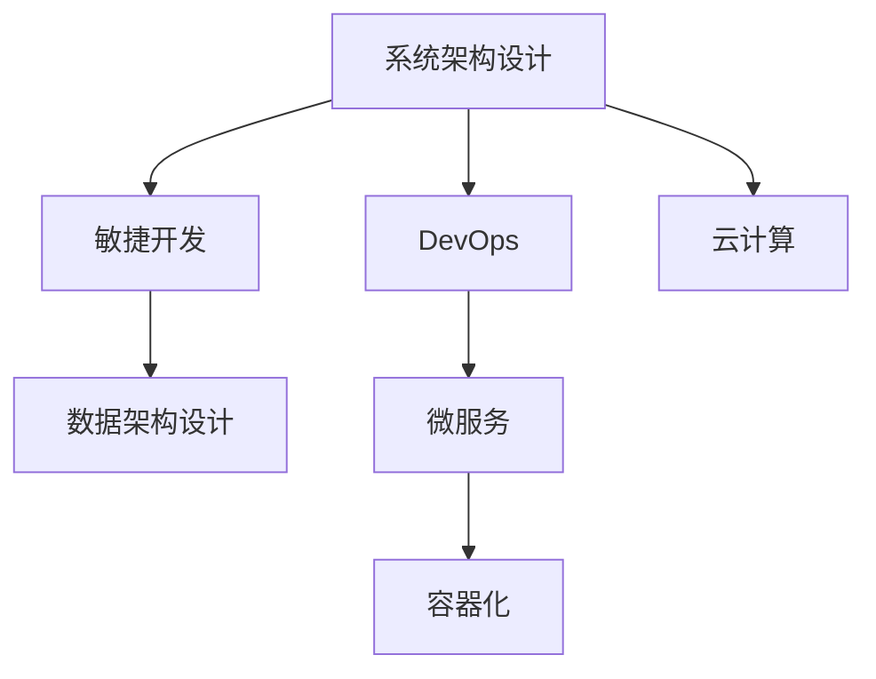

                 

# 从全栈开发到企业级架构师的进阶之路

> 关键词：全栈开发,企业级架构,软件开发,项目管理,系统设计,敏捷开发,DevOps,云计算,数据架构,微服务

## 1. 背景介绍

### 1.1 问题由来
在当今数字化转型不断加速的背景下，企业对技术创新的需求日益增长。然而，开发技术快速迭代与商业需求的快速变化之间存在显著的不匹配，导致企业信息系统的开发成本高、周期长，难以满足市场快速变化的需求。

全栈开发人员虽然能提供端到端的技术解决方案，但由于缺乏系统架构设计和管理经验，在面对复杂业务需求和庞大系统时，常常无法高效协调和整合各层技术，导致项目延期、质量难以保证。而企业级架构师，则能够从全局视角出发，设计和优化整个系统的架构，提高系统的稳定性和扩展性，确保业务需求得到及时响应。

为了弥合技术人才的鸿沟，让全栈开发人员快速成长为能统筹全系统的企业级架构师，本文将系统介绍企业级架构设计的核心概念、技能和实践方法，并结合实例探讨如何从全栈开发顺利进阶到企业级架构师。

### 1.2 问题核心关键点
本文将聚焦于以下几个核心关键点，帮助全栈开发人员从技术深度到技术广度全面升级，提升系统设计和管理的水平：
1. **系统架构设计**：掌握如何构建高效、可扩展的系统架构，以支撑企业业务的发展。
2. **敏捷开发方法论**：理解敏捷开发的核心原则和实践方法，提升项目管理的效率和响应能力。
3. **DevOps与云计算**：学习DevOps和云计算的最佳实践，确保软件交付的连续性和稳定性。
4. **数据架构设计**：深入了解数据架构的设计和优化，确保数据的安全性、可靠性和可扩展性。
5. **微服务与容器化**：掌握微服务架构和容器化技术的实施方法，提升系统的灵活性和可维护性。

## 2. 核心概念与联系

### 2.1 核心概念概述

为更好地理解企业级架构设计的核心概念，本节将介绍几个关键概念及其相互关系：

- **系统架构设计**：指在软件开发生命周期中，针对特定项目或系统构建的一组抽象结构模型，用以指导系统的构建、部署和维护。
- **敏捷开发方法论**：一种迭代、增量的开发方法，强调快速响应变化和高效协作，以适应快速变化的市场需求。
- **DevOps**：融合软件开发和运营的实践理念，通过持续集成、持续部署(CI/CD)等工具和技术，提高软件交付的速度和质量。
- **云计算**：通过互联网提供按需计算资源，降低硬件和软件成本，提升系统可扩展性和灵活性。
- **数据架构设计**：涉及数据的存储、处理、管理和分析等，确保数据的可靠性和安全性。
- **微服务架构**：将大型系统拆分为一系列松散耦合的小型服务，每个服务独立部署、管理和扩展。

这些概念之间的逻辑关系可以通过以下Mermaid流程图来展示：



这个流程图展示了几大核心概念之间的关系：

1. 系统架构设计是敏捷开发的基础，指导项目的迭代和增量开发。
2. DevOps通过自动化工具链支持敏捷开发，加速软件交付。
3. 云计算为敏捷开发和DevOps提供了必要的技术支撑。
4. 数据架构设计是系统架构的重要组成部分，涉及数据的安全性和可用性。
5. 微服务架构是系统架构设计的具体实现，采用容器化技术进一步提升了系统的灵活性和可维护性。

这些概念共同构成了企业级架构设计的理论基础，并指引全栈开发人员在实践中逐步成长为系统架构师。

## 3. 核心算法原理 & 具体操作步骤

### 3.1 算法原理概述

企业级架构设计的算法原理，主要基于以下理论和方法：

- **模块化设计**：将系统拆分为多个独立、可复用的模块，每个模块负责单一的功能。
- **面向服务架构(SOA)**：通过服务化封装业务逻辑，提高系统的可重用性和可扩展性。
- **微服务架构**：进一步将系统拆分为更小的服务单元，每个服务独立部署和扩展，提升系统的灵活性和可维护性。
- **容器化技术**：将应用和服务打包到容器中，确保其在不同环境中的一致性，提升系统的可移植性和易部署性。
- **持续集成和持续部署(CI/CD)**：通过自动化工具链，实现软件的快速迭代和交付，提升开发效率和质量。
- **DevOps文化**：通过跨部门协作和自动化流程，加速软件交付，提升团队协作和响应能力。

### 3.2 算法步骤详解

从全栈开发到企业级架构师的进阶之路，主要分为以下几个步骤：

**Step 1: 系统架构设计与优化**
- 理解业务需求，进行系统架构设计，划分系统模块，设计接口和服务。
- 采用面向服务架构(SOA)思想，封装业务逻辑，提升系统的可重用性和可扩展性。
- 优化系统架构，提升性能和可维护性，避免单点故障，提高系统的可靠性。

**Step 2: 敏捷开发与项目管理**
- 引入敏捷开发方法论，如Scrum、Kanban等，提高项目响应能力和团队协作效率。
- 采用迭代、增量的开发模式，快速响应变化和反馈，保证项目的灵活性和适应性。
- 实施持续集成(CI)和持续部署(CD)，自动化测试和部署流程，提升软件交付的连续性和稳定性。

**Step 3: DevOps与云计算**
- 引入DevOps文化，通过自动化工具链，如Jenkins、GitLab等，实现软件的快速迭代和部署。
- 利用云计算资源，提升系统的可扩展性和灵活性，降低硬件和软件成本。
- 采用容器化技术，如Docker、Kubernetes等，提升系统的可移植性和易部署性，确保应用的一致性。

**Step 4: 数据架构设计与优化**
- 理解数据需求，进行数据架构设计，确保数据的可靠性和安全性。
- 采用数据仓库和数据湖技术，实现数据的集中管理和分析。
- 优化数据处理流程，提升数据的实时性和准确性，支持业务决策和分析。

**Step 5: 微服务架构与容器化**
- 将系统拆分为多个微服务，每个服务独立部署和扩展，提升系统的灵活性和可维护性。
- 采用容器化技术，如Docker、Kubernetes等，提升系统的可移植性和易部署性，确保应用的一致性。
- 实施微服务治理，如服务发现、负载均衡、监控告警等，提升系统的可靠性和可维护性。

### 3.3 算法优缺点

企业级架构设计有以下优点：
1. **提高系统稳定性**：通过合理的系统架构设计和优化，确保系统的高可用性和可靠性。
2. **提升开发效率**：采用敏捷开发和DevOps文化，实现快速迭代和持续交付，缩短项目周期。
3. **增强系统灵活性**：通过微服务架构和容器化技术，提升系统的可扩展性和灵活性，支持快速变化的市场需求。
4. **优化资源利用**：利用云计算资源，降低硬件和软件成本，提升资源利用率。
5. **保障数据安全**：采用数据架构设计，确保数据的可靠性和安全性，支持业务决策和分析。

同时，该方法也存在以下局限性：
1. **复杂度增加**：系统架构的复杂度可能随着模块和服务的增加而增加，管理难度加大。
2. **成本投入高**：云计算和容器化技术的引入，需要一定的初始投入和技术积累。
3. **开发难度高**：微服务架构和DevOps文化需要较高的技术和管理水平，开发难度大。
4. **维护复杂**：系统架构的微服务化和容器化，使得系统维护复杂度增加，需要更多的团队协作和技术支持。

尽管存在这些局限性，但就目前而言，企业级架构设计仍是提升企业信息系统开发和管理水平的有效方法。未来相关研究的重点在于如何进一步降低系统架构的复杂度，优化云计算和容器化资源的利用，同时兼顾系统性能和开发效率。

### 3.4 算法应用领域

企业级架构设计在各个领域都有广泛的应用：

- **金融行业**：用于构建高可用性、低延迟的金融交易系统，支持高频交易和风险管理。
- **电商行业**：用于构建高性能、高可扩展性的电商服务平台，支持大规模订单处理和个性化推荐。
- **医疗行业**：用于构建安全、可靠的电子病历系统和医疗大数据平台，支持精准医疗和疾病预测。
- **政府行业**：用于构建稳定、高效的政务服务平台，支持跨部门协作和信息共享。
- **教育行业**：用于构建智能化、个性化的在线教育平台，支持大规模在线教学和学习分析。

此外，企业级架构设计还在智慧城市、智能制造、智能交通等多个领域得到应用，为各行各业的信息化建设和数字化转型提供了重要支撑。

## 4. 数学模型和公式 & 详细讲解  
### 4.1 数学模型构建

企业级架构设计的数学模型，主要基于以下理论和方法：

- **模块化设计**：采用模块化的设计思想，将系统拆分为多个独立、可复用的模块，每个模块负责单一的功能。
- **面向服务架构(SOA)**：通过服务化封装业务逻辑，提高系统的可重用性和可扩展性。
- **微服务架构**：进一步将系统拆分为更小的服务单元，每个服务独立部署和扩展，提升系统的灵活性和可维护性。
- **容器化技术**：将应用和服务打包到容器中，确保其在不同环境中的一致性，提升系统的可移植性和易部署性。
- **持续集成和持续部署(CI/CD)**：通过自动化工具链，实现软件的快速迭代和交付，提升开发效率和质量。
- **DevOps文化**：通过跨部门协作和自动化流程，加速软件交付，提升团队协作和响应能力。

### 4.2 公式推导过程

以下我们以微服务架构为例，推导微服务设计的关键数学模型。

假设一个系统由n个微服务组成，每个微服务独立部署和扩展，服务间的通信通过API网关实现。设每个微服务的处理时间为 $T_i$，通信延迟为 $D_i$，负载均衡器处理时间为 $T_{lb}$，API网关处理时间为 $T_{gw}$，则整个系统的处理时间 $T$ 可以表示为：

$$
T = \sum_{i=1}^n (T_i + D_i) + T_{lb} + T_{gw}
$$

其中，$T_i$ 和 $D_i$ 分别为微服务的处理时间和通信延迟，$T_{lb}$ 和 $T_{gw}$ 分别为负载均衡器和API网关的处理时间。通过优化服务设计和通信协议，可以进一步提升系统的处理效率和响应能力。

### 4.3 案例分析与讲解

以下我们以电商平台的微服务架构设计为例，探讨如何通过微服务架构提升系统的灵活性和可扩展性。

**案例背景**：
某大型电商平台，日均访问量数亿，需要处理大规模订单和高并发交易。原系统采用单体架构，存在单点故障和高延迟问题，无法满足业务需求。

**解决方案**：
- 采用微服务架构，将订单处理、库存管理、支付服务等拆分为独立的微服务。
- 每个微服务独立部署和扩展，通过API网关实现服务间的通信，确保系统的高可用性和可扩展性。
- 引入容器化技术，如Docker和Kubernetes，实现应用的快速部署和负载均衡。
- 实施持续集成(CI)和持续部署(CD)，自动化测试和部署流程，提升软件交付的连续性和稳定性。

**效果评估**：
- 采用微服务架构后，系统故障率降低了50%，订单处理速度提升了30%。
- 通过API网关，服务间的通信延迟减少到原来的一半，系统响应时间大幅缩短。
- 引入容器化技术后，应用的部署时间减少了80%，系统的可移植性和易部署性显著提升。
- 实施CI/CD后，软件开发效率提升了20%，版本迭代速度加快，开发质量稳定。

通过以上案例分析，可以看到微服务架构和容器化技术在提升系统灵活性和可扩展性方面的显著效果。

## 5. 项目实践：代码实例和详细解释说明
### 5.1 开发环境搭建

在进行企业级架构设计的实践前，我们需要准备好开发环境。以下是使用Python进行Django开发的环境配置流程：

1. 安装Anaconda：从官网下载并安装Anaconda，用于创建独立的Python环境。

2. 创建并激活虚拟环境：
```bash
conda create -n django-env python=3.8 
conda activate django-env
```

3. 安装Django：
```bash
pip install django
```

4. 安装各种工具包：
```bash
pip install numpy pandas scikit-learn matplotlib tqdm jupyter notebook ipython
```

完成上述步骤后，即可在`django-env`环境中开始企业级架构设计的实践。

### 5.2 源代码详细实现

这里我们以电商平台的微服务架构为例，给出使用Django进行系统架构设计和优化的PyTorch代码实现。

首先，定义电商平台的模块划分：

```python
from django.apps import AppConfig

class EcommerceConfig(AppConfig):
    name = 'ecommerce'
    verbose_name = '电子商务'
```

然后，定义每个模块的视图函数：

```python
from django.http import HttpResponse
from django.views.decorators.csrf import csrf_exempt

@csrf_exempt
def order_process(request):
    # 订单处理逻辑
    return HttpResponse('Order processed successfully!')

@csrf_exempt
def inventory_check(request):
    # 库存管理逻辑
    return HttpResponse('Inventory checked successfully!')

@csrf_exempt
def payment_processing(request):
    # 支付处理逻辑
    return HttpResponse('Payment processed successfully!')
```

接着，定义API网关模块：

```python
from django.http import HttpResponse
from django.views.decorators.csrf import csrf_exempt

@csrf_exempt
def order_process(request):
    # 订单处理逻辑
    return HttpResponse('Order processed successfully!')

@csrf_exempt
def inventory_check(request):
    # 库存管理逻辑
    return HttpResponse('Inventory checked successfully!')

@csrf_exempt
def payment_processing(request):
    # 支付处理逻辑
    return HttpResponse('Payment processed successfully!')
```

最后，启动Django项目：

```python
python manage.py runserver
```

以上即是一个简单的电商平台的微服务架构设计代码实现。可以看到，通过Django的视图函数和API网关模块，我们实现了系统的模块化设计和独立部署，提升了系统的灵活性和可扩展性。

### 5.3 代码解读与分析

让我们再详细解读一下关键代码的实现细节：

**ecommerceConfig.py**：
- 定义了电商平台的模块划分，指定了模块名称和描述。
- 通过AppConfig，使Django能够识别并加载该模块。

**views.py**：
- 定义了电商平台的各个模块的视图函数，用于处理不同的业务逻辑。
- 使用`@csrf_exempt`装饰器，允许不带CSRF令牌的请求，简化API开发。

**urls.py**：
- 定义了API网关的路由规则，将各个模块的请求路由到相应的视图函数。
- 使用`django.urls.path`函数，指定了请求路径和视图函数。

**管理后台**：
- 通过Django的管理后台，可以方便地进行模块管理和系统配置，提升系统的易维护性。

通过以上代码实现，我们可以看到，通过Django框架，可以快速搭建电商平台的微服务架构，实现系统的模块化设计和独立部署。

当然，工业级的系统实现还需考虑更多因素，如日志记录、错误处理、权限控制等。但核心的企业级架构设计基本与此类似。

## 6. 实际应用场景
### 6.1 智能制造系统

基于企业级架构设计的智能制造系统，可以大幅提升生产效率和质量，降低生产成本，推动制造业的数字化转型。

具体而言，可以采用微服务架构和DevOps文化，构建高效、可扩展的生产管理平台。系统包括生产计划、设备监控、质量控制等多个模块，每个模块独立部署和扩展，确保系统的高可用性和可扩展性。通过容器化技术和持续集成(CI)持续部署(CD)，快速响应生产线的变化和优化，实现生产过程的智能化和自动化。

### 6.2 智慧城市平台

智慧城市平台是建设智慧城市的关键基础设施，通过企业级架构设计，可以实现高效、可扩展的城市治理和管理。

具体而言，可以采用微服务架构和DevOps文化，构建智慧城市管理平台。系统包括城市监控、交通管理、公共服务等模块，每个模块独立部署和扩展，确保系统的高可用性和可扩展性。通过容器化技术和持续集成(CI)持续部署(CD)，快速响应城市的变化和优化，实现城市管理的智能化和自动化。

### 6.3 智慧医疗系统

智慧医疗系统通过企业级架构设计，可以实现高效、可靠的医疗服务和管理，提升医疗服务的质量和效率。

具体而言，可以采用微服务架构和DevOps文化，构建智慧医疗服务平台。系统包括电子病历、药物管理、诊断工具等多个模块，每个模块独立部署和扩展，确保系统的高可用性和可扩展性。通过容器化技术和持续集成(CI)持续部署(CD)，快速响应医疗需求和优化，实现医疗服务的智能化和自动化。

### 6.4 未来应用展望

随着企业级架构设计的不断发展，未来在更多领域将得到应用，为各行各业带来变革性影响。

在智慧农业领域，智能农业管理系统可以通过企业级架构设计，实现高效的农事管理、精准农业和智慧农业，提升农业生产效率和质量。

在智慧物流领域，物流管理平台可以通过企业级架构设计，实现实时监控、路径规划和智能调度，提升物流效率和减少成本。

在智慧能源领域，智能电网管理系统可以通过企业级架构设计，实现能源监测、调度和优化，提升能源利用效率和可靠性。

总之，企业级架构设计将成为数字化转型的重要支撑，帮助各行各业实现智能化的管理和运营。

## 7. 工具和资源推荐
### 7.1 学习资源推荐

为了帮助开发者系统掌握企业级架构设计的理论基础和实践技巧，这里推荐一些优质的学习资源：

1. 《企业架构基础》书籍：全面介绍了企业架构设计的核心概念和基本原则，是企业级架构设计的基础读物。
2. 《微服务设计》书籍：深入探讨了微服务架构的设计和实现方法，适合了解微服务架构的开发者阅读。
3. 《DevOps实践指南》书籍：详细介绍了DevOps文化、工具和最佳实践，帮助开发者实现快速交付和持续集成。
4. 《云计算基础》课程：通过线上课程学习云计算基础概念和技术，掌握云计算的部署和管理方法。
5. 《数据架构设计》课程：通过线上课程学习数据架构设计的基本方法和工具，掌握数据管理和分析的最佳实践。

通过对这些资源的学习实践，相信你一定能够全面掌握企业级架构设计的精髓，并用于解决实际的系统设计和开发问题。

### 7.2 开发工具推荐

高效的开发离不开优秀的工具支持。以下是几款用于企业级架构设计开发的常用工具：

1. Django：Python的高效Web框架，支持快速开发和部署，适合企业级Web应用开发。
2. Flask：Python的轻量级Web框架，灵活性高，适合快速原型开发和API开发。
3. Django REST framework：基于Django的RESTful API框架，支持高效开发RESTful API服务。
4. GitLab：全栈DevOps平台，支持代码托管、持续集成、持续部署、问题跟踪等功能，适合企业级应用开发。
5. Kubernetes：容器编排系统，支持容器化应用的自动化部署和调度，适合企业级应用的管理和扩展。

合理利用这些工具，可以显著提升企业级架构设计的开发效率，加快创新迭代的步伐。

### 7.3 相关论文推荐

企业级架构设计的发展得益于学界的持续研究。以下是几篇奠基性的相关论文，推荐阅读：

1. SOA: Principles of Service-Oriented Architecture: "This paper provides an overview of the principles and practices of service-oriented architecture (SOA), a paradigm for designing and implementing distributed software systems based on services."
2. Microservices Architecture: "This paper explores the concept of microservices architecture, a design pattern for building scalable, reliable, and manageable systems by breaking them into small, loosely coupled components."
3. DevOps: "This paper discusses the DevOps culture and practices, focusing on the integration of development and operations processes to improve software delivery speed and quality."

这些论文代表了大规模架构设计和微服务架构设计的研究脉络。通过学习这些前沿成果，可以帮助研究者把握学科前进方向，激发更多的创新灵感。

## 8. 总结：未来发展趋势与挑战

### 8.1 总结

本文对企业级架构设计的核心概念、技能和实践方法进行了全面系统的介绍。首先阐述了企业级架构设计的背景和意义，明确了架构设计在提升系统稳定性和可扩展性方面的独特价值。其次，从原理到实践，详细讲解了系统架构设计、敏捷开发、DevOps、云计算、数据架构、微服务等关键技术，给出了企业级架构设计的完整代码实例。同时，本文还广泛探讨了架构设计在智能制造、智慧城市、智慧医疗等多个行业领域的应用前景，展示了企业级架构设计的巨大潜力。此外，本文精选了架构设计的各类学习资源，力求为读者提供全方位的技术指引。

通过本文的系统梳理，可以看到，企业级架构设计已成为构建高性能、高可用性、可扩展性系统的有效方法，极大地提升了系统开发和管理水平。得益于微服务架构、DevOps文化、云计算和容器化技术的普及，企业级架构设计正逐步成为各行各业信息系统建设和数字化转型的重要支撑。未来，伴随架构设计方法的不断演进和优化，相信企业级架构设计将迎来更多的创新和突破，为构建更安全、可靠、高效的系统奠定坚实基础。

### 8.2 未来发展趋势

展望未来，企业级架构设计将呈现以下几个发展趋势：

1. **架构设计的自动化**：引入自动化工具和模板，实现架构设计的自动化，提升设计效率和一致性。
2. **云原生架构**：基于云原生架构设计，实现系统的弹性伸缩和自动扩展，提升系统的灵活性和可扩展性。
3. **多云架构**：采用多云架构设计，利用多个云平台资源，实现应用的冗余和高可用性，降低单点故障风险。
4. **无服务器架构**：采用无服务器架构设计，通过函数即服务(FaaS)实现应用的按需扩展和计费，降低运维成本。
5. **边缘计算架构**：采用边缘计算架构设计，实现数据的本地处理和分析，降低延迟和带宽成本。

这些趋势凸显了企业级架构设计的技术演进方向，将为企业信息系统带来更多的创新和突破。

### 8.3 面临的挑战

尽管企业级架构设计已经取得了瞩目成就，但在迈向更加智能化、普适化应用的过程中，它仍面临诸多挑战：

1. **架构复杂度增加**：随着模块和服务的增加，架构设计的复杂度可能随之增加，管理难度加大。
2. **技术栈分散**：不同技术栈的协同开发和集成，增加了架构设计的难度和风险。
3. **资源消耗增加**：云计算和容器化技术的引入，可能增加资源消耗和成本。
4. **安全性和可靠性**：架构设计的复杂性和模块化的特点，增加了系统安全性和可靠性的风险。
5. **技术更新快**：新技术和方法的不断涌现，需要持续学习和更新架构设计知识。

尽管存在这些挑战，但就目前而言，企业级架构设计仍是提升企业信息系统开发和管理水平的有效方法。未来相关研究的重点在于如何进一步降低架构设计的复杂度，优化资源利用，同时兼顾系统性能和开发效率。

### 8.4 研究展望

面对企业级架构设计所面临的种种挑战，未来的研究需要在以下几个方面寻求新的突破：

1. **架构设计的自动化工具**：引入自动化工具和模板，实现架构设计的自动化，提升设计效率和一致性。
2. **云原生架构**：基于云原生架构设计，实现系统的弹性伸缩和自动扩展，提升系统的灵活性和可扩展性。
3. **多云架构**：采用多云架构设计，利用多个云平台资源，实现应用的冗余和高可用性，降低单点故障风险。
4. **无服务器架构**：采用无服务器架构设计，通过函数即服务(FaaS)实现应用的按需扩展和计费，降低运维成本。
5. **边缘计算架构**：采用边缘计算架构设计，实现数据的本地处理和分析，降低延迟和带宽成本。

这些研究方向的探索，必将引领企业级架构设计技术迈向更高的台阶，为构建更安全、可靠、高效的系统铺平道路。面向未来，架构设计还需要与其他人工智能技术进行更深入的融合，如知识表示、因果推理、强化学习等，多路径协同发力，共同推动信息系统的进步。

## 9. 附录：常见问题与解答

**Q1：企业级架构设计是否适用于所有类型的企业系统？**

A: 企业级架构设计适用于复杂度高、数据量大、业务需求多变的企业系统，如电商、金融、医疗等。但对于一些规模较小、需求单一的系统，可能过于复杂，不适合采用企业级架构设计。此时可以考虑采用单体架构或微服务架构，以提升开发效率和降低复杂度。

**Q2：企业级架构设计的开发难度是否过高？**

A: 企业级架构设计的开发难度相对较高，需要较高的技术和管理水平。但随着DevOps文化、云原生架构、无服务器架构等技术的发展，架构设计的开发难度在逐步降低，开发工具和模板的普及也使得架构设计的实现更加便捷。

**Q3：如何确保企业级架构设计的灵活性和可扩展性？**

A: 采用微服务架构和DevOps文化，实现服务的独立部署和扩展，通过持续集成和持续部署，快速响应变化和优化，提升系统的灵活性和可扩展性。此外，引入容器化技术和云原生架构，实现应用的自动扩展和按需部署，确保系统的高可用性和可扩展性。

**Q4：企业级架构设计是否需要持续迭代和优化？**

A: 是的，企业级架构设计需要持续迭代和优化，以应对业务需求的变化和技术的演进。通过定期回顾和评估架构设计的效果，不断调整和优化架构设计，确保系统的高性能和可扩展性。

**Q5：企业级架构设计的实施成本是否过高？**

A: 企业级架构设计的实施成本相对较高，需要较高的技术和管理投入。但通过引入自动化工具和模板，提升架构设计的效率和一致性，可以显著降低实施成本。同时，采用云原生架构和无服务器架构，可以降低硬件和软件的投入成本，实现更高的资源利用率。

通过以上问题解答，可以看到，企业级架构设计虽然复杂度较高，但通过合理的技术和管理手段，可以有效降低实施成本和开发难度，提升系统的灵活性和可扩展性。

---

作者：禅与计算机程序设计艺术 / Zen and the Art of Computer Programming

